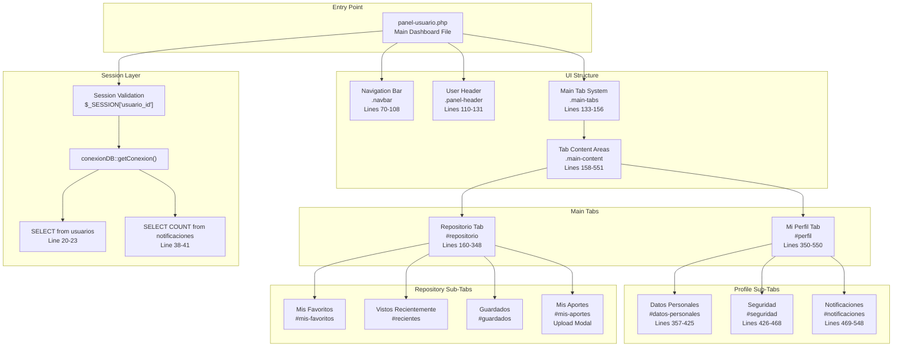
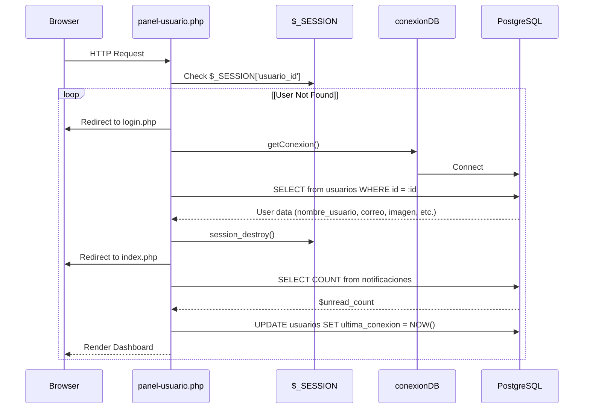
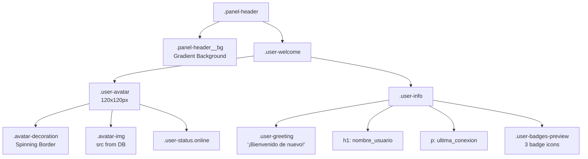
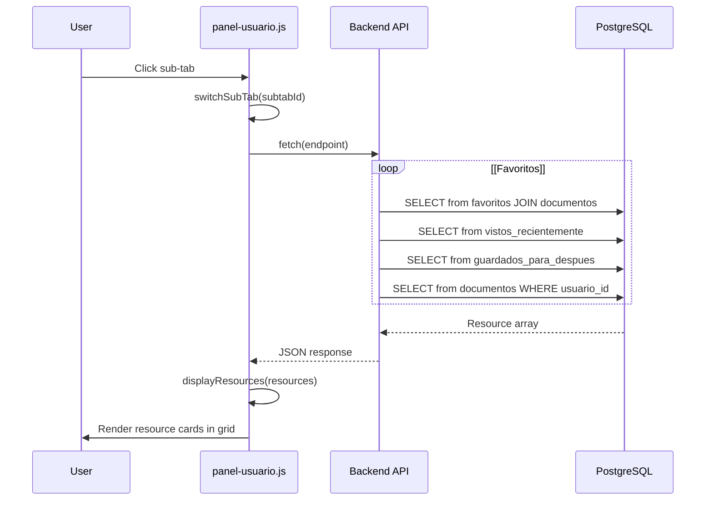
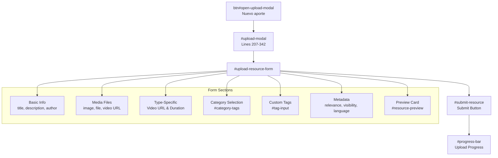
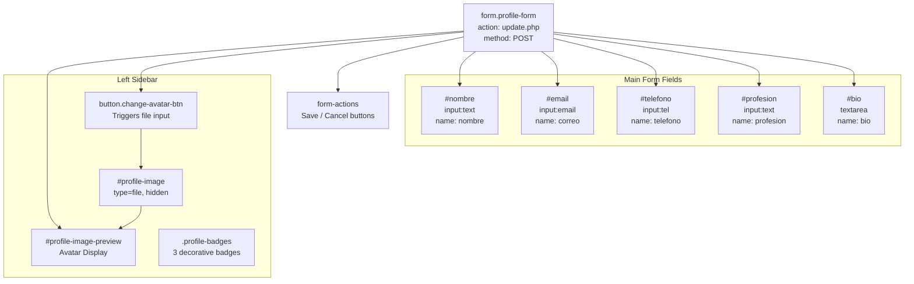

# Panel de Usuario (Panel Usuario)

> **Archivos fuente relevantes**
> * [src/backend/gestionRecursos/get_categories.php](https://github.com/axchisan/El-rincon-de-ADSO/blob/3e310227/src/backend/gestionRecursos/get_categories.php)
> * [src/backend/gestionRecursos/get_user_groups.php](https://github.com/axchisan/El-rincon-de-ADSO/blob/3e310227/src/backend/gestionRecursos/get_user_groups.php)
> * [src/frontend/inicio/index.php](https://github.com/axchisan/El-rincon-de-ADSO/blob/3e310227/src/frontend/inicio/index.php)
> * [src/frontend/panel/css/styles-panel.css](https://github.com/axchisan/El-rincon-de-ADSO/blob/3e310227/src/frontend/panel/css/styles-panel.css)
> * [src/frontend/panel/panel-usuario.php](https://github.com/axchisan/El-rincon-de-ADSO/blob/3e310227/src/frontend/panel/panel-usuario.php)
> * [src/frontend/repositorio/repositorio.php](https://github.com/axchisan/El-rincon-de-ADSO/blob/3e310227/src/frontend/repositorio/repositorio.php)
> * [src/uploads/6805c8bb76358_cover.png](https://github.com/axchisan/El-rincon-de-ADSO/blob/3e310227/src/uploads/6805c8bb76358_cover.png)
> * [src/uploads/6805c8bb765ca.pdf](https://github.com/axchisan/El-rincon-de-ADSO/blob/3e310227/src/uploads/6805c8bb765ca.pdf)

## Propósito y alcance

El Panel de Usuario ( `panel-usuario.php`) es el centro de control central para los usuarios autenticados en El Rincón de ADSO. Esta página sirve como interfaz principal donde los usuarios administran sus recursos, la configuración de su perfil y las preferencias de su cuenta. Es el componente más importante del sistema (puntuación de importancia: 61.49).

El panel de control ofrece dos áreas funcionales principales:

* **Gestión del repositorio** : vea y administre recursos favoritos, vistos recientemente, guardados y contribuciones personales.
* **Gestión de perfiles** : actualice información personal, cambie contraseña y configure preferencias de notificación

Para obtener información sobre el flujo de autenticación que otorga acceso a este panel, consulte [Sistema de autenticación](/axchisan/El-rincon-de-ADSO/3-authentication-system) . Para obtener más información sobre la mecánica de carga de recursos, consulte [Carga y administración de recursos](/axchisan/El-rincon-de-ADSO/4.3-resource-upload-and-management) . Para conocer la lógica de actualización de perfiles, consulte [Administración de perfiles](/axchisan/El-rincon-de-ADSO/4.2-profile-management) .

**Fuentes:** [src/frontend/panel/panel-usuario.php L1-L54](https://github.com/axchisan/El-rincon-de-ADSO/blob/3e310227/src/frontend/panel/panel-usuario.php#L1-L54)

---

## Descripción general de la arquitectura

El panel de usuario sigue un patrón de interfaz de múltiples pestañas con subpestañas anidadas, implementado completamente como una aplicación de una sola página que utiliza PHP para la representación del lado del servidor y JavaScript básico para las interacciones del lado del cliente.

### Estructura de los componentes del sistema



**Fuentes:** [src/frontend/panel/panel-usuario.php L1-L551](https://github.com/axchisan/El-rincon-de-ADSO/blob/3e310227/src/frontend/panel/panel-usuario.php#L1-L551)

 [src/frontend/panel/css/styles-panel.css L442-L550](https://github.com/axchisan/El-rincon-de-ADSO/blob/3e310227/src/frontend/panel/css/styles-panel.css#L442-L550)

---

## Gestión de sesiones y control de acceso

### Requisitos de autenticación

El panel implementa un estricto control de acceso basado en sesiones. Los usuarios no autenticados son redirigidos inmediatamente a la página de inicio de sesión.



### Implementación de la comprobación de sesión

| Controlar | Ubicación | Acción ante el fracaso |
| --- | --- | --- |
| Existencia de sesión | [panel-usuario.php L10-L13](https://github.com/axchisan/El-rincon-de-ADSO/blob/3e310227/panel-usuario.php#L10-L13) | Redirect to `login.php` |
| User record validity | [panel-usuario.php L25-L29](https://github.com/axchisan/El-rincon-de-ADSO/blob/3e310227/panel-usuario.php#L25-L29) | Destroy session, redirect to `index.php` |
| Database connection | [panel-usuario.php L42-L46](https://github.com/axchisan/El-rincon-de-ADSO/blob/3e310227/panel-usuario.php#L42-L46) | Destroy session, redirect to `index.php` |

### User Data Retrieval

The dashboard retrieves comprehensive user data on page load:

```sql
// Query executed at line 20-23
SELECT nombre_usuario, correo, telefono, profesion, bio, ultima_conexion, imagen 
FROM usuarios 
WHERE id = :id
```

This data populates:

* User header display (lines 113-129)
* Profile form fields (lines 396-422)
* Avatar image with cache-busting parameter (line 35)

**Sources:** [src/frontend/panel/panel-usuario.php L1-L54](https://github.com/axchisan/El-rincon-de-ADSO/blob/3e310227/src/frontend/panel/panel-usuario.php#L1-L54)

 [src/database/conexionDB.php L1-L50](https://github.com/axchisan/El-rincon-de-ADSO/blob/3e310227/src/database/conexionDB.php#L1-L50)

---

## User Interface Structure

### Header Component

The user header displays personalized welcome information and decorative badges.

**Key Elements:**

* **Avatar Section** (`.user-avatar`): 120px circular image with animated decorative border and online status indicator
* **User Info** (`.user-info`): Greeting text, username in 2rem font, last connection timestamp
* **Badge Preview** (`.user-badges-preview`): Three hardcoded decorative badges (Collaborator, Python Expert, Mentor)



**Sources:** [src/frontend/panel/panel-usuario.php L110-L131](https://github.com/axchisan/El-rincon-de-ADSO/blob/3e310227/src/frontend/panel/panel-usuario.php#L110-L131)

 [src/frontend/panel/css/styles-panel.css L274-L440](https://github.com/axchisan/El-rincon-de-ADSO/blob/3e310227/src/frontend/panel/css/styles-panel.css#L274-L440)

### Navigation Tabs System

The dashboard uses a two-level tab system:

**Main Tabs** (`.main-tabs`): Top-level navigation between major sections

* Sticky positioning at `top: 70px`
* Located at lines 133-156
* Two tabs: "Repositorio" (`data-tab="repositorio"`) and "Mi Perfil" (`data-tab="perfil"`)

**Sub Tabs** (`.sub-tabs`): Secondary navigation within each main section

* Centered flex layout with horizontal scrolling
* Repository has 4 sub-tabs (lines 161-166)
* Profile has 3 sub-tabs (lines 351-354)

### Tab Activation Logic

The JavaScript tab system (lines 681-737) manages visibility:

```javascript
// Main tabs switching at lines 681-707
mainTabs.forEach(tab => {
    tab.addEventListener('click', function() {
        const targetTab = this.getAttribute('data-tab');
        // Remove active classes
        mainTabs.forEach(t => t.classList.remove('active'));
        tabSections.forEach(section => section.classList.remove('active'));
        // Add active classes
        this.classList.add('active');
        document.getElementById(targetTab).classList.add('active');
    });
});
```

**Sources:** [src/frontend/panel/panel-usuario.php L133-L156](https://github.com/axchisan/El-rincon-de-ADSO/blob/3e310227/src/frontend/panel/panel-usuario.php#L133-L156)

 [src/frontend/panel/panel-usuario.php L681-L737](https://github.com/axchisan/El-rincon-de-ADSO/blob/3e310227/src/frontend/panel/panel-usuario.php#L681-L737)

---

## Repository Tab - Resource Collections

The Repository tab displays four distinct collections of resources, each loaded asynchronously via API calls.

### Sub-Tab Structure

| Sub-Tab ID | Title | API Endpoint | Description |
| --- | --- | --- | --- |
| `#mis-favoritos` | Mis Favoritos | `get_user_favorites.php` | Resources marked as favorite |
| `#recientes` | Vistos Recientemente | `get_recently_viewed.php` | Last 50 viewed resources |
| `#guardados` | Guardados | `get_saved_resources.php` | Resources saved for later |
| `#mis-aportes` | Mis Aportes | `get_user_resources.php` | User's uploaded resources |

### Data Flow for Resource Loading



### Resource Card Rendering

Each resource is displayed as a `.resource-card` with the following structure:

**Card Components:**

* Image container with format badge (libro/video/documento)
* Play button overlay (videos only)
* Duration display (videos only)
* Content section with title, author, category, tags
* Action buttons: View, Favorite/Unfavorite, Save, Edit/Delete (own resources)

The `displayResources()` function (lines 781-1001) generates HTML dynamically:

```javascript
// Example card generation at lines 781-900
function displayResources(resources, containerId, showEditDelete = false) {
    const container = document.getElementById(containerId);
    if (resources.length === 0) {
        // Show empty state
    } else {
        resources.forEach(resource => {
            const card = `
                <div class="resource-card">
                    <div class="resource-card__image-container">
                        
                        <span class="resource-card__format">${resource.tipo}</span>
                        ${resource.tipo === 'video' ? playButton : ''}
                    </div>
                    <div class="resource-card__content">
                        <h3 class="resource-card__title">${resource.titulo}</h3>
                        <p class="resource-card__author">${resource.autor}</p>
                        <!-- Actions -->
                    </div>
                </div>
            `;
        });
    }
}
```

**Sources:** [src/frontend/panel/panel-usuario.php L160-L348](https://github.com/axchisan/El-rincon-de-ADSO/blob/3e310227/src/frontend/panel/panel-usuario.php#L160-L348)

 [src/frontend/panel/panel-usuario.php L781-L1001](https://github.com/axchisan/El-rincon-de-ADSO/blob/3e310227/src/frontend/panel/panel-usuario.php#L781-L1001)

### API Endpoints for Resource Collections

Each collection has a dedicated PHP endpoint:

| File | Purpose | Query |
| --- | --- | --- |
| [get_user_favorites.php](https://github.com/axchisan/El-rincon-de-ADSO/blob/3e310227/get_user_favorites.php) | Fetch favorited resources | `SELECT d.* FROM favoritos f JOIN documentos d ON f.documento_id = d.id WHERE f.usuario_id = :user_id` |
| [get_recently_viewed.php](https://github.com/axchisan/El-rincon-de-ADSO/blob/3e310227/get_recently_viewed.php) | Fetch recently viewed | `SELECT d.* FROM vistos_recientemente vr JOIN documentos d ON vr.documento_id = d.id WHERE vr.usuario_id = :user_id ORDER BY vr.fecha_visualizacion DESC LIMIT 50` |
| [get_saved_resources.php](https://github.com/axchisan/El-rincon-de-ADSO/blob/3e310227/get_saved_resources.php) | Fetch saved resources | `SELECT d.* FROM guardados_para_despues g JOIN documentos d ON g.documento_id = d.id WHERE g.usuario_id = :user_id` |
| [get_user_resources.php](https://github.com/axchisan/El-rincon-de-ADSO/blob/3e310227/get_user_resources.php) | Fetch user's uploads | `SELECT * FROM documentos WHERE usuario_id = :user_id ORDER BY fecha_publicacion DESC` |

**Sources:** [src/backend/gestionRecursos/get_user_favorites.php](https://github.com/axchisan/El-rincon-de-ADSO/blob/3e310227/src/backend/gestionRecursos/get_user_favorites.php)

 [src/backend/gestionRecursos/get_recently_viewed.php](https://github.com/axchisan/El-rincon-de-ADSO/blob/3e310227/src/backend/gestionRecursos/get_recently_viewed.php)

 [src/backend/gestionRecursos/get_saved_resources.php](https://github.com/axchisan/El-rincon-de-ADSO/blob/3e310227/src/backend/gestionRecursos/get_saved_resources.php)

 [src/backend/gestionRecursos/get_user_resources.php](https://github.com/axchisan/El-rincon-de-ADSO/blob/3e310227/src/backend/gestionRecursos/get_user_resources.php)

---

## Resource Upload Modal

The "Mis Aportes" sub-tab includes an upload modal (`#upload-modal`) that allows users to contribute new resources to the repository.

### Modal Structure and Form Fields

The modal contains a comprehensive form (lines 207-342) with the following fields:

**Core Fields:**

| Field ID | Type | Required | Purpose |
| --- | --- | --- | --- |
| `resource-title` | text | Yes | Resource title |
| `resource-description` | textarea | No | Detailed description |
| `resource-author` | text | Yes | Author name |
| `resource-image` | file | Yes* | Cover image (portada) |
| `resource-type` | select | Yes | Type: libro/video/documento/imagen/otro |
| `resource-file` | file | Conditional | Actual resource file (PDF, DOCX, etc.) |

**Video-Specific Fields** (shown when type="video"):

* `resource-video-url`: YouTube URL input
* `resource-video-duration`: Duration in HH:MM:SS format
* `#video-preview`: Live preview div for YouTube embed

**Advanced Fields:**

| Field | Options | Default |
| --- | --- | --- |
| `resource-relevance` | Low/Medium/High/Critical | Medium |
| `resource-visibility` | Public/Private/Group | Public |
| `resource-language` | es/en/fr/de | es |
| `resource-license` | CC BY-SA/CC BY-NC/Public Domain/All Rights Reserved | CC BY-SA |
| `resource-status` | Published/Draft/Pending Review | Published |

### Category and Tag Selection

**Categories:** Multi-select system using tag buttons

* Categories loaded from `get_categories.php` (line 1009-1030)
* Displayed as clickable pills in `#category-tags` div
* Selected categories stored in hidden input `#selected-categories`

**Tags:** Custom tag input system

* Users can add custom tags via `#tag-input` field
* Tags added by pressing Enter, comma, or clicking "Añadir" button
* Tags displayed as removable pills in `#custom-tags` div
* Logic implemented at lines 1107-1173



### Upload Process Flow

The upload is handled by `handleResourceUpload()` function (lines 1195-1370):

1. **Validation:** Check required fields (title, author, image, type)
2. **Form Data Assembly:** Create `FormData` object with all fields
3. **AJAX Upload:** POST to `upload_resource.php` with progress tracking
4. **Progress Bar:** Update `#progress-bar-fill` width as upload proceeds
5. **Response Handling:** Display success/error messages
6. **Resource Reload:** Refresh "Mis Aportes" grid with new resource

```javascript
// Upload implementation at lines 1195-1370
function handleResourceUpload() {
    const formData = new FormData();
    // Append all form fields
    formData.append('title', document.getElementById('resource-title').value);
    formData.append('categories', document.getElementById('selected-categories').value);
    // ... more fields
    
    const xhr = new XMLHttpRequest();
    xhr.upload.addEventListener('progress', (e) => {
        const percentComplete = (e.loaded / e.total) * 100;
        document.getElementById('progress-bar-fill').style.width = percentComplete + '%';
    });
    xhr.open('POST', '../../backend/gestionRecursos/upload_resource.php', true);
    xhr.send(formData);
}
```

**Sources:** [src/frontend/panel/panel-usuario.php L207-L342](https://github.com/axchisan/El-rincon-de-ADSO/blob/3e310227/src/frontend/panel/panel-usuario.php#L207-L342)

 [src/frontend/panel/panel-usuario.php L1195-L1370](https://github.com/axchisan/El-rincon-de-ADSO/blob/3e310227/src/frontend/panel/panel-usuario.php#L1195-L1370)

 [src/backend/gestionRecursos/upload_resource.php](https://github.com/axchisan/El-rincon-de-ADSO/blob/3e310227/src/backend/gestionRecursos/upload_resource.php)

---

## Profile Tab - User Settings Management

The Profile tab provides three sub-sections for managing account information and preferences.

### Datos Personales (Personal Data)

Located at lines 357-425, this section allows users to update their profile information.

**Form Structure:**



**Avatar Upload:**

* Clicking `.change-avatar-btn` triggers hidden file input (line 378)
* `previewProfileImage()` function (lines 564-573) provides instant preview
* Updates both sidebar avatar and header avatar in real-time

**Form Submission:**

* POST to `../../backend/perfil/update.php`
* Includes all profile fields plus optional image file
* On success, session message displayed at lines 362-372

**Sources:** [src/frontend/panel/panel-usuario.php L357-L425](https://github.com/axchisan/El-rincon-de-ADSO/blob/3e310227/src/frontend/panel/panel-usuario.php#L357-L425)

 [src/frontend/panel/panel-usuario.php L564-L573](https://github.com/axchisan/El-rincon-de-ADSO/blob/3e310227/src/frontend/panel/panel-usuario.php#L564-L573)

 [src/backend/perfil/update.php](https://github.com/axchisan/El-rincon-de-ADSO/blob/3e310227/src/backend/perfil/update.php)

### Seguridad (Security)

The security sub-tab (lines 426-468) focuses on password management.

**Password Change Form:**

| Field | ID | Validation |
| --- | --- | --- |
| Current Password | `current-password` | Required |
| New Password | `new-password` | Min 1 uppercase, 3 numbers, 1 special char |
| Confirm Password | `confirm-password` | Must match new password |

**Password Strength Indicator:**

The form includes a real-time password strength meter (lines 441-456) that displays:

* Progress bar (`.strength-meter-fill`) showing 0-100% strength
* Text indicator: "Débil", "Media", "Fuerte"
* Checklist showing which requirements are met: * `#uppercase-check`: ✔ if contains uppercase * `#numbers-check`: ✔ if contains 3+ numbers * `#special-char-check`: ✔ if contains special character

**Validation Logic:**

Client-side validation implemented in `validatePasswordForm()` (lines 575-598):

```javascript
function validatePasswordForm() {
    const newPassword = document.getElementById('new-password').value;
    const confirmPassword = document.getElementById('confirm-password').value;
    
    // Check password match
    if (newPassword !== confirmPassword) {
        alert('Las nuevas contraseñas no coinciden');
        return false;
    }
    
    // Check requirements
    if (!/[A-Z]/.test(newPassword)) { return false; }
    if ((newPassword.match(/\d/g) || []).length < 3) { return false; }
    if (!/[!@#$%^&*(),.?":{}|<>]/.test(newPassword)) { return false; }
    
    return true;
}
```

Real-time strength meter updated by event listener at lines 608-673.

**Sources:** [src/frontend/panel/panel-usuario.php L426-L468](https://github.com/axchisan/El-rincon-de-ADSO/blob/3e310227/src/frontend/panel/panel-usuario.php#L426-L468)

 [src/frontend/panel/panel-usuario.php L575-L673](https://github.com/axchisan/El-rincon-de-ADSO/blob/3e310227/src/frontend/panel/panel-usuario.php#L575-L673)

 [src/backend/perfil/update.php](https://github.com/axchisan/El-rincon-de-ADSO/blob/3e310227/src/backend/perfil/update.php)

### Notificaciones (Notifications)

The notifications sub-tab (lines 469-548) allows users to configure their notification preferences.

**Notification Categories:**

| Category | Setting ID | Description | Default |
| --- | --- | --- | --- |
| Nuevos recursos | - | Email when new resources in favorite categories | Checked |
| Comentarios en tus aportes | - | Email when someone comments on your uploads | Checked |
| Mensajes directos | - | Email on direct messages | Checked |
| Eventos | - | Email about upcoming events and webinars | Unchecked |
| Notificaciones en tiempo real | - | Show in-platform notifications | Checked |
| Sonidos de notificación | - | Play sound on notification | Unchecked |

**UI Components:**

Each notification option uses a toggle switch:

```html
<div class="notification-option">
    <div>
        <h4>Setting Title</h4>
        <p>Setting description</p>
    </div>
    <label class="switch">
        <input type="checkbox" checked>
        <span class="slider"></span>
    </label>
</div>
```

**Note:** This configuration form is currently UI-only and does not persist settings to the database. The form submit handler is not implemented.

**Sources:** [src/frontend/panel/panel-usuario.php L469-L548](https://github.com/axchisan/El-rincon-de-ADSO/blob/3e310227/src/frontend/panel/panel-usuario.php#L469-L548)

 [src/frontend/panel/css/styles-panel.css L1500-L1600](https://github.com/axchisan/El-rincon-de-ADSO/blob/3e310227/src/frontend/panel/css/styles-panel.css#L1500-L1600)

---

## Real-Time Features

### Notification Badge System

The dashboard displays unread notification counts in multiple locations:

**Badge Locations:**

1. Navbar menu item (line 81-86)
2. Mobile menu item (line 99-104)
3. Floating notifications button (line 554-561)

**Count Query:**

```sql
-- Executed at lines 38-41
SELECT COUNT(*) 
FROM notificaciones 
WHERE usuario_id = :user_id AND leida = FALSE
```

The `$unread_count` variable is embedded in PHP templates:

```php
<?php if ($unread_count > 0): ?>
    <span class="notification-badge"><?php echo $unread_count; ?></span>
<?php endif; ?>
```

### Online Status Indicator

The user header includes an online status dot (`.user-status.online`) at line 117. This is a static indicator showing the current user as online. The actual online status logic (checking if `ultima_conexion` is within 5 minutes) is implemented in other profile views, not this dashboard.

### Last Connection Timestamp

The dashboard updates the user's `ultima_conexion` timestamp on every page load:

```javascript
// Lines 48-53
try {
    $query = "UPDATE usuarios SET ultima_conexion = NOW() WHERE id = :id";
    $stmt = $db->prepare($query);
    $stmt->execute([':id' => $user_id]);
} catch (PDOException $e) {
    // Silent failure - non-critical update
}
```

This timestamp is formatted and displayed in the header (line 32-34):

```
$ultima_conexion = $usuario['ultima_conexion']
    ? date('d \d\e F, Y', strtotime($usuario['ultima_conexion']))
    : 'Sin registro';
```

**Sources:** [src/frontend/panel/panel-usuario.php L32-L53](https://github.com/axchisan/El-rincon-de-ADSO/blob/3e310227/src/frontend/panel/panel-usuario.php#L32-L53)

 [src/frontend/panel/panel-usuario.php L81-L104](https://github.com/axchisan/El-rincon-de-ADSO/blob/3e310227/src/frontend/panel/panel-usuario.php#L81-L104)

---

## Client-Side JavaScript Architecture

The dashboard's JavaScript (lines 563-1699) handles all dynamic interactions without external dependencies.

### Core JavaScript Functions

| Function | Lines | Purpose |
| --- | --- | --- |
| `previewProfileImage()` | 564-573 | Updates avatar preview when file selected |
| `validatePasswordForm()` | 575-598 | Validates password requirements before submit |
| Password strength listener | 608-673 | Updates strength meter in real-time |
| Mobile menu toggle | 675-679 | Shows/hides mobile navigation |
| Main tab switching | 681-707 | Switches between Repositorio and Perfil tabs |
| Sub-tab switching | 709-737 | Switches between sub-tabs within main tabs |
| `loadFavorites()` | 739-779 | Fetches and displays favorite resources |
| `loadRecentlyViewed()` | - | Fetches and displays recently viewed |
| `loadSavedResources()` | - | Fetches and displays saved resources |
| `loadUserResources()` | 1003-1040 | Fetches and displays user's uploads |
| `displayResources()` | 781-1001 | Renders resource cards from API data |
| Modal management | 1042-1065 | Opens/closes upload modal |
| Video URL preview | 1067-1105 | Shows YouTube embed preview |
| Category loading | 1009-1030 | Loads categories from API |
| Tag management | 1107-1173 | Add/remove custom tags |
| Form preview update | 1175-1193 | Updates preview card as form changes |
| `handleResourceUpload()` | 1195-1370 | Submits resource upload with progress |
| Edit resource | 1372-1500 | Loads existing resource into form for editing |
| Delete resource | 1502-1550 | Confirms and deletes user's resource |

### Resource Action Handlers

Each resource card includes interactive buttons. Event listeners attached at various points:

**View Resource:** Opens resource viewer page and tracks view

```javascript
grid.querySelectorAll('.view-resource').forEach(button => {
    button.addEventListener('click', (e) => {
        const documentoId = button.getAttribute('data-id');
        const tipo = button.getAttribute('data-type');
        // Redirect to appropriate viewer
        window.location.href = `../ver_${tipo}/${tipo}.php?id=${documentoId}`;
    });
});
```

**Favorite/Unfavorite:** Toggles favorite status

```javascript
button.addEventListener('click', (e) => {
    e.preventDefault();
    const documentoId = button.getAttribute('data-id');
    const action = button.classList.contains('add-favorite') ? 'add' : 'remove';
    fetch(`../../backend/gestionRecursos/${action === 'add' ? 'add' : 'remove'}_to_favorites.php`, {
        method: 'POST',
        body: `documento_id=${documentoId}`
    });
});
```

**Save Resource:** Adds to saved collection

```javascript
button.addEventListener('click', (e) => {
    fetch('../../backend/gestionRecursos/add_to_saved.php', {
        method: 'POST',
        body: `documento_id=${documentoId}`
    });
});
```

**Sources:** [src/frontend/panel/panel-usuario.php L563-L1699](https://github.com/axchisan/El-rincon-de-ADSO/blob/3e310227/src/frontend/panel/panel-usuario.php#L563-L1699)

---

## Responsive Design and Mobile Support

The dashboard implements responsive layouts using CSS media queries and a mobile navigation menu.

### Breakpoints

| Breakpoint | Target | CSS Location |
| --- | --- | --- |
| 768px | Tablet and desktop | Lines 259-272 (navbar) |
| 640px | Small tablets | Lines 426-440 (user header) |
| 1024px | Desktop | Lines 668-672 (resource grid) |

### Mobile Navigation

The mobile menu (`.navbar__mobile`) is hidden by default and toggled via JavaScript:

```javascript
// Lines 675-679
const mobileMenuButton = document.getElementById('mobile-menu-button');
const mobileMenu = document.getElementById('mobile-menu');
mobileMenuButton.addEventListener('click', function() {
    mobileMenu.classList.toggle('hidden');
});
```

When viewport width < 768px:

* Desktop `.navbar__menu` hidden
* `.navbar__toggle` button shown
* `.navbar__mobile` displayed on click
* Vertical stacked menu items with left border indicators

### Responsive Grid Layouts

Resource grids adapt based on viewport:

* Mobile (default): 1 column
* Tablet (≥640px): 2 columns
* Desktop (≥1024px): 3 columns

Implemented via CSS Grid:

```javascript
.resources-grid {
    display: grid;
    grid-template-columns: 1fr; /* Mobile */
}

@media (min-width: 640px) {
    .resources-grid {
        grid-template-columns: repeat(2, 1fr); /* Tablet */
    }
}

@media (min-width: 1024px) {
    .resources-grid {
        grid-template-columns: repeat(3, 1fr); /* Desktop */
    }
}
```

**Sources:** [src/frontend/panel/panel-usuario.php L89-L107](https://github.com/axchisan/El-rincon-de-ADSO/blob/3e310227/src/frontend/panel/panel-usuario.php#L89-L107)

 [src/frontend/panel/css/styles-panel.css L259-L272](https://github.com/axchisan/El-rincon-de-ADSO/blob/3e310227/src/frontend/panel/css/styles-panel.css#L259-L272)

 [src/frontend/panel/css/styles-panel.css L655-L672](https://github.com/axchisan/El-rincon-de-ADSO/blob/3e310227/src/frontend/panel/css/styles-panel.css#L655-L672)

---

## CSS Styling System

The dashboard uses a comprehensive CSS variables system defined at the root level.

### Color Scheme

The design follows a coffee/brown color palette:

| Variable | Value | Usage |
| --- | --- | --- |
| `--color-coffee` | #654321 | Primary brand color |
| `--color-coffee-dark` | #4a3219 | Hover states, emphasis |
| `--color-coffee-light` | #8b7355 | Buttons, badges |
| `--color-latte` | #e6d9cc | Light backgrounds |
| `--color-white` | #ffffff | Card backgrounds |
| `--color-gray-50` to `--color-gray-900` | Various | Text, borders, backgrounds |

### Component Styling Patterns

**Cards with Hover Effects:**
All resource cards use consistent transform animations:

```
.resource-card {
    transition: all 0.4s cubic-bezier(0.175, 0.885, 0.32, 1.275);
}

.resource-card:hover {
    transform: translateY(-10px) scale(1.02);
    box-shadow: var(--shadow-xl);
}
```

**Gradient Buttons:**
Primary actions use coffee gradient backgrounds:

```css
.main-tab.active {
    background: linear-gradient(135deg, var(--color-coffee-light) 0%, var(--color-coffee) 100%);
    color: var(--color-white);
}
```

**Shadow Hierarchy:**
Six shadow levels defined for depth perception:

* `--shadow-sm`: Subtle elevation
* `--shadow`: Standard cards
* `--shadow-md`: Navbar, tabs
* `--shadow-lg`: Hover states
* `--shadow-xl`: Maximum elevation

**Sources:** [src/frontend/panel/css/styles-panel.css L1-L60](https://github.com/axchisan/El-rincon-de-ADSO/blob/3e310227/src/frontend/panel/css/styles-panel.css#L1-L60)

 [src/frontend/panel/css/styles-panel.css L674-L860](https://github.com/axchisan/El-rincon-de-ADSO/blob/3e310227/src/frontend/panel/css/styles-panel.css#L674-L860)

---

## Error Handling and User Feedback

The dashboard implements multiple layers of error handling and user feedback.

### Session Validation Errors

If session or user validation fails, the dashboard:

1. Destroys the session: `session_destroy()` (line 26, 43)
2. Redirects to login or home page
3. No error message displayed (silent redirect)

### Form Validation Feedback

**Profile Update:**
Success and error messages displayed via session variables (lines 362-372):

```php
<?php if (isset($_SESSION['success_message'])): ?>
    <div class="success-message" style="display: block;">
        <?php echo htmlspecialchars($_SESSION['success_message']); ?>
    </div>
    <?php unset($_SESSION['success_message']); ?>
<?php endif; ?>
```

**Password Change:**

* Client-side validation with alert() dialogs (lines 575-598)
* Real-time strength indicator provides immediate feedback
* Red/green checklist items show requirement status

**Carga de recursos:** 
Contenedores de mensajes dedicados en el modal:

* `#error-message`en la línea 338
* `#success-message`en la línea 339
* Actualizado `handleResourceUpload()`después de la respuesta de la API

### Manejo de errores de API

Todas las llamadas fetch() incluyen manejo de errores:

```javascript
fetch(endpoint)
    .then(response => response.json())
    .then(data => {
        if (data.success) {
            // Handle success
        } else {
            alert(data.message); // Show error
        }
    })
    .catch(error => {
        console.error('Error:', error);
        alert('Ocurrió un error. Por favor, intenta de nuevo.');
    });
```

### Estados vacíos

Cuando las colecciones de recursos están vacías, se muestran mensajes amigables:

```html
if (resources.length === 0) {
    container.innerHTML = `
        <div class="empty-state">
            <i class="fas fa-inbox empty-state__icon"></i>
            <h3>No hay recursos aquí</h3>
            <p>Aún no tienes recursos en esta categoría.</p>
        </div>
    `;
}
```

**Fuentes:** [src/frontend/panel/panel-usuario.php L25-L46](https://github.com/axchisan/El-rincon-de-ADSO/blob/3e310227/src/frontend/panel/panel-usuario.php#L25-L46)

 [src/frontend/panel/panel-usuario.php L362-L372](https://github.com/axchisan/El-rincon-de-ADSO/blob/3e310227/src/frontend/panel/panel-usuario.php#L362-L372)

 [src/frontend/panel/panel-usuario.php L575-L598](https://github.com/axchisan/El-rincon-de-ADSO/blob/3e310227/src/frontend/panel/panel-usuario.php#L575-L598)

---

## Integración con servicios backend

El panel se integra con múltiples puntos finales de API de back-end para operaciones de datos.

### Resumen de puntos finales de API

```mermaid
flowchart TD

Dashboard["panel-usuario.php"]
Favorites["get_user_favorites.php"]
Recent["get_recently_viewed.php"]
Saved["get_saved_resources.php"]
UserRes["get_user_resources.php"]
Upload["upload_resource.php"]
Edit["edit_resource.php"]
Delete["delete_resource.php"]
AddFav["add_to_favorites.php"]
RemFav["remove_from_favorites.php"]
AddSaved["add_to_saved.php"]
UpdateProfile["perfil/update.php"]
Categories["get_categories.php"]
Groups["get_user_groups.php"]
Logout["logout.php"]

Dashboard --> Favorites
Dashboard --> Recent
Dashboard --> Saved
Dashboard --> UserRes
Dashboard --> Upload
Dashboard --> Edit
Dashboard --> Delete
Dashboard --> AddFav
Dashboard --> RemFav
Dashboard --> AddSaved
Dashboard --> UpdateProfile
Dashboard --> Categories
Dashboard --> Groups
Dashboard --> Logout

subgraph Authentication ["Authentication"]
    Logout
end

subgraph subGraph2 ["Category/Group APIs"]
    Categories
    Groups
end

subgraph subGraph1 ["Profile APIs"]
    UpdateProfile
end

subgraph subGraph0 ["Resource APIs"]
    Favorites
    Recent
    Saved
    UserRes
    Upload
    Edit
    Delete
    AddFav
    RemFav
    AddSaved
end
```



### Formatos de solicitud/respuesta

**Respuesta de éxito estándar:**

```
{
    "success": true,
    "message": "Operación completada exitosamente",
    "data": { /* optional */ }
}
```

**Respuesta de error estándar:**

```json
{
    "success": false,
    "message": "Descripción del error"
}
```

**Respuesta de recopilación de recursos:**

```json
[
    {
        "id": 123,
        "titulo": "Resource Title",
        "autor": "Author Name",
        "tipo": "libro",
        "imagen": "uploads/cover.jpg",
        "categorias": "Category1, Category2",
        "etiquetas": "tag1, tag2",
        "fecha_publicacion": "2024-01-15",
        "es_favorito": true,
        "relevancia": "High"
    }
]
```

**Fuentes:** [src/frontend/panel/panel-usuario.php L739-L1550](https://github.com/axchisan/El-rincon-de-ADSO/blob/3e310227/src/frontend/panel/panel-usuario.php#L739-L1550)

 [src/backend/gestionRecursos/](https://github.com/axchisan/El-rincon-de-ADSO/blob/3e310227/src/backend/gestionRecursos/)

---

## Consideraciones de rendimiento

### Carga inicial de la página

**Consultas de base de datos durante la carga:**

1. Consulta de datos de usuario (líneas 20-23): SELECT único con 7 campos
2. Recuento de notificaciones (líneas 38-41): consulta COUNT agregada
3. Última actualización de conexión (líneas 49-51): ACTUALIZACIÓN única

Total: 3 viajes de ida y vuelta a la base de datos al cargar la página.

**Carga diferida:** 
Las colecciones de recursos no se cargan al renderizar la página inicial. Solo se obtienen cuando:

* El usuario hace clic en una subpestaña por primera vez
* Activado por llamadas fetch() de JavaScript
* Reduce la carga útil inicial y la carga de la base de datos

### Estrategia de almacenamiento en caché

**Eliminación de caché de imágenes:** 
las imágenes de perfil incluyen un parámetro de marca de tiempo para evitar cachés obsoletos:

```
// Line 35
$imagen_perfil = $usuario['imagen'] 
    ? "../../backend/perfil/" . $usuario['imagen'] . "?v=" . time() 
    : './img/default-avatar.png';
```

**Prevención de caché de página:** 
encabezados configurados para evitar el almacenamiento en caché del navegador del panel:

```
// Lines 3-6
header("Cache-Control: no-store, no-cache, must-revalidate, max-age=0");
header("Cache-Control: post-check=0, pre-check=0", false);
header("Pragma: no-cache");
```

### Optimización de la carga de archivos

**Seguimiento del progreso:** 
el controlador de carga utiliza XMLHttpRequest con eventos de progreso (líneas 1195-1370) para proporcionar información en tiempo real durante las cargas de archivos grandes, lo que mejora el rendimiento percibido.

**Fuentes:** [src/frontend/panel/panel-usuario.php L3-L6](https://github.com/axchisan/El-rincon-de-ADSO/blob/3e310227/src/frontend/panel/panel-usuario.php#L3-L6)

 [src/frontend/panel/panel-usuario.php L35](https://github.com/axchisan/El-rincon-de-ADSO/blob/3e310227/src/frontend/panel/panel-usuario.php#L35-L35)

 [src/frontend/panel/panel-usuario.php L1195-L1370](https://github.com/axchisan/El-rincon-de-ADSO/blob/3e310227/src/frontend/panel/panel-usuario.php#L1195-L1370)