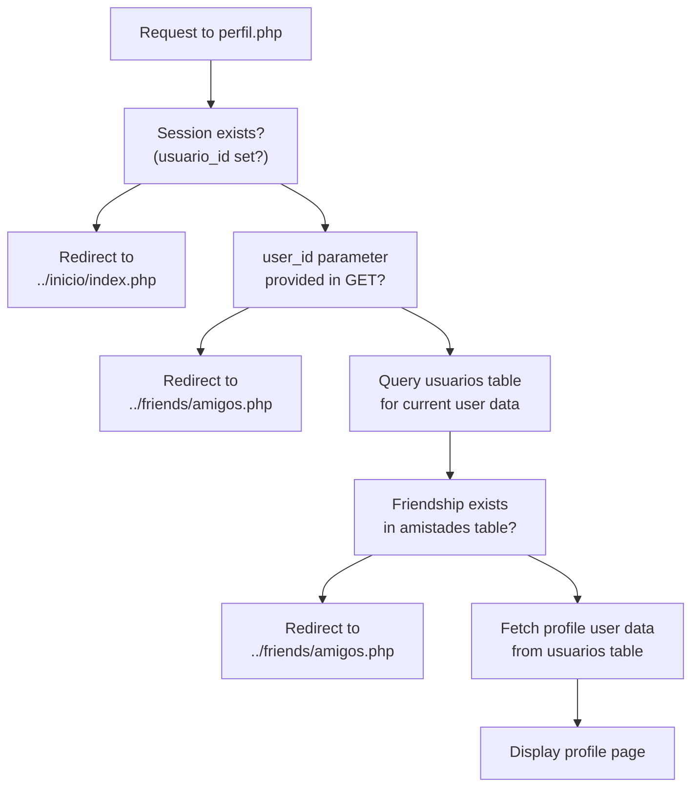
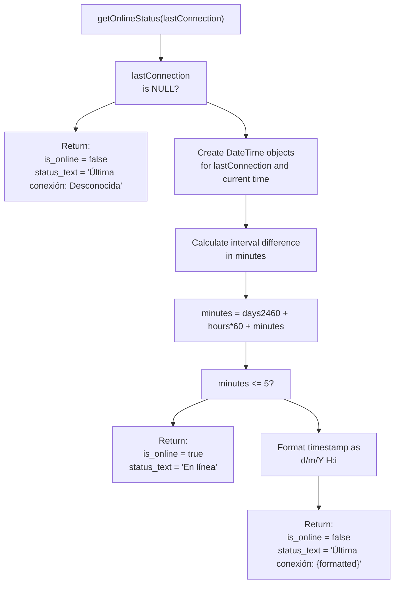
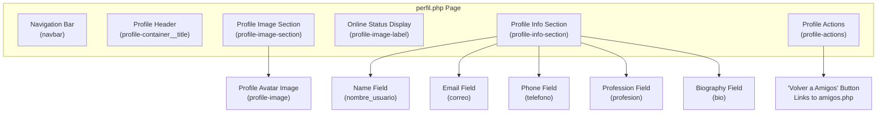
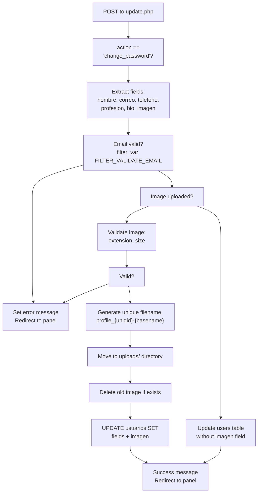
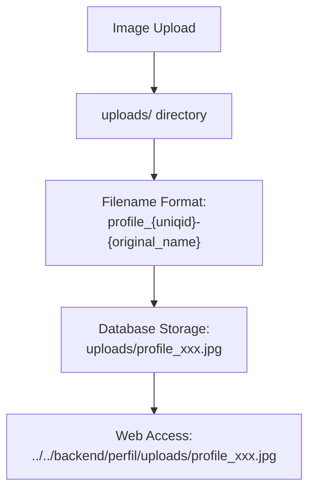
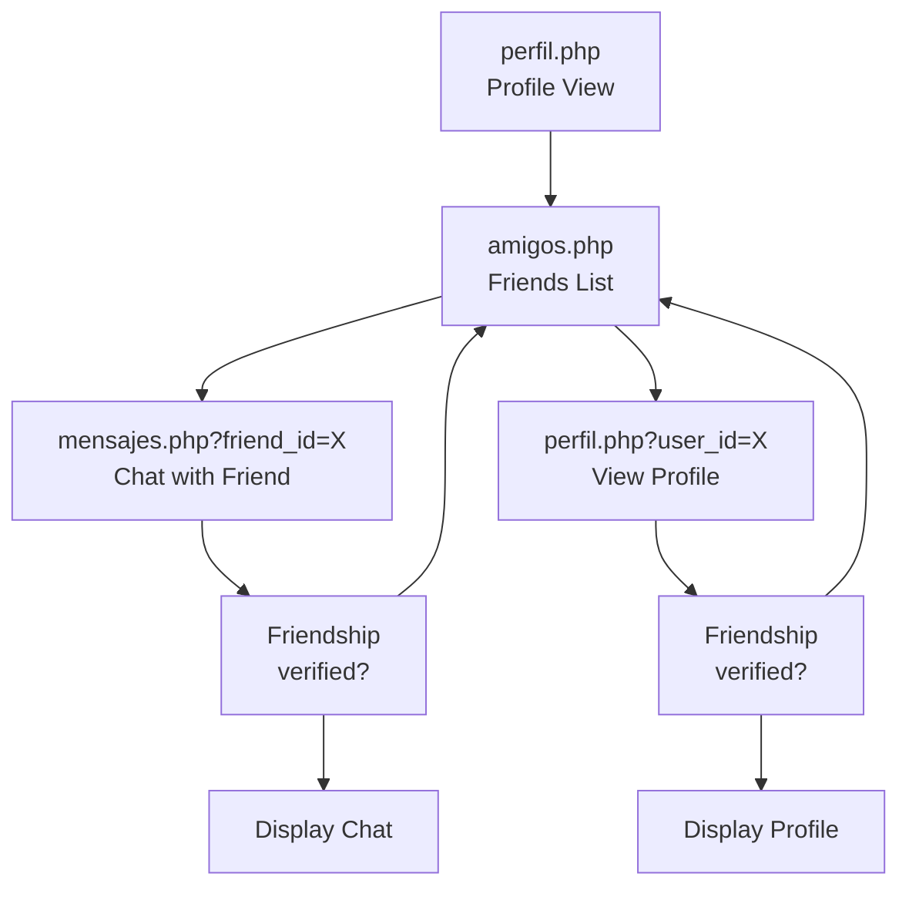

# Perfiles de usuario

> **Archivos fuente relevantes**
> * [.gitignore](https://github.com/axchisan/El-rincon-de-ADSO/blob/3e310227/.gitignore)
> * [src/backend/perfil/update.php](https://github.com/axchisan/El-rincon-de-ADSO/blob/3e310227/src/backend/perfil/update.php)
> * [src/backend/perfil/uploads/perfil_6807f3b3839528.57825759.jpg](https://github.com/axchisan/El-rincon-de-ADSO/blob/3e310227/src/backend/perfil/uploads/profile_6807f3b3839528.57825759.jpg)
> * [src/backend/perfil/uploads/profile_6807f9a21b8730.38527839.jpg](https://github.com/axchisan/El-rincon-de-ADSO/blob/3e310227/src/backend/perfil/uploads/profile_6807f9a21b8730.38527839.jpg)
> * [src/backend/perfil/uploads/perfil_6807f9cd029340.20664564.jpg](https://github.com/axchisan/El-rincon-de-ADSO/blob/3e310227/src/backend/perfil/uploads/profile_6807f9cd029340.20664564.jpg)
> * [src/frontend/amigos/amigos.php](https://github.com/axchisan/El-rincon-de-ADSO/blob/3e310227/src/frontend/friends/amigos.php)
> * [src/frontend/mensajes/mensajes.php](https://github.com/axchisan/El-rincon-de-ADSO/blob/3e310227/src/frontend/mensajes/mensajes.php)
> * [src/frontend/notificaciones/notificaciones.php](https://github.com/axchisan/El-rincon-de-ADSO/blob/3e310227/src/frontend/notificaciones/notificaciones.php)
> * [src/frontend/perfil/perfil.php](https://github.com/axchisan/El-rincon-de-ADSO/blob/3e310227/src/frontend/perfil/perfil.php)

## Propósito y alcance

Este documento describe el sistema de visualización de perfiles de usuario en El Rincón de ADSO. Describe cómo los usuarios pueden ver la información de perfil de otros usuarios, el mecanismo de cálculo del estado de conexión, el control de acceso basado en amistades y la gestión de datos de perfil. Para obtener información sobre cómo editar su propio perfil en el panel de usuario, consulte [Administración de perfiles](/axchisan/El-rincon-de-ADSO/4.2-profile-management) . Para conocer los puntos finales de la API de backend relacionados con los perfiles, consulte [API de perfiles de usuario](/axchisan/El-rincon-de-ADSO/9.3-user-profile-apis) .

## Descripción general

El sistema de perfiles permite a los usuarios autenticados ver información detallada sobre otros usuarios de la plataforma, con acceso restringido a amistades consolidadas. Cada perfil muestra información personal, como nombre, correo electrónico, profesión, biografía, foto de perfil y estado de conexión en tiempo real. El sistema aplica un estricto control de acceso para proteger la privacidad del usuario.

**Fuentes:** [src/frontend/perfil/perfil.php L1-L235](https://github.com/axchisan/El-rincon-de-ADSO/blob/3e310227/src/frontend/perfil/perfil.php#L1-L235)

## Control de acceso y requisitos de amistad

### Validación de sesión

Todo acceso al perfil requiere una sesión de usuario activa. El sistema valida la sesión al iniciar cada solicitud de perfil.



**Fuentes:** [src/frontend/perfil/perfil.php L6-L13](https://github.com/axchisan/El-rincon-de-ADSO/blob/3e310227/src/frontend/perfil/perfil.php#L6-L13)

 [src/frontend/perfil/perfil.php L40-L66](https://github.com/axchisan/El-rincon-de-ADSO/blob/3e310227/src/frontend/perfil/perfil.php#L40-L66)

### Consulta de verificación de amistad

El sistema ejecuta una verificación de amistad bidireccional para garantizar que los usuarios solo puedan ver los perfiles de sus amigos confirmados:

[src/frontend/perfil/perfil.php L50-L60](https://github.com/axchisan/El-rincon-de-ADSO/blob/3e310227/src/frontend/perfil/perfil.php#L50-L60)

Esta consulta verifica ambas direcciones de la relación de amistad (usuario A → usuario B o usuario B → usuario A) y asegura que el estado sea `'accepted'`.

**Fuentes:** [src/frontend/perfil/perfil.php L49-L66](https://github.com/axchisan/El-rincon-de-ADSO/blob/3e310227/src/frontend/perfil/perfil.php#L49-L66)

## Estructura de datos del perfil

### Campos de base de datos

The profile system retrieves the following fields from the `usuarios` table:

| Field | Type | Description | Required |
| --- | --- | --- | --- |
| `nombre_usuario` | String | User's display name | Yes |
| `correo` | String | Email address | Yes |
| `telefono` | String | Phone number | No |
| `profesion` | String | Professional title/occupation | No |
| `bio` | String | User biography/description | No |
| `imagen` | String | Path to profile image file | No |
| `ultima_conexion` | Timestamp | Last connection timestamp | No |

**Sources:** [src/frontend/perfil/perfil.php L69-L74](https://github.com/axchisan/El-rincon-de-ADSO/blob/3e310227/src/frontend/perfil/perfil.php#L69-L74)

### Default Values

For optional fields, the system displays default messages when data is not available:

* **telefono**: "No especificado" if empty
* **profesion**: "No especificado" if empty
* **bio**: "Este usuario aún no ha añadido una biografía." if empty
* **imagen**: Falls back to `https://i.pravatar.cc/150?img={user_id}`

[src/frontend/perfil/perfil.php L82-L87](https://github.com/axchisan/El-rincon-de-ADSO/blob/3e310227/src/frontend/perfil/perfil.php#L82-L87)

**Sources:** [src/frontend/perfil/perfil.php L82-L88](https://github.com/axchisan/El-rincon-de-ADSO/blob/3e310227/src/frontend/perfil/perfil.php#L82-L88)

## Online Status System

### Status Calculation Algorithm

The `getOnlineStatus()` function determines whether a user is currently online based on their last connection timestamp.



**Sources:** [src/frontend/perfil/perfil.php L91-L107](https://github.com/axchisan/El-rincon-de-ADSO/blob/3e310227/src/frontend/perfil/perfil.php#L91-L107)

### Implementation Details

The function implementation at [src/frontend/perfil/perfil.php L91-L107](https://github.com/axchisan/El-rincon-de-ADSO/blob/3e310227/src/frontend/perfil/perfil.php#L91-L107)

:

* Uses PHP's `DateTime` class for timestamp manipulation
* Converts the time difference to total minutes for comparison
* Applies a 5-minute threshold for "online" status
* Returns both a boolean flag and a formatted status message

The same `getOnlineStatus()` function is reused in the friends list at [src/frontend/friends/amigos.php L200-L216](https://github.com/axchisan/El-rincon-de-ADSO/blob/3e310227/src/frontend/friends/amigos.php#L200-L216)

**Sources:** [src/frontend/perfil/perfil.php L91-L107](https://github.com/axchisan/El-rincon-de-ADSO/blob/3e310227/src/frontend/perfil/perfil.php#L91-L107)

 [src/frontend/friends/amigos.php L200-L216](https://github.com/axchisan/El-rincon-de-ADSO/blob/3e310227/src/frontend/friends/amigos.php#L200-L216)

## Profile Viewing Page Structure

### URL Format

Profiles are accessed via: `perfil.php?user_id={target_user_id}`

The `user_id` parameter specifies which user's profile to display.

**Sources:** [src/frontend/perfil/perfil.php L41-L45](https://github.com/axchisan/El-rincon-de-ADSO/blob/3e310227/src/frontend/perfil/perfil.php#L41-L45)

### Page Layout Components



**Sources:** [src/frontend/perfil/perfil.php L176-L224](https://github.com/axchisan/El-rincon-de-ADSO/blob/3e310227/src/frontend/perfil/perfil.php#L176-L224)

### Profile Image Rendering

Profile images are rendered with cache-busting to ensure updated images display immediately:

```

```

The cache-busting parameter `?v={time()}` is appended to force browsers to reload the image when it changes.

[src/frontend/perfil/perfil.php L87](https://github.com/axchisan/El-rincon-de-ADSO/blob/3e310227/src/frontend/perfil/perfil.php#L87-L87)

**Sources:** [src/frontend/perfil/perfil.php L87](https://github.com/axchisan/El-rincon-de-ADSO/blob/3e310227/src/frontend/perfil/perfil.php#L87-L87)

 [src/frontend/friends/amigos.php L306](https://github.com/axchisan/El-rincon-de-ADSO/blob/3e310227/src/frontend/friends/amigos.php#L306-L306)

 [src/frontend/mensajes/mensajes.php L81](https://github.com/axchisan/El-rincon-de-ADSO/blob/3e310227/src/frontend/mensajes/mensajes.php#L81-L81)

## Profile Update System

### Update Endpoint

Profile updates are handled by `src/backend/perfil/update.php`, which processes two types of actions:

* Personal data updates (`action` not set or not `'change_password'`)
* Password changes (`action='change_password'`)

**Sources:** [src/backend/perfil/update.php L1-L173](https://github.com/axchisan/El-rincon-de-ADSO/blob/3e310227/src/backend/perfil/update.php#L1-L173)

### Personal Data Update Flow



**Sources:** [src/backend/perfil/update.php L86-L166](https://github.com/axchisan/El-rincon-de-ADSO/blob/3e310227/src/backend/perfil/update.php#L86-L166)

### Password Change Requirements

When changing passwords, the system enforces strict validation rules:

| Requirement | Validation |
| --- | --- |
| Current password must match | `password_verify()` against stored hash |
| New passwords must match | Direct string comparison |
| Minimum 1 uppercase letter | `/[A-Z]/` regex |
| Minimum 3 numbers | `preg_match_all('/\d/', $password) < 3` |
| Minimum 1 special character | `/[!@#$%^&*(),.?":{} |

[src/backend/perfil/update.php L56-L70](https://github.com/axchisan/El-rincon-de-ADSO/blob/3e310227/src/backend/perfil/update.php#L56-L70)

**Sources:** [src/backend/perfil/update.php L23-L85](https://github.com/axchisan/El-rincon-de-ADSO/blob/3e310227/src/backend/perfil/update.php#L23-L85)

## Profile Image Management

### Storage Structure



**Sources:** [src/backend/perfil/update.php L102-L141](https://github.com/axchisan/El-rincon-de-ADSO/blob/3e310227/src/backend/perfil/update.php#L102-L141)

### Image Validation Rules

The system validates uploaded images according to these criteria:

**Allowed Extensions:**

* `.jpg`
* `.jpeg`
* `.png`
* `.gif`

**Size Limit:** 5 MB (5 * 1024 * 1024 bytes)

[src/backend/perfil/update.php L109-L122](https://github.com/axchisan/El-rincon-de-ADSO/blob/3e310227/src/backend/perfil/update.php#L109-L122)

**Sources:** [src/backend/perfil/update.php L102-L128](https://github.com/axchisan/El-rincon-de-ADSO/blob/3e310227/src/backend/perfil/update.php#L102-L128)

### Fallback Avatar System

When a user has no profile image, the system uses a placeholder avatar service:

```
https://i.pravatar.cc/150?img={user_id}
```

This generates a consistent avatar based on the user's ID, ensuring each user has a unique default image.

**Sources:** [src/frontend/perfil/perfil.php L87](https://github.com/axchisan/El-rincon-de-ADSO/blob/3e310227/src/frontend/perfil/perfil.php#L87-L87)

 [src/frontend/friends/amigos.php L306](https://github.com/axchisan/El-rincon-de-ADSO/blob/3e310227/src/frontend/friends/amigos.php#L306-L306)

 [src/frontend/mensajes/mensajes.php L81](https://github.com/axchisan/El-rincon-de-ADSO/blob/3e310227/src/frontend/mensajes/mensajes.php#L81-L81)

### Image Deletion on Update

When a user uploads a new profile image, the system automatically deletes the previous image file:

[src/backend/perfil/update.php L130-L139](https://github.com/axchisan/El-rincon-de-ADSO/blob/3e310227/src/backend/perfil/update.php#L130-L139)

Esto evita que los archivos huérfanos se acumulen en el directorio de cargas.

**Fuentes:** [src/backend/perfil/update.php L130-L139](https://github.com/axchisan/El-rincon-de-ADSO/blob/3e310227/src/backend/perfil/update.php#L130-L139)

## Integración con funciones sociales

### Navegación entre componentes sociales

La página de perfil proporciona una navegación fluida a las funciones sociales relacionadas:



**Fuentes:** [src/frontend/perfil/perfil.php L221](https://github.com/axchisan/El-rincon-de-ADSO/blob/3e310227/src/frontend/perfil/perfil.php#L221-L221)

 [amigos.php L378-L383](https://github.com/axchisan/El-rincon-de-ADSO/blob/3e310227/src/frontend/friends/amigos.php#L378-L383)

 [src/frontend/mensajes/mensajes.php L48-L65](https://github.com/axchisan/El-rincon-de-ADSO/blob/3e310227/src/frontend/mensajes/mensajes.php#L48-L65)

### Puntos de acceso al perfil

Los usuarios pueden acceder a los perfiles a través de múltiples puntos de entrada:

1. **Lista de amigos** - Botón "Ver perfil" para cada amigo[amigos.php L381-L383](https://github.com/axchisan/El-rincon-de-ADSO/blob/3e310227/src/frontend/friends/amigos.php#L381-L383)
2. **Página de mensajería** : enlace de perfil desde el encabezado del chat
3. **Notificaciones** - Notificaciones de solicitud de amistad con enlace al perfil

Todos los puntos de acceso aplican el requisito de amistad antes de mostrar los datos del perfil.

**Fuentes:** [amigos.php L378-L383](https://github.com/axchisan/El-rincon-de-ADSO/blob/3e310227/src/frontend/friends/amigos.php#L378-L383)

 [src/frontend/mensajes/mensajes.php L1-L88](https://github.com/axchisan/El-rincon-de-ADSO/blob/3e310227/src/frontend/mensajes/mensajes.php#L1-L88)

## Relaciones del esquema de base de datos

El sistema de perfiles interactúa con dos tablas de base de datos principales:

```css
#mermaid-bidhemhzjli{font-family:ui-sans-serif,-apple-system,system-ui,Segoe UI,Helvetica;font-size:16px;fill:#333;}@keyframes edge-animation-frame{from{stroke-dashoffset:0;}}@keyframes dash{to{stroke-dashoffset:0;}}#mermaid-bidhemhzjli .edge-animation-slow{stroke-dasharray:9,5!important;stroke-dashoffset:900;animation:dash 50s linear infinite;stroke-linecap:round;}#mermaid-bidhemhzjli .edge-animation-fast{stroke-dasharray:9,5!important;stroke-dashoffset:900;animation:dash 20s linear infinite;stroke-linecap:round;}#mermaid-bidhemhzjli .error-icon{fill:#dddddd;}#mermaid-bidhemhzjli .error-text{fill:#222222;stroke:#222222;}#mermaid-bidhemhzjli .edge-thickness-normal{stroke-width:1px;}#mermaid-bidhemhzjli .edge-thickness-thick{stroke-width:3.5px;}#mermaid-bidhemhzjli .edge-pattern-solid{stroke-dasharray:0;}#mermaid-bidhemhzjli .edge-thickness-invisible{stroke-width:0;fill:none;}#mermaid-bidhemhzjli .edge-pattern-dashed{stroke-dasharray:3;}#mermaid-bidhemhzjli .edge-pattern-dotted{stroke-dasharray:2;}#mermaid-bidhemhzjli .marker{fill:#999;stroke:#999;}#mermaid-bidhemhzjli .marker.cross{stroke:#999;}#mermaid-bidhemhzjli svg{font-family:ui-sans-serif,-apple-system,system-ui,Segoe UI,Helvetica;font-size:16px;}#mermaid-bidhemhzjli p{margin:0;}#mermaid-bidhemhzjli .entityBox{fill:#ffffff;stroke:#dddddd;}#mermaid-bidhemhzjli .relationshipLabelBox{fill:#dddddd;opacity:0.7;background-color:#dddddd;}#mermaid-bidhemhzjli .relationshipLabelBox rect{opacity:0.5;}#mermaid-bidhemhzjli .labelBkg{background-color:rgba(221, 221, 221, 0.5);}#mermaid-bidhemhzjli .edgeLabel .label{fill:#dddddd;font-size:14px;}#mermaid-bidhemhzjli .label{font-family:ui-sans-serif,-apple-system,system-ui,Segoe UI,Helvetica;color:#333;}#mermaid-bidhemhzjli .edge-pattern-dashed{stroke-dasharray:8,8;}#mermaid-bidhemhzjli .node rect,#mermaid-bidhemhzjli .node circle,#mermaid-bidhemhzjli .node ellipse,#mermaid-bidhemhzjli .node polygon{fill:#ffffff;stroke:#dddddd;stroke-width:1px;}#mermaid-bidhemhzjli .relationshipLine{stroke:#999;stroke-width:1;fill:none;}#mermaid-bidhemhzjli .marker{fill:none!important;stroke:#999!important;stroke-width:1;}#mermaid-bidhemhzjli :root{--mermaid-font-family:"trebuchet ms",verdana,arial,sans-serif;}has friendshipsusuariosintidPKstringnombre_usuariostringcorreostringtelefonostringprofesiontextbiostringimagentimestampultima_conexionstringcontrasenaamistadesintidPKintusuario_idFKintamigo_idFKstringestadotimestampfecha_creacion
```

La `amistades`tabla se consulta de forma bidireccional para verificar el estado de amistad antes de permitir el acceso al perfil.

**Fuentes:** [src/frontend/perfil/perfil.php L50-L60](https://github.com/axchisan/El-rincon-de-ADSO/blob/3e310227/src/frontend/perfil/perfil.php#L50-L60)

 [src/backend/perfil/update.php L30-L33](https://github.com/axchisan/El-rincon-de-ADSO/blob/3e310227/src/backend/perfil/update.php#L30-L33)

## Consideraciones de seguridad

### Aplicación del control de acceso

El sistema de visualización de perfiles implementa múltiples capas de seguridad:

1. **Validación de sesión** : todas las solicitudes requieren ser válidas `usuario_id`en la sesión.
2. **Verificación de amistad** : perfiles accesibles solo para amigos confirmados
3. **Validación de parámetros** : `user_id`debe ser numérica y válida
4. **Consultas de base de datos** : todas las consultas utilizan sentencias preparadas de PDO

[src/frontend/perfil/perfil.php L6-L66](https://github.com/axchisan/El-rincon-de-ADSO/blob/3e310227/src/frontend/perfil/perfil.php#L6-L66)

**Fuentes:** [src/frontend/perfil/perfil.php L6-L66](https://github.com/axchisan/El-rincon-de-ADSO/blob/3e310227/src/frontend/perfil/perfil.php#L6-L66)

### Sanitización de entrada

Todos los datos de perfil mostrados se desinfectan `htmlspecialchars()`para evitar ataques XSS:

[src/frontend/perfil/perfil.php L82-L87](https://github.com/axchisan/El-rincon-de-ADSO/blob/3e310227/src/frontend/perfil/perfil.php#L82-L87)

**Fuentes:** [src/frontend/perfil/perfil.php L82-L87](https://github.com/axchisan/El-rincon-de-ADSO/blob/3e310227/src/frontend/perfil/perfil.php#L82-L87)

### Seguridad al subir imágenes

El sistema de actualización de perfiles valida las cargas de imágenes para evitar vulnerabilidades de seguridad:

* Lista blanca de extensiones (sin archivos ejecutables)
* Límites de tamaño de archivo (evitar DoS)
* Generación de nombre de archivo único (evitar sobrescrituras)
* Validación del lado del servidor (se puede omitir la del lado del cliente)

[src/backend/perfil/update.php L109-L122](https://github.com/axchisan/El-rincon-de-ADSO/blob/3e310227/src/backend/perfil/update.php#L109-L122)

**Fuentes:** [src/backend/perfil/update.php L104-L128](https://github.com/axchisan/El-rincon-de-ADSO/blob/3e310227/src/backend/perfil/update.php#L104-L128)