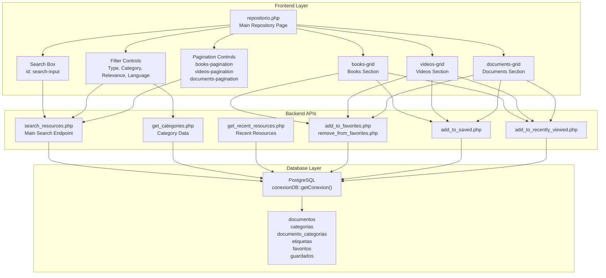
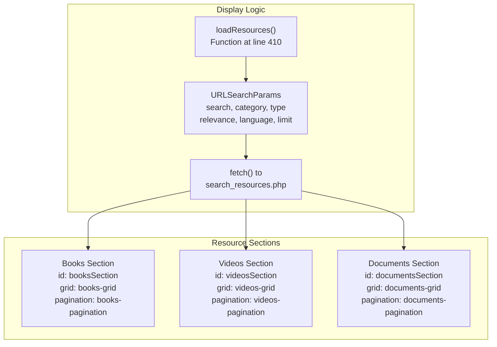
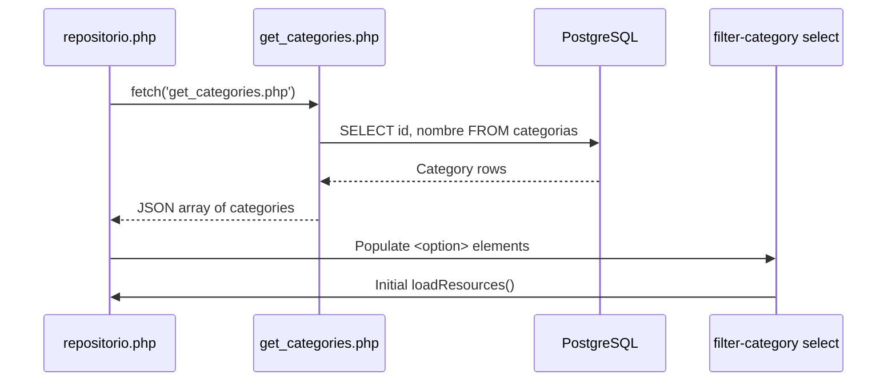
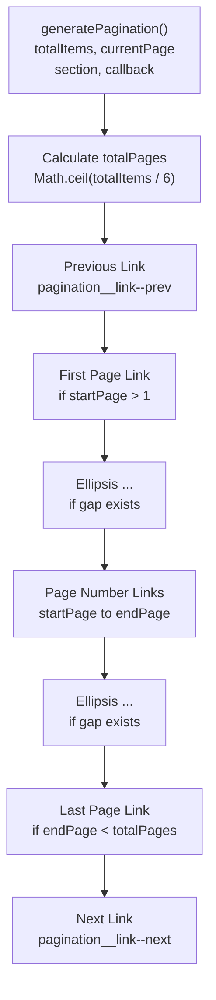
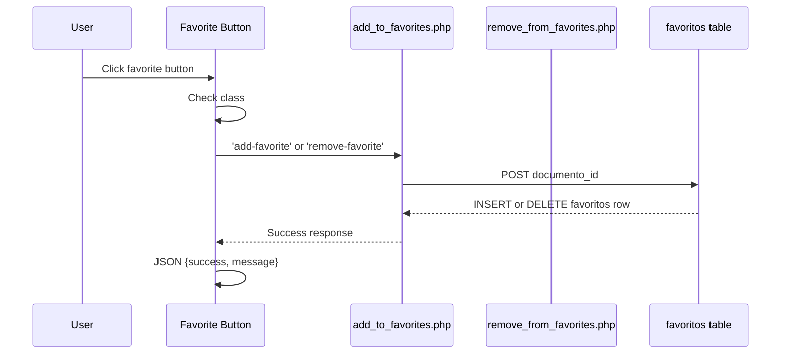
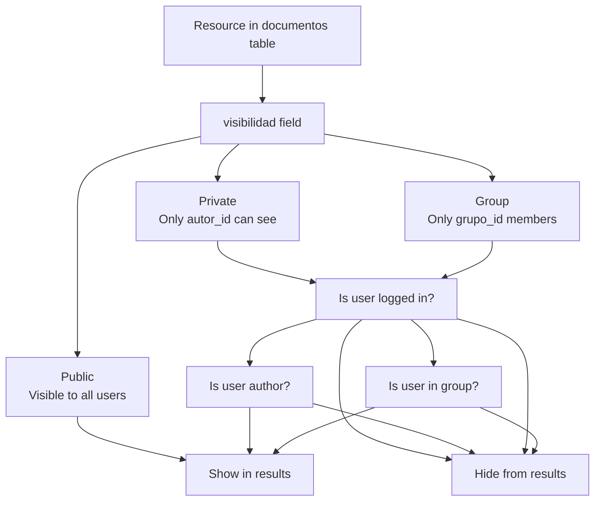
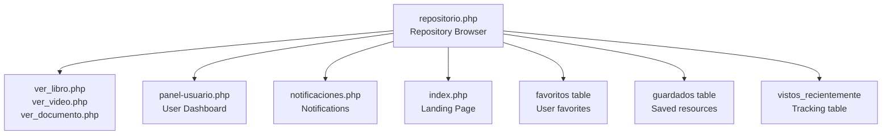

# Repository Browser

> **Relevant source files**
> * [src/backend/gestionRecursos/get_recent_resources.php](https://github.com/axchisan/El-rincon-de-ADSO/blob/3e310227/src/backend/gestionRecursos/get_recent_resources.php)
> * [src/backend/gestionRecursos/upload_resource.php](https://github.com/axchisan/El-rincon-de-ADSO/blob/3e310227/src/backend/gestionRecursos/upload_resource.php)
> * [src/frontend/inicio/index.php](https://github.com/axchisan/El-rincon-de-ADSO/blob/3e310227/src/frontend/inicio/index.php)
> * [src/frontend/panel/panel-usuario.php](https://github.com/axchisan/El-rincon-de-ADSO/blob/3e310227/src/frontend/panel/panel-usuario.php)
> * [src/frontend/repositorio/repositorio.php](https://github.com/axchisan/El-rincon-de-ADSO/blob/3e310227/src/frontend/repositorio/repositorio.php)

## Purpose and Scope

The Repository Browser (`repositorio.php`) is the primary interface for browsing, searching, and filtering the complete catalog of educational resources in El Rincón de ADSO. This page provides authenticated users with access to all public resources, plus private and group-specific resources based on their permissions.

This page covers the main repository browsing interface. For information about:

* User-specific resource collections (favorites, recently viewed, saved, contributions), see [Repository Tab - User Resources](/axchisan/El-rincon-de-ADSO/4.1-repository-tab-user-resources)
* Individual resource viewing pages (books, videos, documents), see [Resource Viewers](/axchisan/El-rincon-de-ADSO/5.2-resource-viewers)
* Resource upload and creation functionality, see [Resource Upload and Management](/axchisan/El-rincon-de-ADSO/4.3-resource-upload-and-management)
* Category and tagging system details, see [Categories and Tags System](/axchisan/El-rincon-de-ADSO/5.5-categories-and-tags-system)

---

## Architecture Overview

The Repository Browser follows a client-side JavaScript architecture where the PHP page provides the initial structure and authentication, while dynamic content loading is handled through AJAX calls to backend APIs.



**Sources:** [src/frontend/repositorio/repositorio.php L1-L857](https://github.com/axchisan/El-rincon-de-ADSO/blob/3e310227/src/frontend/repositorio/repositorio.php#L1-L857)

 [src/backend/gestionRecursos/get_recent_resources.php L1-L123](https://github.com/axchisan/El-rincon-de-ADSO/blob/3e310227/src/backend/gestionRecursos/get_recent_resources.php#L1-L123)

---

## Page Structure and Authentication

The repository page requires user authentication and redirects unauthenticated users to the login page.

### Session Validation and User Data Loading

[src/frontend/repositorio/repositorio.php L1-L37](https://github.com/axchisan/El-rincon-de-ADSO/blob/3e310227/src/frontend/repositorio/repositorio.php#L1-L37)

 handles initial setup:

```
session_start();
if (!isset($_SESSION['usuario_id'])) {
    header("Location: ../login/login.php");
    exit();
}
```

The page loads user information including:

* `nombre_usuario` - displayed in profile menu
* `imagen` - user avatar with cache-busting timestamp
* `unread_count` - unread notification count from `notificaciones` table

**Key Database Queries:**

* User data: [src/frontend/repositorio/repositorio.php L19-L27](https://github.com/axchisan/El-rincon-de-ADSO/blob/3e310227/src/frontend/repositorio/repositorio.php#L19-L27)
* Notification count: [src/frontend/repositorio/repositorio.php L30-L33](https://github.com/axchisan/El-rincon-de-ADSO/blob/3e310227/src/frontend/repositorio/repositorio.php#L30-L33)

**Sources:** [src/frontend/repositorio/repositorio.php L1-L37](https://github.com/axchisan/El-rincon-de-ADSO/blob/3e310227/src/frontend/repositorio/repositorio.php#L1-L37)

---

## User Interface Components

### Navigation Bar

The navbar includes:

* Logo and brand link to `../inicio/index.php`
* Menu items: Inicio, Repositorio (active), Búsquedas, Nosotros, Recientes, Comunidad
* Profile dropdown with avatar and notification badge [src/frontend/repositorio/repositorio.php L138-L150](https://github.com/axchisan/El-rincon-de-ADSO/blob/3e310227/src/frontend/repositorio/repositorio.php#L138-L150)
* Mobile menu toggle button [src/frontend/repositorio/repositorio.php L155-L157](https://github.com/axchisan/El-rincon-de-ADSO/blob/3e310227/src/frontend/repositorio/repositorio.php#L155-L157)

### Hero Section

[src/frontend/repositorio/repositorio.php L192-L211](https://github.com/axchisan/El-rincon-de-ADSO/blob/3e310227/src/frontend/repositorio/repositorio.php#L192-L211)

 displays:

* Hero image from `../inicio/img/repositorio.jpg`
* Title: "Repositorio Digital"
* Description emphasizing web development, programming, databases
* Back button using `history.back()`

### Search and Filter Interface

Located at [src/frontend/repositorio/repositorio.php L214-L272](https://github.com/axchisan/El-rincon-de-ADSO/blob/3e310227/src/frontend/repositorio/repositorio.php#L214-L272)

 the search section provides:

| Component | ID | Purpose |
| --- | --- | --- |
| Search input | `search-input` | Text search by title, author, theme |
| Search button | `search-button` | Trigger search on click |
| Type filter | `filter-type` | Filter by libro, video, documento, imagen, otro |
| Category filter | `filter-category` | Filter by category (dynamically loaded) |
| Relevance filter | `filter-relevance` | Sort by Low, Medium, High, Critical |
| Language filter | `filter-language` | Filter by es, en, fr, de |
| Filter toggle | `filter-toggle` | Show/hide advanced filters |

**Sources:** [src/frontend/repositorio/repositorio.php L214-L272](https://github.com/axchisan/El-rincon-de-ADSO/blob/3e310227/src/frontend/repositorio/repositorio.php#L214-L272)

---

## Resource Display Sections

The page displays resources in three separate sections, each with its own grid and pagination:



### Books Section

[src/frontend/repositorio/repositorio.php L275-L286](https://github.com/axchisan/El-rincon-de-ADSO/blob/3e310227/src/frontend/repositorio/repositorio.php#L275-L286)

 structure:

* Section header with title "Libros Disponibles"
* Grid container `books-grid` for resource cards
* Pagination container `books-pagination`

### Videos Section

[src/frontend/repositorio/repositorio.php L289-L300](https://github.com/axchisan/El-rincon-de-ADSO/blob/3e310227/src/frontend/repositorio/repositorio.php#L289-L300)

 structure:

* Section header with title "Videos Educativos"
* Grid container `videos-grid`
* Special video card styling with play button overlay and duration badge
* Pagination container `videos-pagination`

### Documents Section

[src/frontend/repositorio/repositorio.php L303-L314](https://github.com/axchisan/El-rincon-de-ADSO/blob/3e310227/src/frontend/repositorio/repositorio.php#L303-L314)

 structure:

* Section header with title "Documentos y Artículos"
* Grid container `documents-grid` with class `resources-grid--documents`
* Displays both document and image type resources
* Pagination container `documents-pagination`

**Sources:** [src/frontend/repositorio/repositorio.php L275-L314](https://github.com/axchisan/El-rincon-de-ADSO/blob/3e310227/src/frontend/repositorio/repositorio.php#L275-L314)

---

## Search and Filter Implementation

### Dynamic Category Loading

The `loadCategories()` function [src/frontend/repositorio/repositorio.php L385-L408](https://github.com/axchisan/El-rincon-de-ADSO/blob/3e310227/src/frontend/repositorio/repositorio.php#L385-L408)

 fetches available categories:



**Sources:** [src/frontend/repositorio/repositorio.php L385-L408](https://github.com/axchisan/El-rincon-de-ADSO/blob/3e310227/src/frontend/repositorio/repositorio.php#L385-L408)

### Resource Loading Function

The core `loadResources(pageBooks, pageVideos, pageDocuments)` function [src/frontend/repositorio/repositorio.php L410-L846](https://github.com/axchisan/El-rincon-de-ADSO/blob/3e310227/src/frontend/repositorio/repositorio.php#L410-L846)

 implements:

**1. Parameter Collection:**

```javascript
const search = searchInput.value.trim();
const category = filterCategory.value;
const type = filterType.value;
const relevance = filterRelevance.value;
const language = filterLanguage.value;
```

**2. URL Parameter Construction:**

```javascript
const params = new URLSearchParams();
if (search) params.append('search', search);
if (category) params.append('category', category);
if (type) params.append('type', type);
if (relevance) params.append('relevance', relevance);
if (language) params.append('language', language);
params.append('limit', 6);
```

**3. Conditional Section Loading:**

* Books: Only loaded if `!type || type === 'libro'` [src/frontend/repositorio/repositorio.php L608-L677](https://github.com/axchisan/El-rincon-de-ADSO/blob/3e310227/src/frontend/repositorio/repositorio.php#L608-L677)
* Videos: Only loaded if `!type || type === 'video'` [src/frontend/repositorio/repositorio.php L680-L750](https://github.com/axchisan/El-rincon-de-ADSO/blob/3e310227/src/frontend/repositorio/repositorio.php#L680-L750)
* Documents: Only loaded if `!type || type === 'documento' || type === 'imagen'` [src/frontend/repositorio/repositorio.php L753-L845](https://github.com/axchisan/El-rincon-de-ADSO/blob/3e310227/src/frontend/repositorio/repositorio.php#L753-L845)

**Sources:** [src/frontend/repositorio/repositorio.php L410-L846](https://github.com/axchisan/El-rincon-de-ADSO/blob/3e310227/src/frontend/repositorio/repositorio.php#L410-L846)

---

## Resource Card Generation

Each resource type has a specific card structure:

### Book Card Structure

[src/frontend/repositorio/repositorio.php L629-L658](https://github.com/axchisan/El-rincon-de-ADSO/blob/3e310227/src/frontend/repositorio/repositorio.php#L629-L658)

 generates:

| Element | Class | Content |
| --- | --- | --- |
| Card container | `resource-card book-card` | Main wrapper |
| Image container | `resource-card__image-container` | Portada image with format badge |
| Category badge | `resource-card__category` | Joined category names |
| Title | `resource-card__title` | Resource title |
| Author | `resource-card__author` | "Por {autor}" |
| Meta info | `resource-card__meta` | Publication date, visibility |
| Tags | `resource-card__tags` | Custom tag spans |
| Actions | `resource-card__actions` | Read now, favorites, save buttons |

### Video Card Structure

[src/frontend/repositorio/repositorio.php L701-L731](https://github.com/axchisan/El-rincon-de-ADSO/blob/3e310227/src/frontend/repositorio/repositorio.php#L701-L731)

 includes additional elements:

* `resource-card__duration` - Shows video duration with clock icon
* `resource-card__play-button` - Centered play icon overlay

### Document Card Structure

[src/frontend/repositorio/repositorio.php L789-L818](https://github.com/axchisan/El-rincon-de-ADSO/blob/3e310227/src/frontend/repositorio/repositorio.php#L789-L818)

 handles:

* Default cover image fallback: `../inicio/img/default-cover.jpg`
* `onerror` handler on image: `this.src='${defaultImage}'`
* Combined display of document and image types

**Sources:** [src/frontend/repositorio/repositorio.php L629-L658](https://github.com/axchisan/El-rincon-de-ADSO/blob/3e310227/src/frontend/repositorio/repositorio.php#L629-L658)

 [src/frontend/repositorio/repositorio.php L701-L731](https://github.com/axchisan/El-rincon-de-ADSO/blob/3e310227/src/frontend/repositorio/repositorio.php#L701-L731)

 [src/frontend/repositorio/repositorio.php L789-L818](https://github.com/axchisan/El-rincon-de-ADSO/blob/3e310227/src/frontend/repositorio/repositorio.php#L789-L818)

---

## Pagination System

The `generatePagination()` function [src/frontend/repositorio/repositorio.php L433-L523](https://github.com/axchisan/El-rincon-de-ADSO/blob/3e310227/src/frontend/repositorio/repositorio.php#L433-L523)

 creates pagination controls for each resource section:



**Key Features:**

* Shows 5 pages centered around current page (±2 range)
* Adds ellipsis when gaps exist
* Disables prev/next links at boundaries using `pagination__link--disabled`
* Each link calls the callback with new page number
* Individual callbacks for books, videos, and documents sections

**Example Usage:**

```javascript
generatePagination(data.total, pageBooks, 'books', (newPage) => {
    loadResources(newPage, pageVideos, pageDocuments);
});
```

**Sources:** [src/frontend/repositorio/repositorio.php L433-L523](https://github.com/axchisan/El-rincon-de-ADSO/blob/3e310227/src/frontend/repositorio/repositorio.php#L433-L523)

---

## User Interaction Handling

The `assignButtonEvents(grid)` function [src/frontend/repositorio/repositorio.php L526-L605](https://github.com/axchisan/El-rincon-de-ADSO/blob/3e310227/src/frontend/repositorio/repositorio.php#L526-L605)

 attaches event handlers to resource cards:

### View Resource Tracking

[src/frontend/repositorio/repositorio.php L528-L546](https://github.com/axchisan/El-rincon-de-ADSO/blob/3e310227/src/frontend/repositorio/repositorio.php#L528-L546)

 tracks when users view resources:

```javascript
button.addEventListener('click', (e) => {
    const documentoId = button.getAttribute('data-id');
    fetch('../../backend/gestionRecursos/add_to_recently_viewed.php', {
        method: 'POST',
        headers: {'Content-Type': 'application/x-www-form-urlencoded'},
        body: `documento_id=${documentoId}`
    })
});
```

### Add/Remove Favorites

[src/frontend/repositorio/repositorio.php L549-L577](https://github.com/axchisan/El-rincon-de-ADSO/blob/3e310227/src/frontend/repositorio/repositorio.php#L549-L577)

 toggles favorite status:



**Endpoints:**

* Add: `../../backend/gestionRecursos/add_to_favorites.php`
* Remove: `../../backend/gestionRecursos/remove_from_favorites.php`

### Save for Later

[src/frontend/repositorio/repositorio.php L580-L604](https://github.com/axchisan/El-rincon-de-ADSO/blob/3e310227/src/frontend/repositorio/repositorio.php#L580-L604)

 saves resources to user's saved collection:

```yaml
fetch('../../backend/gestionRecursos/add_to_saved.php', {
    method: 'POST',
    headers: {'Content-Type': 'application/x-www-form-urlencoded'},
    body: `documento_id=${documentoId}`
})
```

**Sources:** [src/frontend/repositorio/repositorio.php L526-L605](https://github.com/axchisan/El-rincon-de-ADSO/blob/3e310227/src/frontend/repositorio/repositorio.php#L526-L605)

---

## Backend API Integration

### Search Resources API

The `search_resources.php` endpoint is called with parameters:

| Parameter | Type | Purpose |
| --- | --- | --- |
| `search` | string | Text search in title, description, author |
| `category` | int | Filter by category ID |
| `type` | string | Filter by resource type (libro, video, documento) |
| `relevance` | string | Filter by relevance level |
| `language` | string | Filter by language code |
| `page` | int | Current page number |
| `limit` | int | Results per page (default: 6) |

**Response Structure:**

```json
{
  "resources": [
    {
      "id": 123,
      "titulo": "Resource Title",
      "autor": "Author Name",
      "tipo": "libro",
      "portada": "../../uploads/cover.jpg",
      "categorias": ["Category1", "Category2"],
      "etiquetas": ["Tag1", "Tag2"],
      "es_favorito": true,
      "fecha_publicacion": "2024-01-01",
      "visibilidad": "Public",
      "duracion": "01:30:00"
    }
  ],
  "total": 50
}
```

### Recent Resources API

The `get_recent_resources.php` endpoint [src/backend/gestionRecursos/get_recent_resources.php L1-L123](https://github.com/axchisan/El-rincon-de-ADSO/blob/3e310227/src/backend/gestionRecursos/get_recent_resources.php#L1-L123)

 implements:

**Visibility Logic:**

```
if ($usuario_id) {
    $query .= " AND (
        d.visibilidad = 'Public'
        OR (d.visibilidad = 'Private' AND d.autor_id = :usuario_id)
        OR (d.visibilidad = 'Group' AND d.grupo_id = ANY(:grupos))
    )";
} else {
    $query .= " AND d.visibilidad = 'Public'";
}
```

**Key Features:**

* Filters by `estado = 'Published'` [src/backend/gestionRecursos/get_recent_resources.php L38](https://github.com/axchisan/El-rincon-de-ADSO/blob/3e310227/src/backend/gestionRecursos/get_recent_resources.php#L38-L38)
* Aggregates categories and tags using `ARRAY_AGG` [src/backend/gestionRecursos/get_recent_resources.php L30-L31](https://github.com/axchisan/El-rincon-de-ADSO/blob/3e310227/src/backend/gestionRecursos/get_recent_resources.php#L30-L31)
* Checks user's group memberships [src/backend/gestionRecursos/get_recent_resources.php L12-L17](https://github.com/axchisan/El-rincon-de-ADSO/blob/3e310227/src/backend/gestionRecursos/get_recent_resources.php#L12-L17)
* Orders by `fecha_publicacion DESC` [src/backend/gestionRecursos/get_recent_resources.php L82](https://github.com/axchisan/El-rincon-de-ADSO/blob/3e310227/src/backend/gestionRecursos/get_recent_resources.php#L82-L82)
* Marks favorites for logged-in users [src/backend/gestionRecursos/get_recent_resources.php L108-L117](https://github.com/axchisan/El-rincon-de-ADSO/blob/3e310227/src/backend/gestionRecursos/get_recent_resources.php#L108-L117)

**Sources:** [src/backend/gestionRecursos/get_recent_resources.php L1-L123](https://github.com/axchisan/El-rincon-de-ADSO/blob/3e310227/src/backend/gestionRecursos/get_recent_resources.php#L1-L123)

---

## Access Control and Visibility

The Repository Browser implements a three-tier visibility system:



**Implementation Details:**

* Public resources always displayed
* Private resources only shown to author (`autor_id = usuario_id`)
* Group resources require membership in `usuario_grupo` table
* Status must be `'Published'` to appear in repository
* Draft and Pending Review resources only visible in user's own contributions

**Sources:** [src/backend/gestionRecursos/get_recent_resources.php L44-L54](https://github.com/axchisan/El-rincon-de-ADSO/blob/3e310227/src/backend/gestionRecursos/get_recent_resources.php#L44-L54)

---

## Mobile Responsiveness

The mobile menu implementation [src/frontend/repositorio/repositorio.php L338-L370](https://github.com/axchisan/El-rincon-de-ADSO/blob/3e310227/src/frontend/repositorio/repositorio.php#L338-L370)

:

```javascript
const mobileMenuButton = document.getElementById('mobile-menu-button');
const mobileMenu = document.getElementById('mobile-menu');

mobileMenuButton.addEventListener('click', function() {
    mobileMenu.classList.toggle('active');
});

// Close mobile menu when clicking outside
document.addEventListener('click', function(event) {
    if (!mobileMenu.contains(event.target) && 
        !mobileMenuButton.contains(event.target)) {
        mobileMenu.classList.remove('active');
    }
});
```

The profile menu also has similar toggle behavior [src/frontend/repositorio/repositorio.php L354-L370](https://github.com/axchisan/El-rincon-de-ADSO/blob/3e310227/src/frontend/repositorio/repositorio.php#L354-L370)

**Sources:** [src/frontend/repositorio/repositorio.php L338-L370](https://github.com/axchisan/El-rincon-de-ADSO/blob/3e310227/src/frontend/repositorio/repositorio.php#L338-L370)

---

## Event Binding and Triggers

The page binds search triggers at [src/frontend/repositorio/repositorio.php L848-L857](https://github.com/axchisan/El-rincon-de-ADSO/blob/3e310227/src/frontend/repositorio/repositorio.php#L848-L857)

:

| Event | Element | Action |
| --- | --- | --- |
| `click` | `search-button` | Call `loadResources(1, 1, 1)` |
| `keypress` (Enter) | `search-input` | Call `loadResources(1, 1, 1)` |
| `change` | `filter-type` | Call `loadResources(1, 1, 1)` |
| `change` | `filter-category` | Call `loadResources(1, 1, 1)` |
| `change` | `filter-relevance` | Call `loadResources(1, 1, 1)` |
| `change` | `filter-language` | Call `loadResources(1, 1, 1)` |

All triggers reset pagination to page 1 for all sections.

**Sources:** [src/frontend/repositorio/repositorio.php L848-L857](https://github.com/axchisan/El-rincon-de-ADSO/blob/3e310227/src/frontend/repositorio/repositorio.php#L848-L857)

---

## Integration with Other Systems

The Repository Browser connects to multiple platform features:



**Navigation Links:**

* View resource: Redirects to type-specific viewer pages
* Profile menu: Links to `../panel/panel-usuario.php`
* Notifications: Badge shows unread count, links to notifications page
* Back navigation: Returns to `../inicio/index.php`

**Sources:** [src/frontend/repositorio/repositorio.php L1-L857](https://github.com/axchisan/El-rincon-de-ADSO/blob/3e310227/src/frontend/repositorio/repositorio.php#L1-L857)