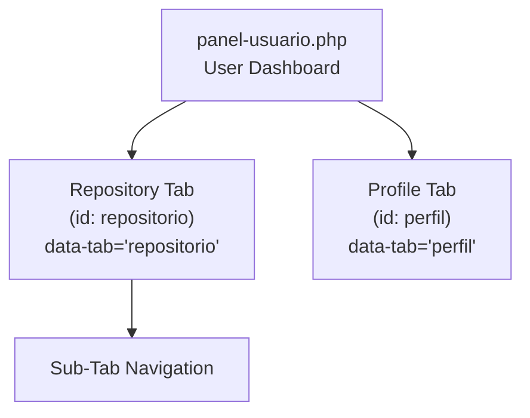
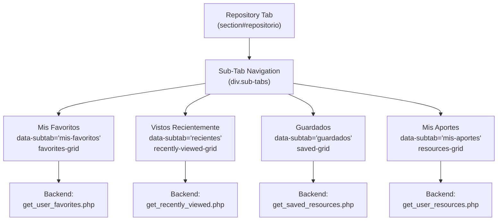
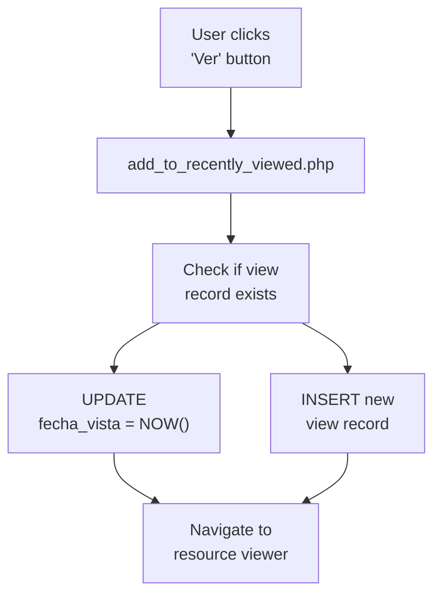
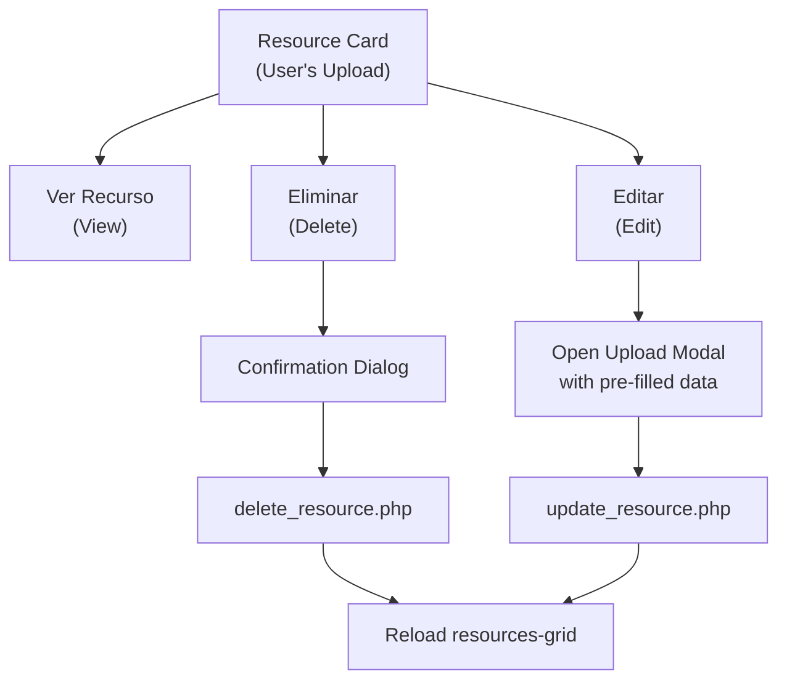
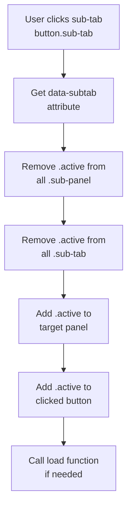
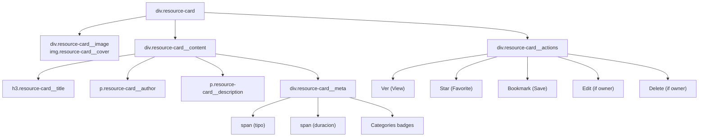
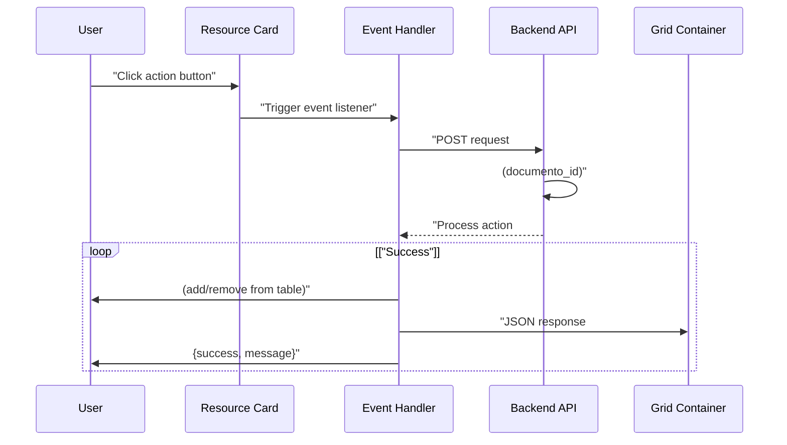

# Repository Tab - User Resources

> **Relevant source files**
> * [src/backend/gestionRecursos/add_to_favorites.php](https://github.com/axchisan/El-rincon-de-ADSO/blob/3e310227/src/backend/gestionRecursos/add_to_favorites.php)
> * [src/backend/gestionRecursos/add_to_recently_viewed.php](https://github.com/axchisan/El-rincon-de-ADSO/blob/3e310227/src/backend/gestionRecursos/add_to_recently_viewed.php)
> * [src/backend/gestionRecursos/add_to_saved.php](https://github.com/axchisan/El-rincon-de-ADSO/blob/3e310227/src/backend/gestionRecursos/add_to_saved.php)
> * [src/backend/gestionRecursos/get_recently_viewed.php](https://github.com/axchisan/El-rincon-de-ADSO/blob/3e310227/src/backend/gestionRecursos/get_recently_viewed.php)
> * [src/backend/gestionRecursos/get_saved_resources.php](https://github.com/axchisan/El-rincon-de-ADSO/blob/3e310227/src/backend/gestionRecursos/get_saved_resources.php)
> * [src/backend/gestionRecursos/get_user_favorites.php](https://github.com/axchisan/El-rincon-de-ADSO/blob/3e310227/src/backend/gestionRecursos/get_user_favorites.php)
> * [src/backend/gestionRecursos/get_user_resources.php](https://github.com/axchisan/El-rincon-de-ADSO/blob/3e310227/src/backend/gestionRecursos/get_user_resources.php)
> * [src/backend/gestionRecursos/remove_from_favorites.php](https://github.com/axchisan/El-rincon-de-ADSO/blob/3e310227/src/backend/gestionRecursos/remove_from_favorites.php)
> * [src/backend/gestionRecursos/remove_from_saved.php](https://github.com/axchisan/El-rincon-de-ADSO/blob/3e310227/src/backend/gestionRecursos/remove_from_saved.php)
> * [src/frontend/inicio/index.php](https://github.com/axchisan/El-rincon-de-ADSO/blob/3e310227/src/frontend/inicio/index.php)
> * [src/frontend/panel/panel-usuario.php](https://github.com/axchisan/El-rincon-de-ADSO/blob/3e310227/src/frontend/panel/panel-usuario.php)
> * [src/frontend/repositorio/repositorio.php](https://github.com/axchisan/El-rincon-de-ADSO/blob/3e310227/src/frontend/repositorio/repositorio.php)

## Purpose and Scope

This document describes the **Repository Tab** within the User Dashboard (`panel-usuario.php`), specifically focusing on the personal resource management interface. This tab allows authenticated users to manage four distinct collections of educational resources: favorites, recently viewed items, saved resources for later, and their own uploaded contributions.

For information about uploading new resources and editing existing ones, see [Resource Upload and Management](/axchisan/El-rincon-de-ADSO/4.3-resource-upload-and-management). For general user dashboard functionality including profile settings, see [User Dashboard (Panel Usuario)](/axchisan/El-rincon-de-ADSO/4-user-dashboard-(panel-usuario)). For browsing the public repository, see [Repository Browser](/axchisan/El-rincon-de-ADSO/5.1-repository-browser).

**Sources:** [src/frontend/panel/panel-usuario.php L160-L347](https://github.com/axchisan/El-rincon-de-ADSO/blob/3e310227/src/frontend/panel/panel-usuario.php#L160-L347)

---

## Interface Structure

The Repository Tab is the default active tab in the user dashboard and contains a nested sub-tab navigation system that organizes user resources into four categories.

### Main Tab Navigation



**Diagram: Main Tab Structure in User Dashboard**

The Repository Tab is activated by clicking the main tab button at [src/frontend/panel/panel-usuario.php L136-L144](https://github.com/axchisan/El-rincon-de-ADSO/blob/3e310227/src/frontend/panel/panel-usuario.php#L136-L144)

 and displays the section defined at [src/frontend/panel/panel-usuario.php L160-L348](https://github.com/axchisan/El-rincon-de-ADSO/blob/3e310227/src/frontend/panel/panel-usuario.php#L160-L348)

**Sources:** [src/frontend/panel/panel-usuario.php L133-L156](https://github.com/axchisan/El-rincon-de-ADSO/blob/3e310227/src/frontend/panel/panel-usuario.php#L133-L156)

 [src/frontend/panel/panel-usuario.php L160-L348](https://github.com/axchisan/El-rincon-de-ADSO/blob/3e310227/src/frontend/panel/panel-usuario.php#L160-L348)

---

## Sub-Tab Organization

The Repository Tab contains four sub-tabs, each serving a distinct purpose for resource collection management.



**Diagram: Sub-Tab Structure and Backend API Mapping**

| Sub-Tab | HTML ID | Grid ID | Backend API | Description |
| --- | --- | --- | --- | --- |
| Mis Favoritos | `mis-favoritos` | `favorites-grid` | `get_user_favorites.php` | Resources marked as favorites by the user |
| Vistos Recientemente | `recientes` | `recently-viewed-grid` | `get_recently_viewed.php` | Last 10 resources viewed by the user |
| Guardados | `guardados` | `saved-grid` | `get_saved_resources.php` | Resources saved for later consultation |
| Mis Aportes | `mis-aportes` | `resources-grid` | `get_user_resources.php` | Resources uploaded by the user |

**Sources:** [src/frontend/panel/panel-usuario.php L161-L166](https://github.com/axchisan/El-rincon-de-ADSO/blob/3e310227/src/frontend/panel/panel-usuario.php#L161-L166)

 [src/frontend/panel/panel-usuario.php L169-L346](https://github.com/axchisan/El-rincon-de-ADSO/blob/3e310227/src/frontend/panel/panel-usuario.php#L169-L346)

---

## Mis Favoritos (My Favorites)

### Interface Components

The Favorites sub-panel displays resources that the user has explicitly marked as favorites using the star icon throughout the platform.

**HTML Structure:**

* Container: `div#mis-favoritos.sub-panel.active` [src/frontend/panel/panel-usuario.php L169-L177](https://github.com/axchisan/El-rincon-de-ADSO/blob/3e310227/src/frontend/panel/panel-usuario.php#L169-L177)
* Grid: `div#favorites-grid.resources-grid` [src/frontend/panel/panel-usuario.php L174-L176](https://github.com/axchisan/El-rincon-de-ADSO/blob/3e310227/src/frontend/panel/panel-usuario.php#L174-L176)

### Backend API: get_user_favorites.php

The favorites API retrieves resources from the `favoritos` table joined with the `documentos` table.

**Key Operations:**

1. Session validation: requires `$_SESSION['usuario_id']` [src/backend/gestionRecursos/get_user_favorites.php L7-L10](https://github.com/axchisan/El-rincon-de-ADSO/blob/3e310227/src/backend/gestionRecursos/get_user_favorites.php#L7-L10)
2. Main query joins `favoritos` and `documentos` tables [src/backend/gestionRecursos/get_user_favorites.php L17-L23](https://github.com/axchisan/El-rincon-de-ADSO/blob/3e310227/src/backend/gestionRecursos/get_user_favorites.php#L17-L23)
3. Results ordered by `fecha_agregado DESC` [src/backend/gestionRecursos/get_user_favorites.php L23](https://github.com/axchisan/El-rincon-de-ADSO/blob/3e310227/src/backend/gestionRecursos/get_user_favorites.php#L23-L23)
4. Enrichment with categories and tags [src/backend/gestionRecursos/get_user_favorites.php L36-L54](https://github.com/axchisan/El-rincon-de-ADSO/blob/3e310227/src/backend/gestionRecursos/get_user_favorites.php#L36-L54)
5. Video duration formatting for `interval` type [src/backend/gestionRecursos/get_user_favorites.php L56-L73](https://github.com/axchisan/El-rincon-de-ADSO/blob/3e310227/src/backend/gestionRecursos/get_user_favorites.php#L56-L73)

**Database Tables:**

* `favoritos`: Stores user-resource favorite relationships
* `documentos`: Contains resource metadata
* `documento_categorias`, `categorias`: Category associations
* `documento_etiqueta`, `etiquetas`: Tag associations

### Data Flow

```mermaid
sequenceDiagram
  participant User Browser
  participant loadUserFavorites()
  participant panel-usuario.js
  participant get_user_favorites.php
  participant PostgreSQL
  participant favoritos table

  User Browser->>loadUserFavorites(): "Navigate to Favoritos tab"
  loadUserFavorites()->>get_user_favorites.php: "GET request
  get_user_favorites.php->>PostgreSQL: (session: usuario_id)"
  PostgreSQL-->>get_user_favorites.php: "SELECT d.* FROM documentos d
  loop ["For each resource"]
    get_user_favorites.php->>PostgreSQL: JOIN favoritos f ON d.id = f.documento_id
    PostgreSQL-->>get_user_favorites.php: WHERE f.usuario_id = :usuario_id"
    get_user_favorites.php->>PostgreSQL: "Resource records"
    PostgreSQL-->>get_user_favorites.php: "Get categories from
  end
  get_user_favorites.php-->>loadUserFavorites(): documento_categorias"
  loadUserFavorites()->>User Browser: "Category names"
```

**Diagram: Favorites Loading Data Flow**

**Sources:** [src/backend/gestionRecursos/get_user_favorites.php L1-L81](https://github.com/axchisan/El-rincon-de-ADSO/blob/3e310227/src/backend/gestionRecursos/get_user_favorites.php#L1-L81)

 [src/frontend/panel/panel-usuario.php L787-L858](https://github.com/axchisan/El-rincon-de-ADSO/blob/3e310227/src/frontend/panel/panel-usuario.php#L787-L858)

### User Actions

Users can perform the following actions on favorited resources:

* **View Resource**: Navigate to the resource viewer (video/book/document page)
* **Remove from Favorites**: Click the filled star icon to unfavorite [src/backend/gestionRecursos/remove_from_favorites.php L1-L30](https://github.com/axchisan/El-rincon-de-ADSO/blob/3e310227/src/backend/gestionRecursos/remove_from_favorites.php#L1-L30)
* **Add to Saved**: Save for later consultation
* **Edit/Delete**: If the user is the resource owner

**Sources:** [src/frontend/panel/panel-usuario.php L917-L1014](https://github.com/axchisan/El-rincon-de-ADSO/blob/3e310227/src/frontend/panel/panel-usuario.php#L917-L1014)

---

## Vistos Recientemente (Recently Viewed)

### Interface Components

The Recently Viewed sub-panel displays the last 10 resources that the user has accessed, ordered by most recent first.

**HTML Structure:**

* Container: `div#recientes.sub-panel` [src/frontend/panel/panel-usuario.php L179-L187](https://github.com/axchisan/El-rincon-de-ADSO/blob/3e310227/src/frontend/panel/panel-usuario.php#L179-L187)
* Grid: `div#recently-viewed-grid.resources-grid` [src/frontend/panel/panel-usuario.php L184-L186](https://github.com/axchisan/El-rincon-de-ADSO/blob/3e310227/src/frontend/panel/panel-usuario.php#L184-L186)

### Backend API: get_recently_viewed.php

Retrieves resources from the `recientemente_vistos` tracking table.

**Key Operations:**

1. Query joins `recientemente_vistos` with `documentos` [src/backend/gestionRecursos/get_recently_viewed.php L17-L24](https://github.com/axchisan/El-rincon-de-ADSO/blob/3e310227/src/backend/gestionRecursos/get_recently_viewed.php#L17-L24)
2. Limited to 10 most recent items [src/backend/gestionRecursos/get_recently_viewed.php L24](https://github.com/axchisan/El-rincon-de-ADSO/blob/3e310227/src/backend/gestionRecursos/get_recently_viewed.php#L24-L24)
3. Ordered by `fecha_vista DESC` [src/backend/gestionRecursos/get_recently_viewed.php L23](https://github.com/axchisan/El-rincon-de-ADSO/blob/3e310227/src/backend/gestionRecursos/get_recently_viewed.php#L23-L23)
4. Includes timestamp of when resource was viewed [src/backend/gestionRecursos/get_recently_viewed.php L19](https://github.com/axchisan/El-rincon-de-ADSO/blob/3e310227/src/backend/gestionRecursos/get_recently_viewed.php#L19-L19)

### Automatic Tracking

Resource views are automatically tracked when users click on any resource card across the platform. The tracking is handled by:

* **add_to_recently_viewed.php**: Records or updates view timestamp [src/backend/gestionRecursos/add_to_recently_viewed.php L1-L50](https://github.com/axchisan/El-rincon-de-ADSO/blob/3e310227/src/backend/gestionRecursos/add_to_recently_viewed.php#L1-L50)
* **Logic**: If record exists, updates timestamp; otherwise inserts new record [src/backend/gestionRecursos/add_to_recently_viewed.php L28-L44](https://github.com/axchisan/El-rincon-de-ADSO/blob/3e310227/src/backend/gestionRecursos/add_to_recently_viewed.php#L28-L44)



**Diagram: Recently Viewed Tracking Flow**

**Sources:** [src/backend/gestionRecursos/get_recently_viewed.php L1-L82](https://github.com/axchisan/El-rincon-de-ADSO/blob/3e310227/src/backend/gestionRecursos/get_recently_viewed.php#L1-L82)

 [src/backend/gestionRecursos/add_to_recently_viewed.php L1-L50](https://github.com/axchisan/El-rincon-de-ADSO/blob/3e310227/src/backend/gestionRecursos/add_to_recently_viewed.php#L1-L50)

 [src/frontend/panel/panel-usuario.php L860-L931](https://github.com/axchisan/El-rincon-de-ADSO/blob/3e310227/src/frontend/panel/panel-usuario.php#L860-L931)

---

## Guardados (Saved Resources)

### Interface Components

The Saved Resources sub-panel displays items that users have explicitly saved for later consultation using the "Guardar" button.

**HTML Structure:**

* Container: `div#guardados.sub-panel` [src/frontend/panel/panel-usuario.php L189-L197](https://github.com/axchisan/El-rincon-de-ADSO/blob/3e310227/src/frontend/panel/panel-usuario.php#L189-L197)
* Grid: `div#saved-grid.resources-grid` [src/frontend/panel/panel-usuario.php L194-L196](https://github.com/axchisan/El-rincon-de-ADSO/blob/3e310227/src/frontend/panel/panel-usuario.php#L194-L196)

### Backend API: get_saved_resources.php

Retrieves resources from the `guardados` table.

**Key Operations:**

1. Query joins `guardados` with `documentos` [src/backend/gestionRecursos/get_saved_resources.php L17-L23](https://github.com/axchisan/El-rincon-de-ADSO/blob/3e310227/src/backend/gestionRecursos/get_saved_resources.php#L17-L23)
2. Ordered by `fecha_guardado DESC` [src/backend/gestionRecursos/get_saved_resources.php L23](https://github.com/axchisan/El-rincon-de-ADSO/blob/3e310227/src/backend/gestionRecursos/get_saved_resources.php#L23-L23)
3. Includes save timestamp in results [src/backend/gestionRecursos/get_saved_resources.php L19](https://github.com/axchisan/El-rincon-de-ADSO/blob/3e310227/src/backend/gestionRecursos/get_saved_resources.php#L19-L19)

### Save/Unsave Operations

Users can add resources to saved collection from any resource card:

**Adding to Saved:**

* **API**: `add_to_saved.php` [src/backend/gestionRecursos/add_to_saved.php L1-L46](https://github.com/axchisan/El-rincon-de-ADSO/blob/3e310227/src/backend/gestionRecursos/add_to_saved.php#L1-L46)
* **Validation**: Checks if already saved to prevent duplicates [src/backend/gestionRecursos/add_to_saved.php L27-L35](https://github.com/axchisan/El-rincon-de-ADSO/blob/3e310227/src/backend/gestionRecursos/add_to_saved.php#L27-L35)
* **Database**: Inserts into `guardados` table with timestamp [src/backend/gestionRecursos/add_to_saved.php L37-L40](https://github.com/axchisan/El-rincon-de-ADSO/blob/3e310227/src/backend/gestionRecursos/add_to_saved.php#L37-L40)

**Removing from Saved:**

* **API**: `remove_from_saved.php` [src/backend/gestionRecursos/remove_from_saved.php L1-L30](https://github.com/axchisan/El-rincon-de-ADSO/blob/3e310227/src/backend/gestionRecursos/remove_from_saved.php#L1-L30)
* **Operation**: Deletes record from `guardados` table [src/backend/gestionRecursos/remove_from_saved.php L18-L20](https://github.com/axchisan/El-rincon-de-ADSO/blob/3e310227/src/backend/gestionRecursos/remove_from_saved.php#L18-L20)

**Sources:** [src/backend/gestionRecursos/get_saved_resources.php L1-L81](https://github.com/axchisan/El-rincon-de-ADSO/blob/3e310227/src/backend/gestionRecursos/get_saved_resources.php#L1-L81)

 [src/backend/gestionRecursos/add_to_saved.php L1-L46](https://github.com/axchisan/El-rincon-de-ADSO/blob/3e310227/src/backend/gestionRecursos/add_to_saved.php#L1-L46)

 [src/backend/gestionRecursos/remove_from_saved.php L1-L30](https://github.com/axchisan/El-rincon-de-ADSO/blob/3e310227/src/backend/gestionRecursos/remove_from_saved.php#L1-L30)

 [src/frontend/panel/panel-usuario.php L933-L1004](https://github.com/axchisan/El-rincon-de-ADSO/blob/3e310227/src/frontend/panel/panel-usuario.php#L933-L1004)

---

## Mis Aportes (My Contributions)

### Interface Components

The My Contributions sub-panel displays resources that the current user has uploaded to the repository. This tab includes an upload button for creating new resources.

**HTML Structure:**

* Container: `div#mis-aportes.sub-panel` [src/frontend/panel/panel-usuario.php L199-L346](https://github.com/axchisan/El-rincon-de-ADSO/blob/3e310227/src/frontend/panel/panel-usuario.php#L199-L346)
* Action Bar: Button to open upload modal [src/frontend/panel/panel-usuario.php L204-L206](https://github.com/axchisan/El-rincon-de-ADSO/blob/3e310227/src/frontend/panel/panel-usuario.php#L204-L206)
* Upload Modal: Complete form for resource creation [src/frontend/panel/panel-usuario.php L207-L342](https://github.com/axchisan/El-rincon-de-ADSO/blob/3e310227/src/frontend/panel/panel-usuario.php#L207-L342)
* Grid: `div#resources-grid.resources-grid` [src/frontend/panel/panel-usuario.php L343-L345](https://github.com/axchisan/El-rincon-de-ADSO/blob/3e310227/src/frontend/panel/panel-usuario.php#L343-L345)

### Backend API: get_user_resources.php

Retrieves resources where the user is the author.

**Key Operations:**

1. Query filters by `autor_id = :autor_id` [src/backend/gestionRecursos/get_user_resources.php L17-L22](https://github.com/axchisan/El-rincon-de-ADSO/blob/3e310227/src/backend/gestionRecursos/get_user_resources.php#L17-L22)
2. No JOIN with collection tables - direct `documentos` query [src/backend/gestionRecursos/get_user_resources.php L17-L22](https://github.com/axchisan/El-rincon-de-ADSO/blob/3e310227/src/backend/gestionRecursos/get_user_resources.php#L17-L22)
3. Ordered by `fecha_publicacion DESC` [src/backend/gestionRecursos/get_user_resources.php L22](https://github.com/axchisan/El-rincon-de-ADSO/blob/3e310227/src/backend/gestionRecursos/get_user_resources.php#L22-L22)
4. Returns all resource metadata including status and visibility [src/backend/gestionRecursos/get_user_resources.php L17-L19](https://github.com/axchisan/El-rincon-de-ADSO/blob/3e310227/src/backend/gestionRecursos/get_user_resources.php#L17-L19)

**Resource Metadata Fields:**

* `id`, `titulo`, `descripcion`, `autor`, `tipo`, `url_archivo`, `portada`
* `duracion`, `fecha_publicacion`, `relevancia`, `visibilidad`
* `idioma`, `licencia`, `estado`
* Enriched: `categorias[]`, `etiquetas[]`

### Owner-Specific Actions

Users can perform additional actions on their own resources:



**Diagram: Owner-Specific Resource Actions**

**Action Buttons:**

* Edit: Opens the upload modal with pre-populated fields [src/frontend/panel/panel-usuario.php L1256-L1314](https://github.com/axchisan/El-rincon-de-ADSO/blob/3e310227/src/frontend/panel/panel-usuario.php#L1256-L1314)
* Delete: Shows confirmation and calls backend API [src/frontend/panel/panel-usuario.php L1315-L1362](https://github.com/axchisan/El-rincon-de-ADSO/blob/3e310227/src/frontend/panel/panel-usuario.php#L1315-L1362)

**Sources:** [src/backend/gestionRecursos/get_user_resources.php L1-L75](https://github.com/axchisan/El-rincon-de-ADSO/blob/3e310227/src/backend/gestionRecursos/get_user_resources.php#L1-L75)

 [src/frontend/panel/panel-usuario.php L199-L346](https://github.com/axchisan/El-rincon-de-ADSO/blob/3e310227/src/frontend/panel/panel-usuario.php#L199-L346)

 [src/frontend/panel/panel-usuario.php L1006-L1362](https://github.com/axchisan/El-rincon-de-ADSO/blob/3e310227/src/frontend/panel/panel-usuario.php#L1006-L1362)

---

## Backend API Architecture

All four backend APIs follow a consistent pattern for data retrieval and enrichment.

```mermaid
flowchart TD

SessionCheck["Session Validation<br>$_SESSION['usuario_id']"]
DBConnect["conexionDB::getConexion()"]
MainQuery["Main SQL Query<br>(JOIN with documentos)"]
LoopResources["Loop through results"]
GetCategories["Fetch Categories<br>(documento_categorias)"]
GetTags["Fetch Tags<br>(documento_etiqueta)"]
FormatDuration["Format Video Duration<br>(if tipo='video')"]
JSONResponse["json_encode(resources)"]

subgraph subGraph0 ["Common API Structure"]
    SessionCheck
    DBConnect
    MainQuery
    LoopResources
    GetCategories
    GetTags
    FormatDuration
    JSONResponse
    SessionCheck --> DBConnect
    DBConnect --> MainQuery
    MainQuery --> LoopResources
    LoopResources --> GetCategories
    GetCategories --> GetTags
    GetTags --> FormatDuration
    FormatDuration --> JSONResponse
end
```



**Diagram: Common Backend API Pattern**

### API Comparison Table

| API File | Primary Table | JOIN Table | Filter Condition | Sort Order | Limit |
| --- | --- | --- | --- | --- | --- |
| `get_user_favorites.php` | `documentos` | `favoritos` | `f.usuario_id = :usuario_id` | `f.fecha_agregado DESC` | None |
| `get_recently_viewed.php` | `documentos` | `recientemente_vistos` | `rv.usuario_id = :usuario_id` | `rv.fecha_vista DESC` | 10 |
| `get_saved_resources.php` | `documentos` | `guardados` | `s.usuario_id = :usuario_id` | `s.fecha_guardado DESC` | None |
| `get_user_resources.php` | `documentos` | None | `d.autor_id = :autor_id` | `d.fecha_publicacion DESC` | None |

### Enrichment Queries

All APIs perform secondary queries to enrich each resource with relational data:

**Categories Query Pattern:**

```sql
SELECT c.nombre 
FROM documento_categorias dc
JOIN categorias c ON dc.categoria_id = c.id
WHERE dc.documento_id = :documento_id
```

[src/backend/gestionRecursos/get_user_favorites.php L37-L42](https://github.com/axchisan/El-rincon-de-ADSO/blob/3e310227/src/backend/gestionRecursos/get_user_favorites.php#L37-L42)

**Tags Query Pattern:**

```sql
SELECT e.nombre 
FROM documento_etiqueta de
JOIN etiquetas e ON de.etiqueta_id = e.id
WHERE de.documento_id = :documento_id
```

[src/backend/gestionRecursos/get_user_favorites.php L47-L52](https://github.com/axchisan/El-rincon-de-ADSO/blob/3e310227/src/backend/gestionRecursos/get_user_favorites.php#L47-L52)

### Video Duration Formatting

Videos store duration as PostgreSQL `interval` type. All APIs include formatting logic:

1. Parse interval string (format: `HH:MM:SS`) [src/backend/gestionRecursos/get_user_favorites.php L60-L63](https://github.com/axchisan/El-rincon-de-ADSO/blob/3e310227/src/backend/gestionRecursos/get_user_favorites.php#L60-L63)
2. Convert to total seconds [src/backend/gestionRecursos/get_user_favorites.php L58](https://github.com/axchisan/El-rincon-de-ADSO/blob/3e310227/src/backend/gestionRecursos/get_user_favorites.php#L58-L58)
3. Reformat to `sprintf("%02d:%02d:%02d", $hours, $minutes, $seconds)` [src/backend/gestionRecursos/get_user_favorites.php L64](https://github.com/axchisan/El-rincon-de-ADSO/blob/3e310227/src/backend/gestionRecursos/get_user_favorites.php#L64-L64)

**Sources:** [src/backend/gestionRecursos/get_user_favorites.php L56-L73](https://github.com/axchisan/El-rincon-de-ADSO/blob/3e310227/src/backend/gestionRecursos/get_user_favorites.php#L56-L73)

 [src/backend/gestionRecursos/get_recently_viewed.php L57-L74](https://github.com/axchisan/El-rincon-de-ADSO/blob/3e310227/src/backend/gestionRecursos/get_recently_viewed.php#L57-L74)

 [src/backend/gestionRecursos/get_saved_resources.php L56-L73](https://github.com/axchisan/El-rincon-de-ADSO/blob/3e310227/src/backend/gestionRecursos/get_saved_resources.php#L56-L73)

 [src/backend/gestionRecursos/get_user_resources.php L50-L67](https://github.com/axchisan/El-rincon-de-ADSO/blob/3e310227/src/backend/gestionRecursos/get_user_resources.php#L50-L67)

---

## Frontend State Management

The frontend JavaScript manages tab switching, data loading, and user interactions through event listeners and state variables.

### Tab Switching Logic



**Diagram: Sub-Tab Navigation State Management**

**Implementation:** [src/frontend/panel/panel-usuario.php L703-L726](https://github.com/axchisan/El-rincon-de-ADSO/blob/3e310227/src/frontend/panel/panel-usuario.php#L703-L726)

The JavaScript defines four loading functions, each following this pattern:

* **loadUserFavorites()**: [src/frontend/panel/panel-usuario.php L787-L858](https://github.com/axchisan/El-rincon-de-ADSO/blob/3e310227/src/frontend/panel/panel-usuario.php#L787-L858)
* **loadRecentlyViewed()**: [src/frontend/panel/panel-usuario.php L860-L931](https://github.com/axchisan/El-rincon-de-ADSO/blob/3e310227/src/frontend/panel/panel-usuario.php#L860-L931)
* **loadSavedResources()**: [src/frontend/panel/panel-usuario.php L933-L1004](https://github.com/axchisan/El-rincon-de-ADSO/blob/3e310227/src/frontend/panel/panel-usuario.php#L933-L1004)
* **loadUserResources()**: [src/frontend/panel/panel-usuario.php L1006-L1101](https://github.com/axchisan/El-rincon-de-ADSO/blob/3e310227/src/frontend/panel/panel-usuario.php#L1006-L1101)

### Loading Function Pattern

Each loading function follows this structure:

1. Fetch data from backend API
2. Handle empty results
3. Iterate through resources array
4. Generate HTML for resource cards using `generateResourceCard()`
5. Inject HTML into respective grid container
6. Attach event listeners to action buttons

**Sources:** [src/frontend/panel/panel-usuario.php L703-L1101](https://github.com/axchisan/El-rincon-de-ADSO/blob/3e310227/src/frontend/panel/panel-usuario.php#L703-L1101)

---

## Resource Card Rendering

Resource cards are dynamically generated using the `generateResourceCard()` function, which adapts the display based on resource type and user ownership.

### Card Generation Function

**Function Signature:**

```javascript
function generateResourceCard(resource, showActions = true, isOwner = false)
```

Location: [src/frontend/panel/panel-usuario.php L1103-L1254](https://github.com/axchisan/El-rincon-de-ADSO/blob/3e310227/src/frontend/panel/panel-usuario.php#L1103-L1254)

### Card Structure



**Diagram: Resource Card Component Structure**

### Conditional Rendering

**Action Buttons Display Logic:**

* **showActions = true**: Shows view, favorite, and save buttons
* **isOwner = true**: Adds edit and delete buttons [src/frontend/panel/panel-usuario.php L1203-L1216](https://github.com/axchisan/El-rincon-de-ADSO/blob/3e310227/src/frontend/panel/panel-usuario.php#L1203-L1216)
* **Favorite State**: Filled star vs. outline star based on `is_favorite` flag [src/frontend/panel/panel-usuario.php L1195-L1200](https://github.com/axchisan/El-rincon-de-ADSO/blob/3e310227/src/frontend/panel/panel-usuario.php#L1195-L1200)

**Type-Specific Elements:**

* **Videos**: Display duration badge [src/frontend/panel/panel-usuario.php L1176-L1180](https://github.com/axchisan/El-rincon-de-ADSO/blob/3e310227/src/frontend/panel/panel-usuario.php#L1176-L1180)
* **All types**: Display type badge with icon [src/frontend/panel/panel-usuario.php L1168-L1174](https://github.com/axchisan/El-rincon-de-ADSO/blob/3e310227/src/frontend/panel/panel-usuario.php#L1168-L1174)

### Resource URLs

Card links route to appropriate viewer pages based on resource type:

| Resource Type | Viewer Page | Pattern |
| --- | --- | --- |
| `libro` | `ver_libro.php` | `../recursos/ver_libro.php?id=${resource.id}` |
| `video` | `ver_video.php` | `../recursos/ver_video.php?id=${resource.id}` |
| `documento` | `ver_documento.php` | `../recursos/ver_documento.php?id=${resource.id}` |

Location: [src/frontend/panel/panel-usuario.php L1111-L1119](https://github.com/axchisan/El-rincon-de-ADSO/blob/3e310227/src/frontend/panel/panel-usuario.php#L1111-L1119)

**Sources:** [src/frontend/panel/panel-usuario.php L1103-L1254](https://github.com/axchisan/El-rincon-de-ADSO/blob/3e310227/src/frontend/panel/panel-usuario.php#L1103-L1254)

---

## Event Handling and User Interactions

Event listeners are attached to action buttons after rendering resource cards, enabling dynamic interactions without page reloads.

### Interaction Flow



**Diagram: User Interaction Event Flow**

### Event Attachment Pattern

After rendering cards, the system attaches listeners using this pattern:

```javascript
// Example from loadUserResources()
document.querySelectorAll('.edit-resource').forEach(button => {
    button.addEventListener('click', function() {
        const resourceId = this.getAttribute('data-id');
        // Open modal with resource data
    });
});

document.querySelectorAll('.delete-resource').forEach(button => {
    button.addEventListener('click', function() {
        const resourceId = this.getAttribute('data-id');
        // Show confirmation, then delete
    });
});
```

Location: [src/frontend/panel/panel-usuario.php L1061-L1099](https://github.com/axchisan/El-rincon-de-ADSO/blob/3e310227/src/frontend/panel/panel-usuario.php#L1061-L1099)

### API Endpoints for Actions

| Action | Method | Endpoint | Database Operation |
| --- | --- | --- | --- |
| Add to Favorites | POST | `add_to_favorites.php` | `INSERT INTO favoritos` |
| Remove from Favorites | POST | `remove_from_favorites.php` | `DELETE FROM favoritos` |
| Add to Saved | POST | `add_to_saved.php` | `INSERT INTO guardados` |
| Remove from Saved | POST | `remove_from_saved.php` | `DELETE FROM guardados` |
| Track View | POST | `add_to_recently_viewed.php` | `INSERT/UPDATE recientemente_vistos` |

**Sources:** [src/frontend/panel/panel-usuario.php L917-L1099](https://github.com/axchisan/El-rincon-de-ADSO/blob/3e310227/src/frontend/panel/panel-usuario.php#L917-L1099)

 [src/backend/gestionRecursos/add_to_favorites.php L1-L34](https://github.com/axchisan/El-rincon-de-ADSO/blob/3e310227/src/backend/gestionRecursos/add_to_favorites.php#L1-L34)

 [src/backend/gestionRecursos/remove_from_favorites.php L1-L30](https://github.com/axchisan/El-rincon-de-ADSO/blob/3e310227/src/backend/gestionRecursos/remove_from_favorites.php#L1-L30)

 [src/backend/gestionRecursos/add_to_saved.php L1-L46](https://github.com/axchisan/El-rincon-de-ADSO/blob/3e310227/src/backend/gestionRecursos/add_to_saved.php#L1-L46)

 [src/backend/gestionRecursos/remove_from_saved.php L1-L30](https://github.com/axchisan/El-rincon-de-ADSO/blob/3e310227/src/backend/gestionRecursos/remove_from_saved.php#L1-L30)

 [src/backend/gestionRecursos/add_to_recently_viewed.php L1-L50](https://github.com/axchisan/El-rincon-de-ADSO/blob/3e310227/src/backend/gestionRecursos/add_to_recently_viewed.php#L1-L50)

---

## Database Schema Integration

The Repository Tab interfaces with multiple database tables to manage resource collections.

### Collection Tables

```css
#mermaid-nzeemc7ptxn{font-family:ui-sans-serif,-apple-system,system-ui,Segoe UI,Helvetica;font-size:16px;fill:#333;}@keyframes edge-animation-frame{from{stroke-dashoffset:0;}}@keyframes dash{to{stroke-dashoffset:0;}}#mermaid-nzeemc7ptxn .edge-animation-slow{stroke-dasharray:9,5!important;stroke-dashoffset:900;animation:dash 50s linear infinite;stroke-linecap:round;}#mermaid-nzeemc7ptxn .edge-animation-fast{stroke-dasharray:9,5!important;stroke-dashoffset:900;animation:dash 20s linear infinite;stroke-linecap:round;}#mermaid-nzeemc7ptxn .error-icon{fill:#dddddd;}#mermaid-nzeemc7ptxn .error-text{fill:#222222;stroke:#222222;}#mermaid-nzeemc7ptxn .edge-thickness-normal{stroke-width:1px;}#mermaid-nzeemc7ptxn .edge-thickness-thick{stroke-width:3.5px;}#mermaid-nzeemc7ptxn .edge-pattern-solid{stroke-dasharray:0;}#mermaid-nzeemc7ptxn .edge-thickness-invisible{stroke-width:0;fill:none;}#mermaid-nzeemc7ptxn .edge-pattern-dashed{stroke-dasharray:3;}#mermaid-nzeemc7ptxn .edge-pattern-dotted{stroke-dasharray:2;}#mermaid-nzeemc7ptxn .marker{fill:#999;stroke:#999;}#mermaid-nzeemc7ptxn .marker.cross{stroke:#999;}#mermaid-nzeemc7ptxn svg{font-family:ui-sans-serif,-apple-system,system-ui,Segoe UI,Helvetica;font-size:16px;}#mermaid-nzeemc7ptxn p{margin:0;}#mermaid-nzeemc7ptxn .entityBox{fill:#ffffff;stroke:#dddddd;}#mermaid-nzeemc7ptxn .relationshipLabelBox{fill:#dddddd;opacity:0.7;background-color:#dddddd;}#mermaid-nzeemc7ptxn .relationshipLabelBox rect{opacity:0.5;}#mermaid-nzeemc7ptxn .labelBkg{background-color:rgba(221, 221, 221, 0.5);}#mermaid-nzeemc7ptxn .edgeLabel .label{fill:#dddddd;font-size:14px;}#mermaid-nzeemc7ptxn .label{font-family:ui-sans-serif,-apple-system,system-ui,Segoe UI,Helvetica;color:#333;}#mermaid-nzeemc7ptxn .edge-pattern-dashed{stroke-dasharray:8,8;}#mermaid-nzeemc7ptxn .node rect,#mermaid-nzeemc7ptxn .node circle,#mermaid-nzeemc7ptxn .node ellipse,#mermaid-nzeemc7ptxn .node polygon{fill:#ffffff;stroke:#dddddd;stroke-width:1px;}#mermaid-nzeemc7ptxn .relationshipLine{stroke:#999;stroke-width:1;fill:none;}#mermaid-nzeemc7ptxn .marker{fill:none!important;stroke:#999!important;stroke-width:1;}#mermaid-nzeemc7ptxn :root{--mermaid-font-family:"trebuchet ms",verdana,arial,sans-serif;}hashashascreatesfavorited_insaved_inviewed_inhashascategorizestagsusuariosfavoritosintusuario_idFKintdocumento_idFKtimestampfecha_agregadoguardadosintusuario_idFKintdocumento_idFKtimestampfecha_guardadorecientemente_vistosintusuario_idFKintdocumento_idFKtimestampfecha_vistadocumentosintidPKintautor_idFKstringtitulostringtipostringestadostringvisibilidaddocumento_categoriasdocumento_etiquetacategoriasetiquetas
```

**Diagram: Database Relationships for Resource Collections**

### Table Purposes

| Table Name | Purpose | Key Columns | Notes |
| --- | --- | --- | --- |
| `favoritos` | User's favorite resources | `usuario_id`, `documento_id`, `fecha_agregado` | No duplicate prevention at DB level |
| `guardados` | Resources saved for later | `usuario_id`, `documento_id`, `fecha_guardado` | Separate from favorites |
| `recientemente_vistos` | Browsing history | `usuario_id`, `documento_id`, `fecha_vista` | Updated on each view |
| `documentos` | All resources | `id`, `autor_id`, `tipo`, `estado` | Central resource table |
| `documento_categorias` | Category associations | `documento_id`, `categoria_id` | Many-to-many junction |
| `documento_etiqueta` | Tag associations | `documento_id`, `etiqueta_id` | Many-to-many junction |

### Query Patterns

**Favorites Query:**

```sql
SELECT d.*, f.fecha_agregado
FROM documentos d
JOIN favoritos f ON d.id = f.documento_id
WHERE f.usuario_id = :usuario_id
ORDER BY f.fecha_agregado DESC
```

**User Resources Query:**

```sql
SELECT d.*
FROM documentos d
WHERE d.autor_id = :autor_id
ORDER BY d.fecha_publicacion DESC
```

**Sources:** [src/backend/gestionRecursos/get_user_favorites.php L17-L23](https://github.com/axchisan/El-rincon-de-ADSO/blob/3e310227/src/backend/gestionRecursos/get_user_favorites.php#L17-L23)

 [src/backend/gestionRecursos/get_recently_viewed.php L17-L24](https://github.com/axchisan/El-rincon-de-ADSO/blob/3e310227/src/backend/gestionRecursos/get_recently_viewed.php#L17-L24)

 [src/backend/gestionRecursos/get_saved_resources.php L17-L23](https://github.com/axchisan/El-rincon-de-ADSO/blob/3e310227/src/backend/gestionRecursos/get_saved_resources.php#L17-L23)

 [src/backend/gestionRecursos/get_user_resources.php L17-L22](https://github.com/axchisan/El-rincon-de-ADSO/blob/3e310227/src/backend/gestionRecursos/get_user_resources.php#L17-L22)

---

## Error Handling

The system implements comprehensive error handling at multiple levels.

### Backend Error Handling

**Session Validation:**
All APIs check for authenticated session:

```php
if (!isset($_SESSION['usuario_id'])) {
    echo json_encode([]);
    exit;
}
```

Location: [src/backend/gestionRecursos/get_user_favorites.php L7-L10](https://github.com/axchisan/El-rincon-de-ADSO/blob/3e310227/src/backend/gestionRecursos/get_user_favorites.php#L7-L10)

**Database Exception Handling:**

```javascript
try {
    // Database operations
} catch (PDOException $e) {
    error_log("Error in get_user_favorites.php: " . $e->getMessage());
    echo json_encode(['error' => $e->getMessage()]);
}
```

Location: [src/backend/gestionRecursos/get_user_favorites.php L71-L74](https://github.com/axchisan/El-rincon-de-ADSO/blob/3e310227/src/backend/gestionRecursos/get_user_favorites.php#L71-L74)

### Frontend Error Handling

**Empty State Handling:**
When no resources are found, the UI displays appropriate messages:

* Favorites: "No tienes recursos en favoritos" [src/frontend/panel/panel-usuario.php L819](https://github.com/axchisan/El-rincon-de-ADSO/blob/3e310227/src/frontend/panel/panel-usuario.php#L819-L819)
* Recently Viewed: "No has visto ningún recurso recientemente" [src/frontend/panel/panel-usuario.php L891](https://github.com/axchisan/El-rincon-de-ADSO/blob/3e310227/src/frontend/panel/panel-usuario.php#L891-L891)
* Saved: "No tienes recursos guardados" [src/frontend/panel/panel-usuario.php L965](https://github.com/axchisan/El-rincon-de-ADSO/blob/3e310227/src/frontend/panel/panel-usuario.php#L965-L965)
* My Contributions: "No has subido ningún recurso" [src/frontend/panel/panel-usuario.php L1037](https://github.com/axchisan/El-rincon-de-ADSO/blob/3e310227/src/frontend/panel/panel-usuario.php#L1037-L1037)

**Fetch Error Handling:**
Network errors are caught and logged:

```javascript
.catch(error => {
    console.error('Error al cargar favoritos:', error);
    document.getElementById('favorites-grid').innerHTML = 
        '<p>Error al cargar los recursos favoritos.</p>';
});
```

Location: [src/frontend/panel/panel-usuario.php L853-L856](https://github.com/axchisan/El-rincon-de-ADSO/blob/3e310227/src/frontend/panel/panel-usuario.php#L853-L856)

**Sources:** [src/frontend/panel/panel-usuario.php L787-L1101](https://github.com/axchisan/El-rincon-de-ADSO/blob/3e310227/src/frontend/panel/panel-usuario.php#L787-L1101)

 [src/backend/gestionRecursos/get_user_favorites.php L7-L10](https://github.com/axchisan/El-rincon-de-ADSO/blob/3e310227/src/backend/gestionRecursos/get_user_favorites.php#L7-L10)

 [src/backend/gestionRecursos/get_user_favorites.php L71-L74](https://github.com/axchisan/El-rincon-de-ADSO/blob/3e310227/src/backend/gestionRecursos/get_user_favorites.php#L71-L74)