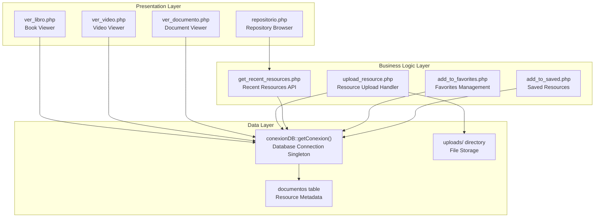
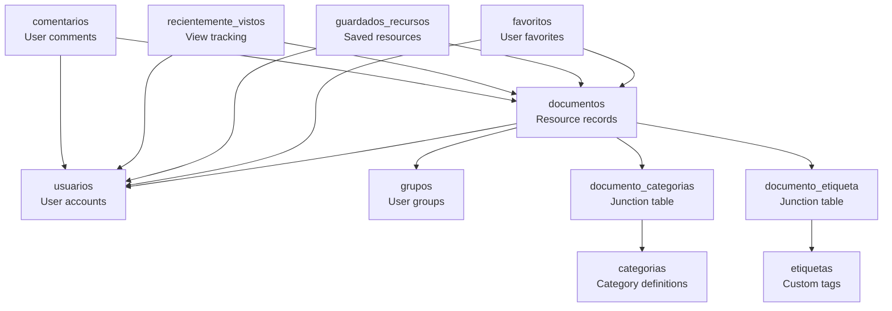
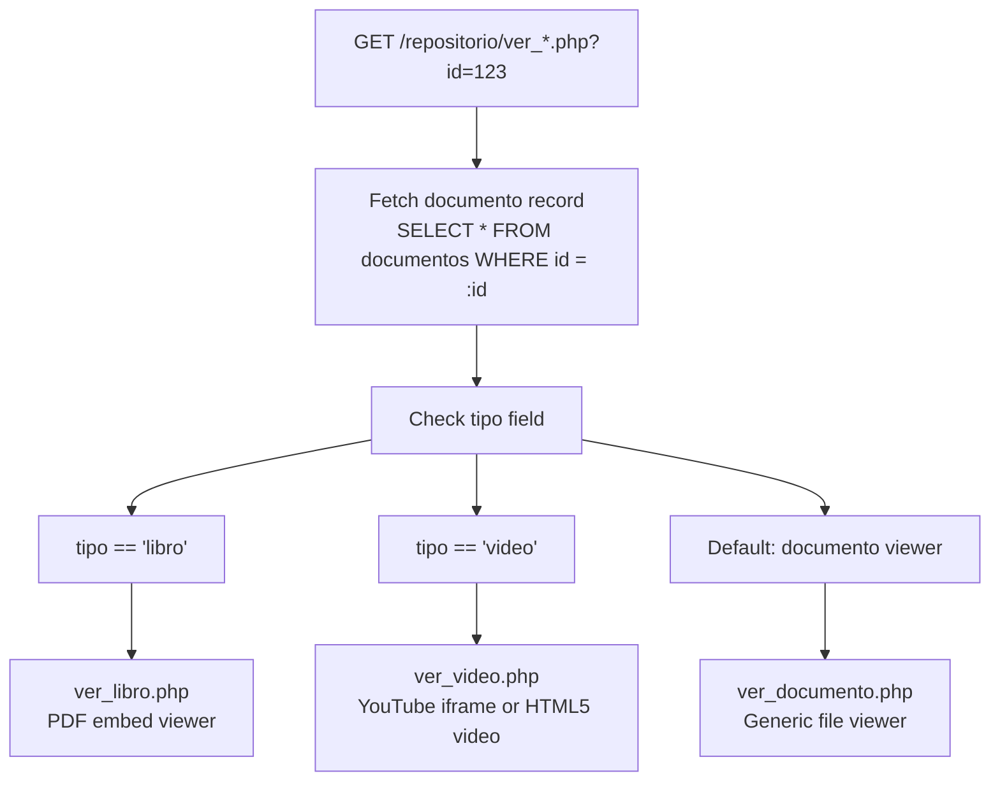
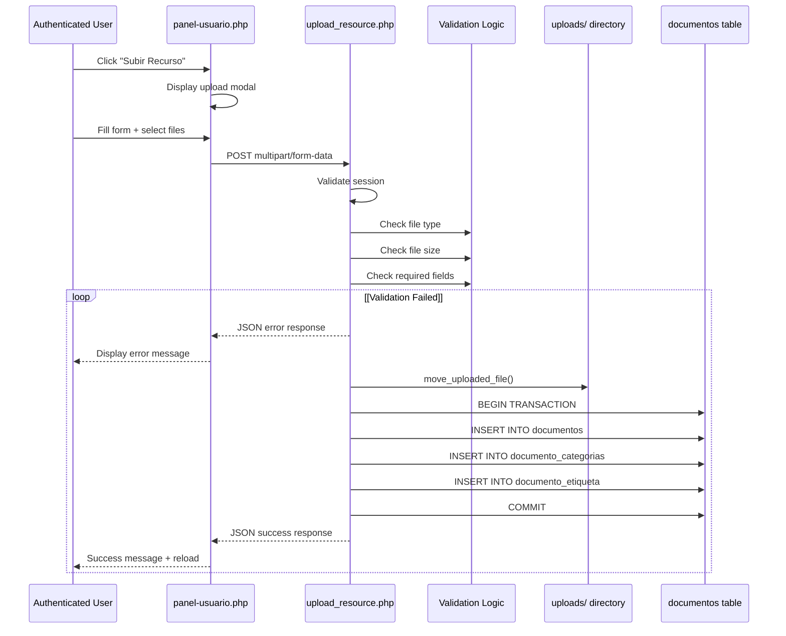
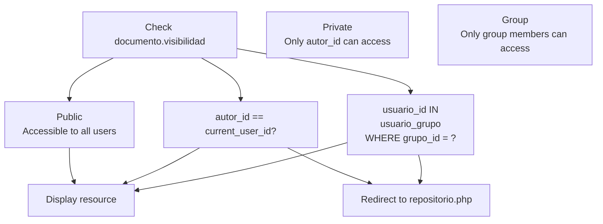

# Resource Management System

> **Relevant source files**
> * [README.md](https://github.com/axchisan/El-rincon-de-ADSO/blob/3e310227/README.md)
> * [src/backend/gestionRecursos/get_recent_resources.php](https://github.com/axchisan/El-rincon-de-ADSO/blob/3e310227/src/backend/gestionRecursos/get_recent_resources.php)
> * [src/backend/gestionRecursos/upload_resource.php](https://github.com/axchisan/El-rincon-de-ADSO/blob/3e310227/src/backend/gestionRecursos/upload_resource.php)
> * [src/frontend/inicio/img/icono.png](https://github.com/axchisan/El-rincon-de-ADSO/blob/3e310227/src/frontend/inicio/img/icono.png)
> * [src/frontend/inicio/img/inicio.png](https://github.com/axchisan/El-rincon-de-ADSO/blob/3e310227/src/frontend/inicio/img/inicio.png)
> * [src/frontend/login/img/slide1.jpg](https://github.com/axchisan/El-rincon-de-ADSO/blob/3e310227/src/frontend/login/img/slide1.jpg)
> * [src/frontend/login/img/slide2.jpg](https://github.com/axchisan/El-rincon-de-ADSO/blob/3e310227/src/frontend/login/img/slide2.jpg)
> * [src/frontend/login/img/slide3.jpg](https://github.com/axchisan/El-rincon-de-ADSO/blob/3e310227/src/frontend/login/img/slide3.jpg)
> * [src/frontend/repositorio/ver_documento.php](https://github.com/axchisan/El-rincon-de-ADSO/blob/3e310227/src/frontend/repositorio/ver_documento.php)
> * [src/frontend/repositorio/ver_libro.php](https://github.com/axchisan/El-rincon-de-ADSO/blob/3e310227/src/frontend/repositorio/ver_libro.php)
> * [src/frontend/repositorio/ver_video.php](https://github.com/axchisan/El-rincon-de-ADSO/blob/3e310227/src/frontend/repositorio/ver_video.php)
> * [src/uploads/6813fb2b5aff5.pdf](https://github.com/axchisan/El-rincon-de-ADSO/blob/3e310227/src/uploads/6813fb2b5aff5.pdf)

## Purpose and Scope

The Resource Management System is the core content infrastructure of El Rincón de ADSO, responsible for storing, organizing, retrieving, and displaying educational resources. This system handles the complete lifecycle of resources from upload through storage to presentation across multiple viewer interfaces.

This document covers the foundational data structures, file handling, and access control mechanisms. For information about:

* Browsing and searching resources, see [Repository Browser](/axchisan/El-rincon-de-ADSO/5.1-repository-browser)
* Type-specific display logic, see [Resource Viewers](/axchisan/El-rincon-de-ADSO/5.2-resource-viewers)
* Upload workflows and validation, see [Resource Upload and Validation](/axchisan/El-rincon-de-ADSO/5.3-resource-upload-and-validation)
* User-specific collections, see [User Collections and Tracking](/axchisan/El-rincon-de-ADSO/5.4-user-collections-and-tracking)
* Categorization mechanisms, see [Categories and Tags System](/axchisan/El-rincon-de-ADSO/5.5-categories-and-tags-system)

---

## System Architecture Overview

The Resource Management System follows a traditional three-tier architecture with specialized handling for different resource types:



**Sources:** [src/frontend/repositorio/ver_libro.php L1-L120](https://github.com/axchisan/El-rincon-de-ADSO/blob/3e310227/src/frontend/repositorio/ver_libro.php#L1-L120)

 [src/frontend/repositorio/ver_video.php L1-L125](https://github.com/axchisan/El-rincon-de-ADSO/blob/3e310227/src/frontend/repositorio/ver_video.php#L1-L125)

 [src/frontend/repositorio/ver_documento.php L1-L120](https://github.com/axchisan/El-rincon-de-ADSO/blob/3e310227/src/frontend/repositorio/ver_documento.php#L1-L120)

 [src/backend/gestionRecursos/upload_resource.php L1-L217](https://github.com/axchisan/El-rincon-de-ADSO/blob/3e310227/src/backend/gestionRecursos/upload_resource.php#L1-L217)

 [src/backend/gestionRecursos/get_recent_resources.php L1-L123](https://github.com/axchisan/El-rincon-de-ADSO/blob/3e310227/src/backend/gestionRecursos/get_recent_resources.php#L1-L123)

---

## Core Data Model

### documentos Table Schema

The `documentos` table is the central entity storing all resource metadata:

| Column | Type | Purpose |
| --- | --- | --- |
| `id` | INTEGER | Primary key, auto-increment |
| `titulo` | TEXT | Resource title |
| `descripcion` | TEXT | Full description |
| `autor` | TEXT | Author name (separate from uploading user) |
| `tipo` | TEXT | Resource type: 'libro', 'video', 'documento', 'imagen' |
| `url_archivo` | TEXT | File path or external URL |
| `portada` | TEXT | Cover image path |
| `fecha_publicacion` | DATE | Publication date |
| `relevancia` | TEXT | Priority level: 'Low', 'Medium', 'High', 'Critical' |
| `visibilidad` | TEXT | Access level: 'Public', 'Private', 'Group' |
| `grupo_id` | INTEGER | Foreign key for group-restricted resources |
| `idioma` | TEXT | Language code |
| `licencia` | TEXT | License information |
| `estado` | TEXT | Workflow state: 'Draft', 'Pending Review', 'Published' |
| `autor_id` | INTEGER | Foreign key to usuarios table (uploader) |
| `duracion` | TEXT | Video duration in HH:MM:SS format |

### Relationships Diagram



**Sources:** [src/frontend/repositorio/ver_video.php L18-L34](https://github.com/axchisan/El-rincon-de-ADSO/blob/3e310227/src/frontend/repositorio/ver_video.php#L18-L34)

 [src/backend/gestionRecursos/upload_resource.php L161-L180](https://github.com/axchisan/El-rincon-de-ADSO/blob/3e310227/src/backend/gestionRecursos/upload_resource.php#L161-L180)

 [src/backend/gestionRecursos/get_recent_resources.php L26-L39](https://github.com/axchisan/El-rincon-de-ADSO/blob/3e310227/src/backend/gestionRecursos/get_recent_resources.php#L26-L39)

---

## Resource Types and Type-Specific Handling

### Supported Resource Types

The system supports four resource types, each with specialized processing:

| Type | Value | Viewer | Special Fields | File Handling |
| --- | --- | --- | --- | --- |
| Book | `'libro'` | ver_libro.php | None | PDF upload required |
| Video | `'video'` | ver_video.php | `duracion` (HH:MM:SS) | YouTube URL or file upload |
| Document | `'documento'` | ver_documento.php | None | PDF/DOC/DOCX/PPT/PPTX |
| Image | `'imagen'` | ver_documento.php | None | JPEG/PNG/GIF |

### Type-Specific Viewer Selection



**Sources:** [src/frontend/repositorio/ver_libro.php L36-L39](https://github.com/axchisan/El-rincon-de-ADSO/blob/3e310227/src/frontend/repositorio/ver_libro.php#L36-L39)

 [src/frontend/repositorio/ver_video.php L36-L39](https://github.com/axchisan/El-rincon-de-ADSO/blob/3e310227/src/frontend/repositorio/ver_video.php#L36-L39)

 [src/frontend/repositorio/ver_documento.php L37-L41](https://github.com/axchisan/El-rincon-de-ADSO/blob/3e310227/src/frontend/repositorio/ver_documento.php#L37-L41)

### Video Resource Handling

For video resources, the system supports both external YouTube links and uploaded video files. The YouTube URL parsing logic extracts video IDs:

```python
// Pattern from ver_video.php:102-107
$youtube_regex = '/^(?:https?:\/\/)?(?:www\.)?(?:youtube\.com\/(?:embed\/|watch\?v=)|youtu\.be\/)([a-zA-Z0-9_-]{11})/';
```

This regex matches:

* `https://www.youtube.com/watch?v=VIDEO_ID`
* `https://youtu.be/VIDEO_ID`
* `https://www.youtube.com/embed/VIDEO_ID`

The extracted ID is then used to construct an iframe embed URL.

**Sources:** [src/frontend/repositorio/ver_video.php L101-L108](https://github.com/axchisan/El-rincon-de-ADSO/blob/3e310227/src/frontend/repositorio/ver_video.php#L101-L108)

 [src/backend/gestionRecursos/upload_resource.php L98-L110](https://github.com/axchisan/El-rincon-de-ADSO/blob/3e310227/src/backend/gestionRecursos/upload_resource.php#L98-L110)

---

## Resource Upload and Storage Architecture

### Upload Flow Diagram



**Sources:** [src/backend/gestionRecursos/upload_resource.php L1-L217](https://github.com/axchisan/El-rincon-de-ADSO/blob/3e310227/src/backend/gestionRecursos/upload_resource.php#L1-L217)

### File Validation Rules

The upload handler implements strict validation:

| Validation Type | Rule | Code Reference |
| --- | --- | --- |
| **Image Files** | JPEG, PNG, GIF only | [upload_resource.php L67-L74](https://github.com/axchisan/El-rincon-de-ADSO/blob/3e310227/upload_resource.php#L67-L74) |
| **Image Size** | Max 5 MB | [upload_resource.php L76-L79](https://github.com/axchisan/El-rincon-de-ADSO/blob/3e310227/upload_resource.php#L76-L79) |
| **Document Files** | PDF, DOC, DOCX, PPT, PPTX, JPEG, PNG, GIF | [upload_resource.php L118-L127](https://github.com/axchisan/El-rincon-de-ADSO/blob/3e310227/upload_resource.php#L118-L127) |
| **Document Size** | Max 10 MB | [upload_resource.php L137-L141](https://github.com/axchisan/El-rincon-de-ADSO/blob/3e310227/upload_resource.php#L137-L141) |
| **Video URLs** | YouTube format validation | [upload_resource.php L104-L109](https://github.com/axchisan/El-rincon-de-ADSO/blob/3e310227/upload_resource.php#L104-L109) |
| **Required Fields** | title, author, type, categories, relevance, visibility, language, license, status | [upload_resource.php L51-L54](https://github.com/axchisan/El-rincon-de-ADSO/blob/3e310227/upload_resource.php#L51-L54) |

### Storage Strategy

Files are stored with unique identifiers to prevent collisions:

```python
// Image naming from upload_resource.php:86-88
$image_extension = pathinfo($image['name'], PATHINFO_EXTENSION);
$image_name = uniqid() . '_cover.' . $image_extension;
$image_path = $upload_dir . $image_name;

// Generic file naming from upload_resource.php:143-145
$file_extension = pathinfo($file['name'], PATHINFO_EXTENSION);
$file_name = uniqid() . '.' . $file_extension;
$file_path = $upload_dir . $file_name;
```

The `uniqid()` function generates a unique identifier based on the current time in microseconds. Files are stored in:

* Cover images: `src/uploads/{uniqid}_cover.{ext}`
* Resource files: `src/uploads/{uniqid}.{ext}`

**Sources:** [src/backend/gestionRecursos/upload_resource.php L81-L95](https://github.com/axchisan/El-rincon-de-ADSO/blob/3e310227/src/backend/gestionRecursos/upload_resource.php#L81-L95)

 [src/backend/gestionRecursos/upload_resource.php L143-L154](https://github.com/axchisan/El-rincon-de-ADSO/blob/3e310227/src/backend/gestionRecursos/upload_resource.php#L143-L154)

---

## Access Control and Visibility System

### Visibility Levels

The system implements three-tier access control via the `visibilidad` field:



### Access Control Implementation

Each viewer page implements identical access control logic:

**Private Resources:**

```
// From ver_video.php:42-45
if ($documento['visibilidad'] === 'Private' && $documento['autor_id'] != $usuario_id) {
    header("Location: ../repositorio/repositorio.php");
    exit();
}
```

**Group Resources:**

```javascript
// From ver_video.php:47-57
if ($documento['visibilidad'] === 'Group' && $usuario_id) {
    $query = "SELECT COUNT(*) FROM usuario_grupo WHERE usuario_id = :usuario_id AND grupo_id = :grupo_id";
    $stmt = $db->prepare($query);
    $stmt->execute([':usuario_id' => $usuario_id, ':grupo_id' => $documento['grupo_id']]);
    $es_miembro = $stmt->fetchColumn();
    
    if (!$es_miembro) {
        header("Location: ../repositorio/repositorio.php");
        exit();
    }
}
```

### Visibility in Resource Queries

The `get_recent_resources.php` API filters resources based on visibility:

```
// From get_recent_resources.php:44-54
if ($usuario_id) {
    $query .= " AND (
        d.visibilidad = 'Public'
        OR (d.visibilidad = 'Private' AND d.autor_id = :usuario_id)
        OR (d.visibilidad = 'Group' AND d.grupo_id = ANY(:grupos))
    )";
    $params[':usuario_id'] = $usuario_id;
    $params[':grupos'] = '{' . implode(',', $user_groups) . '}';
} else {
    $query .= " AND d.visibilidad = 'Public'";
}
```

**Sources:** [src/frontend/repositorio/ver_video.php L42-L57](https://github.com/axchisan/El-rincon-de-ADSO/blob/3e310227/src/frontend/repositorio/ver_video.php#L42-L57)

 [src/frontend/repositorio/ver_libro.php L42-L57](https://github.com/axchisan/El-rincon-de-ADSO/blob/3e310227/src/frontend/repositorio/ver_libro.php#L42-L57)

 [src/frontend/repositorio/ver_documento.php L44-L62](https://github.com/axchisan/El-rincon-de-ADSO/blob/3e310227/src/frontend/repositorio/ver_documento.php#L44-L62)

 [src/backend/gestionRecursos/get_recent_resources.php L44-L54](https://github.com/axchisan/El-rincon-de-ADSO/blob/3e310227/src/backend/gestionRecursos/get_recent_resources.php#L44-L54)

---

## Resource Publishing Workflow

### Publication States

The `estado` field implements a three-stage workflow:

| State | Value | Meaning | Typical User |
| --- | --- | --- | --- |
| Draft | `'Draft'` | Work in progress, not visible to others | Resource author |
| Pending Review | `'Pending Review'` | Submitted for review | Resource author |
| Published | `'Published'` | Visible according to visibility rules | Resource author or moderator |

### State Validation

The upload handler validates and normalizes status values:

```javascript
// From upload_resource.php:34-49
$valid_statuses = ['Draft', 'Pending Review', 'Published'];
$status_map = [
    'Borrador' => 'Draft',
    'Pendiente' => 'Pending Review',
    'Publicado' => 'Published'
];
$status = $status_map[$status] ?? $status;

if (!in_array($status, $valid_statuses)) {
    echo json_encode([
        'success' => false,
        'message' => 'Estado no válido: ' . htmlspecialchars($status)
    ]);
    exit;
}
```

Only resources with `estado = 'Published'` are included in public-facing queries:

```
// From get_recent_resources.php:38
WHERE d.estado = 'Published'
```

**Sources:** [src/backend/gestionRecursos/upload_resource.php L34-L49](https://github.com/axchisan/El-rincon-de-ADSO/blob/3e310227/src/backend/gestionRecursos/upload_resource.php#L34-L49)

 [src/backend/gestionRecursos/get_recent_resources.php L38](https://github.com/axchisan/El-rincon-de-ADSO/blob/3e310227/src/backend/gestionRecursos/get_recent_resources.php#L38-L38)

---

## View Tracking System

### Recently Viewed Implementation

Each viewer page registers the view in the `recientemente_vistos` table using PostgreSQL's `ON CONFLICT` clause for upsert behavior:

```javascript
// From ver_video.php:69-78
if ($usuario_id) {
    $query = "
        INSERT INTO recientemente_vistos (usuario_id, documento_id, fecha_vista)
        VALUES (:usuario_id, :documento_id, NOW())
        ON CONFLICT (usuario_id, documento_id) DO UPDATE
        SET fecha_vista = NOW()
    ";
    $stmt = $db->prepare($query);
    $stmt->execute([':usuario_id' => $usuario_id, ':documento_id' => $documento_id]);
}
```

This approach ensures:

1. Each user-resource pair has only one record
2. The timestamp is updated on each subsequent view
3. No duplicate entries accumulate

The `ON CONFLICT` clause requires a unique constraint on `(usuario_id, documento_id)` in the table schema.

**Sources:** [src/frontend/repositorio/ver_video.php L69-L78](https://github.com/axchisan/El-rincon-de-ADSO/blob/3e310227/src/frontend/repositorio/ver_video.php#L69-L78)

 [src/frontend/repositorio/ver_libro.php L69-L78](https://github.com/axchisan/El-rincon-de-ADSO/blob/3e310227/src/frontend/repositorio/ver_libro.php#L69-L78)

 [src/frontend/repositorio/ver_documento.php L74-L83](https://github.com/axchisan/El-rincon-de-ADSO/blob/3e310227/src/frontend/repositorio/ver_documento.php#L74-L83)

---

## Category and Tag Aggregation

### Many-to-Many Relationship Handling

The viewer pages aggregate categories and tags using PostgreSQL array functions:

```sql
-- From ver_video.php:18-30
SELECT d.*, u.nombre_usuario AS autor_nombre,
       COALESCE(ARRAY_AGG(c.nombre) FILTER (WHERE c.nombre IS NOT NULL), '{}') AS categorias,
       COALESCE(ARRAY_AGG(e.nombre) FILTER (WHERE e.nombre IS NOT NULL), '{}') AS etiquetas
FROM documentos d
JOIN usuarios u ON d.autor_id = u.id
LEFT JOIN documento_categorias dc ON d.id = dc.documento_id
LEFT JOIN categorias c ON dc.categoria_id = c.id
LEFT JOIN documento_etiqueta de ON d.id = de.documento_id
LEFT JOIN etiquetas e ON de.etiqueta_id = e.id
WHERE d.id = :documento_id
GROUP BY d.id, u.nombre_usuario
```

This query:

1. Uses `ARRAY_AGG()` to collect all category/tag names into PostgreSQL arrays
2. Uses `FILTER (WHERE ... IS NOT NULL)` to exclude NULL values
3. Uses `COALESCE(..., '{}')` to return an empty array when no associations exist
4. Requires `GROUP BY` to aggregate multiple junction table rows

### PHP Array Processing

The aggregated PostgreSQL arrays are then parsed in PHP:

```
// From ver_video.php:60-66
$documento['categorias'] = $documento['categorias'] === '{}'
    ? []
    : array_map('trim', explode(',', trim($documento['categorias'], '{}')));

$documento['etiquetas'] = $documento['etiquetas'] === '{}'
    ? []
    : array_map('trim', explode(',', trim($documento['etiquetas'], '{}')));
```

This converts PostgreSQL's `{item1,item2,item3}` format into PHP arrays.

**Sources:** [src/frontend/repositorio/ver_video.php L18-L66](https://github.com/axchisan/El-rincon-de-ADSO/blob/3e310227/src/frontend/repositorio/ver_video.php#L18-L66)

 [src/backend/gestionRecursos/get_recent_resources.php L26-L98](https://github.com/axchisan/El-rincon-de-ADSO/blob/3e310227/src/backend/gestionRecursos/get_recent_resources.php#L26-L98)

---

## Resource Editing and Deletion

### Owner-Only Edit Buttons

Edit functionality is restricted to the resource owner:

```php
// From ver_video.php:216-220
<?php if ($documento['autor_id'] == $usuario_id): ?>
<button id="btn-editar" class="btn btn--primary" data-id="<?php echo $documento_id; ?>">
    <i class="fas fa-edit"></i> Editar
</button>
<?php endif; ?>
```

### Edit Modal Structure

Each viewer includes a comprehensive edit modal (lines 396-531 in viewer files) with:

* All original upload fields
* Type-specific fields (e.g., video URL, duration)
* Pre-population of current values
* Category multi-select interface
* Custom tag management
* File upload fields (optional - maintains existing if not changed)

The modal uses JavaScript to:

1. Fetch current resource data
2. Populate form fields
3. Handle type-specific field visibility
4. Manage category/tag selection UI
5. Submit via AJAX to update backend

**Sources:** [src/frontend/repositorio/ver_video.php L216-L220](https://github.com/axchisan/El-rincon-de-ADSO/blob/3e310227/src/frontend/repositorio/ver_video.php#L216-L220)

 [src/frontend/repositorio/ver_video.php L396-L531](https://github.com/axchisan/El-rincon-de-ADSO/blob/3e310227/src/frontend/repositorio/ver_video.php#L396-L531)

---

## Error Handling and Validation

### Database Transaction Safety

The upload handler uses transactions to ensure atomicity:

```javascript
// From upload_resource.php:157-211
try {
    $db = conexionDB::getConexion();
    $db->beginTransaction();

    // INSERT INTO documentos
    // INSERT INTO documento_categorias (loop)
    // INSERT INTO etiquetas / documento_etiqueta (loop)

    $db->commit();
    echo json_encode(['success' => true, 'message' => 'Recurso subido exitosamente.']);
} catch (PDOException $e) {
    $db->rollBack();
    if (file_exists($image_path)) unlink($image_path);
    if (isset($file_path) && file_exists($file_path)) unlink($file_path);
    echo json_encode(['success' => false, 'message' => 'Error al guardar: ' . $e->getMessage()]);
}
```

If any database operation fails:

1. Transaction is rolled back
2. Uploaded files are deleted from filesystem
3. Error message is returned to client

### Session Validation

All backend endpoints verify user authentication:

```javascript
// From upload_resource.php:7-10
if (!isset($_SESSION['usuario_id'])) {
    echo json_encode(['success' => false, 'message' => 'Debes iniciar sesión para subir un recurso.']);
    exit;
}
```

**Sources:** [src/backend/gestionRecursos/upload_resource.php L7-L10](https://github.com/axchisan/El-rincon-de-ADSO/blob/3e310227/src/backend/gestionRecursos/upload_resource.php#L7-L10)

 [src/backend/gestionRecursos/upload_resource.php L157-L217](https://github.com/axchisan/El-rincon-de-ADSO/blob/3e310227/src/backend/gestionRecursos/upload_resource.php#L157-L217)

---

## Performance Considerations

### Query Optimization

The resource queries use several optimization techniques:

1. **Indexed Joins**: All foreign key relationships (autor_id, grupo_id, categoria_id, etiqueta_id) should have database indexes
2. **Aggregate Filtering**: `FILTER (WHERE ... IS NOT NULL)` prevents unnecessary array elements
3. **Limited Results**: `LIMIT` clause prevents over-fetching: `ORDER BY d.fecha_publicacion DESC LIMIT :limit`

### File Storage

Files are stored directly in the filesystem rather than in the database (BLOB approach avoided) for:

* Better performance on file retrieval
* Easier backup and replication
* Reduced database size and query load

The `url_archivo` and `portada` fields store relative paths like `../../uploads/{filename}`.

**Sources:** [src/backend/gestionRecursos/get_recent_resources.php L26-L89](https://github.com/axchisan/El-rincon-de-ADSO/blob/3e310227/src/backend/gestionRecursos/get_recent_resources.php#L26-L89)

 [src/backend/gestionRecursos/upload_resource.php L95-L96](https://github.com/axchisan/El-rincon-de-ADSO/blob/3e310227/src/backend/gestionRecursos/upload_resource.php#L95-L96)

---

## Integration Points

### User Authentication Integration

The resource system integrates with the authentication system via `$_SESSION['usuario_id']`:

* Used for ownership checks ([ver_video.php L42](https://github.com/axchisan/El-rincon-de-ADSO/blob/3e310227/ver_video.php#L42-L42) )
* Used for group membership queries ([ver_video.php L47-L57](https://github.com/axchisan/El-rincon-de-ADSO/blob/3e310227/ver_video.php#L47-L57) )
* Used for tracking views ([ver_video.php L69-L78](https://github.com/axchisan/El-rincon-de-ADSO/blob/3e310227/ver_video.php#L69-L78) )
* Used for filtering available resources ([get_recent_resources.php L44-L54](https://github.com/axchisan/El-rincon-de-ADSO/blob/3e310227/get_recent_resources.php#L44-L54) )

### User Collections Integration

The resource system provides data to user collection features:

* **Favorites**: `favoritos` table tracks documento_id and usuario_id pairs
* **Saved Resources**: Similar structure for "save for later" functionality
* **Recently Viewed**: Automatic tracking on each resource view
* All are queried via dedicated API endpoints (see [User Collections and Tracking](/axchisan/El-rincon-de-ADSO/5.4-user-collections-and-tracking))

### Comment System Integration

Each viewer page includes comment display and submission:

* Comments query: `SELECT c.*, u.nombre_usuario FROM comentarios c JOIN usuarios u ... WHERE c.documento_id = :documento_id`
* Comment form with AJAX submission
* Delete capability for comment authors

**Sources:** [src/frontend/repositorio/ver_video.php L80-L100](https://github.com/axchisan/El-rincon-de-ADSO/blob/3e310227/src/frontend/repositorio/ver_video.php#L80-L100)

 [src/frontend/repositorio/ver_video.php L338-L391](https://github.com/axchisan/El-rincon-de-ADSO/blob/3e310227/src/frontend/repositorio/ver_video.php#L338-L391)