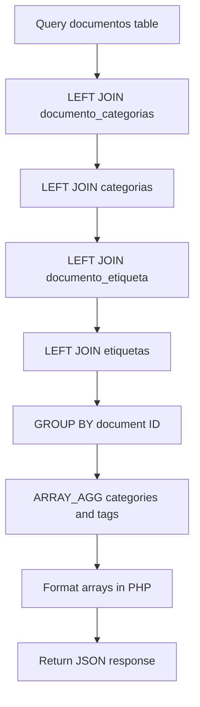
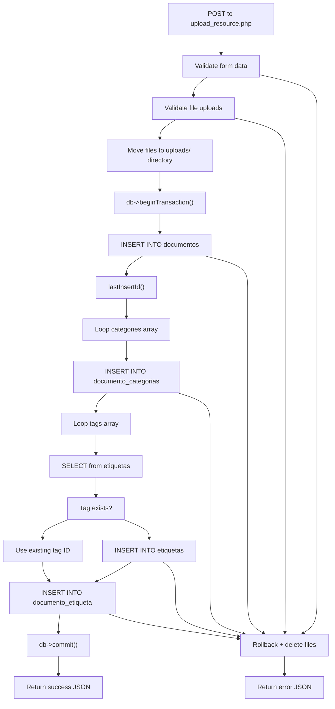

# Resource and Content Tables

> **Relevant source files**
> * [src/backend/gestionRecursos/get_recent_resources.php](https://github.com/axchisan/El-rincon-de-ADSO/blob/3e310227/src/backend/gestionRecursos/get_recent_resources.php)
> * [src/backend/gestionRecursos/get_recently_viewed.php](https://github.com/axchisan/El-rincon-de-ADSO/blob/3e310227/src/backend/gestionRecursos/get_recently_viewed.php)
> * [src/backend/gestionRecursos/get_saved_resources.php](https://github.com/axchisan/El-rincon-de-ADSO/blob/3e310227/src/backend/gestionRecursos/get_saved_resources.php)
> * [src/backend/gestionRecursos/get_user_favorites.php](https://github.com/axchisan/El-rincon-de-ADSO/blob/3e310227/src/backend/gestionRecursos/get_user_favorites.php)
> * [src/backend/gestionRecursos/remove_from_favorites.php](https://github.com/axchisan/El-rincon-de-ADSO/blob/3e310227/src/backend/gestionRecursos/remove_from_favorites.php)
> * [src/backend/gestionRecursos/remove_from_saved.php](https://github.com/axchisan/El-rincon-de-ADSO/blob/3e310227/src/backend/gestionRecursos/remove_from_saved.php)
> * [src/backend/gestionRecursos/upload_resource.php](https://github.com/axchisan/El-rincon-de-ADSO/blob/3e310227/src/backend/gestionRecursos/upload_resource.php)

## Purpose and Scope

This document describes the database tables that store educational resources (documents, videos, and books) and their associated metadata in the El Rincón de ADSO platform. These tables form the core content management system, handling resource storage, categorization, tagging, and user collections.

For information about user authentication tables, see [User and Authentication Tables](/axchisan/El-rincon-de-ADSO/10.1-user-and-authentication-tables). For social and community tables such as comments and friendships, see [Social and Community Tables](/axchisan/El-rincon-de-ADSO/10.3-social-and-community-tables). For API endpoints that interact with these tables, see [Resource Management APIs](/axchisan/El-rincon-de-ADSO/9.1-resource-management-apis).

---

## Overview

The resource and content subsystem consists of three major groups of tables:

1. **Core Resource Tables**: Store the primary resource data, categories, and tags
2. **Junction Tables**: Implement many-to-many relationships between resources and their metadata
3. **User Collection Tables**: Track user interactions such as favorites, saved items, and viewing history

---

## Core Resource Tables

### documentos Table

The `documentos` table is the central table for all educational resources in the platform. It stores three types of resources: videos, books (`libro`), and documents (`documento`).

**Schema Structure:**

| Column | Type | Constraints | Description |
| --- | --- | --- | --- |
| `id` | SERIAL | PRIMARY KEY | Auto-incrementing unique identifier |
| `titulo` | VARCHAR | NOT NULL | Resource title |
| `descripcion` | TEXT | NULL | Detailed description of the resource |
| `autor` | VARCHAR | NOT NULL | Author name |
| `tipo` | VARCHAR | NOT NULL | Resource type: 'video', 'libro', 'documento' |
| `url_archivo` | VARCHAR | NULL | File path or YouTube URL |
| `portada` | VARCHAR | NOT NULL | Cover image path |
| `fecha_publicacion` | DATE | NULL | Publication date |
| `relevancia` | VARCHAR | NOT NULL | Relevance level: 'High', 'Medium', 'Low' |
| `visibilidad` | VARCHAR | NOT NULL | Visibility: 'Public', 'Private', 'Group' |
| `grupo_id` | INTEGER | NULL, FK | Group ID if visibility is 'Group' |
| `idioma` | VARCHAR | NOT NULL | Language code (e.g., 'es', 'en') |
| `licencia` | VARCHAR | NOT NULL | License type (e.g., 'CC BY-SA') |
| `estado` | VARCHAR | NOT NULL | Publication status: 'Draft', 'Pending Review', 'Published' |
| `autor_id` | INTEGER | NOT NULL, FK | References `usuarios.id` |
| `duracion` | INTERVAL | NULL | Video duration (HH:MM:SS format) |

**Special Fields:**

* **tipo**: Determines how the resource is displayed and processed. Videos use embedded YouTube players, while documents and books use file download/viewer interfaces.
* **duracion**: Only populated for video resources. Stored as PostgreSQL INTERVAL type and formatted as HH:MM:SS [src/backend/gestionRecursos/get_recently_viewed.php L58-L74](https://github.com/axchisan/El-rincon-de-ADSO/blob/3e310227/src/backend/gestionRecursos/get_recently_viewed.php#L58-L74)
* **visibilidad**: Controls access control logic throughout the application [src/backend/gestionRecursos/get_recent_resources.php L44-L54](https://github.com/axchisan/El-rincon-de-ADSO/blob/3e310227/src/backend/gestionRecursos/get_recent_resources.php#L44-L54)
* **estado**: Three-stage publication workflow prevents unpublished content from appearing in public listings

Sources: [src/backend/gestionRecursos/upload_resource.php L161-L180](https://github.com/axchisan/El-rincon-de-ADSO/blob/3e310227/src/backend/gestionRecursos/upload_resource.php#L161-L180)

 [src/backend/gestionRecursos/get_recent_resources.php L26-L39](https://github.com/axchisan/El-rincon-de-ADSO/blob/3e310227/src/backend/gestionRecursos/get_recent_resources.php#L26-L39)

---

### categorias Table

The `categorias` table stores predefined categories for classifying educational resources.

**Schema Structure:**

| Column | Type | Constraints | Description |
| --- | --- | --- | --- |
| `id` | SERIAL | PRIMARY KEY | Auto-incrementing unique identifier |
| `nombre` | VARCHAR | UNIQUE, NOT NULL | Category name |

Categories are displayed in the repository browser filters and enable users to browse resources by subject area. The category system uses a many-to-many relationship through the `documento_categorias` junction table.

Sources: [src/backend/gestionRecursos/get_recent_resources.php L34-L35](https://github.com/axchisan/El-rincon-de-ADSO/blob/3e310227/src/backend/gestionRecursos/get_recent_resources.php#L34-L35)

 [src/backend/gestionRecursos/get_user_favorites.php L37-L44](https://github.com/axchisan/El-rincon-de-ADSO/blob/3e310227/src/backend/gestionRecursos/get_user_favorites.php#L37-L44)

---

### etiquetas Table

The `etiquetas` table stores user-defined tags that provide flexible, granular classification of resources.

**Schema Structure:**

| Column | Type | Constraints | Description |
| --- | --- | --- | --- |
| `id` | SERIAL | PRIMARY KEY | Auto-incrementing unique identifier |
| `nombre` | VARCHAR | UNIQUE, NOT NULL | Tag name |

Tags are created dynamically during resource upload. If a tag does not exist, it is automatically created and inserted [src/backend/gestionRecursos/upload_resource.php L190-L208](https://github.com/axchisan/El-rincon-de-ADSO/blob/3e310227/src/backend/gestionRecursos/upload_resource.php#L190-L208)

 This differs from categories, which are predefined by administrators.

Sources: [src/backend/gestionRecursos/upload_resource.php L190-L208](https://github.com/axchisan/El-rincon-de-ADSO/blob/3e310227/src/backend/gestionRecursos/upload_resource.php#L190-L208)

 [src/backend/gestionRecursos/get_saved_resources.php L47-L54](https://github.com/axchisan/El-rincon-de-ADSO/blob/3e310227/src/backend/gestionRecursos/get_saved_resources.php#L47-L54)

---

## Junction Tables

### documento_categorias Table

Implements the many-to-many relationship between resources and categories. A single resource can belong to multiple categories.

**Schema Structure:**

| Column | Type | Constraints | Description |
| --- | --- | --- | --- |
| `documento_id` | INTEGER | NOT NULL, FK | References `documentos.id` |
| `categoria_id` | INTEGER | NOT NULL, FK | References `categorias.id` |

**Composite Primary Key**: (`documento_id`, `categoria_id`)

**Referential Integrity**: Both foreign keys should have ON DELETE CASCADE constraints to automatically remove associations when a resource or category is deleted.

Sources: [src/backend/gestionRecursos/upload_resource.php L184-L188](https://github.com/axchisan/El-rincon-de-ADSO/blob/3e310227/src/backend/gestionRecursos/upload_resource.php#L184-L188)

 [src/backend/gestionRecursos/get_recently_viewed.php L37-L45](https://github.com/axchisan/El-rincon-de-ADSO/blob/3e310227/src/backend/gestionRecursos/get_recently_viewed.php#L37-L45)

---

### documento_etiqueta Table

Implements the many-to-many relationship between resources and tags.

**Schema Structure:**

| Column | Type | Constraints | Description |
| --- | --- | --- | --- |
| `documento_id` | INTEGER | NOT NULL, FK | References `documentos.id` |
| `etiqueta_id` | INTEGER | NOT NULL, FK | References `etiquetas.id` |

**Composite Primary Key**: (`documento_id`, `etiqueta_id`)

Sources: [src/backend/gestionRecursos/upload_resource.php L205-L207](https://github.com/axchisan/El-rincon-de-ADSO/blob/3e310227/src/backend/gestionRecursos/upload_resource.php#L205-L207)

 [src/backend/gestionRecursos/get_recently_viewed.php L47-L55](https://github.com/axchisan/El-rincon-de-ADSO/blob/3e310227/src/backend/gestionRecursos/get_recently_viewed.php#L47-L55)

---

## User Collection Tables

These tables track user interactions with resources, enabling personalized collections and recommendations.

### favoritos Table

Stores resources that users have marked as favorites.

**Schema Structure:**

| Column | Type | Constraints | Description |
| --- | --- | --- | --- |
| `usuario_id` | INTEGER | NOT NULL, FK | References `usuarios.id` |
| `documento_id` | INTEGER | NOT NULL, FK | References `documentos.id` |
| `fecha_agregado` | TIMESTAMP | DEFAULT NOW() | Timestamp when added to favorites |

**Composite Primary Key**: (`usuario_id`, `documento_id`)

**Usage Pattern**: The favorites system allows users to quickly access their most important resources. Favorites are displayed in the user dashboard and can be removed via DELETE operations [src/backend/gestionRecursos/remove_from_favorites.php L18-L20](https://github.com/axchisan/El-rincon-de-ADSO/blob/3e310227/src/backend/gestionRecursos/remove_from_favorites.php#L18-L20)

Sources: [src/backend/gestionRecursos/get_user_favorites.php L17-L26](https://github.com/axchisan/El-rincon-de-ADSO/blob/3e310227/src/backend/gestionRecursos/get_user_favorites.php#L17-L26)

 [src/backend/gestionRecursos/remove_from_favorites.php L18-L20](https://github.com/axchisan/El-rincon-de-ADSO/blob/3e310227/src/backend/gestionRecursos/remove_from_favorites.php#L18-L20)

---

### guardados Table

Stores resources that users have saved for later reading or viewing.

**Schema Structure:**

| Column | Type | Constraints | Description |
| --- | --- | --- | --- |
| `usuario_id` | INTEGER | NOT NULL, FK | References `usuarios.id` |
| `documento_id` | INTEGER | NOT NULL, FK | References `documentos.id` |
| `fecha_guardado` | TIMESTAMP | DEFAULT NOW() | Timestamp when saved |

**Composite Primary Key**: (`usuario_id`, `documento_id`)

**Difference from Favorites**: While favorites represent long-term bookmarks, saved resources typically represent a "read later" queue. Both collections are managed independently in the user interface.

Sources: [src/backend/gestionRecursos/get_saved_resources.php L17-L26](https://github.com/axchisan/El-rincon-de-ADSO/blob/3e310227/src/backend/gestionRecursos/get_saved_resources.php#L17-L26)

 [src/backend/gestionRecursos/remove_from_saved.php L18-L20](https://github.com/axchisan/El-rincon-de-ADSO/blob/3e310227/src/backend/gestionRecursos/remove_from_saved.php#L18-L20)

---

### recientemente_vistos Table

Tracks resources that users have recently viewed, ordered by access time.

**Schema Structure:**

| Column | Type | Constraints | Description |
| --- | --- | --- | --- |
| `usuario_id` | INTEGER | NOT NULL, FK | References `usuarios.id` |
| `documento_id` | INTEGER | NOT NULL, FK | References `documentos.id` |
| `fecha_vista` | TIMESTAMP | DEFAULT NOW() | Last viewed timestamp |

**Composite Primary Key**: (`usuario_id`, `documento_id`)

**Behavior**: The timestamp is updated each time a user views a resource, ensuring the most recently accessed items appear first. The query limits results to 10 items [src/backend/gestionRecursos/get_recently_viewed.php L24](https://github.com/axchisan/El-rincon-de-ADSO/blob/3e310227/src/backend/gestionRecursos/get_recently_viewed.php#L24-L24)

Sources: [src/backend/gestionRecursos/get_recently_viewed.php L17-L27](https://github.com/axchisan/El-rincon-de-ADSO/blob/3e310227/src/backend/gestionRecursos/get_recently_viewed.php#L17-L27)

---

## Entity Relationship Diagram

**Diagram: Resource and Content Table Relationships**

```css
#mermaid-dg8wty250ou{font-family:ui-sans-serif,-apple-system,system-ui,Segoe UI,Helvetica;font-size:16px;fill:#333;}@keyframes edge-animation-frame{from{stroke-dashoffset:0;}}@keyframes dash{to{stroke-dashoffset:0;}}#mermaid-dg8wty250ou .edge-animation-slow{stroke-dasharray:9,5!important;stroke-dashoffset:900;animation:dash 50s linear infinite;stroke-linecap:round;}#mermaid-dg8wty250ou .edge-animation-fast{stroke-dasharray:9,5!important;stroke-dashoffset:900;animation:dash 20s linear infinite;stroke-linecap:round;}#mermaid-dg8wty250ou .error-icon{fill:#dddddd;}#mermaid-dg8wty250ou .error-text{fill:#222222;stroke:#222222;}#mermaid-dg8wty250ou .edge-thickness-normal{stroke-width:1px;}#mermaid-dg8wty250ou .edge-thickness-thick{stroke-width:3.5px;}#mermaid-dg8wty250ou .edge-pattern-solid{stroke-dasharray:0;}#mermaid-dg8wty250ou .edge-thickness-invisible{stroke-width:0;fill:none;}#mermaid-dg8wty250ou .edge-pattern-dashed{stroke-dasharray:3;}#mermaid-dg8wty250ou .edge-pattern-dotted{stroke-dasharray:2;}#mermaid-dg8wty250ou .marker{fill:#999;stroke:#999;}#mermaid-dg8wty250ou .marker.cross{stroke:#999;}#mermaid-dg8wty250ou svg{font-family:ui-sans-serif,-apple-system,system-ui,Segoe UI,Helvetica;font-size:16px;}#mermaid-dg8wty250ou p{margin:0;}#mermaid-dg8wty250ou .entityBox{fill:#ffffff;stroke:#dddddd;}#mermaid-dg8wty250ou .relationshipLabelBox{fill:#dddddd;opacity:0.7;background-color:#dddddd;}#mermaid-dg8wty250ou .relationshipLabelBox rect{opacity:0.5;}#mermaid-dg8wty250ou .labelBkg{background-color:rgba(221, 221, 221, 0.5);}#mermaid-dg8wty250ou .edgeLabel .label{fill:#dddddd;font-size:14px;}#mermaid-dg8wty250ou .label{font-family:ui-sans-serif,-apple-system,system-ui,Segoe UI,Helvetica;color:#333;}#mermaid-dg8wty250ou .edge-pattern-dashed{stroke-dasharray:8,8;}#mermaid-dg8wty250ou .node rect,#mermaid-dg8wty250ou .node circle,#mermaid-dg8wty250ou .node ellipse,#mermaid-dg8wty250ou .node polygon{fill:#ffffff;stroke:#dddddd;stroke-width:1px;}#mermaid-dg8wty250ou .relationshipLine{stroke:#999;stroke-width:1;fill:none;}#mermaid-dg8wty250ou .marker{fill:none!important;stroke:#999!important;stroke-width:1;}#mermaid-dg8wty250ou :root{--mermaid-font-family:"trebuchet ms",verdana,arial,sans-serif;}hascategorizeshastagsfavorited_bysaved_byviewed_byfavoritessavesviewsauthorsrestrictsdocumentosSERIALidPKVARCHARtituloTEXTdescripcionVARCHARautorVARCHARtipoVARCHARurl_archivoVARCHARportadaDATEfecha_publicacionVARCHARrelevanciaVARCHARvisibilidadINTEGERgrupo_idFKVARCHARidiomaVARCHARlicenciaVARCHARestadoINTEGERautor_idFKINTERVALduracioncategoriasSERIALidPKVARCHARnombreetiquetasSERIALidPKVARCHARnombredocumento_categoriasINTEGERdocumento_idFKINTEGERcategoria_idFKdocumento_etiquetaINTEGERdocumento_idFKINTEGERetiqueta_idFKfavoritosINTEGERusuario_idFKINTEGERdocumento_idFKTIMESTAMPfecha_agregadoguardadosINTEGERusuario_idFKINTEGERdocumento_idFKTIMESTAMPfecha_guardadorecientemente_vistosINTEGERusuario_idFKINTEGERdocumento_idFKTIMESTAMPfecha_vistausuariosSERIALidPKVARCHARnombre_usuariogruposSERIALidPKVARCHARnombre
```

Sources: [src/backend/gestionRecursos/upload_resource.php L161-L208](https://github.com/axchisan/El-rincon-de-ADSO/blob/3e310227/src/backend/gestionRecursos/upload_resource.php#L161-L208)

 [src/backend/gestionRecursos/get_recent_resources.php L26-L39](https://github.com/axchisan/El-rincon-de-ADSO/blob/3e310227/src/backend/gestionRecursos/get_recent_resources.php#L26-L39)

---

## Data Access Patterns

### Resource Retrieval with Metadata

All resource retrieval endpoints follow a consistent pattern: fetch the main resource data from `documentos`, then join with junction tables to retrieve associated categories and tags.

**Diagram: Resource Query Pattern**



Sources: [src/backend/gestionRecursos/get_recent_resources.php L26-L105](https://github.com/axchisan/El-rincon-de-ADSO/blob/3e310227/src/backend/gestionRecursos/get_recent_resources.php#L26-L105)

---

### Resource Upload Transaction Flow

Resource upload is implemented as a database transaction to ensure atomicity. If any step fails, all changes are rolled back and uploaded files are deleted.

**Diagram: upload_resource.php Transaction Flow**



Sources: [src/backend/gestionRecursos/upload_resource.php L156-L217](https://github.com/axchisan/El-rincon-de-ADSO/blob/3e310227/src/backend/gestionRecursos/upload_resource.php#L156-L217)

---

### Visibility and Access Control

The `documentos.visibilidad` field implements three-tier access control:

1. **Public**: Visible to all users, including anonymous visitors
2. **Private**: Only visible to the resource author
3. **Group**: Only visible to members of the specified group

**Query Pattern for Visibility**:

```
-- From get_recent_resources.php
WHERE d.estado = 'Published'
AND (
    d.visibilidad = 'Public'
    OR (d.visibilidad = 'Private' AND d.autor_id = :usuario_id)
    OR (d.visibilidad = 'Group' AND d.grupo_id = ANY(:grupos))
)
```

This pattern is applied consistently across all resource retrieval endpoints to enforce access control at the database level.

Sources: [src/backend/gestionRecursos/get_recent_resources.php L44-L54](https://github.com/axchisan/El-rincon-de-ADSO/blob/3e310227/src/backend/gestionRecursos/get_recent_resources.php#L44-L54)

---

## Key Queries

### Fetching User Favorites with Full Metadata

The `get_user_favorites.php` endpoint demonstrates the standard pattern for retrieving resources with complete metadata:

```sql
-- Main query
SELECT d.id, d.titulo, d.descripcion, d.autor, d.tipo, d.url_archivo, d.portada, 
       d.duracion, d.fecha_publicacion, d.relevancia, d.visibilidad, d.idioma, 
       d.licencia, d.estado, f.fecha_agregado
FROM documentos d
JOIN favoritos f ON d.id = f.documento_id
WHERE f.usuario_id = :usuario_id
ORDER BY f.fecha_agregado DESC

-- Categories subquery (executed per resource)
SELECT c.nombre 
FROM documento_categorias dc
JOIN categorias c ON dc.categoria_id = c.id
WHERE dc.documento_id = :documento_id

-- Tags subquery (executed per resource)
SELECT e.nombre 
FROM documento_etiqueta de
JOIN etiquetas e ON de.etiqueta_id = e.id
WHERE de.documento_id = :documento_id
```

Sources: [src/backend/gestionRecursos/get_user_favorites.php L17-L54](https://github.com/axchisan/El-rincon-de-ADSO/blob/3e310227/src/backend/gestionRecursos/get_user_favorites.php#L17-L54)

---

### Repository Search with Filters

The `get_recent_resources.php` endpoint implements comprehensive filtering using PostgreSQL array aggregation:

```sql
SELECT d.id, d.titulo, d.descripcion, d.autor, d.portada, d.tipo, d.url_archivo, d.duracion,
       d.fecha_publicacion, d.relevancia, d.visibilidad, d.grupo_id, d.idioma, d.licencia, d.estado,
       d.autor_id, u.nombre_usuario AS autor_nombre,
       COALESCE(ARRAY_AGG(c.nombre) FILTER (WHERE c.nombre IS NOT NULL), '{}') AS categorias,
       COALESCE(ARRAY_AGG(e.nombre) FILTER (WHERE e.nombre IS NOT NULL), '{}') AS etiquetas
FROM documentos d
JOIN usuarios u ON d.autor_id = u.id
LEFT JOIN documento_categorias dc ON d.id = dc.documento_id
LEFT JOIN categorias c ON dc.categoria_id = c.id
LEFT JOIN documento_etiqueta de ON d.id = de.documento_id
LEFT JOIN etiquetas e ON de.etiqueta_id = e.id
WHERE d.estado = 'Published'
-- ... visibility and filter conditions ...
GROUP BY d.id, u.nombre_usuario 
ORDER BY d.fecha_publicacion DESC 
LIMIT :limit
```

This approach aggregates all categories and tags into PostgreSQL arrays, reducing the number of database round-trips from N+1 to a single query.

Sources: [src/backend/gestionRecursos/get_recent_resources.php L26-L98](https://github.com/axchisan/El-rincon-de-ADSO/blob/3e310227/src/backend/gestionRecursos/get_recent_resources.php#L26-L98)

---

### Tag Creation with Duplicate Prevention

Tags are created dynamically during resource upload. The system checks for existing tags before inserting to prevent duplicates:

```sql
-- Check if tag exists
SELECT id FROM etiquetas WHERE nombre = :nombre

-- If not found, create it
INSERT INTO etiquetas (nombre) VALUES (:nombre)

-- Link to document
INSERT INTO documento_etiqueta (documento_id, etiqueta_id) 
VALUES (:documento_id, :etiqueta_id)
```

This pattern ensures tag uniqueness while allowing flexible, user-generated taxonomy.

Sources: [src/backend/gestionRecursos/upload_resource.php L190-L208](https://github.com/axchisan/El-rincon-de-ADSO/blob/3e310227/src/backend/gestionRecursos/upload_resource.php#L190-L208)

---

## Video Duration Handling

Video resources store duration as a PostgreSQL INTERVAL type. The application converts this to HH:MM:SS format for display:

**Conversion Logic:**

```c
// PostgreSQL returns interval as "HH:MM:SS"
$interval = $resource['duracion']; // Example: "16:12:00"
$time = explode(':', $interval);
$hours = (int)$time[0];
$minutes = (int)$time[1];
$seconds = (int)$time[2];
$totalSeconds = $hours * 3600 + $minutes * 60 + $seconds;

// Format back to HH:MM:SS
$hours = floor($totalSeconds / 3600);
$minutes = floor(($totalSeconds % 3600) / 60);
$seconds = $totalSeconds % 60;
$resource['duracion'] = sprintf("%02d:%02d:%02d", $hours, $minutes, $seconds);
```

This consistent formatting ensures video durations display correctly across all resource viewers and collection pages.

Sources: [src/backend/gestionRecursos/get_recently_viewed.php L58-L74](https://github.com/axchisan/El-rincon-de-ADSO/blob/3e310227/src/backend/gestionRecursos/get_recently_viewed.php#L58-L74)

 [src/backend/gestionRecursos/get_user_favorites.php L57-L73](https://github.com/axchisan/El-rincon-de-ADSO/blob/3e310227/src/backend/gestionRecursos/get_user_favorites.php#L57-L73)

 [src/backend/gestionRecursos/get_saved_resources.php L57-L73](https://github.com/axchisan/El-rincon-de-ADSO/blob/3e310227/src/backend/gestionRecursos/get_saved_resources.php#L57-L73)

---

## File Storage Integration

The `documentos` table stores file paths in two fields:

* **portada**: Cover image path (always required)
* **url_archivo**: Resource file path or YouTube URL

**Storage Pattern:**

Files are stored in `src/uploads/` directory with unique names generated using `uniqid()`:

```
$upload_dir = __DIR__ . '/../../uploads/';
$image_name = uniqid() . '_cover.' . $image_extension;
$image_path = $upload_dir . $image_name;
$image_url = '../../uploads/' . $image_name; // Stored in database
```

**File Type Validation:**

* **Images**: JPEG, PNG, GIF (max 5 MB)
* **Documents**: PDF, DOC, DOCX, PPT, PPTX, JPEG, PNG, GIF (max 10 MB)
* **Videos**: YouTube URLs only (validated with regex pattern)

Sources: [src/backend/gestionRecursos/upload_resource.php L81-L154](https://github.com/axchisan/El-rincon-de-ADSO/blob/3e310227/src/backend/gestionRecursos/upload_resource.php#L81-L154)

---

## Status Workflow

The `documentos.estado` field implements a three-stage publication workflow:

| Status | Description | Query Filter |
| --- | --- | --- |
| Draft | Resource is being created/edited | Not shown in public listings |
| Pending Review | Awaiting moderation | Not shown in public listings |
| Published | Available to users based on visibility | `WHERE d.estado = 'Published'` |

Only resources with status `'Published'` appear in repository searches and public listings. Authors can view their own draft and pending resources in the user dashboard.

Sources: [src/backend/gestionRecursos/upload_resource.php L34-L49](https://github.com/axchisan/El-rincon-de-ADSO/blob/3e310227/src/backend/gestionRecursos/upload_resource.php#L34-L49)

 [src/backend/gestionRecursos/get_recent_resources.php L38](https://github.com/axchisan/El-rincon-de-ADSO/blob/3e310227/src/backend/gestionRecursos/get_recent_resources.php#L38-L38)