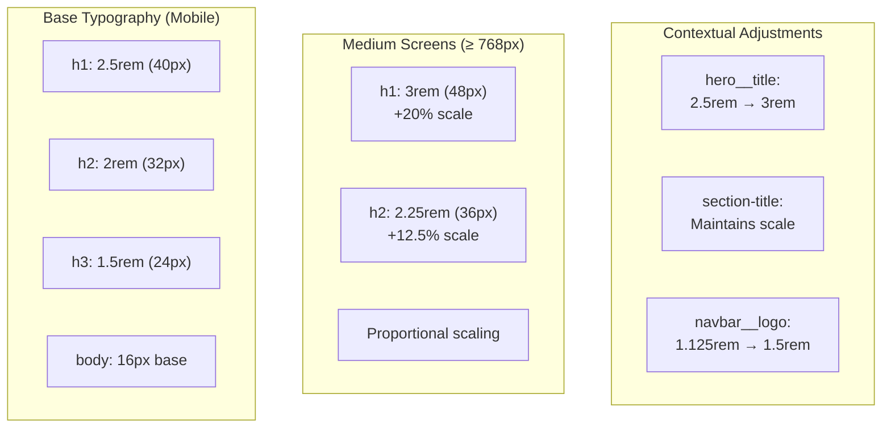

# Responsive Design

> **Relevant source files**
> * [src/backend/perfil/uploads/profile_6814422884f7d-465971915_519394657743559_5751152004256211003_n.jpg](https://github.com/axchisan/El-rincon-de-ADSO/blob/3e310227/src/backend/perfil/uploads/profile_6814422884f7d-465971915_519394657743559_5751152004256211003_n.jpg)
> * [src/frontend/friends/css/style.css](https://github.com/axchisan/El-rincon-de-ADSO/blob/3e310227/src/frontend/friends/css/style.css)
> * [src/frontend/inicio/css/styles.css](https://github.com/axchisan/El-rincon-de-ADSO/blob/3e310227/src/frontend/inicio/css/styles.css)
> * [src/frontend/repositorio/css/repositorio.css](https://github.com/axchisan/El-rincon-de-ADSO/blob/3e310227/src/frontend/repositorio/css/repositorio.css)

## Purpose and Scope

This document describes the responsive design implementation across El Rincón de ADSO's frontend, covering breakpoint strategies, mobile-first principles, and component-level responsive behaviors. The system employs CSS media queries to adapt layouts, navigation, typography, and interactive elements across device sizes from mobile phones to desktop displays.

For overall frontend styling and design system documentation, see [Design System and Styling](/axchisan/El-rincon-de-ADSO/8.1-design-system-and-styling). For specific landing page and navigation component structures, see [Landing Page and Navigation](/axchisan/El-rincon-de-ADSO/8.3-landing-page-and-navigation).

---

## Responsive Design Strategy

El Rincón de ADSO implements a **mobile-first responsive design** approach, where base styles target mobile devices and progressively enhance for larger screens through media queries. This strategy ensures optimal performance on mobile devices and graceful enhancement on desktop displays.

### Breakpoint System

The application uses a consistent set of breakpoints defined across all major CSS files:

| Breakpoint | Screen Width | Target Devices | Primary Layout Changes |
| --- | --- | --- | --- |
| Mobile (default) | < 640px | Smartphones | Single column, stacked elements, hamburger menu |
| Small | ≥ 640px | Large phones, small tablets | 2-column grids, inline search buttons |
| Medium | ≥ 768px | Tablets, small laptops | Horizontal navigation, 3-column grids, sidebar layouts |
| Large | ≥ 1024px | Desktops, large laptops | 4-column grids, expanded spacing, larger typography |

**Sources:**

* [src/frontend/inicio/css/styles.css L197-L205](https://github.com/axchisan/El-rincon-de-ADSO/blob/3e310227/src/frontend/inicio/css/styles.css#L197-L205)
* [src/frontend/inicio/css/styles.css L540-L649](https://github.com/axchisan/El-rincon-de-ADSO/blob/3e310227/src/frontend/inicio/css/styles.css#L540-L649)
* [src/frontend/repositorio/css/repositorio.css L659-L664](https://github.com/axchisan/El-rincon-de-ADSO/blob/3e310227/src/frontend/repositorio/css/repositorio.css#L659-L664)
* [src/frontend/repositorio/css/repositorio.css L760-L778](https://github.com/axchisan/El-rincon-de-ADSO/blob/3e310227/src/frontend/repositorio/css/repositorio.css#L760-L778)

---

## Navigation System Responsive Behavior

The navigation component undergoes significant structural transformations across breakpoints to maintain usability on all device sizes.


**Diagram: Navigation Component Responsive Transformation**

### Mobile Navigation (< 768px)

On mobile devices, the navigation collapses into a hamburger menu pattern:

* **Visible Elements**: Logo, profile image, hamburger toggle button
* **Toggle Mechanism**: `.navbar__toggle` button controls `.navbar__mobile` visibility via `.hidden` class
* **Menu Behavior**: Vertical stacked menu items with left border highlight on hover
* **Profile Badge**: Notification badge scales to 16px × 16px with 9px font size

**Code References:**

* Toggle button: [src/frontend/inicio/css/styles.css L365-L379](https://github.com/axchisan/El-rincon-de-ADSO/blob/3e310227/src/frontend/inicio/css/styles.css#L365-L379)
* Mobile menu container: [src/frontend/inicio/css/styles.css L381-L392](https://github.com/axchisan/El-rincon-de-ADSO/blob/3e310227/src/frontend/inicio/css/styles.css#L381-L392)
* Mobile menu items: [src/frontend/inicio/css/styles.css L394-L419](https://github.com/axchisan/El-rincon-de-ADSO/blob/3e310227/src/frontend/inicio/css/styles.css#L394-L419)
* Mobile breakpoint styles: [src/frontend/inicio/css/styles.css L541-L598](https://github.com/axchisan/El-rincon-de-ADSO/blob/3e310227/src/frontend/inicio/css/styles.css#L541-L598)

### Desktop Navigation (≥ 768px)

On desktop screens, the navigation expands into a horizontal layout:

* **Visible Elements**: Logo, horizontal menu bar with inline items, profile dropdown
* **Hidden Elements**: Toggle button (`display: none`), mobile menu (`display: none !important`)
* **Hover Effects**: Underline animations on active items, transform effects on buttons
* **Profile Badge**: Scales to 18px × 18px with 10px font size

**Code References:**

* Desktop menu display: [src/frontend/inicio/css/styles.css L600-L624](https://github.com/axchisan/El-rincon-de-ADSO/blob/3e310227/src/frontend/inicio/css/styles.css#L600-L624)
* Menu item styles: [src/frontend/inicio/css/styles.css L307-L363](https://github.com/axchisan/El-rincon-de-ADSO/blob/3e310227/src/frontend/inicio/css/styles.css#L307-L363)
* Profile menu positioning: [src/frontend/repositorio/css/repositorio.css L337-L365](https://github.com/axchisan/El-rincon-de-ADSO/blob/3e310227/src/frontend/repositorio/css/repositorio.css#L337-L365)

**Sources:**

* [src/frontend/inicio/css/styles.css L272-L649](https://github.com/axchisan/El-rincon-de-ADSO/blob/3e310227/src/frontend/inicio/css/styles.css#L272-L649)
* [src/frontend/repositorio/css/repositorio.css L96-L415](https://github.com/axchisan/El-rincon-de-ADSO/blob/3e310227/src/frontend/repositorio/css/repositorio.css#L96-L415)
* [src/frontend/friends/css/style.css L96-L251](https://github.com/axchisan/El-rincon-de-ADSO/blob/3e310227/src/frontend/friends/css/style.css#L96-L251)

---

## Grid System and Layout Transformations

The application uses CSS Grid extensively for responsive card layouts, with systematic column adjustments at each breakpoint.


**Diagram: Grid Layout Progression Across Breakpoints**

### Grid Implementation Patterns

#### Resource Card Grids

The `.resources-grid` class implements responsive column counts:

```
Mobile:    grid-template-columns: 1fr;
Small:     grid-template-columns: repeat(2, 1fr);
Large:     grid-template-columns: repeat(3, 1fr);
```

**Code References:**

* Base grid: [src/frontend/repositorio/css/repositorio.css L750-L778](https://github.com/axchisan/El-rincon-de-ADSO/blob/3e310227/src/frontend/repositorio/css/repositorio.css#L750-L778)
* Books grid: [src/frontend/inicio/css/styles.css L1430-L1577](https://github.com/axchisan/El-rincon-de-ADSO/blob/3e310227/src/frontend/inicio/css/styles.css#L1430-L1577)

#### Feature Cards

The `.features__grid` follows a similar pattern:

```
Mobile:    grid-template-columns: 1fr;
Desktop:   grid-template-columns: repeat(3, 1fr);
```

**Code References:**

* [src/frontend/inicio/css/styles.css L1271-L1369](https://github.com/axchisan/El-rincon-de-ADSO/blob/3e310227/src/frontend/inicio/css/styles.css#L1271-L1369)

#### Search Filter Container

The `.filter-container` implements a more complex responsive layout:

```
Mobile:    grid-template-columns: 1fr;
Small:     grid-template-columns: repeat(2, 1fr);
Medium:    grid-template-columns: repeat(3, 1fr) auto;
```

This layout accommodates filter dropdowns and action buttons with appropriate spacing.

**Code References:**

* [src/frontend/repositorio/css/repositorio.css L602-L664](https://github.com/axchisan/El-rincon-de-ADSO/blob/3e310227/src/frontend/repositorio/css/repositorio.css#L602-L664)

**Sources:**

* [src/frontend/repositorio/css/repositorio.css L750-L778](https://github.com/axchisan/El-rincon-de-ADSO/blob/3e310227/src/frontend/repositorio/css/repositorio.css#L750-L778)
* [src/frontend/inicio/css/styles.css L1271-L1577](https://github.com/axchisan/El-rincon-de-ADSO/blob/3e310227/src/frontend/inicio/css/styles.css#L1271-L1577)
* [src/frontend/inicio/css/styles.css L1077-L1105](https://github.com/axchisan/El-rincon-de-ADSO/blob/3e310227/src/frontend/inicio/css/styles.css#L1077-L1105)

---

## Typography Responsive Scaling

Typography scales progressively to maintain readability and visual hierarchy across screen sizes.



**Diagram: Typography Scaling Strategy**

### Heading Scale Adjustments

Base heading sizes (mobile-first):

* `h1`: 2.5rem (40px)
* `h2`: 2rem (32px)
* `h3`: 1.5rem (24px)
* `h4`: 1.25rem (20px)
* `h5`: 1.125rem (18px)
* `h6`: 1rem (16px)

Enhanced sizes at 768px breakpoint:

* `h1`: 3rem (48px) — 20% increase
* `h2`: 2.25rem (36px) — 12.5% increase

**Code References:**

* Base typography: [src/frontend/inicio/css/styles.css L158-L191](https://github.com/axchisan/El-rincon-de-ADSO/blob/3e310227/src/frontend/inicio/css/styles.css#L158-L191)
* Media query adjustments: [src/frontend/inicio/css/styles.css L197-L205](https://github.com/axchisan/El-rincon-de-ADSO/blob/3e310227/src/frontend/inicio/css/styles.css#L197-L205)

### Component-Specific Typography

Certain components implement independent responsive typography:

| Component | Mobile Size | Desktop Size | Selector |
| --- | --- | --- | --- |
| Hero Title | 2.5rem | 3rem | `.hero__title` |
| Navbar Logo | 1.125rem | 1.5rem | `.navbar__logo` |
| Section Title | 2rem | 2rem (stable) | `.section-title` |
| Repo Header | 2.5rem | 3rem | `.repo-header__title` |

**Code References:**

* Hero title: [src/frontend/inicio/css/styles.css L793-L821](https://github.com/axchisan/El-rincon-de-ADSO/blob/3e310227/src/frontend/inicio/css/styles.css#L793-L821)
* Navbar logo: [src/frontend/inicio/css/styles.css L626-L638](https://github.com/axchisan/El-rincon-de-ADSO/blob/3e310227/src/frontend/inicio/css/styles.css#L626-L638)
* Repository header: [src/frontend/repositorio/css/repositorio.css L546-L551](https://github.com/axchisan/El-rincon-de-ADSO/blob/3e310227/src/frontend/repositorio/css/repositorio.css#L546-L551)

**Sources:**

* [src/frontend/inicio/css/styles.css L158-L205](https://github.com/axchisan/El-rincon-de-ADSO/blob/3e310227/src/frontend/inicio/css/styles.css#L158-L205)
* [src/frontend/repositorio/css/repositorio.css L528-L551](https://github.com/axchisan/El-rincon-de-ADSO/blob/3e310227/src/frontend/repositorio/css/repositorio.css#L528-L551)

---

## Component-Level Responsive Patterns

### Hero Section Transformation

The hero section undergoes a complete layout restructuring between mobile and desktop views.


**Diagram: Hero Section Layout Transformation**

**Mobile Layout** (default):

* Vertical stacking with centered alignment
* Full-width content blocks
* Buttons stack vertically for easier touch targets

**Desktop Layout** (≥ 768px):

* Horizontal flexbox layout (`flex-direction: row`)
* Content and image side-by-side with `flex: 1` distribution
* Left-aligned text for better reading flow
* Horizontal button arrangement

**Code References:**

* Base hero styles: [src/frontend/inicio/css/styles.css L668-L821](https://github.com/axchisan/El-rincon-de-ADSO/blob/3e310227/src/frontend/inicio/css/styles.css#L668-L821)
* Mobile-specific adjustments: [src/frontend/repositorio/css/repositorio.css L465-L470](https://github.com/axchisan/El-rincon-de-ADSO/blob/3e310227/src/frontend/repositorio/css/repositorio.css#L465-L470)
* Desktop transformation: [src/frontend/inicio/css/styles.css L793-L821](https://github.com/axchisan/El-rincon-de-ADSO/blob/3e310227/src/frontend/inicio/css/styles.css#L793-L821)

### Search Interface Responsive Behavior

The search section implements sophisticated responsive patterns for filter controls and input grouping.

**Mobile** (< 640px):

* Single column filter layout
* Stacked input and button (`flex-direction: column`)
* Full-width filter dropdowns

**Small Screens** (≥ 640px):

* Inline search input and button (`flex-direction: row`)
* Two-column filter grid
* Advanced link spans both columns

**Medium Screens** (≥ 768px):

* Three-column filter grid with inline advanced link
* Optimized spacing and alignment

**Code References:**

* Search main container: [src/frontend/inicio/css/styles.css L882-L959](https://github.com/axchisan/El-rincon-de-ADSO/blob/3e310227/src/frontend/inicio/css/styles.css#L882-L959)
* Filter grid responsive: [src/frontend/inicio/css/styles.css L1077-L1105](https://github.com/axchisan/El-rincon-de-ADSO/blob/3e310227/src/frontend/inicio/css/styles.css#L1077-L1105)

### Card Component Responsiveness

Resource and friend cards adapt their internal layouts at mobile breakpoints:

**Mobile** (< 640px):

* `.friend-card` and `.request-card` change to `flex-direction: column`
* Full-width action buttons stack vertically
* Avatar remains at consistent size (60px)

**Desktop** (≥ 640px):

* Horizontal card layout preserved
* Inline action buttons
* Hover transforms (translateY) provide interactive feedback

**Code References:**

* Friend card mobile: [src/frontend/friends/css/style.css L518-L536](https://github.com/axchisan/El-rincon-de-ADSO/blob/3e310227/src/frontend/friends/css/style.css#L518-L536)
* Request card mobile: [src/frontend/friends/css/style.css L586-L597](https://github.com/axchisan/El-rincon-de-ADSO/blob/3e310227/src/frontend/friends/css/style.css#L586-L597)
* Resource card actions: [src/frontend/repositorio/css/repositorio.css L1180-L1184](https://github.com/axchisan/El-rincon-de-ADSO/blob/3e310227/src/frontend/repositorio/css/repositorio.css#L1180-L1184)

**Sources:**

* [src/frontend/inicio/css/styles.css L668-L1105](https://github.com/axchisan/El-rincon-de-ADSO/blob/3e310227/src/frontend/inicio/css/styles.css#L668-L1105)
* [src/frontend/repositorio/css/repositorio.css L417-L664](https://github.com/axchisan/El-rincon-de-ADSO/blob/3e310227/src/frontend/repositorio/css/repositorio.css#L417-L664)
* [src/frontend/friends/css/style.css L306-L597](https://github.com/axchisan/El-rincon-de-ADSO/blob/3e310227/src/frontend/friends/css/style.css#L306-L597)

---

## Container and Spacing System

The application uses a consistent container system with responsive padding adjustments.


**Diagram: Container and Spacing Hierarchy**

### Container Class Behavior

The `.container` class provides consistent content width constraints:

* **Max Width**: 1200px (prevents excessive line length on ultra-wide screens)
* **Horizontal Centering**: `margin: 0 auto`
* **Responsive Padding**: 1rem (16px) on all devices

**Code References:**

* [src/frontend/inicio/css/styles.css L105-L110](https://github.com/axchisan/El-rincon-de-ADSO/blob/3e310227/src/frontend/inicio/css/styles.css#L105-L110)
* [src/frontend/repositorio/css/repositorio.css L88-L94](https://github.com/axchisan/El-rincon-de-ADSO/blob/3e310227/src/frontend/repositorio/css/repositorio.css#L88-L94)
* [src/frontend/friends/css/style.css L87-L93](https://github.com/axchisan/El-rincon-de-ADSO/blob/3e310227/src/frontend/friends/css/style.css#L87-L93)

### Navbar Container Adjustments

The `.navbar__container` implements breakpoint-specific padding:

| Breakpoint | Padding Value | Rationale |
| --- | --- | --- |
| < 768px | `0.75rem 0` | Compact mobile layout |
| ≥ 768px | `1rem 0` | Standard tablet spacing |
| ≥ 1024px | `1rem 2rem` | Expanded desktop spacing |

**Code References:**

* Mobile navbar: [src/frontend/inicio/css/styles.css L542-L544](https://github.com/axchisan/El-rincon-de-ADSO/blob/3e310227/src/frontend/inicio/css/styles.css#L542-L544)
* Desktop navbar: [src/frontend/repositorio/css/repositorio.css L397-L399](https://github.com/axchisan/El-rincon-de-ADSO/blob/3e310227/src/frontend/repositorio/css/repositorio.css#L397-L399)

### Section Padding

The `.section` class maintains consistent vertical rhythm:

* Default: `padding: 4rem 0` (64px top/bottom)
* Maintains consistent spacing across breakpoints
* Component-specific sections may override as needed

**Code References:**

* [src/frontend/inicio/css/styles.css L112-L114](https://github.com/axchisan/El-rincon-de-ADSO/blob/3e310227/src/frontend/inicio/css/styles.css#L112-L114)

**Sources:**

* [src/frontend/inicio/css/styles.css L105-L114](https://github.com/axchisan/El-rincon-de-ADSO/blob/3e310227/src/frontend/inicio/css/styles.css#L105-L114)
* [src/frontend/inicio/css/styles.css L542-L649](https://github.com/axchisan/El-rincon-de-ADSO/blob/3e310227/src/frontend/inicio/css/styles.css#L542-L649)
* [src/frontend/repositorio/css/repositorio.css L88-L415](https://github.com/axchisan/El-rincon-de-ADSO/blob/3e310227/src/frontend/repositorio/css/repositorio.css#L88-L415)

---

## Profile and Badge Responsive Sizing

Profile images and notification badges scale proportionally across breakpoints to maintain visual balance.


**Diagram: Profile Component Scaling Progression**

### Profile Image Sizes

| Breakpoint | Size | Selector | Location |
| --- | --- | --- | --- |
| < 768px | 32px | `.navbar__profile-img` | Mobile nav |
| 768px - 1023px | 36px | `.navbar__profile-img` | Tablet nav |
| ≥ 1024px | 40-44px | `.navbar__profile-img` | Desktop nav |

### Notification Badge Sizes

Notification badges scale to maintain visibility and proportionality with profile images:

| Breakpoint | Badge Size | Font Size | Position Offset |
| --- | --- | --- | --- |
| < 768px | 16px × 16px | 9-10px | top: -4px, right: -4px |
| 768px - 1023px | 18px × 18px | 10-11px | top: -5px, right: -5px |
| ≥ 1024px | 20px × 20px | 11-12px | top: -5px, right: -5px |

**Code References:**

* Mobile sizes: [src/frontend/inicio/css/styles.css L579-L585](https://github.com/axchisan/El-rincon-de-ADSO/blob/3e310227/src/frontend/inicio/css/styles.css#L579-L585)
* Tablet sizes: [src/frontend/inicio/css/styles.css L619-L623](https://github.com/axchisan/El-rincon-de-ADSO/blob/3e310227/src/frontend/inicio/css/styles.css#L619-L623)
* Desktop sizes: [src/frontend/inicio/css/styles.css L635-L644](https://github.com/axchisan/El-rincon-de-ADSO/blob/3e310227/src/frontend/inicio/css/styles.css#L635-L644)
* Repository implementation: [src/frontend/repositorio/css/repositorio.css L376-L414](https://github.com/axchisan/El-rincon-de-ADSO/blob/3e310227/src/frontend/repositorio/css/repositorio.css#L376-L414)

**Sources:**

* [src/frontend/inicio/css/styles.css L434-L467](https://github.com/axchisan/El-rincon-de-ADSO/blob/3e310227/src/frontend/inicio/css/styles.css#L434-L467)
* [src/frontend/inicio/css/styles.css L579-L644](https://github.com/axchisan/El-rincon-de-ADSO/blob/3e310227/src/frontend/inicio/css/styles.css#L579-L644)
* [src/frontend/repositorio/css/repositorio.css L259-L414](https://github.com/axchisan/El-rincon-de-ADSO/blob/3e310227/src/frontend/repositorio/css/repositorio.css#L259-L414)

---

## Footer Responsive Layout

The footer implements a sophisticated responsive grid system for organizing content columns.

**Mobile Layout** (< 768px):

* Single column stacking
* Full-width form elements
* Centered social icons
* Vertical copyright and social link layout

**Desktop Layout** (≥ 768px):

* `.footer__grid`: `grid-template-columns: repeat(4, 1fr)` (4-column layout)
* `.footer__bottom`: `flex-direction: row` with `justify-content: space-between`
* Horizontal social link arrangement

**Code References:**

* Footer grid responsive: [src/frontend/repositorio/css/repositorio.css L1499-L1512](https://github.com/axchisan/El-rincon-de-ADSO/blob/3e310227/src/frontend/repositorio/css/repositorio.css#L1499-L1512)
* Base footer styles: [src/frontend/inicio/css/styles.css L1957-L2121](https://github.com/axchisan/El-rincon-de-ADSO/blob/3e310227/src/frontend/inicio/css/styles.css#L1957-L2121)

**Sources:**

* [src/frontend/inicio/css/styles.css L1922-L2121](https://github.com/axchisan/El-rincon-de-ADSO/blob/3e310227/src/frontend/inicio/css/styles.css#L1922-L2121)
* [src/frontend/repositorio/css/repositorio.css L1262-L1512](https://github.com/axchisan/El-rincon-de-ADSO/blob/3e310227/src/frontend/repositorio/css/repositorio.css#L1262-L1512)

---

## Interactive Element Touch Targets

On mobile devices, the system ensures touch-friendly target sizes for interactive elements.

### Minimum Touch Target Sizes

The application adheres to WCAG 2.1 guidelines for touch target sizes (minimum 44px × 44px):

| Element Type | Mobile Size | Desktop Size | Notes |
| --- | --- | --- | --- |
| Buttons | min 44px height | Standard sizing | Full-width on mobile when needed |
| Profile Image | 32-40px diameter | 40-44px diameter | Tappable with surrounding padding |
| Toggle Button | 40px touch area | Hidden on desktop | Includes 0.5rem padding |
| Action Buttons | Full-width on cards | Inline layout | Prevents accidental taps |

### Mobile-Specific Interaction Patterns

**Stacked Action Buttons**: On mobile (< 640px), action button containers convert to vertical stacks:

```
.friend-card__actions,
.request-card__actions {
  flex-direction: column;
  width: 100%;
}
```

This ensures adequate spacing between touch targets and prevents mis-taps.

**Code References:**

* Friend card mobile actions: [src/frontend/friends/css/style.css L518-L536](https://github.com/axchisan/El-rincon-de-ADSO/blob/3e310227/src/frontend/friends/css/style.css#L518-L536)
* Resource card actions: [src/frontend/repositorio/css/repositorio.css L1180-L1184](https://github.com/axchisan/El-rincon-de-ADSO/blob/3e310227/src/frontend/repositorio/css/repositorio.css#L1180-L1184)

**Sources:**

* [src/frontend/friends/css/style.css L472-L536](https://github.com/axchisan/El-rincon-de-ADSO/blob/3e310227/src/frontend/friends/css/style.css#L472-L536)
* [src/frontend/repositorio/css/repositorio.css L917-L1185](https://github.com/axchisan/El-rincon-de-ADSO/blob/3e310227/src/frontend/repositorio/css/repositorio.css#L917-L1185)

---

## CTA Section Responsive Transformation

The Call-to-Action sections implement dramatic layout changes between mobile and desktop views.

**Mobile** (< 768px):

* `flex-direction: column`
* Centered text alignment
* Hidden `.cta-image` (display: none for performance)
* Vertical button stack

**Desktop** (≥ 768px):

* `flex-direction: row` with side-by-side content and image
* Left-aligned text (`text-align: left`)
* Visible `.cta-image` with `flex: 1` sizing
* Horizontal button arrangement
* Increased padding (3rem)

**Code References:**

* Base CTA container: [src/frontend/repositorio/css/repositorio.css L1009-L1019](https://github.com/axchisan/El-rincon-de-ADSO/blob/3e310227/src/frontend/repositorio/css/repositorio.css#L1009-L1019)
* Desktop transformation: [src/frontend/repositorio/css/repositorio.css L1057-L1082](https://github.com/axchisan/El-rincon-de-ADSO/blob/3e310227/src/frontend/repositorio/css/repositorio.css#L1057-L1082)

**Sources:**

* [src/frontend/repositorio/css/repositorio.css L992-L1082](https://github.com/axchisan/El-rincon-de-ADSO/blob/3e310227/src/frontend/repositorio/css/repositorio.css#L992-L1082)
* [src/frontend/inicio/css/styles.css L1749-L1920](https://github.com/axchisan/El-rincon-de-ADSO/blob/3e310227/src/frontend/inicio/css/styles.css#L1749-L1920)

---

## Responsive Design Testing Checklist

When implementing or modifying responsive components, verify the following behaviors:

### Navigation

* Mobile menu toggles correctly with hamburger button
* Desktop menu displays horizontally at 768px breakpoint
* Profile dropdown positions correctly at all breakpoints
* Notification badge scales appropriately

### Layout

* Container maintains 1200px max-width
* Grid layouts transition smoothly (1 → 2 → 3 → 4 columns)
* Hero section switches from column to row layout at 768px
* No horizontal scrolling on mobile devices

### Typography

* Headings scale at 768px breakpoint
* Body text remains readable at all sizes
* Line lengths don't exceed 70-80 characters on large screens

### Interactive Elements

* Touch targets meet minimum 44px × 44px on mobile
* Buttons provide adequate spacing in mobile stacks
* Hover effects disabled on touch devices (where applicable)
* Forms and inputs usable on all screen sizes

### Performance

* Images use `max-width: 100%` and `height: auto`
* Decorative images hidden on mobile when appropriate
* No unnecessary DOM elements rendered for hidden breakpoint states

**Sources:**

* [src/frontend/inicio/css/styles.css L1-L2621](https://github.com/axchisan/El-rincon-de-ADSO/blob/3e310227/src/frontend/inicio/css/styles.css#L1-L2621)
* [src/frontend/repositorio/css/repositorio.css L1-L1512](https://github.com/axchisan/El-rincon-de-ADSO/blob/3e310227/src/frontend/repositorio/css/repositorio.css#L1-L1512)
* [src/frontend/friends/css/style.css L1-L619](https://github.com/axchisan/El-rincon-de-ADSO/blob/3e310227/src/frontend/friends/css/style.css#L1-L619)