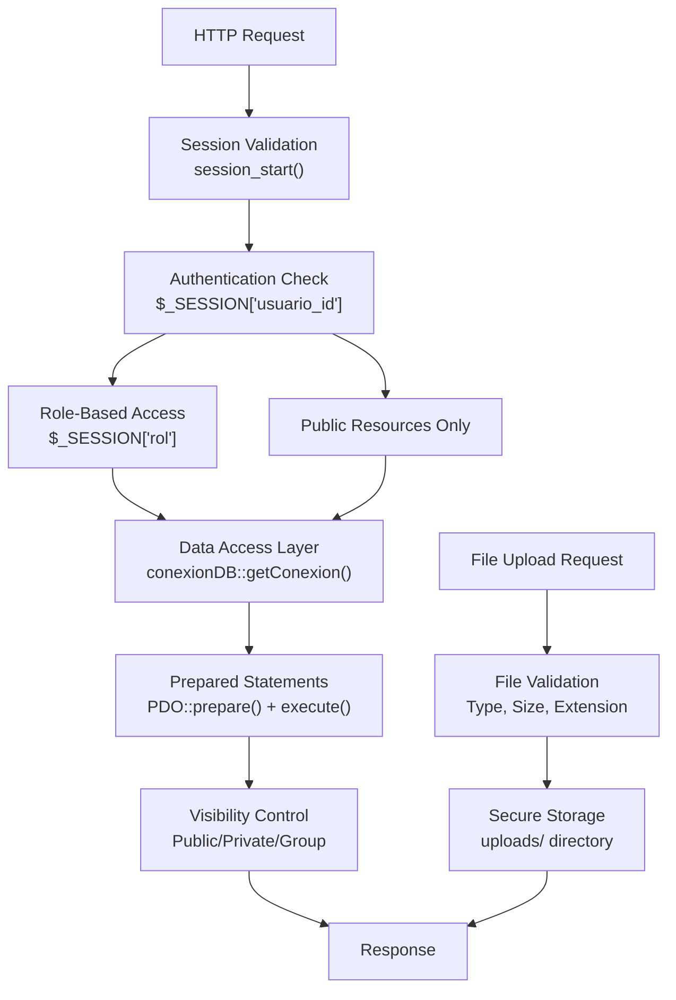
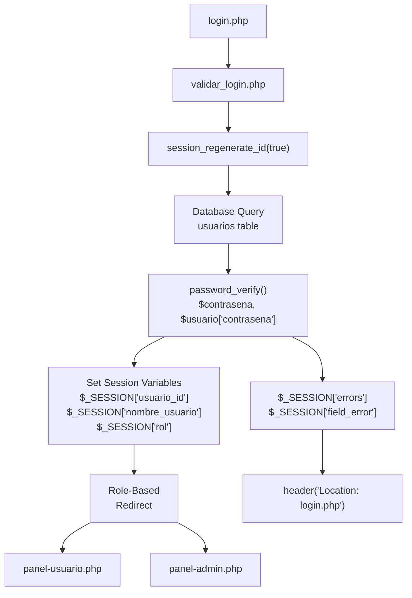
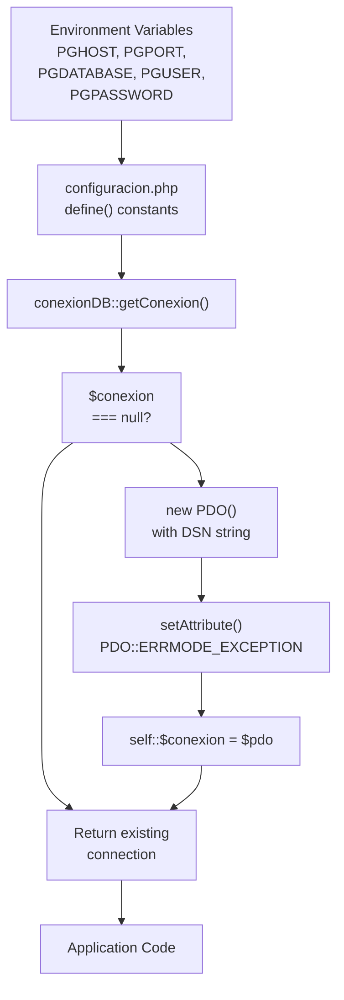
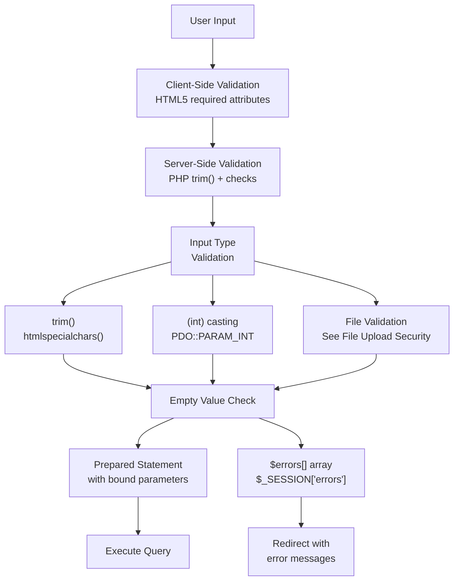
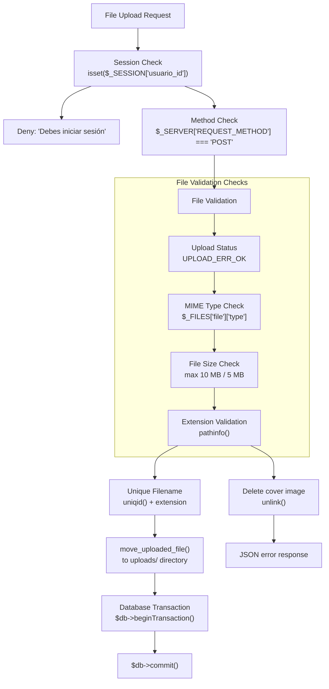
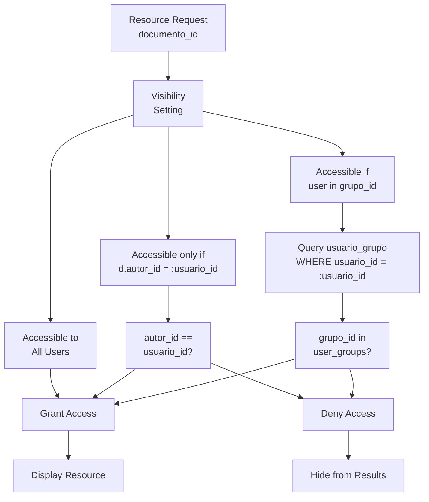

# Security and Best Practices

> **Relevant source files**
> * [src/backend/gestionRecursos/get_recent_resources.php](https://github.com/axchisan/El-rincon-de-ADSO/blob/3e310227/src/backend/gestionRecursos/get_recent_resources.php)
> * [src/backend/gestionRecursos/upload_resource.php](https://github.com/axchisan/El-rincon-de-ADSO/blob/3e310227/src/backend/gestionRecursos/upload_resource.php)
> * [src/backend/loginValidation/validar_login.php](https://github.com/axchisan/El-rincon-de-ADSO/blob/3e310227/src/backend/loginValidation/validar_login.php)
> * [src/backend/perfil/uploads/681153ef10a8b-468520576_1147758583450948_1007574650848877107_n.jpg](https://github.com/axchisan/El-rincon-de-ADSO/blob/3e310227/src/backend/perfil/uploads/681153ef10a8b-468520576_1147758583450948_1007574650848877107_n.jpg)
> * [src/database/conexionDB.php](https://github.com/axchisan/El-rincon-de-ADSO/blob/3e310227/src/database/conexionDB.php)
> * [src/database/configuracion.php](https://github.com/axchisan/El-rincon-de-ADSO/blob/3e310227/src/database/configuracion.php)
> * [src/frontend/login/css/login.css](https://github.com/axchisan/El-rincon-de-ADSO/blob/3e310227/src/frontend/login/css/login.css)
> * [src/frontend/login/login.php](https://github.com/axchisan/El-rincon-de-ADSO/blob/3e310227/src/frontend/login/login.php)

This document provides a comprehensive overview of security measures, access control mechanisms, and best practices implemented throughout El Rincón de ADSO. The system employs multiple layers of security including session-based authentication, prepared statements for SQL injection prevention, file upload validation, and role-based access control.

**Related Pages**: For detailed authentication workflows, see [Authentication and Authorization](/axchisan/El-rincon-de-ADSO/11.1-authentication-and-authorization). For SQL security implementation details, see [Data Validation and SQL Security](/axchisan/El-rincon-de-ADSO/11.2-data-validation-and-sql-security). For file handling specifics, see [File Upload Security](/axchisan/El-rincon-de-ADSO/11.3-file-upload-security).

## Security Architecture Overview

The application implements a multi-layered security model spanning authentication, data access, file handling, and session management. All security measures are enforced at multiple points in the request lifecycle.



**Diagram: Request Security Pipeline**

Sources: [src/frontend/login/login.php L1-L2](https://github.com/axchisan/El-rincon-de-ADSO/blob/3e310227/src/frontend/login/login.php#L1-L2)

 [src/backend/loginValidation/validar_login.php L2-L5](https://github.com/axchisan/El-rincon-de-ADSO/blob/3e310227/src/backend/loginValidation/validar_login.php#L2-L5)

 [src/database/conexionDB.php L4-L27](https://github.com/axchisan/El-rincon-de-ADSO/blob/3e310227/src/database/conexionDB.php#L4-L27)

 [src/backend/gestionRecursos/upload_resource.php L2-L10](https://github.com/axchisan/El-rincon-de-ADSO/blob/3e310227/src/backend/gestionRecursos/upload_resource.php#L2-L10)

## Authentication Framework

### Session Management Implementation

The system uses PHP sessions for state management with security-enhancing measures. Session regeneration prevents fixation attacks, and all authenticated pages verify session state.



**Diagram: Authentication Flow with Security Controls**

| Security Measure | Implementation | Location |
| --- | --- | --- |
| Session Regeneration | `session_regenerate_id(true)` | [validar_login.php L5](https://github.com/axchisan/El-rincon-de-ADSO/blob/3e310227/validar_login.php#L5-L5) |
| Password Hashing | `password_verify()` | [validar_login.php L33](https://github.com/axchisan/El-rincon-de-ADSO/blob/3e310227/validar_login.php#L33-L33) |
| SQL Injection Prevention | PDO prepared statements | [validar_login.php L26-L28](https://github.com/axchisan/El-rincon-de-ADSO/blob/3e310227/validar_login.php#L26-L28) |
| Error Handling | Session-based error messages | [validar_login.php L62](https://github.com/axchisan/El-rincon-de-ADSO/blob/3e310227/validar_login.php#L62-L62) |
| Role-Based Access | `$_SESSION['rol']` validation | [validar_login.php L36](https://github.com/axchisan/El-rincon-de-ADSO/blob/3e310227/validar_login.php#L36-L36) |

Sources: [src/frontend/login/login.php L2](https://github.com/axchisan/El-rincon-de-ADSO/blob/3e310227/src/frontend/login/login.php#L2-L2)

 [src/backend/loginValidation/validar_login.php L2-L64](https://github.com/axchisan/El-rincon-de-ADSO/blob/3e310227/src/backend/loginValidation/validar_login.php#L2-L64)

### Password Security

Passwords are never stored in plain text. The system uses PHP's `password_hash()` and `password_verify()` functions with bcrypt algorithm.

**Authentication Query Pattern:**

```sql
SELECT id, nombre_usuario, correo, contrasena, rol 
FROM usuarios 
WHERE nombre_usuario = :input OR correo = :input
```

The query at [validar_login.php L26-L28](https://github.com/axchisan/El-rincon-de-ADSO/blob/3e310227/validar_login.php#L26-L28)

 uses parameter binding (`:input`) to prevent SQL injection while checking credentials. After retrieval, the password is verified using `password_verify($contrasena, $usuario['contrasena'])` at line 33.

Sources: [src/backend/loginValidation/validar_login.php L26-L56](https://github.com/axchisan/El-rincon-de-ADSO/blob/3e310227/src/backend/loginValidation/validar_login.php#L26-L56)

## Database Security Architecture

### Connection Management

The `conexionDB` class implements a singleton pattern ensuring a single, secure database connection across the application.



**Diagram: Secure Database Connection Lifecycle**

Sources: [src/database/configuracion.php L1-L9](https://github.com/axchisan/El-rincon-de-ADSO/blob/3e310227/src/database/configuracion.php#L1-L9)

 [src/database/conexionDB.php L4-L27](https://github.com/axchisan/El-rincon-de-ADSO/blob/3e310227/src/database/conexionDB.php#L4-L27)

### Environment-Based Configuration

Sensitive credentials are never hardcoded. The `configuracion.php` file reads from environment variables:

| Constant | Environment Variable | Purpose |
| --- | --- | --- |
| `DB_HOST` | `PGHOST` | PostgreSQL server host |
| `DB_PORT` | `PGPORT` | Database port |
| `DB_NAME` | `PGDATABASE` | Database name |
| `DB_USER` | `PGUSER` | Database username |
| `DB_PASSWORD` | `PGPASSWORD` | Database password |
| `DB_SSLMODE` | Static: "disable" | SSL mode for Railway |

The connection string is constructed at [conexionDB.php L10-L17](https://github.com/axchisan/El-rincon-de-ADSO/blob/3e310227/conexionDB.php#L10-L17)

 using these constants, with conditional SSL mode handling.

Sources: [src/database/configuracion.php L2-L8](https://github.com/axchisan/El-rincon-de-ADSO/blob/3e310227/src/database/configuracion.php#L2-L8)

### Prepared Statement Pattern

All database queries use PDO prepared statements to prevent SQL injection. The pattern is consistent across the codebase:

**Pattern Implementation:**

1. **Prepare**: `$stmt = $db->prepare($query)`
2. **Bind Parameters**: `:placeholder` syntax in query
3. **Execute**: `$stmt->execute([':param' => $value])`
4. **Fetch**: `$stmt->fetch(PDO::FETCH_ASSOC)`

**Example from Resource Management:**

```sql
SELECT d.id, d.titulo, d.descripcion, ...
FROM documentos d
WHERE d.estado = 'Published'
  AND (d.titulo ILIKE :search 
       OR d.descripcion ILIKE :search 
       OR d.autor ILIKE :search)
```

The query at [get_recent_resources.php L26-L82](https://github.com/axchisan/El-rincon-de-ADSO/blob/3e310227/get_recent_resources.php#L26-L82)

 demonstrates proper parameter binding for search, category, type, relevance, and language filters.

Sources: [src/backend/gestionRecursos/get_recent_resources.php L8-L122](https://github.com/axchisan/El-rincon-de-ADSO/blob/3e310227/src/backend/gestionRecursos/get_recent_resources.php#L8-L122)

 [src/backend/loginValidation/validar_login.php L26-L29](https://github.com/axchisan/El-rincon-de-ADSO/blob/3e310227/src/backend/loginValidation/validar_login.php#L26-L29)

## Input Validation and Sanitization

### User Input Handling

All user inputs undergo validation before processing. The system employs multiple validation layers:



**Diagram: Input Validation Pipeline**

**Validation Example from Login:**

```
$input_usuario = trim($_POST['usuario'] ?? '');
$contrasena = trim($_POST['clave'] ?? '');

if (empty($input_usuario)) {
    $errors[] = "El campo usuario o correo es obligatorio.";
    $_SESSION['field_error'] = 'usuario';
}
if (empty($contrasena)) {
    $errors[] = "El campo contraseña es obligatorio.";
    $_SESSION['field_error'] = 'clave';
}
```

This pattern at [validar_login.php L8-L20](https://github.com/axchisan/El-rincon-de-ADSO/blob/3e310227/validar_login.php#L8-L20)

 ensures no empty inputs reach the database layer.

Sources: [src/backend/loginValidation/validar_login.php L8-L20](https://github.com/axchisan/El-rincon-de-ADSO/blob/3e310227/src/backend/loginValidation/validar_login.php#L8-L20)

 [src/backend/gestionRecursos/upload_resource.php L17-L54](https://github.com/axchisan/El-rincon-de-ADSO/blob/3e310227/src/backend/gestionRecursos/upload_resource.php#L17-L54)

### Output Sanitization

When displaying user-generated content or error messages, the system uses `htmlspecialchars()` to prevent XSS attacks:

```php
echo '<li>' . htmlspecialchars($error) . '</li>';
```

This appears at [login.php L41](https://github.com/axchisan/El-rincon-de-ADSO/blob/3e310227/login.php#L41-L41)

 and ensures HTML entities are escaped in error messages.

Sources: [src/frontend/login/login.php L38-L44](https://github.com/axchisan/El-rincon-de-ADSO/blob/3e310227/src/frontend/login/login.php#L38-L44)

## File Upload Security

### Upload Validation Pipeline

File uploads undergo rigorous validation to prevent malicious file uploads and ensure system integrity.



**Diagram: File Upload Security Controls**

Sources: [src/backend/gestionRecursos/upload_resource.php L1-L217](https://github.com/axchisan/El-rincon-de-ADSO/blob/3e310227/src/backend/gestionRecursos/upload_resource.php#L1-L217)

### File Type and Size Restrictions

The system enforces strict allowlists for file types and maximum file sizes:

| File Category | Allowed MIME Types | Maximum Size | Validation Location |
| --- | --- | --- | --- |
| **Cover Images** | `image/jpeg`, `image/png`, `image/gif` | 5 MB | [upload_resource.php L67-L78](https://github.com/axchisan/El-rincon-de-ADSO/blob/3e310227/upload_resource.php#L67-L78) |
| **Documents** | `application/pdf`, `application/msword`, `application/vnd.openxmlformats-officedocument.wordprocessingml.document` | 10 MB | [upload_resource.php L118-L141](https://github.com/axchisan/El-rincon-de-ADSO/blob/3e310227/upload_resource.php#L118-L141) |
| **Presentations** | `application/vnd.ms-powerpoint`, `application/vnd.openxmlformats-officedocument.presentationml.presentation` | 10 MB | [upload_resource.php L122-L124](https://github.com/axchisan/El-rincon-de-ADSO/blob/3e310227/upload_resource.php#L122-L124) |
| **Additional Images** | `image/jpeg`, `image/png`, `image/gif` | 10 MB | [upload_resource.php L124-L126](https://github.com/axchisan/El-rincon-de-ADSO/blob/3e310227/upload_resource.php#L124-L126) |

**Cover Image Validation Pattern:**

```javascript
$allowed_image_types = ['image/jpeg', 'image/png', 'image/gif'];
$max_image_size = 5 * 1024 * 1024; // 5 MB

if (!in_array($image['type'], $allowed_image_types)) {
    echo json_encode(['success' => false, 'message' => 'Tipo de imagen no permitido...']);
    exit;
}

if ($image['size'] > $max_image_size) {
    echo json_encode(['success' => false, 'message' => 'La imagen es demasiado grande...']);
    exit;
}
```

Sources: [src/backend/gestionRecursos/upload_resource.php L62-L93](https://github.com/axchisan/El-rincon-de-ADSO/blob/3e310227/src/backend/gestionRecursos/upload_resource.php#L62-L93)

### Secure File Storage

Files are stored with randomized names to prevent directory traversal and filename collision attacks:

```
$image_extension = pathinfo($image['name'], PATHINFO_EXTENSION);
$image_name = uniqid() . '_cover.' . $image_extension;
$image_path = $upload_dir . $image_name;
```

This pattern at [upload_resource.php L86-L88](https://github.com/axchisan/El-rincon-de-ADSO/blob/3e310227/upload_resource.php#L86-L88)

 ensures unique filenames using `uniqid()` combined with the original extension, preventing overwrites and guessable URLs.

Sources: [src/backend/gestionRecursos/upload_resource.php L81-L95](https://github.com/axchisan/El-rincon-de-ADSO/blob/3e310227/src/backend/gestionRecursos/upload_resource.php#L81-L95)

### Video URL Validation

For video resources, YouTube URLs are validated using regex patterns:

```javascript
$youtube_regex = '/^(https?:\/\/)?(www\.)?(youtube\.com|youtu\.be)\/(watch\?v=)?([a-zA-Z0-9_-]{11})/';
if (!preg_match($youtube_regex, $video_url)) {
    unlink($image_path);
    echo json_encode(['success' => false, 'message' => 'La URL del video no es válida...']);
    exit;
}
```

This validation at [upload_resource.php L104-L109](https://github.com/axchisan/El-rincon-de-ADSO/blob/3e310227/upload_resource.php#L104-L109)

 ensures only valid YouTube URLs are accepted, and any previously uploaded cover image is cleaned up if validation fails.

Sources: [src/backend/gestionRecursos/upload_resource.php L98-L110](https://github.com/axchisan/El-rincon-de-ADSO/blob/3e310227/src/backend/gestionRecursos/upload_resource.php#L98-L110)

## Access Control and Visibility Management

### Resource Visibility Model

The application implements a three-tier visibility model for resources:



**Diagram: Resource Access Control Logic**

Sources: [src/backend/gestionRecursos/get_recent_resources.php L11-L54](https://github.com/axchisan/El-rincon-de-ADSO/blob/3e310227/src/backend/gestionRecursos/get_recent_resources.php#L11-L54)

### Visibility Query Implementation

The visibility check is implemented in SQL at query time:

```
WHERE d.estado = 'Published'
  AND (
    d.visibilidad = 'Public'
    OR (d.visibilidad = 'Private' AND d.autor_id = :usuario_id)
    OR (d.visibilidad = 'Group' AND d.grupo_id = ANY(:grupos))
  )
```

This pattern at [get_recent_resources.php L44-L49](https://github.com/axchisan/El-rincon-de-ADSO/blob/3e310227/get_recent_resources.php#L44-L49)

 ensures only authorized resources are returned in query results. The `:grupos` parameter is an array of group IDs the user belongs to, retrieved at [get_recent_resources.php L12-L17](https://github.com/axchisan/El-rincon-de-ADSO/blob/3e310227/get_recent_resources.php#L12-L17)

**Anonymous User Restriction:**

```
WHERE d.estado = 'Published'
  AND d.visibilidad = 'Public'
```

For unauthenticated users, the query at [get_recent_resources.php L53](https://github.com/axchisan/El-rincon-de-ADSO/blob/3e310227/get_recent_resources.php#L53-L53)

 restricts visibility to public resources only.

Sources: [src/backend/gestionRecursos/get_recent_resources.php L38-L54](https://github.com/axchisan/El-rincon-de-ADSO/blob/3e310227/src/backend/gestionRecursos/get_recent_resources.php#L38-L54)

## Transaction Management and Data Integrity

### Database Transaction Usage

File uploads and multi-table operations use transactions to maintain data integrity:

```sql
$db->beginTransaction();

// Insert into documentos table
$query = "INSERT INTO documentos (...) VALUES (...)";
$stmt = $db->prepare($query);
$stmt->execute([...]);
$documento_id = $db->lastInsertId();

// Insert into documento_categorias
foreach ($categories as $categoria_id) {
    $query = "INSERT INTO documento_categorias ...";
    $stmt = $db->prepare($query);
    $stmt->execute([...]);
}

// Insert into documento_etiqueta
foreach ($tags as $tag_name) {
    // Tag insertion logic
}

$db->commit();
```

This pattern at [upload_resource.php L158-L210](https://github.com/axchisan/El-rincon-de-ADSO/blob/3e310227/upload_resource.php#L158-L210)

 ensures atomicity. If any operation fails, `$db->rollBack()` at line 213 reverts all changes, and uploaded files are cleaned up.

**Rollback with Cleanup:**

```javascript
catch (PDOException $e) {
    $db->rollBack();
    if (file_exists($image_path)) unlink($image_path);
    if (isset($file_path) && file_exists($file_path)) unlink($file_path);
    echo json_encode(['success' => false, 'message' => '...']);
}
```

Sources: [src/backend/gestionRecursos/upload_resource.php L156-L217](https://github.com/axchisan/El-rincon-de-ADSO/blob/3e310227/src/backend/gestionRecursos/upload_resource.php#L156-L217)

## Error Handling and Security Logging

### Error Message Strategy

The system differentiates between user-facing and system-level errors:

**User-Facing Errors:**

* Stored in `$_SESSION['errors']` array
* Displayed via `htmlspecialchars()` at [login.php L38-L44](https://github.com/axchisan/El-rincon-de-ADSO/blob/3e310227/login.php#L38-L44)
* Specific field errors tracked in `$_SESSION['field_error']`

**System-Level Errors:**

* Caught in try-catch blocks
* PDO exceptions at [conexionDB.php L21-L22](https://github.com/axchisan/El-rincon-de-ADSO/blob/3e310227/conexionDB.php#L21-L22)
* Generic messages to users: "Error al iniciar sesión" at [validar_login.php L58](https://github.com/axchisan/El-rincon-de-ADSO/blob/3e310227/validar_login.php#L58-L58)
* Actual exception messages included for debugging

Sources: [src/frontend/login/login.php L37-L45](https://github.com/axchisan/El-rincon-de-ADSO/blob/3e310227/src/frontend/login/login.php#L37-L45)

 [src/backend/loginValidation/validar_login.php L57-L59](https://github.com/axchisan/El-rincon-de-ADSO/blob/3e310227/src/backend/loginValidation/validar_login.php#L57-L59)

 [src/database/conexionDB.php L21-L22](https://github.com/axchisan/El-rincon-de-ADSO/blob/3e310227/src/database/conexionDB.php#L21-L22)

## Security Best Practices Checklist

### Implementation Status

| Security Control | Status | Implementation | Reference |
| --- | --- | --- | --- |
| **Session Regeneration** | ✓ Implemented | `session_regenerate_id(true)` on login | [validar_login.php L5](https://github.com/axchisan/El-rincon-de-ADSO/blob/3e310227/validar_login.php#L5-L5) |
| **Password Hashing** | ✓ Implemented | `password_verify()` / `password_hash()` | [validar_login.php L33](https://github.com/axchisan/El-rincon-de-ADSO/blob/3e310227/validar_login.php#L33-L33) |
| **Prepared Statements** | ✓ Implemented | All queries use PDO with bound parameters | [conexionDB.php L19](https://github.com/axchisan/El-rincon-de-ADSO/blob/3e310227/conexionDB.php#L19-L19) |
| **File Type Validation** | ✓ Implemented | MIME type allowlists | [upload_resource.php L67-L78](https://github.com/axchisan/El-rincon-de-ADSO/blob/3e310227/upload_resource.php#L67-L78) |
| **File Size Limits** | ✓ Implemented | 5 MB images, 10 MB documents | [upload_resource.php L68-L76](https://github.com/axchisan/El-rincon-de-ADSO/blob/3e310227/upload_resource.php#L68-L76) |
| **Unique Filenames** | ✓ Implemented | `uniqid()` prefix | [upload_resource.php L87](https://github.com/axchisan/El-rincon-de-ADSO/blob/3e310227/upload_resource.php#L87-L87) |
| **Output Sanitization** | ✓ Implemented | `htmlspecialchars()` on user content | [login.php L41](https://github.com/axchisan/El-rincon-de-ADSO/blob/3e310227/login.php#L41-L41) |
| **Environment Variables** | ✓ Implemented | `getenv()` for credentials | [configuracion.php L2-L6](https://github.com/axchisan/El-rincon-de-ADSO/blob/3e310227/configuracion.php#L2-L6) |
| **Transaction Rollback** | ✓ Implemented | `beginTransaction()` / `rollBack()` | [upload_resource.php L158-L213](https://github.com/axchisan/El-rincon-de-ADSO/blob/3e310227/upload_resource.php#L158-L213) |
| **Role-Based Access** | ✓ Implemented | `$_SESSION['rol']` routing | [validar_login.php L43-L47](https://github.com/axchisan/El-rincon-de-ADSO/blob/3e310227/validar_login.php#L43-L47) |
| **Visibility Control** | ✓ Implemented | Public/Private/Group model | [get_recent_resources.php L44-L54](https://github.com/axchisan/El-rincon-de-ADSO/blob/3e310227/get_recent_resources.php#L44-L54) |
| **HTTPS Enforcement** | ⚠ Deployment-dependent | Should be configured at Railway level | - |
| **CSRF Protection** | ⚠ Not Implemented | Should add token validation | - |
| **Rate Limiting** | ⚠ Not Implemented | Should add login attempt throttling | - |

### Recommendations for Enhancement

**High Priority:**

1. Implement CSRF token validation for all POST requests
2. Add rate limiting to login endpoint to prevent brute force attacks
3. Implement security headers (X-Frame-Options, Content-Security-Policy)

**Medium Priority:**
4. Add input length validation to prevent buffer overflow attacks
5. Implement file content scanning for uploaded files
6. Add logging for security events (failed logins, permission denials)

**Low Priority:**
7. Consider implementing two-factor authentication for admin accounts
8. Add IP-based access restrictions for admin panel
9. Implement automatic session timeout after inactivity

Sources: All security-related files analyzed in this document