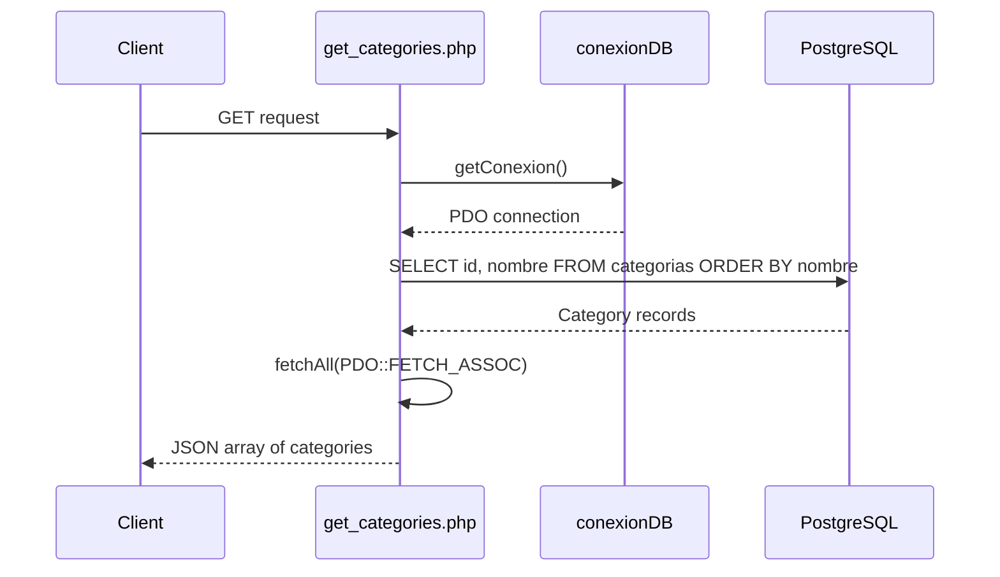
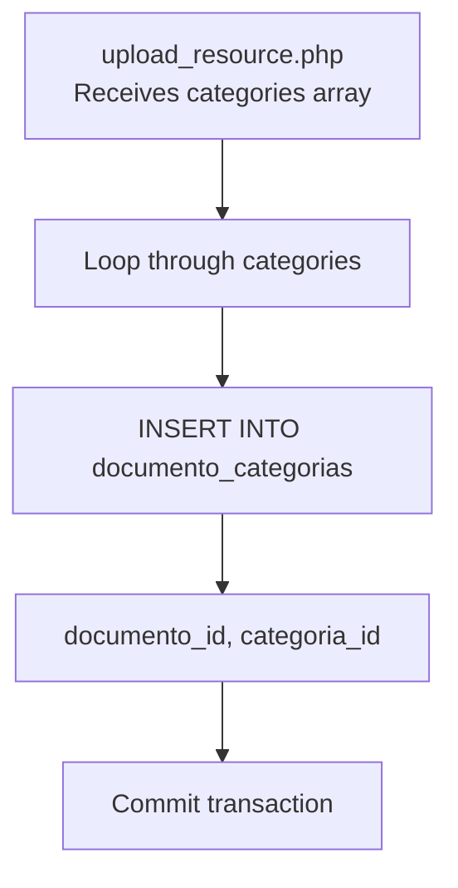
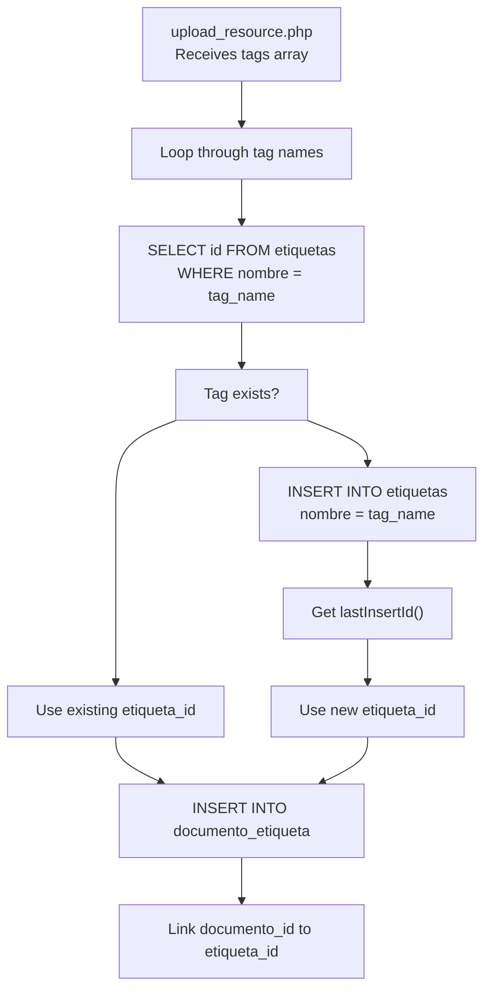
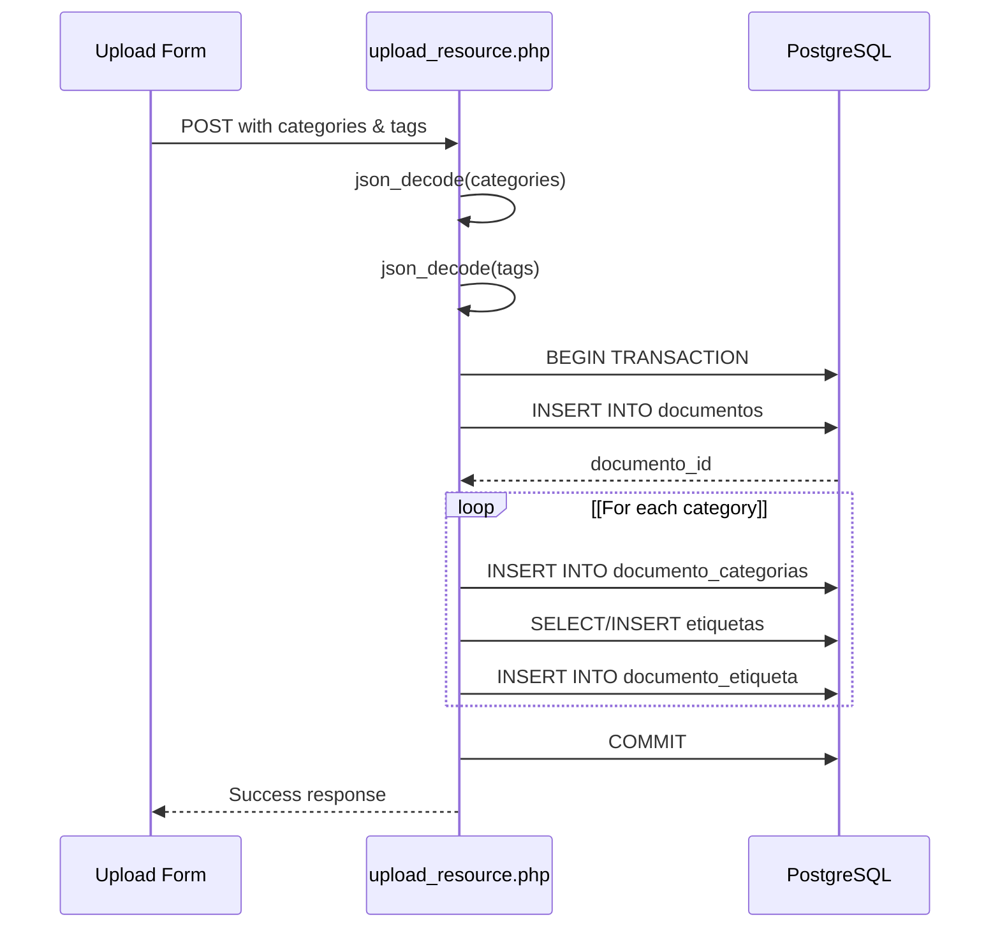
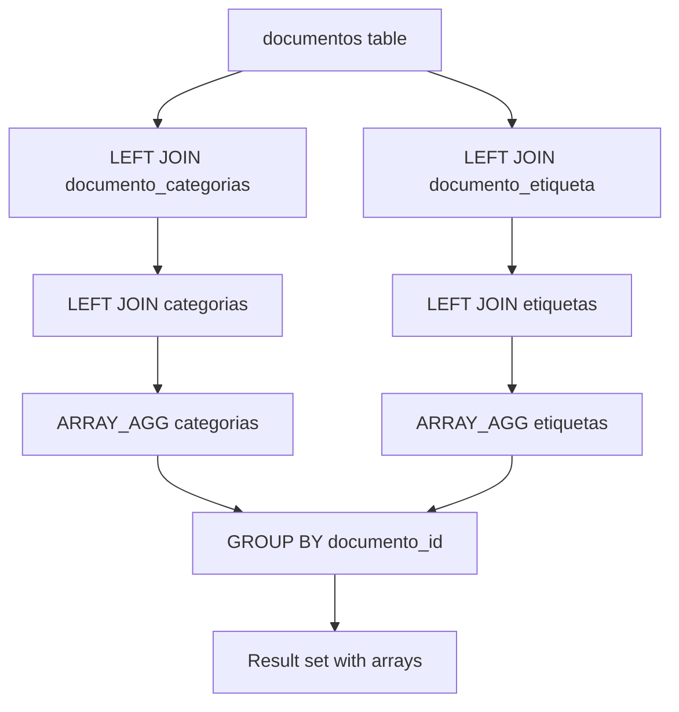
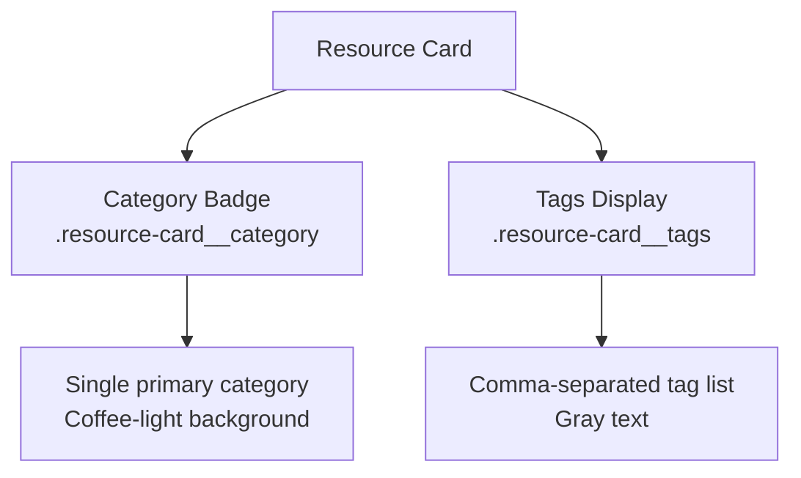
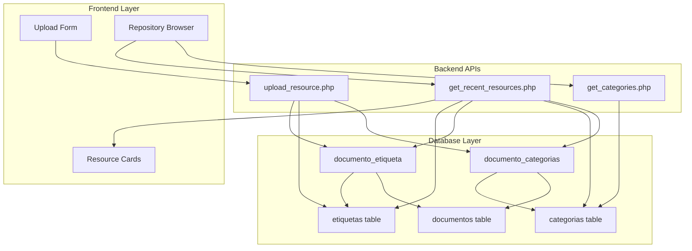

# Sistema de categorías y etiquetas

> **Archivos fuente relevantes**
> * [src/backend/gestionRecursos/get_categories.php](https://github.com/axchisan/El-rincon-de-ADSO/blob/3e310227/src/backend/gestionRecursos/get_categories.php)
> * [src/backend/gestionRecursos/get_recent_resources.php](https://github.com/axchisan/El-rincon-de-ADSO/blob/3e310227/src/backend/gestionRecursos/get_recent_resources.php)
> * [src/backend/gestionRecursos/get_user_groups.php](https://github.com/axchisan/El-rincon-de-ADSO/blob/3e310227/src/backend/gestionRecursos/get_user_groups.php)
> * [src/backend/gestionRecursos/upload_resource.php](https://github.com/axchisan/El-rincon-de-ADSO/blob/3e310227/src/backend/gestionRecursos/upload_resource.php)
> * [src/frontend/panel/css/styles-panel.css](https://github.com/axchisan/El-rincon-de-ADSO/blob/3e310227/src/frontend/panel/css/styles-panel.css)
> * [src/uploads/6805c8bb76358_cover.png](https://github.com/axchisan/El-rincon-de-ADSO/blob/3e310227/src/uploads/6805c8bb76358_cover.png)
> * [src/uploads/6805c8bb765ca.pdf](https://github.com/axchisan/El-rincon-de-ADSO/blob/3e310227/src/uploads/6805c8bb765ca.pdf)

## Propósito y alcance

Este documento describe el sistema de categorización y etiquetado utilizado para organizar y filtrar los recursos educativos en El Rincón de ADSO. El sistema ofrece dos mecanismos de clasificación complementarios: **categorías** (clasificaciones jerárquicas predefinidas) y **etiquetas** (etiquetas libres generadas por el usuario).

Para obtener información sobre cómo se cargan y gestionan los recursos, consulte [Carga y validación de recursos](/axchisan/El-rincon-de-ADSO/5.3-resource-upload-and-validation) . Para obtener más información sobre las interfaces de navegación y filtrado de recursos, consulte [Navegador de repositorios](/axchisan/El-rincon-de-ADSO/5.1-repository-browser) .

**Fuentes:** [src/backend/gestionRecursos/get_categories.php L1-L15](https://github.com/axchisan/El-rincon-de-ADSO/blob/3e310227/src/backend/gestionRecursos/get_categories.php#L1-L15)

 [src/backend/gestionRecursos/upload_resource.php L23-L208](https://github.com/axchisan/El-rincon-de-ADSO/blob/3e310227/src/backend/gestionRecursos/upload_resource.php#L23-L208)

---

## Arquitectura del modelo de datos

El sistema implementa un patrón de relación de muchos a muchos que permite múltiples categorías y etiquetas por recurso, y múltiples recursos por categoría/etiqueta.

### Esquema de base de datos

```css
#mermaid-54lcxp3hhj9{font-family:ui-sans-serif,-apple-system,system-ui,Segoe UI,Helvetica;font-size:16px;fill:#333;}@keyframes edge-animation-frame{from{stroke-dashoffset:0;}}@keyframes dash{to{stroke-dashoffset:0;}}#mermaid-54lcxp3hhj9 .edge-animation-slow{stroke-dasharray:9,5!important;stroke-dashoffset:900;animation:dash 50s linear infinite;stroke-linecap:round;}#mermaid-54lcxp3hhj9 .edge-animation-fast{stroke-dasharray:9,5!important;stroke-dashoffset:900;animation:dash 20s linear infinite;stroke-linecap:round;}#mermaid-54lcxp3hhj9 .error-icon{fill:#dddddd;}#mermaid-54lcxp3hhj9 .error-text{fill:#222222;stroke:#222222;}#mermaid-54lcxp3hhj9 .edge-thickness-normal{stroke-width:1px;}#mermaid-54lcxp3hhj9 .edge-thickness-thick{stroke-width:3.5px;}#mermaid-54lcxp3hhj9 .edge-pattern-solid{stroke-dasharray:0;}#mermaid-54lcxp3hhj9 .edge-thickness-invisible{stroke-width:0;fill:none;}#mermaid-54lcxp3hhj9 .edge-pattern-dashed{stroke-dasharray:3;}#mermaid-54lcxp3hhj9 .edge-pattern-dotted{stroke-dasharray:2;}#mermaid-54lcxp3hhj9 .marker{fill:#999;stroke:#999;}#mermaid-54lcxp3hhj9 .marker.cross{stroke:#999;}#mermaid-54lcxp3hhj9 svg{font-family:ui-sans-serif,-apple-system,system-ui,Segoe UI,Helvetica;font-size:16px;}#mermaid-54lcxp3hhj9 p{margin:0;}#mermaid-54lcxp3hhj9 .entityBox{fill:#ffffff;stroke:#dddddd;}#mermaid-54lcxp3hhj9 .relationshipLabelBox{fill:#dddddd;opacity:0.7;background-color:#dddddd;}#mermaid-54lcxp3hhj9 .relationshipLabelBox rect{opacity:0.5;}#mermaid-54lcxp3hhj9 .labelBkg{background-color:rgba(221, 221, 221, 0.5);}#mermaid-54lcxp3hhj9 .edgeLabel .label{fill:#dddddd;font-size:14px;}#mermaid-54lcxp3hhj9 .label{font-family:ui-sans-serif,-apple-system,system-ui,Segoe UI,Helvetica;color:#333;}#mermaid-54lcxp3hhj9 .edge-pattern-dashed{stroke-dasharray:8,8;}#mermaid-54lcxp3hhj9 .node rect,#mermaid-54lcxp3hhj9 .node circle,#mermaid-54lcxp3hhj9 .node ellipse,#mermaid-54lcxp3hhj9 .node polygon{fill:#ffffff;stroke:#dddddd;stroke-width:1px;}#mermaid-54lcxp3hhj9 .relationshipLine{stroke:#999;stroke-width:1;fill:none;}#mermaid-54lcxp3hhj9 .marker{fill:none!important;stroke:#999!important;stroke-width:1;}#mermaid-54lcxp3hhj9 :root{--mermaid-font-family:"trebuchet ms",verdana,arial,sans-serif;}hascontainshascontainsdocumentosintidPKstringtitulostringtipostringautor_idFKdocumento_categoriasintdocumento_idFKintcategoria_idFKcategoriasintidPKstringnombredocumento_etiquetaintdocumento_idFKintetiqueta_idFKetiquetasintidPKstringnombre
```

**Fuentes:** [src/backend/gestionRecursos/upload_resource.php L184-L208](https://github.com/axchisan/El-rincon-de-ADSO/blob/3e310227/src/backend/gestionRecursos/upload_resource.php#L184-L208)

 [src/backend/gestionRecursos/get_recent_resources.php L26-L37](https://github.com/axchisan/El-rincon-de-ADSO/blob/3e310227/src/backend/gestionRecursos/get_recent_resources.php#L26-L37)

### Tablas clave

| Mesa | Objetivo | Columnas clave |
| --- | --- | --- |
| `categorias` | Categorías de clasificación predefinidas | `id`,`nombre` |
| `etiquetas` | Etiquetas generadas por el usuario | `id`,`nombre` |
| `documento_categorias` | Vincula documentos a categorías | `documento_id`,`categoria_id` |
| `documento_etiqueta` | Vincula documentos a etiquetas | `documento_id`,`etiqueta_id` |

**Fuentes:** [src/backend/gestionRecursos/upload_resource.php L184-L208](https://github.com/axchisan/El-rincon-de-ADSO/blob/3e310227/src/backend/gestionRecursos/upload_resource.php#L184-L208)

---

## Gestión de categorías

Las categorías son clasificaciones **predefinidas** que se almacenan en la `categorias`tabla y se gestionan administrativamente. Proporcionan un vocabulario controlado para la organización de recursos.

### Recuperación de categorías

El `get_categories.php`punto final recupera todas las categorías disponibles:



**Fuentes:** [src/backend/gestionRecursos/get_categories.php L1-L15](https://github.com/axchisan/El-rincon-de-ADSO/blob/3e310227/src/backend/gestionRecursos/get_categories.php#L1-L15)

### Formato de respuesta de la API

El punto final devuelve una matriz JSON de objetos de categoría:

```json
[
  {"id": 1, "nombre": "Programming"},
  {"id": 2, "nombre": "Mathematics"},
  {"id": 3, "nombre": "Design"}
]
```

**Fuentes:** [src/backend/gestionRecursos/get_categories.php L6-L10](https://github.com/axchisan/El-rincon-de-ADSO/blob/3e310227/src/backend/gestionRecursos/get_categories.php#L6-L10)

### Asociación de categorías durante la carga

Durante la carga de recursos, las categorías se vinculan a través de la `documento_categorias`tabla de unión:



**Fuentes:** [src/backend/gestionRecursos/upload_resource.php L184-L188](https://github.com/axchisan/El-rincon-de-ADSO/blob/3e310227/src/backend/gestionRecursos/upload_resource.php#L184-L188)

La implementación en[src/backend/gestionRecursos/upload_resource.php L184-L188](https://github.com/axchisan/El-rincon-de-ADSO/blob/3e310227/src/backend/gestionRecursos/upload_resource.php#L184-L188)

ejecuta:

```javascript
foreach ($categories as $categoria_id) {
    $query = "INSERT INTO documento_categorias (documento_id, categoria_id) 
              VALUES (:documento_id, :categoria_id)";
    $stmt = $db->prepare($query);
    $stmt->execute([':documento_id' => $documento_id, ':categoria_id' => $categoria_id]);
}
```

**Fuentes:** [src/backend/gestionRecursos/upload_resource.php L184-L188](https://github.com/axchisan/El-rincon-de-ADSO/blob/3e310227/src/backend/gestionRecursos/upload_resource.php#L184-L188)

---

## Gestión de etiquetas

Tags (stored in the `etiquetas` table) are **dynamically created** user-generated labels. Unlike categories, tags are created on-demand during resource upload if they don't already exist.

### Tag Creation Flow



**Sources:** [src/backend/gestionRecursos/upload_resource.php L190-L208](https://github.com/axchisan/El-rincon-de-ADSO/blob/3e310227/src/backend/gestionRecursos/upload_resource.php#L190-L208)

### Tag Auto-Creation Logic

The tag system implements an "insert-if-not-exists" pattern at [src/backend/gestionRecursos/upload_resource.php L190-L208](https://github.com/axchisan/El-rincon-de-ADSO/blob/3e310227/src/backend/gestionRecursos/upload_resource.php#L190-L208)

:

```javascript
foreach ($tags as $tag_name) {
    // Check if tag exists
    $query = "SELECT id FROM etiquetas WHERE nombre = :nombre";
    $stmt = $db->prepare($query);
    $stmt->execute([':nombre' => $tag_name]);
    $etiqueta = $stmt->fetch(PDO::FETCH_ASSOC);

    if ($etiqueta) {
        $etiqueta_id = $etiqueta['id'];
    } else {
        // Create new tag
        $query = "INSERT INTO etiquetas (nombre) VALUES (:nombre)";
        $stmt = $db->prepare($query);
        $stmt->execute([':nombre' => $tag_name]);
        $etiqueta_id = $db->lastInsertId();
    }

    // Link tag to document
    $query = "INSERT INTO documento_etiqueta (documento_id, etiqueta_id) 
              VALUES (:documento_id, :etiqueta_id)";
    $stmt = $db->prepare($query);
    $stmt->execute([':documento_id' => $documento_id, ':etiqueta_id' => $etiqueta_id]);
}
```

**Sources:** [src/backend/gestionRecursos/upload_resource.php L190-L208](https://github.com/axchisan/El-rincon-de-ADSO/blob/3e310227/src/backend/gestionRecursos/upload_resource.php#L190-L208)

---

## Resource Upload Integration

Categories and tags are submitted as JSON arrays in the upload form data and processed within a database transaction to ensure consistency.

### Upload Request Parameters

| Parameter | Type | Required | Description |
| --- | --- | --- | --- |
| `categories` | JSON array | Yes | Array of category IDs (e.g., `[1, 3, 5]`) |
| `tags` | JSON array | No | Array of tag names (e.g., `["python", "tutorial"]`) |

**Sources:** [src/backend/gestionRecursos/upload_resource.php L23-L24](https://github.com/axchisan/El-rincon-de-ADSO/blob/3e310227/src/backend/gestionRecursos/upload_resource.php#L23-L24)

### Upload Processing Flow



**Sources:** [src/backend/gestionRecursos/upload_resource.php L156-L217](https://github.com/axchisan/El-rincon-de-ADSO/blob/3e310227/src/backend/gestionRecursos/upload_resource.php#L156-L217)

### Transaction Safety

The entire upload process, including category and tag associations, occurs within a transaction starting at [src/backend/gestionRecursos/upload_resource.php L158](https://github.com/axchisan/El-rincon-de-ADSO/blob/3e310227/src/backend/gestionRecursos/upload_resource.php#L158-L158)

:

```
$db->beginTransaction();
// ... document insertion
// ... category associations
// ... tag associations
$db->commit();
```

If any step fails, the transaction rolls back at [src/backend/gestionRecursos/upload_resource.php L213](https://github.com/axchisan/El-rincon-de-ADSO/blob/3e310227/src/backend/gestionRecursos/upload_resource.php#L213-L213)

 removing uploaded files and ensuring data consistency.

**Sources:** [src/backend/gestionRecursos/upload_resource.php L156-L217](https://github.com/axchisan/El-rincon-de-ADSO/blob/3e310227/src/backend/gestionRecursos/upload_resource.php#L156-L217)

---

## Resource Retrieval with Categories and Tags

When retrieving resources, categories and tags are aggregated into arrays using PostgreSQL's `ARRAY_AGG` function.

### Aggregation Query Pattern



**Sources:** [src/backend/gestionRecursos/get_recent_resources.php L26-L38](https://github.com/axchisan/El-rincon-de-ADSO/blob/3e310227/src/backend/gestionRecursos/get_recent_resources.php#L26-L38)

### Query Implementation

The `get_recent_resources.php` endpoint retrieves resources with their associated categories and tags at [src/backend/gestionRecursos/get_recent_resources.php L26-L38](https://github.com/axchisan/El-rincon-de-ADSO/blob/3e310227/src/backend/gestionRecursos/get_recent_resources.php#L26-L38)

:

```sql
SELECT d.id, d.titulo, d.descripcion, d.autor, d.portada, d.tipo, d.url_archivo, d.duracion,
       d.fecha_publicacion, d.relevancia, d.visibilidad, d.grupo_id, d.idioma, d.licencia, d.estado,
       d.autor_id, u.nombre_usuario AS autor_nombre,
       COALESCE(ARRAY_AGG(c.nombre) FILTER (WHERE c.nombre IS NOT NULL), '{}') AS categorias,
       COALESCE(ARRAY_AGG(e.nombre) FILTER (WHERE e.nombre IS NOT NULL), '{}') AS etiquetas
FROM documentos d
JOIN usuarios u ON d.autor_id = u.id
LEFT JOIN documento_categorias dc ON d.id = dc.documento_id
LEFT JOIN categorias c ON dc.categoria_id = c.id
LEFT JOIN documento_etiqueta de ON d.id = de.documento_id
LEFT JOIN etiquetas e ON de.etiqueta_id = e.id
WHERE d.estado = 'Published'
GROUP BY d.id, u.nombre_usuario
```

**Sources:** [src/backend/gestionRecursos/get_recent_resources.php L26-L82](https://github.com/axchisan/El-rincon-de-ADSO/blob/3e310227/src/backend/gestionRecursos/get_recent_resources.php#L26-L82)

### Response Transformation

PostgreSQL returns arrays as `{item1,item2}` strings, which are converted to PHP arrays at [src/backend/gestionRecursos/get_recent_resources.php L90-L105](https://github.com/axchisan/El-rincon-de-ADSO/blob/3e310227/src/backend/gestionRecursos/get_recent_resources.php#L90-L105)

:

```
foreach ($resources as &$resource) {
    $resource['categorias'] = $resource['categorias'] === '{}'
        ? []
        : array_map('trim', explode(',', trim($resource['categorias'], '{}')));

    $resource['etiquetas'] = $resource['etiquetas'] === '{}'
        ? []
        : array_map('trim', explode(',', trim($resource['etiquetas'], '{}')));
}
```

**Sources:** [src/backend/gestionRecursos/get_recent_resources.php L90-L105](https://github.com/axchisan/El-rincon-de-ADSO/blob/3e310227/src/backend/gestionRecursos/get_recent_resources.php#L90-L105)

---

## Filtering by Categories and Tags

Resources can be filtered by category ID or by other criteria. The filtering logic is applied before the `GROUP BY` clause.

### Category Filtering

When a `category` parameter is provided, the query adds a `WHERE` condition at [src/backend/gestionRecursos/get_recent_resources.php L62-L65](https://github.com/axchisan/El-rincon-de-ADSO/blob/3e310227/src/backend/gestionRecursos/get_recent_resources.php#L62-L65)

:

```
if ($category) {
    $query .= " AND dc.categoria_id = :category";
    $params[':category'] = $category;
}
```

**Sources:** [src/backend/gestionRecursos/get_recent_resources.php L62-L65](https://github.com/axchisan/El-rincon-de-ADSO/blob/3e310227/src/backend/gestionRecursos/get_recent_resources.php#L62-L65)

### Multi-Criteria Filtering

The filtering system supports multiple simultaneous filters:

| Filter | Parameter | SQL Condition |
| --- | --- | --- |
| Search text | `search` | `titulo ILIKE` OR `descripcion ILIKE` OR `autor ILIKE` |
| Category | `category` | `dc.categoria_id = :category` |
| Resource type | `type` | `d.tipo = :type` |
| Relevance | `relevance` | `d.relevancia = :relevance` |
| Language | `language` | `d.idioma = :language` |

**Sources:** [src/backend/gestionRecursos/get_recent_resources.php L56-L80](https://github.com/axchisan/El-rincon-de-ADSO/blob/3e310227/src/backend/gestionRecursos/get_recent_resources.php#L56-L80)

---

## Frontend Display

Categories and tags are displayed differently in the UI to reflect their distinct purposes.

### Resource Card Display



**Sources:** [src/frontend/panel/css/styles-panel.css L798-L813](https://github.com/axchisan/El-rincon-de-ADSO/blob/3e310227/src/frontend/panel/css/styles-panel.css#L798-L813)

### Category Badge Styling

Categories appear as prominent badges with styling defined at [src/frontend/panel/css/styles-panel.css L798-L807](https://github.com/axchisan/El-rincon-de-ADSO/blob/3e310227/src/frontend/panel/css/styles-panel.css#L798-L807)

:

```css
.resource-card__category {
  display: inline-block;
  font-size: 0.75rem;
  font-weight: 600;
  color: var(--color-white);
  background-color: var(--color-coffee-light);
  padding: 0.25rem 0.75rem;
  border-radius: var(--border-radius-full);
  margin-bottom: 0.75rem;
}
```

**Sources:** [src/frontend/panel/css/styles-panel.css L798-L807](https://github.com/axchisan/El-rincon-de-ADSO/blob/3e310227/src/frontend/panel/css/styles-panel.css#L798-L807)

### Tag Display Styling

Tags appear as subdued text with styling at [src/frontend/panel/css/styles-panel.css L809-L813](https://github.com/axchisan/El-rincon-de-ADSO/blob/3e310227/src/frontend/panel/css/styles-panel.css#L809-L813)

:

```css
.resource-card__tags {
  font-size: 0.75rem;
  color: var(--color-gray-600);
  margin-bottom: 0.75rem;
}
```

**Sources:** [src/frontend/panel/css/styles-panel.css L809-L813](https://github.com/axchisan/El-rincon-de-ADSO/blob/3e310227/src/frontend/panel/css/styles-panel.css#L809-L813)

### Tag Pills (Generic)

The system also provides a generic `.tag` class for displaying tags as pills at [src/frontend/panel/css/styles-panel.css L1061-L1067](https://github.com/axchisan/El-rincon-de-ADSO/blob/3e310227/src/frontend/panel/css/styles-panel.css#L1061-L1067)

:

```css
.tag {
  font-size: 0.75rem;
  padding: 0.25rem 0.75rem;
  background-color: var(--color-gray-100);
  color: var(--color-gray-700);
  border-radius: var(--border-radius-full);
}
```

**Sources:** [src/frontend/panel/css/styles-panel.css L1061-L1067](https://github.com/axchisan/El-rincon-de-ADSO/blob/3e310227/src/frontend/panel/css/styles-panel.css#L1061-L1067)

---

## System Architecture Summary

### Component Interaction Map



**Sources:** [src/backend/gestionRecursos/upload_resource.php L1-L217](https://github.com/axchisan/El-rincon-de-ADSO/blob/3e310227/src/backend/gestionRecursos/upload_resource.php#L1-L217)

 [src/backend/gestionRecursos/get_categories.php L1-L15](https://github.com/axchisan/El-rincon-de-ADSO/blob/3e310227/src/backend/gestionRecursos/get_categories.php#L1-L15)

 [src/backend/gestionRecursos/get_recent_resources.php L1-L123](https://github.com/axchisan/El-rincon-de-ADSO/blob/3e310227/src/backend/gestionRecursos/get_recent_resources.php#L1-L123)

### Key Differences: Categories vs. Tags

| Aspect | Categories | Tags |
| --- | --- | --- |
| **Creation** | Predefined, admin-managed | User-generated, dynamic |
| **Table** | `categorias` | `etiquetas` |
| **Storage** | Fixed set in database | Auto-created on first use |
| **Selection** | User selects from dropdown | User types freeform text |
| **Retrieval** | Direct lookup by ID | Check existence, create if needed |
| **Purpose** | Structured classification | Flexible labeling |
| **Display** | Prominent badge | Subdued text list |

**Sources:** [src/backend/gestionRecursos/upload_resource.php L184-L208](https://github.com/axchisan/El-rincon-de-ADSO/blob/3e310227/src/backend/gestionRecursos/upload_resource.php#L184-L208)

 [src/frontend/panel/css/styles-panel.css L798-L813](https://github.com/axchisan/El-rincon-de-ADSO/blob/3e310227/src/frontend/panel/css/styles-panel.css#L798-L813)

---

## Validation and Constraints

### Required Fields

Las categorías son obligatorias durante la carga de recursos. Validación en[src/backend/gestionRecursos/upload_resource.php L51-L54](https://github.com/axchisan/El-rincon-de-ADSO/blob/3e310227/src/backend/gestionRecursos/upload_resource.php#L51-L54)

garantiza:

```javascript
if (empty($title) || empty($author) || empty($resource_type) || 
    empty($categories) || empty($relevance) || empty($visibility) || 
    empty($language) || empty($license) || empty($status)) {
    echo json_encode(['success' => false, 
                     'message' => 'Todos los campos obligatorios deben estar completos.']);
    exit;
}
```

Las etiquetas son **opcionales** y pueden ser una matriz vacía.

**Fuentes:** [src/backend/gestionRecursos/upload_resource.php L51-L54](https://github.com/axchisan/El-rincon-de-ADSO/blob/3e310227/src/backend/gestionRecursos/upload_resource.php#L51-L54)

### Validación del formato de datos

Las categorías y etiquetas se reciben como matrices codificadas en JSON y se decodifican en[src/backend/gestionRecursos/upload_resource.php L23-L24](https://github.com/axchisan/El-rincon-de-ADSO/blob/3e310227/src/backend/gestionRecursos/upload_resource.php#L23-L24)

:

```
$categories = json_decode($_POST['categories'] ?? '[]', true);
$tags = json_decode($_POST['tags'] ?? '[]', true);
```

**Fuentes:** [src/backend/gestionRecursos/upload_resource.php L23-L24](https://github.com/axchisan/El-rincon-de-ADSO/blob/3e310227/src/backend/gestionRecursos/upload_resource.php#L23-L24)

---

## Consideraciones de seguridad

### Prevención de inyección SQL

Todas las operaciones de categorías y etiquetas utilizan **declaraciones preparadas** con parámetros enlazados:

* Inserción de categoría:[src/backend/gestionRecursos/upload_resource.php L185-L187](https://github.com/axchisan/El-rincon-de-ADSO/blob/3e310227/src/backend/gestionRecursos/upload_resource.php#L185-L187)
* Búsqueda de etiquetas:[src/backend/gestionRecursos/upload_resource.php L191-L193](https://github.com/axchisan/El-rincon-de-ADSO/blob/3e310227/src/backend/gestionRecursos/upload_resource.php#L191-L193)
* Inserción de etiqueta:[src/backend/gestionRecursos/upload_resource.php L199-L201](https://github.com/axchisan/El-rincon-de-ADSO/blob/3e310227/src/backend/gestionRecursos/upload_resource.php#L199-L201)
* Enlace de etiquetas:[src/backend/gestionRecursos/upload_resource.php L205-L207](https://github.com/axchisan/El-rincon-de-ADSO/blob/3e310227/src/backend/gestionRecursos/upload_resource.php#L205-L207)

**Fuentes:** [src/backend/gestionRecursos/upload_resource.php L184-L208](https://github.com/axchisan/El-rincon-de-ADSO/blob/3e310227/src/backend/gestionRecursos/upload_resource.php#L184-L208)

### Sanitización de entrada

Los nombres de las etiquetas se almacenan tal cual, pero deben depurarse antes de mostrarse. El sistema se basa en las consultas parametrizadas de PostgreSQL para evitar ataques de inyección durante las operaciones de la base de datos.

**Fuentes:** [src/backend/gestionRecursos/upload_resource.php L190-L208](https://github.com/axchisan/El-rincon-de-ADSO/blob/3e310227/src/backend/gestionRecursos/upload_resource.php#L190-L208)

---

## Consideraciones de rendimiento

### Requisitos del índice

Para un rendimiento óptimo, se deben mantener los siguientes índices:

* `categorias(id)`- Clave principal
* `etiquetas(id)`- Clave principal
* `etiquetas(nombre)`- Para la búsqueda de etiquetas durante la carga
* `documento_categorias(documento_id, categoria_id)`- Compuesto para uniones
* `documento_etiqueta(documento_id, etiqueta_id)`- Compuesto para uniones

**Fuentes:** [src/backend/gestionRecursos/upload_resource.php L191-L193](https://github.com/axchisan/El-rincon-de-ADSO/blob/3e310227/src/backend/gestionRecursos/upload_resource.php#L191-L193)

 [src/backend/gestionRecursos/get_recent_resources.php L34-L37](https://github.com/axchisan/El-rincon-de-ADSO/blob/3e310227/src/backend/gestionRecursos/get_recent_resources.php#L34-L37)

### Eficiencia de agregación de matrices

La `ARRAY_AGG`función con `FILTER`cláusula at[src/backend/gestionRecursos/get_recent_resources.php L30-L31](https://github.com/axchisan/El-rincon-de-ADSO/blob/3e310227/src/backend/gestionRecursos/get_recent_resources.php#L30-L31)

Agrega eficientemente categorías y etiquetas en una sola consulta, evitando problemas de consultas N+1.

**Fuentes:** [src/backend/gestionRecursos/get_recent_resources.php L26-L38](https://github.com/axchisan/El-rincon-de-ADSO/blob/3e310227/src/backend/gestionRecursos/get_recent_resources.php#L26-L38)