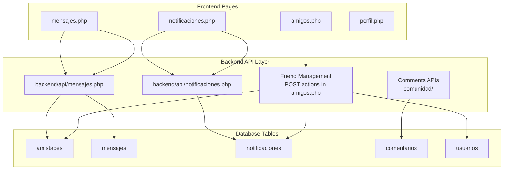
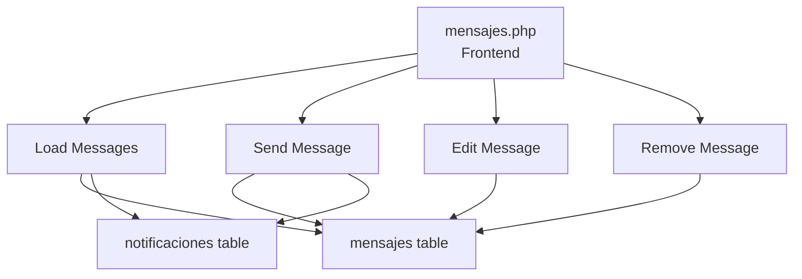
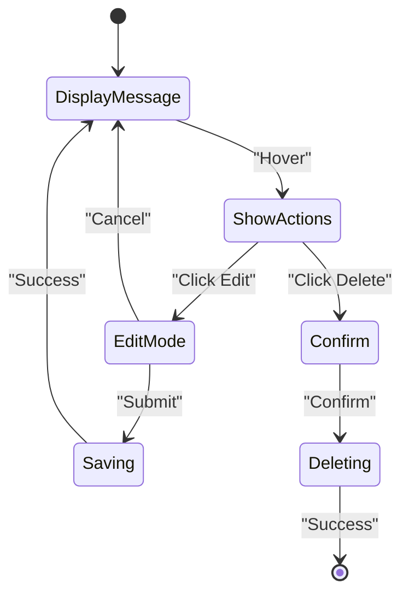
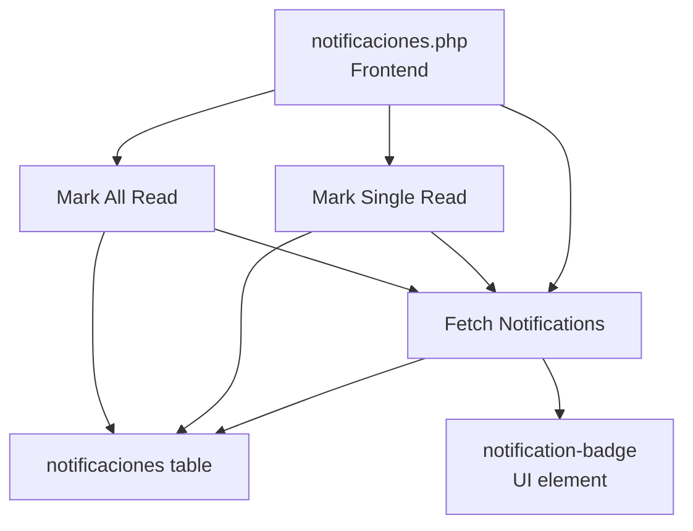
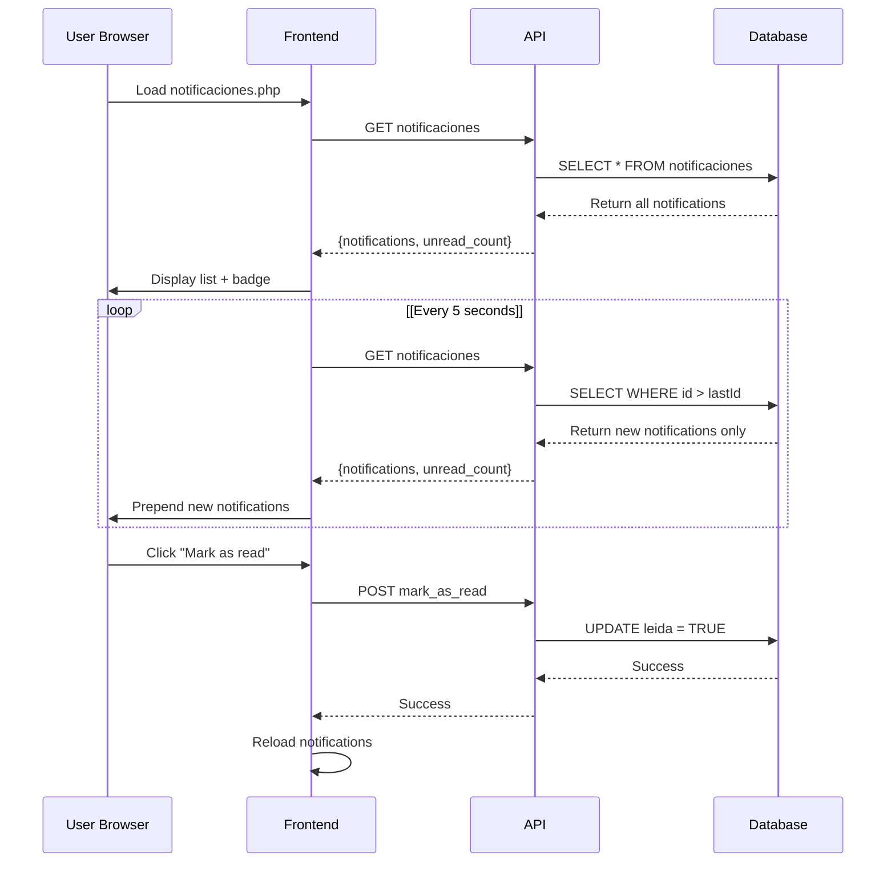
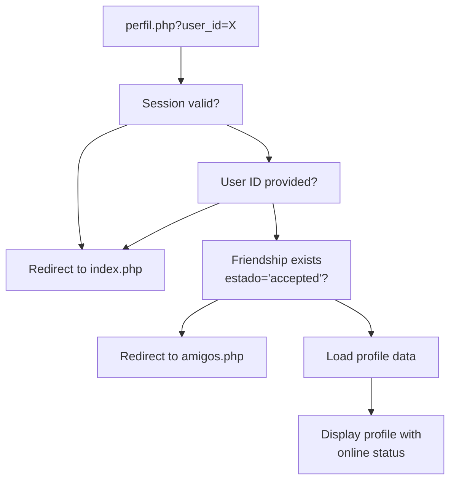
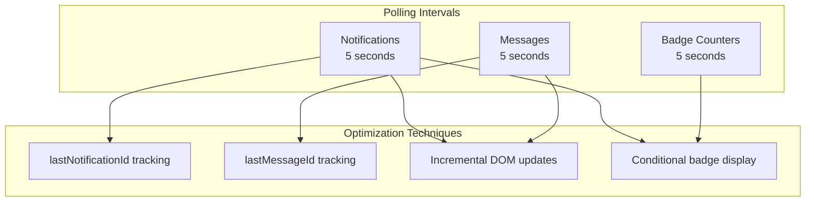

# Social and Community APIs

> **Relevant source files**
> * [src/frontend/friends/amigos.php](https://github.com/axchisan/El-rincon-de-ADSO/blob/3e310227/src/frontend/friends/amigos.php)
> * [src/frontend/friends/css/style.css](https://github.com/axchisan/El-rincon-de-ADSO/blob/3e310227/src/frontend/friends/css/style.css)
> * [src/frontend/mensajes/mensajes.php](https://github.com/axchisan/El-rincon-de-ADSO/blob/3e310227/src/frontend/mensajes/mensajes.php)
> * [src/frontend/notificaciones/notificaciones.php](https://github.com/axchisan/El-rincon-de-ADSO/blob/3e310227/src/frontend/notificaciones/notificaciones.php)
> * [src/frontend/perfil/perfil.php](https://github.com/axchisan/El-rincon-de-ADSO/blob/3e310227/src/frontend/perfil/perfil.php)

## Purpose and Scope

This document provides technical reference for all backend API endpoints related to social networking and community engagement features in El Rincón de ADSO. These APIs enable friend management, real-time messaging, notifications, comments, and community interactions.

For high-level overview of social features, see [Social Features](/axchisan/El-rincon-de-ADSO/6-social-features). For user profile update APIs, see [User Profile APIs](/axchisan/El-rincon-de-ADSO/9.3-user-profile-apis). For resource-related APIs, see [Resource Management APIs](/axchisan/El-rincon-de-ADSO/9.1-resource-management-apis).

---

## API Architecture Overview

The social and community APIs follow a RESTful-like pattern with JSON request/response payloads. All endpoints require active session authentication via `$_SESSION['usuario_id']`. The system implements real-time updates through client-side polling at 5-second intervals.



**Sources:** [src/frontend/friends/amigos.php L1-L223](https://github.com/axchisan/El-rincon-de-ADSO/blob/3e310227/src/frontend/friends/amigos.php#L1-L223)

 [src/frontend/mensajes/mensajes.php L1-L484](https://github.com/axchisan/El-rincon-de-ADSO/blob/3e310227/src/frontend/mensajes/mensajes.php#L1-L484)

 [src/frontend/notificaciones/notificaciones.php L1-L294](https://github.com/axchisan/El-rincon-de-ADSO/blob/3e310227/src/frontend/notificaciones/notificaciones.php#L1-L294)

---

## Friend Management APIs

Friend management is implemented directly in the frontend page [src/frontend/friends/amigos.php](https://github.com/axchisan/El-rincon-de-ADSO/blob/3e310227/src/frontend/friends/amigos.php)

 through POST form submissions. All operations update the `amistades` table and generate notifications.

### Endpoint: Search Users

**Location:** Inline in `amigos.php`
**Method:** `POST`
**Parameters:**

* `search_user`: Form field indicator
* `search_term`: String to search (ILIKE match on `nombre_usuario`)

**Query Logic:**

```sql
SELECT id, nombre_usuario, correo, imagen 
FROM usuarios 
WHERE nombre_usuario ILIKE :search_term 
AND id != :current_user_id 
AND [exclude pending/accepted friendships]
```

**Response:** Renders search results in HTML

**Sources:** [src/frontend/friends/amigos.php L39-L73](https://github.com/axchisan/El-rincon-de-ADSO/blob/3e310227/src/frontend/friends/amigos.php#L39-L73)

---

### Endpoint: Send Friend Request

**Location:** Inline in `amigos.php`
**Method:** `POST`
**Parameters:**

* `send_request`: Action indicator
* `receiver_id`: Target user ID

**Operations:**

1. Insert into `amistades` table with `estado='pending'`
2. Create notification of type `friend_request`
3. Redirect to prevent form resubmission

**Database Operations:**

```sql
INSERT INTO amistades (usuario_id, amigo_id, estado) 
VALUES (:sender_id, :receiver_id, 'pending');

INSERT INTO notificaciones (usuario_id, tipo, relacionado_id, mensaje) 
VALUES (:receiver_id, 'friend_request', :sender_id, :message);
```

**Sources:** [src/frontend/friends/amigos.php L76-L108](https://github.com/axchisan/El-rincon-de-ADSO/blob/3e310227/src/frontend/friends/amigos.php#L76-L108)

---

### Endpoint: Accept Friend Request

**Location:** Inline in `amigos.php`
**Method:** `POST`
**Parameters:**

* `accept_request`: Action indicator
* `sender_id`: ID of user who sent request

**Operations:**

1. Update `amistades.estado` to `'accepted'`
2. Update `fecha_creacion` to current timestamp
3. Create notification of type `friend_request_accepted`

**Database Operations:**

```sql
UPDATE amistades 
SET estado = 'accepted', fecha_creacion = CURRENT_TIMESTAMP 
WHERE usuario_id = :sender_id AND amigo_id = :receiver_id AND estado = 'pending';

INSERT INTO notificaciones (usuario_id, tipo, relacionado_id, mensaje) 
VALUES (:sender_id, 'friend_request_accepted', :receiver_id, :message);
```

**Sources:** [src/frontend/friends/amigos.php L111-L142](https://github.com/axchisan/El-rincon-de-ADSO/blob/3e310227/src/frontend/friends/amigos.php#L111-L142)

---

### Endpoint: Reject Friend Request

**Location:** Inline in `amigos.php`
**Method:** `POST`
**Parameters:**

* `reject_request`: Action indicator
* `sender_id`: ID of user who sent request

**Operations:**

1. Update `amistades.estado` to `'rejected'`
2. No notification generated

**Database Operations:**

```sql
UPDATE amistades 
SET estado = 'rejected', fecha_creacion = CURRENT_TIMESTAMP 
WHERE usuario_id = :sender_id AND amigo_id = :receiver_id AND estado = 'pending';
```

**Sources:** [src/frontend/friends/amigos.php L145-L160](https://github.com/axchisan/El-rincon-de-ADSO/blob/3e310227/src/frontend/friends/amigos.php#L145-L160)

---

### Endpoint: Remove Friend

**Location:** Inline in `amigos.php`
**Method:** `POST`
**Parameters:**

* `remove_friend`: Action indicator
* `friend_id`: ID of friend to remove

**Operations:**

1. Delete friendship record (bidirectional check)

**Database Operations:**

```sql
DELETE FROM amistades 
WHERE (usuario_id = :user_id AND amigo_id = :friend_id AND estado = 'accepted') 
   OR (usuario_id = :friend_id AND amigo_id = :user_id AND estado = 'accepted');
```

**Sources:** [src/frontend/friends/amigos.php L163-L178](https://github.com/axchisan/El-rincon-de-ADSO/blob/3e310227/src/frontend/friends/amigos.php#L163-L178)

---

### Endpoint: Get Friends List

**Location:** Inline in `amigos.php`
**Method:** SQL query execution
**Query:**

```sql
SELECT u.id, u.nombre_usuario, u.correo, u.ultima_conexion, u.imagen 
FROM amistades a 
JOIN usuarios u ON (u.id = a.usuario_id OR u.id = a.amigo_id) 
WHERE ((a.usuario_id = :user_id AND u.id = a.amigo_id) 
    OR (a.amigo_id = :user_id AND u.id = a.usuario_id)) 
AND a.estado = 'accepted';
```

**Online Status Calculation:**
The `getOnlineStatus()` function determines if a user is online based on `ultima_conexion`:

* **Online:** Last connection within 5 minutes
* **Offline:** Shows formatted timestamp

**Sources:** [src/frontend/friends/amigos.php L189-L216](https://github.com/axchisan/El-rincon-de-ADSO/blob/3e310227/src/frontend/friends/amigos.php#L189-L216)

---

## Friendship Status Data Model

```css
#mermaid-f0boc4vgx4{font-family:ui-sans-serif,-apple-system,system-ui,Segoe UI,Helvetica;font-size:16px;fill:#333;}@keyframes edge-animation-frame{from{stroke-dashoffset:0;}}@keyframes dash{to{stroke-dashoffset:0;}}#mermaid-f0boc4vgx4 .edge-animation-slow{stroke-dasharray:9,5!important;stroke-dashoffset:900;animation:dash 50s linear infinite;stroke-linecap:round;}#mermaid-f0boc4vgx4 .edge-animation-fast{stroke-dasharray:9,5!important;stroke-dashoffset:900;animation:dash 20s linear infinite;stroke-linecap:round;}#mermaid-f0boc4vgx4 .error-icon{fill:#dddddd;}#mermaid-f0boc4vgx4 .error-text{fill:#222222;stroke:#222222;}#mermaid-f0boc4vgx4 .edge-thickness-normal{stroke-width:1px;}#mermaid-f0boc4vgx4 .edge-thickness-thick{stroke-width:3.5px;}#mermaid-f0boc4vgx4 .edge-pattern-solid{stroke-dasharray:0;}#mermaid-f0boc4vgx4 .edge-thickness-invisible{stroke-width:0;fill:none;}#mermaid-f0boc4vgx4 .edge-pattern-dashed{stroke-dasharray:3;}#mermaid-f0boc4vgx4 .edge-pattern-dotted{stroke-dasharray:2;}#mermaid-f0boc4vgx4 .marker{fill:#999;stroke:#999;}#mermaid-f0boc4vgx4 .marker.cross{stroke:#999;}#mermaid-f0boc4vgx4 svg{font-family:ui-sans-serif,-apple-system,system-ui,Segoe UI,Helvetica;font-size:16px;}#mermaid-f0boc4vgx4 p{margin:0;}#mermaid-f0boc4vgx4 .entityBox{fill:#ffffff;stroke:#dddddd;}#mermaid-f0boc4vgx4 .relationshipLabelBox{fill:#dddddd;opacity:0.7;background-color:#dddddd;}#mermaid-f0boc4vgx4 .relationshipLabelBox rect{opacity:0.5;}#mermaid-f0boc4vgx4 .labelBkg{background-color:rgba(221, 221, 221, 0.5);}#mermaid-f0boc4vgx4 .edgeLabel .label{fill:#dddddd;font-size:14px;}#mermaid-f0boc4vgx4 .label{font-family:ui-sans-serif,-apple-system,system-ui,Segoe UI,Helvetica;color:#333;}#mermaid-f0boc4vgx4 .edge-pattern-dashed{stroke-dasharray:8,8;}#mermaid-f0boc4vgx4 .node rect,#mermaid-f0boc4vgx4 .node circle,#mermaid-f0boc4vgx4 .node ellipse,#mermaid-f0boc4vgx4 .node polygon{fill:#ffffff;stroke:#dddddd;stroke-width:1px;}#mermaid-f0boc4vgx4 .relationshipLine{stroke:#999;stroke-width:1;fill:none;}#mermaid-f0boc4vgx4 .marker{fill:none!important;stroke:#999!important;stroke-width:1;}#mermaid-f0boc4vgx4 :root{--mermaid-font-family:"trebuchet ms",verdana,arial,sans-serif;}usuario_idamigo_idusuario_idrelacionado_idamistadesintidPKintusuario_idFKintamigo_idFKvarcharestadotimestampfecha_creacionusuariosintidPKvarcharnombre_usuariotimestampultima_conexionnotificacionesintidPKintusuario_idFKvarchartipointrelacionado_idFKtextmensajebooleanleidatimestampfecha_creacion
```

| Estado | Description |
| --- | --- |
| `pending` | Friend request sent but not yet accepted |
| `accepted` | Mutual friendship established |
| `rejected` | Request was rejected |

**Sources:** [src/frontend/friends/amigos.php L80-L86](https://github.com/axchisan/El-rincon-de-ADSO/blob/3e310227/src/frontend/friends/amigos.php#L80-L86)

 [src/frontend/friends/amigos.php L115-L122](https://github.com/axchisan/El-rincon-de-ADSO/blob/3e310227/src/frontend/friends/amigos.php#L115-L122)

---

## Messaging APIs

The messaging system is implemented in `backend/api/mensajes.php` and supports full CRUD operations. All messages are restricted to users with `estado='accepted'` friendships.

### API Endpoint: backend/api/mensajes.php



**Sources:** [src/frontend/mensajes/mensajes.php L262-L327](https://github.com/axchisan/El-rincon-de-ADSO/blob/3e310227/src/frontend/mensajes/mensajes.php#L262-L327)

---

### GET - Retrieve Messages

**Endpoint:** `GET backend/api/mensajes.php?friend_id={friend_id}`

**Request Parameters:**

* `friend_id` (query param): ID of the friend to chat with

**Response Format:**

```json
{
  "status": "success",
  "data": [
    {
      "id": 123,
      "remitente_id": 5,
      "destinatario_id": 8,
      "contenido": "Message text",
      "fecha_envio": "2024-01-15 14:30:00"
    }
  ]
}
```

**Authorization:**

* Verifies friendship exists with `estado='accepted'`
* Returns only messages where user is sender or receiver

**Frontend Implementation:**

```javascript
const response = await fetch(`../../backend/api/mensajes.php?friend_id=${friendId}`);
const result = await response.json();
```

**Polling:** Executes every 5 seconds with `lastMessageId` tracking to load only new messages

**Sources:** [src/frontend/mensajes/mensajes.php L262-L327](https://github.com/axchisan/El-rincon-de-ADSO/blob/3e310227/src/frontend/mensajes/mensajes.php#L262-L327)

 [src/frontend/mensajes/mensajes.php L464-L465](https://github.com/axchisan/El-rincon-de-ADSO/blob/3e310227/src/frontend/mensajes/mensajes.php#L464-L465)

---

### POST - Send Message

**Endpoint:** `POST backend/api/mensajes.php`

**Request Body:**

```json
{
  "friend_id": 8,
  "content": "Message text"
}
```

**Response Format:**

```json
{
  "status": "success",
  "message": "Message sent successfully"
}
```

**Operations:**

1. Validate friendship exists
2. Insert into `mensajes` table
3. Create notification for recipient

**Frontend Implementation:**

```yaml
await fetch('../../backend/api/mensajes.php', {
  method: 'POST',
  headers: { 'Content-Type': 'application/json' },
  body: JSON.stringify({ friend_id: friendId, content: content })
});
```

**Sources:** [src/frontend/mensajes/mensajes.php L431-L461](https://github.com/axchisan/El-rincon-de-ADSO/blob/3e310227/src/frontend/mensajes/mensajes.php#L431-L461)

---

### PUT - Edit Message

**Endpoint:** `PUT backend/api/mensajes.php`

**Request Body:**

```json
{
  "message_id": 123,
  "content": "Updated message text"
}
```

**Response Format:**

```json
{
  "status": "success",
  "message": "Message updated successfully"
}
```

**Authorization:**

* Only the message sender (`remitente_id`) can edit

**Frontend Implementation:**

```yaml
await fetch('../../backend/api/mensajes.php', {
  method: 'PUT',
  headers: { 'Content-Type': 'application/json' },
  body: JSON.stringify({ message_id: messageId, content: newContent })
});
```

**Sources:** [src/frontend/mensajes/mensajes.php L368-L391](https://github.com/axchisan/El-rincon-de-ADSO/blob/3e310227/src/frontend/mensajes/mensajes.php#L368-L391)

---

### DELETE - Remove Message

**Endpoint:** `DELETE backend/api/mensajes.php`

**Request Body:**

```json
{
  "message_id": 123
}
```

**Response Format:**

```json
{
  "status": "success",
  "message": "Message deleted successfully"
}
```

**Authorization:**

* Only the message sender can delete

**Frontend Implementation:**

```sql
await fetch('../../backend/api/mensajes.php', {
  method: 'DELETE',
  headers: { 'Content-Type': 'application/json' },
  body: JSON.stringify({ message_id: messageId })
});
```

**Sources:** [src/frontend/mensajes/mensajes.php L404-L427](https://github.com/axchisan/El-rincon-de-ADSO/blob/3e310227/src/frontend/mensajes/mensajes.php#L404-L427)

---

## Message UI Features

The messaging interface includes real-time CRUD operations with inline editing:



**Features:**

* Sent messages display on right, received on left
* Edit/Delete buttons appear on hover for own messages
* Inline edit form with save/cancel buttons
* Confirmation dialog for deletion
* Auto-scroll to bottom on new messages

**Sources:** [src/frontend/mensajes/mensajes.php L100-L152](https://github.com/axchisan/El-rincon-de-ADSO/blob/3e310227/src/frontend/mensajes/mensajes.php#L100-L152)

 [src/frontend/mensajes/mensajes.php L290-L310](https://github.com/axchisan/El-rincon-de-ADSO/blob/3e310227/src/frontend/mensajes/mensajes.php#L290-L310)

---

## Notification APIs

The notification system implements a polling-based real-time update mechanism with badge counters.

### API Endpoint: backend/api/notificaciones.php



**Sources:** [src/frontend/notificaciones/notificaciones.php L139-L216](https://github.com/axchisan/El-rincon-de-ADSO/blob/3e310227/src/frontend/notificaciones/notificaciones.php#L139-L216)

---

### GET - Fetch Notifications

**Endpoint:** `GET backend/api/notificaciones.php`

**Response Format:**

```json
{
  "status": "success",
  "data": {
    "notifications": [
      {
        "id": 456,
        "tipo": "friend_request",
        "mensaje": "Tienes una nueva solicitud de amistad de Juan.",
        "leida": false,
        "fecha_creacion": "2024-01-15 14:30:00"
      }
    ],
    "unread_count": 3
  }
}
```

**Notification Types:**

| Type | Description | Generated By |
| --- | --- | --- |
| `friend_request` | New friend request received | Send friend request action |
| `friend_request_accepted` | Friend request was accepted | Accept request action |
| `message` | New message received | Send message action |

**Frontend Polling:**

```
// Load initially and every 5 seconds
loadNotifications();
setInterval(loadNotifications, 5000);
```

**Badge Update Logic:**

* Shows count when `unread_count > 0`
* Hides when all notifications read
* Updates both desktop and mobile navigation badges

**Sources:** [src/frontend/notificaciones/notificaciones.php L139-L216](https://github.com/axchisan/El-rincon-de-ADSO/blob/3e310227/src/frontend/notificaciones/notificaciones.php#L139-L216)

 [src/frontend/notificaciones/notificaciones.php L280-L282](https://github.com/axchisan/El-rincon-de-ADSO/blob/3e310227/src/frontend/notificaciones/notificaciones.php#L280-L282)

---

### POST - Mark Single Notification as Read

**Endpoint:** `POST backend/api/notificaciones.php`

**Request Body:**

```json
{
  "action": "mark_as_read",
  "notification_id": 456
}
```

**Response Format:**

```json
{
  "status": "success",
  "message": "Notification marked as read"
}
```

**Database Operation:**

```sql
UPDATE notificaciones 
SET leida = TRUE 
WHERE id = :notification_id AND usuario_id = :user_id;
```

**Frontend Implementation:**

```yaml
await fetch('../../backend/api/notificaciones.php', {
  method: 'POST',
  headers: { 'Content-Type': 'application/json' },
  body: JSON.stringify({
    action: 'mark_as_read',
    notification_id: notificationId
  })
});
```

**Sources:** [src/frontend/notificaciones/notificaciones.php L219-L250](https://github.com/axchisan/El-rincon-de-ADSO/blob/3e310227/src/frontend/notificaciones/notificaciones.php#L219-L250)

---

### POST - Mark All Notifications as Read

**Endpoint:** `POST backend/api/notificaciones.php`

**Request Body:**

```json
{
  "action": "mark_all_as_read"
}
```

**Response Format:**

```json
{
  "status": "success",
  "message": "All notifications marked as read"
}
```

**Database Operation:**

```sql
UPDATE notificaciones 
SET leida = TRUE 
WHERE usuario_id = :user_id AND leida = FALSE;
```

**Frontend Implementation:**

```yaml
await fetch('../../backend/api/notificaciones.php', {
  method: 'POST',
  headers: { 'Content-Type': 'application/json' },
  body: JSON.stringify({ action: 'mark_all_as_read' })
});
```

**UI Trigger:** Button appears only when `unread_count > 0`

**Sources:** [src/frontend/notificaciones/notificaciones.php L254-L278](https://github.com/axchisan/El-rincon-de-ADSO/blob/3e310227/src/frontend/notificaciones/notificaciones.php#L254-L278)

---

## Notification Display Strategy



**Incremental Loading:**

* Tracks `lastNotificationId` in frontend state
* Only displays new notifications on subsequent polls
* Prevents duplicate rendering and excessive DOM manipulation

**Sources:** [src/frontend/notificaciones/notificaciones.php L124](https://github.com/axchisan/El-rincon-de-ADSO/blob/3e310227/src/frontend/notificaciones/notificaciones.php#L124-L124)

 [src/frontend/notificaciones/notificaciones.php L170-L174](https://github.com/axchisan/El-rincon-de-ADSO/blob/3e310227/src/frontend/notificaciones/notificaciones.php#L170-L174)

---

## Profile Viewing Authorization

Profile viewing enforces friendship-based access control.

### Endpoint: perfil.php?user_id={user_id}

**Access Control Logic:**

```sql
-- Verify friendship exists
SELECT COUNT(*) 
FROM amistades 
WHERE ((usuario_id = :user_id AND amigo_id = :friend_id) 
       OR (usuario_id = :friend_id AND amigo_id = :user_id)) 
AND estado = 'accepted';
```

**Authorization Flow:**



**Profile Data Loaded:**

* `nombre_usuario`
* `correo`
* `telefono`
* `profesion`
* `bio`
* `imagen` (profile picture)
* `ultima_conexion` (for online status)

**Online Status:** Uses same `getOnlineStatus()` function as friends list (5-minute threshold)

**Sources:** [src/frontend/perfil/perfil.php L40-L109](https://github.com/axchisan/El-rincon-de-ADSO/blob/3e310227/src/frontend/perfil/perfil.php#L40-L109)

---

## Community Engagement APIs

### Comments System

The comments system is located in the `comunidad/` directory and provides:

* **Add Comment:** POST with star rating (1-5)
* **Like/Unlike Comment:** Toggle mechanism
* **Nested Replies:** Hierarchical comment structure
* **Edit/Delete:** Owner-only operations

**Key Tables:**

* `comentarios` - Stores all comments with star ratings
* `comentarios_likes` - Tracks user likes on comments

### Forums and Events

Additional community features include:

* Forum topics and discussions
* Event creation and registration
* Event attendance tracking

For detailed community API documentation, see [Community Features](/axchisan/El-rincon-de-ADSO/7-community-features).

**Sources:** Inferred from architecture diagrams and community tables structure

---

## Authentication and Session Management

All social and community APIs require active session authentication:

```
session_start();
if (!isset($_SESSION['usuario_id'])) {
  header("Location: ../inicio/index.php");
  exit();
}
```

**Session Configuration:**

* `session.gc_maxlifetime`: 3600 seconds (1 hour)
* `session_set_cookie_params`: 3600 seconds
* Session variable: `$_SESSION['usuario_id']`

**Database Connection:**
All APIs use the singleton pattern from `conexionDB::getConexion()` for database access with prepared statements for SQL injection prevention.

**Sources:** [src/frontend/friends/amigos.php L2-L11](https://github.com/axchisan/El-rincon-de-ADSO/blob/3e310227/src/frontend/friends/amigos.php#L2-L11)

 [src/frontend/mensajes/mensajes.php L2-L12](https://github.com/axchisan/El-rincon-de-ADSO/blob/3e310227/src/frontend/mensajes/mensajes.php#L2-L12)

 [src/frontend/notificaciones/notificaciones.php L3-L14](https://github.com/axchisan/El-rincon-de-ADSO/blob/3e310227/src/frontend/notificaciones/notificaciones.php#L3-L14)

---

## Real-Time Update Strategy

The system implements pseudo-real-time updates through aggressive client-side polling:



**Polling Configuration:**

| Feature | Interval | Tracking Variable | Optimization |
| --- | --- | --- | --- |
| Notifications | 5000ms | `lastNotificationId` | Only load new notifications |
| Messages | 5000ms | `lastMessageId` | Only append new messages |
| Badge Count | 5000ms | `unread_count` | Show/hide based on count |

**Performance Considerations:**

* Initial load fetches all records
* Subsequent polls use ID-based filtering: `WHERE id > :lastId`
* Frontend prevents duplicate rendering
* Auto-scroll only on new messages

**Sources:** [src/frontend/notificaciones/notificaciones.php L280-L282](https://github.com/axchisan/El-rincon-de-ADSO/blob/3e310227/src/frontend/notificaciones/notificaciones.php#L280-L282)

 [src/frontend/mensajes/mensajes.php L464-L465](https://github.com/axchisan/El-rincon-de-ADSO/blob/3e310227/src/frontend/mensajes/mensajes.php#L464-L465)

---

## Error Handling

All API responses follow a consistent format:

**Success Response:**

```
{
  "status": "success",
  "data": { /* payload */ },
  "message": "Operation completed successfully"
}
```

**Error Response:**

```json
{
  "status": "error",
  "message": "Descriptive error message"
}
```

**Common Error Scenarios:**

* Invalid session → Redirect to `index.php`
* Missing parameters → Error message in JSON
* Database errors → Logged and generic error returned
* Authorization failure → Redirect to `amigos.php` or `index.php`

**Frontend Error Display:**

```
if (result.status !== 'success') {
  alert('Error: ' + result.message);
}
```

**Sources:** [src/frontend/notificaciones/notificaciones.php L144-L147](https://github.com/axchisan/El-rincon-de-ADSO/blob/3e310227/src/frontend/notificaciones/notificaciones.php#L144-L147)

 [src/frontend/mensajes/mensajes.php L267-L270](https://github.com/axchisan/El-rincon-de-ADSO/blob/3e310227/src/frontend/mensajes/mensajes.php#L267-L270)

---

## Database Schema Reference

### Core Tables for Social APIs

```css
#mermaid-vuz11mjgfu{font-family:ui-sans-serif,-apple-system,system-ui,Segoe UI,Helvetica;font-size:16px;fill:#333;}@keyframes edge-animation-frame{from{stroke-dashoffset:0;}}@keyframes dash{to{stroke-dashoffset:0;}}#mermaid-vuz11mjgfu .edge-animation-slow{stroke-dasharray:9,5!important;stroke-dashoffset:900;animation:dash 50s linear infinite;stroke-linecap:round;}#mermaid-vuz11mjgfu .edge-animation-fast{stroke-dasharray:9,5!important;stroke-dashoffset:900;animation:dash 20s linear infinite;stroke-linecap:round;}#mermaid-vuz11mjgfu .error-icon{fill:#dddddd;}#mermaid-vuz11mjgfu .error-text{fill:#222222;stroke:#222222;}#mermaid-vuz11mjgfu .edge-thickness-normal{stroke-width:1px;}#mermaid-vuz11mjgfu .edge-thickness-thick{stroke-width:3.5px;}#mermaid-vuz11mjgfu .edge-pattern-solid{stroke-dasharray:0;}#mermaid-vuz11mjgfu .edge-thickness-invisible{stroke-width:0;fill:none;}#mermaid-vuz11mjgfu .edge-pattern-dashed{stroke-dasharray:3;}#mermaid-vuz11mjgfu .edge-pattern-dotted{stroke-dasharray:2;}#mermaid-vuz11mjgfu .marker{fill:#999;stroke:#999;}#mermaid-vuz11mjgfu .marker.cross{stroke:#999;}#mermaid-vuz11mjgfu svg{font-family:ui-sans-serif,-apple-system,system-ui,Segoe UI,Helvetica;font-size:16px;}#mermaid-vuz11mjgfu p{margin:0;}#mermaid-vuz11mjgfu .entityBox{fill:#ffffff;stroke:#dddddd;}#mermaid-vuz11mjgfu .relationshipLabelBox{fill:#dddddd;opacity:0.7;background-color:#dddddd;}#mermaid-vuz11mjgfu .relationshipLabelBox rect{opacity:0.5;}#mermaid-vuz11mjgfu .labelBkg{background-color:rgba(221, 221, 221, 0.5);}#mermaid-vuz11mjgfu .edgeLabel .label{fill:#dddddd;font-size:14px;}#mermaid-vuz11mjgfu .label{font-family:ui-sans-serif,-apple-system,system-ui,Segoe UI,Helvetica;color:#333;}#mermaid-vuz11mjgfu .edge-pattern-dashed{stroke-dasharray:8,8;}#mermaid-vuz11mjgfu .node rect,#mermaid-vuz11mjgfu .node circle,#mermaid-vuz11mjgfu .node ellipse,#mermaid-vuz11mjgfu .node polygon{fill:#ffffff;stroke:#dddddd;stroke-width:1px;}#mermaid-vuz11mjgfu .relationshipLine{stroke:#999;stroke-width:1;fill:none;}#mermaid-vuz11mjgfu .marker{fill:none!important;stroke:#999!important;stroke-width:1;}#mermaid-vuz11mjgfu :root{--mermaid-font-family:"trebuchet ms",verdana,arial,sans-serif;}usuario_idamigo_idremitente_iddestinatario_idusuario_idusuario_idusuariosamistadesintidPKintusuario_idFKintamigo_idFKvarcharestadotimestampfecha_creacionmensajesintidPKintremitente_idFKintdestinatario_idFKtextcontenidotimestampfecha_envionotificacionesintidPKintusuario_idFKvarchartipointrelacionado_idFKtextmensajebooleanleidatimestampfecha_creacioncomentariosintidPKintusuario_idFKintdocumento_idFKtextcontenidointestrellastimestampfecha_creacion
```

For complete database schema documentation, see [Database Schema](/axchisan/El-rincon-de-ADSO/10-database-schema).

**Sources:** Inferred from SQL queries throughout the social API files