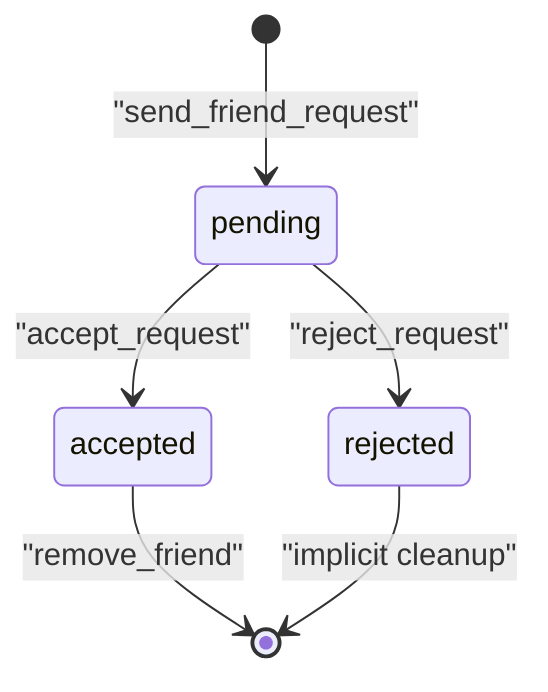
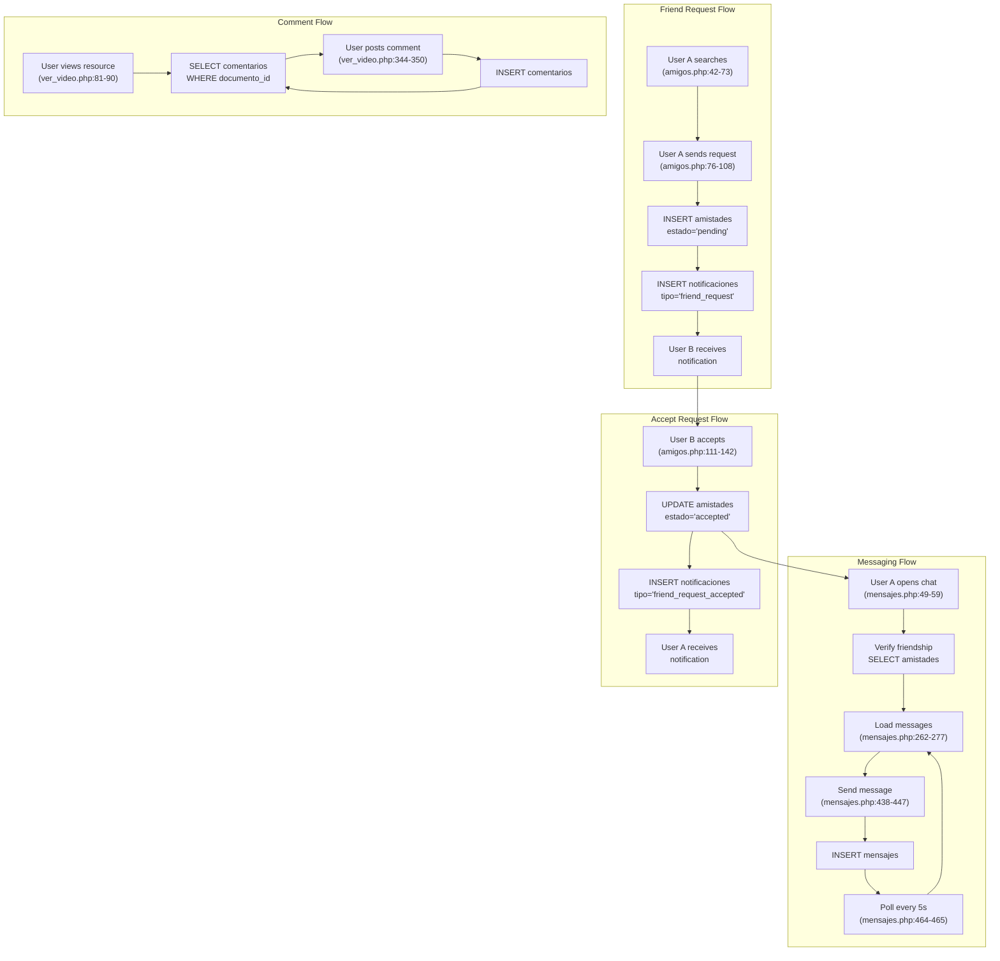

# Social and Community Tables

> **Relevant source files**
> * [src/frontend/friends/amigos.php](https://github.com/axchisan/El-rincon-de-ADSO/blob/3e310227/src/frontend/friends/amigos.php)
> * [src/frontend/mensajes/mensajes.php](https://github.com/axchisan/El-rincon-de-ADSO/blob/3e310227/src/frontend/mensajes/mensajes.php)
> * [src/frontend/notificaciones/notificaciones.php](https://github.com/axchisan/El-rincon-de-ADSO/blob/3e310227/src/frontend/notificaciones/notificaciones.php)
> * [src/frontend/perfil/perfil.php](https://github.com/axchisan/El-rincon-de-ADSO/blob/3e310227/src/frontend/perfil/perfil.php)
> * [src/frontend/repositorio/ver_documento.php](https://github.com/axchisan/El-rincon-de-ADSO/blob/3e310227/src/frontend/repositorio/ver_documento.php)
> * [src/frontend/repositorio/ver_libro.php](https://github.com/axchisan/El-rincon-de-ADSO/blob/3e310227/src/frontend/repositorio/ver_libro.php)
> * [src/frontend/repositorio/ver_video.php](https://github.com/axchisan/El-rincon-de-ADSO/blob/3e310227/src/frontend/repositorio/ver_video.php)
> * [src/uploads/6813fb2b5aff5.pdf](https://github.com/axchisan/El-rincon-de-ADSO/blob/3e310227/src/uploads/6813fb2b5aff5.pdf)

This document describes the database tables that power the social networking and community engagement features of El Rincón de ADSO. These tables store friendships, messages, notifications, and comments on resources.

For information about user authentication tables, see [User and Authentication Tables](/axchisan/El-rincon-de-ADSO/10.1-user-and-authentication-tables). For resource-related tables, see [Resource and Content Tables](/axchisan/El-rincon-de-ADSO/10.2-resource-and-content-tables).

## Overview

The social and community subsystem consists of four primary tables that work together to enable user interaction:

* **`amistades`**: Manages friendship relationships between users
* **`mensajes`**: Stores chat messages between friends
* **`notificaciones`**: Tracks system notifications for user actions
* **`comentarios`**: Contains user comments on educational resources

These tables integrate with the `usuarios` table to track online status, profile information, and user identity.

## Table: amistades

The `amistades` table stores friendship relationships with a state-based workflow.

### Schema

| Column | Type | Description |
| --- | --- | --- |
| `id` | SERIAL | Primary key |
| `usuario_id` | INTEGER | User who initiated the friendship (FK → usuarios.id) |
| `amigo_id` | INTEGER | User who received the friendship request (FK → usuarios.id) |
| `estado` | VARCHAR | Friendship state: 'pending', 'accepted', 'rejected' |
| `fecha_creacion` | TIMESTAMP | Creation/update timestamp |

### Key Characteristics

* **Directional Relationship**: Friendships are stored directionally. When checking if two users are friends, queries must check both directions (`usuario_id = A AND amigo_id = B` OR `usuario_id = B AND amigo_id = A`)
* **State Machine**: Friendships transition through states: pending → accepted/rejected
* **Access Control**: Only users with `estado = 'accepted'` can message each other and view profiles

### State Transition Diagram



### Core Queries

**Search for non-friends** [src/frontend/friends/amigos.php L42-L65](https://github.com/axchisan/El-rincon-de-ADSO/blob/3e310227/src/frontend/friends/amigos.php#L42-L65)

:

```sql
SELECT id, nombre_usuario, correo, imagen 
FROM usuarios 
WHERE nombre_usuario ILIKE :search_term 
  AND id != :current_user_id 
  -- Exclude pending requests (both directions)
  AND id NOT IN (SELECT amigo_id FROM amistades WHERE usuario_id = :current_user_id AND estado = 'pending')
  AND id NOT IN (SELECT usuario_id FROM amistades WHERE amigo_id = :current_user_id AND estado = 'pending')
  -- Exclude accepted friends (both directions)
  AND id NOT IN (SELECT amigo_id FROM amistades WHERE usuario_id = :current_user_id AND estado = 'accepted')
  AND id NOT IN (SELECT usuario_id FROM amistades WHERE amigo_id = :current_user_id AND estado = 'accepted')
```

**Get pending requests** [src/frontend/friends/amigos.php L181-L187](https://github.com/axchisan/El-rincon-de-ADSO/blob/3e310227/src/frontend/friends/amigos.php#L181-L187)

:

```sql
SELECT a.id, a.usuario_id AS sender_id, u.nombre_usuario, u.correo, u.imagen 
FROM amistades a 
JOIN usuarios u ON a.usuario_id = u.id 
WHERE a.amigo_id = :user_id AND a.estado = 'pending'
```

**Get accepted friends** [src/frontend/friends/amigos.php L190-L197](https://github.com/axchisan/El-rincon-de-ADSO/blob/3e310227/src/frontend/friends/amigos.php#L190-L197)

:

```sql
SELECT u.id, u.nombre_usuario, u.correo, u.ultima_conexion, u.imagen 
FROM amistades a 
JOIN usuarios u ON (u.id = a.usuario_id OR u.id = a.amigo_id) 
WHERE ((a.usuario_id = :user_id AND u.id = a.amigo_id) 
    OR (a.amigo_id = :user_id AND u.id = a.usuario_id)) 
  AND a.estado = 'accepted'
```

**Verify friendship** [src/frontend/mensajes/mensajes.php L49-L59](https://github.com/axchisan/El-rincon-de-ADSO/blob/3e310227/src/frontend/mensajes/mensajes.php#L49-L59)

:

```sql
SELECT COUNT(*) 
FROM amistades 
WHERE ((usuario_id = :user_id AND amigo_id = :friend_id) 
       OR (usuario_id = :friend_id AND amigo_id = :user_id)) 
  AND estado = 'accepted'
```

Sources: [src/frontend/friends/amigos.php L42-L197](https://github.com/axchisan/El-rincon-de-ADSO/blob/3e310227/src/frontend/friends/amigos.php#L42-L197)

 [src/frontend/mensajes/mensajes.php L49-L59](https://github.com/axchisan/El-rincon-de-ADSO/blob/3e310227/src/frontend/mensajes/mensajes.php#L49-L59)

 [src/frontend/perfil/perfil.php L50-L66](https://github.com/axchisan/El-rincon-de-ADSO/blob/3e310227/src/frontend/perfil/perfil.php#L50-L66)

## Table: mensajes

The `mensajes` table stores private chat messages between friends.

### Schema

| Column | Type | Description |
| --- | --- | --- |
| `id` | SERIAL | Primary key |
| `remitente_id` | INTEGER | Sender user ID (FK → usuarios.id) |
| `destinatario_id` | INTEGER | Recipient user ID (FK → usuarios.id) |
| `contenido` | TEXT | Message content |
| `fecha_envio` | TIMESTAMP | Timestamp when message was sent |

### Key Characteristics

* **Friendship Requirement**: Messages can only be sent between users with `estado = 'accepted'` in `amistades`
* **Bidirectional Storage**: Messages are stored once with explicit sender/receiver fields
* **Edit/Delete**: Only the sender (`remitente_id`) can edit or delete their own messages
* **Real-time Polling**: Frontend polls every 5 seconds for new messages [src/frontend/mensajes/mensajes.php L464-L465](https://github.com/axchisan/El-rincon-de-ADSO/blob/3e310227/src/frontend/mensajes/mensajes.php#L464-L465)

### Message Operations

The messaging system supports three operations through the API:

1. **GET**: Retrieve messages between current user and a friend
2. **POST**: Send a new message
3. **PUT**: Edit an existing message (sender only)
4. **DELETE**: Delete a message (sender only)

**Load messages** [src/frontend/mensajes/mensajes.php L262-L277](https://github.com/axchisan/El-rincon-de-ADSO/blob/3e310227/src/frontend/mensajes/mensajes.php#L262-L277)

:

```javascript
const response = await fetch(`../../backend/api/mensajes.php?friend_id=${friendId}`);
const result = await response.json();
```

**Send message** [src/frontend/mensajes/mensajes.php L438-L447](https://github.com/axchisan/El-rincon-de-ADSO/blob/3e310227/src/frontend/mensajes/mensajes.php#L438-L447)

:

```javascript
const response = await fetch('../../backend/api/mensajes.php', {
  method: 'POST',
  headers: { 'Content-Type': 'application/json' },
  body: JSON.stringify({ friend_id: friendId, content: content })
});
```

**Edit message** [src/frontend/mensajes/mensajes.php L369-L378](https://github.com/axchisan/El-rincon-de-ADSO/blob/3e310227/src/frontend/mensajes/mensajes.php#L369-L378)

:

```javascript
const response = await fetch('../../backend/api/mensajes.php', {
  method: 'PUT',
  headers: { 'Content-Type': 'application/json' },
  body: JSON.stringify({ message_id: messageId, content: newContent })
});
```

**Delete message** [src/frontend/mensajes/mensajes.php L405-L413](https://github.com/axchisan/El-rincon-de-ADSO/blob/3e310227/src/frontend/mensajes/mensajes.php#L405-L413)

:

```javascript
const response = await fetch('../../backend/api/mensajes.php', {
  method: 'DELETE',
  headers: { 'Content-Type': 'application/json' },
  body: JSON.stringify({ message_id: messageId })
});
```

Sources: [src/frontend/mensajes/mensajes.php L262-L482](https://github.com/axchisan/El-rincon-de-ADSO/blob/3e310227/src/frontend/mensajes/mensajes.php#L262-L482)

## Table: notificaciones

The `notificaciones` table stores system-generated notifications for user activities.

### Schema

| Column | Type | Description |
| --- | --- | --- |
| `id` | SERIAL | Primary key |
| `usuario_id` | INTEGER | User receiving the notification (FK → usuarios.id) |
| `tipo` | VARCHAR | Notification type: 'friend_request', 'friend_request_accepted', 'message' |
| `relacionado_id` | INTEGER | ID of related entity (e.g., sender's user_id) |
| `mensaje` | TEXT | Notification message text |
| `leida` | BOOLEAN | Read status (default: FALSE) |
| `fecha_creacion` | TIMESTAMP | Creation timestamp |

### Notification Types

| Type | Triggered When | Example Message |
| --- | --- | --- |
| `friend_request` | User sends friend request | "Tienes una nueva solicitud de amistad de {sender_name}." |
| `friend_request_accepted` | User accepts friend request | "{receiver_name} ha aceptado tu solicitud de amistad." |
| `message` | User receives a message | Notification of new message (inferred from context) |

### Key Operations

**Create notification for friend request** [src/frontend/friends/amigos.php L96-L103](https://github.com/axchisan/El-rincon-de-ADSO/blob/3e310227/src/frontend/friends/amigos.php#L96-L103)

:

```sql
INSERT INTO notificaciones (usuario_id, tipo, relacionado_id, mensaje) 
VALUES (:receiver_id, 'friend_request', :sender_id, :message)
```

**Create notification for accepted request** [src/frontend/friends/amigos.php L131-L138](https://github.com/axchisan/El-rincon-de-ADSO/blob/3e310227/src/frontend/friends/amigos.php#L131-L138)

:

```sql
INSERT INTO notificaciones (usuario_id, tipo, relacionado_id, mensaje) 
VALUES (:sender_id, 'friend_request_accepted', :receiver_id, :message)
```

**Count unread notifications** [src/frontend/friends/amigos.php L33-L36](https://github.com/axchisan/El-rincon-de-ADSO/blob/3e310227/src/frontend/friends/amigos.php#L33-L36)

:

```sql
SELECT COUNT(*) 
FROM notificaciones 
WHERE usuario_id = :user_id AND leida = FALSE
```

**Real-time Polling**: The notification system polls every 5 seconds [src/frontend/notificaciones/notificaciones.php L281-L282](https://github.com/axchisan/El-rincon-de-ADSO/blob/3e310227/src/frontend/notificaciones/notificaciones.php#L281-L282)

:

```
loadNotifications();
setInterval(loadNotifications, 5000);
```

Sources: [src/frontend/friends/amigos.php L33-L138](https://github.com/axchisan/El-rincon-de-ADSO/blob/3e310227/src/frontend/friends/amigos.php#L33-L138)

 [src/frontend/notificaciones/notificaciones.php L139-L282](https://github.com/axchisan/El-rincon-de-ADSO/blob/3e310227/src/frontend/notificaciones/notificaciones.php#L139-L282)

## Table: comentarios

The `comentarios` table stores user comments on educational resources (documentos).

### Schema

| Column | Type | Description |
| --- | --- | --- |
| `id` | SERIAL | Primary key |
| `documento_id` | INTEGER | Resource being commented on (FK → documentos.id) |
| `autor_id` | INTEGER | User who wrote the comment (FK → usuarios.id) |
| `contenido` | TEXT | Comment text |
| `fecha_creacion` | TIMESTAMP | Creation timestamp |

### Key Characteristics

* **Resource Association**: Comments are always linked to a specific `documento_id`
* **Public Visibility**: Comments are visible to all users who can access the resource
* **Delete Permission**: Only the comment author can delete their own comments
* **No Editing**: The system does not support editing comments (only delete/recreate)
* **Ordering**: Comments are displayed in reverse chronological order (newest first)

### Core Queries

**Load comments for a resource** [src/frontend/repositorio/ver_video.php L81-L90](https://github.com/axchisan/El-rincon-de-ADSO/blob/3e310227/src/frontend/repositorio/ver_video.php#L81-L90)

:

```sql
SELECT c.*, u.nombre_usuario
FROM comentarios c
JOIN usuarios u ON c.autor_id = u.id
WHERE c.documento_id = :documento_id
ORDER BY c.fecha_creacion DESC
```

**Display logic** [src/frontend/repositorio/ver_video.php L362-L387](https://github.com/axchisan/El-rincon-de-ADSO/blob/3e310227/src/frontend/repositorio/ver_video.php#L362-L387)

:

* Authenticated users see a comment form
* Each comment shows author name and creation date
* Comment authors see a delete button
* Users must be logged in to comment [src/frontend/repositorio/ver_video.php L342-L360](https://github.com/axchisan/El-rincon-de-ADSO/blob/3e310227/src/frontend/repositorio/ver_video.php#L342-L360)

Sources: [src/frontend/repositorio/ver_video.php L81-L387](https://github.com/axchisan/El-rincon-de-ADSO/blob/3e310227/src/frontend/repositorio/ver_video.php#L81-L387)

 [src/frontend/repositorio/ver_documento.php L86-L387](https://github.com/axchisan/El-rincon-de-ADSO/blob/3e310227/src/frontend/repositorio/ver_documento.php#L86-L387)

 [src/frontend/repositorio/ver_libro.php L81-L368](https://github.com/axchisan/El-rincon-de-ADSO/blob/3e310227/src/frontend/repositorio/ver_libro.php#L81-L368)

## Related Usuario Fields

The `usuarios` table contains several fields critical to social features:

| Field | Type | Purpose |
| --- | --- | --- |
| `imagen` | VARCHAR | Path to user's profile image |
| `ultima_conexion` | TIMESTAMP | Last activity timestamp for online status |
| `telefono` | VARCHAR | Phone number (visible to friends) |
| `profesion` | VARCHAR | Profession/occupation (visible to friends) |
| `bio` | TEXT | User biography (visible to friends) |

### Online Status Logic

The system determines if a user is "online" based on `ultima_conexion`:

**Online Status Function** [src/frontend/friends/amigos.php L200-L216](https://github.com/axchisan/El-rincon-de-ADSO/blob/3e310227/src/frontend/friends/amigos.php#L200-L216)

:

```javascript
function getOnlineStatus($lastConnection) {
  if (is_null($lastConnection)) {
    return ['is_online' => false, 'status_text' => 'Última conexión: Desconocida'];
  }
  
  $lastConnectionTime = new DateTime($lastConnection);
  $currentTime = new DateTime();
  $interval = $currentTime->diff($lastConnectionTime);
  $minutes = $interval->days * 24 * 60 + $interval->h * 60 + $interval->i;
  
  if ($minutes <= 5) {
    return ['is_online' => true, 'status_text' => 'En línea'];
  } else {
    $formattedTime = $lastConnectionTime->format('d/m/Y H:i');
    return ['is_online' => false, 'status_text' => "Última conexión: $formattedTime"];
  }
}
```

**Threshold**: Users are considered online if their `ultima_conexion` is within 5 minutes of current time.

Sources: [src/frontend/friends/amigos.php L200-L216](https://github.com/axchisan/El-rincon-de-ADSO/blob/3e310227/src/frontend/friends/amigos.php#L200-L216)

 [src/frontend/perfil/perfil.php L91-L107](https://github.com/axchisan/El-rincon-de-ADSO/blob/3e310227/src/frontend/perfil/perfil.php#L91-L107)

## Entity Relationship Diagram

```css
#mermaid-52yi5qaa65u{font-family:ui-sans-serif,-apple-system,system-ui,Segoe UI,Helvetica;font-size:16px;fill:#333;}@keyframes edge-animation-frame{from{stroke-dashoffset:0;}}@keyframes dash{to{stroke-dashoffset:0;}}#mermaid-52yi5qaa65u .edge-animation-slow{stroke-dasharray:9,5!important;stroke-dashoffset:900;animation:dash 50s linear infinite;stroke-linecap:round;}#mermaid-52yi5qaa65u .edge-animation-fast{stroke-dasharray:9,5!important;stroke-dashoffset:900;animation:dash 20s linear infinite;stroke-linecap:round;}#mermaid-52yi5qaa65u .error-icon{fill:#dddddd;}#mermaid-52yi5qaa65u .error-text{fill:#222222;stroke:#222222;}#mermaid-52yi5qaa65u .edge-thickness-normal{stroke-width:1px;}#mermaid-52yi5qaa65u .edge-thickness-thick{stroke-width:3.5px;}#mermaid-52yi5qaa65u .edge-pattern-solid{stroke-dasharray:0;}#mermaid-52yi5qaa65u .edge-thickness-invisible{stroke-width:0;fill:none;}#mermaid-52yi5qaa65u .edge-pattern-dashed{stroke-dasharray:3;}#mermaid-52yi5qaa65u .edge-pattern-dotted{stroke-dasharray:2;}#mermaid-52yi5qaa65u .marker{fill:#999;stroke:#999;}#mermaid-52yi5qaa65u .marker.cross{stroke:#999;}#mermaid-52yi5qaa65u svg{font-family:ui-sans-serif,-apple-system,system-ui,Segoe UI,Helvetica;font-size:16px;}#mermaid-52yi5qaa65u p{margin:0;}#mermaid-52yi5qaa65u .entityBox{fill:#ffffff;stroke:#dddddd;}#mermaid-52yi5qaa65u .relationshipLabelBox{fill:#dddddd;opacity:0.7;background-color:#dddddd;}#mermaid-52yi5qaa65u .relationshipLabelBox rect{opacity:0.5;}#mermaid-52yi5qaa65u .labelBkg{background-color:rgba(221, 221, 221, 0.5);}#mermaid-52yi5qaa65u .edgeLabel .label{fill:#dddddd;font-size:14px;}#mermaid-52yi5qaa65u .label{font-family:ui-sans-serif,-apple-system,system-ui,Segoe UI,Helvetica;color:#333;}#mermaid-52yi5qaa65u .edge-pattern-dashed{stroke-dasharray:8,8;}#mermaid-52yi5qaa65u .node rect,#mermaid-52yi5qaa65u .node circle,#mermaid-52yi5qaa65u .node ellipse,#mermaid-52yi5qaa65u .node polygon{fill:#ffffff;stroke:#dddddd;stroke-width:1px;}#mermaid-52yi5qaa65u .relationshipLine{stroke:#999;stroke-width:1;fill:none;}#mermaid-52yi5qaa65u .marker{fill:none!important;stroke:#999!important;stroke-width:1;}#mermaid-52yi5qaa65u :root{--mermaid-font-family:"trebuchet ms",verdana,arial,sans-serif;}initiatesreceivessendsreceivesreceivesauthorshasusuariosintidPKvarcharnombre_usuariovarcharcorreovarcharimagentimestampultima_conexionvarchartelefonovarcharprofesiontextbioamistadesintidPKintusuario_idFKintamigo_idFKvarcharestadotimestampfecha_creacionmensajesintidPKintremitente_idFKintdestinatario_idFKtextcontenidotimestampfecha_envionotificacionesintidPKintusuario_idFKvarchartipointrelacionado_idtextmensajebooleanleidatimestampfecha_creacioncomentariosintidPKintdocumento_idFKintautor_idFKtextcontenidotimestampfecha_creaciondocumentosintidPKvarchartitulo
```

Sources: All tables referenced throughout this document

## Social Features Data Flow

This diagram shows how the social tables interact during common operations:



Sources: [src/frontend/friends/amigos.php L42-L197](https://github.com/axchisan/El-rincon-de-ADSO/blob/3e310227/src/frontend/friends/amigos.php#L42-L197)

 [src/frontend/mensajes/mensajes.php L49-L482](https://github.com/axchisan/El-rincon-de-ADSO/blob/3e310227/src/frontend/mensajes/mensajes.php#L49-L482)

 [src/frontend/repositorio/ver_video.php L81-L387](https://github.com/axchisan/El-rincon-de-ADSO/blob/3e310227/src/frontend/repositorio/ver_video.php#L81-L387)

## Access Control Patterns

The social system implements several access control patterns:

### Friendship-Based Access

Multiple features require an accepted friendship:

**Profile Viewing** [src/frontend/perfil/perfil.php L50-L66](https://github.com/axchisan/El-rincon-de-ADSO/blob/3e310227/src/frontend/perfil/perfil.php#L50-L66)

:

* Users can only view profiles of accepted friends
* Redirect to `amigos.php` if not friends

**Messaging** [src/frontend/mensajes/mensajes.php L49-L65](https://github.com/axchisan/El-rincon-de-ADSO/blob/3e310227/src/frontend/mensajes/mensajes.php#L49-L65)

:

* Users can only message accepted friends
* Friendship verified before loading chat interface

**Online Status** [src/frontend/friends/amigos.php L190-L216](https://github.com/axchisan/El-rincon-de-ADSO/blob/3e310227/src/frontend/friends/amigos.php#L190-L216)

:

* `ultima_conexion` visible only to friends
* Online status calculated from timestamp

### Ownership-Based Access

**Comment Deletion** [src/frontend/repositorio/ver_video.php L378-L384](https://github.com/axchisan/El-rincon-de-ADSO/blob/3e310227/src/frontend/repositorio/ver_video.php#L378-L384)

:

```php
<?php if ($usuario_id == $comentario['autor_id']): ?>
  <div class="comment__actions">
    <button class="btn-delete-comment" data-id="<?php echo $comentario['id']; ?>">
      <i class="fas fa-trash-alt"></i> Eliminar
    </button>
  </div>
<?php endif; ?>
```

**Message Edit/Delete** [src/frontend/mensajes/mensajes.php L299-L309](https://github.com/axchisan/El-rincon-de-ADSO/blob/3e310227/src/frontend/mensajes/mensajes.php#L299-L309)

:

```html
${message.remitente_id == userId ? `
  <div class="message__actions">
    <button class="message__action-btn message__edit-btn">Editar</button>
    <button class="message__action-btn message__delete-btn">Borrar</button>
  </div>
` : ''}
```

Sources: [src/frontend/perfil/perfil.php L50-L66](https://github.com/axchisan/El-rincon-de-ADSO/blob/3e310227/src/frontend/perfil/perfil.php#L50-L66)

 [src/frontend/mensajes/mensajes.php L49-L427](https://github.com/axchisan/El-rincon-de-ADSO/blob/3e310227/src/frontend/mensajes/mensajes.php#L49-L427)

 [src/frontend/repositorio/ver_video.php L378-L384](https://github.com/axchisan/El-rincon-de-ADSO/blob/3e310227/src/frontend/repositorio/ver_video.php#L378-L384)

## API Integration

The social features use backend APIs for dynamic operations:

| API Endpoint | Methods | Purpose | Polling Interval |
| --- | --- | --- | --- |
| `backend/api/mensajes.php` | GET, POST, PUT, DELETE | Manage chat messages | 5 seconds |
| `backend/api/notificaciones.php` | GET, POST | Retrieve and mark notifications | 5 seconds |

### API Response Format

Both APIs follow a consistent JSON response structure:

```
{
  "status": "success" | "error",
  "message": "Human-readable message",
  "data": { ... }
}
```

**Notifications API Response** [src/frontend/notificaciones/notificaciones.php L139-L150](https://github.com/axchisan/El-rincon-de-ADSO/blob/3e310227/src/frontend/notificaciones/notificaciones.php#L139-L150)

:

```json
{
  "status": "success",
  "data": {
    "notifications": [
      {
        "id": 123,
        "tipo": "friend_request",
        "mensaje": "Tienes una nueva solicitud...",
        "fecha_creacion": "2024-01-15 10:30:00",
        "leida": false
      }
    ],
    "unread_count": 5
  }
}
```

**Messages API Response** [src/frontend/mensajes/mensajes.php L262-L276](https://github.com/axchisan/El-rincon-de-ADSO/blob/3e310227/src/frontend/mensajes/mensajes.php#L262-L276)

:

```json
{
  "status": "success",
  "data": [
    {
      "id": 456,
      "remitente_id": 10,
      "contenido": "Hello!",
      "fecha_envio": "2024-01-15 11:00:00"
    }
  ]
}
```

Sources: [src/frontend/notificaciones/notificaciones.php L139-L215](https://github.com/axchisan/El-rincon-de-ADSO/blob/3e310227/src/frontend/notificaciones/notificaciones.php#L139-L215)

 [src/frontend/mensajes/mensajes.php L262-L328](https://github.com/axchisan/El-rincon-de-ADSO/blob/3e310227/src/frontend/mensajes/mensajes.php#L262-L328)

## Database Indexes (Recommended)

While not explicitly visible in the provided code, the following indexes should exist for optimal performance:

```go
-- Amistades lookups (bidirectional queries)
CREATE INDEX idx_amistades_usuario ON amistades(usuario_id, estado);
CREATE INDEX idx_amistades_amigo ON amistades(amigo_id, estado);

-- Message queries
CREATE INDEX idx_mensajes_remitente ON mensajes(remitente_id, fecha_envio);
CREATE INDEX idx_mensajes_destinatario ON mensajes(destinatario_id, fecha_envio);

-- Notification queries
CREATE INDEX idx_notificaciones_usuario ON notificaciones(usuario_id, leida);
CREATE INDEX idx_notificaciones_fecha ON notificaciones(fecha_creacion DESC);

-- Comment queries
CREATE INDEX idx_comentarios_documento ON comentarios(documento_id, fecha_creacion DESC);
CREATE INDEX idx_comentarios_autor ON comentarios(autor_id);

-- Online status queries
CREATE INDEX idx_usuarios_ultima_conexion ON usuarios(ultima_conexion);
```

These indexes support the frequent bidirectional friendship lookups, message retrieval ordered by time, unread notification counts, and comment display patterns observed in the codebase.