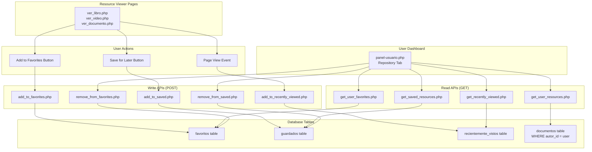
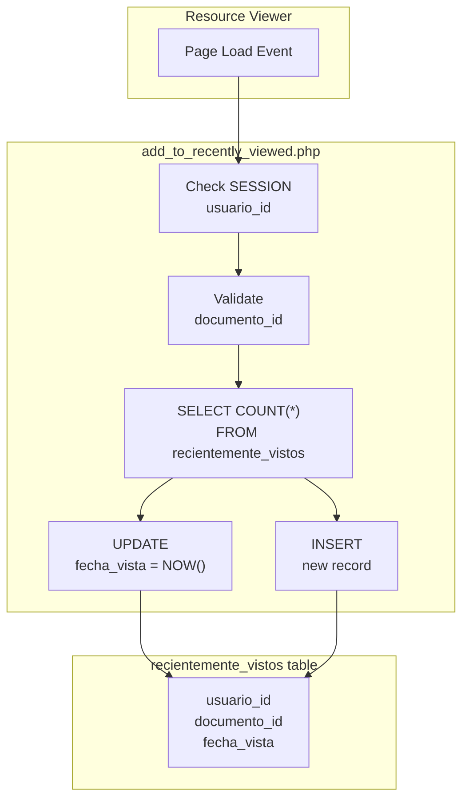
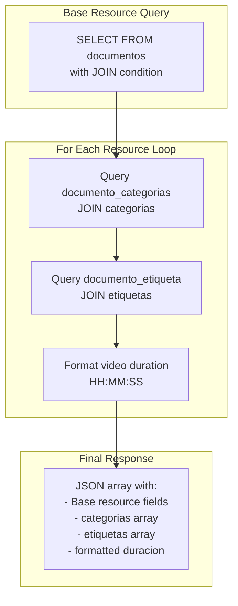

# User Collections and Tracking

> **Relevant source files**
> * [src/backend/gestionRecursos/add_to_favorites.php](https://github.com/axchisan/El-rincon-de-ADSO/blob/3e310227/src/backend/gestionRecursos/add_to_favorites.php)
> * [src/backend/gestionRecursos/add_to_recently_viewed.php](https://github.com/axchisan/El-rincon-de-ADSO/blob/3e310227/src/backend/gestionRecursos/add_to_recently_viewed.php)
> * [src/backend/gestionRecursos/add_to_saved.php](https://github.com/axchisan/El-rincon-de-ADSO/blob/3e310227/src/backend/gestionRecursos/add_to_saved.php)
> * [src/backend/gestionRecursos/get_recently_viewed.php](https://github.com/axchisan/El-rincon-de-ADSO/blob/3e310227/src/backend/gestionRecursos/get_recently_viewed.php)
> * [src/backend/gestionRecursos/get_saved_resources.php](https://github.com/axchisan/El-rincon-de-ADSO/blob/3e310227/src/backend/gestionRecursos/get_saved_resources.php)
> * [src/backend/gestionRecursos/get_user_favorites.php](https://github.com/axchisan/El-rincon-de-ADSO/blob/3e310227/src/backend/gestionRecursos/get_user_favorites.php)
> * [src/backend/gestionRecursos/get_user_resources.php](https://github.com/axchisan/El-rincon-de-ADSO/blob/3e310227/src/backend/gestionRecursos/get_user_resources.php)
> * [src/backend/gestionRecursos/remove_from_favorites.php](https://github.com/axchisan/El-rincon-de-ADSO/blob/3e310227/src/backend/gestionRecursos/remove_from_favorites.php)
> * [src/backend/gestionRecursos/remove_from_saved.php](https://github.com/axchisan/El-rincon-de-ADSO/blob/3e310227/src/backend/gestionRecursos/remove_from_saved.php)

## Purpose and Scope

This document describes the user collections and tracking system in El Rincón de ADSO, which enables authenticated users to organize and track their interactions with educational resources. The system maintains four distinct collections per user:

1. **Favorites** - Resources explicitly marked as favorites
2. **Saved Resources** - Resources saved for later viewing
3. **Recently Viewed** - Automatic tracking of viewed resources
4. **User Uploads** - Resources uploaded by the user

For information about browsing the general repository, see [Repository Browser](/axchisan/El-rincon-de-ADSO/5.1-repository-browser). For details on uploading new resources, see [Resource Upload and Validation](/axchisan/El-rincon-de-ADSO/5.3-resource-upload-and-validation). For viewing individual resources, see [Resource Viewers](/axchisan/El-rincon-de-ADSO/5.2-resource-viewers).

---

## System Overview

The collections system provides backend APIs for managing user-specific resource lists. All endpoints require authentication via `$_SESSION['usuario_id']` and return JSON responses. Each collection type has dedicated database tables and API endpoints.

### Collection Types Comparison

| Collection Type | Database Table | Primary Use Case | Auto-Populated | Removable |
| --- | --- | --- | --- | --- |
| Favorites | `favoritos` | Long-term bookmarks | No | Yes |
| Saved Resources | `guardados` | Save for later | No | Yes |
| Recently Viewed | `recientemente_vistos` | View history | Yes | No |
| User Uploads | `documentos` | Own contributions | By upload | By delete |

**Sources:** [src/backend/gestionRecursos/get_user_favorites.php L1-L81](https://github.com/axchisan/El-rincon-de-ADSO/blob/3e310227/src/backend/gestionRecursos/get_user_favorites.php#L1-L81)

 [src/backend/gestionRecursos/get_saved_resources.php L1-L81](https://github.com/axchisan/El-rincon-de-ADSO/blob/3e310227/src/backend/gestionRecursos/get_saved_resources.php#L1-L81)

 [src/backend/gestionRecursos/get_recently_viewed.php L1-L81](https://github.com/axchisan/El-rincon-de-ADSO/blob/3e310227/src/backend/gestionRecursos/get_recently_viewed.php#L1-L81)

 [src/backend/gestionRecursos/get_user_resources.php L1-L75](https://github.com/axchisan/El-rincon-de-ADSO/blob/3e310227/src/backend/gestionRecursos/get_user_resources.php#L1-L75)

---

## API Endpoint Architecture

### Collection Management Flow



**Sources:** [src/backend/gestionRecursos/add_to_favorites.php L1-L34](https://github.com/axchisan/El-rincon-de-ADSO/blob/3e310227/src/backend/gestionRecursos/add_to_favorites.php#L1-L34)

 [src/backend/gestionRecursos/add_to_saved.php L1-L46](https://github.com/axchisan/El-rincon-de-ADSO/blob/3e310227/src/backend/gestionRecursos/add_to_saved.php#L1-L46)

 [src/backend/gestionRecursos/add_to_recently_viewed.php L1-L50](https://github.com/axchisan/El-rincon-de-ADSO/blob/3e310227/src/backend/gestionRecursos/add_to_recently_viewed.php#L1-L50)

 [src/backend/gestionRecursos/remove_from_favorites.php L1-L30](https://github.com/axchisan/El-rincon-de-ADSO/blob/3e310227/src/backend/gestionRecursos/remove_from_favorites.php#L1-L30)

 [src/backend/gestionRecursos/remove_from_saved.php L1-L30](https://github.com/axchisan/El-rincon-de-ADSO/blob/3e310227/src/backend/gestionRecursos/remove_from_saved.php#L1-L30)

---

## Favorites System

### Adding to Favorites

The `add_to_favorites.php` endpoint allows users to bookmark resources for long-term reference.

**Endpoint:** `src/backend/gestionRecursos/add_to_favorites.php`

**Method:** POST

**Parameters:**

* `documento_id` (required) - Resource identifier

**Authentication:** Requires `$_SESSION['usuario_id']` [src/backend/gestionRecursos/add_to_favorites.php L7-L10](https://github.com/axchisan/El-rincon-de-ADSO/blob/3e310227/src/backend/gestionRecursos/add_to_favorites.php#L7-L10)

**Logic Flow:**

1. Validates user session and POST data
2. Checks for duplicate entry in `favoritos` table [src/backend/gestionRecursos/add_to_favorites.php L17-L23](https://github.com/axchisan/El-rincon-de-ADSO/blob/3e310227/src/backend/gestionRecursos/add_to_favorites.php#L17-L23)
3. Inserts new record with `NOW()` timestamp for `fecha_agregado` [src/backend/gestionRecursos/add_to_favorites.php L26-L28](https://github.com/axchisan/El-rincon-de-ADSO/blob/3e310227/src/backend/gestionRecursos/add_to_favorites.php#L26-L28)

**Response:**

```json
{
  "success": true,
  "message": "Recurso añadido a favoritos"
}
```

### Retrieving Favorites

The `get_user_favorites.php` endpoint returns all favorited resources for the authenticated user.

**Endpoint:** `src/backend/gestionRecursos/get_user_favorites.php`

**Method:** GET (session-based)

**Query Details:**

The main query joins `documentos` with `favoritos` table [src/backend/gestionRecursos/get_user_favorites.php L17-L23](https://github.com/axchisan/El-rincon-de-ADSO/blob/3e310227/src/backend/gestionRecursos/get_user_favorites.php#L17-L23)

:

```sql
SELECT d.id, d.titulo, d.descripcion, d.autor, d.tipo, d.url_archivo, d.portada, 
       d.duracion, d.fecha_publicacion, d.relevancia, d.visibilidad, d.idioma, 
       d.licencia, d.estado, f.fecha_agregado
FROM documentos d
JOIN favoritos f ON d.id = f.documento_id
WHERE f.usuario_id = :usuario_id
ORDER BY f.fecha_agregado DESC
```

**Enrichment Process:**

For each resource, the API performs additional queries to attach:

* **Categories:** Via `documento_categorias` and `categorias` tables [src/backend/gestionRecursos/get_user_favorites.php L31-L44](https://github.com/axchisan/El-rincon-de-ADSO/blob/3e310227/src/backend/gestionRecursos/get_user_favorites.php#L31-L44)
* **Tags:** Via `documento_etiqueta` and `etiquetas` tables [src/backend/gestionRecursos/get_user_favorites.php L47-L54](https://github.com/axchisan/El-rincon-de-ADSO/blob/3e310227/src/backend/gestionRecursos/get_user_favorites.php#L47-L54)
* **Duration Formatting:** For video resources, converts PostgreSQL interval to `HH:MM:SS` format [src/backend/gestionRecursos/get_user_favorites.php L57-L73](https://github.com/axchisan/El-rincon-de-ADSO/blob/3e310227/src/backend/gestionRecursos/get_user_favorites.php#L57-L73)

### Removing from Favorites

**Endpoint:** `src/backend/gestionRecursos/remove_from_favorites.php`

**Method:** POST

**Parameters:**

* `documento_id` (required)

**Operation:** Executes DELETE from `favoritos` table [src/backend/gestionRecursos/remove_from_favorites.php L18-L20](https://github.com/axchisan/El-rincon-de-ADSO/blob/3e310227/src/backend/gestionRecursos/remove_from_favorites.php#L18-L20)

**Sources:** [src/backend/gestionRecursos/add_to_favorites.php L1-L34](https://github.com/axchisan/El-rincon-de-ADSO/blob/3e310227/src/backend/gestionRecursos/add_to_favorites.php#L1-L34)

 [src/backend/gestionRecursos/get_user_favorites.php L1-L81](https://github.com/axchisan/El-rincon-de-ADSO/blob/3e310227/src/backend/gestionRecursos/get_user_favorites.php#L1-L81)

 [src/backend/gestionRecursos/remove_from_favorites.php L1-L30](https://github.com/axchisan/El-rincon-de-ADSO/blob/3e310227/src/backend/gestionRecursos/remove_from_favorites.php#L1-L30)

---

## Saved Resources System

The saved resources system provides a "save for later" functionality, separate from favorites to allow users to maintain two distinct organizational collections.

### Database Table Structure

| Column | Type | Purpose |
| --- | --- | --- |
| `usuario_id` | Foreign Key | References `usuarios` table |
| `documento_id` | Foreign Key | References `documentos` table |
| `fecha_guardado` | Timestamp | When resource was saved |

### Adding to Saved

**Endpoint:** `src/backend/gestionRecursos/add_to_saved.php`

**Validation Steps:**

1. Session authentication check [src/backend/gestionRecursos/add_to_saved.php L7-L10](https://github.com/axchisan/El-rincon-de-ADSO/blob/3e310227/src/backend/gestionRecursos/add_to_saved.php#L7-L10)
2. POST method verification [src/backend/gestionRecursos/add_to_saved.php L12-L15](https://github.com/axchisan/El-rincon-de-ADSO/blob/3e310227/src/backend/gestionRecursos/add_to_saved.php#L12-L15)
3. Duplicate check in `guardados` table [src/backend/gestionRecursos/add_to_saved.php L27-L35](https://github.com/axchisan/El-rincon-de-ADSO/blob/3e310227/src/backend/gestionRecursos/add_to_saved.php#L27-L35)
4. Insert with `CURRENT_TIMESTAMP` for `fecha_guardado` [src/backend/gestionRecursos/add_to_saved.php L37-L40](https://github.com/axchisan/El-rincon-de-ADSO/blob/3e310227/src/backend/gestionRecursos/add_to_saved.php#L37-L40)

### Retrieving Saved Resources

**Endpoint:** `src/backend/gestionRecursos/get_saved_resources.php`

The implementation is nearly identical to `get_user_favorites.php` but queries the `guardados` table instead [src/backend/gestionRecursos/get_saved_resources.php L17-L23](https://github.com/axchisan/El-rincon-de-ADSO/blob/3e310227/src/backend/gestionRecursos/get_saved_resources.php#L17-L23)

:

```sql
SELECT d.id, d.titulo, d.descripcion, d.autor, d.tipo, d.url_archivo, d.portada, 
       d.duracion, d.fecha_publicacion, d.relevancia, d.visibilidad, d.idioma, 
       d.licencia, d.estado, s.fecha_guardado
FROM documentos d
JOIN guardados s ON d.id = s.documento_id
WHERE s.usuario_id = :usuario_id
ORDER BY s.fecha_guardado DESC
```

### Removing from Saved

**Endpoint:** `src/backend/gestionRecursos/remove_from_saved.php`

Executes DELETE operation on `guardados` table [src/backend/gestionRecursos/remove_from_saved.php L18-L20](https://github.com/axchisan/El-rincon-de-ADSO/blob/3e310227/src/backend/gestionRecursos/remove_from_saved.php#L18-L20)

**Sources:** [src/backend/gestionRecursos/add_to_saved.php L1-L46](https://github.com/axchisan/El-rincon-de-ADSO/blob/3e310227/src/backend/gestionRecursos/add_to_saved.php#L1-L46)

 [src/backend/gestionRecursos/get_saved_resources.php L1-L81](https://github.com/axchisan/El-rincon-de-ADSO/blob/3e310227/src/backend/gestionRecursos/get_saved_resources.php#L1-L81)

 [src/backend/gestionRecursos/remove_from_saved.php L1-L30](https://github.com/axchisan/El-rincon-de-ADSO/blob/3e310227/src/backend/gestionRecursos/remove_from_saved.php#L1-L30)

---

## Recently Viewed Tracking

The recently viewed system automatically tracks user viewing history without explicit user action. This provides an automatic "continue watching/reading" feature.

### Automatic Tracking Mechanism



**Sources:** [src/backend/gestionRecursos/add_to_recently_viewed.php L1-L50](https://github.com/axchisan/El-rincon-de-ADSO/blob/3e310227/src/backend/gestionRecursos/add_to_recently_viewed.php#L1-L50)

### Recording a View

**Endpoint:** `src/backend/gestionRecursos/add_to_recently_viewed.php`

**Method:** POST

**Parameters:**

* `documento_id` (required)

**Upsert Logic:**

The endpoint implements an upsert pattern [src/backend/gestionRecursos/add_to_recently_viewed.php L28-L44](https://github.com/axchisan/El-rincon-de-ADSO/blob/3e310227/src/backend/gestionRecursos/add_to_recently_viewed.php#L28-L44)

:

1. Checks if record exists for this user-document pair
2. If exists: Updates `fecha_vista` to `CURRENT_TIMESTAMP`
3. If not exists: Inserts new record with `CURRENT_TIMESTAMP`

This approach ensures:

* No duplicate entries per user-document combination
* Most recent view timestamp is always current
* View history remains accurate without manual cleanup

### Retrieving Recently Viewed

**Endpoint:** `src/backend/gestionRecursos/get_recently_viewed.php`

**Query:** Joins `recientemente_vistos` with `documentos` and limits to 10 most recent [src/backend/gestionRecursos/get_recently_viewed.php L17-L24](https://github.com/axchisan/El-rincon-de-ADSO/blob/3e310227/src/backend/gestionRecursos/get_recently_viewed.php#L17-L24)

:

```sql
SELECT d.id, d.titulo, d.descripcion, d.autor, d.tipo, d.url_archivo, d.portada, 
       d.duracion, d.fecha_publicacion, d.relevancia, d.visibilidad, d.idioma, 
       d.licencia, d.estado, rv.fecha_vista
FROM documentos d
JOIN recientemente_vistos rv ON d.id = rv.documento_id
WHERE rv.usuario_id = :usuario_id
ORDER BY rv.fecha_vista DESC
LIMIT 10
```

**Key Differences from Other Collection APIs:**

* Includes `rv.fecha_vista` timestamp in response
* Limited to 10 most recent items
* No removal endpoint (automatic collection only)

**Sources:** [src/backend/gestionRecursos/add_to_recently_viewed.php L1-L50](https://github.com/axchisan/El-rincon-de-ADSO/blob/3e310227/src/backend/gestionRecursos/add_to_recently_viewed.php#L1-L50)

 [src/backend/gestionRecursos/get_recently_viewed.php L1-L82](https://github.com/axchisan/El-rincon-de-ADSO/blob/3e310227/src/backend/gestionRecursos/get_recently_viewed.php#L1-L82)

---

## User Uploaded Resources

The user resources endpoint retrieves all documents created by the authenticated user, regardless of publication status.

### Endpoint Details

**Endpoint:** `src/backend/gestionRecursos/get_user_resources.php`

**Query:** Filters `documentos` by `autor_id` [src/backend/gestionRecursos/get_user_resources.php L17-L22](https://github.com/axchisan/El-rincon-de-ADSO/blob/3e310227/src/backend/gestionRecursos/get_user_resources.php#L17-L22)

:

```sql
SELECT d.id, d.titulo, d.descripcion, d.autor, d.tipo, d.url_archivo, d.portada, 
       d.duracion, d.fecha_publicacion, d.relevancia, d.visibilidad, d.idioma, 
       d.licencia, d.estado
FROM documentos d
WHERE d.autor_id = :autor_id
ORDER BY d.fecha_publicacion DESC
```

**Notable Fields:**

* `estado` - Shows publication status (draft/pending/published)
* `visibilidad` - Shows access control settings
* `fecha_publicacion` - Used for chronological ordering

### Resource Enrichment Pattern

All four collection endpoints share an identical enrichment pattern for each resource returned:



**Sources:** [src/backend/gestionRecursos/get_user_resources.php L27-L68](https://github.com/axchisan/El-rincon-de-ADSO/blob/3e310227/src/backend/gestionRecursos/get_user_resources.php#L27-L68)

---

## Common Patterns Across Collection APIs

### Shared Implementation Details

All four `get_*` endpoints follow identical patterns for consistency:

#### 1. Session Validation

```php
if (!isset($_SESSION['usuario_id'])) {
    echo json_encode([]);
    exit;
}
```

Returns empty array instead of error for unauthenticated requests [src/backend/gestionRecursos/get_user_favorites.php L7-L10](https://github.com/axchisan/El-rincon-de-ADSO/blob/3e310227/src/backend/gestionRecursos/get_user_favorites.php#L7-L10)

#### 2. Category Retrieval

```sql
SELECT c.nombre 
FROM documento_categorias dc
JOIN categorias c ON dc.categoria_id = c.id
WHERE dc.documento_id = :documento_id
```

Executed for each resource to populate `categorias` array [src/backend/gestionRecursos/get_user_favorites.php L31-L44](https://github.com/axchisan/El-rincon-de-ADSO/blob/3e310227/src/backend/gestionRecursos/get_user_favorites.php#L31-L44)

#### 3. Tag Retrieval

```sql
SELECT e.nombre 
FROM documento_etiqueta de
JOIN etiquetas e ON de.etiqueta_id = e.id
WHERE de.documento_id = :documento_id
```

Executed for each resource to populate `etiquetas` array [src/backend/gestionRecursos/get_user_favorites.php L47-L54](https://github.com/axchisan/El-rincon-de-ADSO/blob/3e310227/src/backend/gestionRecursos/get_user_favorites.php#L47-L54)

#### 4. Video Duration Formatting

For resources where `tipo === 'video'`, the PostgreSQL interval is converted [src/backend/gestionRecursos/get_user_favorites.php L57-L73](https://github.com/axchisan/El-rincon-de-ADSO/blob/3e310227/src/backend/gestionRecursos/get_user_favorites.php#L57-L73)

:

1. Parse interval string (e.g., "16:12:00")
2. Convert to total seconds
3. Reformat as `sprintf("%02d:%02d:%02d", $hours, $minutes, $seconds)`
4. Set to `null` for non-video resources

### Response Format Standardization

All collection endpoints return the same resource structure:

| Field | Type | Source | Notes |
| --- | --- | --- | --- |
| `id` | Integer | `documentos.id` | Resource identifier |
| `titulo` | String | `documentos.titulo` | Resource title |
| `descripcion` | Text | `documentos.descripcion` | Full description |
| `autor` | String | `documentos.autor` | Author name |
| `tipo` | String | `documentos.tipo` | "video", "libro", "documento" |
| `url_archivo` | String | `documentos.url_archivo` | File path or URL |
| `portada` | String | `documentos.portada` | Cover image path |
| `duracion` | String/null | Computed | "HH:MM:SS" for videos |
| `fecha_publicacion` | Timestamp | `documentos.fecha_publicacion` | Publication date |
| `relevancia` | Integer | `documentos.relevancia` | Relevance score |
| `visibilidad` | String | `documentos.visibilidad` | Access control |
| `idioma` | String | `documentos.idioma` | Language code |
| `licencia` | String | `documentos.licencia` | License type |
| `estado` | String | `documentos.estado` | Publication status |
| `categorias` | Array | Computed | Category names |
| `etiquetas` | Array | Computed | Tag names |
| `fecha_agregado` | Timestamp | Collection table | Favorites/Saved only |
| `fecha_vista` | Timestamp | `recientemente_vistos` | Recently Viewed only |

**Sources:** [src/backend/gestionRecursos/get_user_favorites.php L17-L73](https://github.com/axchisan/El-rincon-de-ADSO/blob/3e310227/src/backend/gestionRecursos/get_user_favorites.php#L17-L73)

 [src/backend/gestionRecursos/get_saved_resources.php L17-L73](https://github.com/axchisan/El-rincon-de-ADSO/blob/3e310227/src/backend/gestionRecursos/get_saved_resources.php#L17-L73)

 [src/backend/gestionRecursos/get_recently_viewed.php L17-L74](https://github.com/axchisan/El-rincon-de-ADSO/blob/3e310227/src/backend/gestionRecursos/get_recently_viewed.php#L17-L74)

 [src/backend/gestionRecursos/get_user_resources.php L17-L68](https://github.com/axchisan/El-rincon-de-ADSO/blob/3e310227/src/backend/gestionRecursos/get_user_resources.php#L17-L68)

---

## Database Schema Relationships

### Collection Tables Structure

```css
#mermaid-nlwfyviw2j{font-family:ui-sans-serif,-apple-system,system-ui,Segoe UI,Helvetica;font-size:16px;fill:#333;}@keyframes edge-animation-frame{from{stroke-dashoffset:0;}}@keyframes dash{to{stroke-dashoffset:0;}}#mermaid-nlwfyviw2j .edge-animation-slow{stroke-dasharray:9,5!important;stroke-dashoffset:900;animation:dash 50s linear infinite;stroke-linecap:round;}#mermaid-nlwfyviw2j .edge-animation-fast{stroke-dasharray:9,5!important;stroke-dashoffset:900;animation:dash 20s linear infinite;stroke-linecap:round;}#mermaid-nlwfyviw2j .error-icon{fill:#dddddd;}#mermaid-nlwfyviw2j .error-text{fill:#222222;stroke:#222222;}#mermaid-nlwfyviw2j .edge-thickness-normal{stroke-width:1px;}#mermaid-nlwfyviw2j .edge-thickness-thick{stroke-width:3.5px;}#mermaid-nlwfyviw2j .edge-pattern-solid{stroke-dasharray:0;}#mermaid-nlwfyviw2j .edge-thickness-invisible{stroke-width:0;fill:none;}#mermaid-nlwfyviw2j .edge-pattern-dashed{stroke-dasharray:3;}#mermaid-nlwfyviw2j .edge-pattern-dotted{stroke-dasharray:2;}#mermaid-nlwfyviw2j .marker{fill:#999;stroke:#999;}#mermaid-nlwfyviw2j .marker.cross{stroke:#999;}#mermaid-nlwfyviw2j svg{font-family:ui-sans-serif,-apple-system,system-ui,Segoe UI,Helvetica;font-size:16px;}#mermaid-nlwfyviw2j p{margin:0;}#mermaid-nlwfyviw2j .entityBox{fill:#ffffff;stroke:#dddddd;}#mermaid-nlwfyviw2j .relationshipLabelBox{fill:#dddddd;opacity:0.7;background-color:#dddddd;}#mermaid-nlwfyviw2j .relationshipLabelBox rect{opacity:0.5;}#mermaid-nlwfyviw2j .labelBkg{background-color:rgba(221, 221, 221, 0.5);}#mermaid-nlwfyviw2j .edgeLabel .label{fill:#dddddd;font-size:14px;}#mermaid-nlwfyviw2j .label{font-family:ui-sans-serif,-apple-system,system-ui,Segoe UI,Helvetica;color:#333;}#mermaid-nlwfyviw2j .edge-pattern-dashed{stroke-dasharray:8,8;}#mermaid-nlwfyviw2j .node rect,#mermaid-nlwfyviw2j .node circle,#mermaid-nlwfyviw2j .node ellipse,#mermaid-nlwfyviw2j .node polygon{fill:#ffffff;stroke:#dddddd;stroke-width:1px;}#mermaid-nlwfyviw2j .relationshipLine{stroke:#999;stroke-width:1;fill:none;}#mermaid-nlwfyviw2j .marker{fill:none!important;stroke:#999!important;stroke-width:1;}#mermaid-nlwfyviw2j :root{--mermaid-font-family:"trebuchet ms",verdana,arial,sans-serif;}has manyhas manyhas manyuploadsappears inappears inappears inhashasused inused inusuariosfavoritosintusuario_idFKintdocumento_idFKtimestampfecha_agregadoguardadosintusuario_idFKintdocumento_idFKtimestampfecha_guardadorecientemente_vistosintusuario_idFKintdocumento_idFKtimestampfecha_vistadocumentosintidPKintautor_idFKstringtitulostringtipostringestadotimestampfecha_publicaciondocumento_categoriasintdocumento_idFKintcategoria_idFKdocumento_etiquetaintdocumento_idFKintetiqueta_idFKcategoriasetiquetas
```

**Sources:** [src/backend/gestionRecursos/get_user_favorites.php L17-L23](https://github.com/axchisan/El-rincon-de-ADSO/blob/3e310227/src/backend/gestionRecursos/get_user_favorites.php#L17-L23)

 [src/backend/gestionRecursos/get_saved_resources.php L17-L23](https://github.com/axchisan/El-rincon-de-ADSO/blob/3e310227/src/backend/gestionRecursos/get_saved_resources.php#L17-L23)

 [src/backend/gestionRecursos/get_recently_viewed.php L17-L24](https://github.com/axchisan/El-rincon-de-ADSO/blob/3e310227/src/backend/gestionRecursos/get_recently_viewed.php#L17-L24)

 [src/backend/gestionRecursos/get_user_resources.php L17-L22](https://github.com/axchisan/El-rincon-de-ADSO/blob/3e310227/src/backend/gestionRecursos/get_user_resources.php#L17-L22)

### Key Constraints

**Primary Keys:**

* `favoritos`: Composite key on (`usuario_id`, `documento_id`)
* `guardados`: Composite key on (`usuario_id`, `documento_id`)
* `recientemente_vistos`: Composite key on (`usuario_id`, `documento_id`)

**Foreign Keys:**

* All collection tables reference `usuarios(id)` and `documentos(id)`
* Cascade delete behavior ensures orphaned records are removed when users or documents are deleted

**Indexes:**

* All collection tables should have indexes on `usuario_id` for efficient retrieval
* Timestamp columns (`fecha_agregado`, `fecha_guardado`, `fecha_vista`) should be indexed for chronological ordering

**Sources:** Inferred from query patterns in [src/backend/gestionRecursos/add_to_favorites.php L17-L28](https://github.com/axchisan/El-rincon-de-ADSO/blob/3e310227/src/backend/gestionRecursos/add_to_favorites.php#L17-L28)

 [src/backend/gestionRecursos/add_to_saved.php L27-L40](https://github.com/axchisan/El-rincon-de-ADSO/blob/3e310227/src/backend/gestionRecursos/add_to_saved.php#L27-L40)

 [src/backend/gestionRecursos/add_to_recently_viewed.php L28-L44](https://github.com/axchisan/El-rincon-de-ADSO/blob/3e310227/src/backend/gestionRecursos/add_to_recently_viewed.php#L28-L44)

---

## Error Handling and Security

### Authentication Requirements

All collection endpoints require active PHP session with `usuario_id`:

**Write Operations (add/remove):**

* Return JSON error if `!isset($_SESSION['usuario_id'])` [src/backend/gestionRecursos/add_to_favorites.php L7-L10](https://github.com/axchisan/El-rincon-de-ADSO/blob/3e310227/src/backend/gestionRecursos/add_to_favorites.php#L7-L10)
* Return JSON error if `documento_id` parameter missing [src/backend/gestionRecursos/add_to_saved.php L17-L22](https://github.com/axchisan/El-rincon-de-ADSO/blob/3e310227/src/backend/gestionRecursos/add_to_saved.php#L17-L22)

**Read Operations (get):**

* Return empty JSON array `[]` if session invalid [src/backend/gestionRecursos/get_user_favorites.php L7-L10](https://github.com/axchisan/El-rincon-de-ADSO/blob/3e310227/src/backend/gestionRecursos/get_user_favorites.php#L7-L10)
* Silently fail rather than expose authentication state

### SQL Injection Prevention

All endpoints use PDO prepared statements with named parameters:

```javascript
$stmt = $db->prepare($query);
$stmt->execute([':usuario_id' => $usuario_id, ':documento_id' => $documento_id]);
```

Parameters are bound separately from query construction [src/backend/gestionRecursos/add_to_favorites.php L17-L28](https://github.com/axchisan/El-rincon-de-ADSO/blob/3e310227/src/backend/gestionRecursos/add_to_favorites.php#L17-L28)

### Exception Handling

All endpoints wrap database operations in try-catch blocks:

```javascript
try {
    // Database operations
} catch (PDOException $e) {
    error_log("Error en get_user_favorites.php: " . $e->getMessage());
    echo json_encode(['error' => $e->getMessage()]);
}
```

Errors are logged server-side while returning structured JSON to client [src/backend/gestionRecursos/get_user_favorites.php L71-L74](https://github.com/axchisan/El-rincon-de-ADSO/blob/3e310227/src/backend/gestionRecursos/get_user_favorites.php#L71-L74)

**Sources:** [src/backend/gestionRecursos/add_to_favorites.php L12-L33](https://github.com/axchisan/El-rincon-de-ADSO/blob/3e310227/src/backend/gestionRecursos/add_to_favorites.php#L12-L33)

 [src/backend/gestionRecursos/get_user_favorites.php L12-L79](https://github.com/axchisan/El-rincon-de-ADSO/blob/3e310227/src/backend/gestionRecursos/get_user_favorites.php#L12-L79)

 [src/backend/gestionRecursos/add_to_recently_viewed.php L24-L49](https://github.com/axchisan/El-rincon-de-ADSO/blob/3e310227/src/backend/gestionRecursos/add_to_recently_viewed.php#L24-L49)

---

## Integration Points

### User Dashboard Integration

The collections APIs are primarily consumed by the User Dashboard (see [User Dashboard](/axchisan/El-rincon-de-ADSO/4-user-dashboard-(panel-usuario))):

**Repository Tab Sections:**

* "Mis Favoritos" calls `get_user_favorites.php`
* "Guardados" calls `get_saved_resources.php`
* "Vistos Recientemente" calls `get_recently_viewed.php`
* "Mis Contribuciones" calls `get_user_resources.php`

### Resource Viewer Integration

Resource viewer pages integrate the add/remove functionality (see [Resource Viewers](/axchisan/El-rincon-de-ADSO/5.2-resource-viewers)):

**Common UI Elements:**

* Favorite button/icon triggers `add_to_favorites.php` or `remove_from_favorites.php`
* Save button triggers `add_to_saved.php` or `remove_from_saved.php`
* Page load event triggers `add_to_recently_viewed.php`

### Database Layer

All endpoints use the singleton database connection pattern via `conexionDB::getConexion()` (see [Database Configuration](/axchisan/El-rincon-de-ADSO/2.1-database-configuration)):

```
require_once "../../database/conexionDB.php";
$db = conexionDB::getConexion();
```

Configuration sourced from environment variables managed by `configuracion.php` [src/backend/gestionRecursos/get_user_favorites.php L3-L13](https://github.com/axchisan/El-rincon-de-ADSO/blob/3e310227/src/backend/gestionRecursos/get_user_favorites.php#L3-L13)

**Sources:** [src/backend/gestionRecursos/get_user_favorites.php L1-L81](https://github.com/axchisan/El-rincon-de-ADSO/blob/3e310227/src/backend/gestionRecursos/get_user_favorites.php#L1-L81)

 [src/backend/gestionRecursos/add_to_favorites.php L1-L34](https://github.com/axchisan/El-rincon-de-ADSO/blob/3e310227/src/backend/gestionRecursos/add_to_favorites.php#L1-L34)