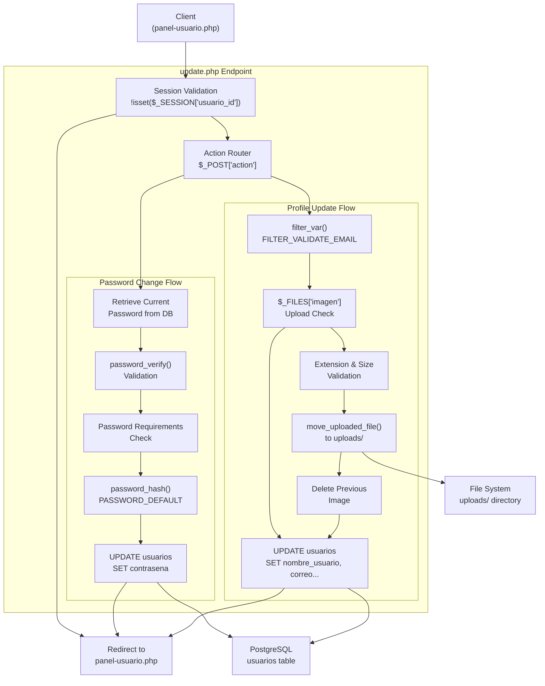
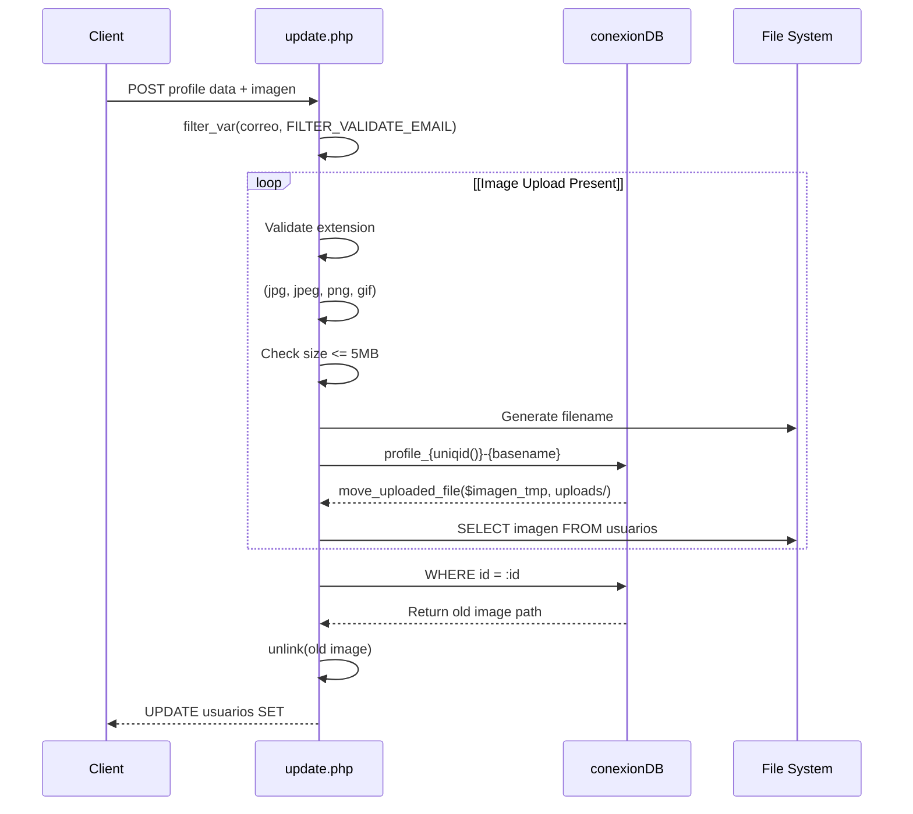
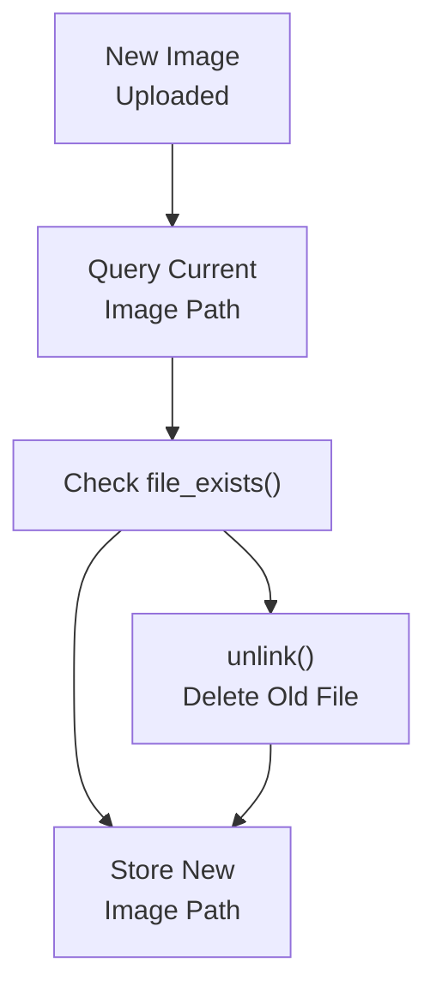
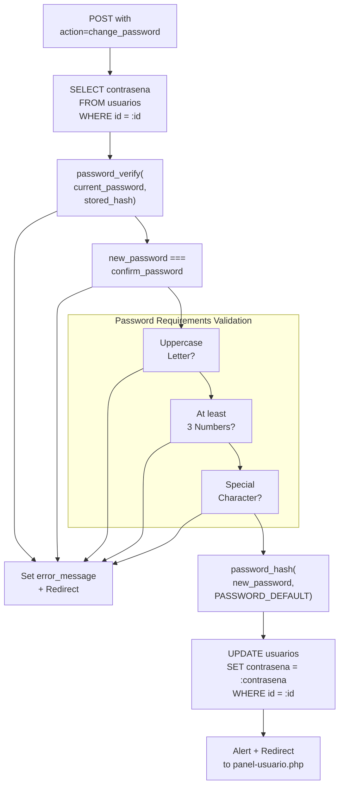
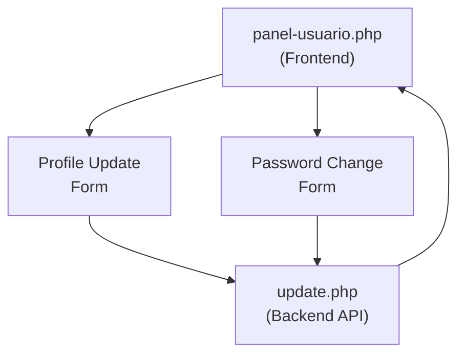

# User Profile APIs

> **Relevant source files**
> * [.gitignore](https://github.com/axchisan/El-rincon-de-ADSO/blob/3e310227/.gitignore)
> * [src/backend/perfil/update.php](https://github.com/axchisan/El-rincon-de-ADSO/blob/3e310227/src/backend/perfil/update.php)
> * [src/backend/perfil/uploads/profile_6807f3b3839528.57825759.jpg](https://github.com/axchisan/El-rincon-de-ADSO/blob/3e310227/src/backend/perfil/uploads/profile_6807f3b3839528.57825759.jpg)
> * [src/backend/perfil/uploads/profile_6807f9a21b8730.38527839.jpg](https://github.com/axchisan/El-rincon-de-ADSO/blob/3e310227/src/backend/perfil/uploads/profile_6807f9a21b8730.38527839.jpg)
> * [src/backend/perfil/uploads/profile_6807f9cd029340.20664564.jpg](https://github.com/axchisan/El-rincon-de-ADSO/blob/3e310227/src/backend/perfil/uploads/profile_6807f9cd029340.20664564.jpg)

## Purpose and Scope

This document describes the backend API endpoints for user profile management in El Rincón de ADSO. These APIs handle profile data updates, password changes, and avatar image uploads. For viewing profile information, see [User Profiles](/axchisan/El-rincon-de-ADSO/6.4-user-profiles). For the frontend profile management interface, see [Profile Management](/axchisan/El-rincon-de-ADSO/4.2-profile-management).

The primary endpoint is located at [src/backend/perfil/update.php](https://github.com/axchisan/El-rincon-de-ADSO/blob/3e310227/src/backend/perfil/update.php)

 and processes two distinct operations based on the `action` parameter.

---

## API Overview

The profile management system provides a single endpoint that handles multiple operations through action-based routing. All requests require active user sessions and redirect to the user dashboard upon completion.

### Endpoint Summary

| Operation | Action Parameter | HTTP Method | Purpose |
| --- | --- | --- | --- |
| Profile Update | (none/default) | POST | Update user profile data and avatar |
| Password Change | `change_password` | POST | Change user password with validation |

**Sources:** [src/backend/perfil/update.php L1-L172](https://github.com/axchisan/El-rincon-de-ADSO/blob/3e310227/src/backend/perfil/update.php#L1-L172)

---

## Request Flow Architecture



**Sources:** [src/backend/perfil/update.php L11-L172](https://github.com/axchisan/El-rincon-de-ADSO/blob/3e310227/src/backend/perfil/update.php#L11-L172)

---

## Profile Data Update API

### Endpoint Details

**URL:** `/src/backend/perfil/update.php`
**Method:** POST
**Authentication:** Session-based (requires `$_SESSION['usuario_id']`)

### Request Parameters

| Parameter | Type | Required | Description |
| --- | --- | --- | --- |
| `nombre` | string | Yes | User's display name |
| `correo` | string | Yes | Email address (validated) |
| `telefono` | string | No | Phone number |
| `profesion` | string | No | User's profession |
| `bio` | string | No | Biography text |
| `imagen` | file | No | Avatar image (JPG, PNG, GIF) |

**Sources:** [src/backend/perfil/update.php L88-L93](https://github.com/axchisan/El-rincon-de-ADSO/blob/3e310227/src/backend/perfil/update.php#L88-L93)

### Profile Update Process



**Sources:** [src/backend/perfil/update.php L86-L167](https://github.com/axchisan/El-rincon-de-ADSO/blob/3e310227/src/backend/perfil/update.php#L86-L167)

### Image Upload Validation

The system enforces strict validation rules for avatar uploads:

**Allowed Extensions:**

* `.jpg`
* `.jpeg`
* `.png`
* `.gif`

**Size Limit:** 5 MB (5,242,880 bytes)

**Storage Location:** `src/backend/perfil/uploads/`

**Naming Convention:** `profile_{uniqid()}-{originalname}.{ext}`

```
// Extension validation
$extension = strtolower(pathinfo($imagen_nombre, PATHINFO_EXTENSION));
$extensiones_permitidas = ['jpg', 'jpeg', 'png', 'gif'];

if (!in_array($extension, $extensiones_permitidas)) {
    $_SESSION['error_message'] = "El formato de la imagen no es válido...";
}

// Size validation
if ($imagen['size'] > 5 * 1024 * 1024) { // 5MB
    $_SESSION['error_message'] = "La imagen es demasiado grande...";
}
```

**Sources:** [src/backend/perfil/update.php L109-L122](https://github.com/axchisan/El-rincon-de-ADSO/blob/3e310227/src/backend/perfil/update.php#L109-L122)

### Old Image Cleanup

When a user uploads a new avatar, the system automatically deletes the previous image:



**Sources:** [src/backend/perfil/update.php L130-L142](https://github.com/axchisan/El-rincon-de-ADSO/blob/3e310227/src/backend/perfil/update.php#L130-L142)

### Email Validation

Email addresses are validated using PHP's built-in filter:

```
if (!filter_var($correo, FILTER_VALIDATE_EMAIL)) {
    $_SESSION['error_message'] = "El correo electrónico no es válido.";
    header("Location: ../../frontend/panel/panel-usuario.php");
    exit();
}
```

**Sources:** [src/backend/perfil/update.php L95-L100](https://github.com/axchisan/El-rincon-de-ADSO/blob/3e310227/src/backend/perfil/update.php#L95-L100)

### Database Update Query

The profile update uses a dynamic SQL query that only includes the image field if a new image was uploaded:

```sql
$query = "UPDATE usuarios SET nombre_usuario = :nombre, correo = :correo, 
          telefono = :telefono, profesion = :profesion, bio = :bio";

if ($imagen_nombre) {
    $query .= ", imagen = :imagen";
    $params[':imagen'] = $imagen_nombre;
}

$query .= " WHERE id = :id";
```

**Sources:** [src/backend/perfil/update.php L145-L162](https://github.com/axchisan/El-rincon-de-ADSO/blob/3e310227/src/backend/perfil/update.php#L145-L162)

---

## Password Change API

### Request Parameters

| Parameter | Type | Required | Description |
| --- | --- | --- | --- |
| `action` | string | Yes | Must be `"change_password"` |
| `current_password` | string | Yes | User's current password |
| `new_password` | string | Yes | New password to set |
| `confirm_password` | string | Yes | Confirmation of new password |

**Sources:** [src/backend/perfil/update.php L23-L27](https://github.com/axchisan/El-rincon-de-ADSO/blob/3e310227/src/backend/perfil/update.php#L23-L27)

### Password Change Flow



**Sources:** [src/backend/perfil/update.php L23-L85](https://github.com/axchisan/El-rincon-de-ADSO/blob/3e310227/src/backend/perfil/update.php#L23-L85)

### Password Validation Rules

The system enforces three password complexity requirements:

**1. At least one uppercase letter:**

```
if (!preg_match('/[A-Z]/', $new_password)) {
    $_SESSION['error_message'] = "La nueva contraseña debe contener al menos una letra mayúscula.";
}
```

**2. At least three numeric digits:**

```
if (preg_match_all('/\d/', $new_password) < 3) {
    $_SESSION['error_message'] = "La nueva contraseña debe contener al menos 3 números.";
}
```

**3. At least one special character:**

```css
if (!preg_match('/[!@#$%^&*(),.?":{}|<>]/', $new_password)) {
    $_SESSION['error_message'] = "La nueva contraseña debe contener al menos un carácter especial.";
}
```

**Sources:** [src/backend/perfil/update.php L56-L70](https://github.com/axchisan/El-rincon-de-ADSO/blob/3e310227/src/backend/perfil/update.php#L56-L70)

### Current Password Verification

Before allowing password changes, the system verifies the user's current password:

```mermaid
sequenceDiagram
  participant update.php
  participant Database
  participant PHP password_verify()

  update.php->>Database: SELECT contrasena FROM usuarios
  Database-->>update.php: WHERE id = :id
  update.php->>PHP password_verify(): Return hashed password
  PHP password_verify()-->>update.php: password_verify(current_password, hash)
  loop [Verification
    update.php->>update.php: Boolean result
    update.php-->>update.php: Set error_message
    update.php->>update.php: Redirect with error
  end
```

**Sources:** [src/backend/perfil/update.php L29-L46](https://github.com/axchisan/El-rincon-de-ADSO/blob/3e310227/src/backend/perfil/update.php#L29-L46)

### Password Hashing

New passwords are hashed using PHP's `PASSWORD_DEFAULT` algorithm (currently bcrypt):

```javascript
$hashed_password = password_hash($new_password, PASSWORD_DEFAULT);

$query = "UPDATE usuarios SET contrasena = :contrasena WHERE id = :id";
$stmt = $db->prepare($query);
$stmt->execute([
    ':contrasena' => $hashed_password,
    ':id' => $user_id
]);
```

**Sources:** [src/backend/perfil/update.php L72-L81](https://github.com/axchisan/El-rincon-de-ADSO/blob/3e310227/src/backend/perfil/update.php#L72-L81)

---

## Response Handling

### Success Responses

Both operations use JavaScript alerts followed by redirects:

```xml
echo "<script>alert('Contraseña actualizada correctamente'); 
      window.location.href='../../frontend/panel/panel-usuario.php';</script>";
```

```xml
echo "<script>alert('Datos guardados correctamente'); 
      window.location.href='../../frontend/panel/panel-usuario.php';</script>";
```

**Sources:** [src/backend/perfil/update.php L84-L85](https://github.com/axchisan/El-rincon-de-ADSO/blob/3e310227/src/backend/perfil/update.php#L84-L85)

 [src/backend/perfil/update.php L165-L166](https://github.com/axchisan/El-rincon-de-ADSO/blob/3e310227/src/backend/perfil/update.php#L165-L166)

### Error Handling

Errors are stored in the session and the user is redirected:

```
$_SESSION['error_message'] = "Error message text";
header("Location: ../../frontend/panel/panel-usuario.php");
exit();
```

**Common Error Scenarios:**

| Error Condition | Error Message |
| --- | --- |
| User not found | "Usuario no encontrado." |
| Invalid current password | "La contraseña actual es incorrecta." |
| Passwords don't match | "Las nuevas contraseñas no coinciden." |
| Missing uppercase | "La nueva contraseña debe contener al menos una letra mayúscula." |
| Less than 3 numbers | "La nueva contraseña debe contener al menos 3 números." |
| No special character | "La nueva contraseña debe contener al menos un carácter especial." |
| Invalid email | "El correo electrónico no es válido." |
| Invalid image format | "El formato de la imagen no es válido. Usa JPG, PNG o GIF." |
| Image too large | "La imagen es demasiado grande. El tamaño máximo es 5MB." |
| Upload failed | "Error al subir la imagen." |

**Sources:** [src/backend/perfil/update.php L36-L127](https://github.com/axchisan/El-rincon-de-ADSO/blob/3e310227/src/backend/perfil/update.php#L36-L127)

### PDO Exception Handling

Database errors are caught and handled gracefully:

```
try {
    // Database operations
} catch (PDOException $e) {
    $_SESSION['error_message'] = "Error al actualizar los datos: " . $e->getMessage();
    header("Location: ../../frontend/panel/panel-usuario.php");
    exit();
}
```

**Sources:** [src/backend/perfil/update.php L168-L172](https://github.com/axchisan/El-rincon-de-ADSO/blob/3e310227/src/backend/perfil/update.php#L168-L172)

---

## Cache Control Headers

The endpoint includes cache control headers to ensure updated profile images display immediately:

```
header("Cache-Control: no-store, no-cache, must-revalidate, max-age=0");
header("Cache-Control: post-check=0, pre-check=0", false);
header("Pragma: no-cache");
```

This prevents browsers from caching old avatar images after updates.

**Sources:** [src/backend/perfil/update.php L4-L7](https://github.com/axchisan/El-rincon-de-ADSO/blob/3e310227/src/backend/perfil/update.php#L4-L7)

---

## Database Schema Integration

The API interacts with the `usuarios` table:

```css
#mermaid-9gdlydtcjie{font-family:ui-sans-serif,-apple-system,system-ui,Segoe UI,Helvetica;font-size:16px;fill:#333;}@keyframes edge-animation-frame{from{stroke-dashoffset:0;}}@keyframes dash{to{stroke-dashoffset:0;}}#mermaid-9gdlydtcjie .edge-animation-slow{stroke-dasharray:9,5!important;stroke-dashoffset:900;animation:dash 50s linear infinite;stroke-linecap:round;}#mermaid-9gdlydtcjie .edge-animation-fast{stroke-dasharray:9,5!important;stroke-dashoffset:900;animation:dash 20s linear infinite;stroke-linecap:round;}#mermaid-9gdlydtcjie .error-icon{fill:#dddddd;}#mermaid-9gdlydtcjie .error-text{fill:#222222;stroke:#222222;}#mermaid-9gdlydtcjie .edge-thickness-normal{stroke-width:1px;}#mermaid-9gdlydtcjie .edge-thickness-thick{stroke-width:3.5px;}#mermaid-9gdlydtcjie .edge-pattern-solid{stroke-dasharray:0;}#mermaid-9gdlydtcjie .edge-thickness-invisible{stroke-width:0;fill:none;}#mermaid-9gdlydtcjie .edge-pattern-dashed{stroke-dasharray:3;}#mermaid-9gdlydtcjie .edge-pattern-dotted{stroke-dasharray:2;}#mermaid-9gdlydtcjie .marker{fill:#999;stroke:#999;}#mermaid-9gdlydtcjie .marker.cross{stroke:#999;}#mermaid-9gdlydtcjie svg{font-family:ui-sans-serif,-apple-system,system-ui,Segoe UI,Helvetica;font-size:16px;}#mermaid-9gdlydtcjie p{margin:0;}#mermaid-9gdlydtcjie .entityBox{fill:#ffffff;stroke:#dddddd;}#mermaid-9gdlydtcjie .relationshipLabelBox{fill:#dddddd;opacity:0.7;background-color:#dddddd;}#mermaid-9gdlydtcjie .relationshipLabelBox rect{opacity:0.5;}#mermaid-9gdlydtcjie .labelBkg{background-color:rgba(221, 221, 221, 0.5);}#mermaid-9gdlydtcjie .edgeLabel .label{fill:#dddddd;font-size:14px;}#mermaid-9gdlydtcjie .label{font-family:ui-sans-serif,-apple-system,system-ui,Segoe UI,Helvetica;color:#333;}#mermaid-9gdlydtcjie .edge-pattern-dashed{stroke-dasharray:8,8;}#mermaid-9gdlydtcjie .node rect,#mermaid-9gdlydtcjie .node circle,#mermaid-9gdlydtcjie .node ellipse,#mermaid-9gdlydtcjie .node polygon{fill:#ffffff;stroke:#dddddd;stroke-width:1px;}#mermaid-9gdlydtcjie .relationshipLine{stroke:#999;stroke-width:1;fill:none;}#mermaid-9gdlydtcjie .marker{fill:none!important;stroke:#999!important;stroke-width:1;}#mermaid-9gdlydtcjie :root{--mermaid-font-family:"trebuchet ms",verdana,arial,sans-serif;}usuariosintidPKstringnombre_usuariostringcorreostringcontrasenastringtelefonostringprofesionstringbiostringimagen
```

**Updated Fields:**

**Profile Update:**

* `nombre_usuario`
* `correo`
* `telefono`
* `profesion`
* `bio`
* `imagen` (conditional)

**Password Change:**

* `contrasena`

**Sources:** [src/backend/perfil/update.php L30-L31](https://github.com/axchisan/El-rincon-de-ADSO/blob/3e310227/src/backend/perfil/update.php#L30-L31)

 [src/backend/perfil/update.php L76-L81](https://github.com/axchisan/El-rincon-de-ADSO/blob/3e310227/src/backend/perfil/update.php#L76-L81)

 [src/backend/perfil/update.php L145-L162](https://github.com/axchisan/El-rincon-de-ADSO/blob/3e310227/src/backend/perfil/update.php#L145-L162)

---

## Security Considerations

### Session-Based Authentication

All requests require an active session:

```
if (!isset($_SESSION['usuario_id'])) {
    header("Location: ../../frontend/login/login.php");
    exit();
}
```

**Sources:** [src/backend/perfil/update.php L11-L14](https://github.com/axchisan/El-rincon-de-ADSO/blob/3e310227/src/backend/perfil/update.php#L11-L14)

### SQL Injection Prevention

The API uses PDO prepared statements for all database queries:

```javascript
$query = "SELECT contrasena FROM usuarios WHERE id = :id";
$stmt = $db->prepare($query);
$stmt->execute([':id' => $user_id]);
```

**Sources:** [src/backend/perfil/update.php L30-L33](https://github.com/axchisan/El-rincon-de-ADSO/blob/3e310227/src/backend/perfil/update.php#L30-L33)

### File Upload Security

* **Extension whitelist:** Only allows specific image formats
* **Size validation:** Enforces 5MB maximum
* **Unique filenames:** Uses `uniqid()` to prevent conflicts
* **Storage location:** Files stored in dedicated `uploads/` directory

**Sources:** [src/backend/perfil/update.php L109-L128](https://github.com/axchisan/El-rincon-de-ADSO/blob/3e310227/src/backend/perfil/update.php#L109-L128)

### Password Security

* **Verification required:** Must provide current password to change
* **Complexity requirements:** Enforces uppercase, numbers, special characters
* **Secure hashing:** Uses `password_hash()` with `PASSWORD_DEFAULT`

**Sources:** [src/backend/perfil/update.php L42-L73](https://github.com/axchisan/El-rincon-de-ADSO/blob/3e310227/src/backend/perfil/update.php#L42-L73)

---

## Integration with Frontend

The profile APIs are primarily called from the profile management section within the user dashboard:



**Sources:** [src/backend/perfil/update.php L12-L13](https://github.com/axchisan/El-rincon-de-ADSO/blob/3e310227/src/backend/perfil/update.php#L12-L13)

 [src/backend/perfil/update.php L37-L38](https://github.com/axchisan/El-rincon-de-ADSO/blob/3e310227/src/backend/perfil/update.php#L37-L38)

 [src/backend/perfil/update.php L98-L99](https://github.com/axchisan/El-rincon-de-ADSO/blob/3e310227/src/backend/perfil/update.php#L98-L99)

---

## Connection to Database Layer

The API uses the centralized database connection singleton:

```
require_once "../../database/conexionDB.php";

$db = conexionDB::getConexion();
```

This provides access to the PostgreSQL database hosted on Aiven. For details on database configuration, see [Database Configuration](/axchisan/El-rincon-de-ADSO/2.1-database-configuration).

**Sources:** [src/backend/perfil/update.php L9-L17](https://github.com/axchisan/El-rincon-de-ADSO/blob/3e310227/src/backend/perfil/update.php#L9-L17)