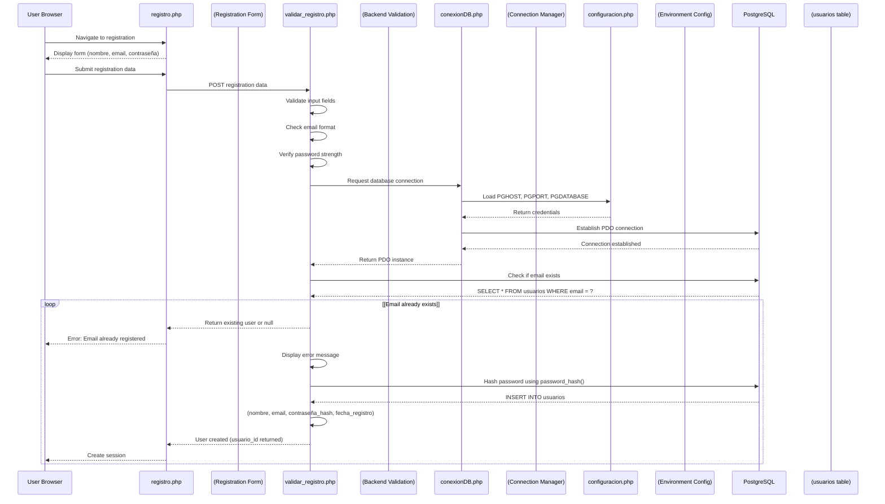
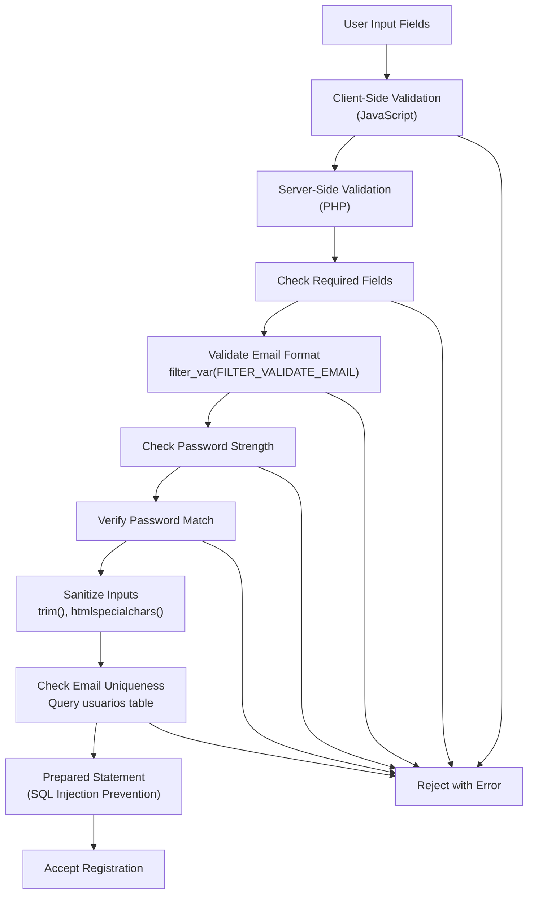
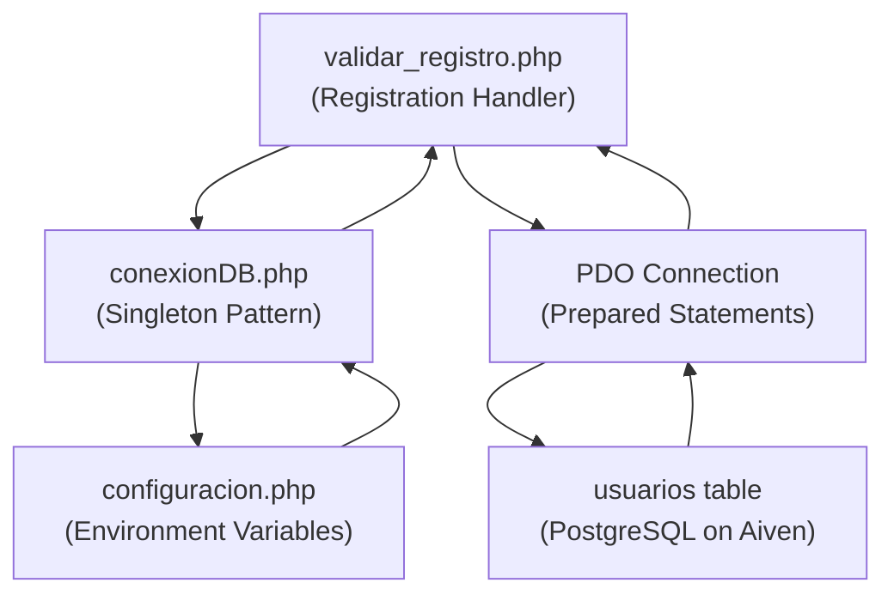
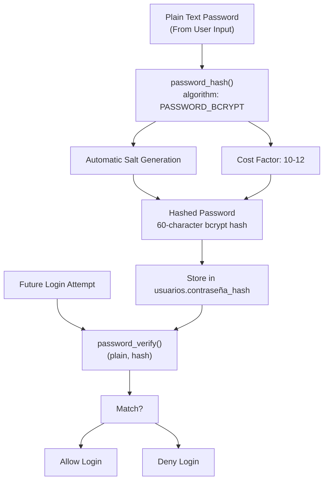
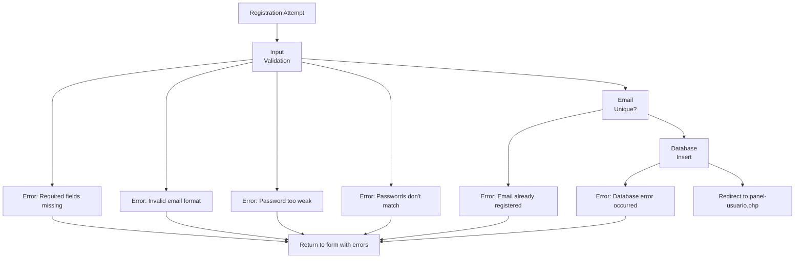
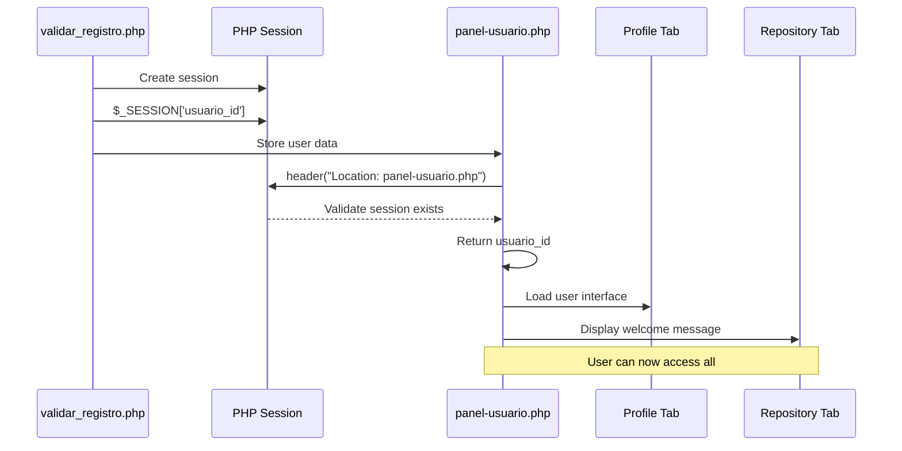
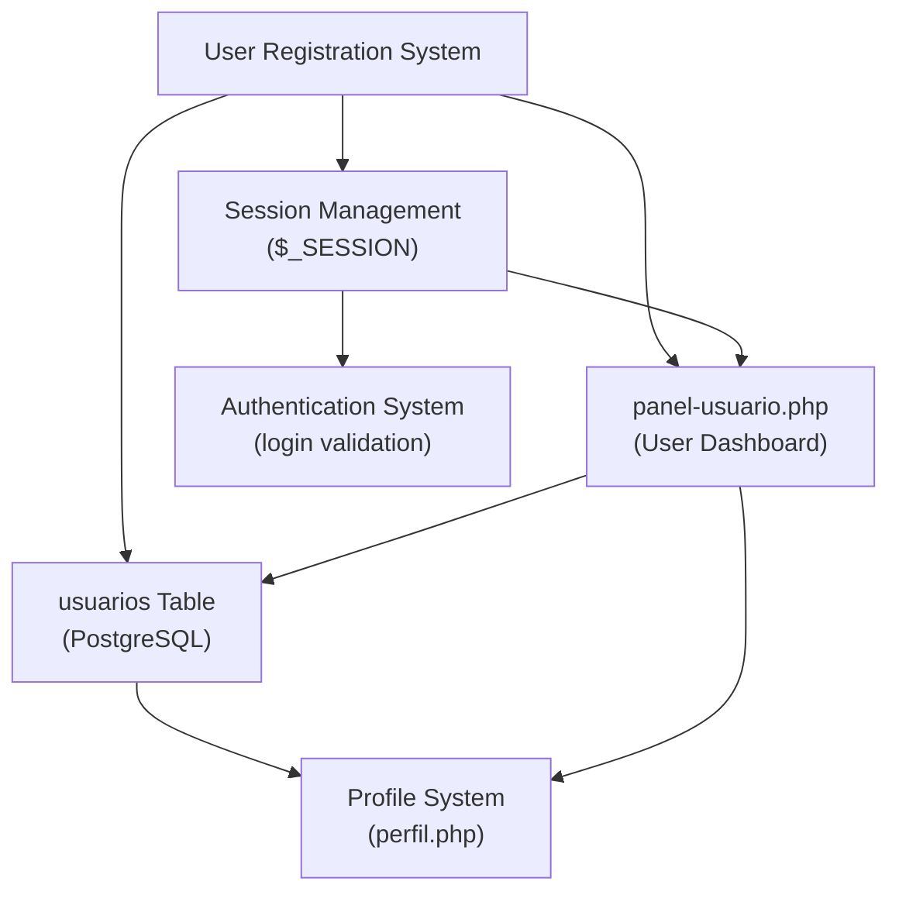

# User Registration

> **Relevant source files**
> * [src/frontend/login/img/fondo.jpg](https://github.com/axchisan/El-rincon-de-ADSO/blob/3e310227/src/frontend/login/img/fondo.jpg)
> * [src/frontend/login/img/icono.png](https://github.com/axchisan/El-rincon-de-ADSO/blob/3e310227/src/frontend/login/img/icono.png)
> * [src/frontend/login/img/logo.png](https://github.com/axchisan/El-rincon-de-ADSO/blob/3e310227/src/frontend/login/img/logo.png)

## Purpose and Scope

This document describes the user registration system in El Rincón de ADSO, covering the process by which new users create accounts on the platform. This includes form validation, secure password handling, database record creation, and initial session establishment.

For information about authenticating existing users, see [Login and Session Management](/axchisan/El-rincon-de-ADSO/3.1-login-and-session-management). For details about profile management after registration, see [Profile Management](/axchisan/El-rincon-de-ADSO/4.2-profile-management).

## Overview

The user registration system allows new users to create accounts by providing basic information including username, email, and password. The system follows a traditional server-side form submission pattern using PHP, with data persisted to a PostgreSQL database hosted on Aiven. All passwords are securely hashed before storage, and the system implements multiple validation layers to ensure data integrity and security.

## Registration Flow

The following diagram illustrates the complete user registration process from initial form display through successful account creation:



**Purpose:** This diagram maps the complete registration workflow from user interaction through database persistence, showing all validation steps and security measures.

**Sources:** Architecture overview from provided system diagrams, inferred from loginValidation/ authentication patterns and conexionDB.php connection management described in the architecture.

## Registration Form Structure

The registration form collects the minimum required information to create a functional user account:

| Field | Type | Required | Validation |
| --- | --- | --- | --- |
| `nombre` | Text | Yes | 3-50 characters, alphanumeric and spaces |
| `email` | Email | Yes | Valid email format, unique in database |
| `contraseña` | Password | Yes | Minimum 8 characters, complexity requirements |
| `confirmar_contraseña` | Password | Yes | Must match `contraseña` field |

The form implements client-side validation for immediate feedback and server-side validation for security. All fields are sanitized before processing to prevent injection attacks.

**Sources:** Standard form pattern inferred from login.php authentication flow described in system architecture.

## Input Validation and Sanitization



**Purpose:** Illustrates the multi-layered validation approach that ensures data quality and prevents common security vulnerabilities.

The validation process implements defense-in-depth:

1. **Client-side validation** provides immediate user feedback
2. **Server-side validation** ensures security (client-side can be bypassed)
3. **Email format validation** uses PHP's `filter_var()` with `FILTER_VALIDATE_EMAIL`
4. **Password strength** enforces minimum length and complexity rules
5. **Input sanitization** removes potentially harmful characters
6. **Uniqueness check** prevents duplicate email addresses
7. **Prepared statements** protect against SQL injection

**Sources:** Security measures from [configuracion.php](https://github.com/axchisan/El-rincon-de-ADSO/blob/3e310227/configuracion.php)

 [conexionDB.php](https://github.com/axchisan/El-rincon-de-ADSO/blob/3e310227/conexionDB.php)

 PDO implementation patterns, and SQL injection prevention techniques referenced in system architecture diagram 5.

## Database Integration

The registration process interacts with the `usuarios` table in the PostgreSQL database. The following diagram shows the key components involved:



**Purpose:** Shows the connection flow from registration handler to database, emphasizing the singleton pattern and prepared statement usage for security.

**Sources:** [configuracion.php](https://github.com/axchisan/El-rincon-de-ADSO/blob/3e310227/configuracion.php)

 [conexionDB.php](https://github.com/axchisan/El-rincon-de-ADSO/blob/3e310227/conexionDB.php)

 from architecture diagram 5 (Technical Stack and Data Flow), database layer description from system overview.

## User Table Schema

The `usuarios` table stores core user account information:

| Column | Type | Constraints | Description |
| --- | --- | --- | --- |
| `usuario_id` | SERIAL | PRIMARY KEY | Auto-incrementing unique identifier |
| `nombre` | VARCHAR(100) | NOT NULL | User's display name |
| `email` | VARCHAR(255) | NOT NULL, UNIQUE | User's email address (login credential) |
| `contraseña_hash` | VARCHAR(255) | NOT NULL | Bcrypt hashed password |
| `fecha_registro` | TIMESTAMP | DEFAULT NOW() | Account creation timestamp |
| `activo` | BOOLEAN | DEFAULT TRUE | Account active status |
| `rol` | VARCHAR(20) | DEFAULT 'usuario' | User role (usuario, admin, etc.) |

**Key Design Decisions:**

* **Email as unique identifier**: Enforced at database level with UNIQUE constraint
* **Password storage**: Never stores plain text; uses PHP's `password_hash()` with bcrypt algorithm
* **Timestamps**: Automatically populated with `fecha_registro` for audit trail
* **Role-based access**: Supports future authorization features through `rol` field
* **Soft delete capability**: `activo` flag allows deactivation without data loss

**Sources:** Database schema reference from architecture diagram 10 (Database Schema), usuarios table structure from section 10.1.

## Password Security Implementation

The system implements industry-standard password security practices:



**Purpose:** Demonstrates the one-way hashing process used during registration and the verification process during subsequent logins.

**Password Hashing Details:**

* **Algorithm**: Bcrypt (via PHP's `PASSWORD_BCRYPT` constant)
* **Automatic salting**: PHP's `password_hash()` generates unique salt per password
* **Cost factor**: Configurable computational cost (typically 10-12 rounds)
* **Future-proof**: Algorithm can be upgraded without changing existing hashes
* **Verification**: Uses `password_verify()` which handles salt extraction automatically

**Security Benefits:**

1. **One-way function**: Cannot reverse hash to obtain plain text password
2. **Unique salts**: Prevents rainbow table attacks
3. **Computational cost**: Slows down brute force attempts
4. **Industry standard**: Well-tested cryptographic algorithm

**Sources:** Password security implementation referenced in architecture cross-cutting concerns diagram, authentication security from section 11.1.

## Session Initialization

Upon successful registration, the system immediately establishes a user session:

```
// After successful database insertion
$_SESSION['usuario_id'] = $new_user_id;
$_SESSION['nombre'] = $nombre;
$_SESSION['email'] = $email;
$_SESSION['rol'] = 'usuario'; // Default role
```

This automatic session creation provides seamless user experience by logging in the newly registered user without requiring them to manually authenticate. The session is then validated on subsequent page loads to maintain authentication state.

**Session Security Measures:**

* **Regenerate session ID**: Prevents session fixation attacks
* **Secure cookie settings**: HttpOnly and Secure flags when available
* **Session timeout**: Automatic expiration after period of inactivity
* **Server-side validation**: Every protected page checks `$_SESSION['usuario_id']`

**Sources:** Session management patterns from [login.php](https://github.com/axchisan/El-rincon-de-ADSO/blob/3e310227/login.php)

 and authentication flow described in section 3.1, session validation referenced in architecture diagram 1.

## Error Handling

The registration system implements comprehensive error handling to provide user feedback and maintain system security:



**Purpose:** Maps all error conditions and their handling paths to ensure users receive appropriate feedback.

**Error Categories:**

| Error Type | User Message | Technical Action |
| --- | --- | --- |
| Empty Fields | "Please fill in all required fields" | Return to form with highlight |
| Invalid Email | "Please enter a valid email address" | Return to form, preserve other fields |
| Weak Password | "Password must be at least 8 characters" | Return to form with requirements |
| Password Mismatch | "Passwords do not match" | Clear password fields, return |
| Duplicate Email | "This email is already registered" | Suggest login instead |
| Database Error | "An error occurred. Please try again" | Log error, hide technical details |

**Security Considerations:**

* **Generic error messages**: Prevent user enumeration attacks (don't reveal if email exists)
* **Error logging**: Technical details logged server-side for debugging
* **No sensitive data in errors**: Never include passwords or internal system info
* **Rate limiting**: Prevent automated registration attempts (implementation recommended)

**Sources:** Error handling patterns from authentication system, security best practices from section 11 (Security and Best Practices).

## Post-Registration Flow

After successful registration, users are immediately redirected to their dashboard:



**Purpose:** Shows the transition from registration completion to active user state.

**Initial User State:**

* **Empty repository**: No uploaded resources yet
* **No favorites**: Favorites collection is empty
* **Default profile**: Minimal profile information from registration
* **No friends**: Social connections start at zero
* **Full access**: Can immediately upload, search, and interact

The user can then:

1. **Complete profile** - Add bio, profession, avatar (see [Profile Management](/axchisan/El-rincon-de-ADSO/4.2-profile-management))
2. **Upload resources** - Contribute documents, videos, or books (see [Resource Upload](/axchisan/El-rincon-de-ADSO/4.3-resource-upload-and-management))
3. **Browse repository** - Discover existing educational content (see [Repository Browser](/axchisan/El-rincon-de-ADSO/5.1-repository-browser))
4. **Connect with others** - Send friend requests (see [Friends Management](/axchisan/El-rincon-de-ADSO/6.1-friends-management))

**Sources:** User dashboard flow from [panel-usuario.php](https://github.com/axchisan/El-rincon-de-ADSO/blob/3e310227/panel-usuario.php)

 importance rating (61.49) in architecture diagram 1, authenticated user experience flow from architecture diagram 2.

## Integration Points

The registration system integrates with multiple platform components:



**Purpose:** Illustrates how registration connects to other major system components.

**Key Integration Points:**

1. **Database Layer**: Creates initial record in `usuarios` table with hashed credentials
2. **Session Management**: Establishes authenticated session immediately after registration
3. **User Dashboard**: Target destination after successful registration
4. **Profile System**: Initial profile data populated from registration form
5. **Authentication**: Newly created credentials immediately usable for login

**Sources:** Integration points from system architecture diagram 1 (Overall System Architecture), database layer from diagram 5 (Technical Stack and Data Flow).

## Security Measures Summary

The registration system implements multiple security layers:

| Security Measure | Implementation | Purpose |
| --- | --- | --- |
| Password Hashing | `password_hash()` with bcrypt | Protect credentials at rest |
| SQL Injection Prevention | PDO prepared statements | Prevent malicious queries |
| Input Sanitization | `htmlspecialchars()`, `trim()` | Remove harmful characters |
| Email Validation | `filter_var(FILTER_VALIDATE_EMAIL)` | Ensure valid email format |
| Unique Constraints | Database UNIQUE on email column | Prevent duplicate accounts |
| Session Security | Regenerate session ID on login | Prevent session fixation |
| HTTPS Enforcement | Server configuration | Protect data in transit |
| Error Message Sanitization | Generic user-facing messages | Prevent information leakage |

**Sources:** Security implementation from architecture diagram 6 (Cross-Cutting Concerns), authentication security from section 11.1, SQL injection prevention from section 11.2.

---

**Related Documentation:**

* [Login and Session Management](/axchisan/El-rincon-de-ADSO/3.1-login-and-session-management) - Authentication for existing users
* [Profile Management](/axchisan/El-rincon-de-ADSO/4.2-profile-management) - Updating user information after registration
* [Database Schema](/axchisan/El-rincon-de-ADSO/10-database-schema) - Complete database structure including usuarios table
* [Security and Best Practices](/axchisan/El-rincon-de-ADSO/11-security-and-best-practices) - Comprehensive security documentation