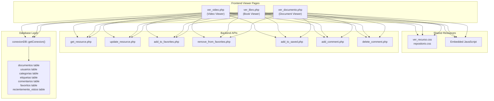
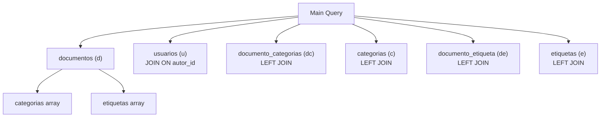
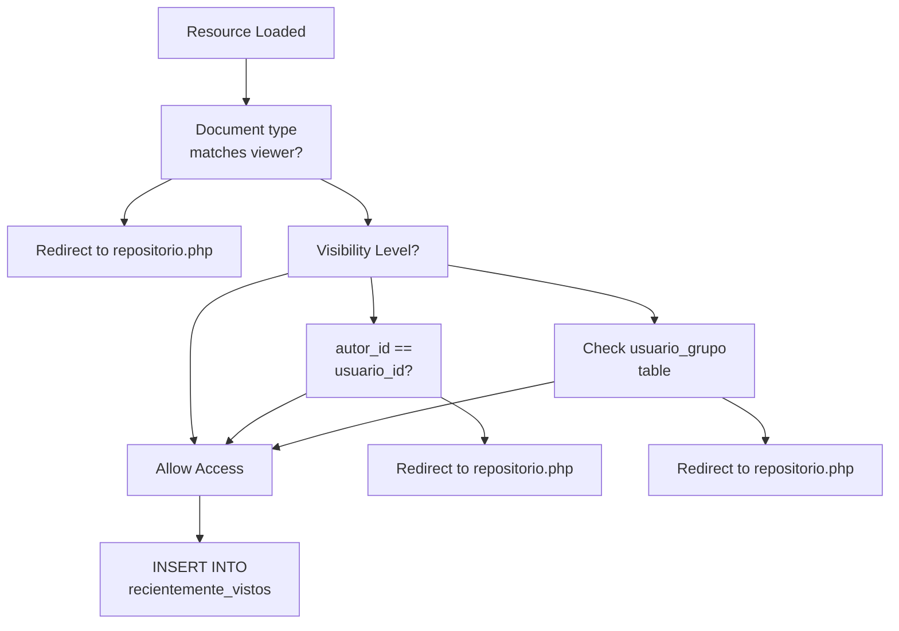
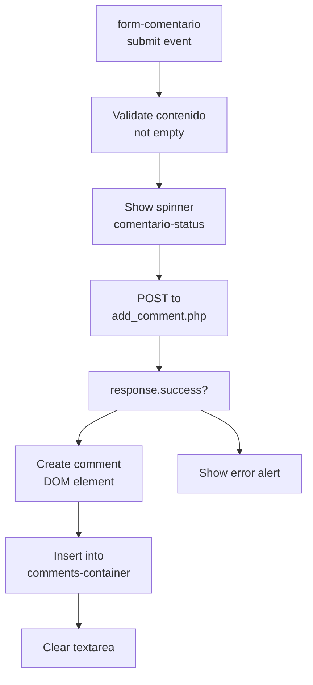
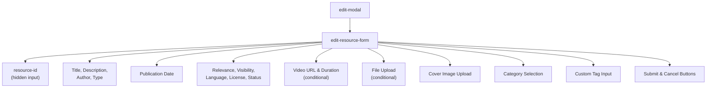
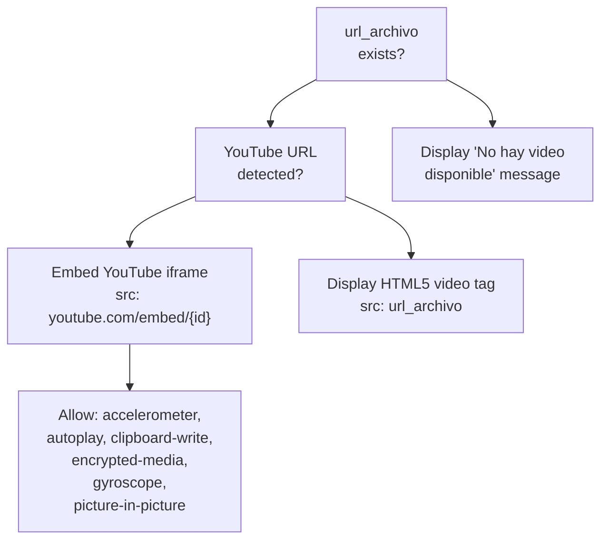
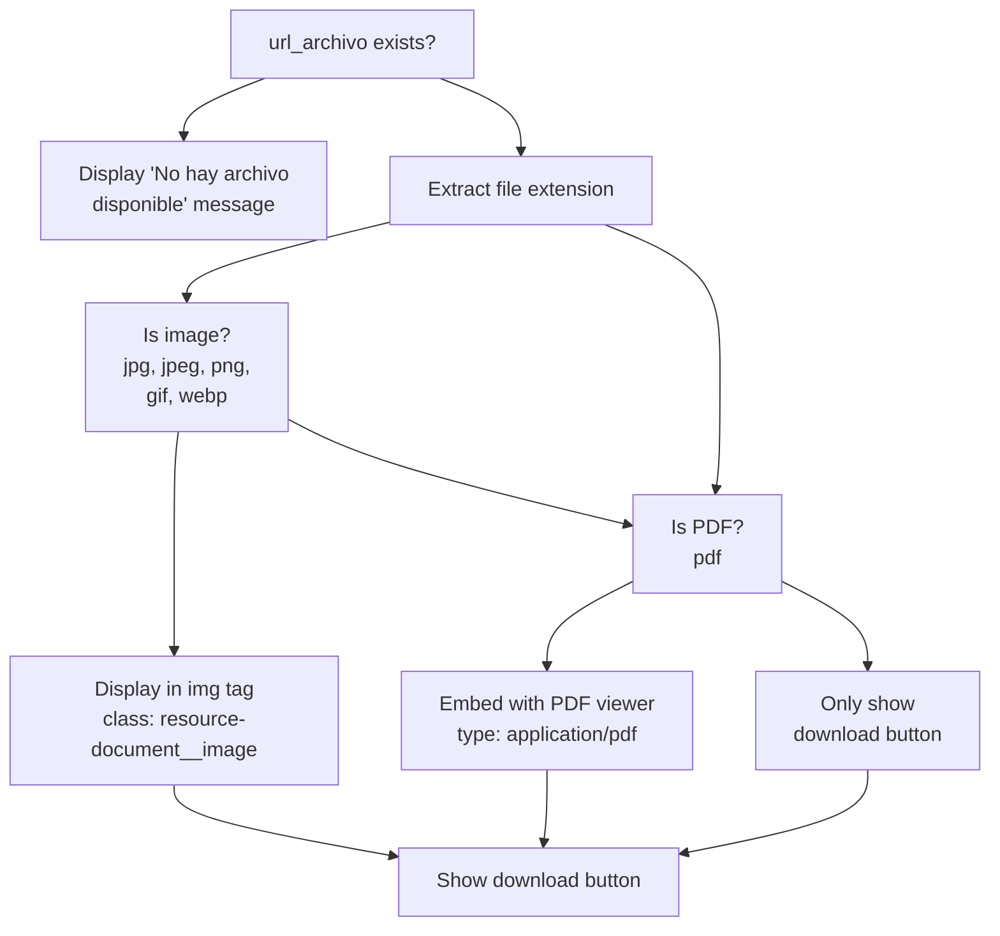
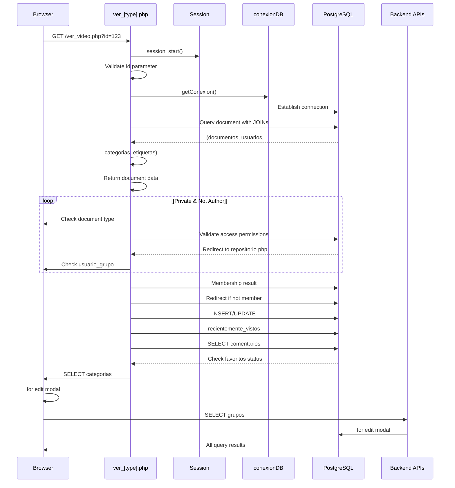
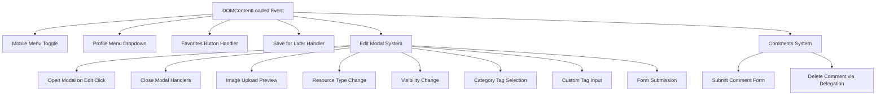

# Visores de recursos

> **Archivos fuente relevantes**
> * [src/frontend/repositorio/ver_documento.php](https://github.com/axchisan/El-rincon-de-ADSO/blob/3e310227/src/frontend/repositorio/ver_documento.php)
> * [src/frontend/repositorio/ver_libro.php](https://github.com/axchisan/El-rincon-de-ADSO/blob/3e310227/src/frontend/repositorio/ver_libro.php)
> * [src/frontend/repositorio/ver_video.php](https://github.com/axchisan/El-rincon-de-ADSO/blob/3e310227/src/frontend/repositorio/ver_video.php)
> * [src/uploads/6813fb2b5aff5.pdf](https://github.com/axchisan/El-rincon-de-ADSO/blob/3e310227/src/uploads/6813fb2b5aff5.pdf)

## Propósito y alcance

Este documento describe las páginas del visor de recursos que muestran recursos educativos individuales (videos, libros y documentos) en la plataforma El Rincón de ADSO. Estas páginas ofrecen interfaces de visualización especializadas para diferentes tipos de recursos, además de funciones de interacción con el usuario como favoritos, comentarios y funciones de edición.

Para obtener información sobre la exploración y búsqueda de recursos, consulte [el Explorador de repositorios](/axchisan/El-rincon-de-ADSO/5.1-repository-browser) . Para obtener más información sobre la carga y creación de recursos, consulte [Carga y validación de recursos](/axchisan/El-rincon-de-ADSO/5.3-resource-upload-and-validation) . Para conocer las API de backend compatibles con estos visualizadores, consulte [las API de administración de recursos](/axchisan/El-rincon-de-ADSO/9.1-resource-management-apis) .

---

## Descripción general de la arquitectura del visor

El sistema ofrece tres páginas de visualización especializadas, cada una diseñada para mostrar un tipo específico de recurso educativo. Las tres comparten un patrón arquitectónico común, pero implementan una lógica de visualización específica para cada tipo.

**Mapeo de componentes del sistema**



**Fuentes:** [src/frontend/repositorio/ver_video.php L1-L125](https://github.com/axchisan/El-rincon-de-ADSO/blob/3e310227/src/frontend/repositorio/ver_video.php#L1-L125)

 [src/frontend/repositorio/ver_libro.php L1-L116](https://github.com/axchisan/El-rincon-de-ADSO/blob/3e310227/src/frontend/repositorio/ver_libro.php#L1-L116)

 [src/frontend/repositorio/ver_documento.php L1-L121](https://github.com/axchisan/El-rincon-de-ADSO/blob/3e310227/src/frontend/repositorio/ver_documento.php#L1-L121)

---

## Componentes comunes del visor

Las tres páginas del visor comparten una arquitectura consistente con los siguientes componentes:

### Punto de entrada y validación de sesión

Cada página del visor comienza validando el parámetro de ID de sesión y documento:

| Paso de validación | Implementación |
| --- | --- |
| Inicialización de sesión | `session_start()` |
| Conexión a la base de datos | `require_once "../../database/conexionDB.php"` |
| Comprobación del parámetro de identificación | Valida `$_GET['id']`que esté presente y no vacío |
| Redirigir en caso de fallo | Redirecciona `repositorio.php`si falla la validación |

**Fuentes:** [src/frontend/repositorio/ver_video.php L2-L12](https://github.com/axchisan/El-rincon-de-ADSO/blob/3e310227/src/frontend/repositorio/ver_video.php#L2-L12)

 [src/frontend/repositorio/ver_libro.php L2-L12](https://github.com/axchisan/El-rincon-de-ADSO/blob/3e310227/src/frontend/repositorio/ver_libro.php#L2-L12)

 [src/frontend/repositorio/ver_documento.php L2-L14](https://github.com/axchisan/El-rincon-de-ADSO/blob/3e310227/src/frontend/repositorio/ver_documento.php#L2-L14)

### Consulta de recuperación de datos

Todos los espectadores utilizan una consulta JOIN compleja para recuperar información completa de los recursos:



La consulta recupera:

* Metadatos del documento (título, descripción, autor, fecha_publicación, etc.)
* Nombre de usuario del autor a través de JOIN con `usuarios`la tabla
* Categorías como matriz agregada utilizando`COALESCE(ARRAY_AGG(...))`
* Tags as aggregated array using `COALESCE(ARRAY_AGG(...))`

**Sources:** [src/frontend/repositorio/ver_video.php L18-L34](https://github.com/axchisan/El-rincon-de-ADSO/blob/3e310227/src/frontend/repositorio/ver_video.php#L18-L34)

 [src/frontend/repositorio/ver_libro.php L18-L34](https://github.com/axchisan/El-rincon-de-ADSO/blob/3e310227/src/frontend/repositorio/ver_libro.php#L18-L34)

 [src/frontend/repositorio/ver_documento.php L18-L35](https://github.com/axchisan/El-rincon-de-ADSO/blob/3e310227/src/frontend/repositorio/ver_documento.php#L18-L35)

### Access Control Logic

Each viewer implements a three-tier visibility system:



**Implementation Details:**

| Visibility Level | Access Control Logic | Database Query |
| --- | --- | --- |
| `Public` | All users (authenticated or anonymous) | None |
| `Private` | Only the resource author | `$documento['autor_id'] != $usuario_id` check |
| `Group` | Members of the specified group | `SELECT COUNT(*) FROM usuario_grupo WHERE usuario_id = :usuario_id AND grupo_id = :grupo_id` |

**Sources:** [src/frontend/repositorio/ver_video.php L36-L57](https://github.com/axchisan/El-rincon-de-ADSO/blob/3e310227/src/frontend/repositorio/ver_video.php#L36-L57)

 [src/frontend/repositorio/ver_libro.php L36-L57](https://github.com/axchisan/El-rincon-de-ADSO/blob/3e310227/src/frontend/repositorio/ver_libro.php#L36-L57)

 [src/frontend/repositorio/ver_documento.php L36-L62](https://github.com/axchisan/El-rincon-de-ADSO/blob/3e310227/src/frontend/repositorio/ver_documento.php#L36-L62)

### Recently Viewed Tracking

For authenticated users, the system tracks recently viewed resources:

```sql
INSERT INTO recientemente_vistos (usuario_id, documento_id, fecha_vista)
VALUES (:usuario_id, :documento_id, NOW())
ON CONFLICT (usuario_id, documento_id) DO UPDATE
SET fecha_vista = NOW()
```

This uses PostgreSQL's `ON CONFLICT` clause to either insert a new record or update the timestamp if the user has previously viewed the resource.

**Sources:** [src/frontend/repositorio/ver_video.php L69-L78](https://github.com/axchisan/El-rincon-de-ADSO/blob/3e310227/src/frontend/repositorio/ver_video.php#L69-L78)

 [src/frontend/repositorio/ver_libro.php L69-L78](https://github.com/axchisan/El-rincon-de-ADSO/blob/3e310227/src/frontend/repositorio/ver_libro.php#L69-L78)

 [src/frontend/repositorio/ver_documento.php L73-L83](https://github.com/axchisan/El-rincon-de-ADSO/blob/3e310227/src/frontend/repositorio/ver_documento.php#L73-L83)

---

## User Action Buttons

All viewer pages provide consistent action buttons for authenticated users:

### Favorites Button

The favorites button dynamically displays based on the current favorite status:

**Button States:**

| State | CSS Classes | Icon | Text |
| --- | --- | --- | --- |
| Not Favorited | `btn btn--outline` | `fa-heart` | "Añadir a favoritos" |
| Favorited | `btn btn--danger` | `fa-heart-broken` | "Quitar de favoritos" |

The button's initial state is determined by querying the `favoritos` table:

```sql
SELECT COUNT(*) FROM favoritos 
WHERE usuario_id = :usuario_id AND documento_id = :documento_id
```

**JavaScript Implementation:**

The favorites button uses fetch API to call different endpoints based on current state:

* Add to favorites: `../../backend/gestionRecursos/add_to_favorites.php`
* Remove from favorites: `../../backend/gestionRecursos/remove_from_favorites.php`

**Sources:** [src/frontend/repositorio/ver_video.php L92-L605](https://github.com/axchisan/El-rincon-de-ADSO/blob/3e310227/src/frontend/repositorio/ver_video.php#L92-L605)

 [src/frontend/repositorio/ver_libro.php L92-L581](https://github.com/axchisan/El-rincon-de-ADSO/blob/3e310227/src/frontend/repositorio/ver_libro.php#L92-L581)

### Save for Later Button

Allows users to save resources to their "Saved" collection:

```yaml
fetch('../../backend/gestionRecursos/add_to_saved.php', {
    method: 'POST',
    headers: {
        'Content-Type': 'application/x-www-form-urlencoded'
    },
    body: `documento_id=${documentoId}`
})
```

**Sources:** [src/frontend/repositorio/ver_video.php L607-L633](https://github.com/axchisan/El-rincon-de-ADSO/blob/3e310227/src/frontend/repositorio/ver_video.php#L607-L633)

 [src/frontend/repositorio/ver_documento.php L603-L629](https://github.com/axchisan/El-rincon-de-ADSO/blob/3e310227/src/frontend/repositorio/ver_documento.php#L603-L629)

### Edit Button

Only visible to resource authors (`$documento['autor_id'] == $usuario_id`). Opens the edit modal when clicked.

**Sources:** [src/frontend/repositorio/ver_video.php L216-L220](https://github.com/axchisan/El-rincon-de-ADSO/blob/3e310227/src/frontend/repositorio/ver_video.php#L216-L220)

 [src/frontend/repositorio/ver_libro.php L204-L208](https://github.com/axchisan/El-rincon-de-ADSO/blob/3e310227/src/frontend/repositorio/ver_libro.php#L204-L208)

---

## Comments System

All viewers include a full-featured comments system integrated into the page.

### Comments Display

Comments are retrieved and displayed in reverse chronological order:

```sql
SELECT c.*, u.nombre_usuario
FROM comentarios c
JOIN usuarios u ON c.autor_id = u.id
WHERE c.documento_id = :documento_id
ORDER BY c.fecha_creacion DESC
```

Each comment displays:

* Author username (`nombre_usuario`)
* Creation timestamp (`fecha_creacion` formatted as `d/m/Y H:i`)
* Comment content (`contenido` with line breaks preserved via `nl2br()`)
* Delete button (only visible to comment author)

**Sources:** [src/frontend/repositorio/ver_video.php L80-L389](https://github.com/axchisan/El-rincon-de-ADSO/blob/3e310227/src/frontend/repositorio/ver_video.php#L80-L389)

 [src/frontend/repositorio/ver_libro.php L80-L366](https://github.com/axchisan/El-rincon-de-ADSO/blob/3e310227/src/frontend/repositorio/ver_libro.php#L80-L366)

### Adding Comments

**Form Structure:**

```php
<form id="form-comentario" data-documento-id="<?php echo $documento_id; ?>">
    <textarea name="contenido" placeholder="Escribe un comentario..." required></textarea>
    <button type="submit" class="btn btn--primary">
        <i class="fas fa-paper-plane"></i> Enviar comentario
    </button>
</form>
```

**Submission Process:**



The response from `add_comment.php` includes:

* `comentario_id`: New comment ID
* `autor_nombre`: Author username
* `fecha_creacion`: Formatted timestamp

**Sources:** [src/frontend/repositorio/ver_video.php L934-L999](https://github.com/axchisan/El-rincon-de-ADSO/blob/3e310227/src/frontend/repositorio/ver_video.php#L934-L999)

 [src/frontend/repositorio/ver_documento.php L934-L1000](https://github.com/axchisan/El-rincon-de-ADSO/blob/3e310227/src/frontend/repositorio/ver_documento.php#L934-L1000)

### Deleting Comments

Comment deletion is restricted to the comment author. The delete button includes event delegation:

```javascript
document.getElementById('comments-container').addEventListener('click', function(e) {
    const btnDelete = e.target.closest('.btn-delete-comment');
    if (btnDelete) {
        // Confirmation and deletion logic
    }
});
```

After successful deletion, the comment element is removed from the DOM, and if no comments remain, a "No hay comentarios" message is displayed.

**Sources:** [src/frontend/repositorio/ver_video.php L1002-L1030](https://github.com/axchisan/El-rincon-de-ADSO/blob/3e310227/src/frontend/repositorio/ver_video.php#L1002-L1030)

 [src/frontend/repositorio/ver_libro.php L983-L1022](https://github.com/axchisan/El-rincon-de-ADSO/blob/3e310227/src/frontend/repositorio/ver_libro.php#L983-L1022)

---

## Edit Modal

All viewers include an inline edit modal that allows resource authors to modify their resources without navigating to a separate page.

### Modal Structure and Lifecycle

**Modal Components:**



### Loading Resource Data

When the edit button is clicked, the modal fetches the current resource data:

```javascript
function editResource(resourceId) {
    fetch(`../../backend/gestionRecursos/get_resource.php?resource_id=${resourceId}`)
        .then(response => response.json())
        .then(data => {
            // Populate form fields with resource data
        });
}
```

The `get_resource.php` endpoint returns a complete resource object including:

* All metadata fields (titulo, descripcion, autor, tipo, etc.)
* Arrays of category IDs and tag names
* Current file URLs for portada and url_archivo

**Sources:** [src/frontend/repositorio/ver_video.php L811-L905](https://github.com/axchisan/El-rincon-de-ADSO/blob/3e310227/src/frontend/repositorio/ver_video.php#L811-L905)

 [src/frontend/repositorio/ver_documento.php L807-L906](https://github.com/axchisan/El-rincon-de-ADSO/blob/3e310227/src/frontend/repositorio/ver_documento.php#L807-L906)

### Category Selection System

Categories are displayed as clickable tags. Selected categories are stored in a hidden input:

```javascript
categoryTags.addEventListener('click', function(e) {
    if (e.target.classList.contains('tag')) {
        const tag = e.target;
        const categoryId = parseInt(tag.dataset.id);
        const index = selectedCategories.indexOf(categoryId);
        if (index === -1) {
            selectedCategories.push(categoryId);
            tag.classList.add('selected');
        } else {
            selectedCategories.splice(index, 1);
            tag.classList.remove('selected');
        }
        selectedCategoriesInput.value = JSON.stringify(selectedCategories);
    }
});
```

**Sources:** [src/frontend/repositorio/ver_video.php L723-L738](https://github.com/axchisan/El-rincon-de-ADSO/blob/3e310227/src/frontend/repositorio/ver_video.php#L723-L738)

 [src/frontend/repositorio/ver_libro.php L700-L715](https://github.com/axchisan/El-rincon-de-ADSO/blob/3e310227/src/frontend/repositorio/ver_libro.php#L700-L715)

### Custom Tags Input

Users can add custom tags by typing and pressing Enter, comma, or clicking the "Añadir" button:

**Tag Validation Rules:**

| Validation | Condition | Error Message |
| --- | --- | --- |
| Empty | `!tagName.trim()` | Silent (console warning) |
| Duplicate | `customTags.includes(tagName)` | Silent (console warning) |
| Length | `tagName.length > 50` | "Las etiquetas no pueden tener más de 50 caracteres." |
| Characters | `!/^[a-zA-Z0-9áéíóúÁÉÍÓÚñÑ\s-]+$/.test(tagName)` | "Las etiquetas solo pueden contener letras, números, espacios o guiones." |

**Sources:** [src/frontend/repositorio/ver_video.php L740-L800](https://github.com/axchisan/El-rincon-de-ADSO/blob/3e310227/src/frontend/repositorio/ver_video.php#L740-L800)

 [src/frontend/repositorio/ver_documento.php L736-L796](https://github.com/axchisan/El-rincon-de-ADSO/blob/3e310227/src/frontend/repositorio/ver_documento.php#L736-L796)

### Conditional Form Fields

The modal dynamically shows/hides fields based on resource type:

**Type-Specific Fields:**

| Resource Type | Visible Fields | Hidden Fields |
| --- | --- | --- |
| `video` | video-url-group, video-duration-group | file-upload-group |
| `documento`, `libro`, `imagen` | file-upload-group | video-url-group, video-duration-group |

```
resourceType.addEventListener('change', function() {
    if (this.value === 'video') {
        videoUrlGroup.style.display = 'block';
        videoDurationGroup.style.display = 'block';
        fileUploadGroup.style.display = 'none';
    } else {
        videoUrlGroup.style.display = 'none';
        videoDurationGroup.style.display = 'none';
        fileUploadGroup.style.display = 'block';
    }
});
```

**Sources:** [src/frontend/repositorio/ver_video.php L699-L712](https://github.com/axchisan/El-rincon-de-ADSO/blob/3e310227/src/frontend/repositorio/ver_video.php#L699-L712)

 [src/frontend/repositorio/ver_documento.php L695-L708](https://github.com/axchisan/El-rincon-de-ADSO/blob/3e310227/src/frontend/repositorio/ver_documento.php#L695-L708)

### Form Submission

The form submits via FormData to `update_resource.php`:

```javascript
form.addEventListener('submit', function(e) {
    e.preventDefault();
    const formData = new FormData(this);
    
    fetch('../../backend/gestionRecursos/update_resource.php', {
        method: 'POST',
        body: formData
    })
    .then(response => response.json())
    .then(data => {
        if (data.success) {
            alert(data.message);
            location.reload(); // Reload page to reflect changes
        }
    });
});
```

**Sources:** [src/frontend/repositorio/ver_video.php L908-L932](https://github.com/axchisan/El-rincon-de-ADSO/blob/3e310227/src/frontend/repositorio/ver_video.php#L908-L932)

 [src/frontend/repositorio/ver_libro.php L889-L913](https://github.com/axchisan/El-rincon-de-ADSO/blob/3e310227/src/frontend/repositorio/ver_libro.php#L889-L913)

---

## Video Viewer (ver_video.php)

The video viewer provides specialized functionality for displaying video content.

### Video Type Detection and Embedding

The viewer supports two video sources:

**YouTube Video Detection:**

```
$youtube_regex = '/^(?:https?:\/\/)?(?:www\.)?(?:youtube\.com\/(?:embed\/|watch\?v=)|youtu\.be\/)([a-zA-Z0-9_-]{11})/';
if (preg_match($youtube_regex, $documento['url_archivo'], $matches)) {
    $youtube_id = $matches[1];
}
```

**Video Display Logic:**



**YouTube Embed Code:**

```php
<iframe 
    src="https://www.youtube.com/embed/<?php echo htmlspecialchars($youtube_id); ?>" 
    frameborder="0" 
    allow="accelerometer; autoplay; clipboard-write; encrypted-media; gyroscope; picture-in-picture" 
    allowfullscreen
    class="resource-video__iframe">
</iframe>
```

**Direct Video Embed:**

```php
<video controls class="resource-video__player">
    <source src="<?php echo htmlspecialchars($documento['url_archivo']); ?>" type="video/mp4">
    Tu navegador no soporta la reproducción de videos.
</video>
```

**Sources:** [src/frontend/repositorio/ver_video.php L101-L270](https://github.com/axchisan/El-rincon-de-ADSO/blob/3e310227/src/frontend/repositorio/ver_video.php#L101-L270)

### Video Metadata Display

The video viewer displays video-specific metadata:

| Field | Display Condition | Format |
| --- | --- | --- |
| Duración | `!empty($documento['duracion'])` | Raw value (expected format: HH:MM:SS) |
| Idioma | Always | Raw value |
| Licencia | Always | Raw value |
| Relevancia | Always | Raw value |

**Sources:** [src/frontend/repositorio/ver_video.php L276-L309](https://github.com/axchisan/El-rincon-de-ADSO/blob/3e310227/src/frontend/repositorio/ver_video.php#L276-L309)

---

## Book Viewer (ver_libro.php)

The book viewer is optimized for displaying PDF books with embedded viewers.

### Book Display

Books are displayed using the HTML `<embed>` tag for PDF rendering:

```php
<div class="resource-document__viewer">
    <embed src="<?php echo htmlspecialchars($documento['url_archivo']); ?>" 
           type="application/pdf" 
           width="100%" 
           height="100%">
</div>
```

### Download Button

The book viewer always provides a download button for the PDF:

```php
<a href="<?php echo htmlspecialchars($documento['url_archivo']); ?>" 
   download 
   class="btn btn--primary">
    <i class="fas fa-download"></i> Descargar Libro
</a>
```

**Sources:** [src/frontend/repositorio/ver_libro.php L230-L255](https://github.com/axchisan/El-rincon-de-ADSO/blob/3e310227/src/frontend/repositorio/ver_libro.php#L230-L255)

### Type Validation

The book viewer specifically validates that the document type is `'libro'`:

```
if (!$documento || $documento['tipo'] !== 'libro') {
    header("Location: ../repositorio/repositorio.php");
    exit();
}
```

**Sources:** [src/frontend/repositorio/ver_libro.php L36-L39](https://github.com/axchisan/El-rincon-de-ADSO/blob/3e310227/src/frontend/repositorio/ver_libro.php#L36-L39)

---

## Document Viewer (ver_documento.php)

The document viewer handles multiple file types including images, PDFs, and other documents.

### File Type Detection

The document viewer determines file type based on extension:

```
$extension = strtolower(pathinfo($documento['url_archivo'], PATHINFO_EXTENSION));
$is_image = in_array($extension, ['jpg', 'jpeg', 'png', 'gif', 'webp']);
$is_pdf = $extension === 'pdf';
```

### Multi-Format Display

**Display Logic:**



**Image Display:**

```php
<div class="resource-document__image-container">
    " 
         alt="<?php echo htmlspecialchars($documento['titulo']); ?>" 
         class="resource-document__image">
</div>
```

**PDF Display:**

```php
<div class="resource-document__viewer">
    <embed src="<?php echo htmlspecialchars($documento['url_archivo']); ?>" 
           type="application/pdf" 
           width="100%" 
           height="100%">
</div>
```

**Sources:** [src/frontend/repositorio/ver_documento.php L236-L273](https://github.com/axchisan/El-rincon-de-ADSO/blob/3e310227/src/frontend/repositorio/ver_documento.php#L236-L273)

### Generic Document Type

Unlike the other viewers, `ver_documento.php` does not enforce a specific document type, allowing it to display any document type that's not explicitly `'libro'` or `'video'`.

**Sources:** [src/frontend/repositorio/ver_documento.php L36-L42](https://github.com/axchisan/El-rincon-de-ADSO/blob/3e310227/src/frontend/repositorio/ver_documento.php#L36-L42)

---

## Request Flow and Data Dependencies

**Complete Request Processing Flow:**



**Sources:** [src/frontend/repositorio/ver_video.php L1-L125](https://github.com/axchisan/El-rincon-de-ADSO/blob/3e310227/src/frontend/repositorio/ver_video.php#L1-L125)

 [src/frontend/repositorio/ver_libro.php L1-L116](https://github.com/axchisan/El-rincon-de-ADSO/blob/3e310227/src/frontend/repositorio/ver_libro.php#L1-L116)

 [src/frontend/repositorio/ver_documento.php L1-L121](https://github.com/axchisan/El-rincon-de-ADSO/blob/3e310227/src/frontend/repositorio/ver_documento.php#L1-L121)

---

## Database Interactions Summary

### Read Operations

| Query Purpose | Tables Involved | Key Conditions |
| --- | --- | --- |
| Main resource data | `documentos`, `usuarios`, `documento_categorias`, `categorias`, `documento_etiqueta`, `etiquetas` | `d.id = :documento_id` with LEFT JOINs |
| Group membership | `usuario_grupo` | `usuario_id = :usuario_id AND grupo_id = :grupo_id` |
| Comments | `comentarios`, `usuarios` | `documento_id = :documento_id`, ordered by `fecha_creacion DESC` |
| Favorite status | `favoritos` | `usuario_id = :usuario_id AND documento_id = :documento_id` |
| Available categories | `categorias` | Ordered by `nombre` |
| User groups | `grupos`, `usuario_grupo` | `usuario_id = :usuario_id` |

### Write Operations

| Operation | Table | SQL Pattern |
| --- | --- | --- |
| Track view | `recientemente_vistos` | `INSERT ... ON CONFLICT DO UPDATE` |
| Add comment | `comentarios` | Via `add_comment.php` API |
| Delete comment | `comentarios` | Via `delete_comment.php` API |
| Add to favorites | `favoritos` | Via `add_to_favorites.php` API |
| Remove from favorites | `favoritos` | Via `remove_from_favorites.php` API |
| Save resource | User collection table | Via `add_to_saved.php` API |
| Update resource | `documentos`, `documento_categorias`, `documento_etiqueta` | Via `update_resource.php` API |

**Sources:** [src/frontend/repositorio/ver_video.php L18-L121](https://github.com/axchisan/El-rincon-de-ADSO/blob/3e310227/src/frontend/repositorio/ver_video.php#L18-L121)

 [src/frontend/repositorio/ver_libro.php L18-L112](https://github.com/axchisan/El-rincon-de-ADSO/blob/3e310227/src/frontend/repositorio/ver_libro.php#L18-L112)

 [src/frontend/repositorio/ver_documento.php L18-L117](https://github.com/axchisan/El-rincon-de-ADSO/blob/3e310227/src/frontend/repositorio/ver_documento.php#L18-L117)

---

## JavaScript Component Architecture

All viewer pages embed extensive JavaScript for interactive functionality. The code follows a consistent pattern across all three viewers.

### Event Listener Organization



### Mobile Responsiveness

El JavaScript maneja la alternancia del menú móvil:

```javascript
const mobileMenuButton = document.getElementById('mobile-menu-button');
const mobileMenu = document.getElementById('mobile-menu');

if (mobileMenuButton && mobileMenu) {
    mobileMenuButton.addEventListener('click', function() {
        mobileMenu.classList.toggle('hidden');
    });
}
```

**Fuentes:** [src/frontend/repositorio/ver_video.php L547-L556](https://github.com/axchisan/El-rincon-de-ADSO/blob/3e310227/src/frontend/repositorio/ver_video.php#L547-L556)

 [src/frontend/repositorio/ver_libro.php L523-L532](https://github.com/axchisan/El-rincon-de-ADSO/blob/3e310227/src/frontend/repositorio/ver_libro.php#L523-L532)

### Patrón de manejo de errores

Todas las operaciones de búsqueda siguen un patrón de manejo de errores consistente:

```javascript
fetch(endpoint, config)
    .then(response => response.json())
    .then(data => {
        if (data.success) {
            // Success handling
            alert(data.message);
        } else {
            // Server-side error
            alert(data.message);
        }
    })
    .catch(error => {
        // Network or parsing error
        console.error('Error:', error);
        alert('Ha ocurrido un error al procesar la solicitud.');
    });
```

**Fuentes:** [src/frontend/repositorio/ver_video.php L572-L603](https://github.com/axchisan/El-rincon-de-ADSO/blob/3e310227/src/frontend/repositorio/ver_video.php#L572-L603)

 [src/frontend/repositorio/ver_documento.php L568-L599](https://github.com/axchisan/El-rincon-de-ADSO/blob/3e310227/src/frontend/repositorio/ver_documento.php#L568-L599)

---

## Consideraciones de seguridad

### Sanitización de entrada

Toda la entrada del usuario que se muestra en HTML se desinfecta mediante `htmlspecialchars()`:

```php
<?php echo htmlspecialchars($documento['titulo']); ?>
```

### Autenticación basada en sesiones

Las acciones del usuario solo están disponibles cuando `$_SESSION['usuario_id']`está configurado, lo que evita que los usuarios anónimos accedan a funciones protegidas.

### Declaraciones preparadas

Todas las consultas de base de datos utilizan sentencias preparadas PDO con enlace de parámetros:

```javascript
$stmt = $db->prepare($query);
$stmt->execute([':documento_id' => $documento_id]);
```

### Verificación del propietario

La funcionalidad de edición está restringida a los propietarios de recursos:

```php
<?php if ($documento['autor_id'] == $usuario_id): ?>
    <button id="btn-editar">Editar</button>
<?php endif; ?>
```

**Fuentes:** [src/frontend/repositorio/ver_video.php L32-L220](https://github.com/axchisan/El-rincon-de-ADSO/blob/3e310227/src/frontend/repositorio/ver_video.php#L32-L220)

 [src/frontend/repositorio/ver_libro.php L32-L208](https://github.com/axchisan/El-rincon-de-ADSO/blob/3e310227/src/frontend/repositorio/ver_libro.php#L32-L208)