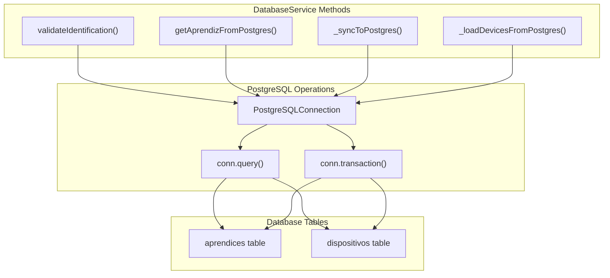
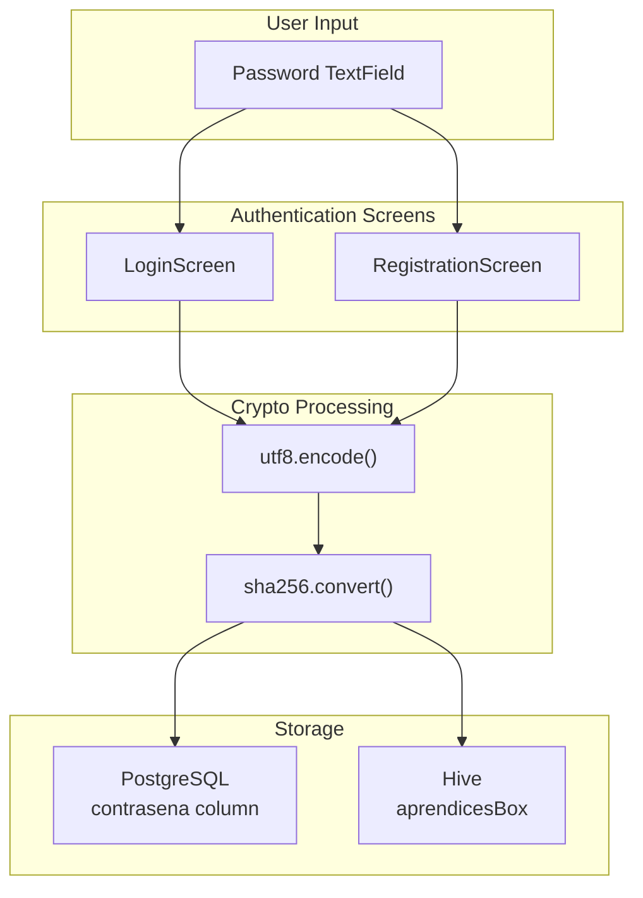
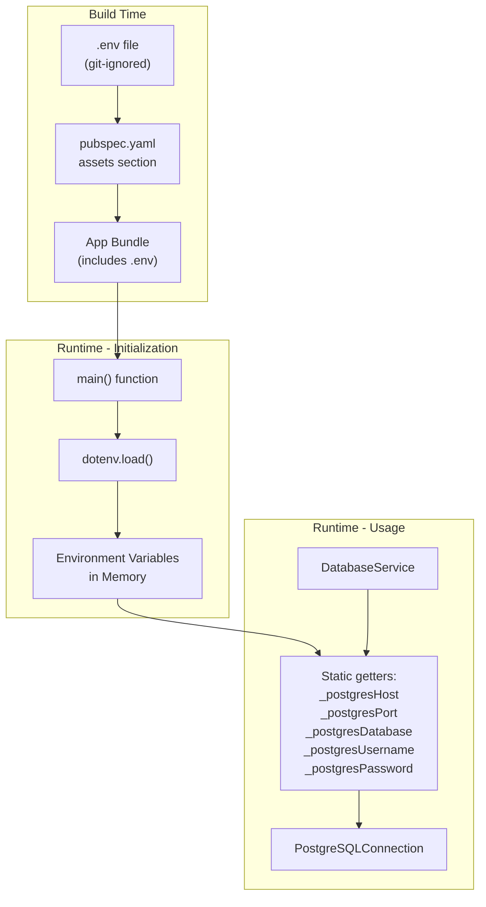
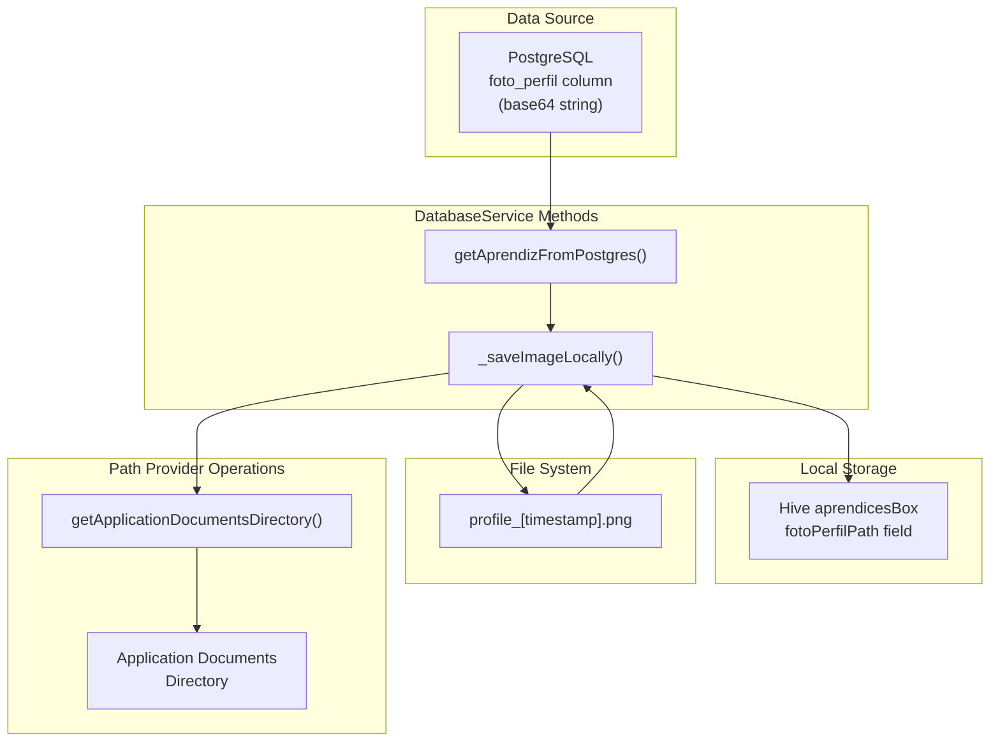
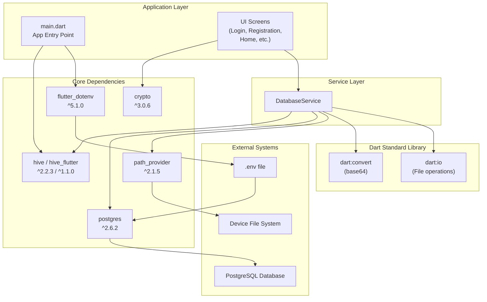

# Core Dependencies

> **Relevant source files**
> * [lib/main.dart](https://github.com/axchisan/AppGestionCarnetsSENA/blob/9eb64390/lib/main.dart)
> * [lib/services/database_service.dart](https://github.com/axchisan/AppGestionCarnetsSENA/blob/9eb64390/lib/services/database_service.dart)
> * [pubspec.yaml](https://github.com/axchisan/AppGestionCarnetsSENA/blob/9eb64390/pubspec.yaml)

## Purpose and Scope

This document provides comprehensive documentation of the essential external packages that form the foundation of the SENA Digital ID Card application's data persistence, security, and configuration systems. These dependencies enable the hybrid offline-first architecture and secure credential management that are central to the application's design.

**Scope**: This page covers the five core runtime dependencies: Hive (local storage), PostgreSQL driver (remote database), crypto (password hashing), flutter_dotenv (environment configuration), and path_provider (file system access).

**Related Pages**: For UI-related packages such as QR code generation and image picking, see [UI and Media Dependencies](/axchisan/AppGestionCarnetsSENA/7.2-ui-and-media-dependencies). For build-time tools like code generators, see [Development Tools](/axchisan/AppGestionCarnetsSENA/7.3-development-tools).

---

## Data Persistence Dependencies

### Hive - Local NoSQL Storage

**Package**: `hive: ^2.2.3` and `hive_flutter: ^1.1.0`

Hive is a lightweight, pure-Dart NoSQL database that provides the local caching layer for offline-first functionality. The application uses Hive to store `Aprendiz` objects locally, enabling full application functionality without internet connectivity.

**Key Characteristics**:

* **Type-safe storage**: Uses generated type adapters for `Aprendiz` and `Dispositivo` models
* **Key-value store**: Uses identification numbers as keys for fast lookup
* **Zero native dependencies**: Pure Dart implementation, no platform channels required
* **Lazy initialization**: Box opened once at application startup

**Integration Points**:

| Component | Usage | File Reference |
| --- | --- | --- |
| Application Entry | Initialize Hive, register adapters, open box | [lib/main.dart L14-L19](https://github.com/axchisan/AppGestionCarnetsSENA/blob/9eb64390/lib/main.dart#L14-L19) |
| DatabaseService | Read/write `Aprendiz` objects to local cache | [lib/services/database_service.dart L19](https://github.com/axchisan/AppGestionCarnetsSENA/blob/9eb64390/lib/services/database_service.dart#L19-L19) |
| Session Detection | Check for existing user session in `aprendicesBox` | SplashScreen uses DatabaseService |
| Logout Flow | Clear Hive box to terminate session | HomeScreen uses DatabaseService |

**Box Configuration**:

```
Box<Aprendiz> _aprendicesBox = Hive.box<Aprendiz>('aprendicesBox');
```

The single box `aprendicesBox` stores all cached `Aprendiz` objects, keyed by `idIdentificacion` (identification number).

**Type Adapters**:
Hive requires type adapters for custom classes. These are registered at startup:

* `AprendizAdapter()` - Serializes/deserializes `Aprendiz` model
* `DispositivoAdapter()` - Serializes/deserializes `Dispositivo` model (nested in `Aprendiz`)

The adapters are code-generated using `hive_generator` (see [Development Tools](/axchisan/AppGestionCarnetsSENA/7.3-development-tools)).

**Sources**: [lib/main.dart L1-L25](https://github.com/axchisan/AppGestionCarnetsSENA/blob/9eb64390/lib/main.dart#L1-L25)

 [lib/services/database_service.dart L1-L10](https://github.com/axchisan/AppGestionCarnetsSENA/blob/9eb64390/lib/services/database_service.dart#L1-L10)

 [pubspec.yaml L18-L19](https://github.com/axchisan/AppGestionCarnetsSENA/blob/9eb64390/pubspec.yaml#L18-L19)

---

### PostgreSQL Driver - Remote Database Access

**Package**: `postgres: ^2.6.2`

The `postgres` package provides the PostgreSQL client driver for connecting to the remote authoritative database. All authentication operations and data synchronization flow through this driver.

**Key Characteristics**:

* **Connection-based**: Each operation opens a new connection, queries, then closes
* **Transaction support**: Uses `conn.transaction()` for atomic operations
* **Parameterized queries**: Uses `substitutionValues` to prevent SQL injection
* **Environment-configured**: Connection parameters loaded from `.env` file

**Connection Configuration**:

The `DatabaseService` constructs connections using environment variables:

| Environment Variable | Purpose | Default Fallback |
| --- | --- | --- |
| `POSTGRES_HOST` | Database server hostname | `'default_host'` |
| `POSTGRES_PORT` | Database server port | `5432` |
| `POSTGRES_DATABASE` | Database name | `'default_db'` |
| `POSTGRES_USERNAME` | Authentication username | `'default_user'` |
| `POSTGRES_PASSWORD` | Authentication password | `'default_password'` |

**Integration Points**:



**Database Schema Requirements**:

The application expects the following table structures:

**aprendices table**:

* `id_identificacion` (PRIMARY KEY, String)
* `nombre_completo` (String)
* `programa_formacion` (String)
* `numero_ficha` (String)
* `tipo_sangre` (String, nullable)
* `foto_perfil` (String/TEXT, base64-encoded image, nullable)
* `contrasena` (String, SHA-256 hash)
* `email` (String, nullable)
* `fecha_registro` (DateTime/TIMESTAMP)

**dispositivos table**:

* `id_dispositivo` (String)
* `id_identificacion` (String, FOREIGN KEY to aprendices)
* `nombre_dispositivo` (String)
* `tipo_dispositivo` (String, nullable)
* `fecha_registro` (DateTime/TIMESTAMP)
* UNIQUE constraint on `(id_identificacion, id_dispositivo)`

**Transaction Pattern**:

The `_syncToPostgres` method demonstrates the transaction pattern used for atomic updates:

1. Upsert apprentice record (INSERT ... ON CONFLICT DO UPDATE)
2. Delete all existing devices for the apprentice
3. Insert all current devices

This ensures data consistency between the `aprendices` and `dispositivos` tables.

**Sources**: [lib/services/database_service.dart L1-L239](https://github.com/axchisan/AppGestionCarnetsSENA/blob/9eb64390/lib/services/database_service.dart#L1-L239)

 [pubspec.yaml L17](https://github.com/axchisan/AppGestionCarnetsSENA/blob/9eb64390/pubspec.yaml#L17-L17)

---

## Security Dependencies

### Crypto Package - Password Hashing

**Package**: `crypto: ^3.0.6`

The `crypto` package provides cryptographic hash functions, specifically SHA-256 for password security. Passwords are hashed client-side before transmission to prevent plain-text exposure.

**Key Characteristics**:

* **One-way hashing**: SHA-256 is non-reversible
* **Consistent output**: Same input always produces same hash
* **Client-side processing**: Hashing occurs in UI screens, not server

**Integration Pattern**:



**Usage Example** (from authentication screens):

1. User enters password in `CustomTextField`
2. Screen encodes password to UTF-8 bytes: `utf8.encode(password)`
3. Screen hashes bytes: `sha256.convert(bytes)`
4. Screen converts to hex string: `hash.toString()`
5. Hex string stored in `Aprendiz.contrasena` field

**Security Properties**:

* **No plain-text storage**: Original password never stored or transmitted
* **Database-level security**: PostgreSQL stores only hashes
* **Authentication verification**: Comparing hashed input against stored hash
* **Replay-safe**: Hash alone cannot be used to derive original password

**Note**: The application uses basic SHA-256 without salting. For production systems, consider using `crypto` with per-user salts or dedicated password hashing algorithms like Argon2 or bcrypt.

**Sources**: [pubspec.yaml L21](https://github.com/axchisan/AppGestionCarnetsSENA/blob/9eb64390/pubspec.yaml#L21-L21)

 LoginScreen and RegistrationScreen implementations (not shown in provided files, but referenced in diagrams)

---

## Configuration Management

### Flutter Dotenv - Environment Variables

**Package**: `flutter_dotenv: ^5.1.0`

The `flutter_dotenv` package loads environment variables from a `.env` file at application startup, enabling secure configuration of database credentials and other sensitive settings without hardcoding them in source code.

**Key Characteristics**:

* **File-based configuration**: Reads from `.env` file in project root
* **Build-time inclusion**: `.env` file included in assets bundle
* **Type-safe access**: Provides `dotenv.env['KEY']` API with null safety
* **Git-ignored**: `.env` excluded from source control via `.gitignore`

**Configuration Flow**:



**DatabaseService Integration**:

The `DatabaseService` defines static getters that access environment variables with fallback defaults:

```javascript
static String get _postgresHost => dotenv.env['POSTGRES_HOST'] ?? 'default_host';
static int get _postgresPort => int.tryParse(dotenv.env['POSTGRES_PORT'] ?? '5432') ?? 5432;
// ... etc
```

This pattern provides:

* **Null safety**: `??` operator provides defaults if variables missing
* **Type conversion**: `int.tryParse()` safely converts port number
* **Centralized access**: All database configuration in one location

**Required Environment Variables**:

The application expects the following variables in `.env`:

```
POSTGRES_HOST=your-database-host
POSTGRES_PORT=5432
POSTGRES_DATABASE=sena_carnets
POSTGRES_USERNAME=postgres
POSTGRES_PASSWORD=your-secure-password
```

**Asset Configuration**:

The `.env` file must be declared in `pubspec.yaml` assets section to be included in the application bundle:

```yaml
flutter:
  assets:
    - .env
```

**Sources**: [lib/main.dart L4-L22](https://github.com/axchisan/AppGestionCarnetsSENA/blob/9eb64390/lib/main.dart#L4-L22)

 [lib/services/database_service.dart L6-L17](https://github.com/axchisan/AppGestionCarnetsSENA/blob/9eb64390/lib/services/database_service.dart#L6-L17)

 [pubspec.yaml L22-L35](https://github.com/axchisan/AppGestionCarnetsSENA/blob/9eb64390/pubspec.yaml#L22-L35)

---

## File System Access

### Path Provider - Application Directories

**Package**: `path_provider: ^2.1.5`

The `path_provider` package provides platform-agnostic access to commonly used file system locations. The application uses it to store profile images downloaded from PostgreSQL's base64-encoded storage.

**Key Characteristics**:

* **Platform-agnostic**: Returns appropriate paths for Android, iOS, etc.
* **Persistent storage**: Files survive app restarts
* **App-specific**: Files isolated from other applications
* **Automatic cleanup**: OS may clear files under storage pressure

**Integration Point**:



**Usage Pattern**:

The `_saveImageLocally` method in `DatabaseService` demonstrates the usage:

1. **Get directory path**: `final dir = await getApplicationDocumentsDirectory();`
2. **Construct file path**: `'${dir.path}/profile_${timestamp}.png'`
3. **Decode base64**: `final bytes = base64Decode(base64String);`
4. **Write file**: `await file.writeAsBytes(bytes);`
5. **Return path**: `return file.path;`

**File Naming Strategy**:

Profile images are named using timestamps to ensure uniqueness:

* Pattern: `profile_[millisecondsSinceEpoch].png`
* Example: `profile_1705923847234.png`

This prevents filename collisions when multiple images are downloaded.

**Storage Location by Platform**:

| Platform | Typical Path |
| --- | --- |
| Android | `/data/data/com.example.sena_carnet_digital/app_flutter/` |
| iOS | `~/Library/Application Support/` |
| Linux | `~/.local/share/sena_carnet_digital/` |

**Memory Management**:

Profile images are stored locally to avoid repeatedly downloading from PostgreSQL. The application stores the file path (not the image data) in Hive, reducing memory usage for cached user data.

**Sources**: [lib/services/database_service.dart L5-L209](https://github.com/axchisan/AppGestionCarnetsSENA/blob/9eb64390/lib/services/database_service.dart#L5-L209)

 [pubspec.yaml L20](https://github.com/axchisan/AppGestionCarnetsSENA/blob/9eb64390/pubspec.yaml#L20-L20)

---

## Dependency Integration Architecture

The following diagram shows how core dependencies integrate with application components:



**Dependency Hierarchy**:

| Dependency | Direct Consumers | Indirect Consumers |
| --- | --- | --- |
| `hive` / `hive_flutter` | `main.dart`, `DatabaseService` | All screens via `DatabaseService` |
| `postgres` | `DatabaseService` | All screens via `DatabaseService` |
| `crypto` | Authentication screens (Login, Registration) | `DatabaseService` (receives hashed passwords) |
| `flutter_dotenv` | `main.dart`, `DatabaseService` | N/A |
| `path_provider` | `DatabaseService` | N/A |

**Sources**: [lib/main.dart L1-L25](https://github.com/axchisan/AppGestionCarnetsSENA/blob/9eb64390/lib/main.dart#L1-L25)

 [lib/services/database_service.dart L1-L10](https://github.com/axchisan/AppGestionCarnetsSENA/blob/9eb64390/lib/services/database_service.dart#L1-L10)

 [pubspec.yaml L9-L22](https://github.com/axchisan/AppGestionCarnetsSENA/blob/9eb64390/pubspec.yaml#L9-L22)

---

## Version Management and Compatibility

### Specified Versions

All core dependencies use caret syntax (`^`) for semantic versioning, allowing automatic minor and patch updates while preventing breaking changes:

| Package | Version | Semantic Meaning |
| --- | --- | --- |
| `hive` | `^2.2.3` | `>=2.2.3 <3.0.0` |
| `hive_flutter` | `^1.1.0` | `>=1.1.0 <2.0.0` |
| `postgres` | `^2.6.2` | `>=2.6.2 <3.0.0` |
| `crypto` | `^3.0.6` | `>=3.0.6 <4.0.0` |
| `flutter_dotenv` | `^5.1.0` | `>=5.1.0 <6.0.0` |
| `path_provider` | `^2.1.5` | `>=2.1.5 <3.0.0` |

### Dart SDK Constraint

The application requires Dart SDK `>=3.8.1 <4.0.0`, ensuring compatibility with null-safety features and modern language constructs used throughout the codebase.

### Critical Compatibility Notes

1. **Hive and hive_flutter**: Must use matching major versions. The `hive_flutter` package provides Flutter-specific initialization (`Hive.initFlutter()`) that wraps core `hive` functionality.
2. **Hive and hive_generator**: The generator version (see [Development Tools](/axchisan/AppGestionCarnetsSENA/7.3-development-tools)) must be compatible with the runtime `hive` version for type adapter generation.
3. **postgres package**: Version 2.6.2 uses connection-based model. Future major versions may introduce connection pooling or async/await pattern changes.
4. **path_provider**: Platform-specific implementations may vary. Android requires minimum SDK version 19 (Android 4.4).

### Dependency Resolution

Dependencies are resolved and locked via `pubspec.lock` (not shown). To update dependencies:

```
flutter pub upgrade
```

To verify compatibility issues:

```
flutter pub outdated
```

**Sources**: [pubspec.yaml L6-L22](https://github.com/axchisan/AppGestionCarnetsSENA/blob/9eb64390/pubspec.yaml#L6-L22)

---

## Summary

The five core dependencies form a cohesive architecture supporting the application's hybrid offline-first design:

* **Hive**: Provides fast, type-safe local storage for offline operation
* **PostgreSQL driver**: Connects to authoritative remote database for authentication and synchronization
* **Crypto**: Secures passwords through SHA-256 client-side hashing
* **Flutter Dotenv**: Manages sensitive configuration outside source control
* **Path Provider**: Enables cross-platform file storage for profile images

All dependencies integrate through the `DatabaseService` abstraction layer, isolating UI screens from direct dependency usage and enabling future migration or replacement without widespread code changes.

**Sources**: [lib/services/database_service.dart L1-L239](https://github.com/axchisan/AppGestionCarnetsSENA/blob/9eb64390/lib/services/database_service.dart#L1-L239)

 [lib/main.dart L1-L25](https://github.com/axchisan/AppGestionCarnetsSENA/blob/9eb64390/lib/main.dart#L1-L25)

 [pubspec.yaml L1-L44](https://github.com/axchisan/AppGestionCarnetsSENA/blob/9eb64390/pubspec.yaml#L1-L44)