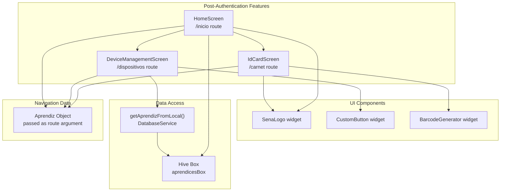
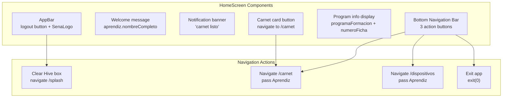
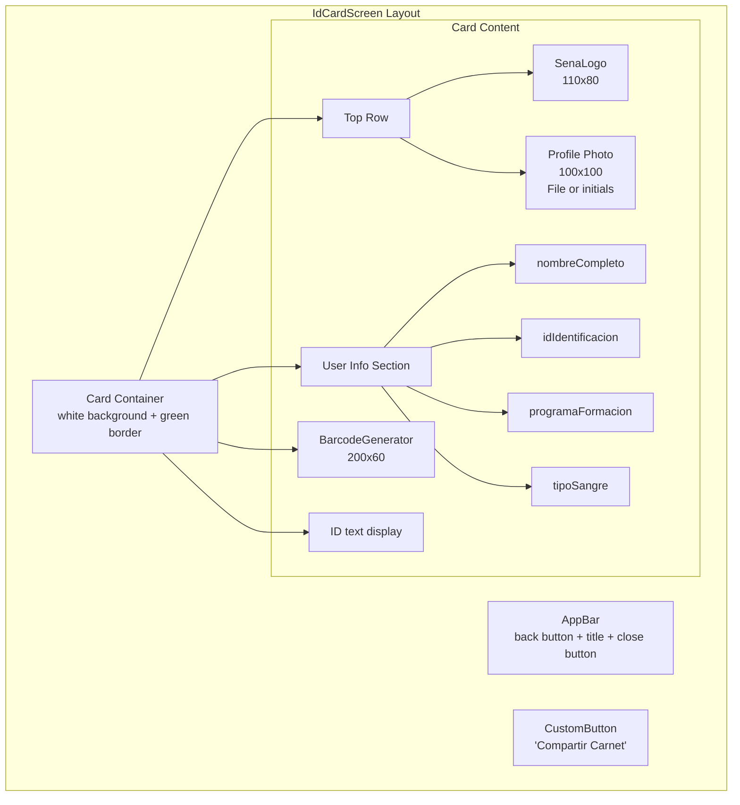
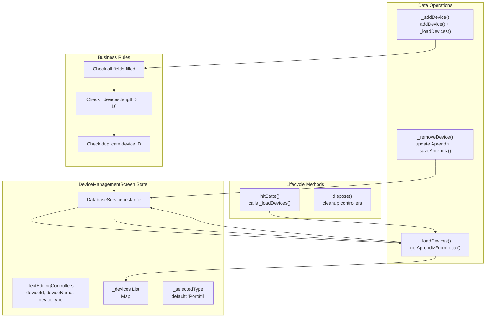
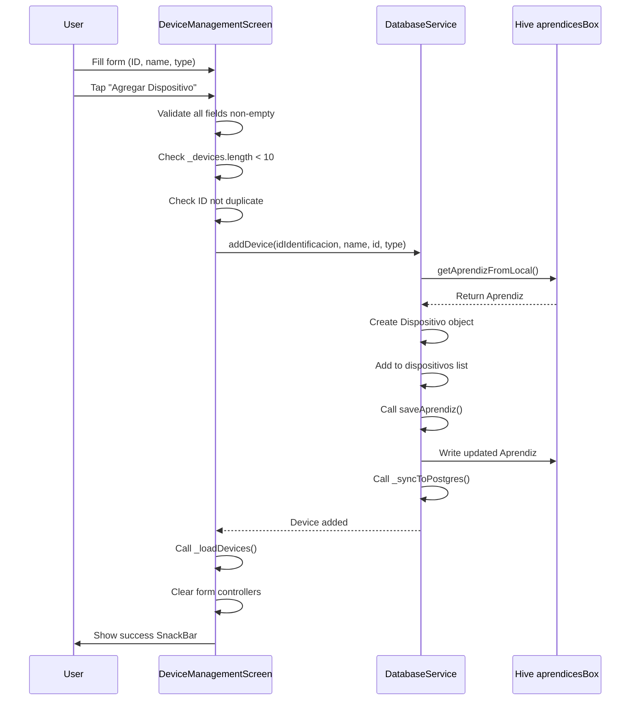

# Core Features

> **Relevant source files**
> * [lib/screens/device_management_screen.dart](https://github.com/axchisan/AppGestionCarnetsSENA/blob/9eb64390/lib/screens/device_management_screen.dart)
> * [lib/screens/home_screen.dart](https://github.com/axchisan/AppGestionCarnetsSENA/blob/9eb64390/lib/screens/home_screen.dart)
> * [lib/screens/id_card_screen.dart](https://github.com/axchisan/AppGestionCarnetsSENA/blob/9eb64390/lib/screens/id_card_screen.dart)

## Purpose and Scope

This document provides technical documentation for the three primary feature screens available to authenticated users in the SENA Digital ID Card application: the home dashboard, virtual ID card display, and device management system. These features represent the core post-authentication functionality and are accessible after successful login or registration.

For information about the authentication process that precedes access to these features, see [Authentication System](/axchisan/AppGestionCarnetsSENA/4-authentication-system). For details on how data persistence supports these features, see [Data Persistence Layer](/axchisan/AppGestionCarnetsSENA/3.1-data-persistence-layer).

## Feature Overview

The application provides three main features to authenticated apprentices, all accessed through a central home screen:

| Feature | Screen Class | Route | Primary Purpose |
| --- | --- | --- | --- |
| Home Dashboard | `HomeScreen` | `/inicio` | Central navigation hub, profile display, session management |
| Virtual ID Card | `IdCardScreen` | `/carnet` | Display digital identification with barcode |
| Device Management | `DeviceManagementScreen` | `/dispositivos` | Register and manage personal devices |

All feature screens receive an `Aprendiz` object as a navigation argument, containing the authenticated user's profile data and registered devices. The screens operate in an offline-first mode, reading from local Hive storage through `DatabaseService` methods.



**Sources:** [lib/screens/home_screen.dart L1-L301](https://github.com/axchisan/AppGestionCarnetsSENA/blob/9eb64390/lib/screens/home_screen.dart#L1-L301)

 [lib/screens/id_card_screen.dart L1-L194](https://github.com/axchisan/AppGestionCarnetsSENA/blob/9eb64390/lib/screens/id_card_screen.dart#L1-L194)

 [lib/screens/device_management_screen.dart L1-L474](https://github.com/axchisan/AppGestionCarnetsSENA/blob/9eb64390/lib/screens/device_management_screen.dart#L1-L474)

## Home Dashboard Navigation

### Screen Architecture

The `HomeScreen` class serves as the central navigation hub after authentication. It displays user profile information and provides navigation to other feature screens through both the main content area and a bottom navigation bar.



**Sources:** [lib/screens/home_screen.dart L23-L258](https://github.com/axchisan/AppGestionCarnetsSENA/blob/9eb64390/lib/screens/home_screen.dart#L23-L258)

### Data Loading Strategy

The `HomeScreen` implements a fallback data loading pattern that prioritizes navigation arguments but falls back to Hive storage:

[lib/screens/home_screen.dart L15-L16](https://github.com/axchisan/AppGestionCarnetsSENA/blob/9eb64390/lib/screens/home_screen.dart#L15-L16)

```
final box = Hive.box<Aprendiz>('aprendicesBox');
final primerAprendiz = aprendiz ?? (box.values.isNotEmpty ? box.values.first : null);
```

This pattern ensures the screen can function whether accessed via:

* Direct navigation with an `Aprendiz` argument (from login/registration)
* Deep linking or state restoration without arguments (reads from Hive)

### Logout Functionality

The logout mechanism clears the local session and redirects to the splash screen:

[lib/screens/home_screen.dart L18-L21](https://github.com/axchisan/AppGestionCarnetsSENA/blob/9eb64390/lib/screens/home_screen.dart#L18-L21)

```
void _logout() async {
  await box.clear();
  Navigator.pushReplacementNamed(context, '/splash');
}
```

The `box.clear()` operation removes all `Aprendiz` objects from the Hive box, invalidating the local session. The splash screen will detect the absence of session data and redirect to the login screen.

### Bottom Navigation Bar

The bottom navigation bar provides quick access to core features through three buttons:

| Button | Icon | Action | Implementation |
| --- | --- | --- | --- |
| Carnet | `Icons.credit_card` | Navigate to `/carnet` | [lib/screens/home_screen.dart L230-L236](https://github.com/axchisan/AppGestionCarnetsSENA/blob/9eb64390/lib/screens/home_screen.dart#L230-L236) |
| Dispositivos | `Icons.devices` | Navigate to `/dispositivos` | [lib/screens/home_screen.dart L237-L243](https://github.com/axchisan/AppGestionCarnetsSENA/blob/9eb64390/lib/screens/home_screen.dart#L237-L243) |
| Cerrar | `Icons.close` | Exit application | [lib/screens/home_screen.dart L244-L251](https://github.com/axchisan/AppGestionCarnetsSENA/blob/9eb64390/lib/screens/home_screen.dart#L244-L251) |

The navigation implementation uses the `_buildBottomNavItem` helper method [lib/screens/home_screen.dart L260-L300](https://github.com/axchisan/AppGestionCarnetsSENA/blob/9eb64390/lib/screens/home_screen.dart#L260-L300)

 which constructs `GestureDetector` widgets that invoke `Navigator.pushNamed()` with the `Aprendiz` argument.

**Sources:** [lib/screens/home_screen.dart L220-L257](https://github.com/axchisan/AppGestionCarnetsSENA/blob/9eb64390/lib/screens/home_screen.dart#L220-L257)

 [lib/screens/home_screen.dart L260-L300](https://github.com/axchisan/AppGestionCarnetsSENA/blob/9eb64390/lib/screens/home_screen.dart#L260-L300)

## Virtual ID Card Display

### Card Generation and Layout

The `IdCardScreen` renders a digital identification card with the SENA branding, user profile information, and a scannable barcode. The screen receives an `Aprendiz` object as a required parameter through navigation arguments.



**Sources:** [lib/screens/id_card_screen.dart L41-L175](https://github.com/axchisan/AppGestionCarnetsSENA/blob/9eb64390/lib/screens/id_card_screen.dart#L41-L175)

### Profile Photo Handling

The screen implements a conditional rendering pattern for profile photos:

[lib/screens/id_card_screen.dart L88-L99](https://github.com/axchisan/AppGestionCarnetsSENA/blob/9eb64390/lib/screens/id_card_screen.dart#L88-L99)

```javascript
child: aprendiz?.fotoPerfilPath != null && File(aprendiz!.fotoPerfilPath!).existsSync()
    ? Image.file(File(aprendiz!.fotoPerfilPath!), fit: BoxFit.cover)
    : const Center(
        child: Text(
          'JC',
          style: TextStyle(
            color: AppColors.senaGreen,
            fontSize: 32,
            fontWeight: FontWeight.bold,
          ),
        ),
      ),
```

The logic checks both the presence of `fotoPerfilPath` and the physical existence of the file on the filesystem. If either check fails, it displays initials as a fallback placeholder.

### Barcode Generation

The `BarcodeGenerator` widget generates a scannable barcode from the apprentice's identification number:

[lib/screens/id_card_screen.dart L156-L169](https://github.com/axchisan/AppGestionCarnetsSENA/blob/9eb64390/lib/screens/id_card_screen.dart#L156-L169)

```javascript
BarcodeGenerator(
  data: aprendiz?.idIdentificacion ?? 'N/A',
  width: 200,
  height: 60,
),
const SizedBox(height: 8),
Text(
  aprendiz?.idIdentificacion ?? 'N/A',
  style: const TextStyle(
    color: AppColors.black,
    fontSize: 12,
    fontFamily: 'monospace',
  ),
),
```

The barcode uses the `idIdentificacion` field as its data source, with the numeric ID displayed below in monospace font for manual verification. For implementation details of the `BarcodeGenerator` widget, see [Branding and Visual Components](/axchisan/AppGestionCarnetsSENA/6.2-branding-and-visual-components).

### Information Display Fields

The card displays the following data fields from the `Aprendiz` model:

| Field | Aprendiz Property | Display Label |
| --- | --- | --- |
| Full Name | `nombreCompleto` | No label (bold, 20px) |
| ID Number | `idIdentificacion` | "ID: " prefix |
| Program | `programaFormacion` | No label (14px) |
| Blood Type | `tipoSangre` | "Tipo de Sangre: " prefix (conditional) |

The blood type field is conditionally rendered only if the property is non-null [lib/screens/id_card_screen.dart L142-L151](https://github.com/axchisan/AppGestionCarnetsSENA/blob/9eb64390/lib/screens/id_card_screen.dart#L142-L151)

**Sources:** [lib/screens/id_card_screen.dart L104-L154](https://github.com/axchisan/AppGestionCarnetsSENA/blob/9eb64390/lib/screens/id_card_screen.dart#L104-L154)

 [lib/screens/id_card_screen.dart L156-L169](https://github.com/axchisan/AppGestionCarnetsSENA/blob/9eb64390/lib/screens/id_card_screen.dart#L156-L169)

## Device Management System

### Screen Architecture and State Management

The `DeviceManagementScreen` is a stateful widget that manages a list of registered devices for the authenticated apprentice. The screen maintains three `TextEditingController` instances for form inputs and a local `_devices` list for UI display.



**Sources:** [lib/screens/device_management_screen.dart L17-L42](https://github.com/axchisan/AppGestionCarnetsSENA/blob/9eb64390/lib/screens/device_management_screen.dart#L17-L42)

 [lib/screens/device_management_screen.dart L44-L65](https://github.com/axchisan/AppGestionCarnetsSENA/blob/9eb64390/lib/screens/device_management_screen.dart#L44-L65)

### Device Loading Implementation

The `_loadDevices()` method retrieves the current user's device list from local storage:

[lib/screens/device_management_screen.dart L44-L65](https://github.com/axchisan/AppGestionCarnetsSENA/blob/9eb64390/lib/screens/device_management_screen.dart#L44-L65)

```javascript
Future<void> _loadDevices() async {
  if (widget.aprendiz != null) {
    final aprendiz = await _dbService.getAprendizFromLocal(
      widget.aprendiz!.idIdentificacion,
    );
    if (aprendiz != null) {
      setState(() {
        _devices.clear();
        _devices.addAll(
          aprendiz.dispositivos.map(
            (d) => {
              'name': d.nombreDispositivo,
              'id': d.idDispositivo,
              'type': d.tipoDispositivo ?? 'Otro',
              'icon': _getIconForType(d.tipoDispositivo ?? 'Otro'),
            },
          ),
        );
      });
    }
  }
}
```

The method transforms each `Dispositivo` object from the `Aprendiz.dispositivos` list into a display map containing the device name, ID, type, and corresponding icon.

### Business Rules Enforcement

The device addition process enforces two critical business rules:

**Maximum Device Limit (10 devices):**
[lib/screens/device_management_screen.dart L79-L87](https://github.com/axchisan/AppGestionCarnetsSENA/blob/9eb64390/lib/screens/device_management_screen.dart#L79-L87)

```javascript
if (_devices.length >= _maxDevices) {
  ScaffoldMessenger.of(context).showSnackBar(
    const SnackBar(
      content: Text('Has alcanzado el límite de 10 dispositivos'),
      backgroundColor: AppColors.red,
    ),
  );
  return;
}
```

**Unique Device ID Constraint:**
[lib/screens/device_management_screen.dart L89-L97](https://github.com/axchisan/AppGestionCarnetsSENA/blob/9eb64390/lib/screens/device_management_screen.dart#L89-L97)

```javascript
if (_devices.any((d) => d['id'] == _deviceIdController.text.trim())) {
  ScaffoldMessenger.of(context).showSnackBar(
    const SnackBar(
      content: Text('El ID del dispositivo ya está registrado'),
      backgroundColor: AppColors.red,
    ),
  );
  return;
}
```

### Device Addition Flow

The `_addDevice()` method implements the complete device registration flow:



**Sources:** [lib/screens/device_management_screen.dart L75-L127](https://github.com/axchisan/AppGestionCarnetsSENA/blob/9eb64390/lib/screens/device_management_screen.dart#L75-L127)

The `DatabaseService.addDevice()` method handles the persistence logic, updating both the local Hive box and triggering PostgreSQL synchronization. For details on this synchronization mechanism, see [DatabaseService Reference](/axchisan/AppGestionCarnetsSENA/3.1.1-databaseservice-reference).

### Device Removal Flow

Device removal requires user confirmation through an `AlertDialog` before executing the deletion:

[lib/screens/device_management_screen.dart L129-L187](https://github.com/axchisan/AppGestionCarnetsSENA/blob/9eb64390/lib/screens/device_management_screen.dart#L129-L187)

```javascript
void _removeDevice(int index) async {
  if (widget.aprendiz != null) {
    showDialog(
      context: context,
      builder: (BuildContext context) {
        return AlertDialog(
          title: const Text('Eliminar Dispositivo'),
          content: Text(
            '¿Estás seguro de que quieres eliminar "${_devices[index]['name']}"?',
          ),
          actions: [
            TextButton(
              onPressed: () => Navigator.of(context).pop(),
              child: const Text('Cancelar'),
            ),
            TextButton(
              onPressed: () async {
                final deviceId = _devices[index]['id'];
                final aprendiz = await _dbService.getAprendizFromLocal(
                  widget.aprendiz!.idIdentificacion,
                );
                if (aprendiz != null) {
                  final updatedDispositivos = aprendiz.dispositivos
                      .where((d) => d.idDispositivo != deviceId)
                      .toList();
                  final updatedAprendiz = Aprendiz(...);
                  await _dbService.saveAprendiz(updatedAprendiz);
                  await _loadDevices();
                }
                Navigator.of(context).pop();
                ScaffoldMessenger.of(context).showSnackBar(...);
              },
              child: const Text('Eliminar', ...),
            ),
          ],
        );
      },
    );
  }
}
```

The removal process:

1. Displays confirmation dialog with device name
2. Retrieves current `Aprendiz` from local storage
3. Filters out the target device using `where((d) => d.idDispositivo != deviceId)`
4. Creates a new `Aprendiz` object with updated `dispositivos` list
5. Saves the updated object through `DatabaseService.saveAprendiz()`
6. Reloads the device list to refresh the UI

### Device Type System

The screen supports eight predefined device types, each mapped to a Material Design icon:

[lib/screens/device_management_screen.dart L24-L33](https://github.com/axchisan/AppGestionCarnetsSENA/blob/9eb64390/lib/screens/device_management_screen.dart#L24-L33)

```
final List<String> _deviceTypes = [
  'Portátil',
  'Tablet',
  'Teléfono',
  'Cargador',
  'Mouse',
  'Teclado',
  'Audífonos',
  'Otro',
];
```

The `_getIconForType()` method maps device types to icons [lib/screens/device_management_screen.dart L189-L208](https://github.com/axchisan/AppGestionCarnetsSENA/blob/9eb64390/lib/screens/device_management_screen.dart#L189-L208)

:

| Device Type | Icon | IconData Constant |
| --- | --- | --- |
| Portátil | Laptop | `Icons.laptop` |
| Tablet | Tablet | `Icons.tablet` |
| Teléfono | Smartphone | `Icons.smartphone` |
| Cargador | Power | `Icons.power` |
| Mouse | Mouse | `Icons.mouse` |
| Teclado | Keyboard | `Icons.keyboard` |
| Audífonos | Headphones | `Icons.headphones` |
| Otro | Generic | `Icons.devices` |

The device type is selected through a `DropdownButtonFormField` [lib/screens/device_management_screen.dart L390-L432](https://github.com/axchisan/AppGestionCarnetsSENA/blob/9eb64390/lib/screens/device_management_screen.dart#L390-L432)

 that displays both the icon and type name for each option.

**Sources:** [lib/screens/device_management_screen.dart L189-L208](https://github.com/axchisan/AppGestionCarnetsSENA/blob/9eb64390/lib/screens/device_management_screen.dart#L189-L208)

 [lib/screens/device_management_screen.dart L390-L432](https://github.com/axchisan/AppGestionCarnetsSENA/blob/9eb64390/lib/screens/device_management_screen.dart#L390-L432)

### Form Layout and User Interface

The screen implements a scrollable layout with two main sections:

**Registered Devices Section:**

* Fixed height `SizedBox` (200px) containing a `ListView.builder`
* Each device rendered as a card with icon, name, ID, type, and delete button
* Empty state displays "No tienes dispositivos registrados" message
* Implementation: [lib/screens/device_management_screen.dart L262-L335](https://github.com/axchisan/AppGestionCarnetsSENA/blob/9eb64390/lib/screens/device_management_screen.dart#L262-L335)

**Add New Device Form:**

* Three input fields: device ID (serial), device name, and device type dropdown
* All fields use SENA green borders for visual consistency
* Submit button uses `CustomButton` widget with add icon
* Information banner below form explains the feature purpose
* Implementation: [lib/screens/device_management_screen.dart L337-L463](https://github.com/axchisan/AppGestionCarnetsSENA/blob/9eb64390/lib/screens/device_management_screen.dart#L337-L463)

The form uses standard Flutter `TextField` widgets with custom `InputDecoration` styling [lib/screens/device_management_screen.dart L346-L388](https://github.com/axchisan/AppGestionCarnetsSENA/blob/9eb64390/lib/screens/device_management_screen.dart#L346-L388)

 rather than the application's `CustomTextField` component, allowing for specific placeholder text and validation feedback.

**Sources:** [lib/screens/device_management_screen.dart L210-L474](https://github.com/axchisan/AppGestionCarnetsSENA/blob/9eb64390/lib/screens/device_management_screen.dart#L210-L474)