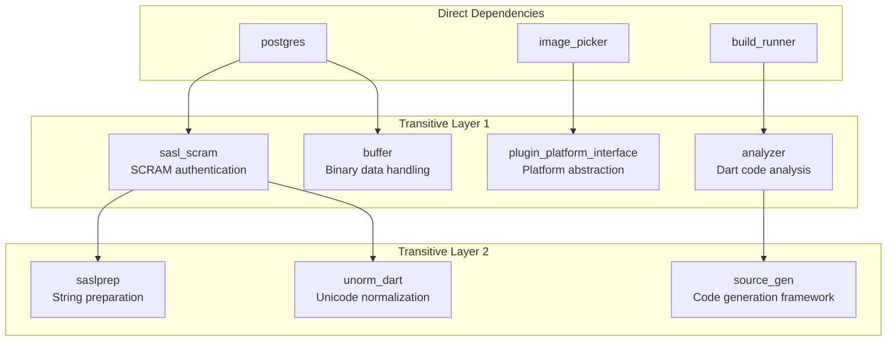

# Dependencies and External Packages

> **Relevant source files**
> * [lib/main.dart](https://github.com/axchisan/AppGestionCarnetsSENA/blob/9eb64390/lib/main.dart)
> * [pubspec.lock](https://github.com/axchisan/AppGestionCarnetsSENA/blob/9eb64390/pubspec.lock)
> * [pubspec.yaml](https://github.com/axchisan/AppGestionCarnetsSENA/blob/9eb64390/pubspec.yaml)

This document provides a comprehensive overview of all external packages and libraries used in the SENA Digital ID Card application, including their purposes, versions, integration points in the codebase, and relationships with application components. This page covers both runtime and development dependencies.

For specific implementation details of data persistence using Hive and PostgreSQL, see [Data Persistence Layer](/axchisan/AppGestionCarnetsSENA/3.1-data-persistence-layer). For Android platform-specific configuration related to permissions required by these packages, see [Android Platform Configuration](/axchisan/AppGestionCarnetsSENA/8-android-platform-configuration).

---

## Overview

The application uses **12 direct runtime dependencies** and **3 development dependencies** to implement its core functionality. The dependency architecture follows a layered approach where data-layer packages (`hive`, `postgres`, `crypto`) are abstracted by the `DatabaseService`, UI packages (`qr_flutter`, `barcode_widget`, `image_picker`) are consumed by screen components, and configuration packages (`flutter_dotenv`, `path_provider`) support application initialization.

All dependencies are managed through [pubspec.yaml L1-L44](https://github.com/axchisan/AppGestionCarnetsSENA/blob/9eb64390/pubspec.yaml#L1-L44)

 and resolved in [pubspec.lock L1-L952](https://github.com/axchisan/AppGestionCarnetsSENA/blob/9eb64390/pubspec.lock#L1-L952)

 Application initialization occurs in [main.dart L14-L25](https://github.com/axchisan/AppGestionCarnetsSENA/blob/9eb64390/main.dart#L14-L25)

 where core packages are configured before app launch.

**Sources:** [pubspec.yaml L1-L44](https://github.com/axchisan/AppGestionCarnetsSENA/blob/9eb64390/pubspec.yaml#L1-L44)

 [main.dart L1-L75](https://github.com/axchisan/AppGestionCarnetsSENA/blob/9eb64390/main.dart#L1-L75)

---

## Dependency Architecture

```

```

**Dependency Integration Architecture**

This diagram shows how application code integrates with external packages. The `DatabaseService` acts as the abstraction layer for all data dependencies, while screen components directly consume UI packages. Code generation dependencies create type adapters at build time that are registered at runtime in `main.dart`.

**Sources:** [pubspec.yaml L9-L22](https://github.com/axchisan/AppGestionCarnetsSENA/blob/9eb64390/pubspec.yaml#L9-L22)

 [main.dart L14-L25](https://github.com/axchisan/AppGestionCarnetsSENA/blob/9eb64390/main.dart#L14-L25)

 [pubspec.yaml L24-L29](https://github.com/axchisan/AppGestionCarnetsSENA/blob/9eb64390/pubspec.yaml#L24-L29)

---

## Runtime Dependencies

### Core Data and Storage Packages

| Package | Version | Purpose | Integration Point |
| --- | --- | --- | --- |
| `hive` | ^2.2.3 | NoSQL local database for offline storage | [main.dart L16](https://github.com/axchisan/AppGestionCarnetsSENA/blob/9eb64390/main.dart#L16-L16) <br>  - `Hive.initFlutter()` |
| `hive_flutter` | ^1.1.0 | Flutter-specific Hive extensions | [main.dart L16](https://github.com/axchisan/AppGestionCarnetsSENA/blob/9eb64390/main.dart#L16-L16) <br>  - initialization helper |
| `postgres` | ^2.6.2 | PostgreSQL driver for remote database | `DatabaseService._connectToPostgres()` |
| `crypto` | ^3.0.6 | SHA-256 password hashing | `DatabaseService` authentication methods |
| `flutter_dotenv` | ^5.1.0 | Environment variable management | [main.dart L22](https://github.com/axchisan/AppGestionCarnetsSENA/blob/9eb64390/main.dart#L22-L22) <br>  - `dotenv.load()` |
| `path_provider` | ^2.1.5 | Platform-specific directory paths | Required by Hive for storage location |

### UI and Media Packages

| Package | Version | Purpose | Integration Point |
| --- | --- | --- | --- |
| `qr_flutter` | ^4.1.0 | QR code and barcode generation | `IdCardScreen` - display user ID barcode |
| `barcode_widget` | ^2.0.3 | Additional barcode format support | `IdCardScreen` - Code 128 barcode rendering |
| `image_picker` | ^1.0.4 | Camera and gallery image selection | `RegistrationScreen` - profile photo upload |
| `cupertino_icons` | ^1.0.2 | iOS-style icon set | Cross-platform icon support |
| `flutter_launcher_icons` | ^0.13.1 | App icon generation for Android/iOS | Build-time configuration in [pubspec.yaml L37-L42](https://github.com/axchisan/AppGestionCarnetsSENA/blob/9eb64390/pubspec.yaml#L37-L42) |

**Sources:** [pubspec.yaml L9-L22](https://github.com/axchisan/AppGestionCarnetsSENA/blob/9eb64390/pubspec.yaml#L9-L22)

---

## Development Dependencies

### Build Tools and Code Generation

| Package | Version | Purpose | Workflow |
| --- | --- | --- | --- |
| `hive_generator` | ^2.0.1 | Generates Hive type adapters | Reads `@HiveType` annotations from `models.dart` |
| `build_runner` | ^2.4.6 | Executes code generation | Command: `flutter pub run build_runner build` |
| `flutter_lints` | ^5.0.0 | Official Dart/Flutter linting rules | Static analysis during development |

**Sources:** [pubspec.yaml L24-L29](https://github.com/axchisan/AppGestionCarnetsSENA/blob/9eb64390/pubspec.yaml#L24-L29)

---

## Initialization Sequence

```

```

**Application Initialization Flow**

This sequence diagram shows the exact order of dependency initialization in [main.dart L14-L25](https://github.com/axchisan/AppGestionCarnetsSENA/blob/9eb64390/main.dart#L14-L25)

 The `WidgetsFlutterBinding` must be initialized first, followed by Hive setup (initialization → adapter registration → box opening), then environment variable loading, and finally the Flutter app launch.

**Sources:** [main.dart L14-L25](https://github.com/axchisan/AppGestionCarnetsSENA/blob/9eb64390/main.dart#L14-L25)

---

## Package Integration Patterns

### Pattern 1: Direct Service Layer Integration

Packages `hive`, `postgres`, and `crypto` are exclusively accessed through `DatabaseService`, never directly by UI code. This encapsulation enables the hybrid persistence strategy to remain transparent to application screens.

```
DatabaseService methods use:
  - Hive.box<Aprendiz>('aprendicesBox') for local operations
  - PostgreSQLConnection(...) for remote operations
  - sha256.convert(utf8.encode(password)) for security
```

**Sources:** Referenced in diagrams 1, 2, and 5 from high-level architecture

### Pattern 2: Direct Widget Integration

UI packages like `qr_flutter`, `barcode_widget`, and `image_picker` are directly consumed by screen widgets without abstraction layers, as they provide Flutter-native widgets and platform interfaces.

**Sources:** [pubspec.yaml L14-L16](https://github.com/axchisan/AppGestionCarnetsSENA/blob/9eb64390/pubspec.yaml#L14-L16)

### Pattern 3: Code Generation Pipeline

The `hive_generator` package generates type adapters at build time based on annotations in [models/models.dart](https://github.com/axchisan/AppGestionCarnetsSENA/blob/9eb64390/models/models.dart)

 These generated adapters in `models.g.dart` are then registered at runtime in [main.dart L17-L18](https://github.com/axchisan/AppGestionCarnetsSENA/blob/9eb64390/main.dart#L17-L18)

```
Development workflow:
1. Annotate classes with @HiveType and @HiveField in models.dart
2. Run: flutter pub run build_runner build
3. Generated: models.g.dart containing AprendizAdapter and DispositivoAdapter
4. Register adapters in main.dart before opening Hive boxes
```

**Sources:** [main.dart L17-L18](https://github.com/axchisan/AppGestionCarnetsSENA/blob/9eb64390/main.dart#L17-L18)

 referenced in Diagram 4 from high-level architecture

---

## Transitive Dependencies

The application has **87 transitive dependencies** resolved in [pubspec.lock L1-L952](https://github.com/axchisan/AppGestionCarnetsSENA/blob/9eb64390/pubspec.lock#L1-L952)

 Key transitive dependency chains include:

### Critical Transitive Dependencies



**Major Transitive Dependency Chains**

* **PostgreSQL chain**: `postgres` → `sasl_scram` (v0.1.1) → `saslprep` (v1.0.3) provides SCRAM-SHA-256 authentication for secure database connections
* **Image picker chain**: `image_picker` → platform-specific implementations (`image_picker_android`, `image_picker_ios`, etc.) → `plugin_platform_interface` enables cross-platform media access
* **Code generation chain**: `build_runner` → `analyzer` (v6.11.0) → `source_gen` (v1.5.0) powers the Hive type adapter generation

**Sources:** [pubspec.lock L704-L711](https://github.com/axchisan/AppGestionCarnetsSENA/blob/9eb64390/pubspec.lock#L704-L711)

 (postgres), [pubspec.lock L432-L439](https://github.com/axchisan/AppGestionCarnetsSENA/blob/9eb64390/pubspec.lock#L432-L439)

 (image_picker), [pubspec.lock L113-L120](https://github.com/axchisan/AppGestionCarnetsSENA/blob/9eb64390/pubspec.lock#L113-L120)

 (build_runner)

---

## Environment Configuration

The `flutter_dotenv` package loads environment variables from the `.env` file, which contains sensitive configuration:

```
Variables loaded at runtime:
  - Database host, port, database name
  - Database username and password
  - Other environment-specific settings
```

The `.env` file is:

* Included in build assets via [pubspec.yaml L35](https://github.com/axchisan/AppGestionCarnetsSENA/blob/9eb64390/pubspec.yaml#L35-L35)  (`- .env`)
* Excluded from version control (`.gitignore` ensures security)
* Loaded synchronously in [main.dart L22](https://github.com/axchisan/AppGestionCarnetsSENA/blob/9eb64390/main.dart#L22-L22)  before app initialization

**Sources:** [main.dart L4](https://github.com/axchisan/AppGestionCarnetsSENA/blob/9eb64390/main.dart#L4-L4)

 [main.dart L22](https://github.com/axchisan/AppGestionCarnetsSENA/blob/9eb64390/main.dart#L22-L22)

 [pubspec.yaml L35](https://github.com/axchisan/AppGestionCarnetsSENA/blob/9eb64390/pubspec.yaml#L35-L35)

---

## Version Constraints and SDK Requirements

The application specifies strict SDK and Flutter version requirements:

| Constraint | Version | Defined In |
| --- | --- | --- |
| Dart SDK | >=3.8.1 <4.0.0 | [pubspec.yaml L7](https://github.com/axchisan/AppGestionCarnetsSENA/blob/9eb64390/pubspec.yaml#L7-L7) |
| Flutter SDK | >=3.27.0 | [pubspec.lock L951](https://github.com/axchisan/AppGestionCarnetsSENA/blob/9eb64390/pubspec.lock#L951-L951) <br>  (resolved) |

These constraints ensure compatibility with:

* Dart 3.x language features (macros, patterns, records)
* Flutter 3.27+ material design and APIs
* Modern async/await patterns and null safety

**Package version pinning strategy:**

* Use caret syntax (^) for minor version updates: `hive: ^2.2.3` allows 2.2.x but not 3.0.0
* Enables security patches and bug fixes while preventing breaking changes
* Lock file [pubspec.lock](https://github.com/axchisan/AppGestionCarnetsSENA/blob/9eb64390/pubspec.lock)  ensures reproducible builds across environments

**Sources:** [pubspec.yaml L6-L7](https://github.com/axchisan/AppGestionCarnetsSENA/blob/9eb64390/pubspec.yaml#L6-L7)

 [pubspec.lock L949-L951](https://github.com/axchisan/AppGestionCarnetsSENA/blob/9eb64390/pubspec.lock#L949-L951)

---

## Platform-Specific Dependency Requirements

### Android Permissions Required

Several packages require Android manifest permissions for functionality:

| Package | Required Permissions | Purpose |
| --- | --- | --- |
| `image_picker` | `CAMERA`, `READ_EXTERNAL_STORAGE`, `WRITE_EXTERNAL_STORAGE` | Camera access and file storage |
| `hive_flutter` | `WRITE_EXTERNAL_STORAGE` (implicit via path_provider) | Local database storage |
| `postgres` | `INTERNET` | Network access to PostgreSQL server |

These permissions are declared in `android/app/src/main/AndroidManifest.xml`. See [Android Platform Configuration](/axchisan/AppGestionCarnetsSENA/8-android-platform-configuration) for detailed manifest documentation.

### iOS Requirements

* `image_picker` requires privacy descriptions in `Info.plist` for camera and photo library access
* All packages support iOS deployment target 12.0+

**Sources:** Referenced in high-level architecture diagrams, [pubspec.yaml L16-L18](https://github.com/axchisan/AppGestionCarnetsSENA/blob/9eb64390/pubspec.yaml#L16-L18)

---

## Dependency Management Commands

### Install Dependencies

```

```

Resolves and downloads all dependencies specified in `pubspec.yaml`.

### Update Dependencies

```

```

Updates packages to latest versions within constraint ranges.

### Generate Code

```

```

Runs `hive_generator` to create type adapters. The `--delete-conflicting-outputs` flag overwrites existing generated files.

### Analyze Dependency Tree

```

```

Displays full dependency tree including transitive dependencies.

**Sources:** Standard Flutter package management, [pubspec.yaml L1-L44](https://github.com/axchisan/AppGestionCarnetsSENA/blob/9eb64390/pubspec.yaml#L1-L44)

---

## Summary Table: All Direct Dependencies

| Package | Version | Category | Used By |
| --- | --- | --- | --- |
| hive | ^2.2.3 | Data | `DatabaseService`, `main.dart` |
| hive_flutter | ^1.1.0 | Data | `main.dart` initialization |
| postgres | ^2.6.2 | Data | `DatabaseService` |
| crypto | ^3.0.6 | Security | `DatabaseService`, `LoginScreen`, `RegistrationScreen` |
| flutter_dotenv | ^5.1.0 | Config | `main.dart`, `DatabaseService` |
| path_provider | ^2.1.5 | Storage | Hive (transitive requirement) |
| qr_flutter | ^4.1.0 | UI | `IdCardScreen` |
| barcode_widget | ^2.0.3 | UI | `IdCardScreen` |
| image_picker | ^1.0.4 | Media | `RegistrationScreen` |
| cupertino_icons | ^1.0.2 | UI | App-wide icon set |
| flutter_launcher_icons | ^0.13.1 | Build | Icon generation (build-time) |
| hive_generator | ^2.0.1 | Dev | Code generation from models |
| build_runner | ^2.4.6 | Dev | Execute hive_generator |
| flutter_lints | ^5.0.0 | Dev | Static analysis |

**Sources:** [pubspec.yaml L9-L29](https://github.com/axchisan/AppGestionCarnetsSENA/blob/9eb64390/pubspec.yaml#L9-L29)