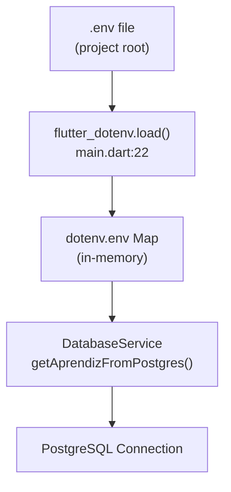
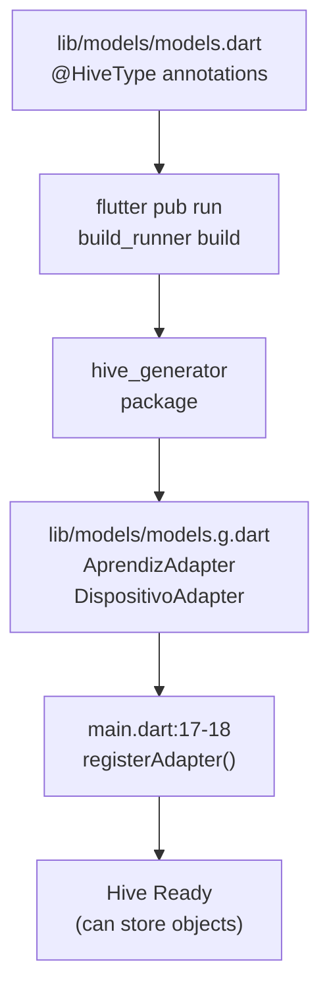
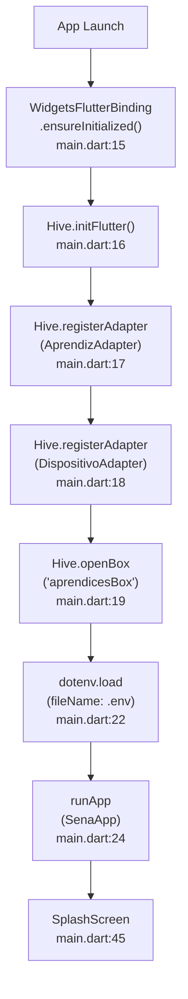
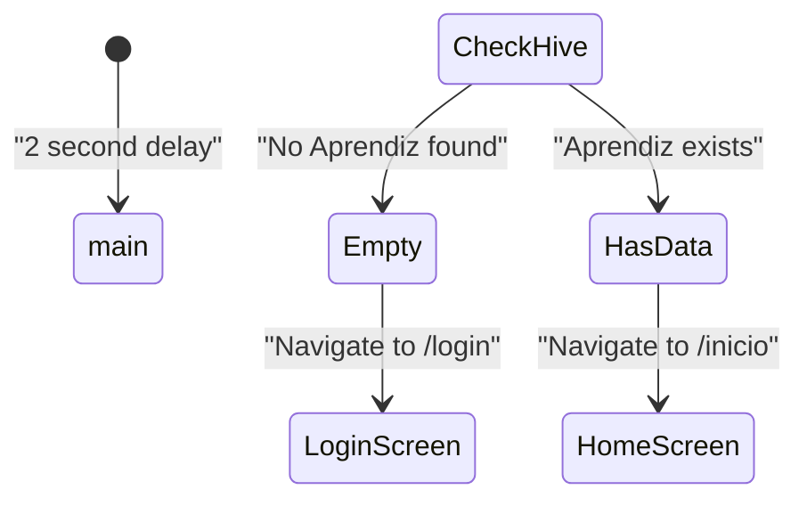
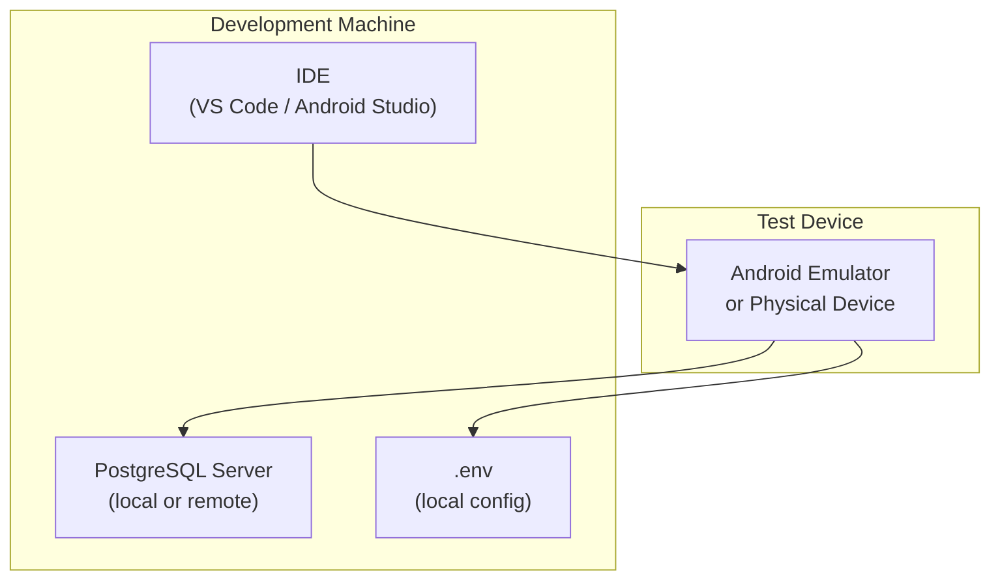

# Empezando

> **Archivos fuente relevantes**
> * [LÉAME.md](https://github.com/axchisan/AppGestionCarnetsSENA/blob/9eb64390/README.md)
> * [lib/main.dart](https://github.com/axchisan/AppGestionCarnetsSENA/blob/9eb64390/lib/main.dart)
> * [pubspec.lock](https://github.com/axchisan/AppGestionCarnetsSENA/blob/9eb64390/pubspec.lock)
> * [pubspec.yaml](https://github.com/axchisan/AppGestionCarnetsSENA/blob/9eb64390/pubspec.yaml)

Esta página proporciona instrucciones de configuración para ejecutar la aplicación de la Tarjeta de Identificación Digital SENA en un entorno de desarrollo. Abarca la instalación de prerrequisitos, la gestión de dependencias, la configuración de la base de datos, la generación de código y la verificación inicial.

Para obtener información sobre la arquitectura de la aplicación y los patrones de flujo de datos, consulte [Arquitectura del sistema](/axchisan/AppGestionCarnetsSENA/3-system-architecture) . Para obtener más información sobre cómo funciona la autenticación después de la configuración, consulte [Sistema de autenticación](/axchisan/AppGestionCarnetsSENA/4-authentication-system) .

---

## Prerrequisitos

El siguiente software debe instalarse antes de configurar el proyecto:

| Requisito | Versión mínima | Objetivo |
| --- | --- | --- |
| SDK de Flutter | 3.27.0+ | Marco multiplataforma |
| Kit de desarrollo de software de Dart | 3.8.1+ | Tiempo de ejecución del lenguaje |
| PostgreSQL | 9.5+ | Servidor de base de datos remoto |
| Android Studio / VS Code | El último | IDE con complementos de Flutter |
| Git | Cualquier | Control de fuente |

**Verificación de la versión del SDK:**

El proyecto aplica restricciones específicas del SDK definidas en[pubspec.yaml L6-L7](https://github.com/axchisan/AppGestionCarnetsSENA/blob/9eb64390/pubspec.yaml#L6-L7)

:

```yaml
environment:
  sdk: '>=3.8.1 <4.0.0'
```

Verifique su instalación ejecutando:

```
flutter --version
dart --version
```

Fuentes:[pubspec.yaml L6-L7](https://github.com/axchisan/AppGestionCarnetsSENA/blob/9eb64390/pubspec.yaml#L6-L7)

---

## Configuración del proyecto

### 1. Repositorio de clones

```
git clone https://github.com/axchisan/AppGestionCarnetsSENA.git
cd AppGestionCarnetsSENA
```

### 2. Instalar dependencias

El proyecto utiliza 13 dependencias de ejecución y 3 de desarrollo. Instale todos los paquetes:

```
flutter pub get
```

Este comando resuelve y descarga todos los paquetes especificados en[pubspec.yaml L9-L29](https://github.com/axchisan/AppGestionCarnetsSENA/blob/9eb64390/pubspec.yaml#L9-L29)

Las dependencias clave incluyen:

| Paquete | Versión | Objetivo |
| --- | --- | --- |
| `hive` | 2.2.3 | Almacenamiento NoSQL local |
| `hive_flutter` | 1.1.0 | Integración de Hive con Flutter |
| `postgres` | 2.6.2 | Controlador PostgreSQL |
| `crypto` | 3.0.6 | Hashing de contraseña SHA-256 |
| `flutter_dotenv` | 5.1.0 | Gestión de variables ambientales |
| `qr_flutter` | 4.1.0 | Generación de códigos QR/de barras |
| `image_picker` | 1.0.4 | Funcionalidad de carga de fotografías |

**Herramientas de desarrollo:**

| Paquete | Versión | Objetivo |
| --- | --- | --- |
| `build_runner` | 2.4.6 | Ejecución de generación de código |
| `hive_generator` | 2.0.1 | Generación de adaptadores de Hive |
| `flutter_lints` | 5.0.0 | Reglas para el pelusado de dardos |

Fuentes:[pubspec.yaml L9-L29](https://github.com/axchisan/AppGestionCarnetsSENA/blob/9eb64390/pubspec.yaml#L9-L29)

---

## Configuración de la base de datos

### Configuración de PostgreSQL

La aplicación requiere una base de datos PostgreSQL con dos tablas: `aprendices`y `dispositivos`. La estructura de la base de datos debe coincidir con los modelos de datos de la aplicación.

**Esquema de tablas requeridas:**

```sql
-- Table: aprendices
CREATE TABLE aprendices (
    id_identificacion VARCHAR PRIMARY KEY,
    nombre VARCHAR NOT NULL,
    programa VARCHAR NOT NULL,
    ficha VARCHAR NOT NULL,
    tipo_sangre VARCHAR NOT NULL,
    foto_perfil TEXT,
    contrasena_hash VARCHAR NOT NULL
);

-- Table: dispositivos
CREATE TABLE dispositivos (
    id SERIAL PRIMARY KEY,
    id_identificacion VARCHAR REFERENCES aprendices(id_identificacion),
    descripcion VARCHAR NOT NULL,
    id_dispositivo VARCHAR UNIQUE NOT NULL
);
```

### Configuración de variables de entorno

Las credenciales de la base de datos se cargan desde un `.env`archivo durante la ejecución. Cree este archivo en el directorio raíz del proyecto:

```
touch .env
```

**Variables de entorno requeridas:**

```
DB_HOST=your_postgresql_host
DB_PORT=5432
DB_NAME=your_database_name
DB_USER=your_database_user
DB_PASSWORD=your_database_password
```

**Proceso de carga del entorno:**

El `.env`archivo se carga durante la inicialización de la aplicación en[main.dart L21-L22](https://github.com/axchisan/AppGestionCarnetsSENA/blob/9eb64390/main.dart#L21-L22)

:

```python
// Initialize environment variables from .env file
await dotenv.load(fileName: ".env");
```

La `DatabaseService`clase recupera estas variables para establecer conexiones PostgreSQL. El `.env`archivo está incluido en[pubspec.yaml L35](https://github.com/axchisan/AppGestionCarnetsSENA/blob/9eb64390/pubspec.yaml#L35-L35)

 as an asset but should never be committed to source control (add to `.gitignore`).



**Environment Variable Usage Diagram**

Sources: [main.dart L21-L22](https://github.com/axchisan/AppGestionCarnetsSENA/blob/9eb64390/main.dart#L21-L22)

 [pubspec.yaml L35](https://github.com/axchisan/AppGestionCarnetsSENA/blob/9eb64390/pubspec.yaml#L35-L35)

---

## Code Generation

The application uses Hive's type adapter system, which requires code generation for the `Aprendiz` and `Dispositivo` models.

### Generate Hive Adapters

Run the build_runner to generate `models.g.dart`:

```sql
flutter pub run build_runner build --delete-conflicting-outputs
```

This command:

1. Scans for `@HiveType` annotations in [lib/models/models.dart](https://github.com/axchisan/AppGestionCarnetsSENA/blob/9eb64390/lib/models/models.dart)
2. Generates `AprendizAdapter` and `DispositivoAdapter` classes
3. Creates [lib/models/models.g.dart](https://github.com/axchisan/AppGestionCarnetsSENA/blob/9eb64390/lib/models/models.g.dart)  with serialization logic

**Generated Adapters:**

The build process produces type adapters that are registered in [main.dart L17-L18](https://github.com/axchisan/AppGestionCarnetsSENA/blob/9eb64390/main.dart#L17-L18)

:

```
Hive.registerAdapter(AprendizAdapter());
Hive.registerAdapter(DispositivoAdapter());
```

### Code Generation Workflow



**Code Generation Workflow Diagram**

Sources: [main.dart L17-L18](https://github.com/axchisan/AppGestionCarnetsSENA/blob/9eb64390/main.dart#L17-L18)

 [pubspec.yaml L28-L29](https://github.com/axchisan/AppGestionCarnetsSENA/blob/9eb64390/pubspec.yaml#L28-L29)

---

## Application Initialization Sequence

The application follows a strict initialization sequence in [main.dart L14-L25](https://github.com/axchisan/AppGestionCarnetsSENA/blob/9eb64390/main.dart#L14-L25)

 before launching the UI:



**Application Initialization Flow Diagram**

**Initialization Steps:**

1. **Flutter Binding** [main.dart L15](https://github.com/axchisan/AppGestionCarnetsSENA/blob/9eb64390/main.dart#L15-L15)  - Ensures Flutter engine is ready for async operations
2. **Hive Initialization** [main.dart L16](https://github.com/axchisan/AppGestionCarnetsSENA/blob/9eb64390/main.dart#L16-L16)  - Initializes Hive for Flutter with platform-specific paths
3. **Adapter Registration** [main.dart L17-L18](https://github.com/axchisan/AppGestionCarnetsSENA/blob/9eb64390/main.dart#L17-L18)  - Registers generated type adapters for object serialization
4. **Box Opening** [main.dart L19](https://github.com/axchisan/AppGestionCarnetsSENA/blob/9eb64390/main.dart#L19-L19)  - Opens persistent `aprendicesBox` for `Aprendiz` objects
5. **Environment Loading** [main.dart L22](https://github.com/axchisan/AppGestionCarnetsSENA/blob/9eb64390/main.dart#L22-L22)  - Loads `.env` file into memory
6. **App Launch** [main.dart L24](https://github.com/axchisan/AppGestionCarnetsSENA/blob/9eb64390/main.dart#L24-L24)  - Starts the MaterialApp widget tree

**Critical Notes:**

* All initialization steps are `await`ed and must complete successfully before UI renders
* If any step fails, the app will not launch
* The `aprendicesBox` is opened once globally and remains open for the app lifecycle

Sources: [main.dart L14-L25](https://github.com/axchisan/AppGestionCarnetsSENA/blob/9eb64390/main.dart#L14-L25)

---

## Running the Application

### Development Mode

Run the application on a connected device or emulator:

```
flutter run
```

For hot reload during development:

* Press `r` in terminal to hot reload
* Press `R` to hot restart
* Press `q` to quit

### Platform-Specific Builds

**Android:**

```
flutter build apk --release
```

**Debug Build:**

```
flutter run --debug
```

### Expected First Launch Behavior

On first launch, the application follows this navigation flow:



**First Launch Navigation Diagram**

**Expected Behavior:**

1. **Splash Screen** displays for 2 seconds [lib/screens/splash_screen.dart](https://github.com/axchisan/AppGestionCarnetsSENA/blob/9eb64390/lib/screens/splash_screen.dart)
2. **Session Check** queries `aprendicesBox` for cached user
3. **Fresh Install** → routes to `LoginScreen` (empty box)
4. **Returning User** → routes to `HomeScreen` with cached `Aprendiz`

Sources: [main.dart L45-L71](https://github.com/axchisan/AppGestionCarnetsSENA/blob/9eb64390/main.dart#L45-L71)

---

## Verification Checklist

After setup, verify the following:

| Component | Verification Command/Method | Expected Result |
| --- | --- | --- |
| Dependencies | `flutter pub get` | "Got dependencies!" message |
| Code Generation | Check `lib/models/models.g.dart` exists | File present with adapters |
| Environment File | `cat .env` | Shows DB credentials |
| Database Connection | Test with PostgreSQL client | Can connect to database |
| Hive Initialization | Run app, check logs | "Hive initialized" (no errors) |
| App Launch | `flutter run` | Splash screen appears |
| Navigation | Wait 2 seconds | Routes to LoginScreen |

### Common Setup Issues

**Issue: "MissingPluginException" on run**

* **Cause:** Platform channels not registered
* **Solution:** `flutter clean && flutter pub get`

**Issue: "models.g.dart not found"**

* **Causa:** La generación de código no se ejecuta
* **Solución:** `flutter pub run build_runner build --delete-conflicting-outputs`

**Problema: "No se puede conectar a PostgreSQL"**

* **Causa:** Valores incorrectos `.env`o problema de red
* **Solución:** Verifique las credenciales de la base de datos, verifique que PostgreSQL se esté ejecutando en el host/puerto especificado

**Problema: "HiveError: La caja ya está abierta"**

* **Causa:** Caja abierta varias veces
* **Solución:** reinicie la aplicación; los cuadros de Hive solo deben abrirse una vez[main.dart L19](https://github.com/axchisan/AppGestionCarnetsSENA/blob/9eb64390/main.dart#L19-L19)

Fuentes:[main.dart L1-L75](https://github.com/axchisan/AppGestionCarnetsSENA/blob/9eb64390/main.dart#L1-L75)

 [pubspec.yaml L1-L44](https://github.com/axchisan/AppGestionCarnetsSENA/blob/9eb64390/pubspec.yaml#L1-L44)

---

## Flujo de trabajo de desarrollo

### Configuración de desarrollo recomendada



**Diagrama de configuración del entorno de desarrollo**

### Soporte de recarga en caliente

La aplicación admite la recarga en caliente de Flutter para la mayoría de los cambios de la interfaz de usuario. Sin embargo, los siguientes casos requieren un reinicio completo:

* Cambios en[main.dart L14-L25](https://github.com/axchisan/AppGestionCarnetsSENA/blob/9eb64390/main.dart#L14-L25) código de inicialización
* Modificaciones a los adaptadores de Hive (requiere regeneración)
* Actualizaciones del `.env`archivo (se recargan solo al inicio)
* Cambios en la configuración de la ruta[main.dart L46-L71](https://github.com/axchisan/AppGestionCarnetsSENA/blob/9eb64390/main.dart#L46-L71)

Fuentes:[main.dart L1-L75](https://github.com/axchisan/AppGestionCarnetsSENA/blob/9eb64390/main.dart#L1-L75)

---

## Próximos pasos

Después de una configuración exitosa:

1. **Comprenda la arquitectura** : lea [Arquitectura del sistema](/axchisan/AppGestionCarnetsSENA/3-system-architecture) para comprender el flujo de datos y la estrategia de persistencia.
2. **Explorar autenticación** : consulte [el sistema de autenticación](/axchisan/AppGestionCarnetsSENA/4-authentication-system) para la implementación de inicio de sesión y registro
3. **Revisar modelos de datos** : estudiar [modelos de datos (aprender y desarrollar)](/axchisan/AppGestionCarnetsSENA/3.1.2-data-models-(aprendiz-and-dispositivo)) para comprender la estructura de los datos.
4. **Pruebe las funciones principales** : navegue a través de [las funciones principales](/axchisan/AppGestionCarnetsSENA/5-core-features) para comprender la funcionalidad orientada al usuario.

---

## Configuración de activos

La aplicación requiere recursos de imagen para la marca. Asegúrese de que exista la siguiente estructura de directorios:

```markdown
assets/
└── images/
    ├── icon.png              # App launcher icon
    └── icon_foreground.png   # Adaptive icon foreground
```

Estos activos se declaran en[pubspec.yaml L33-L35](https://github.com/axchisan/AppGestionCarnetsSENA/blob/9eb64390/pubspec.yaml#L33-L35)

:

```yaml
flutter:
  uses-material-design: true
  assets:
    - assets/images/
    - .env
```

**Generación de iconos:**

El proyecto utiliza `flutter_launcher_icons`la generación automática de iconos. Configuración en[pubspec.yaml L37-L42](https://github.com/axchisan/AppGestionCarnetsSENA/blob/9eb64390/pubspec.yaml#L37-L42)

:

```yaml
flutter_icons:
  android: true
  ios: true
  image_path: "assets/images/icon.png"
  adaptive_icon_background: "#FFFFFF"
  adaptive_icon_foreground: "assets/images/icon_foreground.png"
```

Generar iconos de inicio:

```
flutter pub run flutter_launcher_icons
```

Fuentes:[pubspec.yaml L33-L42](https://github.com/axchisan/AppGestionCarnetsSENA/blob/9eb64390/pubspec.yaml#L33-L42)