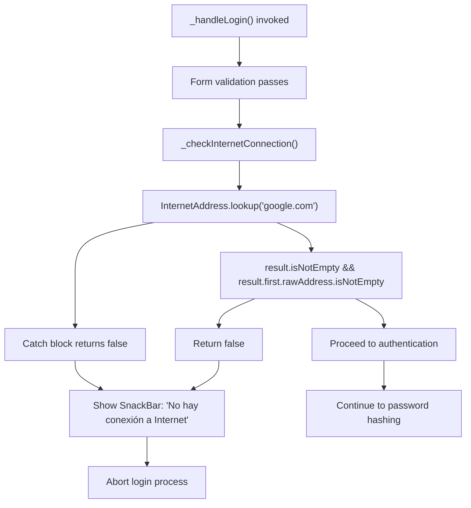
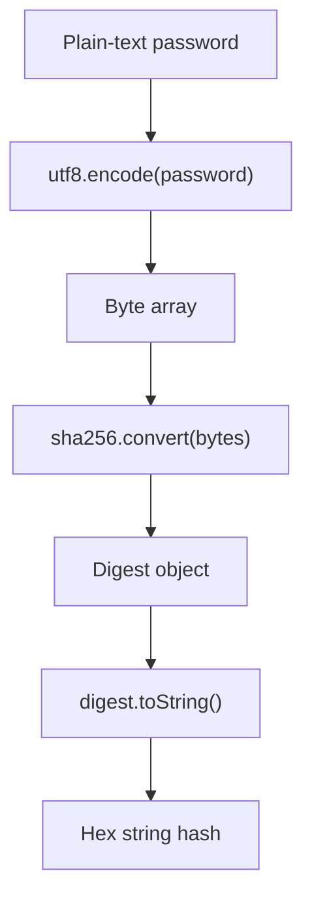
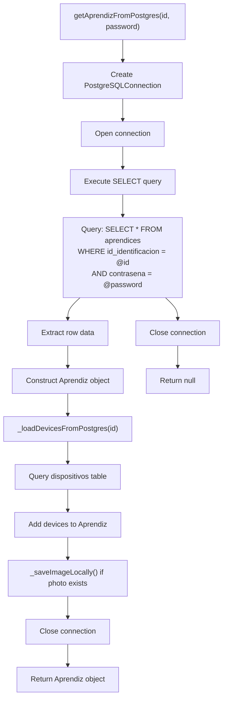
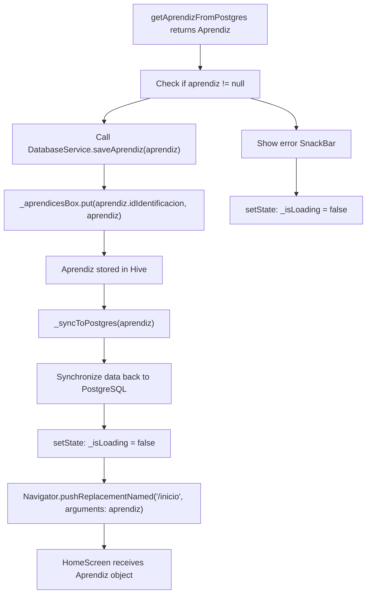
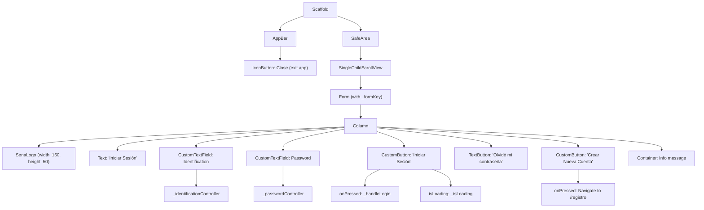

# Flujo de inicio de sesión

> **Archivos fuente relevantes**
> * [lib/pantallas/pantalla_de_inicio_de_sesión.dart](https://github.com/axchisan/AppGestionCarnetsSENA/blob/9eb64390/lib/screens/login_screen.dart)
> * [lib/servicios/servicio_de_base_de_datos.dart](https://github.com/axchisan/AppGestionCarnetsSENA/blob/9eb64390/lib/services/database_service.dart)

## Propósito y alcance

Este documento proporciona una especificación técnica detallada del proceso de autenticación de inicio de sesión en la aplicación de la Tarjeta de Identificación Digital del SENA. Abarca todo el proceso, desde el envío de credenciales del usuario hasta la creación de una sesión autenticada, incluyendo la validación de formularios, el hash de contraseñas, la verificación remota de credenciales y el almacenamiento local de sesiones.

Para obtener información sobre el registro de usuarios y la creación de cuentas, consulte [Flujo de registro](/axchisan/AppGestionCarnetsSENA/4.2-registration-flow) . Para obtener más información sobre la persistencia y detección de sesiones, consulte [Administración de sesiones](/axchisan/AppGestionCarnetsSENA/4.3-session-management) . Para la implementación de la seguridad de contraseñas, consulte [Implementación de seguridad](/axchisan/AppGestionCarnetsSENA/4.4-security-implementation) .

---

## Descripción general del flujo de inicio de sesión

El proceso de inicio de sesión se implementa `LoginScreen`y se coordina con `DatabaseService`la base de datos PostgreSQL para autenticar a los usuarios. Tras una autenticación exitosa, los datos del usuario se almacenan en caché local en Hive para habilitar la funcionalidad sin conexión y se dirige al usuario a la pantalla de inicio.

### Secuencia de inicio de sesión de extremo a extremo

```mermaid
sequenceDiagram
  participant User
  participant LoginScreen
  participant _LoginScreenState
  participant _checkInternetConnection()
  participant _hashPassword()
  participant DatabaseService
  participant PostgreSQL Database
  participant Hive aprendicesBox
  participant HomeScreen

  User->>LoginScreen: "Enter ID and Password"
  User->>LoginScreen: "Tap 'Iniciar Sesión'"
  LoginScreen->>_LoginScreenState: "_handleLogin()"
  _LoginScreenState->>_LoginScreenState: "_formKey.currentState.validate()"
  loop ["Form Invalid"]
    _LoginScreenState-->>User: "Show validation errors"
    _LoginScreenState->>_checkInternetConnection(): "Check connectivity"
    _checkInternetConnection()->>_checkInternetConnection(): "InternetAddress.lookup('google.com')"
    _checkInternetConnection()-->>_LoginScreenState: "false"
    _LoginScreenState-->>User: "SnackBar: No hay conexión a Internet"
    _checkInternetConnection()-->>_LoginScreenState: "true"
    _LoginScreenState->>_LoginScreenState: "setState({_isLoading: true})"
    _LoginScreenState->>_LoginScreenState: "id = _identificationController.text.trim()"
    _LoginScreenState->>_hashPassword(): "_hashPassword(password)"
    _hashPassword()->>_hashPassword(): "sha256.convert(utf8.encode(password))"
    _hashPassword()-->>_LoginScreenState: "hashedPassword"
    _LoginScreenState->>DatabaseService: "getAprendizFromPostgres(id, hashedPassword)"
    DatabaseService->>PostgreSQL Database: "SELECT * FROM aprendices WHERE id=@id AND contrasena=@password"
    PostgreSQL Database-->>DatabaseService: "User row data"
    DatabaseService->>DatabaseService: "Construct Aprendiz object"
    DatabaseService->>PostgreSQL Database: "SELECT * FROM dispositivos WHERE id=@id"
    PostgreSQL Database-->>DatabaseService: "Device rows"
    DatabaseService-->>_LoginScreenState: "Aprendiz object"
    _LoginScreenState->>DatabaseService: "saveAprendiz(aprendiz)"
    DatabaseService->>Hive aprendicesBox: "put(aprendiz.idIdentificacion, aprendiz)"
    Hive aprendicesBox-->>DatabaseService: "Success"
    DatabaseService->>PostgreSQL Database: "_syncToPostgres(aprendiz)"
    _LoginScreenState->>_LoginScreenState: "setState({_isLoading: false})"
    _LoginScreenState->>HomeScreen: "Navigator.pushReplacementNamed('/inicio')"
    HomeScreen-->>User: "Display home screen"
    PostgreSQL Database-->>DatabaseService: "Empty result set"
    DatabaseService-->>_LoginScreenState: "null"
    _LoginScreenState->>_LoginScreenState: "setState({_isLoading: false})"
    _LoginScreenState-->>User: "SnackBar: Credenciales incorrectas"
  end
```

**Fuentes:** [login_screen.dart L49-L92](https://github.com/axchisan/AppGestionCarnetsSENA/blob/9eb64390/lib/screens/login_screen.dart#L49-L92)

 [database_service.dart L129-L169](https://github.com/axchisan/AppGestionCarnetsSENA/blob/9eb64390/lib/services/database_service.dart#L129-L169)

---

## Validación de formulario

Implementa la validación de formularios mediante el widget `LoginScreen`de Flutter para gestionar el estado de validación. Dos campos de texto recogen la información del usuario: número de identificación y contraseña.`Form``GlobalKey<FormState>`

### Configuración del campo de formulario

| Campo | Controlador | Tipo de teclado | Reglas de validación |
| --- | --- | --- | --- |
| Número de identificación | `_identificationController` | `TextInputType.number` | No vacío, mínimo 5 dígitos |
| Contraseña | `_passwordController` | `TextInputType.text` | No vacío |

### Implementación de la validación

La validación del formulario se produce en[login_screen.dart L129-L156](https://github.com/axchisan/AppGestionCarnetsSENA/blob/9eb64390/lib/screens/login_screen.dart#L129-L156)

El validador del campo de identificación verifica si la entrada no está vacía y aplica una longitud mínima:

```
if (value == null || value.isEmpty) {
  return 'Por favor ingresa tu número de identificación';
}
if (value.length < 5) {
  return 'El número de identificación debe tener al menos 5 dígitos';
}
```

El validador del campo de contraseña solo verifica entradas no vacías. La validación se activa cuando `_formKey.currentState!.validate()`se llama en[login_screen.dart L50](https://github.com/axchisan/AppGestionCarnetsSENA/blob/9eb64390/lib/screens/login_screen.dart#L50-L50)

**Fuentes:** [login_screen.dart L20-L31](https://github.com/axchisan/AppGestionCarnetsSENA/blob/9eb64390/lib/screens/login_screen.dart#L20-L31)

 [login_screen.dart L109-L156](https://github.com/axchisan/AppGestionCarnetsSENA/blob/9eb64390/lib/screens/login_screen.dart#L109-L156)

---

## Comprobación de la conectividad a Internet

Antes de intentar la autenticación, el sistema verifica la conexión a internet mediante una búsqueda de DNS `google.com`. Esto evita esperas innecesarias y proporciona información inmediata al usuario sin conexión.

### Flujo de verificación de conectividad



La implementación de la verificación de conectividad está en[login_screen.dart L40-L47](https://github.com/axchisan/AppGestionCarnetsSENA/blob/9eb64390/lib/screens/login_screen.dart#L40-L47)

 If connectivity fails, a `SnackBar` with red background (`AppColors.red`) is displayed and the login process terminates at [lib/screens/login_screen.dart L53-L60](https://github.com/axchisan/AppGestionCarnetsSENA/blob/9eb64390/lib/screens/login_screen.dart#L53-L60)

**Sources:** [lib/screens/login_screen.dart L40-L47](https://github.com/axchisan/AppGestionCarnetsSENA/blob/9eb64390/lib/screens/login_screen.dart#L40-L47)

 [lib/screens/login_screen.dart L52-L60](https://github.com/axchisan/AppGestionCarnetsSENA/blob/9eb64390/lib/screens/login_screen.dart#L52-L60)

---

## Password Hashing

All passwords are hashed client-side using SHA-256 before transmission to the database service. This ensures that plain-text passwords never traverse the network or appear in logs.

### Hash Function Implementation

The `_hashPassword` method at [lib/screens/login_screen.dart L34-L38](https://github.com/axchisan/AppGestionCarnetsSENA/blob/9eb64390/lib/screens/login_screen.dart#L34-L38)

 implements the hashing algorithm:



The method uses the `crypto` package (imported at [lib/screens/login_screen.dart L3](https://github.com/axchisan/AppGestionCarnetsSENA/blob/9eb64390/lib/screens/login_screen.dart#L3-L3)

) and the `dart:convert` library for UTF-8 encoding. The resulting hash is a hexadecimal string representation of the SHA-256 digest.

### Password Processing in Login Flow

During login at [lib/screens/login_screen.dart L66-L67](https://github.com/axchisan/AppGestionCarnetsSENA/blob/9eb64390/lib/screens/login_screen.dart#L66-L67)

 the system:

1. Retrieves the raw password from `_passwordController.text`
2. Trims whitespace using `.trim()`
3. Passes the trimmed password to `_hashPassword()`
4. Stores the resulting hash in `hashedPassword` variable
5. Passes the hash (not the plain-text password) to `DatabaseService.getAprendizFromPostgres()`

**Sources:** [lib/screens/login_screen.dart L34-L38](https://github.com/axchisan/AppGestionCarnetsSENA/blob/9eb64390/lib/screens/login_screen.dart#L34-L38)

 [lib/screens/login_screen.dart L66-L67](https://github.com/axchisan/AppGestionCarnetsSENA/blob/9eb64390/lib/screens/login_screen.dart#L66-L67)

 [lib/screens/login_screen.dart L3-L4](https://github.com/axchisan/AppGestionCarnetsSENA/blob/9eb64390/lib/screens/login_screen.dart#L3-L4)

---

## Credential Verification Against PostgreSQL

Credential verification is handled by the `DatabaseService.getAprendizFromPostgres` method, which queries the remote PostgreSQL database to validate the user's identification number and hashed password.

### Database Query Process



The implementation at [lib/services/database_service.dart L129-L169](https://github.com/axchisan/AppGestionCarnetsSENA/blob/9eb64390/lib/services/database_service.dart#L129-L169)

 performs these operations:

1. **Connection Setup**: Creates a `PostgreSQLConnection` using environment variables from `.env` file ([lib/services/database_service.dart L131-L137](https://github.com/axchisan/AppGestionCarnetsSENA/blob/9eb64390/lib/services/database_service.dart#L131-L137) )
2. **Query Execution**: Executes a parameterized SELECT statement with substitution values to prevent SQL injection ([lib/services/database_service.dart L139-L146](https://github.com/axchisan/AppGestionCarnetsSENA/blob/9eb64390/lib/services/database_service.dart#L139-L146) )
3. **Result Processing**: If results are found, constructs an `Aprendiz` object from the row data ([lib/services/database_service.dart L149-L163](https://github.com/axchisan/AppGestionCarnetsSENA/blob/9eb64390/lib/services/database_service.dart#L149-L163) )
4. **Device Loading**: Calls `_loadDevicesFromPostgres` to fetch associated devices ([lib/services/database_service.dart L161](https://github.com/axchisan/AppGestionCarnetsSENA/blob/9eb64390/lib/services/database_service.dart#L161-L161) )
5. **Image Handling**: If a profile photo exists (stored as base64 in PostgreSQL), saves it locally and stores the file path ([lib/services/database_service.dart L157](https://github.com/axchisan/AppGestionCarnetsSENA/blob/9eb64390/lib/services/database_service.dart#L157-L157) )

### Query Parameters and Security

The query uses named substitution values (`@id` and `@password`) at [lib/services/database_service.dart L145](https://github.com/axchisan/AppGestionCarnetsSENA/blob/9eb64390/lib/services/database_service.dart#L145-L145)

 This parameterized approach prevents SQL injection attacks. The password parameter contains the SHA-256 hash, not the plain-text password.

**Sources:** [lib/services/database_service.dart L129-L169](https://github.com/axchisan/AppGestionCarnetsSENA/blob/9eb64390/lib/services/database_service.dart#L129-L169)

 [lib/services/database_service.dart L171-L197](https://github.com/axchisan/AppGestionCarnetsSENA/blob/9eb64390/lib/services/database_service.dart#L171-L197)

 [lib/services/database_service.dart L199-L209](https://github.com/axchisan/AppGestionCarnetsSENA/blob/9eb64390/lib/services/database_service.dart#L199-L209)

---

## Local Session Creation

Upon successful authentication, the retrieved `Aprendiz` object is saved to the local Hive database, creating a persistent session that enables offline access and eliminates the need for repeated logins.

### Session Storage Process



The session creation flow at [lib/screens/login_screen.dart L69-L78](https://github.com/axchisan/AppGestionCarnetsSENA/blob/9eb64390/lib/screens/login_screen.dart#L69-L78)

 follows these steps:

1. **Validation**: Checks if `aprendiz` returned from `getAprendizFromPostgres` is not null
2. **Local Save**: Calls `DatabaseService.saveAprendiz(aprendiz)` to persist user data locally
3. **Hive Storage**: Inside `saveAprendiz`, the method stores the object in Hive at [lib/services/database_service.dart L44](https://github.com/axchisan/AppGestionCarnetsSENA/blob/9eb64390/lib/services/database_service.dart#L44-L44)  using the identification number as the key
4. **State Update**: Sets `_isLoading` to false
5. **Navigation**: Uses `Navigator.pushReplacementNamed` to navigate to `/inicio` route, passing the `Aprendiz` object as arguments

### Hive Box Configuration

The Aprendiz data is stored in the `aprendicesBox` Hive box, defined as a constant at [lib/services/database_service.dart L10](https://github.com/axchisan/AppGestionCarnetsSENA/blob/9eb64390/lib/services/database_service.dart#L10-L10)

 The box is accessed through the getter at [lib/services/database_service.dart L19](https://github.com/axchisan/AppGestionCarnetsSENA/blob/9eb64390/lib/services/database_service.dart#L19-L19)

 The key for storage is `aprendiz.idIdentificacion`, allowing efficient retrieval by user ID.

**Sources:** [lib/screens/login_screen.dart L69-L78](https://github.com/axchisan/AppGestionCarnetsSENA/blob/9eb64390/lib/screens/login_screen.dart#L69-L78)

 [lib/services/database_service.dart L42-L47](https://github.com/axchisan/AppGestionCarnetsSENA/blob/9eb64390/lib/services/database_service.dart#L42-L47)

 [lib/services/database_service.dart L10](https://github.com/axchisan/AppGestionCarnetsSENA/blob/9eb64390/lib/services/database_service.dart#L10-L10)

 [lib/services/database_service.dart L19](https://github.com/axchisan/AppGestionCarnetsSENA/blob/9eb64390/lib/services/database_service.dart#L19-L19)

---

## Navigation and Error Handling

The login screen implements comprehensive error handling and navigation logic to provide clear user feedback and appropriate routing based on authentication outcomes.

### Navigation Routes

| Outcome | Method | Route | Arguments | Navigation Type |
| --- | --- | --- | --- | --- |
| Successful Login | `pushReplacementNamed` | `/inicio` | `Aprendiz` object | Replacement (no back) |
| Create Account Button | `pushNamed` | `/registro` | None | Push (can return) |
| Close App | `exit(0)` | N/A | N/A | App termination |

### Error Handling Scenarios

```

```

### Error Message Implementation

The error handling at [lib/screens/login_screen.dart L80-L91](https://github.com/axchisan/AppGestionCarnetsSENA/blob/9eb64390/lib/screens/login_screen.dart#L80-L91)

 displays a `SnackBar` when authentication fails:

* **Message**: "Credenciales incorrectas o error de conexión. Verifica tu red."
* **Background Color**: `AppColors.red` (defined in [lib/utils/app_colors.dart](https://github.com/axchisan/AppGestionCarnetsSENA/blob/9eb64390/lib/utils/app_colors.dart) )
* **Trigger Condition**: `aprendiz == null` after `getAprendizFromPostgres` call

The internet connectivity error at [lib/screens/login_screen.dart L53-L59](https://github.com/axchisan/AppGestionCarnetsSENA/blob/9eb64390/lib/screens/login_screen.dart#L53-L59)

 uses similar SnackBar presentation with the message "No hay conexión a Internet. Verifica tu red."

### Loading State Management

Loading state is managed through the `_isLoading` boolean at [lib/screens/login_screen.dart L23](https://github.com/axchisan/AppGestionCarnetsSENA/blob/9eb64390/lib/screens/login_screen.dart#L23-L23)

 The state is:

* Set to `true` at [lib/screens/login_screen.dart L62-L64](https://github.com/axchisan/AppGestionCarnetsSENA/blob/9eb64390/lib/screens/login_screen.dart#L62-L64)  before database query
* Set to `false` at [lib/screens/login_screen.dart L74-L76](https://github.com/axchisan/AppGestionCarnetsSENA/blob/9eb64390/lib/screens/login_screen.dart#L74-L76)  on success
* Set to `false` at [lib/screens/login_screen.dart L81-L83](https://github.com/axchisan/AppGestionCarnetsSENA/blob/9eb64390/lib/screens/login_screen.dart#L81-L83)  on failure

The `CustomButton` widget receives this state via the `isLoading` parameter at [lib/screens/login_screen.dart L161](https://github.com/axchisan/AppGestionCarnetsSENA/blob/9eb64390/lib/screens/login_screen.dart#L161-L161)

 displaying a loading indicator when true.

**Sources:** [lib/screens/login_screen.dart L49-L92](https://github.com/axchisan/AppGestionCarnetsSENA/blob/9eb64390/lib/screens/login_screen.dart#L49-L92)

 [lib/screens/login_screen.dart L184-L188](https://github.com/axchisan/AppGestionCarnetsSENA/blob/9eb64390/lib/screens/login_screen.dart#L184-L188)

 [lib/screens/login_screen.dart L101-L104](https://github.com/axchisan/AppGestionCarnetsSENA/blob/9eb64390/lib/screens/login_screen.dart#L101-L104)

 [lib/screens/login_screen.dart L23](https://github.com/axchisan/AppGestionCarnetsSENA/blob/9eb64390/lib/screens/login_screen.dart#L23-L23)

---

## UI Components and Layout

The `LoginScreen` uses custom widgets and a structured layout to provide a consistent user experience aligned with SENA branding.

### Component Hierarchy



### Key UI Elements

* **SenaLogo**: Displayed at [lib/screens/login_screen.dart L114-L118](https://github.com/axchisan/AppGestionCarnetsSENA/blob/9eb64390/lib/screens/login_screen.dart#L114-L118)  with dimensions 150x50 pixels, no shadow
* **CustomTextField**: Used for both identification ([lib/screens/login_screen.dart L129-L143](https://github.com/axchisan/AppGestionCarnetsSENA/blob/9eb64390/lib/screens/login_screen.dart#L129-L143) ) and password ([lib/screens/login_screen.dart L145-L156](https://github.com/axchisan/AppGestionCarnetsSENA/blob/9eb64390/lib/screens/login_screen.dart#L145-L156) ) inputs
* **CustomButton**: Primary login button at [lib/screens/login_screen.dart L158-L163](https://github.com/axchisan/AppGestionCarnetsSENA/blob/9eb64390/lib/screens/login_screen.dart#L158-L163)  with arrow icon and loading state
* **Info Container**: Blue-themed informational box at [lib/screens/login_screen.dart L190-L215](https://github.com/axchisan/AppGestionCarnetsSENA/blob/9eb64390/lib/screens/login_screen.dart#L190-L215)  explaining that only registered SENA apprentices can create accounts

The screen uses `AppColors.white` for background color and `AppColors.black` for text, maintaining consistency with the application's theme system.

**Sources:** [lib/screens/login_screen.dart L96-L222](https://github.com/axchisan/AppGestionCarnetsSENA/blob/9eb64390/lib/screens/login_screen.dart#L96-L222)

 [lib/widgets/sena_logo.dart](https://github.com/axchisan/AppGestionCarnetsSENA/blob/9eb64390/lib/widgets/sena_logo.dart)

 [lib/widgets/custom_text_field.dart](https://github.com/axchisan/AppGestionCarnetsSENA/blob/9eb64390/lib/widgets/custom_text_field.dart)

 [lib/widgets/custom_button.dart](https://github.com/axchisan/AppGestionCarnetsSENA/blob/9eb64390/lib/widgets/custom_button.dart)

---

## Code Entity Reference

### LoginScreen Class Structure

| Entity | Type | Line Reference | Purpose |
| --- | --- | --- | --- |
| `LoginScreen` | StatefulWidget | [lib/screens/login_screen.dart L12-L17](https://github.com/axchisan/AppGestionCarnetsSENA/blob/9eb64390/lib/screens/login_screen.dart#L12-L17) | Main widget class |
| `_LoginScreenState` | State | [lib/screens/login_screen.dart L19-L223](https://github.com/axchisan/AppGestionCarnetsSENA/blob/9eb64390/lib/screens/login_screen.dart#L19-L223) | State management for login screen |
| `_formKey` | `GlobalKey<FormState>` | [lib/screens/login_screen.dart L20](https://github.com/axchisan/AppGestionCarnetsSENA/blob/9eb64390/lib/screens/login_screen.dart#L20-L20) | Form validation key |
| `_identificationController` | `TextEditingController` | [lib/screens/login_screen.dart L21](https://github.com/axchisan/AppGestionCarnetsSENA/blob/9eb64390/lib/screens/login_screen.dart#L21-L21) | Manages ID input field |
| `_passwordController` | `TextEditingController` | [lib/screens/login_screen.dart L22](https://github.com/axchisan/AppGestionCarnetsSENA/blob/9eb64390/lib/screens/login_screen.dart#L22-L22) | Manages password input field |
| `_isLoading` | `bool` | [lib/screens/login_screen.dart L23](https://github.com/axchisan/AppGestionCarnetsSENA/blob/9eb64390/lib/screens/login_screen.dart#L23-L23) | Loading state indicator |
| `_dbService` | `DatabaseService` | [lib/screens/login_screen.dart L25](https://github.com/axchisan/AppGestionCarnetsSENA/blob/9eb64390/lib/screens/login_screen.dart#L25-L25) | Database service instance |
| `_hashPassword` | Method | [lib/screens/login_screen.dart L34-L38](https://github.com/axchisan/AppGestionCarnetsSENA/blob/9eb64390/lib/screens/login_screen.dart#L34-L38) | SHA-256 password hashing |
| `_checkInternetConnection` | Method | [lib/screens/login_screen.dart L40-L47](https://github.com/axchisan/AppGestionCarnetsSENA/blob/9eb64390/lib/screens/login_screen.dart#L40-L47) | Internet connectivity verification |
| `_handleLogin` | Method | [lib/screens/login_screen.dart L49-L92](https://github.com/axchisan/AppGestionCarnetsSENA/blob/9eb64390/lib/screens/login_screen.dart#L49-L92) | Main login orchestration |

### DatabaseService Methods Used

| Method | Line Reference | Purpose |
| --- | --- | --- |
| `getAprendizFromPostgres` | [lib/services/database_service.dart L129-L169](https://github.com/axchisan/AppGestionCarnetsSENA/blob/9eb64390/lib/services/database_service.dart#L129-L169) | Authenticates and retrieves user from PostgreSQL |
| `saveAprendiz` | [lib/services/database_service.dart L42-L47](https://github.com/axchisan/AppGestionCarnetsSENA/blob/9eb64390/lib/services/database_service.dart#L42-L47) | Saves user to local Hive storage |
| `_syncToPostgres` | [lib/services/database_service.dart L49-L119](https://github.com/axchisan/AppGestionCarnetsSENA/blob/9eb64390/lib/services/database_service.dart#L49-L119) | Sincroniza datos locales con PostgreSQL |
| `_loadDevicesFromPostgres` | [database_service.dart L171-L197](https://github.com/axchisan/AppGestionCarnetsSENA/blob/9eb64390/lib/services/database_service.dart#L171-L197) | Carga dispositivos asociados para el usuario |
| `_saveImageLocally` | [database_service.dart L199-L209](https://github.com/axchisan/AppGestionCarnetsSENA/blob/9eb64390/lib/services/database_service.dart#L199-L209) | Guarda la imagen de perfil base64 en un archivo local |

**Fuentes:** [login_screen.dart L1-L223](https://github.com/axchisan/AppGestionCarnetsSENA/blob/9eb64390/lib/screens/login_screen.dart#L1-L223)

 [database_service.dart L1-L239](https://github.com/axchisan/AppGestionCarnetsSENA/blob/9eb64390/lib/services/database_service.dart#L1-L239)