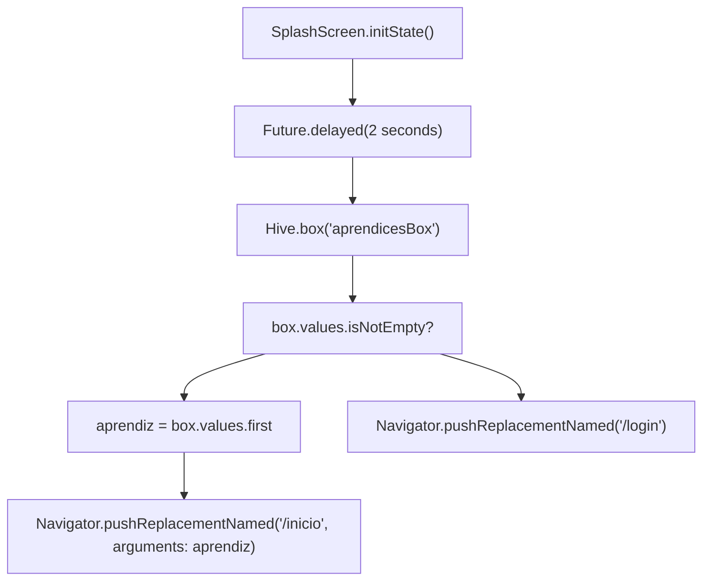
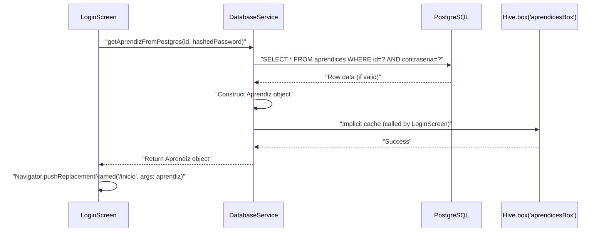
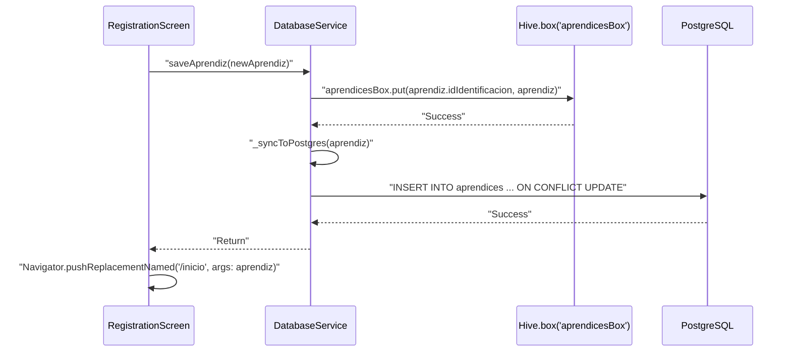
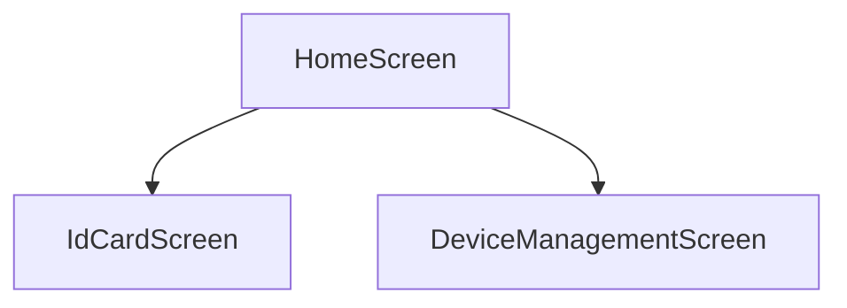
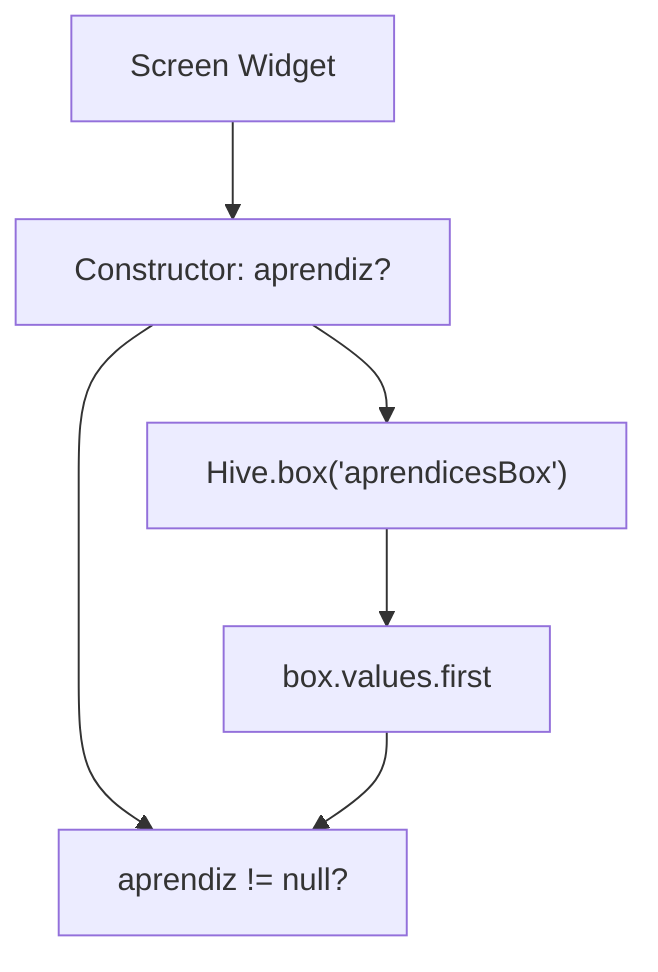
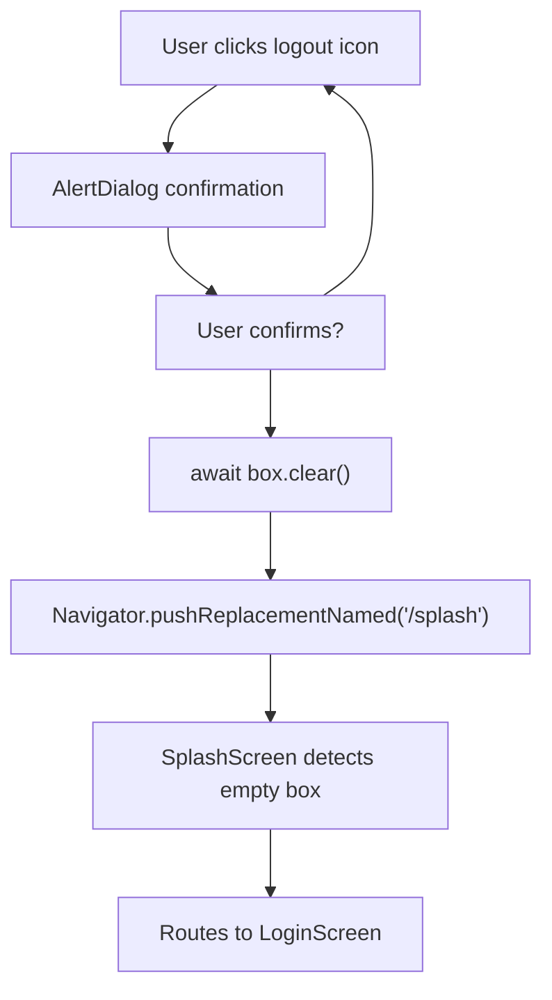
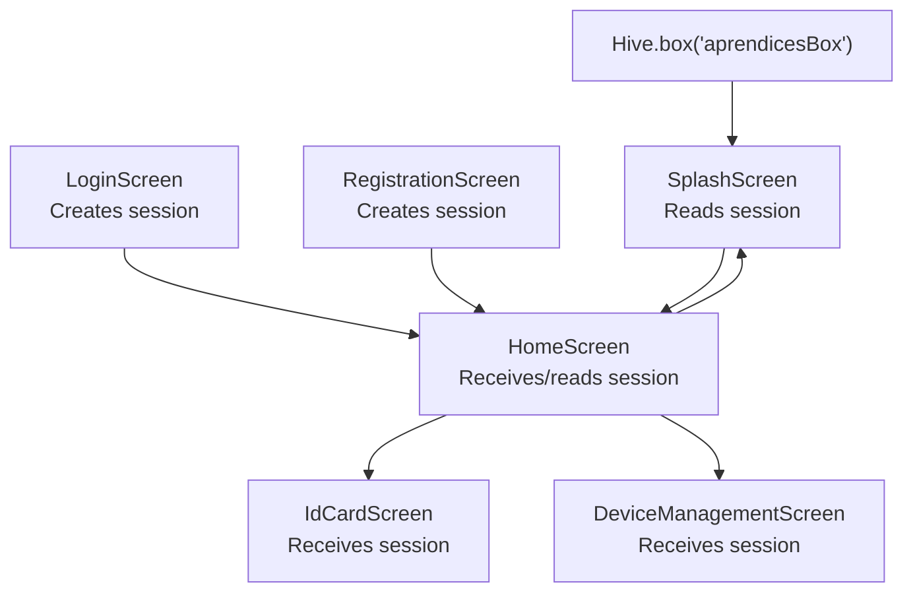

# Gestión de sesiones

> **Archivos fuente relevantes**
> * [lib/main.dart](https://github.com/axchisan/AppGestionCarnetsSENA/blob/9eb64390/lib/main.dart)
> * [lib/pantallas/pantalla_de_inicio.dart](https://github.com/axchisan/AppGestionCarnetsSENA/blob/9eb64390/lib/screens/home_screen.dart)
> * [lib/pantallas/pantalla_salpicada.dart](https://github.com/axchisan/AppGestionCarnetsSENA/blob/9eb64390/lib/screens/splash_screen.dart)
> * [lib/servicios/servicio_de_base_de_datos.dart](https://github.com/axchisan/AppGestionCarnetsSENA/blob/9eb64390/lib/services/database_service.dart)

## Propósito y alcance

Este documento describe cómo se detectan, mantienen y finalizan las sesiones de usuario en la aplicación de la Tarjeta de Identificación Digital SENA. La gestión de sesiones se implementa mediante el almacenamiento local de Hive para habilitar la funcionalidad sin conexión y conservar el estado de inicio de sesión del usuario tras cada inicio de sesión.

Para obtener información sobre el proceso de autenticación que crea sesiones, consulte [Flujo de inicio de sesión](/axchisan/AppGestionCarnetsSENA/4.1-login-flow) y [Flujo de registro](/axchisan/AppGestionCarnetsSENA/4.2-registration-flow) . Para obtener más información sobre la seguridad de las contraseñas y el manejo de credenciales, consulte [Implementación de seguridad](/axchisan/AppGestionCarnetsSENA/4.4-security-implementation) .

## Arquitectura de almacenamiento de sesiones

La aplicación utiliza un **modelo de sesión sin estado,** donde la presencia de un `Aprendiz`objeto en el cuadro de Hive indica una sesión activa. No hay tokens de sesión explícitos ni tiempos de expiración; las sesiones persisten indefinidamente hasta que se cierran explícitamente al cerrar la sesión.

### Estructura de la caja de colmena

| Nombre de la caja | Tipo | Objetivo | Máximo de artículos |
| --- | --- | --- | --- |
| `aprendicesBox` | `Box<Aprendiz>` | Almacena datos de usuarios autenticados | 1 usuario activo |
| Llave | `String`(idIdentificación) | Número de identificación del usuario | - |
| Valor | `Aprendiz`objeto | Perfil de usuario completo con dispositivos | - |

El cuadro se inicializa en[lib/main.dart L14-L19](https://github.com/axchisan/AppGestionCarnetsSENA/blob/9eb64390/lib/main.dart#L14-L19)

:

```
void main() async {
  WidgetsFlutterBinding.ensureInitialized();
  await Hive.initFlutter();
  Hive.registerAdapter(AprendizAdapter());
  Hive.registerAdapter(DispositivoAdapter());
  await Hive.openBox<Aprendiz>('aprendicesBox');
```

**Fuentes:** [lib/main.dart L14-L19](https://github.com/axchisan/AppGestionCarnetsSENA/blob/9eb64390/lib/main.dart#L14-L19)

 [database_service.dart L10-L19](https://github.com/axchisan/AppGestionCarnetsSENA/blob/9eb64390/lib/services/database_service.dart#L10-L19)

## Máquina de estados del ciclo de vida de la sesión

```

```

**Fuentes:** [splash_screen.dart L15-L33](https://github.com/axchisan/AppGestionCarnetsSENA/blob/9eb64390/lib/screens/splash_screen.dart#L15-L33)

 [home_screen.dart L18-L21](https://github.com/axchisan/AppGestionCarnetsSENA/blob/9eb64390/lib/screens/home_screen.dart#L18-L21)

 [database_service.dart L42-L46](https://github.com/axchisan/AppGestionCarnetsSENA/blob/9eb64390/lib/services/database_service.dart#L42-L46)

## Detección de sesión (pantalla de bienvenida)

Actúa `SplashScreen`como enrutador de sesión cada vez que se inicia la aplicación. Implementa un algoritmo de detección simple:



### Detalles de implementación

La lógica de detección de sesión está en[splash_screen.dart L21-L33](https://github.com/axchisan/AppGestionCarnetsSENA/blob/9eb64390/lib/screens/splash_screen.dart#L21-L33)

:

| Línea | Operación | Objetivo |
| --- | --- | --- |
| 22 | `await Future.delayed(Duration(seconds: 2))` | Retraso de la interfaz de usuario para la visibilidad de la pantalla de inicio |
| 23 | `final box = Hive.box<Aprendiz>('aprendicesBox')` | Acceder al almacenamiento de sesiones |
| 24 | `box.values.isNotEmpty ? box.values.first : null` | Comprobar si hay sesión activa |
| 28 | `Navigator.pushReplacementNamed('/inicio', arguments: aprendiz)` | Ruta a la pantalla de inicio con sesión |
| 30 | `Navigator.pushReplacementNamed('/login')` | Ruta a LoginScreen sin sesión |

**Supuesto:** La aplicación solo admite sesiones de un solo usuario. Si `Aprendiz`existen varios objetos en el cuadro (caso extremo), `box.values.first`se utiliza solo [se necesita contexto para "only"].

**Fuentes:** [splash_screen.dart L21-L33](https://github.com/axchisan/AppGestionCarnetsSENA/blob/9eb64390/lib/screens/splash_screen.dart#L21-L33)

## Creación de sesión

Las sesiones se crean mediante dos vías: inicio de sesión y registro. Ambas se escriben en el `aprendicesBox`servidor de Hive.

### Ruta de inicio de sesión



The login flow **does not explicitly call** `saveAprendiz()` to cache the session. Instead, `LoginScreen` directly puts the returned `Aprendiz` object into Hive after successful authentication. This is handled in the login screen's form submission logic.

**Sources:** [lib/services/database_service.dart L129-L169](https://github.com/axchisan/AppGestionCarnetsSENA/blob/9eb64390/lib/services/database_service.dart#L129-L169)

### Registration Path



The registration flow uses `DatabaseService.saveAprendiz()` in [lib/services/database_service.dart L42-L46](https://github.com/axchisan/AppGestionCarnetsSENA/blob/9eb64390/lib/services/database_service.dart#L42-L46)

:

| Line | Operation |
| --- | --- |
| 44 | `await _aprendicesBox.put(aprendiz.idIdentificacion, aprendiz)` - Creates session |
| 45 | `await _syncToPostgres(aprendiz)` - Syncs to remote database |

**Sources:** [lib/services/database_service.dart L42-L46](https://github.com/axchisan/AppGestionCarnetsSENA/blob/9eb64390/lib/services/database_service.dart#L42-L46)

## Session Retrieval

Feature screens access the active session through two mechanisms:

### Mechanism 1: Route Arguments

Screens receive the `Aprendiz` object as route arguments when navigated to:



Route definitions in [lib/main.dart L50-L70](https://github.com/axchisan/AppGestionCarnetsSENA/blob/9eb64390/lib/main.dart#L50-L70)

 extract arguments:

```javascript
'/inicio': (context) {
  final args = ModalRoute.of(context)?.settings.arguments;
  if (args is Aprendiz) {
    return HomeScreen(aprendiz: args);
  }
  return const HomeScreen();
}
```

**Sources:** [lib/main.dart L50-L70](https://github.com/axchisan/AppGestionCarnetsSENA/blob/9eb64390/lib/main.dart#L50-L70)

### Mechanism 2: Direct Hive Access

Screens can directly query the Hive box as a fallback:



Example from [lib/screens/home_screen.dart L14-L16](https://github.com/axchisan/AppGestionCarnetsSENA/blob/9eb64390/lib/screens/home_screen.dart#L14-L16)

:

```
final box = Hive.box<Aprendiz>('aprendicesBox');
final primerAprendiz = aprendiz ?? (box.values.isNotEmpty ? box.values.first : null);
```

**Sources:** [lib/screens/home_screen.dart L14-L16](https://github.com/axchisan/AppGestionCarnetsSENA/blob/9eb64390/lib/screens/home_screen.dart#L14-L16)

### DatabaseService Session Retrieval

For programmatic access within business logic, use `DatabaseService.getAprendizFromLocal()`:

| Method | Parameters | Returns | Purpose |
| --- | --- | --- | --- |
| `getAprendizFromLocal` | `String id` | `Future<Aprendiz?>` | Retrieve session by identification number |

Implementation in [lib/services/database_service.dart L121-L127](https://github.com/axchisan/AppGestionCarnetsSENA/blob/9eb64390/lib/services/database_service.dart#L121-L127)

:

```
Future<Aprendiz?> getAprendizFromLocal(String id) async {
  try {
    return _aprendicesBox.get(id);
  } catch (e) {
    return null;
  }
}
```

**Sources:** [lib/services/database_service.dart L121-L127](https://github.com/axchisan/AppGestionCarnetsSENA/blob/9eb64390/lib/services/database_service.dart#L121-L127)

## Session Persistence and Updates

The `Aprendiz` object in the Hive box is updated whenever user data changes:

### Update Triggers

| User Action | Method Called | Session Impact |
| --- | --- | --- |
| Add device | `DatabaseService.addDevice()` | Retrieves session, modifies `dispositivos` list, saves back |
| Edit profile | `DatabaseService.saveAprendiz()` | Overwrites entire `Aprendiz` object |
| Sync from remote | `DatabaseService.getAprendizFromPostgres()` | Replaces cached session with remote data |

### Device Addition Flow

```mermaid
sequenceDiagram
  participant DeviceManagementScreen
  participant DatabaseService.addDevice()
  participant Hive.box('aprendicesBox')

  DeviceManagementScreen->>DatabaseService.addDevice(): "addDevice(id, name, deviceId, type)"
  DatabaseService.addDevice()->>DatabaseService.addDevice(): "getAprendizFromLocal(id)"
  DatabaseService.addDevice()->>Hive.box('aprendicesBox'): "box.get(id)"
  Hive.box('aprendicesBox')-->>DatabaseService.addDevice(): "Return current Aprendiz"
  DatabaseService.addDevice()->>DatabaseService.addDevice(): "Construct new Dispositivo"
  DatabaseService.addDevice()->>DatabaseService.addDevice(): "Create updatedAprendiz with new device"
  DatabaseService.addDevice()->>DatabaseService.addDevice(): "saveAprendiz(updatedAprendiz)"
  DatabaseService.addDevice()->>Hive.box('aprendicesBox'): "box.put(id, updatedAprendiz)"
  Hive.box('aprendicesBox')-->>DatabaseService.addDevice(): "Success"
  DatabaseService.addDevice()->>DatabaseService.addDevice(): "_syncToPostgres(updatedAprendiz)"
  DatabaseService.addDevice()-->>DeviceManagementScreen: "Return"
```

Implementation in [lib/services/database_service.dart L211-L238](https://github.com/axchisan/AppGestionCarnetsSENA/blob/9eb64390/lib/services/database_service.dart#L211-L238)

 demonstrates immutable update pattern:

1. Retrieve current `Aprendiz` from Hive
2. Create new `Dispositivo` object
3. Construct entirely new `Aprendiz` object with updated `dispositivos` list
4. Save new object, replacing old one

**Sources:** [lib/services/database_service.dart L211-L238](https://github.com/axchisan/AppGestionCarnetsSENA/blob/9eb64390/lib/services/database_service.dart#L211-L238)

## Session Termination (Logout)

The logout process is destructive and immediate:



### Logout Implementation

The logout function in [lib/screens/home_screen.dart L18-L21](https://github.com/axchisan/AppGestionCarnetsSENA/blob/9eb64390/lib/screens/home_screen.dart#L18-L21)

:

```
void _logout() async {
  await box.clear();
  Navigator.pushReplacementNamed(context, '/splash');
}
```

| Operation | Effect |
| --- | --- |
| `box.clear()` | Deletes all `Aprendiz` objects from `aprendicesBox` |
| `Navigator.pushReplacementNamed('/splash')` | Returns to session detection flow |

**Confirmation Dialog:** The logout is protected by an `AlertDialog` in [lib/screens/home_screen.dart L30-L51](https://github.com/axchisan/AppGestionCarnetsSENA/blob/9eb64390/lib/screens/home_screen.dart#L30-L51)

 to prevent accidental session termination.

**Sources:** [lib/screens/home_screen.dart L18-L51](https://github.com/axchisan/AppGestionCarnetsSENA/blob/9eb64390/lib/screens/home_screen.dart#L18-L51)

## Session Scope and Limitations

### Single-User Constraint

The application architecture assumes **one active user per device**:

* `SplashScreen` uses `box.values.first` without iteration
* `HomeScreen` defaults to `box.values.first` if no argument provided
* Logout clears entire box, not individual users

### No Automatic Expiration

Sessions have **no timeout mechanism**:

* No `lastActiveTime` or session duration tracking
* Sessions persist across app restarts indefinitely
* Only explicit logout terminates sessions

### Offline Session Validity

Sessions remain valid offline:

* `Aprendiz` objects contain complete user profile
* Feature screens work with cached data when internet unavailable
* Sync to PostgreSQL happens opportunistically via `_syncToPostgres()`

**Sources:** [lib/screens/splash_screen.dart L23-L24](https://github.com/axchisan/AppGestionCarnetsSENA/blob/9eb64390/lib/screens/splash_screen.dart#L23-L24)

 [lib/screens/home_screen.dart L15-L16](https://github.com/axchisan/AppGestionCarnetsSENA/blob/9eb64390/lib/screens/home_screen.dart#L15-L16)

## Session Data Structure

The `Aprendiz` model stored in the session contains:

| Field | Type | Purpose | Cached |
| --- | --- | --- | --- |
| `idIdentificacion` | `String` | Primary key, session identifier | Yes |
| `nombreCompleto` | `String` | Display name | Yes |
| `programaFormacion` | `String` | Training program | Yes |
| `numeroFicha` | `String` | Class number | Yes |
| `tipoSangre` | `String?` | Blood type | Yes |
| `fotoPerfilPath` | `String?` | Ruta del archivo local a la foto de perfil | Sí |
| `contrasena` | `String` | Contraseña cifrada (SHA-256) | Sí |
| `email` | `String?` | Correo electrónico de contacto | Sí |
| `fechaRegistro` | `DateTime` | Marca de tiempo de registro | Sí |
| `dispositivos` | `List<Dispositivo>` | Dispositivos registrados | Sí |

**Nota de seguridad:** La contraseña cifrada se almacena en la sesión local. Mientras esté cifrada, esto significa que el acceso al dispositivo es igual al acceso a la cuenta. Para obtener información sobre seguridad mejorada, consulte [Implementación de seguridad](/axchisan/AppGestionCarnetsSENA/4.4-security-implementation) .

**Fuentes:** [lib/modelos/modelos.dart](https://github.com/axchisan/AppGestionCarnetsSENA/blob/9eb64390/lib/models/models.dart)

(referenciado),[database_service.dart L151-L162](https://github.com/axchisan/AppGestionCarnetsSENA/blob/9eb64390/lib/services/database_service.dart#L151-L162)

## Integración con el sistema de navegación

Los datos de la sesión fluyen a través del sistema de enrutamiento:



Todas las rutas esperan `Aprendiz`implementar un patrón de respaldo:

```javascript
final args = ModalRoute.of(context)?.settings.arguments;
if (args is Aprendiz) {
  return ScreenWidget(aprendiz: args);
}
return const ScreenWidget(); // or error handling
```

**Fuentes:** [lib/main.dart L46-L71](https://github.com/axchisan/AppGestionCarnetsSENA/blob/9eb64390/lib/main.dart#L46-L71)

 [home_screen.dart L230-L243](https://github.com/axchisan/AppGestionCarnetsSENA/blob/9eb64390/lib/screens/home_screen.dart#L230-L243)