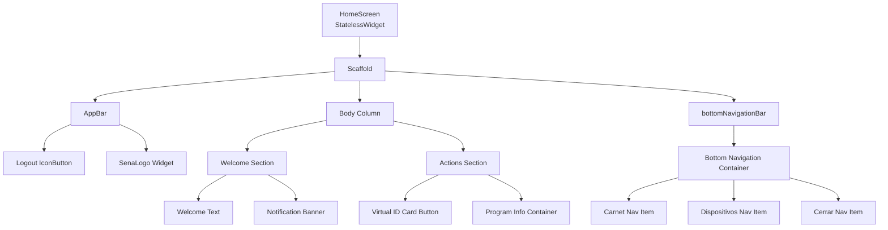
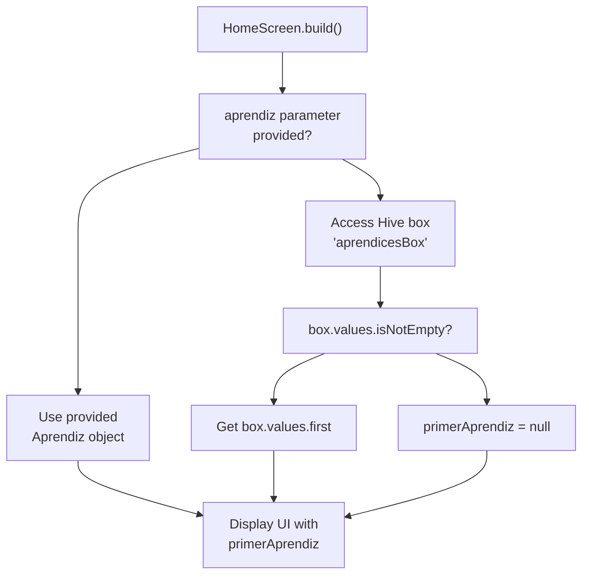
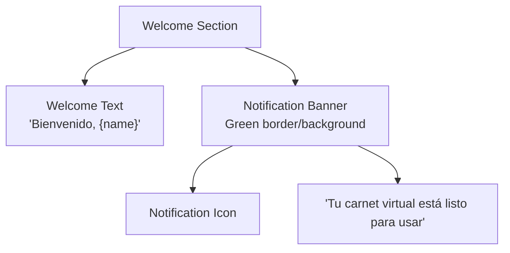
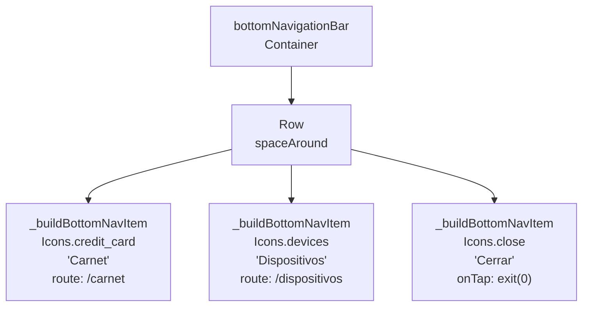
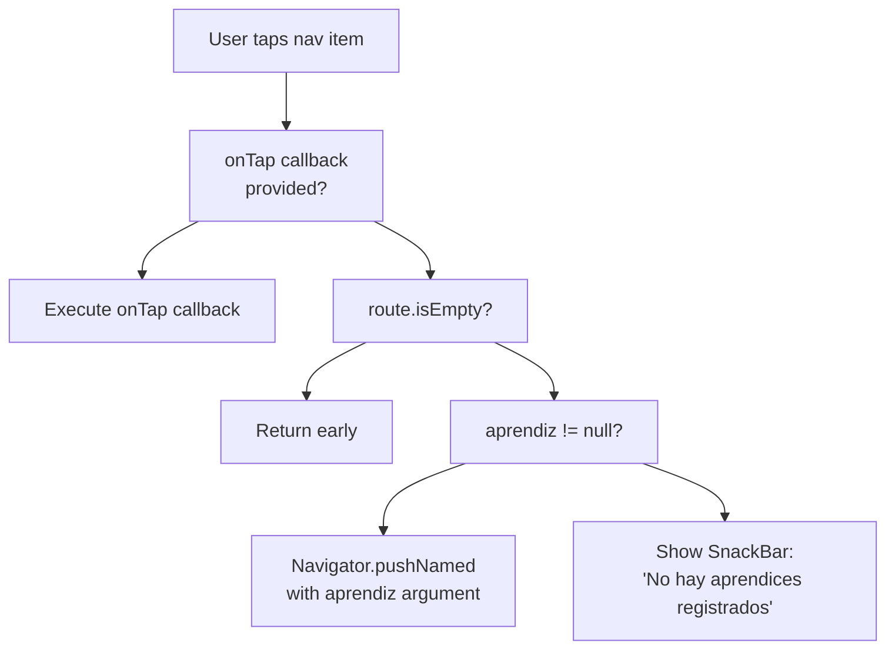
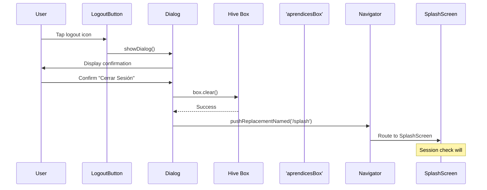

# Home Screen

> **Relevant source files**
> * [lib/models/models.dart](https://github.com/axchisan/AppGestionCarnetsSENA/blob/9eb64390/lib/models/models.dart)
> * [lib/models/models.g.dart](https://github.com/axchisan/AppGestionCarnetsSENA/blob/9eb64390/lib/models/models.g.dart)
> * [lib/screens/home_screen.dart](https://github.com/axchisan/AppGestionCarnetsSENA/blob/9eb64390/lib/screens/home_screen.dart)
> * [lib/services/database_service.dart](https://github.com/axchisan/AppGestionCarnetsSENA/blob/9eb64390/lib/services/database_service.dart)
> * [macos/Flutter/GeneratedPluginRegistrant.swift](https://github.com/axchisan/AppGestionCarnetsSENA/blob/9eb64390/macos/Flutter/GeneratedPluginRegistrant.swift)

## Purpose and Scope

This document covers the Home Screen (`HomeScreen` widget), which serves as the central dashboard and navigation hub for authenticated users in the SENA Digital ID Card application. The Home Screen displays user profile information, provides quick access to the virtual ID card, and offers navigation to other feature screens.

For information about authentication and initial routing to the Home Screen, see [Session Management](/axchisan/AppGestionCarnetsSENA/4.3-session-management). For details about the screens accessible from the Home Screen, see [Virtual ID Card Display](/axchisan/AppGestionCarnetsSENA/5.2-virtual-id-card-display) and [Device Management](/axchisan/AppGestionCarnetsSENA/5.3-device-management).

**Sources:** [lib/screens/home_screen.dart L1-L301](https://github.com/axchisan/AppGestionCarnetsSENA/blob/9eb64390/lib/screens/home_screen.dart#L1-L301)

---

## Overview

The `HomeScreen` is a stateless Flutter widget that acts as the primary landing page after successful authentication. It retrieves user data from local storage (Hive) and presents a personalized dashboard with navigation options to core application features. The screen operates in offline mode by loading data exclusively from the local Hive box.

### Key Responsibilities

| Responsibility | Implementation |
| --- | --- |
| **User Data Display** | Loads `Aprendiz` object from Hive box `'aprendicesBox'` |
| **Profile Information** | Shows welcome message, program name, and ficha number |
| **Quick Actions** | Provides direct access to virtual ID card screen |
| **Navigation Hub** | Bottom navigation bar routes to feature screens |
| **Session Management** | Logout functionality clears local storage |

**Sources:** [lib/screens/home_screen.dart L8-L22](https://github.com/axchisan/AppGestionCarnetsSENA/blob/9eb64390/lib/screens/home_screen.dart#L8-L22)

---

## Screen Architecture

### Component Hierarchy



**Diagram: HomeScreen widget component tree showing the hierarchical structure of UI elements**

**Sources:** [lib/screens/home_screen.dart L23-L257](https://github.com/axchisan/AppGestionCarnetsSENA/blob/9eb64390/lib/screens/home_screen.dart#L23-L257)

---

## Data Loading Strategy

The Home Screen implements a fallback mechanism for loading user data:



**Diagram: Data loading logic flow showing parameter and Hive box fallback strategy**

### Implementation Details

The data loading occurs at build time using this pattern:

```
final box = Hive.box<Aprendiz>('aprendicesBox');
final primerAprendiz = aprendiz ?? (box.values.isNotEmpty ? box.values.first : null);
```

| Scenario | Data Source | Result |
| --- | --- | --- |
| Constructor parameter provided | `aprendiz` parameter from route arguments | Use passed `Aprendiz` object |
| No parameter, Hive box has data | First value from `box.values` | Use locally cached `Aprendiz` |
| No parameter, Hive box empty | `null` | Display "Invitado" (guest) placeholders |

**Sources:** [lib/screens/home_screen.dart L15-L16](https://github.com/axchisan/AppGestionCarnetsSENA/blob/9eb64390/lib/screens/home_screen.dart#L15-L16)

---

## User Interface Layout

### AppBar Configuration

The AppBar displays the SENA logo centered with a logout button on the left:

| Element | Widget Type | Configuration | Location |
| --- | --- | --- | --- |
| **Background** | AppBar | `backgroundColor: AppColors.white`, `elevation: 0` | Full width |
| **Logout Button** | IconButton | `Icons.logout`, triggers logout confirmation dialog | `leading` position |
| **SENA Logo** | SenaLogo | `width: 120`, `height: 40`, `showShadow: false` | `centerTitle: true` |

**Sources:** [lib/screens/home_screen.dart L25-L59](https://github.com/axchisan/AppGestionCarnetsSENA/blob/9eb64390/lib/screens/home_screen.dart#L25-L59)

### Welcome Section

Located in the upper portion of the screen body:



**Diagram: Welcome section components showing text and notification banner structure**

The welcome message dynamically displays the user's full name or defaults to "Invitado" if no user data is available: `'Bienvenido, ${primerAprendiz?.nombreCompleto ?? 'Invitado'}'`

**Sources:** [lib/screens/home_screen.dart L64-L106](https://github.com/axchisan/AppGestionCarnetsSENA/blob/9eb64390/lib/screens/home_screen.dart#L64-L106)

### Virtual ID Card Button

The primary action button occupies the center of the screen with prominent styling:

| Property | Value | Purpose |
| --- | --- | --- |
| **Gradient** | `[AppColors.senaGreen, AppColors.senaGreenDark]` | Visual hierarchy emphasis |
| **Shadow** | `blurRadius: 8`, `offset: (0, 4)` | Depth perception |
| **Padding** | `EdgeInsets.all(24)` | Touch target size |
| **Icon** | `Icons.credit_card`, `size: 48` | Visual affordance |
| **Route** | `'/carnet'` | Navigation destination |

The button includes validation to ensure user data exists before navigation:

```javascript
onTap: () {
  if (primerAprendiz != null) {
    Navigator.pushNamed(context, '/carnet', arguments: primerAprendiz);
  } else {
    ScaffoldMessenger.of(context).showSnackBar(
      const SnackBar(content: Text('No hay aprendices registrados')),
    );
  }
}
```

**Sources:** [lib/screens/home_screen.dart L113-L174](https://github.com/axchisan/AppGestionCarnetsSENA/blob/9eb64390/lib/screens/home_screen.dart#L113-L174)

### Program Information Display

Shows the user's current training program details in a gray container:

| Field | Data Source | Fallback Value |
| --- | --- | --- |
| **Program Name** | `primerAprendiz?.programaFormacion` | "No disponible" |
| **Ficha Number** | `primerAprendiz?.numeroFicha` | "N/A" |

**Sources:** [lib/screens/home_screen.dart L176-L212](https://github.com/axchisan/AppGestionCarnetsSENA/blob/9eb64390/lib/screens/home_screen.dart#L176-L212)

---

## Bottom Navigation Bar

### Navigation Architecture



**Diagram: Bottom navigation bar structure with three navigation items and their configurations**

### Navigation Item Builder

The `_buildBottomNavItem` helper method creates consistent navigation buttons:

**Method Signature:**

```
Widget _buildBottomNavItem(
  BuildContext context,
  IconData icon,
  String label,
  String route,
  Aprendiz? aprendiz, {
  VoidCallback? onTap,
})
```

**Parameters:**

| Parameter | Type | Purpose |
| --- | --- | --- |
| `context` | `BuildContext` | For navigation and snackbar display |
| `icon` | `IconData` | Icon to display in navigation item |
| `label` | `String` | Text label below icon |
| `route` | `String` | Navigation route path (empty for custom actions) |
| `aprendiz` | `Aprendiz?` | User data to pass to target screen |
| `onTap` | `VoidCallback?` | Optional custom tap handler |

### Navigation Behavior

The navigation items implement different behaviors based on configuration:



**Diagram: Navigation item tap handling logic with validation and error handling**

**Sources:** [lib/screens/home_screen.dart L220-L300](https://github.com/axchisan/AppGestionCarnetsSENA/blob/9eb64390/lib/screens/home_screen.dart#L220-L300)

---

## Logout Functionality

### Logout Flow



**Diagram: Logout sequence showing confirmation dialog and session clearing process**

### Implementation

The `_logout` method is defined as an async function within the build method:

```
void _logout() async {
  await box.clear();
  Navigator.pushReplacementNamed(context, '/splash');
}
```

The logout button in the AppBar triggers a confirmation dialog before executing logout:

| Dialog Element | Configuration |
| --- | --- |
| **Title** | "Cerrar Sesión" |
| **Content** | "¿Estás seguro de que quieres cerrar sesión?" |
| **Cancel Button** | Dismisses dialog, no action |
| **Confirm Button** | Calls `_logout()`, then closes dialog |

**Key Behavior:**

1. Clears all data from the `'aprendicesBox'` Hive box
2. Uses `pushReplacementNamed` to prevent back navigation to Home Screen
3. Routes to `'/splash'`, which will detect no session and redirect to `'/login'`

**Sources:** [lib/screens/home_screen.dart L18-L51](https://github.com/axchisan/AppGestionCarnetsSENA/blob/9eb64390/lib/screens/home_screen.dart#L18-L51)

---

## Route Integration

### Incoming Routes

The Home Screen can be reached via these navigation paths:

| Source Screen | Route Method | Route Name | Arguments |
| --- | --- | --- | --- |
| **SplashScreen** | `Navigator.pushReplacementNamed` | `'/inicio'` | `Aprendiz` object |
| **LoginScreen** | `Navigator.pushReplacementNamed` | `'/inicio'` | `Aprendiz` object |
| **RegistrationScreen** | `Navigator.pushReplacementNamed` | `'/inicio'` | `Aprendiz` object |
| **IdCardScreen** | Back navigation | N/A | N/A |
| **DeviceManagementScreen** | Back navigation | N/A | N/A |

### Outgoing Routes

The Home Screen navigates to other screens:

| Target Screen | Route Name | Navigation Method | Arguments Passed |
| --- | --- | --- | --- |
| **SplashScreen** | `'/splash'` | `pushReplacementNamed` | None (logout flow) |
| **IdCardScreen** | `'/carnet'` | `pushNamed` | `primerAprendiz` |
| **DeviceManagementScreen** | `'/dispositivos'` | `pushNamed` | `primerAprendiz` |

**Sources:** [lib/screens/home_screen.dart L20-L274](https://github.com/axchisan/AppGestionCarnetsSENA/blob/9eb64390/lib/screens/home_screen.dart#L20-L274)

---

## Dependencies

### Internal Dependencies

| Import | Purpose |
| --- | --- |
| `dart:io` | Provides `exit()` function for app termination |
| `package:flutter/material.dart` | Core Flutter widgets and Material Design components |
| `package:hive/hive.dart` | Access to Hive local storage box |
| `../utils/app_colors.dart` | Application color constants (`AppColors`) |
| `../widgets/sena_logo.dart` | SENA logo widget displayed in AppBar |
| `../models/models.dart` | `Aprendiz` data model definition |

**Sources:** [lib/screens/home_screen.dart L1-L6](https://github.com/axchisan/AppGestionCarnetsSENA/blob/9eb64390/lib/screens/home_screen.dart#L1-L6)

### External Widget Usage

The Home Screen utilizes these custom widgets:

* **SenaLogo**: Displayed in the AppBar with `width: 120`, `height: 40`, `showShadow: false`

For detailed information about custom widgets, see [Branding and Visual Components](/axchisan/AppGestionCarnetsSENA/6.2-branding-and-visual-components).

---

## Offline Capability

The Home Screen is fully functional without network connectivity:

| Feature | Offline Support | Data Source |
| --- | --- | --- |
| User profile display | ✅ Full | Hive local storage |
| Navigation to ID card | ✅ Full | Cached `Aprendiz` data |
| Navigation to devices | ✅ Full | Cached `Aprendiz` data |
| Logout functionality | ✅ Full | Local Hive box operations |

The screen never accesses `DatabaseService` or makes network requests, relying entirely on the `Aprendiz` object from Hive box `'aprendicesBox'`. This design ensures the Home Screen remains responsive even without internet connectivity.

**Sources:** [lib/screens/home_screen.dart L15-L16](https://github.com/axchisan/AppGestionCarnetsSENA/blob/9eb64390/lib/screens/home_screen.dart#L15-L16)

---

## Error Handling

### Validation Checks

| Scenario | Check | User Feedback |
| --- | --- | --- |
| **No user data in Hive** | `primerAprendiz == null` | Display "Invitado" placeholder text |
| **Navigate to ID card without data** | `primerAprendiz != null` | Show SnackBar: "No hay aprendices registrados" |
| **Navigate to devices without data** | `aprendiz != null` | Show SnackBar: "No hay aprendices registrados" |

The validation prevents navigation to feature screens when user data is unavailable, ensuring graceful degradation rather than runtime errors.

**Sources:** [lib/screens/home_screen.dart L115-L278](https://github.com/axchisan/AppGestionCarnetsSENA/blob/9eb64390/lib/screens/home_screen.dart#L115-L278)