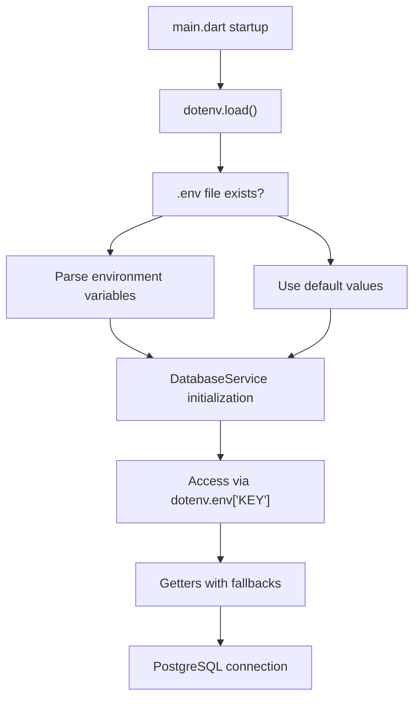
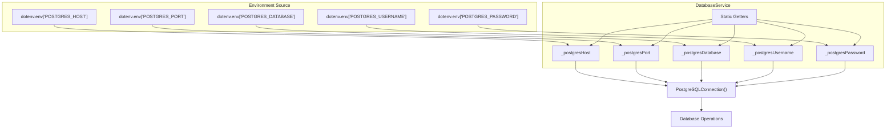
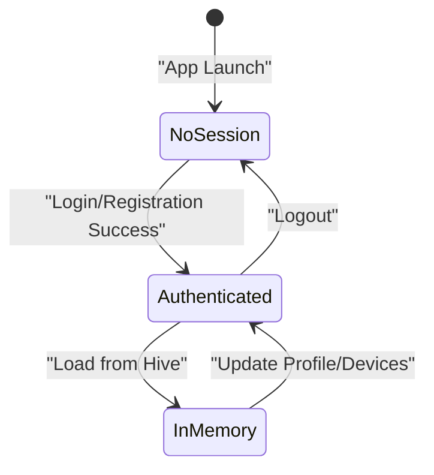
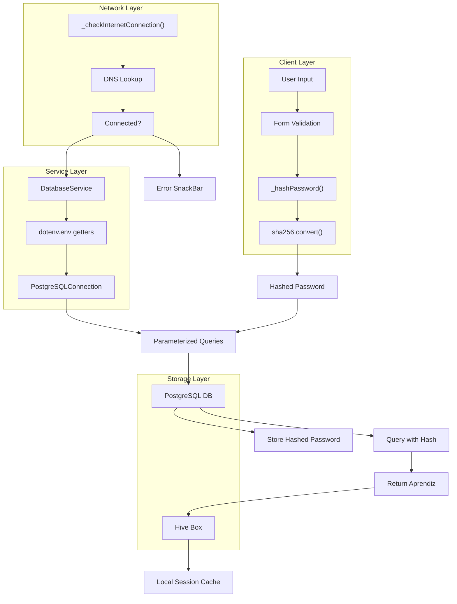

# Security Implementation

> **Relevant source files**
> * [lib/screens/login_screen.dart](https://github.com/axchisan/AppGestionCarnetsSENA/blob/9eb64390/lib/screens/login_screen.dart)
> * [lib/screens/registration_screen.dart](https://github.com/axchisan/AppGestionCarnetsSENA/blob/9eb64390/lib/screens/registration_screen.dart)
> * [lib/services/database_service.dart](https://github.com/axchisan/AppGestionCarnetsSENA/blob/9eb64390/lib/services/database_service.dart)
> * [pubspec.yaml](https://github.com/axchisan/AppGestionCarnetsSENA/blob/9eb64390/pubspec.yaml)

## Purpose and Scope

This document covers the security mechanisms implemented in the SENA Digital ID Card application to protect user credentials, database access, and sensitive data. The security architecture includes client-side password hashing, environment-based configuration management, and secure session handling.

For authentication workflows that utilize these security features, see [Login Flow](/axchisan/AppGestionCarnetsSENA/4.1-login-flow) and [Registration Flow](/axchisan/AppGestionCarnetsSENA/4.2-registration-flow). For session lifecycle management, see [Session Management](/axchisan/AppGestionCarnetsSENA/4.3-session-management).

---

## Password Security Architecture

The application implements client-side password hashing using the SHA-256 cryptographic hash function. Passwords are never transmitted or stored in plain text.

### SHA-256 Hashing Implementation

Both `LoginScreen` and `RegistrationScreen` implement identical password hashing logic using the `crypto` package.

**Hash Function Implementation:**

| Component | Implementation Detail |
| --- | --- |
| **Algorithm** | SHA-256 |
| **Package** | `crypto: ^3.0.6` |
| **Input Encoding** | UTF-8 byte array |
| **Output Format** | Hexadecimal string |
| **Timing** | Pre-transmission (client-side) |

The hashing function is defined identically in both authentication screens:

[lib/screens/login_screen.dart L34-L38](https://github.com/axchisan/AppGestionCarnetsSENA/blob/9eb64390/lib/screens/login_screen.dart#L34-L38)

[lib/screens/registration_screen.dart L119-L123](https://github.com/axchisan/AppGestionCarnetsSENA/blob/9eb64390/lib/screens/registration_screen.dart#L119-L123)

### Password Hashing Flow

```mermaid
sequenceDiagram
  participant User
  participant LoginScreen/RegistrationScreen
  participant _hashPassword()
  participant crypto.sha256
  participant DatabaseService
  participant PostgreSQL

  User->>LoginScreen/RegistrationScreen: "Enter password"
  LoginScreen/RegistrationScreen->>LoginScreen/RegistrationScreen: "Form validation"
  LoginScreen/RegistrationScreen->>_hashPassword(): "password string"
  _hashPassword()->>crypto.sha256: "utf8.encode(password)"
  crypto.sha256->>crypto.sha256: "sha256.convert(bytes)"
  crypto.sha256-->>_hashPassword(): "digest hash"
  _hashPassword()-->>LoginScreen/RegistrationScreen: "hexadecimal string"
  LoginScreen/RegistrationScreen->>DatabaseService: "getAprendizFromPostgres(id, hashedPassword)"
  DatabaseService->>PostgreSQL: "SELECT WHERE contrasena = @password"
  PostgreSQL-->>DatabaseService: "Query result"
  DatabaseService-->>LoginScreen/RegistrationScreen: "Aprendiz or null"
```

**Sources:** [lib/screens/login_screen.dart L34-L38](https://github.com/axchisan/AppGestionCarnetsSENA/blob/9eb64390/lib/screens/login_screen.dart#L34-L38)

 [lib/screens/registration_screen.dart L119-L123](https://github.com/axchisan/AppGestionCarnetsSENA/blob/9eb64390/lib/screens/registration_screen.dart#L119-L123)

 [lib/screens/login_screen.dart L67](https://github.com/axchisan/AppGestionCarnetsSENA/blob/9eb64390/lib/screens/login_screen.dart#L67-L67)

 [lib/screens/registration_screen.dart L162](https://github.com/axchisan/AppGestionCarnetsSENA/blob/9eb64390/lib/screens/registration_screen.dart#L162-L162)

---

## Environment Variable Management

Database credentials and sensitive configuration values are managed through environment variables using the `flutter_dotenv` package. This prevents hardcoding credentials in source code and allows environment-specific configuration.

### Environment File Structure

The application expects a `.env` file in the project root containing PostgreSQL connection parameters:

| Variable | Purpose | Default Fallback |
| --- | --- | --- |
| `POSTGRES_HOST` | PostgreSQL server hostname | `'default_host'` |
| `POSTGRES_PORT` | PostgreSQL server port | `5432` |
| `POSTGRES_DATABASE` | Database name | `'default_db'` |
| `POSTGRES_USERNAME` | Database username | `'default_user'` |
| `POSTGRES_PASSWORD` | Database password | `'default_password'` |

**Configuration Loading:**

The `DatabaseService` class accesses environment variables with null-safe fallback values:

[lib/services/database_service.dart L12-L17](https://github.com/axchisan/AppGestionCarnetsSENA/blob/9eb64390/lib/services/database_service.dart#L12-L17)

### Environment Loading Process



**Sources:** [lib/services/database_service.dart L6](https://github.com/axchisan/AppGestionCarnetsSENA/blob/9eb64390/lib/services/database_service.dart#L6-L6)

 [lib/services/database_service.dart L12-L17](https://github.com/axchisan/AppGestionCarnetsSENA/blob/9eb64390/lib/services/database_service.dart#L12-L17)

 [pubspec.yaml L22](https://github.com/axchisan/AppGestionCarnetsSENA/blob/9eb64390/pubspec.yaml#L22-L22)

---

## Database Credential Security

### Credential Storage Strategy

The application implements a layered approach to database credential security:

1. **Source Control Exclusion**: The `.env` file is excluded from version control (assumed via `.gitignore`)
2. **Runtime Loading**: Credentials are loaded at application startup via `flutter_dotenv`
3. **Encapsulation**: DatabaseService encapsulates all credential access through private getters
4. **Fallback Protection**: Default values prevent null pointer exceptions if `.env` is missing

### PostgreSQL Connection Security



**Sources:** [lib/services/database_service.dart L13-L17](https://github.com/axchisan/AppGestionCarnetsSENA/blob/9eb64390/lib/services/database_service.dart#L13-L17)

 [lib/services/database_service.dart L23-L29](https://github.com/axchisan/AppGestionCarnetsSENA/blob/9eb64390/lib/services/database_service.dart#L23-L29)

### Connection Instantiation Pattern

Every database operation creates a new connection instance using credentials from environment getters:

[lib/services/database_service.dart L23-L29](https://github.com/axchisan/AppGestionCarnetsSENA/blob/9eb64390/lib/services/database_service.dart#L23-L29)

The connection pattern is repeated across all database methods:

* `validateIdentification()` - [lib/services/database_service.dart L23-L29](https://github.com/axchisan/AppGestionCarnetsSENA/blob/9eb64390/lib/services/database_service.dart#L23-L29)
* `_syncToPostgres()` - [lib/services/database_service.dart L51-L57](https://github.com/axchisan/AppGestionCarnetsSENA/blob/9eb64390/lib/services/database_service.dart#L51-L57)
* `getAprendizFromPostgres()` - [lib/services/database_service.dart L131-L137](https://github.com/axchisan/AppGestionCarnetsSENA/blob/9eb64390/lib/services/database_service.dart#L131-L137)
* `_loadDevicesFromPostgres()` - [lib/services/database_service.dart L173-L179](https://github.com/axchisan/AppGestionCarnetsSENA/blob/9eb64390/lib/services/database_service.dart#L173-L179)

---

## Internet Connectivity Validation

Both authentication screens implement internet connectivity checks before attempting remote operations, preventing unnecessary timeout delays and providing immediate user feedback.

### Connectivity Check Implementation

| Method | Implementation | Timeout Handling |
| --- | --- | --- |
| **Check Target** | `google.com` DNS lookup |  |
| **Exception Type** | `SocketException` |  |
| **Return Type** | `Future<bool>` |  |
| **User Feedback** | SnackBar with error message |  |

**Connectivity Check Function:**

[lib/screens/login_screen.dart L40-L47](https://github.com/axchisan/AppGestionCarnetsSENA/blob/9eb64390/lib/screens/login_screen.dart#L40-L47)

[lib/screens/registration_screen.dart L70-L77](https://github.com/axchisan/AppGestionCarnetsSENA/blob/9eb64390/lib/screens/registration_screen.dart#L70-L77)

### Pre-Operation Validation Flow

```mermaid
sequenceDiagram
  participant User
  participant LoginScreen/RegistrationScreen
  participant _checkInternetConnection()
  participant InternetAddress.lookup('google.com')
  participant DatabaseService

  User->>LoginScreen/RegistrationScreen: "Submit form"
  LoginScreen/RegistrationScreen->>LoginScreen/RegistrationScreen: "Validate form fields"
  LoginScreen/RegistrationScreen->>_checkInternetConnection(): "await check"
  _checkInternetConnection()->>InternetAddress.lookup('google.com'): "lookup('google.com')"
  loop [Connection available]
    InternetAddress.lookup('google.com')-->>_checkInternetConnection(): "result.isNotEmpty"
    _checkInternetConnection()-->>LoginScreen/RegistrationScreen: "true"
    LoginScreen/RegistrationScreen->>DatabaseService: "Proceed with database operation"
    InternetAddress.lookup('google.com')-->>_checkInternetConnection(): "SocketException"
    _checkInternetConnection()-->>LoginScreen/RegistrationScreen: "false"
    LoginScreen/RegistrationScreen->>User: "Show 'No hay conexión' SnackBar"
  end
```

**Sources:** [lib/screens/login_screen.dart L40-L47](https://github.com/axchisan/AppGestionCarnetsSENA/blob/9eb64390/lib/screens/login_screen.dart#L40-L47)

 [lib/screens/login_screen.dart L52-L60](https://github.com/axchisan/AppGestionCarnetsSENA/blob/9eb64390/lib/screens/login_screen.dart#L52-L60)

 [lib/screens/registration_screen.dart L70-L77](https://github.com/axchisan/AppGestionCarnetsSENA/blob/9eb64390/lib/screens/registration_screen.dart#L70-L77)

 [lib/screens/registration_screen.dart L90-L98](https://github.com/axchisan/AppGestionCarnetsSENA/blob/9eb64390/lib/screens/registration_screen.dart#L90-L98)

### Usage in Authentication Workflows

**Login Flow:**
[lib/screens/login_screen.dart L52-L60](https://github.com/axchisan/AppGestionCarnetsSENA/blob/9eb64390/lib/screens/login_screen.dart#L52-L60)

**Registration ID Validation:**
[lib/screens/registration_screen.dart L90-L98](https://github.com/axchisan/AppGestionCarnetsSENA/blob/9eb64390/lib/screens/registration_screen.dart#L90-L98)

**Registration Submission:**
[lib/screens/registration_screen.dart L148-L156](https://github.com/axchisan/AppGestionCarnetsSENA/blob/9eb64390/lib/screens/registration_screen.dart#L148-L156)

---

## Data Transmission Security

### Password Transmission

Passwords are hashed client-side before transmission, ensuring plain-text passwords never leave the device:

| Stage | Data Format | Location |
| --- | --- | --- |
| **User Input** | Plain-text string | Memory (text controller) |
| **Pre-Hash** | UTF-8 encoded bytes | Memory (transient) |
| **Post-Hash** | SHA-256 hex string (64 chars) | Memory (variable) |
| **Transmission** | Hashed string parameter | PostgreSQL query |
| **Storage** | Hashed string | PostgreSQL `contrasena` column |

**Login Password Flow:**

[lib/screens/login_screen.dart L66-L69](https://github.com/axchisan/AppGestionCarnetsSENA/blob/9eb64390/lib/screens/login_screen.dart#L66-L69)

**Registration Password Flow:**

[lib/screens/registration_screen.dart L162-L163](https://github.com/axchisan/AppGestionCarnetsSENA/blob/9eb64390/lib/screens/registration_screen.dart#L162-L163)

### SQL Injection Protection

All database queries use parameterized queries with substitution values, preventing SQL injection attacks:

[lib/services/database_service.dart L31-L34](https://github.com/axchisan/AppGestionCarnetsSENA/blob/9eb64390/lib/services/database_service.dart#L31-L34)

[lib/services/database_service.dart L139-L146](https://github.com/axchisan/AppGestionCarnetsSENA/blob/9eb64390/lib/services/database_service.dart#L139-L146)

**Sources:** [lib/services/database_service.dart L31-L34](https://github.com/axchisan/AppGestionCarnetsSENA/blob/9eb64390/lib/services/database_service.dart#L31-L34)

 [lib/services/database_service.dart L82-L92](https://github.com/axchisan/AppGestionCarnetsSENA/blob/9eb64390/lib/services/database_service.dart#L82-L92)

 [lib/services/database_service.dart L139-L146](https://github.com/axchisan/AppGestionCarnetsSENA/blob/9eb64390/lib/services/database_service.dart#L139-L146)

---

## Session Storage Security

### Local Session Management

User sessions are maintained by storing the complete `Aprendiz` object in Hive's encrypted local storage. The session contains the user's hashed password, but this is acceptable as:

1. The password is already hashed (irreversible SHA-256)
2. Local device storage is protected by device security (PIN/biometric)
3. No plain-text password ever exists in storage

### Session Lifecycle Security



**Sources:** [lib/services/database_service.dart L42-L46](https://github.com/axchisan/AppGestionCarnetsSENA/blob/9eb64390/lib/services/database_service.dart#L42-L46)

 [lib/services/database_service.dart L121-L127](https://github.com/axchisan/AppGestionCarnetsSENA/blob/9eb64390/lib/services/database_service.dart#L121-L127)

### Hive Box Security

| Aspect | Implementation |
| --- | --- |
| **Box Name** | `'aprendicesBox'` (const) |
| **Box Type** | `Box<Aprendiz>` (type-safe) |
| **Key** | User ID (`idIdentificacion`) |
| **Encryption** | Hive's native encryption (box-level) |
| **Persistence** | Application documents directory |

[lib/services/database_service.dart L10](https://github.com/axchisan/AppGestionCarnetsSENA/blob/9eb64390/lib/services/database_service.dart#L10-L10)

[lib/services/database_service.dart L19](https://github.com/axchisan/AppGestionCarnetsSENA/blob/9eb64390/lib/services/database_service.dart#L19-L19)

---

## Security Dependencies

### Core Security Packages

| Package | Version | Security Function |
| --- | --- | --- |
| `crypto` | `^3.0.6` | SHA-256 password hashing |
| `flutter_dotenv` | `^5.1.0` | Environment variable management |
| `hive` | `^2.2.3` | Encrypted local storage |
| `postgres` | `^2.6.2` | Parameterized SQL queries |

**Sources:** [pubspec.yaml L21](https://github.com/axchisan/AppGestionCarnetsSENA/blob/9eb64390/pubspec.yaml#L21-L21)

 [pubspec.yaml L22](https://github.com/axchisan/AppGestionCarnetsSENA/blob/9eb64390/pubspec.yaml#L22-L22)

 [pubspec.yaml L18](https://github.com/axchisan/AppGestionCarnetsSENA/blob/9eb64390/pubspec.yaml#L18-L18)

 [pubspec.yaml L17](https://github.com/axchisan/AppGestionCarnetsSENA/blob/9eb64390/pubspec.yaml#L17-L17)

---

## Security Architecture Overview



**Sources:** [lib/screens/login_screen.dart L34-L38](https://github.com/axchisan/AppGestionCarnetsSENA/blob/9eb64390/lib/screens/login_screen.dart#L34-L38)

 [lib/screens/login_screen.dart L40-L47](https://github.com/axchisan/AppGestionCarnetsSENA/blob/9eb64390/lib/screens/login_screen.dart#L40-L47)

 [lib/services/database_service.dart L12-L17](https://github.com/axchisan/AppGestionCarnetsSENA/blob/9eb64390/lib/services/database_service.dart#L12-L17)

 [lib/services/database_service.dart L42-L46](https://github.com/axchisan/AppGestionCarnetsSENA/blob/9eb64390/lib/services/database_service.dart#L42-L46)

---

## Security Best Practices

### Implemented Security Measures

1. **Never Store Plain-Text Passwords** * Client-side SHA-256 hashing before transmission * Only hashed values stored in PostgreSQL * Implementation: [lib/screens/login_screen.dart L34-L38](https://github.com/axchisan/AppGestionCarnetsSENA/blob/9eb64390/lib/screens/login_screen.dart#L34-L38)
2. **Environment-Based Configuration** * Database credentials in `.env` file (excluded from source control) * No hardcoded credentials in source code * Implementation: [lib/services/database_service.dart L12-L17](https://github.com/axchisan/AppGestionCarnetsSENA/blob/9eb64390/lib/services/database_service.dart#L12-L17)
3. **Parameterized SQL Queries** * All database operations use substitution values * Protection against SQL injection * Implementation: [lib/services/database_service.dart L31-L34](https://github.com/axchisan/AppGestionCarnetsSENA/blob/9eb64390/lib/services/database_service.dart#L31-L34)
4. **Pre-Operation Connectivity Checks** * Internet validation before remote operations * Prevents credential exposure on failed connections * Implementation: [lib/screens/login_screen.dart L52-L60](https://github.com/axchisan/AppGestionCarnetsSENA/blob/9eb64390/lib/screens/login_screen.dart#L52-L60)
5. **Secure Session Storage** * Type-safe Hive boxes for local caching * Only hashed passwords in local storage * Implementation: [lib/services/database_service.dart L19](https://github.com/axchisan/AppGestionCarnetsSENA/blob/9eb64390/lib/services/database_service.dart#L19-L19)

### Security Considerations

| Concern | Current Implementation | Recommendation |
| --- | --- | --- |
| **Password Strength** | Minimum 6 characters | Enforce complexity rules |
| **Hash Algorithm** | SHA-256 (fast) | Consider bcrypt/argon2 for password hashing |
| **Transport Security** | None specified | Implement TLS for PostgreSQL connections |
| **Credential Rotation** | Manual .env update | Implement automated credential rotation |
| **Session Timeout** | No automatic expiration | Consider time-based session expiration |

**Sources:** [lib/screens/registration_screen.dart L436-L439](https://github.com/axchisan/AppGestionCarnetsSENA/blob/9eb64390/lib/screens/registration_screen.dart#L436-L439)

 [lib/screens/login_screen.dart L34-L38](https://github.com/axchisan/AppGestionCarnetsSENA/blob/9eb64390/lib/screens/login_screen.dart#L34-L38)

 [lib/services/database_service.dart L23-L29](https://github.com/axchisan/AppGestionCarnetsSENA/blob/9eb64390/lib/services/database_service.dart#L23-L29)