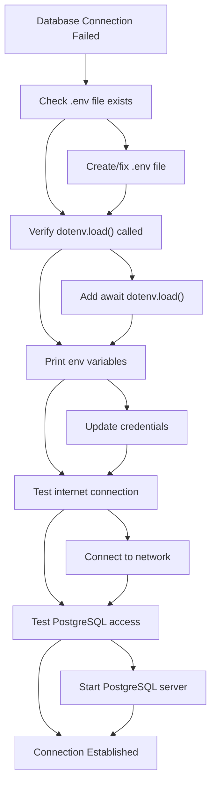
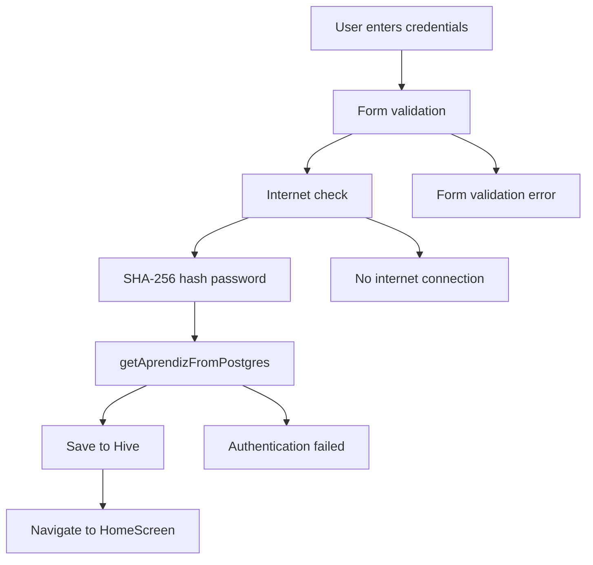
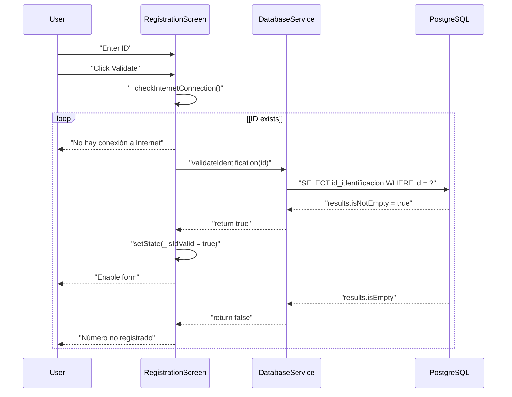
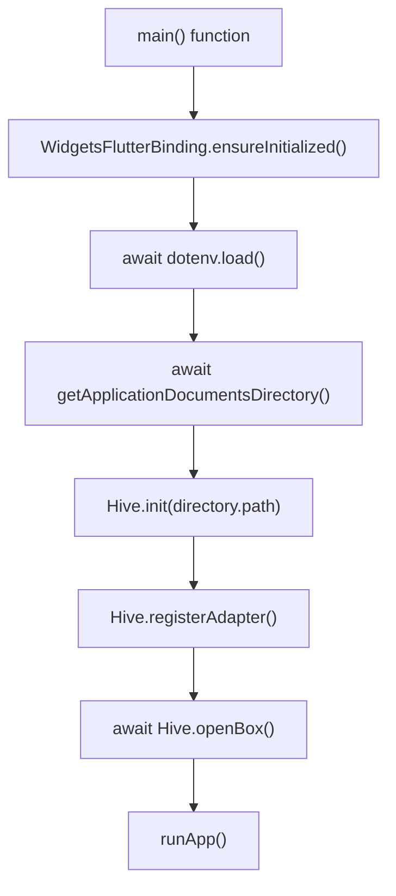
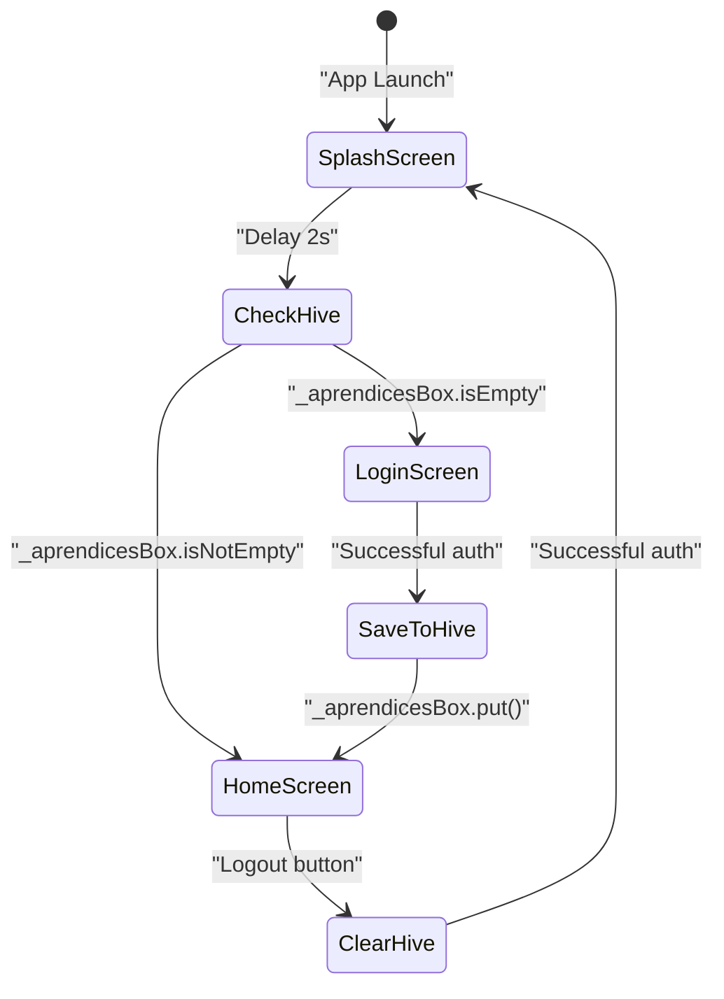
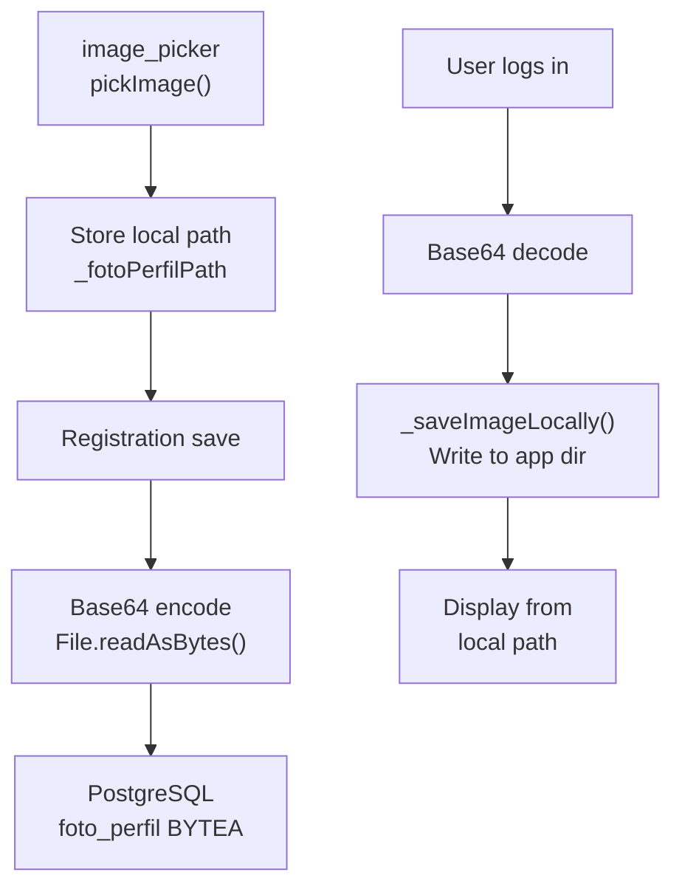
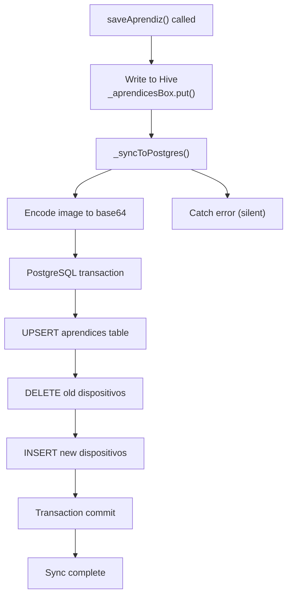
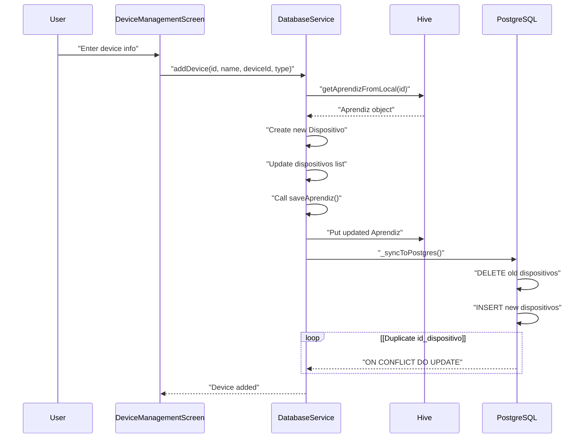
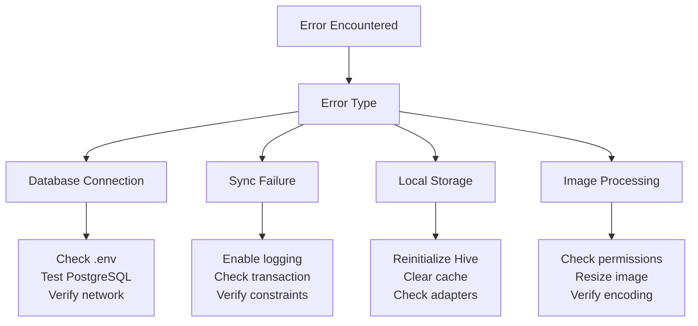

# Solución de problemas y preguntas frecuentes

> **Archivos fuente relevantes**
> * [LÉAME.md](https://github.com/axchisan/AppGestionCarnetsSENA/blob/9eb64390/README.md)
> * [lib/pantallas/pantalla_de_inicio_de_sesión.dart](https://github.com/axchisan/AppGestionCarnetsSENA/blob/9eb64390/lib/screens/login_screen.dart)
> * [lib/pantallas/pantalla_de_registro.dart](https://github.com/axchisan/AppGestionCarnetsSENA/blob/9eb64390/lib/screens/registration_screen.dart)
> * [lib/servicios/servicio_de_base_de_datos.dart](https://github.com/axchisan/AppGestionCarnetsSENA/blob/9eb64390/lib/services/database_service.dart)

## Propósito y alcance

Este documento proporciona soluciones a problemas comunes que surgen al desarrollar, implementar o usar la aplicación de la Tarjeta de Identificación Digital SENA. Abarca problemas de conectividad de bases de datos, fallos de autenticación, problemas de almacenamiento local, errores de conectividad de red y problemas de compilación específicos de la plataforma. Para obtener información detallada sobre la arquitectura del sistema, consulte [Arquitectura del sistema](/axchisan/AppGestionCarnetsSENA/3-system-architecture) . Para obtener detalles sobre el sistema de autenticación, consulte [Sistema de autenticación](/axchisan/AppGestionCarnetsSENA/4-authentication-system) .

---

## Problemas comunes y soluciones

### Fallos de conexión a la base de datos

#### Problema: Conexión de PostgreSQL agotada o rechazada

**Síntomas:**

* El inicio de sesión falla con "Credenciales incorrectas o error de conexión"
* La validación del registro muestra "Número no registrado en el SENA" para identificaciones válidas
* La aplicación parece bloquearse durante la autenticación

**Causas fundamentales:**

| Causa | Ubicación | Descripción |
| --- | --- | --- |
| Falta el archivo .env | Raíz del proyecto | Variables de entorno no cargadas |
| Credenciales incorrectas | [database_service.dart L13-L17](https://github.com/axchisan/AppGestionCarnetsSENA/blob/9eb64390/lib/services/database_service.dart#L13-L17) | Parámetros de conexión de PostgreSQL incorrectos |
| Red inalcanzable | [login_screen.dart L40-L47](https://github.com/axchisan/AppGestionCarnetsSENA/blob/9eb64390/lib/screens/login_screen.dart#L40-L47) | Sin conexión a Internet |
| Servidor PostgreSQL inactivo | Servidor de base de datos | Base de datos remota no disponible |

**Soluciones:**

1. **Verifique que exista la configuración .env:**

```
POSTGRES_HOST=your_host
POSTGRES_PORT=5432
POSTGRES_DATABASE=your_database
POSTGRES_USERNAME=your_username
POSTGRES_PASSWORD=your_password
```

1. **Compruebe la carga del entorno en main.dart:** * Asegúrese de que `flutter_dotenv`las cargas se realicen antes de cualquier operación de base de datos * Verifique que `.env`el archivo no se haya ingresado `.gitignore`accidentalmente durante el desarrollo
2. **Pruebe la conectividad de PostgreSQL manualmente:**

```
psql -h POSTGRES_HOST -p POSTGRES_PORT -U POSTGRES_USERNAME -d POSTGRES_DATABASE
```

1. **Habilitar el registro de errores:** Modificar[database_service.dart L37-L39](https://github.com/axchisan/AppGestionCarnetsSENA/blob/9eb64390/lib/services/database_service.dart#L37-L39) Para imprimir excepciones:

```python
} catch (e) {
  print('validateIdentification error: $e');
  return false;
}
```

**Flujo de solución de problemas:**



**Fuentes:** [database_service.dart L13-L17](https://github.com/axchisan/AppGestionCarnetsSENA/blob/9eb64390/lib/services/database_service.dart#L13-L17)

 [database_service.dart L21-L40](https://github.com/axchisan/AppGestionCarnetsSENA/blob/9eb64390/lib/services/database_service.dart#L21-L40)

 [login_screen.dart L40-L47](https://github.com/axchisan/AppGestionCarnetsSENA/blob/9eb64390/lib/screens/login_screen.dart#L40-L47)

---

#### Problema: Errores silenciosos en la base de datos (sin comentarios del usuario)

**Síntomas:**

* Las operaciones parecen tener éxito pero los datos no se guardan
* Los fallos de sincronización ocurren sin notificación
* Las operaciones de PostgreSQL fallan silenciosamente

**Causa raíz:** 
los bloques catch vacíos en los métodos DatabaseService suprimen la información de error.

**Ubicaciones de códigos afectados:**

| Método | Pauta | Impacto |
| --- | --- | --- |
| `saveAprendiz` | [database_service.dart L42-L47](https://github.com/axchisan/AppGestionCarnetsSENA/blob/9eb64390/lib/services/database_service.dart#L42-L47) | No se informan fallos de guardado |
| `_syncToPostgres` | [database_service.dart L49-L119](https://github.com/axchisan/AppGestionCarnetsSENA/blob/9eb64390/lib/services/database_service.dart#L49-L119) | Fallos de sincronización invisibles |
| `getAprendizFromLocal` | [database_service.dart L121-L127](https://github.com/axchisan/AppGestionCarnetsSENA/blob/9eb64390/lib/services/database_service.dart#L121-L127) | Errores de recuperación ocultos |
| `getAprendizFromPostgres` | [database_service.dart L129-L169](https://github.com/axchisan/AppGestionCarnetsSENA/blob/9eb64390/lib/services/database_service.dart#L129-L169) | Errores de autenticación suprimidos |

**Solución:** 
agregue registro o propagación de errores a los bloques catch:

```python
} catch (e) {
  print('saveAprendiz error: $e');
  rethrow; // or handle appropriately
}
```

**Fuentes:** [database_service.dart L42-L47](https://github.com/axchisan/AppGestionCarnetsSENA/blob/9eb64390/lib/services/database_service.dart#L42-L47)

 [database_service.dart L49-L119](https://github.com/axchisan/AppGestionCarnetsSENA/blob/9eb64390/lib/services/database_service.dart#L49-L119)

---

### Problemas de autenticación

#### Problema: El inicio de sesión falla con las credenciales correctas

**Diagrama de flujo de errores:**



**Pasos para la solución de problemas:**

1. **Verificar la consistencia del hash de la contraseña:** * Both registration and login use SHA-256: [lib/screens/login_screen.dart L34-L38](https://github.com/axchisan/AppGestionCarnetsSENA/blob/9eb64390/lib/screens/login_screen.dart#L34-L38)  [lib/screens/registration_screen.dart L119-L123](https://github.com/axchisan/AppGestionCarnetsSENA/blob/9eb64390/lib/screens/registration_screen.dart#L119-L123) * Test hash generation manually: ```python print(_hashPassword('testPassword')); ```
2. **Check database password storage:** * Passwords stored hashed: [lib/services/database_service.dart L89](https://github.com/axchisan/AppGestionCarnetsSENA/blob/9eb64390/lib/services/database_service.dart#L89-L89) * Verify hash matches database value
3. **Test query directly:** ```sql SELECT id_identificacion, contrasena FROM aprendices WHERE id_identificacion = 'TEST_ID'; ```
4. **Common mismatches:** * Whitespace in password input * Case sensitivity in ID * Encoding differences (UTF-8)

**Sources:** [lib/screens/login_screen.dart L34-L38](https://github.com/axchisan/AppGestionCarnetsSENA/blob/9eb64390/lib/screens/login_screen.dart#L34-L38)

 [lib/screens/login_screen.dart L49-L92](https://github.com/axchisan/AppGestionCarnetsSENA/blob/9eb64390/lib/screens/login_screen.dart#L49-L92)

 [lib/services/database_service.dart L129-L169](https://github.com/axchisan/AppGestionCarnetsSENA/blob/9eb64390/lib/services/database_service.dart#L129-L169)

---

#### Issue: Registration ID Validation Always Fails

**Symptoms:**

* Valid SENA IDs show "Número no registrado en el SENA"
* Validation succeeds but form remains disabled

**Root Causes:**

| Cause | Check | Fix |
| --- | --- | --- |
| ID not in database | Query `aprendices` table | Add ID to database first |
| Network timeout | Test connection | Increase timeout or retry |
| Wrong database | Check POSTGRES_DATABASE | Update .env to correct DB |
| Table empty | `SELECT COUNT(*) FROM aprendices` | Populate initial data |

**Validation Flow:**



**Pre-population Script:**
Database must contain IDs before registration:

```sql
INSERT INTO aprendices (id_identificacion) VALUES ('1234567890');
```

**Sources:** [lib/screens/registration_screen.dart L79-L117](https://github.com/axchisan/AppGestionCarnetsSENA/blob/9eb64390/lib/screens/registration_screen.dart#L79-L117)

 [lib/services/database_service.dart L21-L40](https://github.com/axchisan/AppGestionCarnetsSENA/blob/9eb64390/lib/services/database_service.dart#L21-L40)

---

### Local Storage Issues

#### Issue: Hive Box Not Initialized

**Symptoms:**

* `HiveError: Box not found` exception
* App crashes on splash screen
* Data not persisting between sessions

**Initialization Sequence:**



**Required Setup in main.dart:**

1. **Ensure Flutter bindings initialized**
2. **Get application directory** (for mobile)
3. **Initialize Hive with directory**
4. **Register type adapters** (generated from models.g.dart)
5. **Open boxes before runApp()**

**Common Mistakes:**

| Mistake | Symptom | Fix |
| --- | --- | --- |
| Missing `registerAdapter` | Type not recognized | Call `Hive.registerAdapter()` for Aprendiz and Dispositivo |
| Box opened after `runApp()` | Async initialization race | Await `openBox()` before `runApp()` |
| Wrong box name | Box not found | Use exact name: `'aprendicesBox'` [lib/services/database_service.dart L10](https://github.com/axchisan/AppGestionCarnetsSENA/blob/9eb64390/lib/services/database_service.dart#L10-L10) |
| No path on mobile | Platform exception | Use `path_provider` for mobile path |

**Sources:** [lib/services/database_service.dart L10](https://github.com/axchisan/AppGestionCarnetsSENA/blob/9eb64390/lib/services/database_service.dart#L10-L10)

 [lib/services/database_service.dart L19](https://github.com/axchisan/AppGestionCarnetsSENA/blob/9eb64390/lib/services/database_service.dart#L19-L19)

---

#### Issue: Session Not Persisting After Logout

**Symptoms:**

* User remains logged in after logout
* Hive box not cleared
* SplashScreen redirects to HomeScreen incorrectly

**Session Management Flow:**



**Logout Implementation:**
Must call `clear()` on Hive box to remove session:

```
await Hive.box<Aprendiz>('aprendicesBox').clear();
```

**Verification:**
After logout, check box is empty:

```python
print(Hive.box<Aprendiz>('aprendicesBox').isEmpty); // Should be true
```

**Sources:** Session management is implemented across multiple screens (see [Session Management](/axchisan/AppGestionCarnetsSENA/4.3-session-management))

---

### Image Upload and Handling Issues

#### Issue: Profile Photo Not Displaying

**Image Pipeline Diagram:**



**Common Issues:**

1. **Image not uploaded during registration:** * Check [lib/screens/registration_screen.dart L61-L68](https://github.com/axchisan/AppGestionCarnetsSENA/blob/9eb64390/lib/screens/registration_screen.dart#L61-L68)  - `_pickImage()` sets path * Verify path is not null before save
2. **Base64 encoding fails:** * Check file exists: [lib/services/database_service.dart L60-L62](https://github.com/axchisan/AppGestionCarnetsSENA/blob/9eb64390/lib/services/database_service.dart#L60-L62) * File permissions on mobile device * Large images may timeout
3. **Image not restored on login:** * Check [lib/services/database_service.dart L157](https://github.com/axchisan/AppGestionCarnetsSENA/blob/9eb64390/lib/services/database_service.dart#L157-L157)  - base64 string is non-null * `_saveImageLocally` may fail: [lib/services/database_service.dart L199-L209](https://github.com/axchisan/AppGestionCarnetsSENA/blob/9eb64390/lib/services/database_service.dart#L199-L209) * Verify app has write permissions to documents directory

**Solutions:**

| Problem | Check | Solution |
| --- | --- | --- |
| Picker fails | Camera/storage permissions | Add to AndroidManifest.xml |
| Encoding error | File size | Resize image before upload |
| Decode fails | Corrupted base64 | Validate base64 string format |
| Save fails | Write permissions | Request storage permission |

**Sources:** [lib/screens/registration_screen.dart L61-L68](https://github.com/axchisan/AppGestionCarnetsSENA/blob/9eb64390/lib/screens/registration_screen.dart#L61-L68)

 [lib/services/database_service.dart L60-L62](https://github.com/axchisan/AppGestionCarnetsSENA/blob/9eb64390/lib/services/database_service.dart#L60-L62)

 [lib/services/database_service.dart L199-L209](https://github.com/axchisan/AppGestionCarnetsSENA/blob/9eb64390/lib/services/database_service.dart#L199-L209)

---

### Offline Mode and Synchronization Issues

#### Issue: Data Not Syncing to PostgreSQL

**Synchronization Strategy:**



**Issue Identification:**

Since sync errors are caught silently at [lib/services/database_service.dart L118](https://github.com/axchisan/AppGestionCarnetsSENA/blob/9eb64390/lib/services/database_service.dart#L118-L118)

 add logging:

```python
} catch (e) {
  print('Sync failed: $e');
  // Consider storing failed syncs for retry
}
```

**Common Sync Failures:**

1. **Transaction rollback:** If any query in transaction fails, all changes revert
2. **Image encoding timeout:** Large images slow down sync
3. **Network drop during transaction:** Entire operation fails
4. **Device constraint violation:** Duplicate `id_dispositivo` for same user

**Verification:**
After save operation, check PostgreSQL:

```sql
SELECT * FROM aprendices WHERE id_identificacion = 'YOUR_ID';
SELECT * FROM dispositivos WHERE id_identificacion = 'YOUR_ID';
```

**Sources:** [lib/services/database_service.dart L42-L47](https://github.com/axchisan/AppGestionCarnetsSENA/blob/9eb64390/lib/services/database_service.dart#L42-L47)

 [lib/services/database_service.dart L49-L119](https://github.com/axchisan/AppGestionCarnetsSENA/blob/9eb64390/lib/services/database_service.dart#L49-L119)

---

#### Issue: Offline Data Inconsistent with Server

**Scenarios:**

| Scenario | Hive State | PostgreSQL State | Resolution |
| --- | --- | --- | --- |
| User A edits on device 1 | Updated | Not synced | Sync on reconnect |
| User A edits on device 2 | Stale | Updated | Re-login to refresh |
| Concurrent edits | Version 1 | Version 2 | Last write wins |

**Cache Invalidation:**
The app uses a **write-through cache** pattern:

* Writes go to Hive first, then PostgreSQL: [lib/services/database_service.dart L42-L47](https://github.com/axchisan/AppGestionCarnetsSENA/blob/9eb64390/lib/services/database_service.dart#L42-L47)
* Reads prefer local Hive: `getAprendizFromLocal()`
* Full sync only on login: `getAprendizFromPostgres()` updates cache

**Forcing Refresh:**
To pull latest data from PostgreSQL:

1. Logout (clears Hive)
2. Login again (fetches fresh data)

**Sources:** [lib/services/database_service.dart L42-L47](https://github.com/axchisan/AppGestionCarnetsSENA/blob/9eb64390/lib/services/database_service.dart#L42-L47)

 [lib/services/database_service.dart L121-L127](https://github.com/axchisan/AppGestionCarnetsSENA/blob/9eb64390/lib/services/database_service.dart#L121-L127)

 [lib/services/database_service.dart L129-L169](https://github.com/axchisan/AppGestionCarnetsSENA/blob/9eb64390/lib/services/database_service.dart#L129-L169)

---

### Device Management Issues

#### Issue: Cannot Add Device - Already Registered

**Symptoms:**

* Adding device shows no error but device not added
* Device appears multiple times in list

**Device Constraints:**

```css
#mermaid-h01zijymca9{font-family:ui-sans-serif,-apple-system,system-ui,Segoe UI,Helvetica;font-size:16px;fill:#333;}@keyframes edge-animation-frame{from{stroke-dashoffset:0;}}@keyframes dash{to{stroke-dashoffset:0;}}#mermaid-h01zijymca9 .edge-animation-slow{stroke-dasharray:9,5!important;stroke-dashoffset:900;animation:dash 50s linear infinite;stroke-linecap:round;}#mermaid-h01zijymca9 .edge-animation-fast{stroke-dasharray:9,5!important;stroke-dashoffset:900;animation:dash 20s linear infinite;stroke-linecap:round;}#mermaid-h01zijymca9 .error-icon{fill:#dddddd;}#mermaid-h01zijymca9 .error-text{fill:#222222;stroke:#222222;}#mermaid-h01zijymca9 .edge-thickness-normal{stroke-width:1px;}#mermaid-h01zijymca9 .edge-thickness-thick{stroke-width:3.5px;}#mermaid-h01zijymca9 .edge-pattern-solid{stroke-dasharray:0;}#mermaid-h01zijymca9 .edge-thickness-invisible{stroke-width:0;fill:none;}#mermaid-h01zijymca9 .edge-pattern-dashed{stroke-dasharray:3;}#mermaid-h01zijymca9 .edge-pattern-dotted{stroke-dasharray:2;}#mermaid-h01zijymca9 .marker{fill:#999;stroke:#999;}#mermaid-h01zijymca9 .marker.cross{stroke:#999;}#mermaid-h01zijymca9 svg{font-family:ui-sans-serif,-apple-system,system-ui,Segoe UI,Helvetica;font-size:16px;}#mermaid-h01zijymca9 p{margin:0;}#mermaid-h01zijymca9 .entityBox{fill:#ffffff;stroke:#dddddd;}#mermaid-h01zijymca9 .relationshipLabelBox{fill:#dddddd;opacity:0.7;background-color:#dddddd;}#mermaid-h01zijymca9 .relationshipLabelBox rect{opacity:0.5;}#mermaid-h01zijymca9 .labelBkg{background-color:rgba(221, 221, 221, 0.5);}#mermaid-h01zijymca9 .edgeLabel .label{fill:#dddddd;font-size:14px;}#mermaid-h01zijymca9 .label{font-family:ui-sans-serif,-apple-system,system-ui,Segoe UI,Helvetica;color:#333;}#mermaid-h01zijymca9 .edge-pattern-dashed{stroke-dasharray:8,8;}#mermaid-h01zijymca9 .node rect,#mermaid-h01zijymca9 .node circle,#mermaid-h01zijymca9 .node ellipse,#mermaid-h01zijymca9 .node polygon{fill:#ffffff;stroke:#dddddd;stroke-width:1px;}#mermaid-h01zijymca9 .relationshipLine{stroke:#999;stroke-width:1;fill:none;}#mermaid-h01zijymca9 .marker{fill:none!important;stroke:#999!important;stroke-width:1;}#mermaid-h01zijymca9 :root{--mermaid-font-family:"trebuchet ms",verdana,arial,sans-serif;}hasAPRENDIZstringidIdentificacionPKlistdispositivosDISPOSITIVOstringidDispositivoPKstringidIdentificacionFKstringnombreDispositivostringtipoDispositivodatetimefechaRegistro
```

**Constraints:**

* Unique constraint: `(id_identificacion, id_dispositivo)` in PostgreSQL table
* Maximum 10 devices per user (enforced in DeviceManagementScreen, see [Device Management](/axchisan/AppGestionCarnetsSENA/5.3-device-management))
* Device ID must be unique within user's devices

**Add Device Flow:**



**Duplicate Device Handling:**
The sync uses `ON CONFLICT DO UPDATE` at [lib/services/database_service.dart L101-L104](https://github.com/axchisan/AppGestionCarnetsSENA/blob/9eb64390/lib/services/database_service.dart#L101-L104)

 so:

* If device ID already exists for user → updates it
* No error thrown for duplicates

**Solution:**
Add validation before calling `addDevice`:

```javascript
if (aprendiz.dispositivos.any((d) => d.idDispositivo == newDeviceId)) {
  // Show error: device already registered
}
```

**Sources:** [lib/services/database_service.dart L211-L238](https://github.com/axchisan/AppGestionCarnetsSENA/blob/9eb64390/lib/services/database_service.dart#L211-L238)

 [lib/services/database_service.dart L95-L114](https://github.com/axchisan/AppGestionCarnetsSENA/blob/9eb64390/lib/services/database_service.dart#L95-L114)

---

### Build and Deployment Issues

#### Issue: Build Fails with "Manifest merger failed"

**Symptom:**
Android build fails with manifest conflicts

**Common Causes:**

1. **Missing permissions:** Image picker requires storage permissions
2. **Duplicate activities:** Multiple declarations of MainActivity
3. **Min SDK mismatch:** Dependencies require higher minSdkVersion

**Required AndroidManifest Permissions:**

```
<uses-permission android:name="android.permission.INTERNET"/>
<uses-permission android:name="android.permission.READ_EXTERNAL_STORAGE"/>
<uses-permission android:name="android.permission.WRITE_EXTERNAL_STORAGE"/>
<uses-permission android:name="android.permission.CAMERA"/>
```

**SDK Version Requirements:**

* MinSdkVersion: 21 (Android 5.0)
* TargetSdkVersion: 33 (Android 13)

**Sources:** See [Android Platform Configuration](/axchisan/AppGestionCarnetsSENA/8-android-platform-configuration) for detailed manifest setup

---

#### Issue: Release APK Crashes but Debug Works

**Probable Causes:**

| Cause | Symptom | Solution |
| --- | --- | --- |
| ProGuard obfuscation | Reflection breaks | Add keep rules |
| Missing internet permission | Network fails in release | Check manifest |
| Asset not bundled | Images/fonts missing | Verify pubspec.yaml assets |
| Environment vars stripped | Database connection fails | Include .env in release |

**ProGuard Rules for Hive:**

```python
-keep class * extends com.hivedb.Hive.TypeAdapter { *; }
-keepclassmembers class * extends com.hivedb.Hive.TypeAdapter { *; }
```

**Release Checklist:**

1. Verify `.env` file included in build
2. Test database connectivity on release build
3. Check all permissions in AndroidManifest.xml
4. Validate ProGuard rules for Hive and Postgres packages

**Sources:** See [Build and Signing Configuration](/axchisan/AppGestionCarnetsSENA/8.2-build-and-signing-configuration)

---

## Frequently Asked Questions

### General Questions

**Q: Can users access the app without internet after first login?**

**A:** Yes, after successful authentication, the user's data is cached in Hive local storage ([lib/services/database_service.dart L121-L127](https://github.com/axchisan/AppGestionCarnetsSENA/blob/9eb64390/lib/services/database_service.dart#L121-L127)

). The ID card display and device list are available offline. However, adding new devices or modifying profile data requires internet to sync to PostgreSQL.

---

**Q: What happens if a user logs in on multiple devices?**

**A:** Each device maintains its own Hive cache. Changes made on one device will not appear on another until the second device logs out and logs back in. The app uses a **last-write-wins** strategy - the most recent sync to PostgreSQL becomes the authoritative state.

---

**Q: How are passwords secured?**

**A:** Passwords are hashed client-side using SHA-256 before transmission or storage ([lib/screens/login_screen.dart L34-L38](https://github.com/axchisan/AppGestionCarnetsSENA/blob/9eb64390/lib/screens/login_screen.dart#L34-L38)

 [lib/screens/registration_screen.dart L119-L123](https://github.com/axchisan/AppGestionCarnetsSENA/blob/9eb64390/lib/screens/registration_screen.dart#L119-L123)

). The plain-text password never leaves the device or gets stored in either Hive or PostgreSQL. Only the hash is compared during authentication at [lib/services/database_service.dart L143](https://github.com/axchisan/AppGestionCarnetsSENA/blob/9eb64390/lib/services/database_service.dart#L143-L143)

---

**Q: Can users recover forgotten passwords?**

**A:** Currently, the app displays a message to "contact administration" ([lib/screens/login_screen.dart L165-L179](https://github.com/axchisan/AppGestionCarnetsSENA/blob/9eb64390/lib/screens/login_screen.dart#L165-L179)

). Password recovery requires external support since there's no email/SMS verification system implemented. Admins must update the password hash directly in PostgreSQL.

---

### Technical Questions

**Q: Why does registration require ID validation against SENA database?**

**A:** The app is designed for existing SENA apprentices only. The validation step ([lib/services/database_service.dart L21-L40](https://github.com/axchisan/AppGestionCarnetsSENA/blob/9eb64390/lib/services/database_service.dart#L21-L40)

) checks if the ID exists in a pre-populated `aprendices` table, ensuring only registered students can create accounts. This enforces institutional access control.

---

**Q: What is the maximum number of devices per user?**

**A:** The application enforces a limit of 10 devices per apprentice (see [Device Management](/axchisan/AppGestionCarnetsSENA/5.3-device-management)). This is a business rule to prevent abuse of the device registration system used for physical access control at the SENA center.

---

**Q: How is the barcode generated for ID cards?**

**A:** The barcode uses the `idIdentificacion` field of the Aprendiz model as its value. This is rendered using the `qr_flutter` or `barcode_widget` package (see [Branding and Visual Components](/axchisan/AppGestionCarnetsSENA/6.2-branding-and-visual-components)). The desktop Java application at SENA centers scans this barcode for access validation.

---

**Q: What data is stored locally vs remotely?**

**Storage Comparison:**

| Data Type | Hive (Local) | PostgreSQL (Remote) |
| --- | --- | --- |
| Aprendiz profile | ✓ Full object | ✓ Authoritative source |
| Password hash | ✓ Cached | ✓ For authentication |
| Profile photo | ✓ File path (local file) | ✓ Base64 encoded BYTEA |
| Dispositivos list | ✓ Within Aprendiz | ✓ Separate table |
| Session state | ✓ Existence = logged in | ✗ Stateless |

**Sources:** [lib/services/database_service.dart L42-L47](https://github.com/axchisan/AppGestionCarnetsSENA/blob/9eb64390/lib/services/database_service.dart#L42-L47)

 [lib/services/database_service.dart L121-L127](https://github.com/axchisan/AppGestionCarnetsSENA/blob/9eb64390/lib/services/database_service.dart#L121-L127)

---

**Q: Why do some database errors fail silently?**

**A:** The current implementation uses empty catch blocks ([lib/services/database_service.dart L46](https://github.com/axchisan/AppGestionCarnetsSENA/blob/9eb64390/lib/services/database_service.dart#L46-L46)

 [118](https://github.com/axchisan/AppGestionCarnetsSENA/blob/9eb64390/118)

 [237](https://github.com/axchisan/AppGestionCarnetsSENA/blob/9eb64390/237)

) to prevent crashes. This is a defensive programming approach but makes debugging difficult. For production, these should be enhanced with:

* Logging to track failures
* Error reporting to developers
* User notifications for critical failures
* Retry mechanisms for transient errors

---

**Q: Can the app work entirely offline after initial setup?**

**A:** Partially. Once logged in:

* ✓ View ID card: Fully offline
* ✓ View registered devices: Fully offline
* ✗ Add/remove devices: Requires internet for sync
* ✗ Edit profile: Requires internet for sync
* ✗ Login/registration: Always requires internet

The read-only features are offline-capable, but any data modification requires PostgreSQL sync.

---

**Q: What happens to unsaved changes if the app closes during sync?**

**A:** The write-through pattern at [lib/services/database_service.dart L42-L47](https://github.com/axchisan/AppGestionCarnetsSENA/blob/9eb64390/lib/services/database_service.dart#L42-L47)

 saves to Hive first, then syncs. If sync fails:

* Data is safely stored in Hive (local)
* User sees updated data on device
* Remote PostgreSQL is stale until next successful sync

There's no retry mechanism implemented, so the user must trigger another sync operation (e.g., by logging out and back in).

---

## Diagnostic Commands and Tools

### Database Inspection

**Check if ID exists in PostgreSQL:**

```sql
SELECT id_identificacion, nombre_completo 
FROM aprendices 
WHERE id_identificacion = 'YOUR_ID';
```

**List all devices for a user:**

```sql
SELECT id_dispositivo, nombre_dispositivo, tipo_dispositivo 
FROM dispositivos 
WHERE id_identificacion = 'YOUR_ID'
ORDER BY fecha_registro DESC;
```

**Count users by registration date:**

```sql
SELECT DATE(fecha_registro) as date, COUNT(*) as registrations
FROM aprendices
GROUP BY DATE(fecha_registro)
ORDER BY date DESC;
```

---

### Hive Box Inspection

**View box contents (debug mode):**

```python
final box = Hive.box<Aprendiz>('aprendicesBox');
print('Box length: ${box.length}');
print('Keys: ${box.keys.toList()}');
print('Values: ${box.values.toList()}');
```

**Check if specific user cached:**

```python
final aprendiz = Hive.box<Aprendiz>('aprendicesBox').get('USER_ID');
print('Cached: ${aprendiz != null}');
if (aprendiz != null) {
  print('Name: ${aprendiz.nombreCompleto}');
  print('Devices: ${aprendiz.dispositivos.length}');
}
```

---

### Network Debugging

**Test internet connectivity:**

```python
final hasInternet = await _checkInternetConnection();
print('Internet available: $hasInternet');
```

**Test PostgreSQL connection:**

```python
final dbService = DatabaseService();
final isValid = await dbService.validateIdentification('TEST_ID');
print('Database reachable: ${!isValid ? "NO" : "YES"}');
```

---

### Build Verification

**Check Flutter environment:**

```
flutter doctor -v
```

**Verify dependencies:**

```
flutter pub deps
```

**Clean and rebuild:**

```
flutter clean
flutter pub get
flutter build apk --debug
```

**Generate Hive adapters:**

```sql
flutter pub run build_runner build --delete-conflicting-outputs
```

---

## Error Code Reference

### DatabaseService Error Patterns



### Common Exception Messages

| Exception | Message Pattern | Location | Solution Reference |
| --- | --- | --- | --- |
| `SocketException` | "Failed host lookup" | Network calls | [Database Connection Failures](https://github.com/axchisan/AppGestionCarnetsSENA/blob/9eb64390/Database Connection Failures) |
| `PostgreSQLException` | "Connection refused" | [lib/services/database_service.dart L30](https://github.com/axchisan/AppGestionCarnetsSENA/blob/9eb64390/lib/services/database_service.dart#L30-L30) | Check PostgreSQL server |
| `HiveError` | "Box not found" | [lib/services/database_service.dart L19](https://github.com/axchisan/AppGestionCarnetsSENA/blob/9eb64390/lib/services/database_service.dart#L19-L19) | [Hive Box Not Initialized](https://github.com/axchisan/AppGestionCarnetsSENA/blob/9eb64390/Hive Box Not Initialized) |
| `FileSystemException` | "Permission denied" | [lib/services/database_service.dart L204](https://github.com/axchisan/AppGestionCarnetsSENA/blob/9eb64390/lib/services/database_service.dart#L204-L204) | Add storage permissions |
| `FormatException` | "Invalid base64" | [lib/services/database_service.dart L201](https://github.com/axchisan/AppGestionCarnetsSENA/blob/9eb64390/lib/services/database_service.dart#L201-L201) | Validate image encoding |

**Sources:** [lib/services/database_service.dart L1-L239](https://github.com/axchisan/AppGestionCarnetsSENA/blob/9eb64390/lib/services/database_service.dart#L1-L239)

 [lib/screens/login_screen.dart L1-L223](https://github.com/axchisan/AppGestionCarnetsSENA/blob/9eb64390/lib/screens/login_screen.dart#L1-L223)

 [lib/screens/registration_screen.dart L1-L491](https://github.com/axchisan/AppGestionCarnetsSENA/blob/9eb64390/lib/screens/registration_screen.dart#L1-L491)

---

## Performance Optimization Tips

### Database Query Optimization

**Issue:** Slow login due to large device list

**Solution:** Limit device query with pagination or filtering:

```sql
SELECT * FROM dispositivos 
WHERE id_identificacion = @id 
ORDER BY fecha_registro DESC 
LIMIT 10;
```

### Image Handling Optimization

**Issue:** Large images slow down sync

**Solution:** Compress images before base64 encoding:

```yaml
// Resize using image package
final compressed = await FlutterImageCompress.compressWithFile(
  file.path,
  quality: 70,
  minWidth: 800,
  minHeight: 800,
);
```

### Hive Performance

**Issue:** Slow box read on large datasets

**Solution:** Use lazy box for large collections:

```
final box = await Hive.openLazyBox<Aprendiz>('aprendicesBox');
```

**Sources:** Performance considerations based on [lib/services/database_service.dart L1-L239](https://github.com/axchisan/AppGestionCarnetsSENA/blob/9eb64390/lib/services/database_service.dart#L1-L239)

---

## Getting Additional Help

**For issues not covered here:**

1. Check related wiki pages: * [DatabaseService Reference](/axchisan/AppGestionCarnetsSENA/3.1.1-databaseservice-reference) for API details * [Authentication System](/axchisan/AppGestionCarnetsSENA/4-authentication-system) for auth flow specifics * [Offline-First Strategy](/axchisan/AppGestionCarnetsSENA/3.1.3-offline-first-strategy) for caching behavior * [Administración de dispositivos](/axchisan/AppGestionCarnetsSENA/5.3-device-management) para problemas específicos del dispositivo
2. Revisar los registros de la aplicación: * Agregar declaraciones de impresión en bloques catch * Utilice Flutter DevTools para depurar * Comprueba el Logcat de Android para detectar errores de plataforma
3. Verificar la configuración del entorno: * Consulte [Primeros pasos](/axchisan/AppGestionCarnetsSENA/2-getting-started) para la configuración inicial * Comprobar [dependencias](/axchisan/AppGestionCarnetsSENA/7-dependencies-and-external-packages) para compatibilidad de versiones
4. Informar problemas en GitHub: * Incluir mensajes de error * Proporcionar pasos para reproducir * Plataforma de notas (versión Android)

**Fuentes:** Estructura de la documentación de la tabla de contenidos