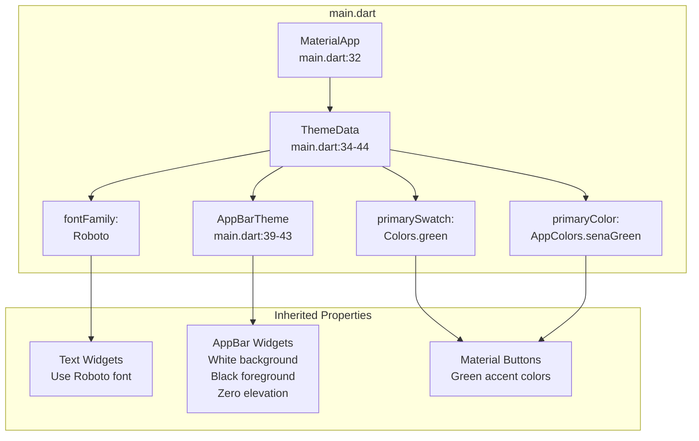
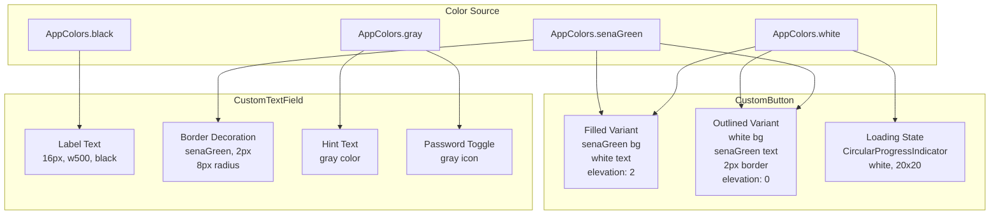
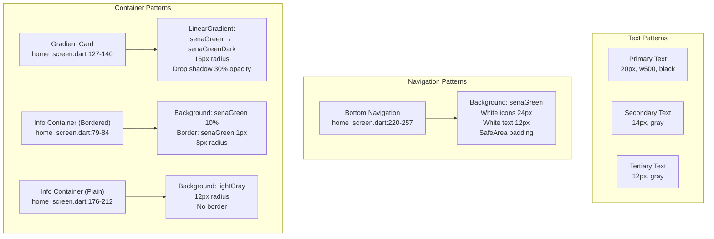

# Theme and Styling

> **Relevant source files**
> * [.gitignore](https://github.com/axchisan/AppGestionCarnetsSENA/blob/9eb64390/.gitignore)
> * [lib/main.dart](https://github.com/axchisan/AppGestionCarnetsSENA/blob/9eb64390/lib/main.dart)
> * [lib/screens/home_screen.dart](https://github.com/axchisan/AppGestionCarnetsSENA/blob/9eb64390/lib/screens/home_screen.dart)
> * [lib/widgets/custom_button.dart](https://github.com/axchisan/AppGestionCarnetsSENA/blob/9eb64390/lib/widgets/custom_button.dart)
> * [lib/widgets/custom_textfield.dart](https://github.com/axchisan/AppGestionCarnetsSENA/blob/9eb64390/lib/widgets/custom_textfield.dart)

## Purpose and Scope

This document describes the theme and styling system used throughout the SENA Digital ID Card application. It covers the centralized color palette defined in `AppColors`, the global theme configuration in `main.dart`, and how styling patterns are applied consistently across screens and custom UI components.

For documentation of specific reusable UI components (CustomTextField, CustomButton), see [Custom Form Widgets](/axchisan/AppGestionCarnetsSENA/6.1-custom-form-widgets). For branding components like the SENA logo, see [Branding and Visual Components](/axchisan/AppGestionCarnetsSENA/6.2-branding-and-visual-components).

---

## AppColors Utility Class

The application uses a centralized color palette defined in the `AppColors` utility class located at [lib/utils/app_colors.dart](https://github.com/axchisan/AppGestionCarnetsSENA/blob/9eb64390/lib/utils/app_colors.dart)

 This class provides static constant color values that are referenced throughout the application to maintain visual consistency.

### Color Palette

Based on usage patterns across the codebase, the `AppColors` class defines the following color constants:

| Color Constant | Purpose | Primary Usage |
| --- | --- | --- |
| `AppColors.senaGreen` | Primary brand color | Buttons, borders, gradients, bottom navigation |
| `AppColors.senaGreenDark` | Secondary brand shade | Gradient endings, emphasis elements |
| `AppColors.white` | Background and text on dark | Screen backgrounds, button text, navigation icons |
| `AppColors.black` | Primary text color | Labels, headings, body text |
| `AppColors.gray` | Secondary text and icons | Placeholder text, inactive elements |
| `AppColors.lightGray` | Container backgrounds | Card backgrounds, info panels |
| `AppColors.red` | Error and warning states | Logout confirmation, error messages |

**Color Architecture Diagram**

```

```

Sources: [lib/utils/app_colors.dart](https://github.com/axchisan/AppGestionCarnetsSENA/blob/9eb64390/lib/utils/app_colors.dart)

 [lib/main.dart L11](https://github.com/axchisan/AppGestionCarnetsSENA/blob/9eb64390/lib/main.dart#L11-L11)

 [lib/screens/home_screen.dart L4](https://github.com/axchisan/AppGestionCarnetsSENA/blob/9eb64390/lib/screens/home_screen.dart#L4-L4)

 [lib/widgets/custom_textfield.dart L2](https://github.com/axchisan/AppGestionCarnetsSENA/blob/9eb64390/lib/widgets/custom_textfield.dart#L2-L2)

 [lib/widgets/custom_button.dart L2](https://github.com/axchisan/AppGestionCarnetsSENA/blob/9eb64390/lib/widgets/custom_button.dart#L2-L2)

---

## Global Theme Configuration

The application's global theme is configured in the `SenaApp` widget's `MaterialApp` definition at [lib/main.dart L32-L44](https://github.com/axchisan/AppGestionCarnetsSENA/blob/9eb64390/lib/main.dart#L32-L44)

 This establishes default styling that cascades throughout the application.

### ThemeData Configuration

```javascript
ThemeData(
  primarySwatch: Colors.green,
  primaryColor: AppColors.senaGreen,
  fontFamily: 'Roboto',
  visualDensity: VisualDensity.adaptivePlatformDensity,
  appBarTheme: const AppBarTheme(
    backgroundColor: AppColors.white,
    foregroundColor: AppColors.black,
    elevation: 0,
  ),
)
```

### Theme Properties

| Property | Value | Effect |
| --- | --- | --- |
| `primarySwatch` | `Colors.green` | Flutter's Material Design green color palette |
| `primaryColor` | `AppColors.senaGreen` | Custom SENA brand green |
| `fontFamily` | `'Roboto'` | Application-wide font family |
| `visualDensity` | `VisualDensity.adaptivePlatformDensity` | Adaptive spacing for different platforms |
| `appBarTheme.backgroundColor` | `AppColors.white` | Flat white app bars |
| `appBarTheme.foregroundColor` | `AppColors.black` | Black text and icons in app bars |
| `appBarTheme.elevation` | `0` | Flat design with no shadows |

### AppBar Styling Pattern

The global `AppBarTheme` enforces a consistent flat design across all screens. Individual screens inherit this configuration but can override specific properties. For example, [lib/screens/home_screen.dart L25-L59](https://github.com/axchisan/AppGestionCarnetsSENA/blob/9eb64390/lib/screens/home_screen.dart#L25-L59)

 demonstrates the standard AppBar pattern:

* White background (`AppColors.white`)
* Zero elevation for flat appearance
* Black icons and text (`AppColors.black`)
* SENA logo centered in the title area
* Logout button as leading action

**Theme Configuration Flow**



Sources: [lib/main.dart L32-L44](https://github.com/axchisan/AppGestionCarnetsSENA/blob/9eb64390/lib/main.dart#L32-L44)

 [lib/screens/home_screen.dart L25-L59](https://github.com/axchisan/AppGestionCarnetsSENA/blob/9eb64390/lib/screens/home_screen.dart#L25-L59)

---

## Styling Patterns in Custom Widgets

### CustomTextField Styling

The `CustomTextField` widget applies consistent SENA branding to text input fields through its decoration configuration at [lib/widgets/custom_textfield.dart L48-L84](https://github.com/axchisan/AppGestionCarnetsSENA/blob/9eb64390/lib/widgets/custom_textfield.dart#L48-L84)

**Border Styling:**

* All border states (default, enabled, focused) use `AppColors.senaGreen` with 2px width
* 8px border radius for rounded corners
* Consistent green outline reinforces brand identity

**Text Styling:**

* Label text: 16px, medium weight (500), black color
* Placeholder text: gray color for visual hierarchy
* Input text: inherits from global theme (Roboto font)

**Password Field Enhancement:**

* Visibility toggle icon in suffix position
* Icon color: `AppColors.gray`
* Dynamic state management for `obscureText` property

### CustomButton Styling

The `CustomButton` widget implements two visual variants through its `isOutlined` parameter at [lib/widgets/custom_button.dart L20-L66](https://github.com/axchisan/AppGestionCarnetsSENA/blob/9eb64390/lib/widgets/custom_button.dart#L20-L66)

**Filled Variant (default):**

* Background: `AppColors.senaGreen`
* Foreground: `AppColors.white`
* Elevation: 2
* 8px border radius

**Outlined Variant:**

* Background: `AppColors.white`
* Foreground: `AppColors.senaGreen`
* Border: 2px solid `AppColors.senaGreen`
* Elevation: 0

**Loading State:**

* Displays `CircularProgressIndicator` with white color
* Button becomes disabled during loading
* 20x20px spinner size

**Custom Widget Styling Architecture**



Sources: [lib/widgets/custom_textfield.dart L29-L89](https://github.com/axchisan/AppGestionCarnetsSENA/blob/9eb64390/lib/widgets/custom_textfield.dart#L29-L89)

 [lib/widgets/custom_button.dart L20-L66](https://github.com/axchisan/AppGestionCarnetsSENA/blob/9eb64390/lib/widgets/custom_button.dart#L20-L66)

---

## Screen-Level Styling Patterns

### Background Colors

All screens use `AppColors.white` as the scaffold background color to maintain consistency. This is explicitly set in screen implementations:

* [lib/screens/home_screen.dart L24](https://github.com/axchisan/AppGestionCarnetsSENA/blob/9eb64390/lib/screens/home_screen.dart#L24-L24) : `backgroundColor: AppColors.white`

### Container Styling Patterns

The application employs several recurring container styling patterns:

#### Gradient Cards

Used for prominent call-to-action elements like the virtual ID card display at [lib/screens/home_screen.dart L127-L140](https://github.com/axchisan/AppGestionCarnetsSENA/blob/9eb64390/lib/screens/home_screen.dart#L127-L140)

:

```yaml
decoration: BoxDecoration(
  gradient: LinearGradient(
    colors: [AppColors.senaGreen, AppColors.senaGreenDark],
    begin: Alignment.topLeft,
    end: Alignment.bottomRight,
  ),
  borderRadius: BorderRadius.circular(16),
  boxShadow: [
    BoxShadow(
      color: AppColors.senaGreen.withOpacity(0.3),
      blurRadius: 8,
      offset: Offset(0, 4),
    ),
  ],
)
```

**Characteristics:**

* Green-to-dark-green gradient (top-left to bottom-right)
* 16px border radius for rounded appearance
* Drop shadow with 30% opacity green, 8px blur, 4px vertical offset
* White text and icons for contrast

#### Info Containers

Used for displaying information panels at [lib/screens/home_screen.dart L79-L84](https://github.com/axchisan/AppGestionCarnetsSENA/blob/9eb64390/lib/screens/home_screen.dart#L79-L84)

 and [lib/screens/home_screen.dart L176-L212](https://github.com/axchisan/AppGestionCarnetsSENA/blob/9eb64390/lib/screens/home_screen.dart#L176-L212)

:

```yaml
decoration: BoxDecoration(
  color: AppColors.senaGreen.withOpacity(0.1),
  border: Border.all(color: AppColors.senaGreen),
  borderRadius: BorderRadius.circular(8),
)
```

or

```yaml
decoration: BoxDecoration(
  color: AppColors.lightGray,
  borderRadius: BorderRadius.circular(12),
)
```

**Characteristics:**

* Light background (10% opacity green or lightGray)
* Optional green border (1px default)
* 8-12px border radius
* Black primary text, gray secondary text

### Bottom Navigation Styling

The HomeScreen implements a custom bottom navigation bar at [lib/screens/home_screen.dart L220-L257](https://github.com/axchisan/AppGestionCarnetsSENA/blob/9eb64390/lib/screens/home_screen.dart#L220-L257)

 using direct styling rather than Flutter's BottomNavigationBar widget:

```javascript
Container(
  decoration: const BoxDecoration(
    color: AppColors.senaGreen,
  ),
  child: SafeArea(
    child: Padding(
      padding: const EdgeInsets.symmetric(vertical: 8.0),
      child: Row(...)
    ),
  ),
)
```

**Navigation Item Pattern:**

* White icons (24px size)
* White labels (12px size)
* Vertical layout (icon above text)
* Consistent spacing (4px between icon and text)
* Green background for entire bar

**Screen Styling Patterns**



Sources: [lib/screens/home_screen.dart L24](https://github.com/axchisan/AppGestionCarnetsSENA/blob/9eb64390/lib/screens/home_screen.dart#L24-L24)

 [lib/screens/home_screen.dart L79-L84](https://github.com/axchisan/AppGestionCarnetsSENA/blob/9eb64390/lib/screens/home_screen.dart#L79-L84)

 [lib/screens/home_screen.dart L127-L140](https://github.com/axchisan/AppGestionCarnetsSENA/blob/9eb64390/lib/screens/home_screen.dart#L127-L140)

 [lib/screens/home_screen.dart L176-L212](https://github.com/axchisan/AppGestionCarnetsSENA/blob/9eb64390/lib/screens/home_screen.dart#L176-L212)

 [lib/screens/home_screen.dart L220-L257](https://github.com/axchisan/AppGestionCarnetsSENA/blob/9eb64390/lib/screens/home_screen.dart#L220-L257)

---

## Typography Hierarchy

The application implements a clear typography hierarchy using size, weight, and color variations:

### Text Size Scale

| Level | Size | Weight | Color | Usage |
| --- | --- | --- | --- | --- |
| Heading | 20px | 500 | black | Welcome messages, screen titles |
| Subheading | 18px | bold | white/black | Card titles, section headers |
| Body | 16px | 500/600 | black | Labels, primary content |
| Secondary | 14px | normal | gray/black | Supporting text, notifications |
| Caption | 12px | normal | gray | Meta information, nav labels |

### Text Style Examples

**Welcome Heading** ([lib/screens/home_screen.dart L68-L75](https://github.com/axchisan/AppGestionCarnetsSENA/blob/9eb64390/lib/screens/home_screen.dart#L68-L75)

):

```yaml
TextStyle(
  fontSize: 20,
  color: AppColors.black,
  fontWeight: FontWeight.w500,
)
```

**Card Title** ([lib/screens/home_screen.dart L147-L153](https://github.com/axchisan/AppGestionCarnetsSENA/blob/9eb64390/lib/screens/home_screen.dart#L147-L153)

):

```yaml
TextStyle(
  color: AppColors.white,
  fontSize: 18,
  fontWeight: FontWeight.bold,
)
```

**Section Header** ([lib/screens/home_screen.dart L186-L192](https://github.com/axchisan/AppGestionCarnetsSENA/blob/9eb64390/lib/screens/home_screen.dart#L186-L192)

):

```yaml
TextStyle(
  color: AppColors.black,
  fontSize: 16,
  fontWeight: FontWeight.w600,
)
```

Sources: [lib/screens/home_screen.dart L68-L75](https://github.com/axchisan/AppGestionCarnetsSENA/blob/9eb64390/lib/screens/home_screen.dart#L68-L75)

 [lib/screens/home_screen.dart L147-L153](https://github.com/axchisan/AppGestionCarnetsSENA/blob/9eb64390/lib/screens/home_screen.dart#L147-L153)

 [lib/screens/home_screen.dart L186-L192](https://github.com/axchisan/AppGestionCarnetsSENA/blob/9eb64390/lib/screens/home_screen.dart#L186-L192)

---

## Styling Best Practices

### Consistency Through AppColors

All color values in the application must be referenced through the `AppColors` utility class. Direct color literals (e.g., `Color(0xFF00FF00)`) should never be used. This ensures:

1. Brand consistency across all screens
2. Centralized color management
3. Easy theme modifications (change once in AppColors, apply everywhere)

### Widget-Level Encapsulation

Custom widgets (CustomTextField, CustomButton) encapsulate their own styling logic. Screens should use these components rather than reimplementing similar styles. This reduces code duplication and maintains visual consistency.

### BoxDecoration Pattern

When styling containers, the application follows this priority order:

1. **Color/Gradient**: Set background appearance
2. **Border**: Add outlines when needed for emphasis
3. **BorderRadius**: Apply rounded corners (8px, 12px, or 16px based on container size)
4. **BoxShadow**: Add depth sparingly (only for elevated elements)

### Responsive Spacing

The application uses consistent spacing values:

* Small gaps: 4-8px
* Medium gaps: 12-16px
* Large gaps: 24px
* Container padding: 16-24px

These values are applied directly using `EdgeInsets` rather than centralized constants, as they vary by context.

Sources: [lib/screens/home_screen.dart](https://github.com/axchisan/AppGestionCarnetsSENA/blob/9eb64390/lib/screens/home_screen.dart)

 [lib/widgets/custom_textfield.dart](https://github.com/axchisan/AppGestionCarnetsSENA/blob/9eb64390/lib/widgets/custom_textfield.dart)

 [lib/widgets/custom_button.dart](https://github.com/axchisan/AppGestionCarnetsSENA/blob/9eb64390/lib/widgets/custom_button.dart)