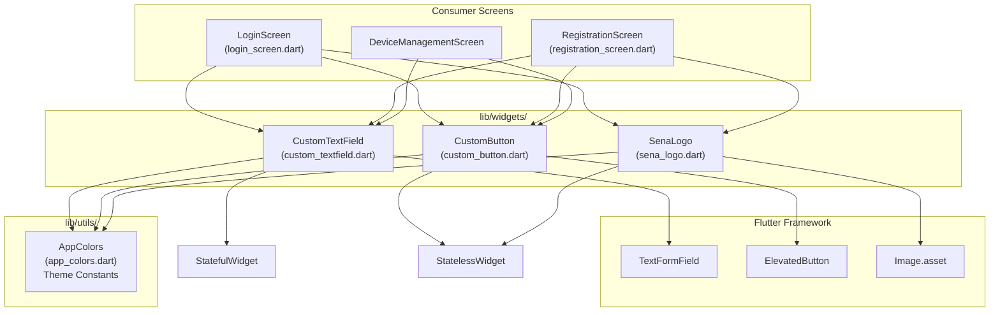
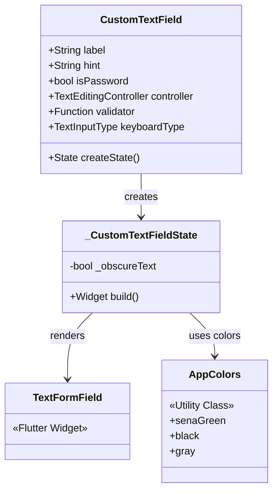
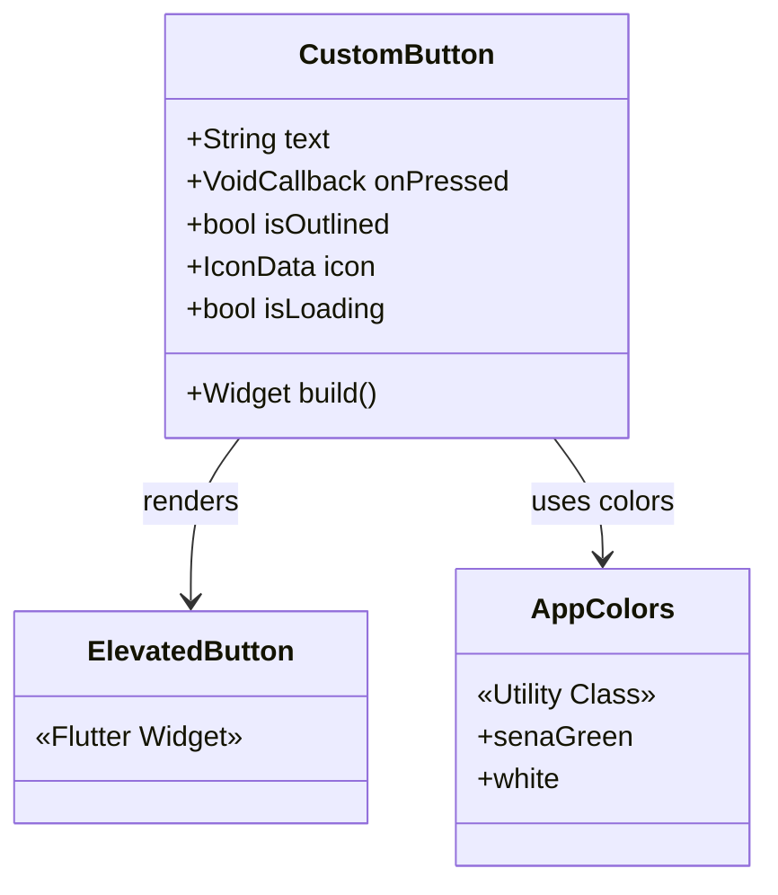
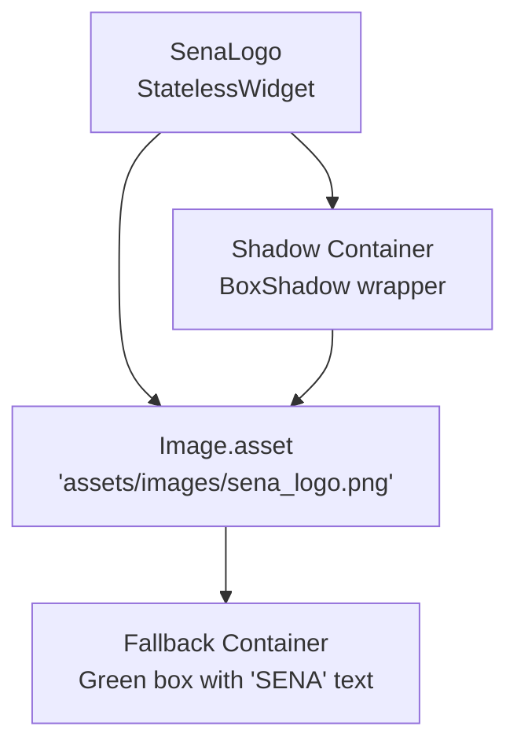
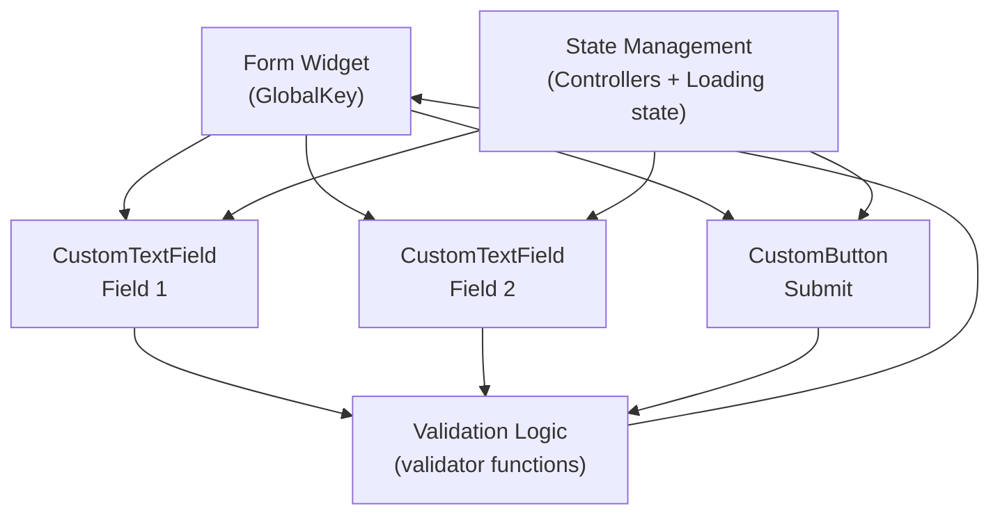

# UI Components Library

> **Relevant source files**
> * [.gitignore](https://github.com/axchisan/AppGestionCarnetsSENA/blob/9eb64390/.gitignore)
> * [assets/images/sena_logo.png](https://github.com/axchisan/AppGestionCarnetsSENA/blob/9eb64390/assets/images/sena_logo.png)
> * [lib/screens/login_screen.dart](https://github.com/axchisan/AppGestionCarnetsSENA/blob/9eb64390/lib/screens/login_screen.dart)
> * [lib/widgets/custom_button.dart](https://github.com/axchisan/AppGestionCarnetsSENA/blob/9eb64390/lib/widgets/custom_button.dart)
> * [lib/widgets/custom_textfield.dart](https://github.com/axchisan/AppGestionCarnetsSENA/blob/9eb64390/lib/widgets/custom_textfield.dart)
> * [lib/widgets/sena_logo.dart](https://github.com/axchisan/AppGestionCarnetsSENA/blob/9eb64390/lib/widgets/sena_logo.dart)

## Purpose and Scope

This document provides technical reference for the reusable UI widgets and components used throughout the SENA Digital ID Card application. These components ensure visual consistency, reduce code duplication, and provide standardized interactions across all screens.

The library consists of three main categories:

* **Custom Form Widgets**: Input fields and buttons with standardized styling and validation
* **Branding Components**: SENA logo widget with error handling and shadow options
* **Theme Utilities**: Color constants and styling patterns (see [Theme and Styling](/axchisan/AppGestionCarnetsSENA/6.3-theme-and-styling))

For screen-specific implementations using these components, see [Authentication System](/axchisan/AppGestionCarnetsSENA/4-authentication-system) and [Core Features](/axchisan/AppGestionCarnetsSENA/5-core-features).

---

## Component Architecture Overview

The UI component library is organized in the `lib/widgets/` directory. All components follow Flutter's widget composition pattern, consuming the centralized `AppColors` utility for consistent theming.



**Sources:** [lib/widgets/custom_textfield.dart L1-L4](https://github.com/axchisan/AppGestionCarnetsSENA/blob/9eb64390/lib/widgets/custom_textfield.dart#L1-L4)

 [lib/widgets/custom_button.dart L1-L3](https://github.com/axchisan/AppGestionCarnetsSENA/blob/9eb64390/lib/widgets/custom_button.dart#L1-L3)

 [lib/widgets/sena_logo.dart L1-L3](https://github.com/axchisan/AppGestionCarnetsSENA/blob/9eb64390/lib/widgets/sena_logo.dart#L1-L3)

 [lib/screens/login_screen.dart L5-L8](https://github.com/axchisan/AppGestionCarnetsSENA/blob/9eb64390/lib/screens/login_screen.dart#L5-L8)

---

## CustomTextField Component

### Overview

The `CustomTextField` widget provides a standardized text input field with integrated label, validation, keyboard type configuration, and password visibility toggle. It wraps Flutter's `TextFormField` with SENA-branded styling.

**File Location:** [lib/widgets/custom_textfield.dart L4-L89](https://github.com/axchisan/AppGestionCarnetsSENA/blob/9eb64390/lib/widgets/custom_textfield.dart#L4-L89)

### Component Structure



### Constructor Parameters

| Parameter | Type | Default | Description |
| --- | --- | --- | --- |
| `label` | `String` | *required* | Display text above the input field |
| `hint` | `String` | *required* | Placeholder text inside the input field |
| `isPassword` | `bool` | `false` | Enables password masking with visibility toggle |
| `controller` | `TextEditingController?` | `null` | Controller for accessing/setting field value |
| `validator` | `String? Function(String?)?` | `null` | Validation function for form validation |
| `keyboardType` | `TextInputType` | `TextInputType.text` | Keyboard type (text, number, email, etc.) |

### Styling Configuration

The component applies the following styling [lib/widgets/custom_textfield.dart L48-L85](https://github.com/axchisan/AppGestionCarnetsSENA/blob/9eb64390/lib/widgets/custom_textfield.dart#L48-L85)

:

* **Border**: 8px rounded corners with 2px `AppColors.senaGreen` border
* **Border States**: Identical styling for enabled, focused, and default states
* **Label**: 16px font, medium weight (500), black color
* **Suffix Icon**: Visibility toggle for password fields (eye/eye-off icons)

### Password Field Behavior

When `isPassword` is `true`, the component:

1. Initializes internal `_obscureText` state to `true` [lib/widgets/custom_textfield.dart L27](https://github.com/axchisan/AppGestionCarnetsSENA/blob/9eb64390/lib/widgets/custom_textfield.dart#L27-L27)
2. Applies `obscureText` property to `TextFormField` [lib/widgets/custom_textfield.dart L47](https://github.com/axchisan/AppGestionCarnetsSENA/blob/9eb64390/lib/widgets/custom_textfield.dart#L47-L47)
3. Adds suffix icon with toggle handler [lib/widgets/custom_textfield.dart L71-L83](https://github.com/axchisan/AppGestionCarnetsSENA/blob/9eb64390/lib/widgets/custom_textfield.dart#L71-L83)
4. Toggles visibility by inverting `_obscureText` on icon press [lib/widgets/custom_textfield.dart L78-L80](https://github.com/axchisan/AppGestionCarnetsSENA/blob/9eb64390/lib/widgets/custom_textfield.dart#L78-L80)

### Usage Examples

**Basic text input:**

```yaml
CustomTextField(
  label: 'Número de Identificación',
  hint: 'Ingresa tu número de identificación',
  controller: _identificationController,
  keyboardType: TextInputType.number,
)
```

**Password input with validation:**

```yaml
CustomTextField(
  label: 'Contraseña',
  hint: 'Ingresa tu contraseña',
  isPassword: true,
  controller: _passwordController,
  validator: (value) {
    if (value == null || value.isEmpty) {
      return 'Por favor ingresa tu contraseña';
    }
    return null;
  },
)
```

**Sources:** [lib/screens/login_screen.dart L129-L156](https://github.com/axchisan/AppGestionCarnetsSENA/blob/9eb64390/lib/screens/login_screen.dart#L129-L156)

---

## CustomButton Component

### Overview

The `CustomButton` widget provides a standardized button component with support for solid/outlined variants, loading states, and optional trailing icons. It wraps Flutter's `ElevatedButton` with SENA theming.

**File Location:** [lib/widgets/custom_button.dart L4-L66](https://github.com/axchisan/AppGestionCarnetsSENA/blob/9eb64390/lib/widgets/custom_button.dart#L4-L66)

### Component Structure



### Constructor Parameters

| Parameter | Type | Default | Description |
| --- | --- | --- | --- |
| `text` | `String` | *required* | Button label text |
| `onPressed` | `VoidCallback?` | `null` | Callback function triggered on press |
| `isOutlined` | `bool` | `false` | Renders outlined variant instead of solid |
| `icon` | `IconData?` | `null` | Optional trailing icon |
| `isLoading` | `bool` | `false` | Shows circular progress indicator, disables button |

### Styling Variants

**Solid Button (default):**

* Background: `AppColors.senaGreen`
* Text: `AppColors.white`
* Elevation: 2
* No border

**Outlined Button (`isOutlined: true`):**

* Background: `AppColors.white`
* Text: `AppColors.senaGreen`
* Border: 2px `AppColors.senaGreen`
* Elevation: 0

**Both variants:**

* Width: Full container width (`double.infinity`)
* Height: 50px
* Border radius: 8px
* Text: 16px font, semi-bold weight (600)

**Sources:** [lib/widgets/custom_button.dart L22-L64](https://github.com/axchisan/AppGestionCarnetsSENA/blob/9eb64390/lib/widgets/custom_button.dart#L22-L64)

### Loading State Behavior

When `isLoading` is `true` [lib/widgets/custom_button.dart L38-L46](https://github.com/axchisan/AppGestionCarnetsSENA/blob/9eb64390/lib/widgets/custom_button.dart#L38-L46)

:

1. Button is disabled (`onPressed` set to `null`)
2. Text and icon are replaced with `CircularProgressIndicator`
3. Indicator dimensions: 20x20px, 2px stroke width
4. Indicator color: `AppColors.white`

### Usage Examples

**Primary action button with loading:**

```yaml
CustomButton(
  text: 'Iniciar Sesión',
  onPressed: _handleLogin,
  isLoading: _isLoading,
  icon: Icons.arrow_forward,
)
```

**Secondary action button (outlined):**

```yaml
CustomButton(
  text: 'Crear Nueva Cuenta',
  onPressed: () {
    Navigator.pushNamed(context, '/registro');
  },
  isOutlined: true,
)
```

**Sources:** [lib/screens/login_screen.dart L158-L188](https://github.com/axchisan/AppGestionCarnetsSENA/blob/9eb64390/lib/screens/login_screen.dart#L158-L188)

---

## SenaLogo Component

### Overview

The `SenaLogo` widget displays the SENA institutional logo from assets with configurable dimensions and shadow. It includes fallback rendering for cases where the image asset fails to load.

**File Location:** [lib/widgets/sena_logo.dart L4-L64](https://github.com/axchisan/AppGestionCarnetsSENA/blob/9eb64390/lib/widgets/sena_logo.dart#L4-L64)

### Component Structure



### Constructor Parameters

| Parameter | Type | Default | Description |
| --- | --- | --- | --- |
| `width` | `double` | `150` | Logo width in logical pixels |
| `height` | `double` | `50` | Logo height in logical pixels |
| `showShadow` | `bool` | `false` | Wraps logo with shadow container |

### Asset Loading and Fallback

The component attempts to load the logo from `assets/images/sena_logo.png` [lib/widgets/sena_logo.dart L18-L22](https://github.com/axchisan/AppGestionCarnetsSENA/blob/9eb64390/lib/widgets/sena_logo.dart#L18-L22)

 If loading fails, the `errorBuilder` renders a fallback widget [lib/widgets/sena_logo.dart L23-L44](https://github.com/axchisan/AppGestionCarnetsSENA/blob/9eb64390/lib/widgets/sena_logo.dart#L23-L44)

:

**Fallback appearance:**

* Container with `AppColors.senaGreen` background
* 8px border radius
* Centered white "SENA" text
* Text size: 40% of container height
* Bold font weight

### Shadow Configuration

When `showShadow` is `true` [lib/widgets/sena_logo.dart L46-L60](https://github.com/axchisan/AppGestionCarnetsSENA/blob/9eb64390/lib/widgets/sena_logo.dart#L46-L60)

 the logo is wrapped in a container with:

* 8px border radius
* Black shadow with 10% opacity
* 8px blur radius
* (0, 2) pixel offset

### Usage Examples

**Standard logo without shadow:**

```javascript
const SenaLogo(
  width: 150,
  height: 50,
  showShadow: false,
)
```

**Larger logo with shadow:**

```javascript
const SenaLogo(
  width: 200,
  height: 80,
  showShadow: true,
)
```

**Sources:** [lib/screens/login_screen.dart L114-L118](https://github.com/axchisan/AppGestionCarnetsSENA/blob/9eb64390/lib/screens/login_screen.dart#L114-L118)

 [lib/widgets/sena_logo.dart L8-L64](https://github.com/axchisan/AppGestionCarnetsSENA/blob/9eb64390/lib/widgets/sena_logo.dart#L8-L64)

---

## Component Usage Patterns

### Form Composition Pattern

All authentication and data entry screens follow a consistent pattern for composing form components:



**Pattern implementation** [lib/screens/login_screen.dart L20-L163](https://github.com/axchisan/AppGestionCarnetsSENA/blob/9eb64390/lib/screens/login_screen.dart#L20-L163)

:

1. Create `GlobalKey<FormState>` for form validation
2. Instantiate `TextEditingController` for each field
3. Wrap fields in `Form` widget with the form key
4. Attach controllers to `CustomTextField` widgets
5. Provide `validator` functions for each field
6. Connect `CustomButton.onPressed` to validation + submission handler
7. Manage loading state to disable button during async operations

### Widget Integration Table

The following table shows which screens consume each component:

| Component | LoginScreen | RegistrationScreen | DeviceManagementScreen | HomeScreen | IdCardScreen |
| --- | --- | --- | --- | --- | --- |
| `CustomTextField` | ✓ | ✓ | ✓ | - | - |
| `CustomButton` | ✓ | ✓ | ✓ | - | - |
| `SenaLogo` | ✓ | ✓ | - | - | - |

**Sources:** [lib/screens/login_screen.dart L6-L8](https://github.com/axchisan/AppGestionCarnetsSENA/blob/9eb64390/lib/screens/login_screen.dart#L6-L8)

### Color Constant Dependencies

All components import and use `AppColors` from [lib/utils/app_colors.dart](https://github.com/axchisan/AppGestionCarnetsSENA/blob/9eb64390/lib/utils/app_colors.dart)

 The following constants are referenced across the component library:

| Constant | Usage |
| --- | --- |
| `AppColors.senaGreen` | Button backgrounds, text field borders, logo fallback |
| `AppColors.white` | Button text (solid variant), button background (outlined variant) |
| `AppColors.black` | Text field labels, text content |
| `AppColors.gray` | Password visibility toggle icon |
| `AppColors.red` | Error messages in snackbars |

**Sources:** [lib/widgets/custom_textfield.dart L2](https://github.com/axchisan/AppGestionCarnetsSENA/blob/9eb64390/lib/widgets/custom_textfield.dart#L2-L2)

 [lib/widgets/custom_button.dart L2](https://github.com/axchisan/AppGestionCarnetsSENA/blob/9eb64390/lib/widgets/custom_button.dart#L2-L2)

 [lib/widgets/sena_logo.dart L2](https://github.com/axchisan/AppGestionCarnetsSENA/blob/9eb64390/lib/widgets/sena_logo.dart#L2-L2)

---

## Component State Management

### Stateful vs Stateless Design

The component library follows Flutter best practices for state management:

| Component | Widget Type | Reason |
| --- | --- | --- |
| `CustomTextField` | `StatefulWidget` | Manages internal `_obscureText` state for password visibility toggle |
| `CustomButton` | `StatelessWidget` | All state (loading, enabled/disabled) managed by parent |
| `SenaLogo` | `StatelessWidget` | Static display component with no internal state |

**Sources:** [lib/widgets/custom_textfield.dart L4-L27](https://github.com/axchisan/AppGestionCarnetsSENA/blob/9eb64390/lib/widgets/custom_textfield.dart#L4-L27)

 [lib/widgets/custom_button.dart L4](https://github.com/axchisan/AppGestionCarnetsSENA/blob/9eb64390/lib/widgets/custom_button.dart#L4-L4)

 [lib/widgets/sena_logo.dart L4](https://github.com/axchisan/AppGestionCarnetsSENA/blob/9eb64390/lib/widgets/sena_logo.dart#L4-L4)

### Parent-Child State Flow

```mermaid
sequenceDiagram
  participant Parent Screen
  participant (e.g., LoginScreen)
  participant CustomTextField
  participant CustomButton

  Parent Screen->>Parent Screen: Create TextEditingController
  Parent Screen->>Parent Screen: Initialize _isLoading = false
  Parent Screen->>CustomTextField: Pass controller + validator
  Parent Screen->>CustomButton: Pass onPressed + isLoading
  CustomTextField->>CustomTextField: User types input
  CustomTextField->>Parent Screen: Controller.text updates
  Parent Screen->>Parent Screen: User presses button
  Parent Screen->>Parent Screen: Validate form
  Parent Screen->>Parent Screen: setState(_isLoading = true)
  Parent Screen->>CustomButton: Rebuild with isLoading=true
  CustomButton->>CustomButton: Show CircularProgressIndicator
  Parent Screen->>Parent Screen: Async operation completes
  Parent Screen->>Parent Screen: setState(_isLoading = false)
  Parent Screen->>CustomButton: Rebuild with isLoading=false
  CustomButton->>CustomButton: Show button text
```

**Sources:** [lib/screens/login_screen.dart L20-L92](https://github.com/axchisan/AppGestionCarnetsSENA/blob/9eb64390/lib/screens/login_screen.dart#L20-L92)

---

## Error Handling and Edge Cases

### CustomTextField Edge Cases

**Empty Validation:**
The component itself does not enforce validation. Parent screens must provide `validator` functions [lib/screens/login_screen.dart L134-L142](https://github.com/axchisan/AppGestionCarnetsSENA/blob/9eb64390/lib/screens/login_screen.dart#L134-L142)

**Null Controller:**
If no `controller` is provided, the field is uncontrolled. For form submission, controllers are required to access field values.

### CustomButton Edge Cases

**Null onPressed:**
When `onPressed` is `null`, Flutter's `ElevatedButton` automatically disables the button [lib/widgets/custom_button.dart L26](https://github.com/axchisan/AppGestionCarnetsSENA/blob/9eb64390/lib/widgets/custom_button.dart#L26-L26)

**Loading and onPressed interaction:**
The loading state takes precedence - when `isLoading` is `true`, `onPressed` is forcibly set to `null` [lib/widgets/custom_button.dart L26](https://github.com/axchisan/AppGestionCarnetsSENA/blob/9eb64390/lib/widgets/custom_button.dart#L26-L26)

### SenaLogo Error Handling

**Asset Loading Failure:**
The component implements an `errorBuilder` callback [lib/widgets/sena_logo.dart L23-L44](https://github.com/axchisan/AppGestionCarnetsSENA/blob/9eb64390/lib/widgets/sena_logo.dart#L23-L44)

 that renders a styled fallback container. This handles:

* Missing asset file
* Incorrect asset path in `pubspec.yaml`
* Image decoding errors
* Network issues (if using network images)

The fallback displays "SENA" text in white on a green background, maintaining brand consistency even when the asset fails.

**Sources:** [lib/widgets/sena_logo.dart L18-L44](https://github.com/axchisan/AppGestionCarnetsSENA/blob/9eb64390/lib/widgets/sena_logo.dart#L18-L44)