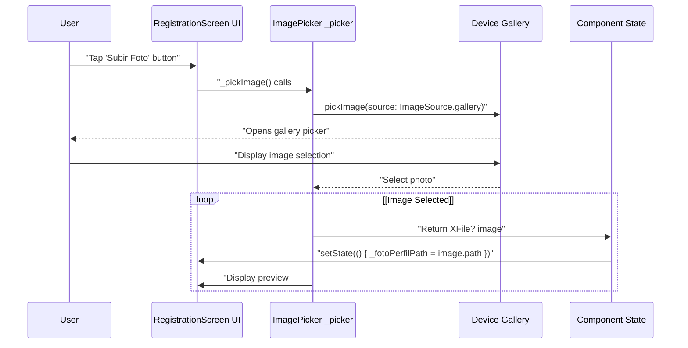
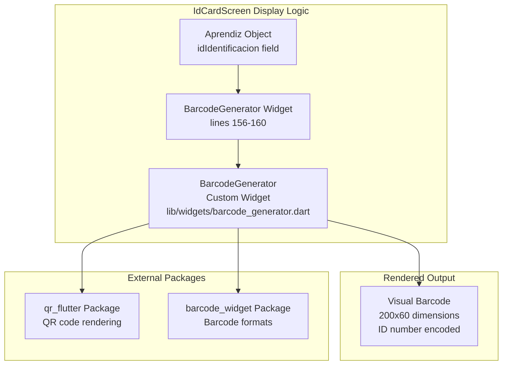
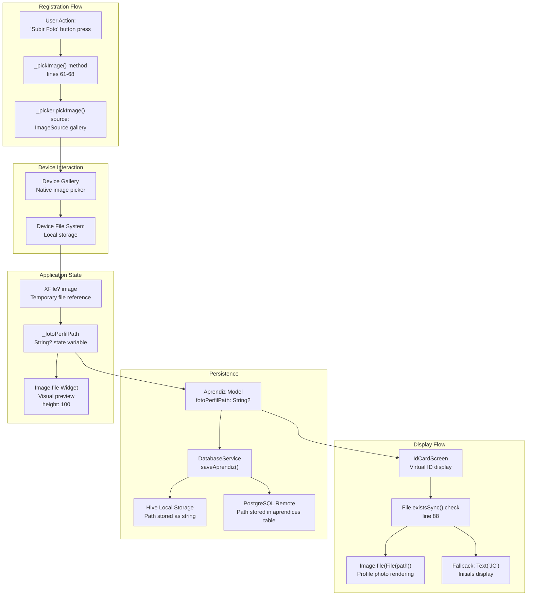

# UI and Media Dependencies

> **Relevant source files**
> * [lib/screens/id_card_screen.dart](https://github.com/axchisan/AppGestionCarnetsSENA/blob/9eb64390/lib/screens/id_card_screen.dart)
> * [lib/screens/registration_screen.dart](https://github.com/axchisan/AppGestionCarnetsSENA/blob/9eb64390/lib/screens/registration_screen.dart)
> * [pubspec.yaml](https://github.com/axchisan/AppGestionCarnetsSENA/blob/9eb64390/pubspec.yaml)

## Purpose and Scope

This document covers the UI-related and media-handling packages used in the SENA Digital ID Card application. These dependencies provide functionality for visual components (barcodes, QR codes, icons) and media selection (photo uploads).

For core data and security dependencies, see [Core Dependencies](/axchisan/AppGestionCarnetsSENA/7.1-core-dependencies). For build-time code generation tools, see [Development Tools](/axchisan/AppGestionCarnetsSENA/7.3-development-tools).

---

## Package Overview

The application uses four UI and media-related packages defined in [pubspec.yaml L13-L16](https://github.com/axchisan/AppGestionCarnetsSENA/blob/9eb64390/pubspec.yaml#L13-L16)

:

| Package | Version | Purpose | Primary Use Cases |
| --- | --- | --- | --- |
| `qr_flutter` | ^4.1.0 | QR code generation | Virtual ID card barcode display |
| `barcode_widget` | ^2.0.3 | Barcode rendering | Alternative barcode formats for ID cards |
| `image_picker` | ^1.0.4 | Photo selection from gallery/camera | Profile photo upload during registration |
| `cupertino_icons` | ^1.0.2 | iOS-style icon set | Standard Flutter UI icons |

**Sources:** [pubspec.yaml L13-L16](https://github.com/axchisan/AppGestionCarnetsSENA/blob/9eb64390/pubspec.yaml#L13-L16)

---

## Dependency Integration Architecture

```

```

**Sources:** [pubspec.yaml L13-L16](https://github.com/axchisan/AppGestionCarnetsSENA/blob/9eb64390/pubspec.yaml#L13-L16)

 [lib/screens/registration_screen.dart L1-L10](https://github.com/axchisan/AppGestionCarnetsSENA/blob/9eb64390/lib/screens/registration_screen.dart#L1-L10)

 [lib/screens/id_card_screen.dart L1-L7](https://github.com/axchisan/AppGestionCarnetsSENA/blob/9eb64390/lib/screens/id_card_screen.dart#L1-L7)

---

## image_picker Package

### Purpose

The `image_picker` package (version ^1.0.4) enables users to select photos from their device gallery or capture new photos using the camera. In this application, it is used exclusively for profile photo uploads during user registration.

### Integration Point

The package is integrated in `RegistrationScreen` at [lib/screens/registration_screen.dart L3](https://github.com/axchisan/AppGestionCarnetsSENA/blob/9eb64390/lib/screens/registration_screen.dart#L3-L3)

:

```javascript
import 'package:image_picker/image_picker.dart';
```

### Implementation Details

#### ImagePicker Instance

The screen maintains an `ImagePicker` instance as a private field at [lib/screens/registration_screen.dart L29](https://github.com/axchisan/AppGestionCarnetsSENA/blob/9eb64390/lib/screens/registration_screen.dart#L29-L29)

:

```

```

#### Photo Selection Flow

The `_pickImage()` method handles photo selection at [lib/screens/registration_screen.dart L61-L68](https://github.com/axchisan/AppGestionCarnetsSENA/blob/9eb64390/lib/screens/registration_screen.dart#L61-L68)

:



**Sources:** [lib/screens/registration_screen.dart L61-L68](https://github.com/axchisan/AppGestionCarnetsSENA/blob/9eb64390/lib/screens/registration_screen.dart#L61-L68)

 [lib/screens/registration_screen.dart L416-L425](https://github.com/axchisan/AppGestionCarnetsSENA/blob/9eb64390/lib/screens/registration_screen.dart#L416-L425)

#### Photo Storage Pattern

Selected photos are stored as file paths, not image data:

1. **Path Storage**: The `_fotoPerfilPath` state variable stores the selected image path at [lib/screens/registration_screen.dart L34](https://github.com/axchisan/AppGestionCarnetsSENA/blob/9eb64390/lib/screens/registration_screen.dart#L34-L34)
2. **Preview Display**: The UI conditionally displays the selected photo using `Image.file(File(_fotoPerfilPath!))` at [lib/screens/registration_screen.dart L424](https://github.com/axchisan/AppGestionCarnetsSENA/blob/9eb64390/lib/screens/registration_screen.dart#L424-L424)
3. **Model Integration**: The path is saved to the `Aprendiz` model's `fotoPerfilPath` field at [lib/screens/registration_screen.dart L169](https://github.com/axchisan/AppGestionCarnetsSENA/blob/9eb64390/lib/screens/registration_screen.dart#L169-L169)

#### UI Components

The photo selection UI consists of:

| Component | Location | Description |
| --- | --- | --- |
| Section Label | [lib/screens/registration_screen.dart L407-L414](https://github.com/axchisan/AppGestionCarnetsSENA/blob/9eb64390/lib/screens/registration_screen.dart#L407-L414) | "Foto de Perfil" text label |
| Upload Button | [lib/screens/registration_screen.dart L416-L421](https://github.com/axchisan/AppGestionCarnetsSENA/blob/9eb64390/lib/screens/registration_screen.dart#L416-L421) | `CustomButton` with "Subir Foto" text and camera icon |
| Photo Preview | [lib/screens/registration_screen.dart L422-L425](https://github.com/axchisan/AppGestionCarnetsSENA/blob/9eb64390/lib/screens/registration_screen.dart#L422-L425) | Conditional `Image.file` widget showing selected photo |

**Sources:** [lib/screens/registration_screen.dart L29-L34](https://github.com/axchisan/AppGestionCarnetsSENA/blob/9eb64390/lib/screens/registration_screen.dart#L29-L34)

 [lib/screens/registration_screen.dart L61-L68](https://github.com/axchisan/AppGestionCarnetsSENA/blob/9eb64390/lib/screens/registration_screen.dart#L61-L68)

 [lib/screens/registration_screen.dart L407-L425](https://github.com/axchisan/AppGestionCarnetsSENA/blob/9eb64390/lib/screens/registration_screen.dart#L407-L425)

---

## qr_flutter and barcode_widget Packages

### Purpose

These two packages provide barcode and QR code generation capabilities for the virtual ID card display:

* **qr_flutter** (^4.1.0): Generates QR codes with customizable size and error correction
* **barcode_widget** (^2.0.3): Renders various barcode formats (Code128, EAN, etc.)

### Integration Pattern

Rather than importing these packages directly in screens, the application wraps them in a custom `BarcodeGenerator` widget at [lib/screens/id_card_screen.dart L6](https://github.com/axchisan/AppGestionCarnetsSENA/blob/9eb64390/lib/screens/id_card_screen.dart#L6-L6)

:

```

```

This abstraction layer provides:

* Consistent barcode styling across the application
* Simplified API for screen components
* Centralized configuration for barcode dimensions and format

### Usage in IdCardScreen

The `BarcodeGenerator` widget is instantiated in `IdCardScreen` at [lib/screens/id_card_screen.dart L156-L160](https://github.com/axchisan/AppGestionCarnetsSENA/blob/9eb64390/lib/screens/id_card_screen.dart#L156-L160)

:



**Sources:** [lib/screens/id_card_screen.dart L156-L160](https://github.com/axchisan/AppGestionCarnetsSENA/blob/9eb64390/lib/screens/id_card_screen.dart#L156-L160)

### Barcode Display Layout

The ID card screen displays the barcode with accompanying text at [lib/screens/id_card_screen.dart L155-L169](https://github.com/axchisan/AppGestionCarnetsSENA/blob/9eb64390/lib/screens/id_card_screen.dart#L155-L169)

:

| Element | Purpose | Implementation |
| --- | --- | --- |
| Barcode Widget | Visual encoding of ID number | `BarcodeGenerator(data: aprendiz?.idIdentificacion ?? 'N/A', width: 200, height: 60)` |
| Spacing | Vertical gap | `SizedBox(height: 8)` |
| ID Text Label | Human-readable ID display | `Text` widget with monospace font family |

The barcode encoding scheme uses the apprentice's identification number as the data source, providing a machine-readable representation suitable for scanning at SENA facilities.

**Sources:** [lib/screens/id_card_screen.dart L155-L169](https://github.com/axchisan/AppGestionCarnetsSENA/blob/9eb64390/lib/screens/id_card_screen.dart#L155-L169)

---

## cupertino_icons Package

### Purpose

The `cupertino_icons` package (version ^1.0.2) provides iOS-style icons used throughout the application's Material Design interface. While Flutter's Material Design uses its own icon set by default, this package is included as a standard Flutter dependency.

### Declaration

The package is declared at [pubspec.yaml L13](https://github.com/axchisan/AppGestionCarnetsSENA/blob/9eb64390/pubspec.yaml#L13-L13)

:

```

```

### Usage Pattern

The package enables the use of `Icons.*` constants throughout the application. While not explicitly imported in most files (as `Icons` is part of Flutter's core Material package), the `cupertino_icons` package provides the icon font data.

#### Icon Usage Examples

| Screen | Icon | Purpose | Location |
| --- | --- | --- | --- |
| RegistrationScreen | `Icons.camera_alt` | Photo upload button icon | [lib/screens/registration_screen.dart L420](https://github.com/axchisan/AppGestionCarnetsSENA/blob/9eb64390/lib/screens/registration_screen.dart#L420-L420) |
| IdCardScreen | `Icons.arrow_back` | Back navigation button | [lib/screens/id_card_screen.dart L22](https://github.com/axchisan/AppGestionCarnetsSENA/blob/9eb64390/lib/screens/id_card_screen.dart#L22-L22) |
| IdCardScreen | `Icons.close` | Close/dismiss action | [lib/screens/id_card_screen.dart L36](https://github.com/axchisan/AppGestionCarnetsSENA/blob/9eb64390/lib/screens/id_card_screen.dart#L36-L36) |
| IdCardScreen | `Icons.share` | Share functionality button | [lib/screens/id_card_screen.dart L186](https://github.com/axchisan/AppGestionCarnetsSENA/blob/9eb64390/lib/screens/id_card_screen.dart#L186-L186) |

**Sources:** [pubspec.yaml L13](https://github.com/axchisan/AppGestionCarnetsSENA/blob/9eb64390/pubspec.yaml#L13-L13)

 [lib/screens/registration_screen.dart L420](https://github.com/axchisan/AppGestionCarnetsSENA/blob/9eb64390/lib/screens/registration_screen.dart#L420-L420)

 [lib/screens/id_card_screen.dart L22-L38](https://github.com/axchisan/AppGestionCarnetsSENA/blob/9eb64390/lib/screens/id_card_screen.dart#L22-L38)

 [lib/screens/id_card_screen.dart L186](https://github.com/axchisan/AppGestionCarnetsSENA/blob/9eb64390/lib/screens/id_card_screen.dart#L186-L186)

---

## Media File Handling Architecture



**Sources:** [lib/screens/registration_screen.dart L29-L34](https://github.com/axchisan/AppGestionCarnetsSENA/blob/9eb64390/lib/screens/registration_screen.dart#L29-L34)

 [lib/screens/registration_screen.dart L61-L68](https://github.com/axchisan/AppGestionCarnetsSENA/blob/9eb64390/lib/screens/registration_screen.dart#L61-L68)

 [lib/screens/registration_screen.dart L163-L174](https://github.com/axchisan/AppGestionCarnetsSENA/blob/9eb64390/lib/screens/registration_screen.dart#L163-L174)

 [lib/screens/id_card_screen.dart L88-L99](https://github.com/axchisan/AppGestionCarnetsSENA/blob/9eb64390/lib/screens/id_card_screen.dart#L88-L99)

---

## File Path vs. Base64 Strategy

The application uses a **file path storage strategy** rather than storing image data directly:

### Storage Method

| Layer | Storage Format | Location |
| --- | --- | --- |
| State Variable | `String? _fotoPerfilPath` | [lib/screens/registration_screen.dart L34](https://github.com/axchisan/AppGestionCarnetsSENA/blob/9eb64390/lib/screens/registration_screen.dart#L34-L34) |
| Data Model | `String? fotoPerfilPath` field in Aprendiz | [lib/screens/registration_screen.dart L169](https://github.com/axchisan/AppGestionCarnetsSENA/blob/9eb64390/lib/screens/registration_screen.dart#L169-L169) |
| Hive Database | String path value | Synchronized via DatabaseService |
| PostgreSQL | String path value | Remote storage |

### Advantages

1. **Storage Efficiency**: Only file paths are stored in databases, not large binary image data
2. **Performance**: No image encoding/decoding overhead during database operations
3. **Flexibility**: Images remain as standard files accessible to other applications

### File Existence Validation

The `IdCardScreen` validates file existence before attempting to display photos at [lib/screens/id_card_screen.dart L88](https://github.com/axchisan/AppGestionCarnetsSENA/blob/9eb64390/lib/screens/id_card_screen.dart#L88-L88)

:

```

```

This defensive check prevents runtime errors if:

* The photo file was deleted from the device
* The path is invalid
* The application was migrated to a new device

When the file doesn't exist, the UI falls back to displaying the user's initials.

**Sources:** [lib/screens/registration_screen.dart L34](https://github.com/axchisan/AppGestionCarnetsSENA/blob/9eb64390/lib/screens/registration_screen.dart#L34-L34)

 [lib/screens/registration_screen.dart L169](https://github.com/axchisan/AppGestionCarnetsSENA/blob/9eb64390/lib/screens/registration_screen.dart#L169-L169)

 [lib/screens/id_card_screen.dart L88-L99](https://github.com/axchisan/AppGestionCarnetsSENA/blob/9eb64390/lib/screens/id_card_screen.dart#L88-L99)

---

## Asset Configuration

UI and media dependencies require asset configuration in `pubspec.yaml` at [pubspec.yaml L31-L35](https://github.com/axchisan/AppGestionCarnetsSENA/blob/9eb64390/pubspec.yaml#L31-L35)

:

```

```

### Asset Directory Purpose

| Asset Path | Purpose | Related Dependencies |
| --- | --- | --- |
| `assets/images/` | Static image resources (logos, icons) | Used by `SenaLogo` widget |
| `.env` | Environment configuration | Not directly related to UI packages, but bundled as asset |

The `uses-material-design: true` flag enables Material Design icons, which supplements the `cupertino_icons` package.

**Sources:** [pubspec.yaml L31-L35](https://github.com/axchisan/AppGestionCarnetsSENA/blob/9eb64390/pubspec.yaml#L31-L35)

---

## Dependency Version Management

All UI and media dependencies use caret version constraints:

| Package | Constraint | Meaning |
| --- | --- | --- |
| `qr_flutter` | `^4.1.0` | Compatible with 4.1.0 up to (but not including) 5.0.0 |
| `barcode_widget` | `^2.0.3` | Compatible with 2.0.3 up to (but not including) 3.0.0 |
| `image_picker` | `^1.0.4` | Compatible with 1.0.4 up to (but not including) 2.0.0 |
| `cupertino_icons` | `^1.0.2` | Compatible with 1.0.2 up to (but not including) 2.0.0 |

This versioning strategy allows automatic minor and patch updates while preventing breaking changes from major version updates.

**Sources:** [pubspec.yaml L13-L16](https://github.com/axchisan/AppGestionCarnetsSENA/blob/9eb64390/pubspec.yaml#L13-L16)