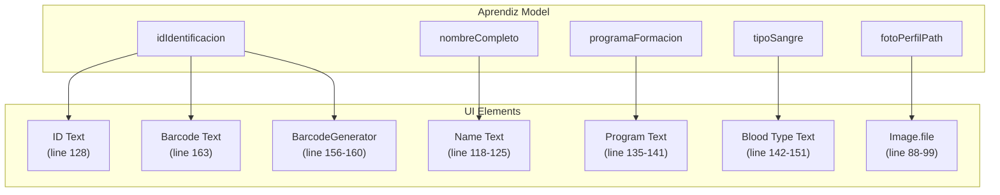
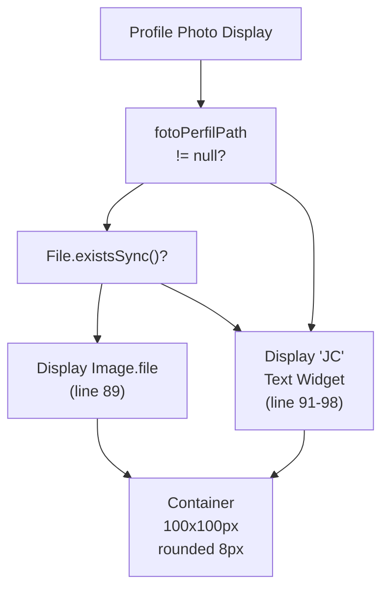
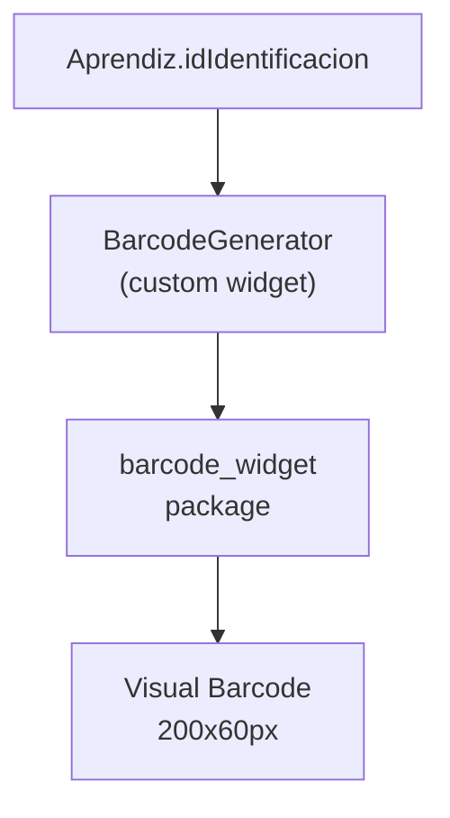
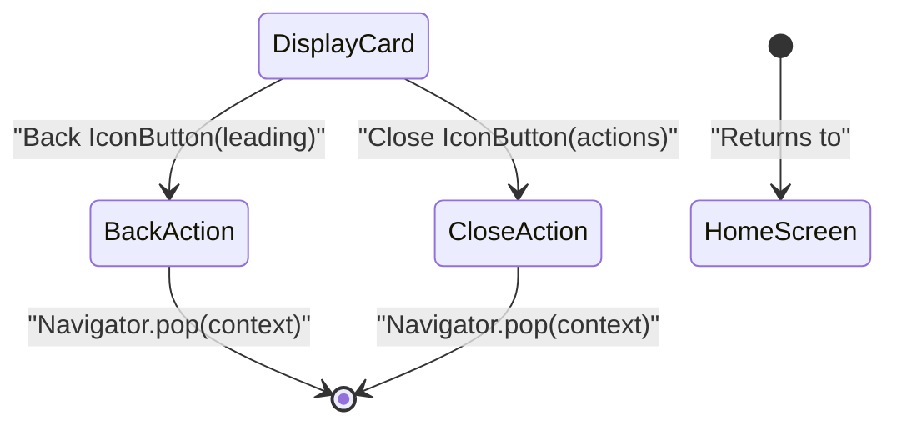

# Virtual ID Card Display

> **Relevant source files**
> * [lib/models/models.dart](https://github.com/axchisan/AppGestionCarnetsSENA/blob/9eb64390/lib/models/models.dart)
> * [lib/models/models.g.dart](https://github.com/axchisan/AppGestionCarnetsSENA/blob/9eb64390/lib/models/models.g.dart)
> * [lib/screens/id_card_screen.dart](https://github.com/axchisan/AppGestionCarnetsSENA/blob/9eb64390/lib/screens/id_card_screen.dart)
> * [macos/Flutter/GeneratedPluginRegistrant.swift](https://github.com/axchisan/AppGestionCarnetsSENA/blob/9eb64390/macos/Flutter/GeneratedPluginRegistrant.swift)
> * [pubspec.yaml](https://github.com/axchisan/AppGestionCarnetsSENA/blob/9eb64390/pubspec.yaml)

## Purpose and Scope

This document describes the `IdCardScreen` component, which renders a virtual digital ID card for authenticated SENA apprentices. The screen displays the user's identification information, profile photo, program details, and a scannable barcode generated from their identification number. The card is designed to replicate a physical SENA ID card in digital form.

For information about the home dashboard that navigates to this screen, see [Home Screen](/axchisan/AppGestionCarnetsSENA/5.1-home-screen). For details on the underlying data models, see [Data Models](/axchisan/AppGestionCarnetsSENA/3.1.2-data-models-(aprendiz-and-dispositivo)).

## Screen Overview

The `IdCardScreen` is a stateless Flutter widget that receives an `Aprendiz` object containing all user data to display. The screen is accessed via navigation from the `HomeScreen` through the named route `/carnet`.

**Key Characteristics:**

* **Widget Type:** `StatelessWidget` - No internal state management required
* **Required Input:** `Aprendiz? aprendiz` - User data passed via constructor
* **Route Name:** `/carnet` (defined in application routing)
* **Navigation:** Accessed from `HomeScreen`, returns via back button

Sources: [lib/screens/id_card_screen.dart L9-L12](https://github.com/axchisan/AppGestionCarnetsSENA/blob/9eb64390/lib/screens/id_card_screen.dart#L9-L12)

## Component Architecture

The screen is composed of several reusable components and follows a hierarchical layout structure:

```

```

**Component Diagram: IdCardScreen Widget Hierarchy**

The screen uses a centered, constrained card container (max width 320px) with green borders matching SENA branding. All visual components are organized within this card.

Sources: [lib/screens/id_card_screen.dart L14-L193](https://github.com/axchisan/AppGestionCarnetsSENA/blob/9eb64390/lib/screens/id_card_screen.dart#L14-L193)

## Data Flow and Binding

The `IdCardScreen` receives an `Aprendiz` object and maps its fields to UI elements:



**Diagram: Aprendiz Data to UI Element Mapping**

All fields use null-safe operators (`??`) to provide fallback values when data is unavailable. The `fotoPerfilPath` field undergoes additional validation to check file existence before displaying.

Sources: [lib/screens/id_card_screen.dart L88-L169](https://github.com/axchisan/AppGestionCarnetsSENA/blob/9eb64390/lib/screens/id_card_screen.dart#L88-L169)

 [lib/models/models.dart L5-L68](https://github.com/axchisan/AppGestionCarnetsSENA/blob/9eb64390/lib/models/models.dart#L5-L68)

## Card Layout and Styling

The ID card container uses specific styling to create a physical card appearance:

| Property | Value | Description |
| --- | --- | --- |
| **Border** | `Border.all(color: AppColors.senaGreen, width: 4)` | 4px green border (SENA brand color) |
| **Border Radius** | `BorderRadius.circular(16)` | Rounded corners (16px) |
| **Background** | `AppColors.white` | White background |
| **Shadow** | `BoxShadow(blurRadius: 10, offset: Offset(0, 4))` | Drop shadow for depth effect |
| **Max Width** | `320px` | Constrained width for mobile screens |
| **Padding** | `EdgeInsets.all(24.0)` | Internal spacing |

The card uses a vertical `Column` layout with these sections from top to bottom:

1. **Header Row** (lines 71-102): SENA logo (left) and profile photo (right)
2. **User Information** (lines 104-154): Name, ID, program, blood type
3. **Barcode** (lines 156-160): Scannable barcode widget
4. **Barcode Text** (lines 162-169): Human-readable ID number

Sources: [lib/screens/id_card_screen.dart L48-L173](https://github.com/axchisan/AppGestionCarnetsSENA/blob/9eb64390/lib/screens/id_card_screen.dart#L48-L173)

## Profile Photo Handling

The profile photo display implements a fallback mechanism:



**Diagram: Profile Photo Display Logic**

The photo container specifications:

* **Size:** 100x100 pixels
* **Border:** Light green (`AppColors.senaGreen.withOpacity(0.3)`)
* **Border Radius:** 8px rounded corners
* **Fallback:** Large "JC" text in bold green (lines 91-98)

**Implementation Details:**

The code checks two conditions sequentially:

1. `aprendiz?.fotoPerfilPath != null` - Path exists in model
2. `File(aprendiz!.fotoPerfilPath!).existsSync()` - File exists on device filesystem

If both conditions pass, displays `Image.file` with `BoxFit.cover`. Otherwise, displays placeholder initials.

Sources: [lib/screens/id_card_screen.dart L79-L101](https://github.com/axchisan/AppGestionCarnetsSENA/blob/9eb64390/lib/screens/id_card_screen.dart#L79-L101)

## Barcode Generation

The barcode is generated using the `BarcodeGenerator` widget, which renders a scannable code from the user's identification number:

**BarcodeGenerator Parameters:**

| Parameter | Value | Purpose |
| --- | --- | --- |
| `data` | `aprendiz?.idIdentificacion ?? 'N/A'` | The identification number to encode |
| `width` | `200` | Barcode width in logical pixels |
| `height` | `60` | Barcode height in logical pixels |

The barcode is followed by a monospace text display of the same ID number for manual entry scenarios. The text uses `fontFamily: 'monospace'` and `fontSize: 12` for readability.

**Barcode Component Integration:**



**Diagram: Barcode Generation Chain**

The `BarcodeGenerator` widget is a custom wrapper around the `barcode_widget` package (version ^2.0.3) defined in `pubspec.yaml`. The actual barcode format (e.g., Code128, QR) is determined by the `BarcodeGenerator` widget implementation.

Sources: [lib/screens/id_card_screen.dart L156-L169](https://github.com/axchisan/AppGestionCarnetsSENA/blob/9eb64390/lib/screens/id_card_screen.dart#L156-L169)

 [pubspec.yaml L15](https://github.com/axchisan/AppGestionCarnetsSENA/blob/9eb64390/pubspec.yaml#L15-L15)

## User Information Display

The card displays user details in a left-aligned vertical column:

**Information Fields:**

| Field | Source | Fallback | Styling |
| --- | --- | --- | --- |
| **Label** | Static "Aprendiz" | N/A | 16px, medium weight |
| **Full Name** | `aprendiz?.nombreCompleto` | "No disponible" | 20px, bold |
| **ID Number** | `aprendiz?.idIdentificacion` | "N/A" | 16px, prefixed "ID: " |
| **Program** | `aprendiz?.programaFormacion` | "No disponible" | 14px |
| **Blood Type** | `aprendiz?.tipoSangre` | Not displayed | 14px, conditional |

**Conditional Rendering:**

The blood type field uses conditional rendering (lines 142-151):

```

```

This spread operator syntax (`...[]`) conditionally adds widgets to the column only when `tipoSangre` is non-null, avoiding empty space in the UI.

Sources: [lib/screens/id_card_screen.dart L104-L154](https://github.com/axchisan/AppGestionCarnetsSENA/blob/9eb64390/lib/screens/id_card_screen.dart#L104-L154)

## Share Functionality

The screen includes a `CustomButton` widget for sharing the ID card (lines 177-187):

**Current Implementation:**

* **Button Text:** "Compartir Carnet"
* **Icon:** `Icons.share`
* **Action:** Displays a `SnackBar` with message "Funcionalidad de compartir próximamente"
* **Status:** Not implemented - placeholder for future feature

**Planned Functionality:**

The share button is positioned below the card container with 24px spacing. When implemented, it would likely:

1. Capture the card widget as an image
2. Share via platform share dialog
3. Include options for saving to gallery or sharing via messaging apps

Sources: [lib/screens/id_card_screen.dart L177-L187](https://github.com/axchisan/AppGestionCarnetsSENA/blob/9eb64390/lib/screens/id_card_screen.dart#L177-L187)

## Screen Navigation

The `IdCardScreen` provides two navigation options in the `AppBar`:



**Diagram: IdCardScreen Navigation Flow**

Both buttons execute `Navigator.pop(context)`, returning to the previous screen (typically `HomeScreen`). The dual-button design provides flexibility for users familiar with different navigation patterns.

Sources: [lib/screens/id_card_screen.dart L18-L39](https://github.com/axchisan/AppGestionCarnetsSENA/blob/9eb64390/lib/screens/id_card_screen.dart#L18-L39)

## Color Scheme and Branding

The screen uses the `AppColors` utility for consistent branding:

| Element | Color | Usage |
| --- | --- | --- |
| Background | `AppColors.white` | Screen and card background |
| Border | `AppColors.senaGreen` | Card border (4px width) |
| Text | `AppColors.black` | All text content |
| Photo Border | `AppColors.senaGreen.withOpacity(0.3)` | Profile photo container |
| Initials Fallback | `AppColors.senaGreen` | "JC" placeholder text |

The SENA green color is the primary brand identifier, applied to borders, the logo, and accent elements. The white background with black text ensures high readability.

Sources: [lib/screens/id_card_screen.dart L17-L98](https://github.com/axchisan/AppGestionCarnetsSENA/blob/9eb64390/lib/screens/id_card_screen.dart#L17-L98)

 [lib/utils/app_colors.dart](https://github.com/axchisan/AppGestionCarnetsSENA/blob/9eb64390/lib/utils/app_colors.dart)

## Dependencies

The `IdCardScreen` relies on the following imports:

| Import | Purpose | Lines |
| --- | --- | --- |
| `dart:io` | File system operations for photo validation | 1 |
| `package:flutter/material.dart` | Flutter UI framework | 2 |
| `../utils/app_colors.dart` | Color scheme constants | 3 |
| `../widgets/custom_button.dart` | Share button component | 4 |
| `../widgets/sena_logo.dart` | SENA branding logo | 5 |
| `../widgets/barcode_generator.dart` | Barcode rendering widget | 6 |
| `../models/models.dart` | `Aprendiz` data model | 7 |

External packages used (via widgets):

* `barcode_widget: ^2.0.3` - Barcode generation
* `qr_flutter: ^4.1.0` - Alternative barcode/QR support

Sources: [lib/screens/id_card_screen.dart L1-L7](https://github.com/axchisan/AppGestionCarnetsSENA/blob/9eb64390/lib/screens/id_card_screen.dart#L1-L7)

 [pubspec.yaml L14-L15](https://github.com/axchisan/AppGestionCarnetsSENA/blob/9eb64390/pubspec.yaml#L14-L15)

## Offline Capability

The `IdCardScreen` is fully functional offline because:

1. **Local Data Source:** Receives `Aprendiz` object from Hive local storage (loaded in `HomeScreen`)
2. **Local Assets:** Profile photos are stored as file paths on the device filesystem
3. **No Network Calls:** All data is pre-loaded; no API requests occur during rendering
4. **Static Generation:** Barcode is generated client-side from the ID string

The only online-dependent feature is the unimplemented share functionality, which would require platform services.

Sources: [lib/screens/id_card_screen.dart L9-L12](https://github.com/axchisan/AppGestionCarnetsSENA/blob/9eb64390/lib/screens/id_card_screen.dart#L9-L12)