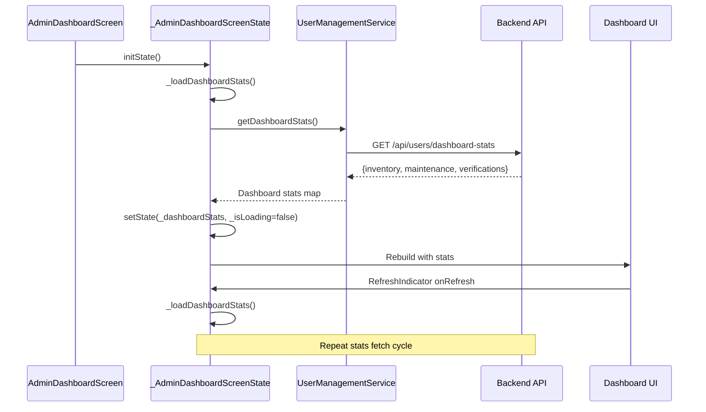
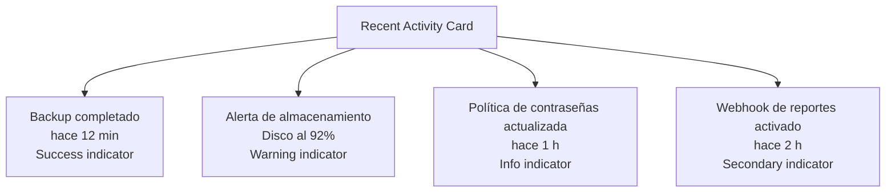
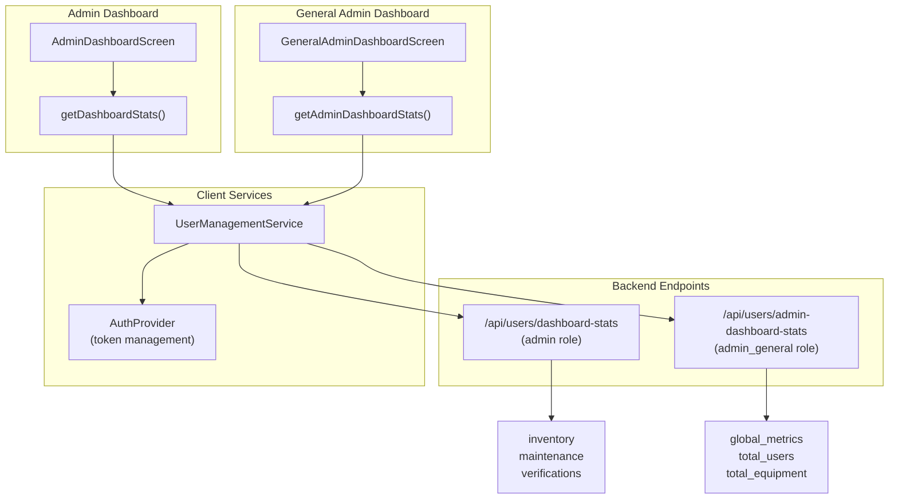

# Admin Dashboards

> **Relevant source files**
> * [client/lib/core/services/navigation_service.dart](https://github.com/axchisan/GestionInventarioSENA/blob/a6b12d01/client/lib/core/services/navigation_service.dart)
> * [client/lib/presentation/screens/dashboard/admin_dashboard_screen.dart](https://github.com/axchisan/GestionInventarioSENA/blob/a6b12d01/client/lib/presentation/screens/dashboard/admin_dashboard_screen.dart)
> * [client/lib/presentation/screens/dashboard/general_admin_dashboard_screen.dart](https://github.com/axchisan/GestionInventarioSENA/blob/a6b12d01/client/lib/presentation/screens/dashboard/general_admin_dashboard_screen.dart)
> * [client/lib/presentation/screens/dashboard/student_dashboard.dart](https://github.com/axchisan/GestionInventarioSENA/blob/a6b12d01/client/lib/presentation/screens/dashboard/student_dashboard.dart)

## Purpose and Scope

This page documents the two administrator dashboard screens that provide privileged users with system-wide oversight and management capabilities. The system distinguishes between two admin roles: **admin** (warehouse administrators focused on inventory and loan management) and **admin_general** (system administrators with full access to all features including user management, audit logs, and system configuration).

For information about dashboards for other roles, see [Student Dashboard](/axchisan/GestionInventarioSENA/4.1-student-dashboard), [Instructor Dashboard](/axchisan/GestionInventarioSENA/4.2-instructor-dashboard), and [Supervisor Dashboard](/axchisan/GestionInventarioSENA/4.3-supervisor-dashboard). For details on role-based access control, see [Role-Based Access Control](/axchisan/GestionInventarioSENA/3.3-role-based-access-control).

---

## Dashboard Overview

The SENA Inventory Management System provides two distinct admin dashboards:

| Role | Dashboard Screen | Route | Primary Focus |
| --- | --- | --- | --- |
| `admin` | `AdminDashboardScreen` | `/admin-dashboard` | Warehouse operations, inventory management, loan processing |
| `admin_general` | `GeneralAdminDashboardScreen` | `/admin-general-dashboard` | System-wide administration, user management, audit compliance, security |

Both dashboards follow a common structure with three main sections:

1. **Welcome card** with role identification
2. **Metrics section** displaying key performance indicators
3. **Action grid** providing quick access to management features

---

## Admin Dashboard (Warehouse Administrator)

### Overview

The `AdminDashboardScreen` serves warehouse administrators who manage the physical inventory stored in the SENA warehouse environment. This dashboard focuses on inventory statistics, loan management, and equipment maintenance tracking.

**Sources:** [client/lib/presentation/screens/dashboard/admin_dashboard_screen.dart L1-L583](https://github.com/axchisan/GestionInventarioSENA/blob/a6b12d01/client/lib/presentation/screens/dashboard/admin_dashboard_screen.dart#L1-L583)

### Component Architecture



```mermaid
flowchart TD

AdminDashboardScreen["AdminDashboardScreen<br>(StatefulWidget)"]
State["_AdminDashboardScreenState"]
UserManagementService["UserManagementService"]
AuthProvider["AuthProvider"]
SenaAppBar["SenaAppBar"]
API["/api/users/dashboard-stats"]
WelcomeCard["Welcome Card<br>Role: Administrador de Almacen"]
MetricsGrid["Metrics Grid<br>6 stat cards"]
ActionGrid["Action Grid<br>10 action cards"]
SystemStatus["System Status Card<br>Recent checks & rates"]
Drawer["Navigation Drawer"]
TotalEquipment["Total Equipos"]
UniqueItems["Items Únicos"]
Available["Disponibles"]
InUse["En Uso"]
Damaged["Dañados"]
Maintenance["Mantenimiento"]
LoanHistory["/loan-history"]
LoanManagement["/loan-management"]
EnvironmentOverview["/environment-overview"]
QRScan["/qr-scan"]
QRGenerate["/qr-generate"]
Statistics["/statistics-dashboard"]
Alerts["/inventory-alerts"]
Reports["/report-generator"]
Feedback["/feedback-form"]
Profile["/profile"]

AdminDashboardScreen --> State
State --> UserManagementService
State --> AuthProvider
State --> SenaAppBar
State --> API
State --> WelcomeCard
State --> MetricsGrid
State --> ActionGrid
State --> SystemStatus
State --> Drawer
MetricsGrid --> TotalEquipment
MetricsGrid --> UniqueItems
MetricsGrid --> Available
MetricsGrid --> InUse
MetricsGrid --> Damaged
MetricsGrid --> Maintenance
ActionGrid --> LoanHistory
ActionGrid --> LoanManagement
ActionGrid --> EnvironmentOverview
ActionGrid --> QRScan
ActionGrid --> QRGenerate
ActionGrid --> Statistics
ActionGrid --> Alerts
ActionGrid --> Reports
ActionGrid --> Feedback
ActionGrid --> Profile
```

**Sources:** [client/lib/presentation/screens/dashboard/admin_dashboard_screen.dart L9-L357](https://github.com/axchisan/GestionInventarioSENA/blob/a6b12d01/client/lib/presentation/screens/dashboard/admin_dashboard_screen.dart#L9-L357)

### Dashboard Statistics

The admin dashboard retrieves statistics via the `UserManagementService.getDashboardStats()` method, which returns a structured map containing:

| Metric Category | Field | Description |
| --- | --- | --- |
| `inventory` | `total_items` | Count of unique inventory items |
| `inventory` | `total_quantity` | Total quantity across all items |
| `inventory` | `available_items` | Items with status 'available' |
| `inventory` | `in_use_items` | Items currently on loan |
| `inventory` | `damaged_quantity` | Count of damaged items |
| `inventory` | `missing_quantity` | Count of missing items |
| `maintenance` | `total_active` | Active maintenance requests |
| `maintenance` | `pending_requests` | Pending maintenance requests |
| `verifications` | `recent_checks` | Inventory checks in last 30 days |
| `verifications` | `completion_rate` | Percentage of completed verifications |

The statistics are loaded on initialization and can be refreshed via pull-to-refresh:

**Sources:** [client/lib/presentation/screens/dashboard/admin_dashboard_screen.dart L17-L49](https://github.com/axchisan/GestionInventarioSENA/blob/a6b12d01/client/lib/presentation/screens/dashboard/admin_dashboard_screen.dart#L17-L49)

 [client/lib/presentation/screens/dashboard/admin_dashboard_screen.dart L129-L197](https://github.com/axchisan/GestionInventarioSENA/blob/a6b12d01/client/lib/presentation/screens/dashboard/admin_dashboard_screen.dart#L129-L197)

### Data Flow



**Sources:** [client/lib/presentation/screens/dashboard/admin_dashboard_screen.dart L22-L49](https://github.com/axchisan/GestionInventarioSENA/blob/a6b12d01/client/lib/presentation/screens/dashboard/admin_dashboard_screen.dart#L22-L49)

### System Status Indicators

The dashboard displays real-time system health metrics in a dedicated card:

* **Verificaciones Recientes**: Count of inventory checks in last 30 days
* **Tasa de Completitud**: Completion rate percentage (color-coded: green ≥80%, orange <80%)
* **Items Faltantes**: Missing items count (red if >0, green otherwise)
* **Mantenimiento Pendiente**: Pending maintenance requests (orange if >5, green otherwise)

**Sources:** [client/lib/presentation/screens/dashboard/admin_dashboard_screen.dart L298-L350](https://github.com/axchisan/GestionInventarioSENA/blob/a6b12d01/client/lib/presentation/screens/dashboard/admin_dashboard_screen.dart#L298-L350)

 [client/lib/presentation/screens/dashboard/admin_dashboard_screen.dart L431-L466](https://github.com/axchisan/GestionInventarioSENA/blob/a6b12d01/client/lib/presentation/screens/dashboard/admin_dashboard_screen.dart#L431-L466)

### Available Actions

The admin dashboard provides access to 10 management features arranged in a 2-column grid:

| Action | Route | Icon | Purpose |
| --- | --- | --- | --- |
| Historial de Préstamos | `/loan-history` | `Icons.history` | View all past loans |
| Gestión de Préstamos | `/loan-management` | `Icons.assignment_turned_in` | Manage active loans |
| Gestión de Almacen | `/environment-overview` | `Icons.home_work` | Manage warehouse inventory |
| Escáner QR | `/qr-scan` | `Icons.qr_code_scanner` | Scan item/environment QR codes |
| Generador QR | `/qr-generate` | `Icons.qr_code` | Generate QR codes |
| Estadísticas Avanzadas | `/statistics-dashboard` | `Icons.analytics` | View detailed analytics |
| Alertas del Sistema | `/inventory-alerts` | `Icons.warning` | Monitor critical alerts |
| Generador de Reportes | `/report-generator` | `Icons.description` | Create PDF/Excel reports |
| Feedback del Sistema | `/feedback-form` | `Icons.feedback` | Submit feedback |
| Configuración | `/profile` | `Icons.settings` | User profile and settings |

**Sources:** [client/lib/presentation/screens/dashboard/admin_dashboard_screen.dart L206-L295](https://github.com/axchisan/GestionInventarioSENA/blob/a6b12d01/client/lib/presentation/screens/dashboard/admin_dashboard_screen.dart#L206-L295)

---

## General Admin Dashboard (System Administrator)

### Overview

The `GeneralAdminDashboardScreen` serves system administrators with the highest privilege level (`admin_general`). This dashboard provides comprehensive system oversight including user management, security audit logs, and global configuration capabilities.

**Sources:** [client/lib/presentation/screens/dashboard/general_admin_dashboard_screen.dart L1-L515](https://github.com/axchisan/GestionInventarioSENA/blob/a6b12d01/client/lib/presentation/screens/dashboard/general_admin_dashboard_screen.dart#L1-L515)

### Component Architecture



```mermaid
flowchart TD

GeneralAdminDashboardScreen["GeneralAdminDashboardScreen<br>(StatefulWidget)"]
State["_GeneralAdminDashboardScreenState"]
UserManagementService["UserManagementService"]
AuthProvider["AuthProvider"]
SenaAppBar["SenaAppBar"]
API["/api/users/admin-dashboard-stats"]
WelcomeCard["Welcome Card<br>Role: Administrador General"]
GlobalMetrics["Global Metrics<br>6 metric cards"]
QuickActions["Quick Actions<br>9 action cards"]
RecentActivity["Recent Activity<br>System events"]
Drawer["Navigation Drawer"]
TotalUsers["Usuarios Totales"]
TotalEquipment["Equipos Totales"]
Environments["Ambientes"]
ActiveLoans["Préstamos Activos"]
ActiveUsers["Usuarios Activos"]
PendingMaint["Mantenimiento Pendiente"]
UserManagement["/user-management"]
LoanRequests["/loan-history"]
EnvironmentsView["/environment-overview"]
Statistics["/statistics-dashboard"]
Alerts["/inventory-alerts"]
Audit["/audit-log"]
Reports["/report-generator"]
Feedback["/feedback-form"]
Settings["/profile"]
BackupComplete["Backup completado"]
StorageAlert["Alerta de almacenamiento"]
PolicyUpdate["Política actualizada"]
WebhookActive["Webhook activado"]

GeneralAdminDashboardScreen --> State
State --> UserManagementService
State --> AuthProvider
State --> SenaAppBar
State --> API
State --> WelcomeCard
State --> GlobalMetrics
State --> QuickActions
State --> RecentActivity
State --> Drawer
GlobalMetrics --> TotalUsers
GlobalMetrics --> TotalEquipment
GlobalMetrics --> Environments
GlobalMetrics --> ActiveLoans
GlobalMetrics --> ActiveUsers
GlobalMetrics --> PendingMaint
QuickActions --> UserManagement
QuickActions --> LoanRequests
QuickActions --> EnvironmentsView
QuickActions --> Statistics
QuickActions --> Alerts
QuickActions --> Audit
QuickActions --> Reports
QuickActions --> Feedback
QuickActions --> Settings
RecentActivity --> BackupComplete
RecentActivity --> StorageAlert
RecentActivity --> PolicyUpdate
RecentActivity --> WebhookActive
```

**Sources:** [client/lib/presentation/screens/dashboard/general_admin_dashboard_screen.dart L9-L305](https://github.com/axchisan/GestionInventarioSENA/blob/a6b12d01/client/lib/presentation/screens/dashboard/general_admin_dashboard_screen.dart#L9-L305)

### Global Metrics

The general admin dashboard displays system-wide statistics retrieved via `UserManagementService.getAdminDashboardStats()`:

| Metric | Field | Visual Indicator |
| --- | --- | --- |
| Usuarios Totales | `global_metrics.total_users` | `Icons.people` (primary) |
| Equipos Totales | `global_metrics.total_equipment` | `Icons.inventory_2` (secondary) |
| Ambientes | `global_metrics.total_environments` | `Icons.house` (accent) |
| Préstamos Activos | `global_metrics.active_loans` | `Icons.assignment` (warning) |
| Usuarios Activos | `global_metrics.active_users` | `Icons.cloud` (info) |
| Mantenimiento Pendiente | `global_metrics.pending_maintenance` | `Icons.error_outline` (error) |

Each metric is displayed as a card with an icon, numeric value, and descriptive label.

**Sources:** [client/lib/presentation/screens/dashboard/general_admin_dashboard_screen.dart L27-L48](https://github.com/axchisan/GestionInventarioSENA/blob/a6b12d01/client/lib/presentation/screens/dashboard/general_admin_dashboard_screen.dart#L27-L48)

 [client/lib/presentation/screens/dashboard/general_admin_dashboard_screen.dart L122-L165](https://github.com/axchisan/GestionInventarioSENA/blob/a6b12d01/client/lib/presentation/screens/dashboard/general_admin_dashboard_screen.dart#L122-L165)

### System Activity Monitoring

The dashboard includes a "Actividad Reciente" (Recent Activity) section displaying system events:



Each activity item displays:

* Icon with color coding based on severity
* Activity title and description
* Relative timestamp
* Visual status indicator

**Sources:** [client/lib/presentation/screens/dashboard/general_admin_dashboard_screen.dart L257-L297](https://github.com/axchisan/GestionInventarioSENA/blob/a6b12d01/client/lib/presentation/screens/dashboard/general_admin_dashboard_screen.dart#L257-L297)

 [client/lib/presentation/screens/dashboard/general_admin_dashboard_screen.dart L487-L514](https://github.com/axchisan/GestionInventarioSENA/blob/a6b12d01/client/lib/presentation/screens/dashboard/general_admin_dashboard_screen.dart#L487-L514)

### Available Actions

The general admin dashboard provides 9 system-wide management features:

| Action | Route | Icon | Purpose |
| --- | --- | --- | --- |
| Gestión de Usuarios | `/user-management` | `Icons.manage_accounts` | User roles and approvals |
| Solicitudes de Préstamo | `/loan-history` | `Icons.assignment_turned_in` | All loan requests |
| Ambientes | `/environment-overview` | `Icons.home_work` | Global environment view |
| Estadísticas | `/statistics-dashboard` | `Icons.query_stats` | Advanced metrics |
| Alertas | `/inventory-alerts` | `Icons.warning_amber` | Critical system alerts |
| Auditoría | `/audit-log` | `Icons.fact_check` | Detailed audit logs |
| Reportes | `/report-generator` | `Icons.description` | PDF/Excel generation |
| Feedback | `/feedback-form` | `Icons.feedback` | Internal suggestions |
| Configuración | `/profile` | `Icons.settings` | Theme, language, profile |

**Sources:** [client/lib/presentation/screens/dashboard/general_admin_dashboard_screen.dart L168-L254](https://github.com/axchisan/GestionInventarioSENA/blob/a6b12d01/client/lib/presentation/screens/dashboard/general_admin_dashboard_screen.dart#L168-L254)

---

## Dashboard Statistics API Integration

Both admin dashboards rely on the `UserManagementService` to fetch statistics from backend endpoints:



### Error Handling

Both dashboards implement graceful fallback when the API fails to load statistics:

```
// Fallback to default values if API fails
_dashboardStats = {
  'inventory': {'total_items': 0, 'total_quantity': 0, ...},
  'maintenance': {'total_active': 0},
  'verifications': {'recent_checks': 0},
};
```

This ensures the UI remains functional even when the backend is unavailable, displaying zeros for all metrics.

**Sources:** [client/lib/presentation/screens/dashboard/admin_dashboard_screen.dart L34-L48](https://github.com/axchisan/GestionInventarioSENA/blob/a6b12d01/client/lib/presentation/screens/dashboard/admin_dashboard_screen.dart#L34-L48)

 [client/lib/presentation/screens/dashboard/general_admin_dashboard_screen.dart L34-L47](https://github.com/axchisan/GestionInventarioSENA/blob/a6b12d01/client/lib/presentation/screens/dashboard/general_admin_dashboard_screen.dart#L34-L47)

---

## Navigation and Routing

### Route Configuration

Both admin dashboards are registered in the `NavigationService` router:

| Route | Name | Screen |
| --- | --- | --- |
| `/admin-dashboard` | `admin-dashboard` | `AdminDashboardScreen` |
| `/admin-general-dashboard` | `admin-general-dashboard` | `GeneralAdminDashboardScreen` |

**Sources:** [client/lib/core/services/navigation_service.dart L111-L120](https://github.com/axchisan/GestionInventarioSENA/blob/a6b12d01/client/lib/core/services/navigation_service.dart#L111-L120)

### Role-Based Routing

The navigation system automatically redirects users to their appropriate dashboard based on their role:

```
// In NavigationService redirect logic
if (role != null && !RoleNavigationService.hasAccessToRoute(role, currentPath)) {
  return RoleNavigationService.getDefaultRoute(role);
}
```

The `RoleNavigationService.getDefaultRoute(role)` method returns:

* `/admin-dashboard` for users with `admin` role
* `/admin-general-dashboard` for users with `admin_general` role

**Sources:** [client/lib/core/services/navigation_service.dart L42-L56](https://github.com/axchisan/GestionInventarioSENA/blob/a6b12d01/client/lib/core/services/navigation_service.dart#L42-L56)

### Navigation Drawer

Both dashboards include a navigation drawer providing quick access to all available features. The drawer structure mirrors the action grid but in list format with icons and labels.

**Admin Dashboard Drawer:**

* Dashboard
* Historial de Préstamos
* Gestión de Préstamos
* Gestión de Almacen
* Escáner QR / Generador QR
* Estadísticas / Alertas / Reportes / Feedback
* Configuración
* Cerrar Sesión

**General Admin Dashboard Drawer:**

* Dashboard
* Gestión de Usuarios
* Solicitudes de Préstamo
* Ambientes
* Estadísticas / Alertas
* Auditoría / Reportes / Feedback
* Configuración
* Cerrar Sesión

**Sources:** [client/lib/presentation/screens/dashboard/admin_dashboard_screen.dart L468-L582](https://github.com/axchisan/GestionInventarioSENA/blob/a6b12d01/client/lib/presentation/screens/dashboard/admin_dashboard_screen.dart#L468-L582)

 [client/lib/presentation/screens/dashboard/general_admin_dashboard_screen.dart L378-L484](https://github.com/axchisan/GestionInventarioSENA/blob/a6b12d01/client/lib/presentation/screens/dashboard/general_admin_dashboard_screen.dart#L378-L484)

---

## Feature Comparison Matrix

The following table summarizes feature access differences between the two admin roles:

| Feature | Admin (Warehouse) | Admin General (System) |
| --- | --- | --- |
| Inventory Management | ✅ | ✅ |
| Loan Management | ✅ | ✅ |
| QR Scanning/Generation | ✅ | ✅ |
| Statistics Dashboard | ✅ | ✅ |
| Inventory Alerts | ✅ | ✅ |
| Report Generation | ✅ | ✅ |
| Feedback System | ✅ | ✅ |
| **User Management** | ❌ | ✅ |
| **Audit Logs** | ❌ | ✅ |
| **Global Metrics** | ❌ | ✅ |
| **System Activity** | ❌ | ✅ |
| Environment-Specific Stats | ✅ | ❌ |
| Warehouse-Focused Metrics | ✅ | ❌ |

The key distinction is that `admin` focuses on operational warehouse management, while `admin_general` has system-wide oversight and security capabilities.

**Sources:** [client/lib/presentation/screens/dashboard/admin_dashboard_screen.dart L206-L295](https://github.com/axchisan/GestionInventarioSENA/blob/a6b12d01/client/lib/presentation/screens/dashboard/admin_dashboard_screen.dart#L206-L295)

 [client/lib/presentation/screens/dashboard/general_admin_dashboard_screen.dart L168-L254](https://github.com/axchisan/GestionInventarioSENA/blob/a6b12d01/client/lib/presentation/screens/dashboard/general_admin_dashboard_screen.dart#L168-L254)

---

## Common UI Patterns

Both admin dashboards share common design patterns:

### Welcome Card

* SENA logo with circular background
* Role-specific title
* Brief description of responsibilities
* Consistent 20px padding

### Stat Cards

* Icon with role-specific color
* Large numeric value (24px font)
* Descriptive label (12px font)
* Responsive grid layout

### Action Cards

* Large icon (34-40px)
* Bold title (13-14px)
* Subtitle description (10px)
* InkWell touch feedback
* Rounded 12px corners

### Refresh Pattern

Both dashboards implement pull-to-refresh via `RefreshIndicator` wrapping the `SingleChildScrollView`, allowing users to manually reload statistics.

**Sources:** [client/lib/presentation/screens/dashboard/admin_dashboard_screen.dart L57-L61](https://github.com/axchisan/GestionInventarioSENA/blob/a6b12d01/client/lib/presentation/screens/dashboard/admin_dashboard_screen.dart#L57-L61)

 [client/lib/presentation/screens/dashboard/general_admin_dashboard_screen.dart L57-L61](https://github.com/axchisan/GestionInventarioSENA/blob/a6b12d01/client/lib/presentation/screens/dashboard/general_admin_dashboard_screen.dart#L57-L61)