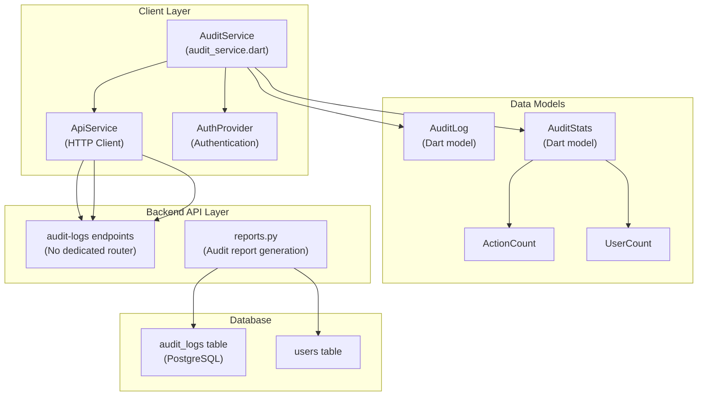
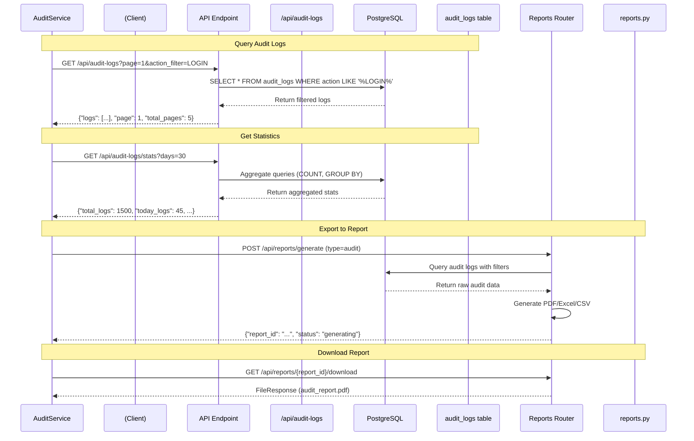

# Audit Service & APIs

> **Relevant source files**
> * [client/lib/core/services/audit_service.dart](https://github.com/axchisan/GestionInventarioSENA/blob/a6b12d01/client/lib/core/services/audit_service.dart)
> * [client/lib/presentation/screens/audit/audit_log_screen.dart](https://github.com/axchisan/GestionInventarioSENA/blob/a6b12d01/client/lib/presentation/screens/audit/audit_log_screen.dart)
> * [server/app/middleware/audit_middleware.py](https://github.com/axchisan/GestionInventarioSENA/blob/a6b12d01/server/app/middleware/audit_middleware.py)
> * [server/app/routers/reports.py](https://github.com/axchisan/GestionInventarioSENA/blob/a6b12d01/server/app/routers/reports.py)

## Purpose and Scope

This document covers the client-side `AuditService` class and backend audit log API endpoints that provide programmatic access to audit log data. The service enables retrieval, filtering, pagination, statistics calculation, and export of audit logs for compliance and analysis purposes.

For information about the automatic audit logging middleware that captures API requests, see [Audit Middleware](/axchisan/GestionInventarioSENA/10.1-audit-middleware). For the user interface for viewing audit logs, see [Audit Log Screen](/axchisan/GestionInventarioSENA/10.2-audit-log-screen).

**Sources**: [client/lib/core/services/audit_service.dart L1-L419](https://github.com/axchisan/GestionInventarioSENA/blob/a6b12d01/client/lib/core/services/audit_service.dart#L1-L419)

 [server/app/routers/reports.py L380-L572](https://github.com/axchisan/GestionInventarioSENA/blob/a6b12d01/server/app/routers/reports.py#L380-L572)

---

## System Architecture

The audit service layer provides methods for querying and analyzing audit log data captured by the audit middleware. The client-side service communicates with backend API endpoints to retrieve filtered, paginated audit records and statistics.

### Audit Service Architecture Diagram



**Sources**: [client/lib/core/services/audit_service.dart L6-L11](https://github.com/axchisan/GestionInventarioSENA/blob/a6b12d01/client/lib/core/services/audit_service.dart#L6-L11)

 [server/app/routers/reports.py L380-L504](https://github.com/axchisan/GestionInventarioSENA/blob/a6b12d01/server/app/routers/reports.py#L380-L504)

---

## Client-Side Audit Service

The `AuditService` class provides methods for interacting with audit log data from the Flutter client application.

### Service Initialization

The service is initialized with an `AuthProvider` to handle authentication for API requests:

```
AuditService({required AuthProvider authProvider}) 
    : _apiService = ApiService(authProvider: authProvider);
```

**Sources**: [client/lib/core/services/audit_service.dart L9-L10](https://github.com/axchisan/GestionInventarioSENA/blob/a6b12d01/client/lib/core/services/audit_service.dart#L9-L10)

### Core API Methods

| Method | Endpoint | Purpose |
| --- | --- | --- |
| `getAuditLogs()` | `GET /api/audit-logs` | Retrieve paginated audit logs with filters |
| `getAuditStats()` | `GET /api/audit-logs/stats` | Get audit statistics for a time period |
| `getUserActivity()` | `GET /api/audit-logs/user/{userId}/activity` | Get specific user's audit activity |
| `getEntityAuditTrail()` | `GET /api/audit-logs/entity/{entityType}/{entityId}/trail` | Get audit trail for a specific entity |
| `getAuditLog()` | `GET /api/audit-logs/{logId}` | Retrieve single audit log by ID |
| `createAuditLog()` | `POST /api/audit-logs` | Manually create an audit log entry |
| `exportAuditLogs()` | `GET /api/audit-logs/export` | Export audit logs in specified format |
| `cleanupOldLogs()` | `DELETE /api/audit-logs/cleanup` | Remove old audit logs (admin only) |

**Sources**: [client/lib/core/services/audit_service.dart L45-L157](https://github.com/axchisan/GestionInventarioSENA/blob/a6b12d01/client/lib/core/services/audit_service.dart#L45-L157)

### Get Audit Logs Method

The primary method for retrieving audit logs supports comprehensive filtering and pagination:

```
Future<Map<String, dynamic>> getAuditLogs({
  int page = 1,
  int perPage = 20,
  String? actionFilter,
  String? userId,
  String? entityType,
  String? startDate,
  String? endDate,
  String? search,
})
```

**Query Parameters**:

* `page`: Page number for pagination (default: 1)
* `per_page`: Number of records per page (default: 20)
* `action_filter`: Filter by specific action type
* `user_id`: Filter by user who performed action
* `entity_type`: Filter by entity type affected
* `start_date`: Filter logs from this date (ISO format)
* `end_date`: Filter logs until this date (ISO format)
* `search`: Full-text search term

**Response Structure**:

```
{
  "logs": [/* array of audit log objects */],
  "page": 1,
  "total_pages": 10,
  "total_logs": 200
}
```

**Sources**: [client/lib/core/services/audit_service.dart L46-L81](https://github.com/axchisan/GestionInventarioSENA/blob/a6b12d01/client/lib/core/services/audit_service.dart#L46-L81)

### Get Audit Statistics Method

Retrieves aggregated statistics about audit logs:

```
Future<Map<String, dynamic>> getAuditStats({int days = 30})
```

Returns an `AuditStats` object containing:

* `totalLogs`: Total number of logs in period
* `todayLogs`: Logs created today
* `warningLogs`, `errorLogs`, `infoLogs`, `successLogs`: Logs by severity
* `topActions`: Most frequent actions with counts
* `topUsers`: Most active users with counts

**Sources**: [client/lib/core/services/audit_service.dart L84-L90](https://github.com/axchisan/GestionInventarioSENA/blob/a6b12d01/client/lib/core/services/audit_service.dart#L84-L90)

 [client/lib/core/services/audit_service.dart L351-L388](https://github.com/axchisan/GestionInventarioSENA/blob/a6b12d01/client/lib/core/services/audit_service.dart#L351-L388)

---

## Data Models

### AuditLog Model

The `AuditLog` class represents a single audit log entry:

| Field | Type | Description |
| --- | --- | --- |
| `id` | String | UUID of the audit log |
| `userId` | String? | UUID of user who performed action |
| `userName` | String? | Full name of user |
| `userEmail` | String? | Email of user |
| `action` | String | Action type (e.g., "CREATE_INVENTORY_ITEM") |
| `entityType` | String | Type of entity affected |
| `entityId` | String? | UUID of affected entity |
| `oldValues` | Map? | Previous values (for updates) |
| `newValues` | Map? | New values including request/response data |
| `ipAddress` | String? | Client IP address |
| `userAgent` | String? | Client user agent string |
| `sessionId` | String? | Session identifier |
| `createdAt` | DateTime | Timestamp of the action |

**Sources**: [client/lib/core/services/audit_service.dart L283-L349](https://github.com/axchisan/GestionInventarioSENA/blob/a6b12d01/client/lib/core/services/audit_service.dart#L283-L349)

### AuditStats Model

Aggregated statistics model:

| Field | Type | Description |
| --- | --- | --- |
| `totalLogs` | int | Total audit logs in period |
| `todayLogs` | int | Logs created today |
| `warningLogs` | int | Warning severity logs |
| `errorLogs` | int | Error severity logs |
| `infoLogs` | int | Info severity logs |
| `successLogs` | int | Success severity logs |
| `topActions` | List<ActionCount> | Most frequent actions |
| `topUsers` | List<UserCount> | Most active users |

**Sources**: [client/lib/core/services/audit_service.dart L351-L388](https://github.com/axchisan/GestionInventarioSENA/blob/a6b12d01/client/lib/core/services/audit_service.dart#L351-L388)

### Supporting Models

**ActionCount**: Represents action frequency

* `action`: String - Action type
* `count`: int - Number of occurrences

**UserCount**: Represents user activity

* `name`: String - User's full name
* `email`: String - User's email
* `count`: int - Number of actions performed

**Sources**: [client/lib/core/services/audit_service.dart L390-L418](https://github.com/axchisan/GestionInventarioSENA/blob/a6b12d01/client/lib/core/services/audit_service.dart#L390-L418)

---

## Action Types and Entity Types

### Available Action Types

The service defines standard action types that correspond to system operations:

| Action Type | Description |
| --- | --- |
| `LOGIN` | User login |
| `LOGOUT` | User logout |
| `REGISTER` | New user registration |
| `CREATE_INVENTORY_ITEM` | Inventory item creation |
| `UPDATE_INVENTORY_ITEM` | Inventory item update |
| `DELETE_INVENTORY_ITEM` | Inventory item deletion |
| `VIEW_INVENTORY_ITEM` | Inventory item viewed |
| `CREATE_LOAN` | Loan request created |
| `UPDATE_LOAN` | Loan status updated |
| `CREATE_MAINTENANCE_REQUEST` | Maintenance request created |
| `UPDATE_MAINTENANCE_REQUEST` | Maintenance request updated |
| `CREATE_USER` | User account created |
| `UPDATE_USER` | User account updated |
| `CREATE_ENVIRONMENT` | Environment created |
| `UPDATE_ENVIRONMENT` | Environment updated |
| `CREATE_INVENTORY_CHECK` | Inventory verification created |
| `UPDATE_INVENTORY_CHECK` | Inventory verification updated |
| `CREATE_NOTIFICATION` | Notification created |

**Sources**: [client/lib/core/services/audit_service.dart L12-L43](https://github.com/axchisan/GestionInventarioSENA/blob/a6b12d01/client/lib/core/services/audit_service.dart#L12-L43)

 [client/lib/core/services/audit_service.dart L161-L190](https://github.com/axchisan/GestionInventarioSENA/blob/a6b12d01/client/lib/core/services/audit_service.dart#L161-L190)

### Available Entity Types

Entity types that can be audited:

* `inventory_item`: Inventory items
* `loan`: Loan requests
* `user`: User accounts
* `maintenance_request`: Maintenance requests
* `environment`: Physical environments
* `inventory_check`: Inventory verifications
* `authentication`: Authentication events

**Sources**: [client/lib/core/services/audit_service.dart L193-L203](https://github.com/axchisan/GestionInventarioSENA/blob/a6b12d01/client/lib/core/services/audit_service.dart#L193-L203)

---

## Helper Utilities

### Action Severity Classification

The `getActionSeverity()` method categorizes actions by severity level:

| Severity | Trigger Keywords | Color |
| --- | --- | --- |
| `warning` | delete, update, modify, change, remove | Orange |
| `error` | error, fail, exception, reject | Red |
| `success` | create, login, approve, complete, success | Green |
| `info` | All other actions | Blue |

**Sources**: [client/lib/core/services/audit_service.dart L206-L222](https://github.com/axchisan/GestionInventarioSENA/blob/a6b12d01/client/lib/core/services/audit_service.dart#L206-L222)

### Display Formatting

**formatActionForDisplay()**: Converts technical action codes to user-friendly Spanish messages using the `_actionMessages` map. Falls back to formatting the action string if no mapping exists.

**formatEntityTypeForDisplay()**: Converts entity type codes to Spanish display names:

* `inventory_item` → "Elemento de Inventario"
* `loan` → "Préstamo"
* `maintenance_request` → "Solicitud de Mantenimiento"

**getLogDescription()**: Generates complete description by combining action, entity type, and entity ID. Prioritizes custom description in `newValues` if available.

**Sources**: [client/lib/core/services/audit_service.dart L224-L275](https://github.com/axchisan/GestionInventarioSENA/blob/a6b12d01/client/lib/core/services/audit_service.dart#L224-L275)

---

## Backend Audit Report Generation

The reports router includes audit log export functionality for generating compliance reports.

### Audit Report Data Retrieval

The `_get_report_data()` function handles audit report generation when `report_type == "audit"`:

```
query = db.query(AuditLog).join(User, AuditLog.user_id == User.id, isouter=True)

if start_date:
    query = query.filter(AuditLog.created_at >= start_date)
if end_date:
    end_datetime = datetime.combine(end_date.date(), datetime.max.time())
    query = query.filter(AuditLog.created_at <= end_datetime)
```

**Sources**: [server/app/routers/reports.py L470-L485](https://github.com/axchisan/GestionInventarioSENA/blob/a6b12d01/server/app/routers/reports.py#L470-L485)

### Audit Report Fields

Generated audit reports include the following fields:

| Field | Source | Description |
| --- | --- | --- |
| Fecha y Hora | `log.created_at` | Timestamp formatted as DD/MM/YYYY HH:MM:SS |
| Usuario | `log.user.first_name + last_name` | User's full name |
| Email | `log.user.email` | User's email address |
| Rol | `log.user.role` | User's role in system |
| Acción | `_get_friendly_action_description(log)` | Friendly action description |
| Entidad | `_get_friendly_entity_name(log.entity_type)` | Friendly entity name |
| ID Entidad | `log.entity_id` | Entity UUID or "N/A" |
| Dirección IP | `log.ip_address` | Client IP address |
| Estado | `_get_action_status(log)` | "Exitoso", "Error", or "Desconocido" |
| Duración | `log.new_values['duration_seconds']` | Request duration in seconds |
| Detalles | `_get_action_details(log)` | HTTP method, path, and status code |

**Sources**: [server/app/routers/reports.py L487-L502](https://github.com/axchisan/GestionInventarioSENA/blob/a6b12d01/server/app/routers/reports.py#L487-L502)

### Report Format Support

Audit logs can be exported in three formats:

1. **PDF**: Generated using ReportLab with styled tables
2. **Excel**: Generated using Pandas with formatted worksheets
3. **CSV**: Plain text CSV format with UTF-8 encoding

The format is specified in the report generation request and processed by the corresponding generator function:

* `_generate_pdf_report()` for PDF
* `_generate_excel_report()` for Excel
* `_generate_csv_report()` for CSV

**Sources**: [server/app/routers/reports.py L262-L379](https://github.com/axchisan/GestionInventarioSENA/blob/a6b12d01/server/app/routers/reports.py#L262-L379)

---

## Audit Data Flow Diagram



**Sources**: [client/lib/core/services/audit_service.dart L45-L157](https://github.com/axchisan/GestionInventarioSENA/blob/a6b12d01/client/lib/core/services/audit_service.dart#L45-L157)

 [server/app/routers/reports.py L470-L572](https://github.com/axchisan/GestionInventarioSENA/blob/a6b12d01/server/app/routers/reports.py#L470-L572)

---

## Filtering and Querying Patterns

### Common Query Patterns

**Filter by Action Type**:

```yaml
await auditService.getAuditLogs(
  actionFilter: 'CREATE_INVENTORY_ITEM',
);
```

**Filter by Date Range**:

```yaml
await auditService.getAuditLogs(
  startDate: '2024-01-01',
  endDate: '2024-01-31',
);
```

**Filter by User and Entity**:

```yaml
await auditService.getAuditLogs(
  userId: 'user-uuid',
  entityType: 'inventory_item',
);
```

**Pagination**:

```
// First page
await auditService.getAuditLogs(page: 1, perPage: 20);

// Next page
await auditService.getAuditLogs(page: 2, perPage: 20);
```

**Sources**: [client/lib/core/services/audit_service.dart L46-L81](https://github.com/axchisan/GestionInventarioSENA/blob/a6b12d01/client/lib/core/services/audit_service.dart#L46-L81)

### Backend Query Construction

The backend (though not shown in provided files) would construct SQL queries like:

```sql
SELECT * FROM audit_logs 
WHERE action = 'CREATE_INVENTORY_ITEM'
  AND created_at >= '2024-01-01'
  AND created_at <= '2024-01-31'
  AND user_id = 'user-uuid'
ORDER BY created_at DESC
LIMIT 20 OFFSET 0;
```

**Sources**: [server/app/routers/reports.py L471-L485](https://github.com/axchisan/GestionInventarioSENA/blob/a6b12d01/server/app/routers/reports.py#L471-L485)

---

## Entity Audit Trail

The `getEntityAuditTrail()` method retrieves all audit logs related to a specific entity, providing a complete history:

```
Future<List<dynamic>> getEntityAuditTrail(
  String entityType, 
  String entityId
)
```

**Use Case**: Track all changes made to a specific inventory item:

```
final trail = await auditService.getEntityAuditTrail(
  'inventory_item',
  'item-uuid-123'
);
```

Returns a chronological list of all audit logs where:

* `entity_type == 'inventory_item'`
* `entity_id == 'item-uuid-123'`

This enables compliance tracking and change history views for specific entities.

**Sources**: [client/lib/core/services/audit_service.dart L102-L104](https://github.com/axchisan/GestionInventarioSENA/blob/a6b12d01/client/lib/core/services/audit_service.dart#L102-L104)

---

## User Activity Tracking

The `getUserActivity()` method retrieves audit logs for a specific user within a time period:

```
Future<Map<String, dynamic>> getUserActivity(
  String userId, 
  {int days = 30}
)
```

**Response includes**:

* Total actions performed
* Actions by type breakdown
* Timeline of activity
* Most accessed entities

**Use Case**: Monitor user behavior for security auditing or activity reports.

**Sources**: [client/lib/core/services/audit_service.dart L93-L99](https://github.com/axchisan/GestionInventarioSENA/blob/a6b12d01/client/lib/core/services/audit_service.dart#L93-L99)

---

## Manual Audit Log Creation

The service supports manual audit log creation for custom events not captured by the middleware:

```
Future<Map<String, dynamic>> createAuditLog({
  required String action,
  required String entityType,
  String? entityId,
  String? userId,
  Map<String, dynamic>? oldValues,
  Map<String, dynamic>? newValues,
  String? sessionId,
})
```

**Use Case**: Log custom business events or client-side actions:

```yaml
await auditService.createAuditLog(
  action: 'EXPORT_INVENTORY',
  entityType: 'inventory_item',
  newValues: {
    'format': 'excel',
    'item_count': 150
  }
);
```

**Sources**: [client/lib/core/services/audit_service.dart L112-L132](https://github.com/axchisan/GestionInventarioSENA/blob/a6b12d01/client/lib/core/services/audit_service.dart#L112-L132)

---

## Audit Log Cleanup

The `cleanupOldLogs()` method removes old audit logs to manage database size (admin only):

```
Future<Map<String, dynamic>> cleanupOldLogs({
  int daysToKeep = 90
})
```

**Access Control**: This endpoint requires admin privileges and should:

* Delete logs older than `daysToKeep` days
* Preserve critical logs (authentication, errors)
* Return count of deleted logs

**Sources**: [client/lib/core/services/audit_service.dart L135-L142](https://github.com/axchisan/GestionInventarioSENA/blob/a6b12d01/client/lib/core/services/audit_service.dart#L135-L142)

---

## Export Functionality

The `exportAuditLogs()` method retrieves audit logs for offline analysis:

```
Future<List<dynamic>> exportAuditLogs({
  required String startDate,
  required String endDate,
  String format = 'json',
})
```

**Supported Formats**:

* `json`: Raw JSON array
* `csv`: Comma-separated values
* `excel`: XLSX spreadsheet

**Integration with Reports System**: This method interfaces with the reports generation system (see [Report Service & APIs](/axchisan/GestionInventarioSENA/9.2-report-service-and-apis)) which handles the actual file generation.

**Sources**: [client/lib/core/services/audit_service.dart L145-L157](https://github.com/axchisan/GestionInventarioSENA/blob/a6b12d01/client/lib/core/services/audit_service.dart#L145-L157)

---

## Integration Points

### With Audit Middleware

The audit logs queried by this service are automatically created by the `AuditMiddleware` (see [Audit Middleware](/axchisan/GestionInventarioSENA/10.1-audit-middleware)) which intercepts all API requests.

**Data Flow**:

1. User performs action → API request
2. `AuditMiddleware` captures request
3. Action processed by router
4. `AuditMiddleware` logs to database
5. `AuditService` queries logged data

**Sources**: [server/app/middleware/audit_middleware.py L61-L91](https://github.com/axchisan/GestionInventarioSENA/blob/a6b12d01/server/app/middleware/audit_middleware.py#L61-L91)

 [server/app/middleware/audit_middleware.py L158-L218](https://github.com/axchisan/GestionInventarioSENA/blob/a6b12d01/server/app/middleware/audit_middleware.py#L158-L218)

### With Reports System

Audit logs integrate with the reports generation system for compliance documentation:

**Report Generation Flow**:

1. User requests audit report via UI
2. `ReportService` calls backend
3. `reports.py` queries audit logs
4. Report generated in PDF/Excel format
5. File stored and download URL returned

**Sources**: [server/app/routers/reports.py L470-L572](https://github.com/axchisan/GestionInventarioSENA/blob/a6b12d01/server/app/routers/reports.py#L470-L572)

### With Authentication

All audit service methods require authentication:

* `AuthProvider` provides JWT token
* Token included in `Authorization` header
* Backend validates token and checks role permissions
* Admin/supervisor roles required for sensitive operations

**Sources**: [client/lib/core/services/audit_service.dart L9-L10](https://github.com/axchisan/GestionInventarioSENA/blob/a6b12d01/client/lib/core/services/audit_service.dart#L9-L10)

---

## Service Lifecycle

The `AuditService` implements proper resource cleanup:

```
void dispose() {
  _apiService.dispose();
}
```

Should be called when the service is no longer needed to release HTTP client resources.

**Sources**: [client/lib/core/services/audit_service.dart L277-L279](https://github.com/axchisan/GestionInventarioSENA/blob/a6b12d01/client/lib/core/services/audit_service.dart#L277-L279)