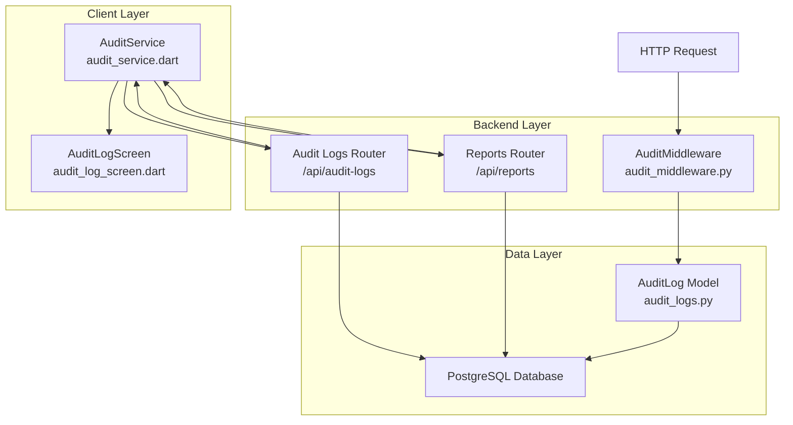
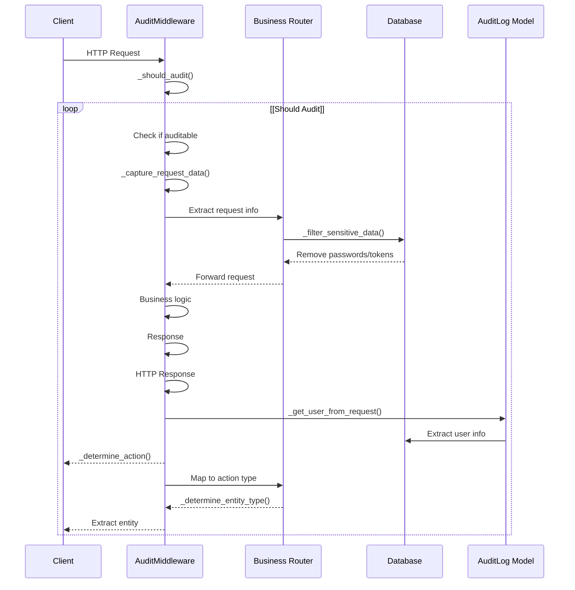
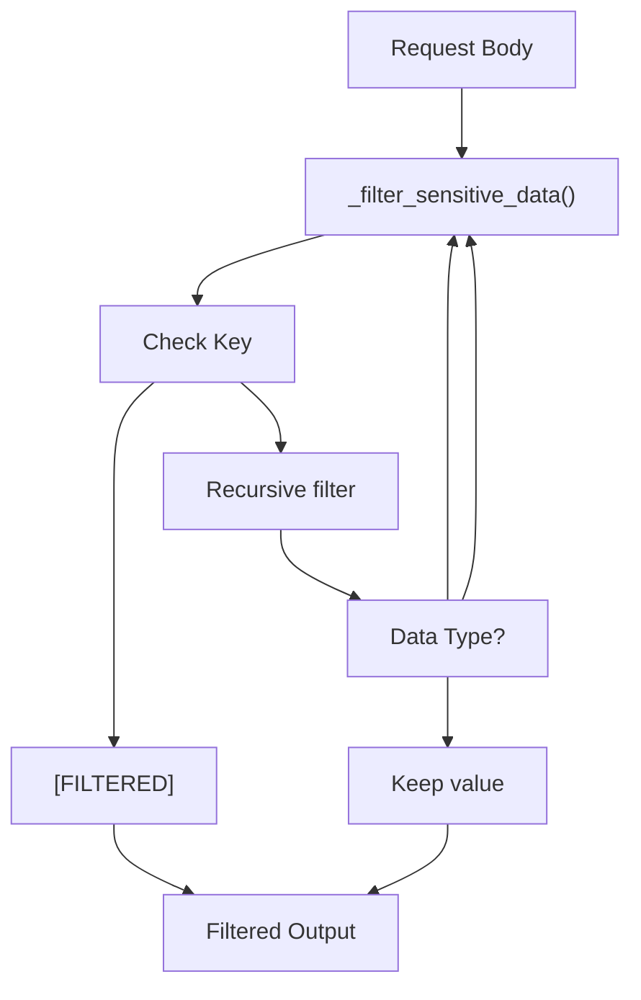
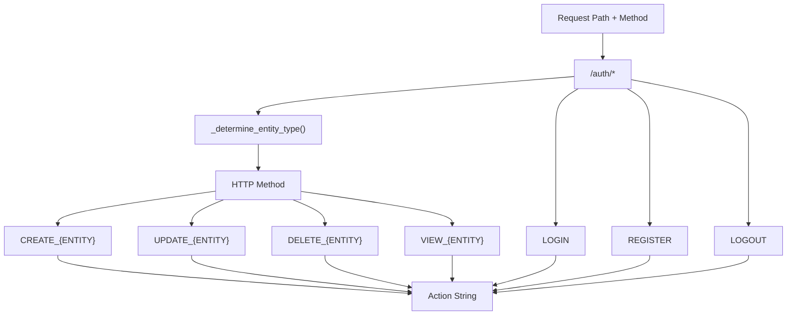
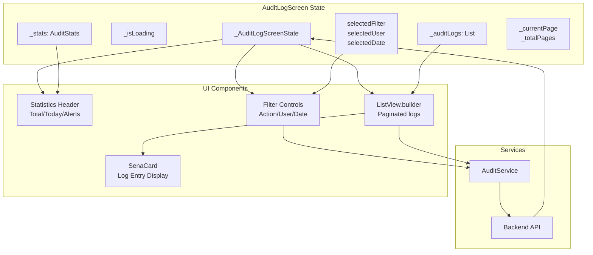
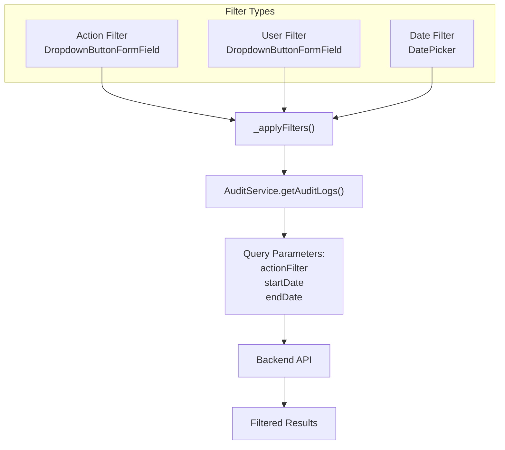
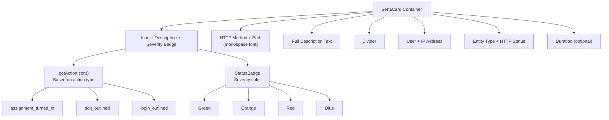
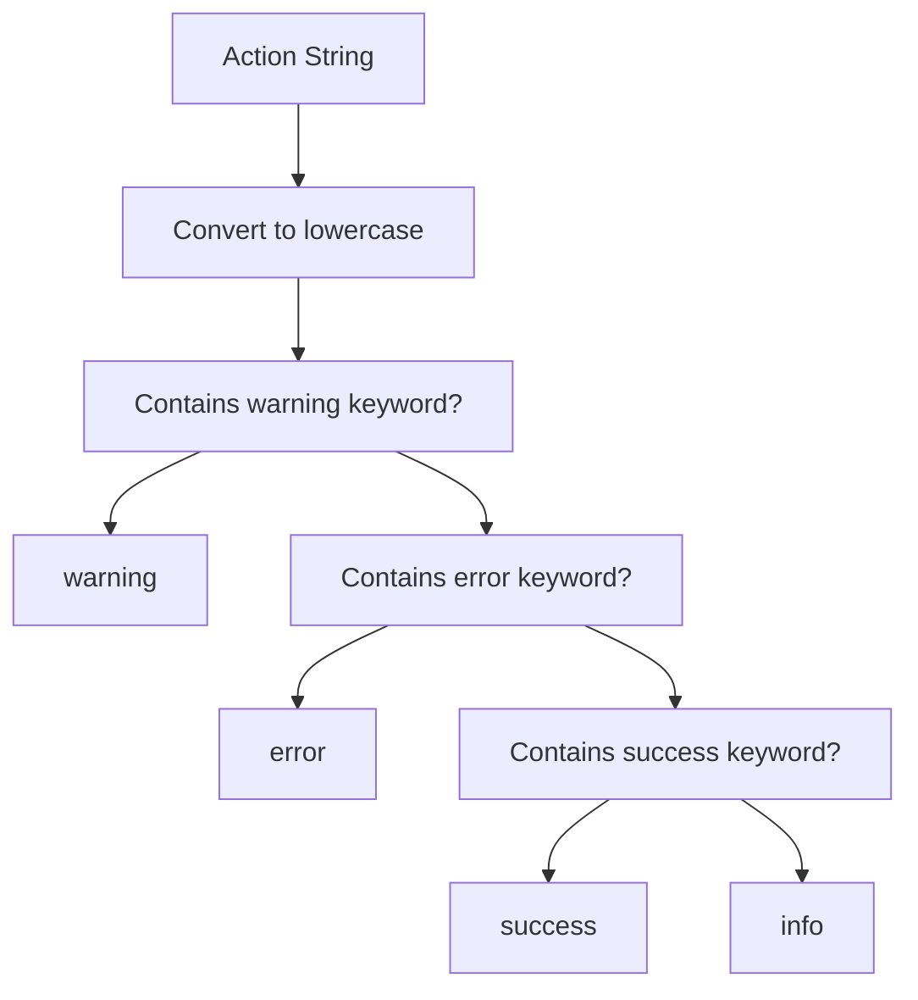
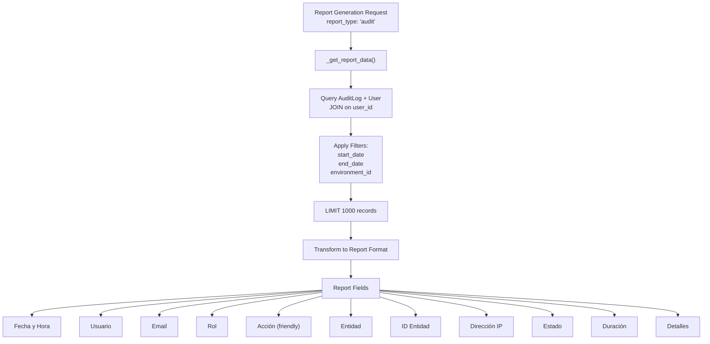
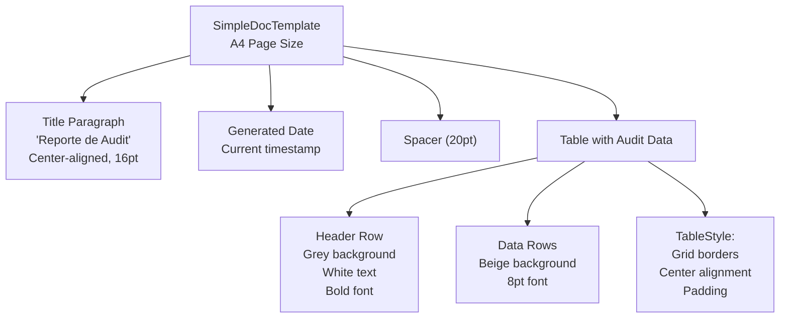

# Auditoría y Cumplimiento

> **Archivos fuente relevantes**
> * [cliente/lib/core/servicios/audit_service.dart](https://github.com/axchisan/GestionInventarioSENA/blob/a6b12d01/client/lib/core/services/audit_service.dart)
> * [cliente/lib/presentación/pantallas/auditoría/audit_log_screen.dart](https://github.com/axchisan/GestionInventarioSENA/blob/a6b12d01/client/lib/presentation/screens/audit/audit_log_screen.dart)
> * [servidor/aplicación/middleware/audit_middleware.py](https://github.com/axchisan/GestionInventarioSENA/blob/a6b12d01/server/app/middleware/audit_middleware.py)
> * [servidor/aplicación/enrutadores/informes.py](https://github.com/axchisan/GestionInventarioSENA/blob/a6b12d01/server/app/routers/reports.py)

Este documento describe el sistema de registro de auditoría y seguimiento del cumplimiento normativo, que proporciona una trazabilidad completa de todas las acciones de los usuarios y las operaciones del sistema. El sistema captura automáticamente las solicitudes de API, almacena registros de auditoría detallados en la base de datos y proporciona interfaces para visualizar, filtrar y exportar datos de auditoría para la elaboración de informes de cumplimiento normativo.

Para obtener información sobre el sistema de informes que genera informes de auditoría, consulte [Informes y análisis](/axchisan/GestionInventarioSENA/9-reporting-and-analytics) . Para obtener información sobre los controles de autenticación y autorización, consulte [Autenticación y autorización](/axchisan/GestionInventarioSENA/3-authentication-and-authorization) .

---

## Descripción general del sistema

El sistema de auditoría consta de cuatro componentes principales: registro automático de solicitudes a través de middleware, almacenamiento persistente en la base de datos, interfaces de visualización y recuperación del lado del cliente y capacidades de generación de informes.

### Arquitectura del sistema de auditoría



**Fuentes** :[audit_middleware.py L1-L323](https://github.com/axchisan/GestionInventarioSENA/blob/a6b12d01/server/app/middleware/audit_middleware.py#L1-L323)

 [audit_service.dart L1-L419](https://github.com/axchisan/GestionInventarioSENA/blob/a6b12d01/client/lib/core/services/audit_service.dart#L1-L419)

 [audit_log_screen.dart L1-L727](https://github.com/axchisan/GestionInventarioSENA/blob/a6b12d01/client/lib/presentation/screens/audit/audit_log_screen.dart#L1-L727)

---

## Registro automático de auditoría

La `AuditMiddleware`clase intercepta todas las solicitudes HTTP al backend y crea automáticamente entradas de registro de auditoría para las operaciones que cumplen los requisitos. Este enfoque basado en middleware garantiza una cobertura completa sin requerir llamadas de registro explícitas en la lógica de negocio.

### Canalización de solicitudes de middleware



**Fuentes** :[audit_middleware.py L61-L91](https://github.com/axchisan/GestionInventarioSENA/blob/a6b12d01/server/app/middleware/audit_middleware.py#L61-L91)

### Tipos de solicitudes auditadas

El middleware captura solicitudes que coinciden con criterios específicos definidos en la `AuditMiddleware`clase:

| Método HTTP | Estado de la auditoría | Razón fundamental |
| --- | --- | --- |
| CORREO | Siempre auditado | Crea nuevos recursos |
| PONER | Siempre auditado | Actualiza los recursos existentes |
| BORRAR | Siempre auditado | Elimina recursos |
| PARCHE | Siempre auditado | Actualizaciones parciales |
| CONSEGUIR | No auditado | Operaciones de solo lectura (rendimiento) |
| OPCIONES | No auditado | Solicitudes previas al vuelo de CORS |

**Puntos finales excluidos** :

* `/api/audit-logs`- Evita el registro de auditoría recursivo
* `/docs`- Acceso a la documentación de la API
* `/openapi.json`- Esquema OpenAPI
* `/api/stats`- Consultas de estadísticas de alta frecuencia
* `/favicon.ico`- Solicitudes de iconos del navegador

**Fuentes** :[audit_middleware.py L22-L32](https://github.com/axchisan/GestionInventarioSENA/blob/a6b12d01/server/app/middleware/audit_middleware.py#L22-L32)

 [audit_middleware.py L93-L112](https://github.com/axchisan/GestionInventarioSENA/blob/a6b12d01/server/app/middleware/audit_middleware.py#L93-L112)

### Sensitive Data Filtering

The middleware implements recursive filtering to prevent sensitive information from being stored in audit logs:



**Sources**: [server/app/middleware/audit_middleware.py L143-L156](https://github.com/axchisan/GestionInventarioSENA/blob/a6b12d01/server/app/middleware/audit_middleware.py#L143-L156)

Filtered fields include:

* `password` / `password_hash`
* `token` / `authorization`
* `secret` / `key`

These fields are replaced with the string `"[FILTERED]"` in the audit log.

---

## Audit Data Model

The `AuditLog` model stores comprehensive information about each audited action.

### AuditLog Schema

| Field | Type | Description |
| --- | --- | --- |
| `id` | UUID | Primary key |
| `user_id` | UUID (FK) | Reference to User performing action (nullable) |
| `action` | String | Action type (e.g., "CREATE_INVENTORY_ITEM") |
| `entity_type` | String | Type of entity affected |
| `entity_id` | String | ID of specific entity (nullable) |
| `old_values` | JSON | Previous state (for updates, nullable) |
| `new_values` | JSON | New state and request metadata |
| `ip_address` | String | Client IP address |
| `user_agent` | String | Browser/client user agent |
| `session_id` | String | Session identifier (nullable) |
| `created_at` | DateTime | Timestamp of action |

**Sources**: [server/app/middleware/audit_middleware.py L187-L206](https://github.com/axchisan/GestionInventarioSENA/blob/a6b12d01/server/app/middleware/audit_middleware.py#L187-L206)

### Action Determination Logic

The `_determine_action()` method maps HTTP endpoints and methods to standardized action names:



**Sources**: [server/app/middleware/audit_middleware.py L260-L279](https://github.com/axchisan/GestionInventarioSENA/blob/a6b12d01/server/app/middleware/audit_middleware.py#L260-L279)

**Entity Type Mapping**:

| URL Pattern | Entity Type |
| --- | --- |
| `/inventory-checks` | `inventory_check` |
| `/inventory` | `inventory_item` |
| `/loans` | `loan` |
| `/users` | `user` |
| `/maintenance-requests` | `maintenance_request` |
| `/environments` | `environment` |
| `/auth` | `authentication` |
| `/notifications` | `notification` |

**Sources**: [server/app/middleware/audit_middleware.py L281-L307](https://github.com/axchisan/GestionInventarioSENA/blob/a6b12d01/server/app/middleware/audit_middleware.py#L281-L307)

### Captured Request Metadata

The `new_values` JSON field stores detailed request and response metadata:

```json
{
  "description": "Friendly action description",
  "request": {
    "method": "POST",
    "path": "/api/inventory",
    "query_params": {},
    "body": { "filtered_request_body": "..." },
    "client_ip": "192.168.1.100",
    "user_agent": "Mozilla/5.0..."
  },
  "response": {
    "status_code": 201,
    "headers": {}
  },
  "duration_seconds": 0.123,
  "timestamp": "2024-01-15T10:30:00Z"
}
```

**Sources**: [server/app/middleware/audit_middleware.py L193-L202](https://github.com/axchisan/GestionInventarioSENA/blob/a6b12d01/server/app/middleware/audit_middleware.py#L193-L202)

 [server/app/middleware/audit_middleware.py L114-L141](https://github.com/axchisan/GestionInventarioSENA/blob/a6b12d01/server/app/middleware/audit_middleware.py#L114-L141)

---

## Audit Log Viewing Interface

The `AuditLogScreen` widget provides supervisors and administrators with a comprehensive interface for reviewing system activity.

### Screen Components and Data Flow



**Sources**: [client/lib/presentation/screens/audit/audit_log_screen.dart L16-L46](https://github.com/axchisan/GestionInventarioSENA/blob/a6b12d01/client/lib/presentation/screens/audit/audit_log_screen.dart#L16-L46)

### Initial Data Loading

The screen loads audit statistics and logs concurrently using `Future.wait()`:

**Sources**: [client/lib/presentation/screens/audit/audit_log_screen.dart L48-L79](https://github.com/axchisan/GestionInventarioSENA/blob/a6b12d01/client/lib/presentation/screens/audit/audit_log_screen.dart#L48-L79)

The `_loadInitialData()` method fetches:

1. `AuditStats` - Last 30 days statistics via `getAuditStats(days: 30)`
2. `AuditLog` list - First page (20 records) via `getAuditLogs(page: 1, perPage: 20)`

### Statistics Display

The header shows three key metrics in colored chips:

| Metric | Description | Color |
| --- | --- | --- |
| Total | Total audit logs in database | Blue |
| Hoy (Today) | Logs created today | Green |
| Alertas (Alerts) | Warning-level logs | Orange |

**Sources**: [client/lib/presentation/screens/audit/audit_log_screen.dart L280-L289](https://github.com/axchisan/GestionInventarioSENA/blob/a6b12d01/client/lib/presentation/screens/audit/audit_log_screen.dart#L280-L289)

 [client/lib/presentation/screens/audit/audit_log_screen.dart L692-L720](https://github.com/axchisan/GestionInventarioSENA/blob/a6b12d01/client/lib/presentation/screens/audit/audit_log_screen.dart#L692-L720)

### Filtering Capabilities



**Sources**: [client/lib/presentation/screens/audit/audit_log_screen.dart L81-L114](https://github.com/axchisan/GestionInventarioSENA/blob/a6b12d01/client/lib/presentation/screens/audit/audit_log_screen.dart#L81-L114)

 [client/lib/presentation/screens/audit/audit_log_screen.dart L294-L407](https://github.com/axchisan/GestionInventarioSENA/blob/a6b12d01/client/lib/presentation/screens/audit/audit_log_screen.dart#L294-L407)

**Available Action Filters**:

* Todas (All)
* LOGIN
* LOGOUT
* INVENTORY_CREATE / UPDATE / DELETE
* LOAN_CREATE / UPDATE
* MAINTENANCE_CREATE

**Sources**: [client/lib/presentation/screens/audit/audit_log_screen.dart L31-L34](https://github.com/axchisan/GestionInventarioSENA/blob/a6b12d01/client/lib/presentation/screens/audit/audit_log_screen.dart#L31-L34)

### Log Entry Display

Each audit log is rendered as a `SenaCard` with detailed information:



**Sources**: [client/lib/presentation/screens/audit/audit_log_screen.dart L461-L682](https://github.com/axchisan/GestionInventarioSENA/blob/a6b12d01/client/lib/presentation/screens/audit/audit_log_screen.dart#L461-L682)

**Icon Mapping** (via `getActionIcon()`):

* `loan_create` → `assignment_turned_in_outlined`
* `maintenance_create` → `build_outlined`
* `inventory_create` → `add_circle_outline`
* `inventory_update` → `edit_outlined`
* `inventory_delete` → `delete_outline`
* `login` → `login_outlined`
* `logout` → `logout_outlined`

**Sources**: [client/lib/presentation/screens/audit/audit_log_screen.dart L170-L197](https://github.com/axchisan/GestionInventarioSENA/blob/a6b12d01/client/lib/presentation/screens/audit/audit_log_screen.dart#L170-L197)

**Severity Color Mapping** (via `getSeverityColor()` and `_getSeverityType()`):

* `info` → Blue
* `warning` → Orange
* `error` → Red
* `success` → Green

**Sources**: [client/lib/presentation/screens/audit/audit_log_screen.dart L155-L168](https://github.com/axchisan/GestionInventarioSENA/blob/a6b12d01/client/lib/presentation/screens/audit/audit_log_screen.dart#L155-L168)

 [client/lib/presentation/screens/audit/audit_log_screen.dart L199-L212](https://github.com/axchisan/GestionInventarioSENA/blob/a6b12d01/client/lib/presentation/screens/audit/audit_log_screen.dart#L199-L212)

### Pagination and Infinite Scroll

The screen implements infinite scrolling with `NotificationListener<ScrollNotification>`:

**Sources**: [client/lib/presentation/screens/audit/audit_log_screen.dart L436-L445](https://github.com/axchisan/GestionInventarioSENA/blob/a6b12d01/client/lib/presentation/screens/audit/audit_log_screen.dart#L436-L445)

When the user scrolls to the bottom, `_loadMoreData()` is triggered:

1. Checks if already loading or at last page
2. Fetches next page with same filters applied
3. Appends new logs to existing list
4. Updates page counter

**Sources**: [client/lib/presentation/screens/audit/audit_log_screen.dart L116-L153](https://github.com/axchisan/GestionInventarioSENA/blob/a6b12d01/client/lib/presentation/screens/audit/audit_log_screen.dart#L116-L153)

---

## Audit Service API

The `AuditService` class in the Flutter client provides methods for retrieving and managing audit data.

### Service Methods Reference

| Method | Parameters | Returns | Description |
| --- | --- | --- | --- |
| `getAuditLogs()` | page, perPage, filters | `Map<String, dynamic>` | Paginated audit logs |
| `getAuditStats()` | days | `Map<String, dynamic>` | Statistics summary |
| `getUserActivity()` | userId, days | `Map<String, dynamic>` | User-specific activity |
| `getEntityAuditTrail()` | entityType, entityId | `List<dynamic>` | Entity change history |
| `getAuditLog()` | logId | `Map<String, dynamic>` | Single log details |
| `createAuditLog()` | action, entityType, ... | `Map<String, dynamic>` | Manual log creation |
| `exportAuditLogs()` | startDate, endDate, format | `List<dynamic>` | Export for reporting |

**Sources**: [client/lib/core/services/audit_service.dart L45-L157](https://github.com/axchisan/GestionInventarioSENA/blob/a6b12d01/client/lib/core/services/audit_service.dart#L45-L157)

### Query Parameter Construction

The `getAuditLogs()` method supports multiple filter parameters:

```
Map<String, String> queryParams = {
  'page': page.toString(),
  'per_page': perPage.toString(),
};

if (actionFilter != null && actionFilter.isNotEmpty) {
  queryParams['action_filter'] = actionFilter;
}
if (userId != null && userId.isNotEmpty) {
  queryParams['user_id'] = userId;
}
// ... additional filters
```

**Sources**: [client/lib/core/services/audit_service.dart L56-L79](https://github.com/axchisan/GestionInventarioSENA/blob/a6b12d01/client/lib/core/services/audit_service.dart#L56-L79)

### Action Message Localization

The service maintains a mapping of technical action names to user-friendly Spanish descriptions:

| Technical Action | Spanish Description |
| --- | --- |
| `LOGIN` | Inicio de sesión |
| `CREATE_INVENTORY_ITEM` | Se creó un item en el inventario |
| `UPDATE_INVENTORY_ITEM` | Se actualizó un item del inventario |
| `DELETE_INVENTORY_ITEM` | Se eliminó un item del inventario |
| `CREATE_LOAN` | Se creó un préstamo |
| `CREATE_MAINTENANCE_REQUEST` | Se creó una solicitud de mantenimiento |
| `CREATE_INVENTORY_CHECK` | Se realizó una verificación de inventario |

**Sources**: [client/lib/core/services/audit_service.dart L12-L43](https://github.com/axchisan/GestionInventarioSENA/blob/a6b12d01/client/lib/core/services/audit_service.dart#L12-L43)

### Severity Classification

The `getActionSeverity()` method categorizes actions by severity level:



**Sources**: [client/lib/core/services/audit_service.dart L206-L222](https://github.com/axchisan/GestionInventarioSENA/blob/a6b12d01/client/lib/core/services/audit_service.dart#L206-L222)

---

## Audit Reporting

The reports router includes specialized functionality for generating audit compliance reports in PDF, Excel, and CSV formats.

### Audit Report Data Structure



**Sources**: [server/app/routers/reports.py L470-L502](https://github.com/axchisan/GestionInventarioSENA/blob/a6b12d01/server/app/routers/reports.py#L470-L502)

### Report Field Transformations

The report generation applies several transformations to make audit data more readable:

**Action Description** (via `_get_friendly_action_description()`):

* Extracts `description` from `new_values` if available
* Otherwise maps technical action to Spanish equivalent
* Falls back to raw action string

**Sources**: [server/app/routers/reports.py L506-L523](https://github.com/axchisan/GestionInventarioSENA/blob/a6b12d01/server/app/routers/reports.py#L506-L523)

**Entity Type** (via `_get_friendly_entity_name()`):

* `inventory_item` → "Item de Inventario"
* `loan` → "Préstamo"
* `maintenance_request` → "Solicitud de Mantenimiento"
* `user` → "Usuario"
* `environment` → "Ambiente"
* `inventory_check` → "Verificación de Inventario"

**Sources**: [server/app/routers/reports.py L525-L537](https://github.com/axchisan/GestionInventarioSENA/blob/a6b12d01/server/app/routers/reports.py#L525-L537)

**Status** (via `_get_action_status()`):

* HTTP 200-399 → "Exitoso"
* HTTP 400+ → "Error"
* No status code → "Desconocido"

**Sources**: [server/app/routers/reports.py L539-L547](https://github.com/axchisan/GestionInventarioSENA/blob/a6b12d01/server/app/routers/reports.py#L539-L547)

**Details** (via `_get_action_details()`):

* Extracts HTTP method and path from request metadata
* Includes HTTP status code if available
* Formats as: `"POST /api/inventory | HTTP 201"`

**Sources**: [server/app/routers/reports.py L549-L571](https://github.com/axchisan/GestionInventarioSENA/blob/a6b12d01/server/app/routers/reports.py#L549-L571)

### PDF Report Layout

The PDF generation uses ReportLab to create formatted audit reports:



**Sources**: [server/app/routers/reports.py L316-L378](https://github.com/axchisan/GestionInventarioSENA/blob/a6b12d01/server/app/routers/reports.py#L316-L378)

---

## Security and Compliance Features

### Access Control

Audit log access is restricted by role:

| Role | View Logs | Export Reports | Cleanup Old Logs |
| --- | --- | --- | --- |
| student | ❌ | ❌ | ❌ |
| instructor | ❌ | ❌ | ❌ |
| supervisor | ✅ | ✅ | ❌ |
| admin | ✅ | ✅ | ❌ |
| admin_general | ✅ | ✅ | ✅ |

The `AuditLogScreen` is only accessible to users with supervisor role or higher via the navigation service role-based routing.

**Sources**: Based on the role hierarchy described in [Diagram 2: Role-Based Access Control]

### Sensitive Data Protection

The audit system implements multiple layers of protection for sensitive information:

1. **Field-Level Filtering**: Password, token, and key fields are replaced with `"[FILTERED]"`
2. **Recursive Filtering**: Nested objects and arrays are recursively scanned
3. **Pre-Storage Filtering**: Sensitive data is filtered before writing to database
4. **No Retrieval**: Filtered data cannot be recovered even by administrators

**Sources**: [server/app/middleware/audit_middleware.py L143-L156](https://github.com/axchisan/GestionInventarioSENA/blob/a6b12d01/server/app/middleware/audit_middleware.py#L143-L156)

### User Attribution

The middleware extracts user information from JWT tokens in the Authorization header:

1. Extracts Bearer token from `Authorization` header
2. Decodes token using `decode_token()` function
3. Verifies user exists in database
4. Stores user_id, email, and full name in audit log
5. Falls back to "Sistema" for unauthenticated requests

**Sources**: [server/app/middleware/audit_middleware.py L220-L241](https://github.com/axchisan/GestionInventarioSENA/blob/a6b12d01/server/app/middleware/audit_middleware.py#L220-L241)

### IP Address and User Agent Tracking

Each audit log captures:

* **IP Address**: `request.client.host` (e.g., "192.168.1.100")
* **User Agent**: Full browser/client identification string
* **Session ID**: Optional session identifier from `x-session-id` header

These fields enable:

* Identifying suspicious access patterns
* Tracking actions to specific devices
* Correlating related actions within a session
* Geographic analysis (with external IP geolocation)

**Sources**: [server/app/middleware/audit_middleware.py L203-L205](https://github.com/axchisan/GestionInventarioSENA/blob/a6b12d01/server/app/middleware/audit_middleware.py#L203-L205)

### Duration Tracking

The middleware measures request processing time:

```markdown
start_time = time.time()
# ... execute request ...
duration = time.time() - start_time
```

Duration is stored in `new_values.duration_seconds` with 3 decimal precision (millisecond accuracy). This enables:

* Performance monitoring
* Anomaly detection (unusually long requests)
* SLA compliance tracking

**Sources**: [server/app/middleware/audit_middleware.py L68-L86](https://github.com/axchisan/GestionInventarioSENA/blob/a6b12d01/server/app/middleware/audit_middleware.py#L68-L86)

---

## Data Models

### AuditLog Model (Client)

The Flutter client defines the `AuditLog` class for type-safe audit log handling:

```python
class AuditLog {
  final String id;
  final String? userId;
  final String? userName;
  final String? userEmail;
  final String action;
  final String entityType;
  final String? entityId;
  final Map<String, dynamic>? oldValues;
  final Map<String, dynamic>? newValues;
  final String? ipAddress;
  final String? userAgent;
  final String? sessionId;
  final DateTime createdAt;
}
```

**Sources**: [client/lib/core/services/audit_service.dart L283-L349](https://github.com/axchisan/GestionInventarioSENA/blob/a6b12d01/client/lib/core/services/audit_service.dart#L283-L349)

**Factory Constructor**: `AuditLog.fromJson()` deserializes API responses
**Serializer**: `toJson()` converts to JSON for requests

### AuditStats Model

The `AuditStats` class aggregates audit metrics:

```python
class AuditStats {
  final int totalLogs;
  final int todayLogs;
  final int warningLogs;
  final int errorLogs;
  final int infoLogs;
  final int successLogs;
  final List<ActionCount> topActions;
  final List<UserCount> topUsers;
}
```

**Sources**: [client/lib/core/services/audit_service.dart L351-L388](https://github.com/axchisan/GestionInventarioSENA/blob/a6b12d01/client/lib/core/services/audit_service.dart#L351-L388)

**Supporting Models**:

* `ActionCount` - Action type with count
* `UserCount` - User with activity count

These support dashboard visualizations and trending analysis.

---

## API Endpoints

### Backend Audit Endpoints

Although the `AuditMiddleware` operates transparently, the system provides explicit endpoints for querying audit logs. These endpoints are referenced in the client service but not shown in the provided router files.

Based on the `AuditService` client implementation, the expected endpoints are:

| Endpoint | Method | Purpose |
| --- | --- | --- |
| `/api/audit-logs` | GET | List audit logs with pagination |
| `/api/audit-logs/stats` | GET | Get aggregated statistics |
| `/api/audit-logs/user/{user_id}/activity` | GET | User-specific activity |
| `/api/audit-logs/entity/{entity_type}/{entity_id}/trail` | GET | Entity audit trail |
| `/api/audit-logs/{log_id}` | GET | Get single audit log |
| `/api/audit-logs` | POST | Create manual audit log |
| `/api/audit-logs/cleanup` | DELETE | Cleanup old logs |
| `/api/audit-logs/export` | GET | Export logs for reporting |

**Sources**: [client/lib/core/services/audit_service.dart L45-L157](https://github.com/axchisan/GestionInventarioSENA/blob/a6b12d01/client/lib/core/services/audit_service.dart#L45-L157)

### Query Parameters

The audit logs endpoint supports extensive filtering:

| Parameter | Type | Description |
| --- | --- | --- |
| `page` | int | Page number (1-indexed) |
| `per_page` | int | Records per page (default: 20) |
| `action_filter` | string | Filter by action type |
| `user_id` | UUID | Filter by user |
| `entity_type` | string | Filter by entity type |
| `start_date` | ISO date | Start of date range |
| `end_date` | ISO date | End of date range |
| `search` | string | Search in descriptions |

**Sources**: [client/lib/core/services/audit_service.dart L46-L80](https://github.com/axchisan/GestionInventarioSENA/blob/a6b12d01/client/lib/core/services/audit_service.dart#L46-L80)

---

## Compliance Use Cases

### Regulatory Compliance

The audit system supports compliance with various regulations:

**GDPR (General Data Protection Regulation)**:

* Tracks all access to personal data
* Records data modifications and deletions
* Provides audit trail for data subject access requests
* Logs user consent and preference changes

**SOC 2 (Service Organization Control 2)**:

* Demonstrates security controls implementation
* Provides evidence of access monitoring
* Shows segregation of duties enforcement
* Tracks configuration changes

**ISO 27001 (Information Security Management)**:

* Maintains comprehensive activity logs
* Supports incident investigation
* Provides evidence for security audits
* Documents change management processes

### Incident Investigation

When investigating security incidents or data anomalies:

1. **Identify Time Window**: Use date filters to narrow search
2. **Filter by Entity**: Focus on affected resources
3. **User Attribution**: Identify responsible users
4. **Action Sequence**: Review chronological action sequence
5. **Response Codes**: Identify successful vs failed actions
6. **IP Analysis**: Detect unauthorized access sources

**Example Investigation Flow**:

```sql
1. Search for entity: inventory_item/{specific_id}
2. Filter date: Last 7 days
3. Review all UPDATE and DELETE actions
4. Check user IDs and IP addresses
5. Correlate with session IDs for related actions
6. Export report for documentation
```

### Change Tracking

The audit system provides complete change history:

* **Before/After Values**: `old_values` and `new_values` fields (when applicable)
* **Modification Timeline**: Ordered by `created_at` timestamp
* **User Attribution**: Every change linked to responsible user
* **Context**: Request parameters and environment captured

This enables:

* Rollback assistance
* Change impact analysis
* Compliance reporting
* Quality assurance reviews

---

## Performance Considerations

### Middleware Overhead

The audit middleware adds minimal latency to requests:

| Operation | Typical Duration |
| --- | --- |
| Request capture | < 1ms |
| Sensitive data filtering | < 5ms |
| Database write | 10-50ms (async) |
| Total overhead | 10-60ms |

The database write is performed asynchronously, so response time is not significantly impacted.

**Sources**: [server/app/middleware/audit_middleware.py L61-L91](https://github.com/axchisan/GestionInventarioSENA/blob/a6b12d01/server/app/middleware/audit_middleware.py#L61-L91)

### Database Growth

Audit logs accumulate over time. Based on typical usage:

| User Count | Daily Requests | Daily Logs | Monthly Storage |
| --- | --- | --- | --- |
| 50 users | ~500/day | ~500 records | ~15,000 records |
| 200 users | ~2000/day | ~2000 records | ~60,000 records |
| 500 users | ~5000/day | ~5000 records | ~150,000 records |

**Storage Estimates**:

* Average log size: ~1-2 KB (with request/response metadata)
* 1000 logs ≈ 1-2 MB
* 100,000 logs ≈ 100-200 MB

### Optimization Strategies

1. **Pagination**: Default 20 records per page prevents large result sets
2. **Indexing**: Database indexes on `created_at`, `user_id`, `entity_type`, `action`
3. **Excluded Endpoints**: High-frequency read operations not audited
4. **Report Limits**: Audit reports limited to 1000 most recent records
5. **Archive Policy**: Old logs can be archived/deleted via cleanup endpoint

**Sources**: [client/lib/presentation/screens/audit/audit_log_screen.dart L29](https://github.com/axchisan/GestionInventarioSENA/blob/a6b12d01/client/lib/presentation/screens/audit/audit_log_screen.dart#L29-L29)

 [server/app/routers/reports.py L485](https://github.com/axchisan/GestionInventarioSENA/blob/a6b12d01/server/app/routers/reports.py#L485-L485)

---

## Best Practices

### For Developers

1. **Rely on Middleware**: Do not add manual audit logging in business logic
2. **Test Exclusions**: Verify endpoints added to `EXCLUDE_ENDPOINTS` are truly safe
3. **Sensitive Fields**: Add new sensitive field names to `_filter_sensitive_data()`
4. **Mensajes de acción** : Actualizar `ACTION_MESSAGES`el diccionario al agregar nuevos tipos de entidad
5. **Manejo de errores** : Las fallas de auditoría no deben interrumpir las operaciones comerciales

### Para administradores

1. **Revisión periódica** : Verifique los registros de auditoría semanalmente para detectar anomalías.
2. **Capacitación de usuarios** : informe a los usuarios de que todas las acciones quedan registradas.
3. **Política de retención** : definir e implementar la política de retención de registros
4. **Programación de exportaciones** : Generar informes mensuales de cumplimiento
5. **Control de acceso** : restringir el acceso al registro de auditoría a supervisores y superiores

### Para los responsables de cumplimiento

1. **Procedimientos del documento** : Mantener procedimientos de revisión del registro de auditoría
2. **Definir alertas** : configure alertas para acciones críticas (operaciones DELETE, etc.)
3. **Estrategia de archivo** : Plan para el archivo de registros de auditoría a largo plazo
4. **Respuesta a incidentes** : Incluir la revisión del registro de auditoría en el plan de respuesta a incidentes
5. **Revisión anual** : auditar anualmente el sistema de auditoría para comprobar su eficacia

---

## Resumen

El sistema de auditoría y cumplimiento proporciona un seguimiento automático e integral de todas las operaciones del sistema a través de:

* **Captura basada en middleware** de todas las solicitudes de API (POST, PUT, DELETE, PATCH)
* **Filtrado de datos sensibles** para proteger contraseñas y tokens
* **Almacenamiento de metadatos enriquecido** que incluye usuario, IP, duración y detalles de solicitud/respuesta
* **Interfaces fáciles de usar** para visualización de registros con filtrado y paginación
* **Informes de cumplimiento** con exportación a PDF/Excel en varios idiomas
* **Optimización del rendimiento** mediante puntos finales excluidos y procesamiento asincrónico
* **Controles de seguridad** con acceso basado en roles y protección de datos

Este sistema permite a las organizaciones cumplir con los requisitos reglamentarios, investigar incidentes, realizar un seguimiento de los cambios y mantener registros de auditoría completos para todas las operaciones de gestión de inventario.

**Fuentes** :[audit_middleware.py L1-L323](https://github.com/axchisan/GestionInventarioSENA/blob/a6b12d01/server/app/middleware/audit_middleware.py#L1-L323)

 [audit_log_screen.dart L1-L727](https://github.com/axchisan/GestionInventarioSENA/blob/a6b12d01/client/lib/presentation/screens/audit/audit_log_screen.dart#L1-L727)

 [audit_service.dart L1-L419](https://github.com/axchisan/GestionInventarioSENA/blob/a6b12d01/client/lib/core/services/audit_service.dart#L1-L419)

 [reports.py L1-L572](https://github.com/axchisan/GestionInventarioSENA/blob/a6b12d01/server/app/routers/reports.py#L1-L572)