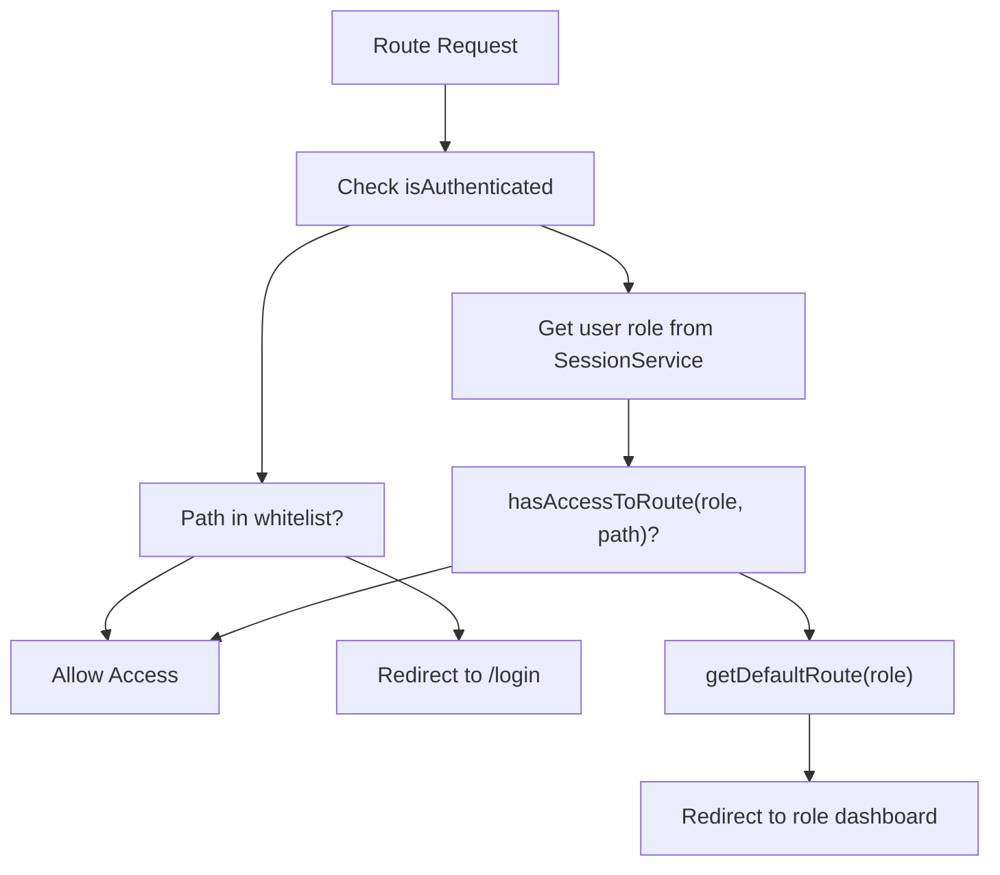
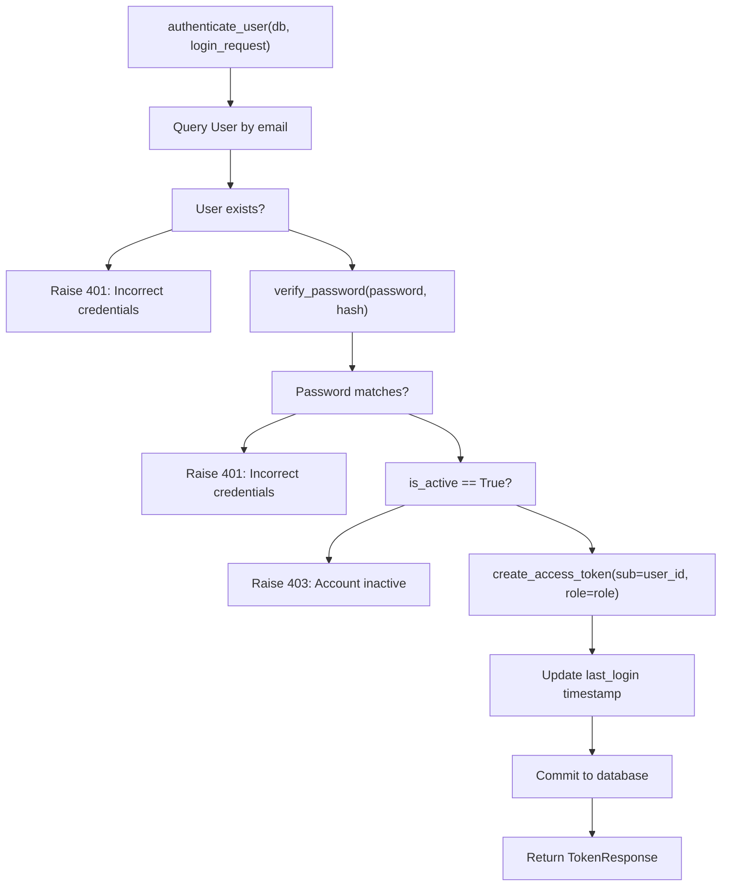
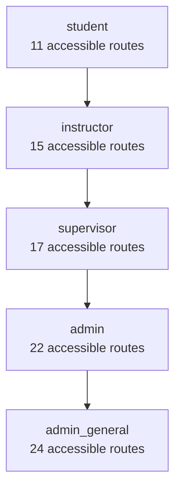
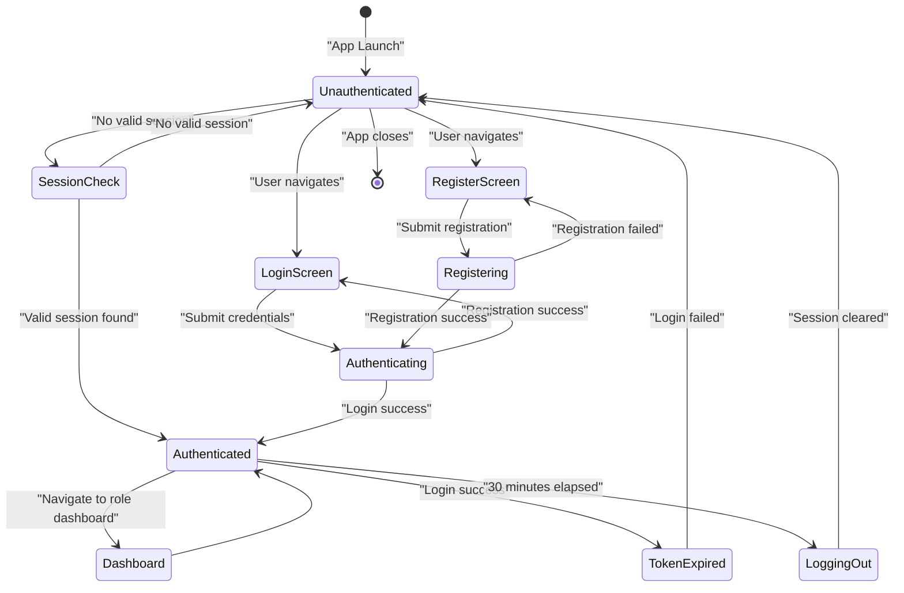

# Autenticación y autorización

> **Archivos fuente relevantes**
> * [cliente/lib/core/servicios/servicio_de_navegación.dart](https://github.com/axchisan/GestionInventarioSENA/blob/a6b12d01/client/lib/core/services/navigation_service.dart)
> * [cliente/lib/core/servicios/servicio_de_perfil.dart](https://github.com/axchisan/GestionInventarioSENA/blob/a6b12d01/client/lib/core/services/profile_service.dart)
> * [cliente/lib/datos/modelos/user_model.dart](https://github.com/axchisan/GestionInventarioSENA/blob/a6b12d01/client/lib/data/models/user_model.dart)
> * [cliente/lib/datos/modelos/user_model.g.dart](https://github.com/axchisan/GestionInventarioSENA/blob/a6b12d01/client/lib/data/models/user_model.g.dart)
> * [cliente/lib/main.dart](https://github.com/axchisan/GestionInventarioSENA/blob/a6b12d01/client/lib/main.dart)
> * [cliente/lib/presentación/proveedores/auth_provider.dart](https://github.com/axchisan/GestionInventarioSENA/blob/a6b12d01/client/lib/presentation/providers/auth_provider.dart)
> * [cliente/lib/presentación/pantallas/auth/registrar_pantalla.dart](https://github.com/axchisan/GestionInventarioSENA/blob/a6b12d01/client/lib/presentation/screens/auth/register_screen.dart)
> * [cliente/lib/presentación/pantallas/tablero/tablero_estudiante.dart](https://github.com/axchisan/GestionInventarioSENA/blob/a6b12d01/client/lib/presentation/screens/dashboard/student_dashboard.dart)
> * [servidor/aplicación/enrutadores/auth.py](https://github.com/axchisan/GestionInventarioSENA/blob/a6b12d01/server/app/routers/auth.py)
> * [servidor/aplicación/esquemas/usuario.py](https://github.com/axchisan/GestionInventarioSENA/blob/a6b12d01/server/app/schemas/user.py)
> * [servidor/aplicación/servicios/auth_service.py](https://github.com/axchisan/GestionInventarioSENA/blob/a6b12d01/server/app/services/auth_service.py)

## Propósito y alcance

Este documento describe el sistema completo de autenticación y autorización para el Sistema de Gestión de Inventario SENA. Abarca la autenticación basada en JWT, la gestión de sesiones, la seguridad de contraseñas y el control de acceso basado en roles (RBAC) tanto en el cliente Flutter como en el backend de FastAPI.

Para obtener información sobre los paneles de roles de usuario específicos y sus funciones, consulte [Pantallas del panel](/axchisan/GestionInventarioSENA/4-dashboard-screens) . Para obtener más información sobre el registro de auditoría de eventos de autenticación, consulte [Auditoría y cumplimiento](/axchisan/GestionInventarioSENA/10-audit-and-compliance) .

---

## Descripción general del sistema

El sistema de autenticación implementa una arquitectura de token JWT sin estado con persistencia de sesión del lado del cliente y validación de token del lado del servidor. La autorización se aplica mediante una jerarquía de roles de cinco niveles con controles de acceso a nivel de ruta aplicados tanto en la capa de navegación del cliente como en el middleware de la API del backend.

**Características principales:**

* **Método de autenticación** : tokens JWT con algoritmo de firma HS256
* **Duración de la sesión** : 30 minutos (configurable mediante la expiración del token)
* **Seguridad de contraseñas** : Hashing Bcrypt/Argon2
* **Modelo de autorización** : Control de acceso basado en roles (RBAC) con permisos jerárquicos
* **Almacenamiento de sesión** : Preferencias compartidas (cliente) con validación automática al iniciar la aplicación
* **Protección de ruta** : aplicación de doble capa (protectores de navegación del lado del cliente + middleware de backend)

---

## Flujo de autenticación

### Secuencia de autenticación completa

```sql
"NavigationService""create_access_token()""Database""authenticate_user()""/api/auth/login""SessionService""AuthProvider""LoginScreen""User""NavigationService""create_access_token()""Database""authenticate_user()""/api/auth/login""SessionService""AuthProvider""LoginScreen""User"#mermaid-hemwh1p8j7i{font-family:ui-sans-serif,-apple-system,system-ui,Segoe UI,Helvetica;font-size:16px;fill:#333;}@keyframes edge-animation-frame{from{stroke-dashoffset:0;}}@keyframes dash{to{stroke-dashoffset:0;}}#mermaid-hemwh1p8j7i .edge-animation-slow{stroke-dasharray:9,5!important;stroke-dashoffset:900;animation:dash 50s linear infinite;stroke-linecap:round;}#mermaid-hemwh1p8j7i .edge-animation-fast{stroke-dasharray:9,5!important;stroke-dashoffset:900;animation:dash 20s linear infinite;stroke-linecap:round;}#mermaid-hemwh1p8j7i .error-icon{fill:#dddddd;}#mermaid-hemwh1p8j7i .error-text{fill:#222222;stroke:#222222;}#mermaid-hemwh1p8j7i .edge-thickness-normal{stroke-width:1px;}#mermaid-hemwh1p8j7i .edge-thickness-thick{stroke-width:3.5px;}#mermaid-hemwh1p8j7i .edge-pattern-solid{stroke-dasharray:0;}#mermaid-hemwh1p8j7i .edge-thickness-invisible{stroke-width:0;fill:none;}#mermaid-hemwh1p8j7i .edge-pattern-dashed{stroke-dasharray:3;}#mermaid-hemwh1p8j7i .edge-pattern-dotted{stroke-dasharray:2;}#mermaid-hemwh1p8j7i .marker{fill:#999;stroke:#999;}#mermaid-hemwh1p8j7i .marker.cross{stroke:#999;}#mermaid-hemwh1p8j7i svg{font-family:ui-sans-serif,-apple-system,system-ui,Segoe UI,Helvetica;font-size:16px;}#mermaid-hemwh1p8j7i p{margin:0;}#mermaid-hemwh1p8j7i .actor{stroke:#cccccc;fill:#ffffff;}#mermaid-hemwh1p8j7i text.actor>tspan{fill:#333;stroke:none;}#mermaid-hemwh1p8j7i .actor-line{stroke:#cccccc;}#mermaid-hemwh1p8j7i .messageLine0{stroke-width:1.5;stroke-dasharray:none;stroke:#999999;}#mermaid-hemwh1p8j7i .messageLine1{stroke-width:1.5;stroke-dasharray:2,2;stroke:#999999;}#mermaid-hemwh1p8j7i #arrowhead path{fill:#999999;stroke:#999999;}#mermaid-hemwh1p8j7i .sequenceNumber{fill:#666666;}#mermaid-hemwh1p8j7i #sequencenumber{fill:#999999;}#mermaid-hemwh1p8j7i #crosshead path{fill:#999999;stroke:#999999;}#mermaid-hemwh1p8j7i .messageText{fill:#333333;stroke:none;}#mermaid-hemwh1p8j7i .labelBox{stroke:#dddddd;fill:#ffffff;}#mermaid-hemwh1p8j7i .labelText,#mermaid-hemwh1p8j7i .labelText>tspan{fill:#333;stroke:none;}#mermaid-hemwh1p8j7i .loopText,#mermaid-hemwh1p8j7i .loopText>tspan{fill:#333;stroke:none;}#mermaid-hemwh1p8j7i .loopLine{stroke-width:2px;stroke-dasharray:2,2;stroke:#dddddd;fill:#dddddd;}#mermaid-hemwh1p8j7i .note{stroke:#e6d280;fill:#fff5ad;}#mermaid-hemwh1p8j7i .noteText,#mermaid-hemwh1p8j7i .noteText>tspan{fill:#333;stroke:none;}#mermaid-hemwh1p8j7i .activation0{fill:hsl(-120, 0%, 91.7647058824%);stroke:hsl(-120, 0%, 81.7647058824%);}#mermaid-hemwh1p8j7i .activation1{fill:hsl(-120, 0%, 91.7647058824%);stroke:hsl(-120, 0%, 81.7647058824%);}#mermaid-hemwh1p8j7i .activation2{fill:hsl(-120, 0%, 91.7647058824%);stroke:hsl(-120, 0%, 81.7647058824%);}#mermaid-hemwh1p8j7i .actorPopupMenu{position:absolute;}#mermaid-hemwh1p8j7i .actorPopupMenuPanel{position:absolute;fill:#ffffff;box-shadow:0px 8px 16px 0px rgba(0,0,0,0.2);filter:drop-shadow(3px 5px 2px rgb(0 0 0 / 0.4));}#mermaid-hemwh1p8j7i .actor-man line{stroke:#cccccc;fill:#ffffff;}#mermaid-hemwh1p8j7i .actor-man circle,#mermaid-hemwh1p8j7i line{stroke:#cccccc;fill:#ffffff;stroke-width:2px;}#mermaid-hemwh1p8j7i :root{--mermaid-font-family:"trebuchet ms",verdana,arial,sans-serif;}"Enter credentials""login(email, password)""POST with credentials""authenticate_user(db, login_request)""Query User by email""User record""verify_password()""Check is_active""create_access_token(sub=user_id, role=role)""JWT token""Update last_login""TokenResponse{access_token, user}""200 OK + token + user""Decode JWT exp field""saveSession(token, role, user, expiresAt)""Store in SharedPreferences""Set _isAuthenticated = true""Navigate to role dashboard""getDefaultRoute(role)""Display dashboard"
```

**Fuentes:** [auth_provider.dart L26-L64](https://github.com/axchisan/GestionInventarioSENA/blob/a6b12d01/client/lib/presentation/providers/auth_provider.dart#L26-L64)

 [auth.py L20-L22](https://github.com/axchisan/GestionInventarioSENA/blob/a6b12d01/server/app/routers/auth.py#L20-L22)

 [auth_service.py L9-L55](https://github.com/axchisan/GestionInventarioSENA/blob/a6b12d01/server/app/services/auth_service.py#L9-L55)

---

## Componentes de autenticación del lado del cliente

### Gestión del estado de AuthProvider

La `AuthProvider`clase gestiona el estado de autenticación mediante `ChangeNotifier`el patrón de Flutter. Mantiene el estado actual del usuario, el token y la autenticación en toda la aplicación.

**Campos estatales principales:**

| Campo | Tipo | Objetivo |
| --- | --- | --- |
| `_currentUser` | `UserModel?` | Datos de usuario autenticados actuales |
| `_token` | `String?` | Token de acceso JWT |
| `_isAuthenticated` | `bool` | Indicador de estado de autenticación |
| `_isLoading` | `bool` | Estado de carga para comentarios de la interfaz de usuario |
| `_errorMessage` | `String?` | Mensajes de error para la visualización |

**Métodos clave:**

| Método | Punto final llamado | Objetivo |
| --- | --- | --- |
| `login(email, password)` | `POST /api/auth/login` | Autentica al usuario y establece sesión. |
| `register(...)` | `POST /api/auth/register` | Crea una nueva cuenta de usuario |
| `logout()` | Ninguno | Borra la sesión y restablece el estado |
| `checkSession()` | `GET /api/auth/me` | Valida la sesión existente al iniciar la aplicación |

**Fuentes:** [auth_provider.dart L9-L158](https://github.com/axchisan/GestionInventarioSENA/blob/a6b12d01/client/lib/presentation/providers/auth_provider.dart#L9-L158)

---

### Persistencia de sesión con SessionService

Proporciona `SessionService`almacenamiento persistente para datos de autenticación mediante el paquete Flutter `shared_preferences`. Almacena:

* **access_token** : cadena de token JWT
* **Rol** : Rol de usuario (estudiante, instructor, supervisor, administrador, administrador_general)
* **usuario** : objeto de usuario serializado
* **expiresAt** : Marca de tiempo de expiración del token (milisegundos)

**Lógica de validación de sesión:**

1. Comprobar si `expiresAt`> hora actual
2. Verificar que el formato del token sea JWT válido
3. Validar la estructura de datos del usuario
4. Devuelve el estado de validez booleano

**Fuentes:** [cliente/lib/core/services/session_service.dart](https://github.com/axchisan/GestionInventarioSENA/blob/a6b12d01/client/lib/core/services/session_service.dart)

(referenciado en[auth_provider.dart L6-L140](https://github.com/axchisan/GestionInventarioSENA/blob/a6b12d01/client/lib/presentation/providers/auth_provider.dart#L6-L140)

)

---

### Guardias de Navegación y Protección de Rutas

Implementa `NavigationService`un mecanismo de redirección que impone la autenticación y la autorización antes de permitir el acceso a la ruta.



**Implementación:**

La devolución de llamada de redirección se `GoRouter`ejecuta antes de cada navegación:

```
redirect: (context, state) async {
  final authProvider = Provider.of<AuthProvider>(context, listen: false);
  final isAuthenticated = await authProvider.checkSession();
  final role = await SessionService.getRole();
  final currentPath = state.fullPath ?? '/';

  if (!isAuthenticated) {
    if (!['/login', '/register', '/splash'].contains(currentPath)) {
      return '/login';
    }
  } else if (role != null &&
      !RoleNavigationService.hasAccessToRoute(role, currentPath)) {
    return RoleNavigationService.getDefaultRoute(role);
  }
  return null;
}
```

**Fuentes:** [navigation_service.dart L42-L57](https://github.com/axchisan/GestionInventarioSENA/blob/a6b12d01/client/lib/core/services/navigation_service.dart#L42-L57)

---

### Pantallas de inicio de sesión y registro

#### Pantalla de inicio de sesión

Proporciona autenticación por correo electrónico y contraseña con validación de formularios y gestión de errores. Al iniciar sesión correctamente, se accede automáticamente al panel correspondiente según el rol del usuario.

**Fuentes:** [cliente/lib/presentación/pantallas/auth/pantalla_de_inicio_de_sesión.dart](https://github.com/axchisan/GestionInventarioSENA/blob/a6b12d01/client/lib/presentation/screens/auth/login_screen.dart)

(referenciado)

#### Pantalla de registro

Autorregistro limitado al `student`rol. Recopila información del usuario, incluyendo:

* Personal: nombre, apellido, correo electrónico, teléfono
* Académico: programa, ficha (número de cohorte)
* Seguridad: contraseña con validación (8+ caracteres, mayúsculas, números)

Después de un registro exitoso, el usuario inicia sesión automáticamente y navega al panel de estudiantes.

**Fuentes:** [register_screen.dart L64-L124](https://github.com/axchisan/GestionInventarioSENA/blob/a6b12d01/client/lib/presentation/screens/auth/register_screen.dart#L64-L124)

---

## Componentes de autenticación de backend

### Puntos finales de autenticación

El `auth.py`enrutador define tres puntos finales principales:

**POST /api/auth/login**

* **Propósito** : Autenticar al usuario y devolver el token JWT
* **Pedido** :`LoginRequest{email, password}`
* **Respuesta** :`TokenResponse{access_token, token_type, user}`
* **Proceso** : Delegados a `authenticate_user()`la función de servicio

**POST /api/auth/registrarse**

* **Propósito** : Crear nueva cuenta de usuario
* **Pedido** :`UserCreate{email, password, role, first_name, last_name, ...}`
* **Respuesta** : `UserResponse`con datos de usuario creados
* **Proceso** : 1. Comprobar la unicidad del correo electrónico 2. Hash password using `hash_password()` 3. Create User record with `is_active=True` 4. Commit to database

**GET /api/auth/me**

* **Purpose**: Retrieve current user information
* **Authorization**: Requires Bearer token
* **Response**: `UserResponse` with current user data
* **Process**: 1. Decode JWT token to extract `user_id` and `role` 2. Query database for user 3. Return user data

**Sources:** [server/app/routers/auth.py L20-L76](https://github.com/axchisan/GestionInventarioSENA/blob/a6b12d01/server/app/routers/auth.py#L20-L76)

---

### Authentication Service Logic

The `authenticate_user()` function in `auth_service.py` implements the core authentication logic:



**Error Handling:**

* **401 Unauthorized**: Invalid credentials (deliberately vague for security)
* **403 Forbidden**: Account inactive
* Both password and user existence errors return same message to prevent user enumeration

**Sources:** [server/app/services/auth_service.py L9-L55](https://github.com/axchisan/GestionInventarioSENA/blob/a6b12d01/server/app/services/auth_service.py#L9-L55)

---

### JWT Token Generation

JWT tokens are created using the `jose` library with the following structure:

**Token Payload:**

```json
{
  "sub": "user_id_uuid",
  "role": "student|instructor|supervisor|admin|admin_general",
  "exp": 1234567890
}
```

**Configuration:**

* **Algorithm**: HS256 (HMAC with SHA-256)
* **Secret Key**: Defined in `settings.SECRET_KEY` from environment variables
* **Expiration**: Default 30 minutes (configurable)

**Token Creation Function Signature:**

```
create_access_token(data: dict) -> str
```

The function is defined in `server/app/utils/security.py` and adds the expiration timestamp before encoding.

**Sources:** [server/app/services/auth_service.py L31](https://github.com/axchisan/GestionInventarioSENA/blob/a6b12d01/server/app/services/auth_service.py#L31-L31)

 [server/app/config.py](https://github.com/axchisan/GestionInventarioSENA/blob/a6b12d01/server/app/config.py)

 (referenced)

---

### Password Security

Password hashing uses bcrypt or Argon2 algorithms for secure storage.

**Core Functions:**

| Function | Location | Purpose |
| --- | --- | --- |
| `hash_password(password: str)` | `utils/security.py` | Hash plaintext password for storage |
| `verify_password(plain: str, hashed: str)` | `utils/security.py` | Verify password against hash |

**Implementation Details:**

* Bcrypt automatically generates salt for each hash
* Constant-time comparison prevents timing attacks
* Minimum password requirements enforced at client: 8 characters, uppercase, lowercase, numbers

**Sources:** [server/app/utils/security.py](https://github.com/axchisan/GestionInventarioSENA/blob/a6b12d01/server/app/utils/security.py)

 (referenced in [server/app/routers/auth.py L10-L151](https://github.com/axchisan/GestionInventarioSENA/blob/a6b12d01/server/app/routers/auth.py#L10-L151)

)

---

## Role-Based Access Control

### Role Hierarchy

The system defines five user roles with increasing privilege levels:



**Role Capabilities:**

| Role | Route Count | Key Capabilities |
| --- | --- | --- |
| `student` | 11 | QR scanning, inventory checks, maintenance requests, feedback |
| `instructor` | 15 | Student capabilities + loan management, schedule management |
| `supervisor` | 17 | Instructor capabilities + verification reviews, audit logs, reports |
| `admin` | 22 | Supervisor capabilities + user management, warehouse operations |
| `admin_general` | 24 | All system capabilities + system-wide administration |

**Sources:** High-level architecture diagram (Diagram 2), [client/lib/core/services/role_navigation_service.dart](https://github.com/axchisan/GestionInventarioSENA/blob/a6b12d01/client/lib/core/services/role_navigation_service.dart)

 (referenced in [client/lib/core/services/navigation_service.dart L5-L54](https://github.com/axchisan/GestionInventarioSENA/blob/a6b12d01/client/lib/core/services/navigation_service.dart#L5-L54)

)

---

### Role-Based Route Mapping

The `RoleNavigationService` class maintains a mapping between roles and accessible routes.

**Default Dashboard Routes by Role:**

| Role | Default Route | Dashboard Screen |
| --- | --- | --- |
| `student` | `/student-dashboard` | `StudentDashboard` |
| `instructor` | `/instructor-dashboard` | `InstructorDashboard` |
| `supervisor` | `/supervisor-dashboard` | `SupervisorDashboardScreen` |
| `admin` | `/admin-dashboard` | `AdminDashboardScreen` |
| `admin_general` | `/admin-general-dashboard` | `GeneralAdminDashboardScreen` |

**Route Access Control Methods:**

```python
class RoleNavigationService {
  static bool hasAccessToRoute(String role, String route) { ... }
  static String getDefaultRoute(String role) { ... }
  static void navigateByRole(BuildContext context, String role) { ... }
}
```

The `hasAccessToRoute()` method checks if a given role has permission to access a specific route path.

**Sources:** [client/lib/core/services/role_navigation_service.dart](https://github.com/axchisan/GestionInventarioSENA/blob/a6b12d01/client/lib/core/services/role_navigation_service.dart)

 (referenced in [client/lib/core/services/navigation_service.dart L5-L222](https://github.com/axchisan/GestionInventarioSENA/blob/a6b12d01/client/lib/core/services/navigation_service.dart#L5-L222)

)

---

### Backend Authorization Middleware

While the specific authorization middleware file is not included in the provided sources, the system architecture indicates that authorization checks occur at the backend level through:

1. **Token Validation**: OAuth2PasswordBearer scheme extracts and validates JWT tokens
2. **Role Extraction**: Roles are extracted from JWT payload during token decode
3. **Route-Level Permissions**: Each router endpoint checks user role before processing

**OAuth2 Scheme Configuration:**

```
oauth2_scheme = OAuth2PasswordBearer(tokenUrl="/api/auth/login")
```

This scheme is used as a dependency in protected endpoints to automatically extract and validate the Bearer token from the Authorization header.

**Sources:** [server/app/routers/auth.py L18](https://github.com/axchisan/GestionInventarioSENA/blob/a6b12d01/server/app/routers/auth.py#L18-L18)

---

## Profile Management and Password Changes

### Profile Update Endpoint

**PUT /api/auth/me**

* **Authorization**: Bearer token required
* **Request**: `ProfileUpdateRequest` with optional fields
* **Updatable Fields**: first_name, last_name, phone, program, ficha, avatar_url
* **Response**: Updated `UserResponse`

The endpoint uses partial updates (only modifies provided fields) and automatically updates the `updated_at` timestamp.

**Sources:** [server/app/routers/auth.py L78-L114](https://github.com/axchisan/GestionInventarioSENA/blob/a6b12d01/server/app/routers/auth.py#L78-L114)

---

### Password Change Endpoint

**POST /api/auth/me/change-password**

* **Authorization**: Bearer token required
* **Request**: `PasswordChangeRequest{current_password, new_password}`
* **Process**: 1. Verify current password using `verify_password()` 2. Hash new password using `hash_password()` 3. Update `password_hash` and `updated_at` 4. Commit changes

**Security Considerations:**

* Requires current password verification before allowing change
* New password is hashed before storage
* Returns generic success message (no sensitive data)

**Sources:** [server/app/routers/auth.py L116-L156](https://github.com/axchisan/GestionInventarioSENA/blob/a6b12d01/server/app/routers/auth.py#L116-L156)

---

### ProfileService Client Integration

The `ProfileService` class provides client-side methods for profile operations:

```python
class ProfileService {
  final String? token;
  
  Future<UserModel> getCurrentUser() { ... }
  Future<UserModel> updateProfile({...}) { ... }
  Future<void> changePassword({...}) { ... }
}
```

All methods require a valid authentication token and throw exceptions on failure with detailed error messages.

**Sources:** [client/lib/core/services/profile_service.dart L1-L96](https://github.com/axchisan/GestionInventarioSENA/blob/a6b12d01/client/lib/core/services/profile_service.dart#L1-L96)

---

## Token Validation and Session Lifecycle

### Session Validation on App Startup

When the app launches, `AuthProvider` automatically runs `checkSession()`:

```mermaid
sequenceDiagram
  participant App Startup
  participant AuthProvider
  participant SessionService
  participant /api/auth/me
  participant NavigationService

  App Startup->>AuthProvider: "Constructor calls checkSession()"
  AuthProvider->>SessionService: "hasValidSession()"
  SessionService->>SessionService: "Check expiresAt > now"
  loop [Token Valid]
    SessionService-->>AuthProvider: "true"
    AuthProvider->>SessionService: "getAccessToken()"
    SessionService-->>AuthProvider: "token"
    AuthProvider->>/api/auth/me: "GET /api/auth/me with token"
    /api/auth/me-->>AuthProvider: "200 OK + user data"
    AuthProvider->>AuthProvider: "Update _currentUser"
    AuthProvider->>SessionService: "Update saved session"
    AuthProvider-->>App Startup: "isAuthenticated = true"
    NavigationService->>NavigationService: "Allow navigation"
    /api/auth/me-->>AuthProvider: "401 Unauthorized"
    AuthProvider->>SessionService: "clear()"
    AuthProvider-->>App Startup: "isAuthenticated = false"
    NavigationService->>NavigationService: "Redirect to /login"
    SessionService-->>AuthProvider: "false"
    AuthProvider->>SessionService: "clear()"
    AuthProvider-->>App Startup: "isAuthenticated = false"
    NavigationService->>NavigationService: "Redirect to /login"
  end
```

**Sources:** [client/lib/presentation/providers/auth_provider.dart L22-L158](https://github.com/axchisan/GestionInventarioSENA/blob/a6b12d01/client/lib/presentation/providers/auth_provider.dart#L22-L158)

---

### Token Expiration Handling

**Client-Side:**

* Token expiration time is decoded from JWT and stored in SharedPreferences
* `SessionService.hasValidSession()` checks if current time < expiration time
* Expired sessions are automatically cleared

**Backend:**

* JWT library automatically validates token expiration during decode
* Expired tokens result in `JWTError` exceptions
* All protected endpoints return 401 Unauthorized for expired tokens

**Automatic Refresh Strategy:**
The system does not implement automatic token refresh. Users must re-authenticate after token expiration (30 minutes default).

**Sources:** [client/lib/presentation/providers/auth_provider.dart L45-L140](https://github.com/axchisan/GestionInventarioSENA/blob/a6b12d01/client/lib/presentation/providers/auth_provider.dart#L45-L140)

 [server/app/routers/auth.py L65-L70](https://github.com/axchisan/GestionInventarioSENA/blob/a6b12d01/server/app/routers/auth.py#L65-L70)

---

## User Data Models

### Client-Side UserModel

The `UserModel` class uses `json_serializable` for automatic JSON serialization:

**Fields:**

| Field | Type | JSON Key | Purpose |
| --- | --- | --- | --- |
| `id` | `String?` | `id` | User unique identifier (UUID) |
| `email` | `String?` | `email` | User email address |
| `firstName` | `String?` | `first_name` | User first name |
| `lastName` | `String?` | `last_name` | User last name |
| `role` | `String?` | `role` | User role |
| `phone` | `String?` | `phone` | Contact phone number |
| `program` | `String?` | `program` | Academic program |
| `ficha` | `String?` | `ficha` | Cohort identifier |
| `avatarUrl` | `String?` | `avatar_url` | Profile image URL |
| `isActive` | `bool?` | `is_active` | Account status flag |
| `lastLogin` | `DateTime?` | `last_login` | Last login timestamp |
| `createdAt` | `DateTime?` | `created_at` | Account creation date |
| `updatedAt` | `DateTime?` | `updated_at` | Last update timestamp |
| `environmentId` | `String?` | `environment_id` | Linked environment UUID |

**Sources:** [client/lib/data/models/user_model.dart L1-L55](https://github.com/axchisan/GestionInventarioSENA/blob/a6b12d01/client/lib/data/models/user_model.dart#L1-L55)

 [client/lib/data/models/user_model.g.dart L1-L48](https://github.com/axchisan/GestionInventarioSENA/blob/a6b12d01/client/lib/data/models/user_model.g.dart#L1-L48)

---

### Backend User Schemas

The backend defines multiple Pydantic schemas for different use cases:

**UserBase**

* Base schema with common fields
* Used for inheritance by other schemas

**UserCreate**

* Extends `UserBase`
* Adds `password` field for registration
* Used in registration endpoint

**UserResponse**

* Extends `UserBase`
* Adds system fields: `id`, `is_active`, timestamps, `environment_id`
* Omits `password_hash` for security
* Used in all response bodies

**LoginRequest**

* Simple schema with `email` and `password`
* Used in login endpoint

**TokenResponse**

* Contains `access_token`, `token_type`, and full `user` object
* Returned from login endpoint

**ProfileUpdateRequest**

* All fields optional for partial updates
* Does not include `email` or `role` (immutable)

**PasswordChangeRequest**

* Contains `current_password` and `new_password`
* Used in password change endpoint

**Sources:** [server/app/schemas/user.py L1-L53](https://github.com/axchisan/GestionInventarioSENA/blob/a6b12d01/server/app/schemas/user.py#L1-L53)

---

## Security Considerations

### Authentication Security

1. **Password Storage**: Passwords are never stored in plaintext; only bcrypt/Argon2 hashes are persisted
2. **Credential Validation**: Login errors are deliberately vague to prevent user enumeration attacks
3. **Account Status**: Inactive accounts (`is_active=False`) cannot authenticate even with valid credentials
4. **Token Signing**: JWT tokens are signed with a secret key to prevent tampering

### Authorization Security

1. **Dual-Layer Enforcement**: Routes are protected both at client navigation level and backend API level
2. **Token in Header**: JWT tokens must be sent in Authorization header with Bearer scheme
3. **Role in Token**: User role is embedded in JWT to prevent role escalation
4. **Route Whitelisting**: Public routes (login, register, splash) explicitly whitelisted

### Session Security

1. **Token Expiration**: Limited lifetime prevents indefinite access after theft
2. **Secure Storage**: Client tokens stored in SharedPreferences (encrypted on iOS/Android)
3. **Session Validation**: Token validity checked on every app startup
4. **Logout**: Explicit logout clears all session data from storage

**Sources:** [server/app/services/auth_service.py L10-L29](https://github.com/axchisan/GestionInventarioSENA/blob/a6b12d01/server/app/services/auth_service.py#L10-L29)

 [server/app/routers/auth.py L116-L155](https://github.com/axchisan/GestionInventarioSENA/blob/a6b12d01/server/app/routers/auth.py#L116-L155)

 [client/lib/core/services/navigation_service.dart L42-L57](https://github.com/axchisan/GestionInventarioSENA/blob/a6b12d01/client/lib/core/services/navigation_service.dart#L42-L57)

---

## Authentication State Flow

### Complete State Diagram



**State Persistence:**

* `Authenticated` state persists across app restarts via SharedPreferences
* `SessionCheck` validates persisted state by calling backend API
* Invalid sessions automatically transition to `Unauthenticated`

**Sources:** [client/lib/presentation/providers/auth_provider.dart L9-L158](https://github.com/axchisan/GestionInventarioSENA/blob/a6b12d01/client/lib/presentation/providers/auth_provider.dart#L9-L158)

 [client/lib/core/services/navigation_service.dart L42-L57](https://github.com/axchisan/GestionInventarioSENA/blob/a6b12d01/client/lib/core/services/navigation_service.dart#L42-L57)

---

## Integration with Other Systems

### Dashboard Navigation Integration

After successful authentication, `NavigationService.navigateToRole()` uses the user's role to determine the appropriate dashboard:

```
static void navigateToRole(String role) {
  router.go(RoleNavigationService.getDefaultRoute(role));
}
```

See [Dashboard Screens](/axchisan/GestionInventarioSENA/4-dashboard-screens) for details on role-specific dashboards.

**Sources:** [client/lib/core/services/navigation_service.dart L221-L223](https://github.com/axchisan/GestionInventarioSENA/blob/a6b12d01/client/lib/core/services/navigation_service.dart#L221-L223)

---

### Audit Log Integration

All authentication events are automatically logged by the audit middleware:

* Login attempts (success/failure)
* Registration events
* Cambios de contraseña
* Errores de validación de tokens

Consulte [Auditoría y cumplimiento](/axchisan/GestionInventarioSENA/10-audit-and-compliance) para obtener detalles sobre el registro de auditoría.

**Fuentes:** Diagrama de arquitectura de alto nivel (Diagrama 1)

---

### Integración de servicios API

La `ApiService`clase se utiliza `AuthProvider`para inyectar automáticamente tokens JWT en todas las solicitudes de API:

```python
class ApiService {
  final AuthProvider authProvider;
  
  Future<Map<String, String>> _getHeaders() async {
    return {
      'Content-Type': 'application/json',
      'Authorization': 'Bearer ${authProvider.token}',
    };
  }
}
```

Esto garantiza que todos los puntos finales protegidos reciban tokens de autenticación válidos.

**Fuentes:** [cliente/lib/core/servicios/api_service.dart](https://github.com/axchisan/GestionInventarioSENA/blob/a6b12d01/client/lib/core/services/api_service.dart)

(referenciado en[student_dashboard.dart L4-L33](https://github.com/axchisan/GestionInventarioSENA/blob/a6b12d01/client/lib/presentation/screens/dashboard/student_dashboard.dart#L4-L33)

)