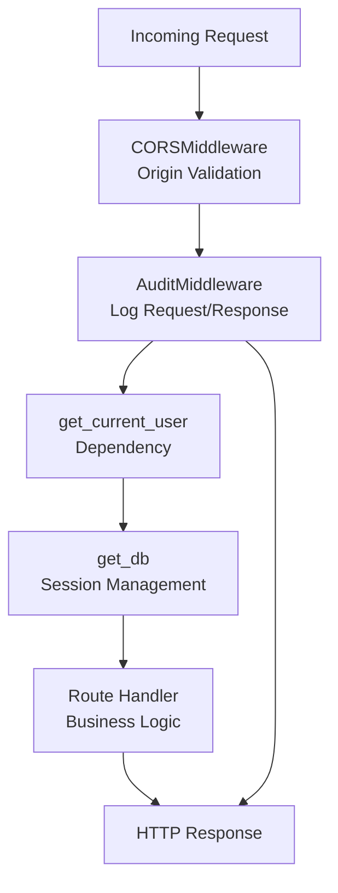
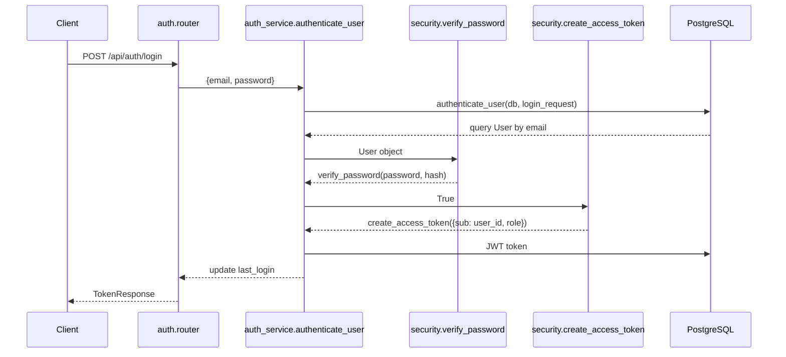
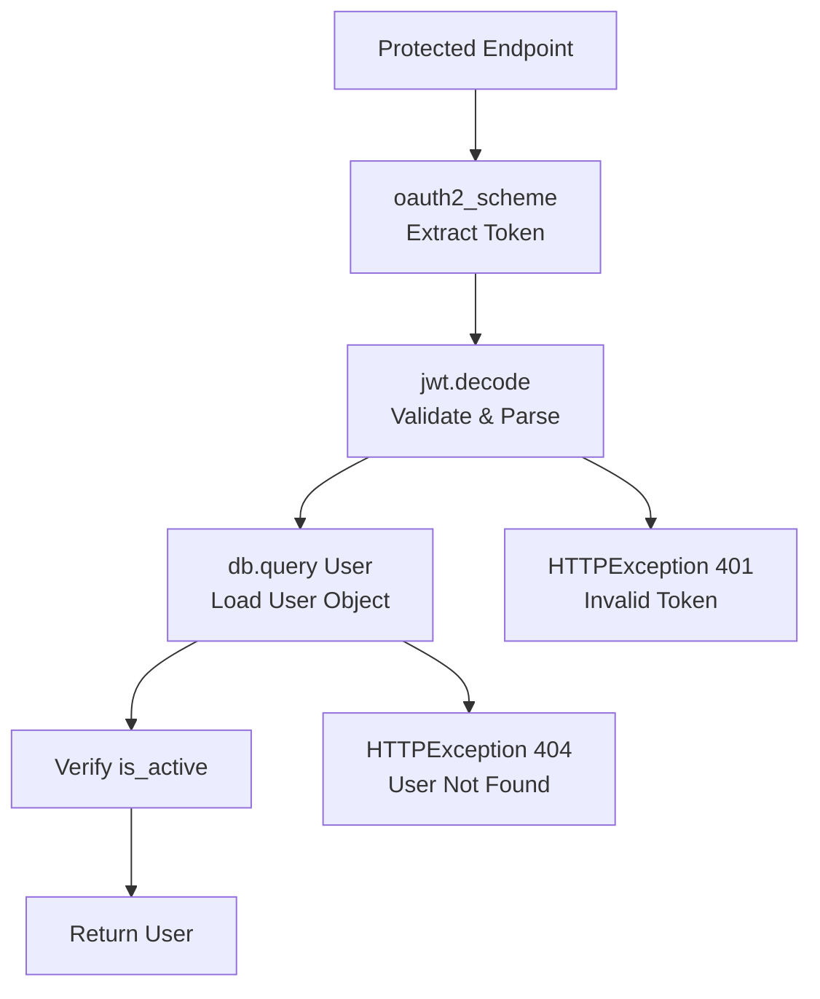
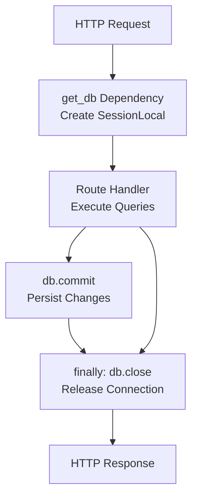
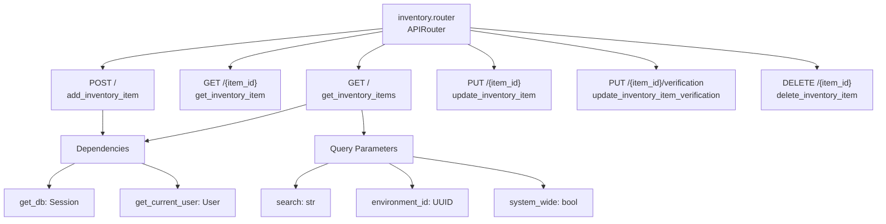
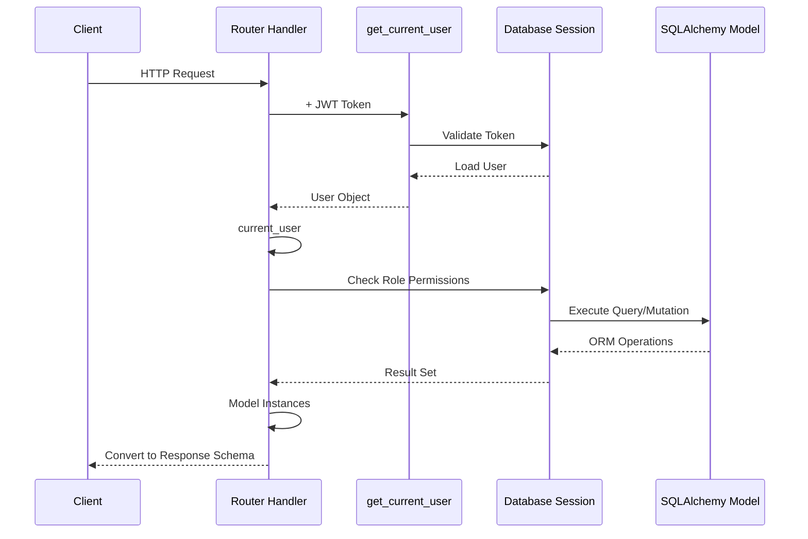
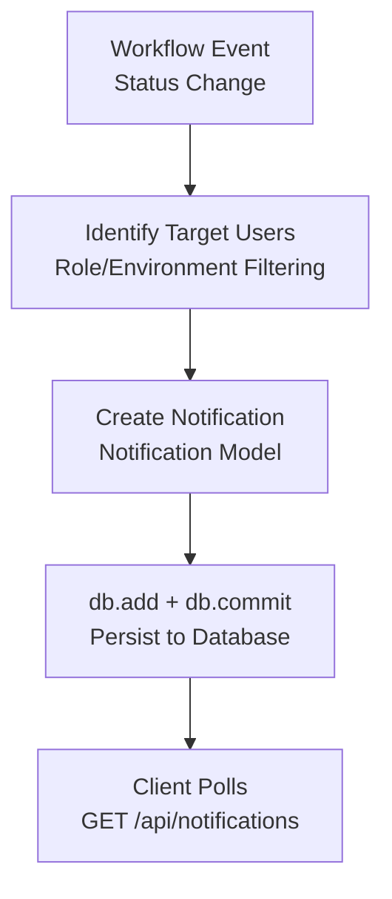
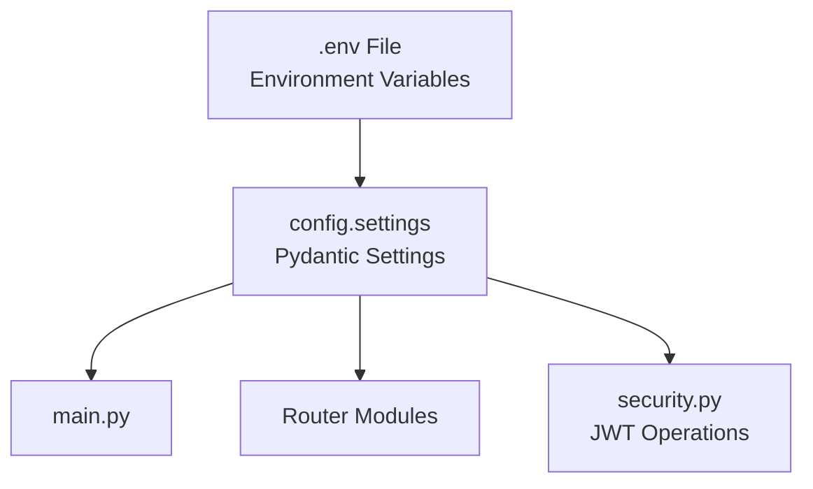

# Backend API (FastAPI)

> **Relevant source files**
> * [client/lib/core/constants/api_constants.dart](https://github.com/axchisan/GestionInventarioSENA/blob/a6b12d01/client/lib/core/constants/api_constants.dart)
> * [client/lib/core/services/profile_service.dart](https://github.com/axchisan/GestionInventarioSENA/blob/a6b12d01/client/lib/core/services/profile_service.dart)
> * [client/lib/presentation/screens/feedback/feedback_form_screen.dart](https://github.com/axchisan/GestionInventarioSENA/blob/a6b12d01/client/lib/presentation/screens/feedback/feedback_form_screen.dart)
> * [server/app/main.py](https://github.com/axchisan/GestionInventarioSENA/blob/a6b12d01/server/app/main.py)
> * [server/app/routers/auth.py](https://github.com/axchisan/GestionInventarioSENA/blob/a6b12d01/server/app/routers/auth.py)
> * [server/app/routers/feedback.py](https://github.com/axchisan/GestionInventarioSENA/blob/a6b12d01/server/app/routers/feedback.py)
> * [server/app/routers/inventory.py](https://github.com/axchisan/GestionInventarioSENA/blob/a6b12d01/server/app/routers/inventory.py)
> * [server/app/routers/maintenance_requests.py](https://github.com/axchisan/GestionInventarioSENA/blob/a6b12d01/server/app/routers/maintenance_requests.py)
> * [server/app/routers/notifications.py](https://github.com/axchisan/GestionInventarioSENA/blob/a6b12d01/server/app/routers/notifications.py)
> * [server/app/schemas/user.py](https://github.com/axchisan/GestionInventarioSENA/blob/a6b12d01/server/app/schemas/user.py)
> * [server/app/services/auth_service.py](https://github.com/axchisan/GestionInventarioSENA/blob/a6b12d01/server/app/services/auth_service.py)

## Purpose and Scope

This document describes the FastAPI backend architecture of the SENA Inventory Management System. It covers the application structure, middleware pipeline, router-based organization, database integration, and request/response patterns. For authentication flows and JWT token handling, see [Backend Authentication API](/axchisan/GestionInventarioSENA/3.2-backend-authentication-api). For role-based access control implementation, see [Role-Based Access Control](/axchisan/GestionInventarioSENA/3.3-role-based-access-control). For specific endpoint documentation, see [API Reference](/axchisan/GestionInventarioSENA/15-api-reference).

The backend serves as the central API gateway for all client applications, implementing business logic, data persistence, and security controls across 10+ domain-specific routers.

---

## Application Structure

The FastAPI application is initialized in `server/app/main.py` and follows a modular router-based architecture with middleware interception for cross-cutting concerns.

### Main Application Configuration

```mermaid
flowchart TD

main["main.py<br>FastAPI Application"]
cors["CORSMiddleware<br>allow_origins: *"]
audit["AuditMiddleware<br>Request Logging"]
routers_group["Router Registration"]
auth_r["auth.router<br>/api/auth"]
env_r["environments.router<br>/api/environments"]
inv_r["inventory.router<br>/api/inventory"]
checks_r["inventory_checks.router<br>/api/inventory-checks"]
qr_r["qr.router<br>/api/qr"]
sched_r["schedules.router<br>/api/schedules"]
users_r["users.router<br>/api/users"]
notif_r["notifications.router<br>/api/notifications"]
maint_r["maintenance_requests.router<br>/api/maintenance-requests"]
stats_r["stats.router<br>/api/stats"]
loans_r["loans.router<br>/api/loans"]
reports_r["reports.router<br>/api/reports"]
audit_r["audit_logs.router<br>/api/audit-logs"]
feedback_r["feedback.router<br>/api/feedback"]

main --> cors
main --> audit
main --> routers_group
routers_group --> auth_r
routers_group --> env_r
routers_group --> inv_r
routers_group --> checks_r
routers_group --> qr_r
routers_group --> sched_r
routers_group --> users_r
routers_group --> notif_r
routers_group --> maint_r
routers_group --> stats_r
routers_group --> loans_r
routers_group --> reports_r
routers_group --> audit_r
routers_group --> feedback_r
```



**Sources:** [server/app/main.py L1-L44](https://github.com/axchisan/GestionInventarioSENA/blob/a6b12d01/server/app/main.py#L1-L44)

The application is configured with:

| Configuration | Description |
| --- | --- |
| **CORS** | Allows all origins (`*`) with credentials, all methods and headers |
| **Title** | "Sistema de Gestión de Inventarios SENA" |
| **Middleware** | AuditMiddleware for automatic request logging |
| **Router Count** | 14 domain-specific routers with tagged endpoints |

---

## Middleware Pipeline

The middleware pipeline processes all incoming requests before they reach route handlers, implementing cross-cutting concerns like audit logging and CORS policy enforcement.

### Middleware Execution Flow



**Sources:** [server/app/main.py L10-L18](https://github.com/axchisan/GestionInventarioSENA/blob/a6b12d01/server/app/main.py#L10-L18)

 [server/app/middleware/audit_middleware.py](https://github.com/axchisan/GestionInventarioSENA/blob/a6b12d01/server/app/middleware/audit_middleware.py)

### Request Processing Order

1. **CORSMiddleware** - Validates origin and injects CORS headers
2. **AuditMiddleware** - Captures request metadata (user, method, path, IP)
3. **OAuth2PasswordBearer** - Extracts and validates JWT token (if required)
4. **get_current_user** - Decodes token and loads user from database
5. **get_db** - Provides SQLAlchemy session for database operations
6. **Route Handler** - Executes business logic
7. **AuditMiddleware** - Logs response status and duration

---

## Router Organization

The backend organizes endpoints into 14 domain-specific routers, each handling a distinct business capability. Each router is registered with a URL prefix and OpenAPI tags for documentation.

### Router Registration Map

| Router | Prefix | Tag | Primary Purpose |
| --- | --- | --- | --- |
| `auth.router` | `/api/auth` | auth | User authentication, registration, token management |
| `environments.router` | `/api/environments` | environments | Location/environment CRUD operations |
| `inventory.router` | `/api/inventory` | inventory | Inventory item management |
| `inventory_checks.router` | `/api/inventory-checks` | inventory-checks | Verification workflow management |
| `qr.router` | `/api/qr` | qr | QR code generation and scanning |
| `schedules.router` | `/api/schedules` | schedules | Schedule management for checks |
| `users.router` | `/api/users` | users | User management and role assignment |
| `supervisor_reviews.router` | `/api/supervisor-reviews` | supervisor-reviews | Supervisor review workflow |
| `inventory_check_items.router` | `/api/inventory-check-items` | inventory-check-items | Item-level verification data |
| `system_alerts.router` | `/api/system-alerts` | system-alerts | System-generated alerts |
| `notifications.router` | `/api/notifications` | notifications | User notification management |
| `maintenance_requests.router` | `/api/maintenance-requests` | maintenance-requests | Maintenance workflow |
| `maintenance_history.router` | `/api/maintenance-history` | maintenance-history | Maintenance tracking history |
| `stats.router` | `/api/stats` | stats | Statistical aggregations |
| `loans.router` | `/api/loans` | loans | Equipment loan management |
| `alert_settings.router` | `/api/alert-settings` | alert-settings | Alert configuration |
| `reports.router` | `/api/reports` | reports | Report generation (PDF/Excel) |
| `audit_logs.router` | `/api/audit-logs` | audit-logs | Audit trail access |
| `feedback.router` | `/api/feedback` | feedback | User feedback collection |

**Sources:** [server/app/main.py L21-L39](https://github.com/axchisan/GestionInventarioSENA/blob/a6b12d01/server/app/main.py#L21-L39)

---

## Authentication and Authorization

The backend implements JWT-based authentication using the OAuth2 password bearer scheme. Authentication is handled through dependency injection using FastAPI's `Depends` mechanism.

### Authentication Flow



**Sources:** [server/app/routers/auth.py L20-L22](https://github.com/axchisan/GestionInventarioSENA/blob/a6b12d01/server/app/routers/auth.py#L20-L22)

 [server/app/services/auth_service.py L9-L55](https://github.com/axchisan/GestionInventarioSENA/blob/a6b12d01/server/app/services/auth_service.py#L9-L55)

### JWT Token Structure

The JWT tokens encode user identity and role information:

```css
# Token payload structure
{
    "sub": str(user.id),  # Subject: User UUID
    "role": str(user.role)  # User role for RBAC
}
```

**Sources:** [server/app/services/auth_service.py L31](https://github.com/axchisan/GestionInventarioSENA/blob/a6b12d01/server/app/services/auth_service.py#L31-L31)

### Protected Route Pattern

Protected routes use the `get_current_user` dependency to validate tokens and load user context:



**Sources:** [server/app/routers/auth.py L53-L76](https://github.com/axchisan/GestionInventarioSENA/blob/a6b12d01/server/app/routers/auth.py#L53-L76)

---

## Database Integration

The backend uses SQLAlchemy ORM for database access with a PostgreSQL backend. Database sessions are managed through FastAPI dependency injection.

### Database Session Management



**Sources:** [server/app/database.py](https://github.com/axchisan/GestionInventarioSENA/blob/a6b12d01/server/app/database.py)

### ORM Model to Schema Pattern

The backend follows a consistent pattern for database models and Pydantic schemas:

| Layer | Purpose | Example |
| --- | --- | --- |
| **Model** | SQLAlchemy ORM class mapping to database table | `User`, `InventoryItem`, `MaintenanceRequest` |
| **Schema (Base)** | Shared fields for create/update operations | `UserBase`, `InventoryItemBase` |
| **Schema (Create)** | Fields required for creation | `UserCreate`, `InventoryItemCreate` |
| **Schema (Update)** | Optional fields for partial updates | `InventoryItemUpdate` |
| **Schema (Response)** | Full object returned to client (includes ID, timestamps) | `UserResponse`, `InventoryItemResponse` |

**Sources:** [server/app/schemas/user.py L6-L53](https://github.com/axchisan/GestionInventarioSENA/blob/a6b12d01/server/app/schemas/user.py#L6-L53)

---

## Router Implementation Patterns

Each router follows consistent patterns for endpoint implementation with role-based access control and database operations.

### Example: Inventory Router Structure



**Sources:** [server/app/routers/inventory.py L1-L159](https://github.com/axchisan/GestionInventarioSENA/blob/a6b12d01/server/app/routers/inventory.py#L1-L159)

### Role-Based Authorization Pattern

Routers implement inline role checks for restricted operations:

```markdown
# Supervisor+ roles required for write operations
if current_user.role not in ["supervisor", "admin", "admin_general"]:
    raise HTTPException(status_code=403, detail="Rol no autorizado")
```

**Sources:** [server/app/routers/inventory.py L66-L67](https://github.com/axchisan/GestionInventarioSENA/blob/a6b12d01/server/app/routers/inventory.py#L66-L67)

 [server/app/routers/inventory.py L82-L83](https://github.com/axchisan/GestionInventarioSENA/blob/a6b12d01/server/app/routers/inventory.py#L82-L83)

### Environment Scoping Pattern

Many routers filter data by environment to enforce multi-tenant isolation:

```markdown
# Admin general sees all, others see environment-scoped data
if current_user.role == "admin_general" and (system_wide or admin_access):
    pass  # No filtering
elif environment_id:
    query = query.filter(InventoryItem.environment_id == environment_id)
elif current_user.environment_id:
    query = query.filter(InventoryItem.environment_id == current_user.environment_id)
```

**Sources:** [server/app/routers/inventory.py L25-L30](https://github.com/axchisan/GestionInventarioSENA/blob/a6b12d01/server/app/routers/inventory.py#L25-L30)

---

## Request/Response Flow

### Typical CRUD Operation Flow



### Error Response Patterns

The backend uses FastAPI's `HTTPException` for standardized error responses:

| Status Code | Usage | Example |
| --- | --- | --- |
| **400** | Bad Request - Invalid input | Email already registered |
| **401** | Unauthorized - Invalid/expired token | "Token inválido o expirado" |
| **403** | Forbidden - Insufficient permissions | "Rol no autorizado" |
| **404** | Not Found - Resource doesn't exist | "Ítem no encontrado" |
| **500** | Internal Server Error - Unexpected failure | Database connection errors |

**Sources:** [server/app/routers/auth.py L28-L31](https://github.com/axchisan/GestionInventarioSENA/blob/a6b12d01/server/app/routers/auth.py#L28-L31)

 [server/app/routers/inventory.py L33-L36](https://github.com/axchisan/GestionInventarioSENA/blob/a6b12d01/server/app/routers/inventory.py#L33-L36)

 [server/app/routers/inventory.py L146-L150](https://github.com/axchisan/GestionInventarioSENA/blob/a6b12d01/server/app/routers/inventory.py#L146-L150)

---

## Notification Generation Pattern

Several routers implement automatic notification generation for workflow events:



### Example: Maintenance Request Notifications

When a maintenance request is created, supervisors in the relevant environment are notified:

```sql
# Find supervisors in environment
supervisors_query = db.query(User).filter(User.role == "supervisor")
if request_data.environment_id:
    supervisors_query = supervisors_query.filter(
        (User.environment_id == request_data.environment_id) | 
        (User.environment_id.is_(None))  # General supervisors
    )
supervisors = supervisors_query.all()

# Create notification for each supervisor
for supervisor in supervisors:
    notification = Notification(
        user_id=supervisor.id,
        type="maintenance_request",
        title="Nueva Solicitud de Mantenimiento",
        message=f"Se ha creado una nueva solicitud...",
        priority="high" if request_data.priority == "urgent" else "medium"
    )
    db.add(notification)
```

**Sources:** [server/app/routers/maintenance_requests.py L82-L104](https://github.com/axchisan/GestionInventarioSENA/blob/a6b12d01/server/app/routers/maintenance_requests.py#L82-L104)

---

## Schema Validation

The backend uses Pydantic schemas for request validation and response serialization.

### Validation Features

| Feature | Implementation | Example |
| --- | --- | --- |
| **Type Checking** | Pydantic BaseModel with typed fields | `email: EmailStr`, `id: UUID` |
| **Required Fields** | Fields without Optional[] wrapper | `title: str`, `description: str` |
| **Optional Fields** | Optional[] type annotation | `phone: Optional[str] = None` |
| **Custom Validators** | Inline validation in route handler | Priority must be in ['low', 'medium', 'high'] |
| **ORM Conversion** | `from_attributes = True` in Config | Automatic SQLAlchemy model conversion |

**Sources:** [server/app/schemas/user.py L1-L53](https://github.com/axchisan/GestionInventarioSENA/blob/a6b12d01/server/app/schemas/user.py#L1-L53)

 [server/app/routers/feedback.py L62-L76](https://github.com/axchisan/GestionInventarioSENA/blob/a6b12d01/server/app/routers/feedback.py#L62-L76)

### Schema Example: User Authentication

```python
class LoginRequest(BaseModel):
    email: EmailStr
    password: str

class TokenResponse(BaseModel):
    access_token: str
    token_type: str
    user: UserResponse  # Nested schema
```

**Sources:** [server/app/schemas/user.py L30-L37](https://github.com/axchisan/GestionInventarioSENA/blob/a6b12d01/server/app/schemas/user.py#L30-L37)

---

## API Endpoint Conventions

### Endpoint Naming

| Pattern | Usage | Example |
| --- | --- | --- |
| `GET /` | List all resources | `GET /api/inventory/` |
| `GET /{id}` | Get single resource | `GET /api/inventory/{item_id}` |
| `POST /` | Create resource | `POST /api/inventory/` |
| `PUT /{id}` | Full/partial update | `PUT /api/inventory/{item_id}` |
| `DELETE /{id}` | Delete resource | `DELETE /api/inventory/{item_id}` |
| `GET /{id}/sub-resource` | Nested resource | `GET /api/inventory-checks/{check_id}/items` |

### Query Parameter Conventions

Common query parameters across routers:

| Parameter | Type | Purpose |
| --- | --- | --- |
| `search` | `str` | Text search across multiple fields |
| `environment_id` | `UUID` | Filter by environment |
| `system_wide` | `bool` | Override environment filter (admin_general only) |
| `admin_access` | `bool` | Enable cross-environment access |
| `status` | `str` | Filter by status enum |
| `skip` | `int` | Pagination offset |
| `limit` | `int` | Pagination page size |

**Sources:** [server/app/routers/inventory.py L14-L22](https://github.com/axchisan/GestionInventarioSENA/blob/a6b12d01/server/app/routers/inventory.py#L14-L22)

 [server/app/routers/feedback.py L111-L116](https://github.com/axchisan/GestionInventarioSENA/blob/a6b12d01/server/app/routers/feedback.py#L111-L116)

---

## Configuration Management

The backend loads configuration from environment variables through a centralized settings module:



### Key Configuration Values

| Setting | Purpose | Usage |
| --- | --- | --- |
| `SECRET_KEY` | JWT signing key | Token generation/validation |
| `ALGORITHM` | JWT algorithm (HS256) | Token encoding |
| `DATABASE_URL` | PostgreSQL connection string | SQLAlchemy engine |
| `MINIO_*` | MinIO object storage config | Report file storage |

**Sources:** [server/app/config.py](https://github.com/axchisan/GestionInventarioSENA/blob/a6b12d01/server/app/config.py)

 [server/app/routers/auth.py L56](https://github.com/axchisan/GestionInventarioSENA/blob/a6b12d01/server/app/routers/auth.py#L56-L56)