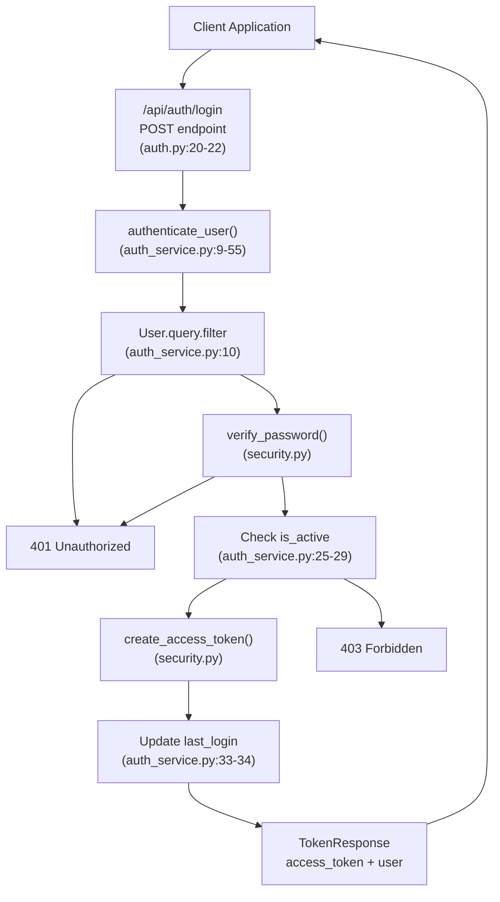
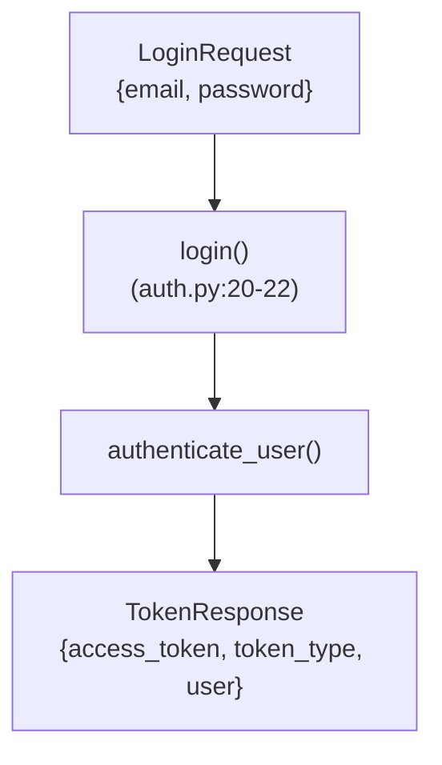
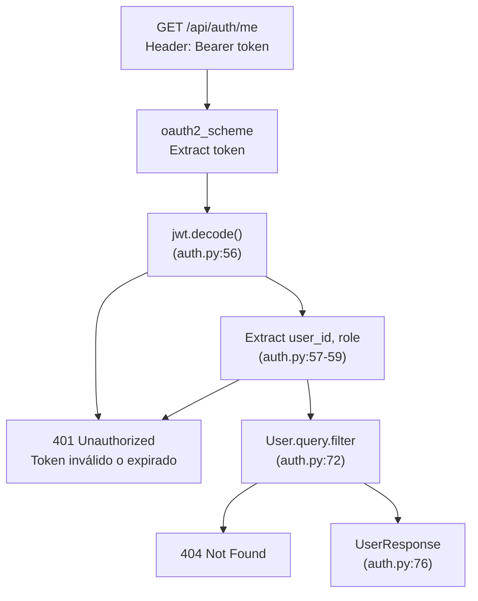
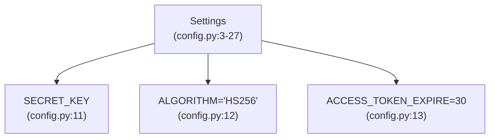
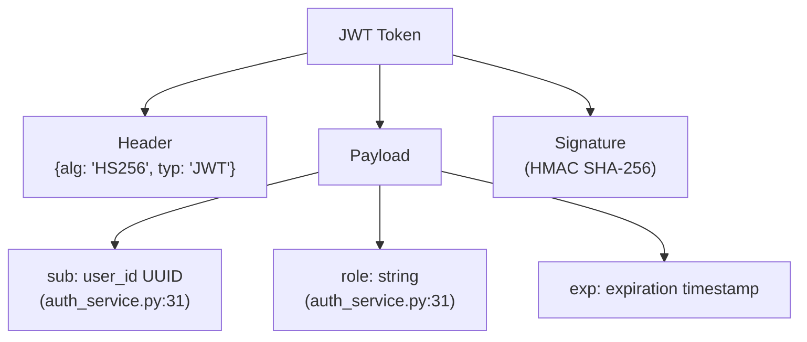
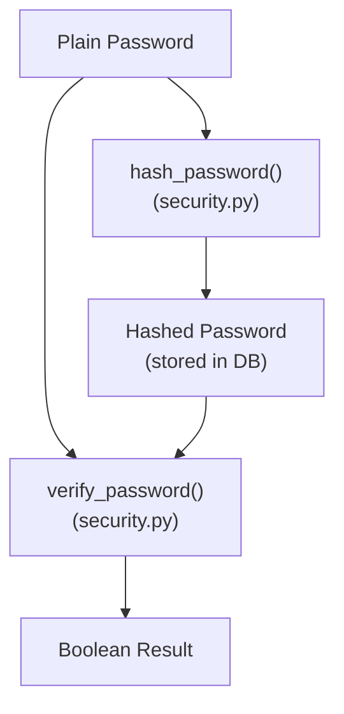
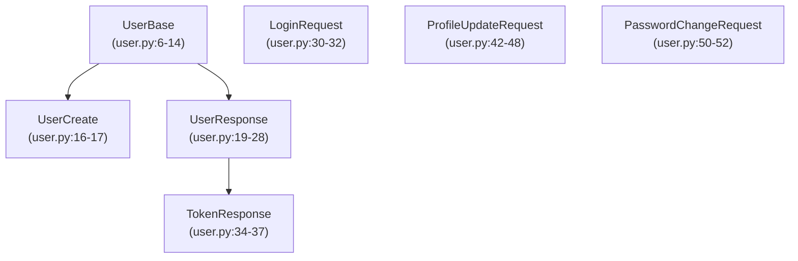
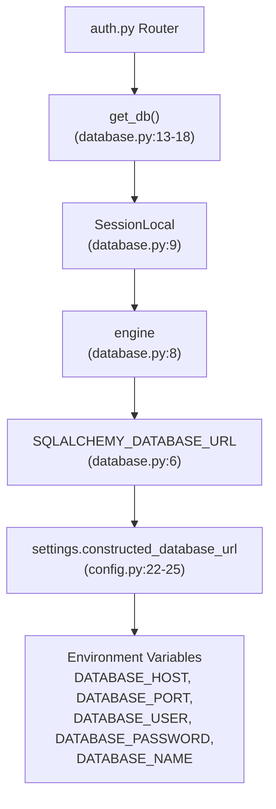

# Backend Authentication API

> **Relevant source files**
> * [client/lib/core/services/profile_service.dart](https://github.com/axchisan/GestionInventarioSENA/blob/a6b12d01/client/lib/core/services/profile_service.dart)
> * [client/lib/core/services/session_service.dart](https://github.com/axchisan/GestionInventarioSENA/blob/a6b12d01/client/lib/core/services/session_service.dart)
> * [client/lib/presentation/screens/qr/qr_code_generator_screen.dart](https://github.com/axchisan/GestionInventarioSENA/blob/a6b12d01/client/lib/presentation/screens/qr/qr_code_generator_screen.dart)
> * [server/.env](https://github.com/axchisan/GestionInventarioSENA/blob/a6b12d01/server/.env)
> * [server/.gitignore](https://github.com/axchisan/GestionInventarioSENA/blob/a6b12d01/server/.gitignore)
> * [server/app/config.py](https://github.com/axchisan/GestionInventarioSENA/blob/a6b12d01/server/app/config.py)
> * [server/app/database.py](https://github.com/axchisan/GestionInventarioSENA/blob/a6b12d01/server/app/database.py)
> * [server/app/routers/auth.py](https://github.com/axchisan/GestionInventarioSENA/blob/a6b12d01/server/app/routers/auth.py)
> * [server/app/schemas/user.py](https://github.com/axchisan/GestionInventarioSENA/blob/a6b12d01/server/app/schemas/user.py)
> * [server/app/services/auth_service.py](https://github.com/axchisan/GestionInventarioSENA/blob/a6b12d01/server/app/services/auth_service.py)
> * [server/docker-compose.yml](https://github.com/axchisan/GestionInventarioSENA/blob/a6b12d01/server/docker-compose.yml)

## Purpose and Scope

This document describes the backend authentication API implemented in the FastAPI server, including JWT token generation, password security, and authentication endpoints. This page focuses on server-side authentication logic and REST API endpoints.

For client-side authentication flow and state management, see [Client-Side Authentication](/axchisan/GestionInventarioSENA/3.1-client-side-authentication). For role-based permissions and access control rules, see [Role-Based Access Control](/axchisan/GestionInventarioSENA/3.3-role-based-access-control).

## Authentication Flow

The authentication system uses JWT tokens with OAuth2 bearer authentication. The flow involves user credential validation, token generation, and session tracking through database updates.



**Sources:** [server/app/routers/auth.py L20-L22](https://github.com/axchisan/GestionInventarioSENA/blob/a6b12d01/server/app/routers/auth.py#L20-L22)

 [server/app/services/auth_service.py L9-L55](https://github.com/axchisan/GestionInventarioSENA/blob/a6b12d01/server/app/services/auth_service.py#L9-L55)

## Authentication Router

The authentication router is defined in `auth.py` and provides all authentication-related endpoints. It uses FastAPI's dependency injection for database sessions and the OAuth2 scheme for token validation.

| Component | Definition | Purpose |
| --- | --- | --- |
| `router` | `APIRouter(tags=["auth"])` | Groups authentication endpoints |
| `oauth2_scheme` | `OAuth2PasswordBearer(tokenUrl="/api/auth/login")` | Defines token retrieval endpoint for OAuth2 flow |
| `get_db` | Database dependency | Provides SQLAlchemy session per request |

**Sources:** [server/app/routers/auth.py L16-L18](https://github.com/axchisan/GestionInventarioSENA/blob/a6b12d01/server/app/routers/auth.py#L16-L18)

## API Endpoints

### POST /api/auth/login

Authenticates user credentials and returns a JWT access token.



**Request Schema:** `LoginRequest`

* `email`: EmailStr (required)
* `password`: str (required)

**Response Schema:** `TokenResponse`

* `access_token`: str (JWT token)
* `token_type`: str (always "bearer")
* `user`: UserResponse object with all user fields

**Validation Steps:**

1. Query user by email [auth_service.py L10](https://github.com/axchisan/GestionInventarioSENA/blob/a6b12d01/auth_service.py#L10-L10)
2. Verify password hash match [auth_service.py L18](https://github.com/axchisan/GestionInventarioSENA/blob/a6b12d01/auth_service.py#L18-L18)
3. Check `is_active` flag [auth_service.py L25-L29](https://github.com/axchisan/GestionInventarioSENA/blob/a6b12d01/auth_service.py#L25-L29)
4. Generate JWT token [auth_service.py L31](https://github.com/axchisan/GestionInventarioSENA/blob/a6b12d01/auth_service.py#L31-L31)
5. Update `last_login` timestamp [auth_service.py L33-L34](https://github.com/axchisan/GestionInventarioSENA/blob/a6b12d01/auth_service.py#L33-L34)

**Error Responses:**

* `401 Unauthorized`: Invalid credentials or user not found
* `403 Forbidden`: User account is inactive

**Sources:** [server/app/routers/auth.py L20-L22](https://github.com/axchisan/GestionInventarioSENA/blob/a6b12d01/server/app/routers/auth.py#L20-L22)

 [server/app/services/auth_service.py L9-L55](https://github.com/axchisan/GestionInventarioSENA/blob/a6b12d01/server/app/services/auth_service.py#L9-L55)

 [server/app/schemas/user.py L30-L37](https://github.com/axchisan/GestionInventarioSENA/blob/a6b12d01/server/app/schemas/user.py#L30-L37)

### POST /api/auth/register

Creates a new user account with hashed password.

**Request Schema:** `UserCreate`

* `email`: EmailStr (required)
* `password`: str (required)
* `first_name`: str (required)
* `last_name`: str (required)
* `role`: str (required)
* `phone`: Optional[str]
* `program`: Optional[str]
* `ficha`: Optional[str]
* `avatar_url`: Optional[str]

**Response Schema:** `UserResponse` (see User Model section below)

**Implementation Flow:**

1. Check for existing email [auth.py L26-L31](https://github.com/axchisan/GestionInventarioSENA/blob/a6b12d01/auth.py#L26-L31)
2. Hash password using `hash_password()` [auth.py L33](https://github.com/axchisan/GestionInventarioSENA/blob/a6b12d01/auth.py#L33-L33)
3. Create User model instance [auth.py L35-L46](https://github.com/axchisan/GestionInventarioSENA/blob/a6b12d01/auth.py#L35-L46)
4. Set `is_active=True` by default [auth.py L45](https://github.com/axchisan/GestionInventarioSENA/blob/a6b12d01/auth.py#L45-L45)
5. Commit to database and return [auth.py L47-L51](https://github.com/axchisan/GestionInventarioSENA/blob/a6b12d01/auth.py#L47-L51)

**Error Responses:**

* `400 Bad Request`: Email already registered

**Sources:** [server/app/routers/auth.py L24-L51](https://github.com/axchisan/GestionInventarioSENA/blob/a6b12d01/server/app/routers/auth.py#L24-L51)

 [server/app/schemas/user.py L16-L17](https://github.com/axchisan/GestionInventarioSENA/blob/a6b12d01/server/app/schemas/user.py#L16-L17)

### GET /api/auth/me

Retrieves current authenticated user's profile information.



**Authentication:** Requires valid JWT token via `Authorization: Bearer <token>` header

**Token Validation:**

* Decode JWT using `settings.SECRET_KEY` and `settings.ALGORITHM` [auth.py L56](https://github.com/axchisan/GestionInventarioSENA/blob/a6b12d01/auth.py#L56-L56)
* Extract `sub` (user_id) and `role` from payload [auth.py L57-L58](https://github.com/axchisan/GestionInventarioSENA/blob/a6b12d01/auth.py#L57-L58)
* Handle `JWTError` for expired or invalid tokens [auth.py L65-L70](https://github.com/axchisan/GestionInventarioSENA/blob/a6b12d01/auth.py#L65-L70)

**Response Schema:** `UserResponse` with complete user profile

**Error Responses:**

* `401 Unauthorized`: Invalid or expired token
* `404 Not Found`: User not found in database

**Sources:** [server/app/routers/auth.py L53-L76](https://github.com/axchisan/GestionInventarioSENA/blob/a6b12d01/server/app/routers/auth.py#L53-L76)

### PUT /api/auth/me

Updates current user's profile fields.

**Request Schema:** `ProfileUpdateRequest`

* `first_name`: Optional[str]
* `last_name`: Optional[str]
* `phone`: Optional[str]
* `program`: Optional[str]
* `ficha`: Optional[str]
* `avatar_url`: Optional[str]

**Implementation:**

1. Validate token and extract user_id [auth.py L85-L99](https://github.com/axchisan/GestionInventarioSENA/blob/a6b12d01/auth.py#L85-L99)
2. Query user from database [auth.py L101-L103](https://github.com/axchisan/GestionInventarioSENA/blob/a6b12d01/auth.py#L101-L103)
3. Apply updates using `dict(exclude_unset=True)` [auth.py L106-L108](https://github.com/axchisan/GestionInventarioSENA/blob/a6b12d01/auth.py#L106-L108)
4. Update `updated_at` timestamp [auth.py L110](https://github.com/axchisan/GestionInventarioSENA/blob/a6b12d01/auth.py#L110-L110)
5. Commit and return updated user [auth.py L111-L114](https://github.com/axchisan/GestionInventarioSENA/blob/a6b12d01/auth.py#L111-L114)

**Response Schema:** `UserResponse`

**Error Responses:**

* `401 Unauthorized`: Invalid token
* `404 Not Found`: User not found

**Sources:** [server/app/routers/auth.py L78-L114](https://github.com/axchisan/GestionInventarioSENA/blob/a6b12d01/server/app/routers/auth.py#L78-L114)

 [server/app/schemas/user.py L42-L48](https://github.com/axchisan/GestionInventarioSENA/blob/a6b12d01/server/app/schemas/user.py#L42-L48)

### POST /api/auth/me/change-password

Changes current user's password after verifying current password.

**Request Schema:** `PasswordChangeRequest`

* `current_password`: str (required)
* `new_password`: str (required)

**Security Flow:**

1. Validate JWT token [auth.py L124-L137](https://github.com/axchisan/GestionInventarioSENA/blob/a6b12d01/auth.py#L124-L137)
2. Query user by ID [auth.py L139-L141](https://github.com/axchisan/GestionInventarioSENA/blob/a6b12d01/auth.py#L139-L141)
3. Verify current password using `verify_password()` [auth.py L144](https://github.com/axchisan/GestionInventarioSENA/blob/a6b12d01/auth.py#L144-L144)
4. Hash new password using `hash_password()` [auth.py L151](https://github.com/axchisan/GestionInventarioSENA/blob/a6b12d01/auth.py#L151-L151)
5. Update `password_hash` and `updated_at` [auth.py L151-L152](https://github.com/axchisan/GestionInventarioSENA/blob/a6b12d01/auth.py#L151-L152)
6. Commit changes [auth.py L153](https://github.com/axchisan/GestionInventarioSENA/blob/a6b12d01/auth.py#L153-L153)

**Response:** `{"message": "Contraseña actualizada exitosamente"}`

**Error Responses:**

* `400 Bad Request`: Current password incorrect
* `401 Unauthorized`: Invalid token
* `404 Not Found`: User not found

**Sources:** [server/app/routers/auth.py L116-L155](https://github.com/axchisan/GestionInventarioSENA/blob/a6b12d01/server/app/routers/auth.py#L116-L155)

 [server/app/schemas/user.py L50-L52](https://github.com/axchisan/GestionInventarioSENA/blob/a6b12d01/server/app/schemas/user.py#L50-L52)

## JWT Token Implementation

The system uses JSON Web Tokens (JWT) for stateless authentication. Token configuration is managed through application settings.

### Token Configuration



| Setting | Default | Description |
| --- | --- | --- |
| `SECRET_KEY` | From .env | Secret key for JWT signing |
| `ALGORITHM` | "HS256" | HMAC SHA-256 algorithm |
| `ACCESS_TOKEN_EXPIRE` | 30 | Token expiration in minutes |

**Sources:** [server/app/config.py L11-L13](https://github.com/axchisan/GestionInventarioSENA/blob/a6b12d01/server/app/config.py#L11-L13)

### Token Structure

JWT tokens encode the following payload:



**Token Claims:**

* `sub`: User ID as UUID string
* `role`: User role (student, instructor, supervisor, admin, admin_general)
* `exp`: Expiration timestamp (automatically added by `create_access_token()`)

**Token Generation:** [server/app/services/auth_service.py L31](https://github.com/axchisan/GestionInventarioSENA/blob/a6b12d01/server/app/services/auth_service.py#L31-L31)

```
access_token = create_access_token(data={"sub": str(user.id), "role": cast(str, user.role)})
```

**Token Validation:** [server/app/routers/auth.py L56-L70](https://github.com/axchisan/GestionInventarioSENA/blob/a6b12d01/server/app/routers/auth.py#L56-L70)

* Decode using `jwt.decode(token, settings.SECRET_KEY, algorithms=[settings.ALGORITHM])`
* Extract `sub` and `role` from decoded payload
* Raise `JWTError` on invalid/expired tokens

**Sources:** [server/app/services/auth_service.py L31](https://github.com/axchisan/GestionInventarioSENA/blob/a6b12d01/server/app/services/auth_service.py#L31-L31)

 [server/app/routers/auth.py L56-L70](https://github.com/axchisan/GestionInventarioSENA/blob/a6b12d01/server/app/routers/auth.py#L56-L70)

 [server/app/config.py L11-L13](https://github.com/axchisan/GestionInventarioSENA/blob/a6b12d01/server/app/config.py#L11-L13)

## Password Security

The system uses secure password hashing with bcrypt/argon2 algorithms through utility functions.

### Password Hashing Functions



| Function | Location | Usage |
| --- | --- | --- |
| `hash_password(password: str)` | utils/security.py | Hash plain password for storage |
| `verify_password(plain: str, hashed: str)` | utils/security.py | Verify password against hash |

**Usage in Registration:** [server/app/routers/auth.py L33](https://github.com/axchisan/GestionInventarioSENA/blob/a6b12d01/server/app/routers/auth.py#L33-L33)

```
hashed_password = hash_password(user_create.password)
```

**Usage in Authentication:** [server/app/services/auth_service.py L18](https://github.com/axchisan/GestionInventarioSENA/blob/a6b12d01/server/app/services/auth_service.py#L18-L18)

```
if not verify_password(login_request.password, cast(str, user.password_hash)):
    raise HTTPException(...)
```

**Usage in Password Change:** [server/app/routers/auth.py L144-L151](https://github.com/axchisan/GestionInventarioSENA/blob/a6b12d01/server/app/routers/auth.py#L144-L151)

1. Verify current password: `verify_password(password_data.current_password, user.password_hash)`
2. Hash new password: `hash_password(password_data.new_password)`

**Sources:** [server/app/routers/auth.py L10](https://github.com/axchisan/GestionInventarioSENA/blob/a6b12d01/server/app/routers/auth.py#L10-L10)

 [server/app/routers/auth.py L33](https://github.com/axchisan/GestionInventarioSENA/blob/a6b12d01/server/app/routers/auth.py#L33-L33)

 [server/app/services/auth_service.py L18](https://github.com/axchisan/GestionInventarioSENA/blob/a6b12d01/server/app/services/auth_service.py#L18-L18)

 [server/app/routers/auth.py L144-L151](https://github.com/axchisan/GestionInventarioSENA/blob/a6b12d01/server/app/routers/auth.py#L144-L151)

## User Schemas

Pydantic schemas define request/response data structures for type validation and serialization.

### Schema Hierarchy



### Schema Definitions

**UserBase** (Base fields for user entities)

* `email`: EmailStr
* `first_name`: str
* `last_name`: str
* `role`: str
* `phone`: Optional[str]
* `program`: Optional[str]
* `ficha`: Optional[str]
* `avatar_url`: Optional[str]

**UserCreate** (Registration request)

* Inherits: UserBase
* Additional: `password`: str

**UserResponse** (User profile response)

* Inherits: UserBase
* Additional fields: * `id`: UUID * `is_active`: bool * `last_login`: Optional[datetime] * `created_at`: datetime * `updated_at`: datetime * `environment_id`: Optional[UUID]
* Config: `from_attributes = True` (for ORM serialization)

**LoginRequest**

* `email`: EmailStr
* `password`: str

**TokenResponse**

* `access_token`: str (JWT token)
* `token_type`: str (bearer)
* `user`: UserResponse (complete user object)

**ProfileUpdateRequest** (All fields optional)

* `first_name`: Optional[str]
* `last_name`: Optional[str]
* `phone`: Optional[str]
* `program`: Optional[str]
* `ficha`: Optional[str]
* `avatar_url`: Optional[str]

**PasswordChangeRequest**

* `current_password`: str
* `new_password`: str

**Sources:** [server/app/schemas/user.py L1-L52](https://github.com/axchisan/GestionInventarioSENA/blob/a6b12d01/server/app/schemas/user.py#L1-L52)

## Database Integration

Authentication endpoints interact with the User model through SQLAlchemy ORM.



**Database Session Management:**

* Each endpoint receives a `Session` via `Depends(get_db)` [auth.py L21-L120](https://github.com/axchisan/GestionInventarioSENA/blob/a6b12d01/auth.py#L21-L120)
* Session automatically closed after request [database.py L17-L18](https://github.com/axchisan/GestionInventarioSENA/blob/a6b12d01/database.py#L17-L18)
* Connection string constructed from environment variables [config.py L22-L25](https://github.com/axchisan/GestionInventarioSENA/blob/a6b12d01/config.py#L22-L25)

**User Model Queries:**

* Login: `db.query(User).filter(User.email == login_request.email).first()` [auth_service.py L10](https://github.com/axchisan/GestionInventarioSENA/blob/a6b12d01/auth_service.py#L10-L10)
* Get user by ID: `db.query(User).filter(User.id == uuid.UUID(user_id)).first()` [auth.py L72](https://github.com/axchisan/GestionInventarioSENA/blob/a6b12d01/auth.py#L72-L72)
* Update last login: `db.query(User).filter(User.id == user.id).update({"last_login": ...})` [auth_service.py L33](https://github.com/axchisan/GestionInventarioSENA/blob/a6b12d01/auth_service.py#L33-L33)

**Sources:** [server/app/database.py L1-L18](https://github.com/axchisan/GestionInventarioSENA/blob/a6b12d01/server/app/database.py#L1-L18)

 [server/app/config.py L22-L25](https://github.com/axchisan/GestionInventarioSENA/blob/a6b12d01/server/app/config.py#L22-L25)

 [server/app/routers/auth.py L7](https://github.com/axchisan/GestionInventarioSENA/blob/a6b12d01/server/app/routers/auth.py#L7-L7)

## Error Handling

The authentication system provides structured error responses with appropriate HTTP status codes.

| Status Code | Scenario | Response Detail |
| --- | --- | --- |
| 400 Bad Request | Email already registered | "El correo electrónico ya está registrado" |
| 400 Bad Request | Current password incorrect | "Contraseña actual incorrecta" |
| 401 Unauthorized | Invalid credentials | "Correo o contraseña incorrectos" |
| 401 Unauthorized | Invalid/expired token | "Token inválido o expirado" |
| 403 Forbidden | Inactive account | "La cuenta de usuario está inactiva" |
| 404 Not Found | User not found | "Usuario no encontrado" |

**Error Response Headers:**

* WWW-Authenticate: "Bearer" (for 401 responses)

**HTTPException Usage:**

```
raise HTTPException(
    status_code=status.HTTP_401_UNAUTHORIZED,
    detail="Correo o contraseña incorrectos",
    headers={"WWW-Authenticate": "Bearer"},
)
```

**Sources:** [server/app/routers/auth.py L28-L137](https://github.com/axchisan/GestionInventarioSENA/blob/a6b12d01/server/app/routers/auth.py#L28-L137)

 [server/app/services/auth_service.py L12-L29](https://github.com/axchisan/GestionInventarioSENA/blob/a6b12d01/server/app/services/auth_service.py#L12-L29)

## Configuration and Deployment

Authentication configuration is managed through environment variables and application settings.

### Environment Variables

Required variables in `.env` file:

| Variable | Purpose | Example |
| --- | --- | --- |
| `DATABASE_HOST` | PostgreSQL host | 147.93.178.204 |
| `DATABASE_PORT` | PostgreSQL port | 5433 |
| `DATABASE_USER` | Database user | postgres |
| `DATABASE_PASSWORD` | Database password | (secure hash) |
| `DATABASE_NAME` | Database name | gestionInventario |
| `SECRET_KEY` | JWT signing key | (long random string) |
| `APP_PORT` | Server port | 8001 |

**Settings Class:** [server/app/config.py L3-L27](https://github.com/axchisan/GestionInventarioSENA/blob/a6b12d01/server/app/config.py#L3-L27)

* Uses `pydantic_settings.BaseSettings` for validation
* Loads from `.env` file automatically
* Constructs database URL from components
* Provides default values for `ALGORITHM` and `ACCESS_TOKEN_EXPIRE`

**Docker Deployment:**

* Port mapping: `8001:8001` [docker-compose.yml L6-L7](https://github.com/axchisan/GestionInventarioSENA/blob/a6b12d01/docker-compose.yml#L6-L7)
* Environment passed via compose file [docker-compose.yml L8-L10](https://github.com/axchisan/GestionInventarioSENA/blob/a6b12d01/docker-compose.yml#L8-L10)
* Restart policy on failure [docker-compose.yml L14-L16](https://github.com/axchisan/GestionInventarioSENA/blob/a6b12d01/docker-compose.yml#L14-L16)

**Sources:** [server/.env L1-L7](https://github.com/axchisan/GestionInventarioSENA/blob/a6b12d01/server/.env#L1-L7)

 [server/app/config.py L3-L27](https://github.com/axchisan/GestionInventarioSENA/blob/a6b12d01/server/app/config.py#L3-L27)

 [server/docker-compose.yml L1-L20](https://github.com/axchisan/GestionInventarioSENA/blob/a6b12d01/server/docker-compose.yml#L1-L20)