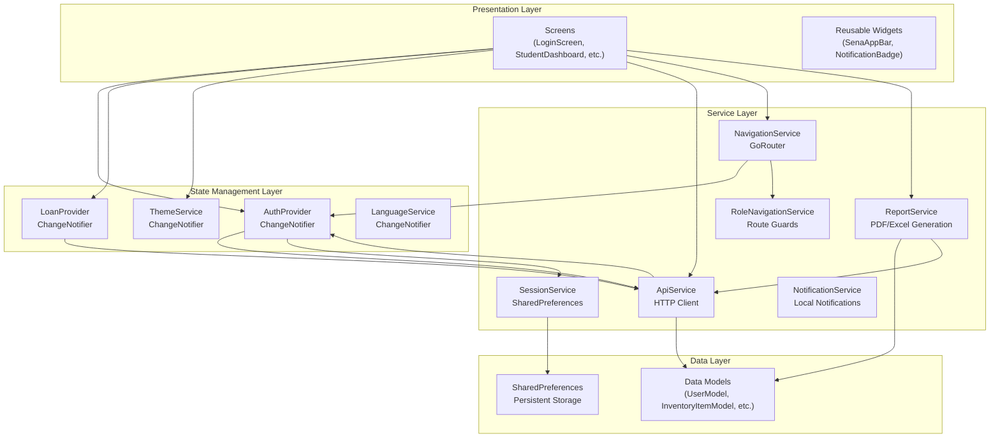
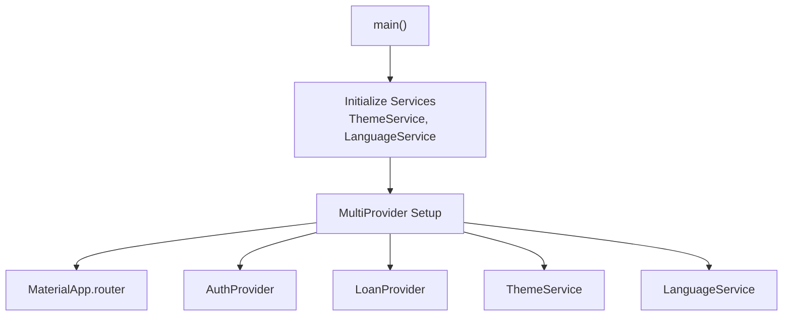
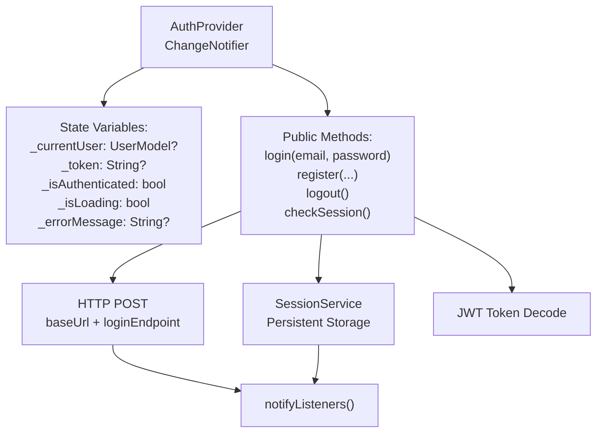
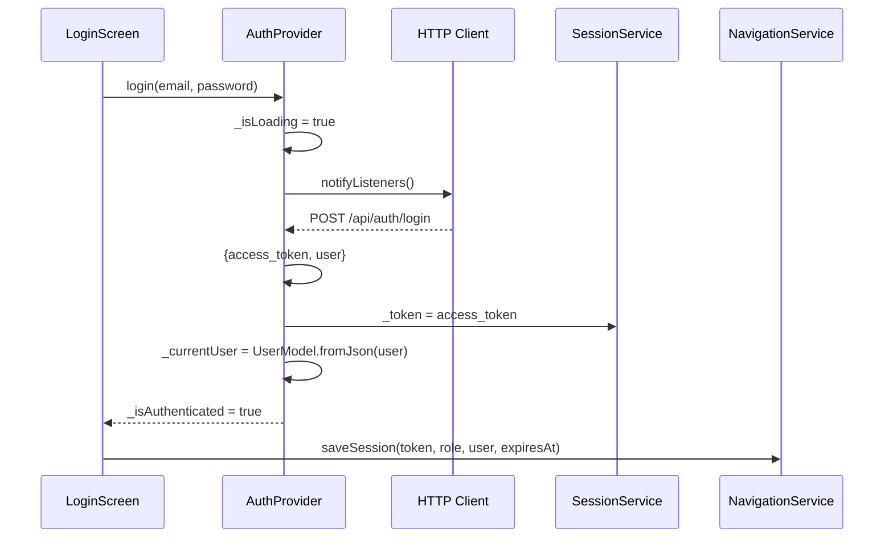
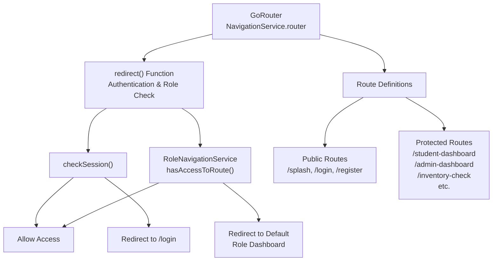
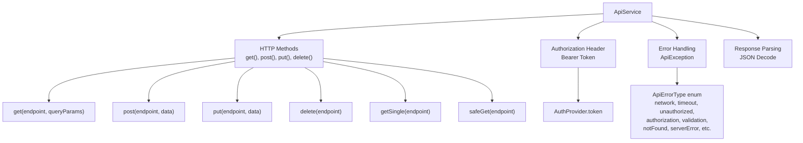
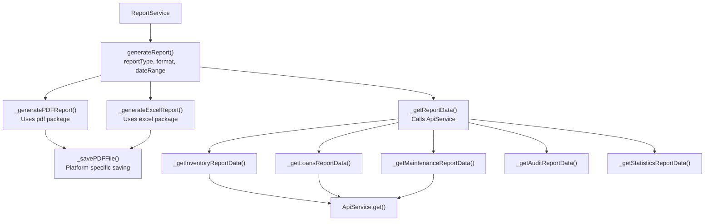
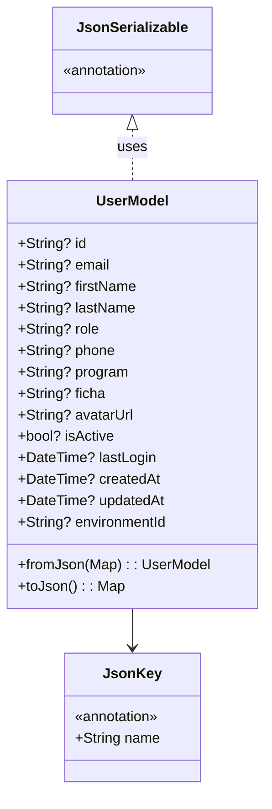
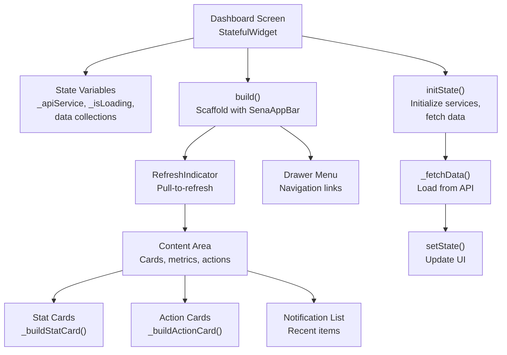

# Client Application (Flutter)

> **Relevant source files**
> * [client/lib/core/services/api_service.dart](https://github.com/axchisan/GestionInventarioSENA/blob/a6b12d01/client/lib/core/services/api_service.dart)
> * [client/lib/core/services/navigation_service.dart](https://github.com/axchisan/GestionInventarioSENA/blob/a6b12d01/client/lib/core/services/navigation_service.dart)
> * [client/lib/core/services/report_service.dart](https://github.com/axchisan/GestionInventarioSENA/blob/a6b12d01/client/lib/core/services/report_service.dart)
> * [client/lib/data/models/environment_model.g.dart](https://github.com/axchisan/GestionInventarioSENA/blob/a6b12d01/client/lib/data/models/environment_model.g.dart)
> * [client/lib/data/models/user_model.dart](https://github.com/axchisan/GestionInventarioSENA/blob/a6b12d01/client/lib/data/models/user_model.dart)
> * [client/lib/data/models/user_model.g.dart](https://github.com/axchisan/GestionInventarioSENA/blob/a6b12d01/client/lib/data/models/user_model.g.dart)
> * [client/lib/main.dart](https://github.com/axchisan/GestionInventarioSENA/blob/a6b12d01/client/lib/main.dart)
> * [client/lib/presentation/providers/auth_provider.dart](https://github.com/axchisan/GestionInventarioSENA/blob/a6b12d01/client/lib/presentation/providers/auth_provider.dart)
> * [client/lib/presentation/screens/auth/register_screen.dart](https://github.com/axchisan/GestionInventarioSENA/blob/a6b12d01/client/lib/presentation/screens/auth/register_screen.dart)
> * [client/lib/presentation/screens/dashboard/student_dashboard.dart](https://github.com/axchisan/GestionInventarioSENA/blob/a6b12d01/client/lib/presentation/screens/dashboard/student_dashboard.dart)
> * [client/lib/presentation/screens/statistics/statistics_dashboard.dart](https://github.com/axchisan/GestionInventarioSENA/blob/a6b12d01/client/lib/presentation/screens/statistics/statistics_dashboard.dart)

## Purpose and Scope

This document describes the Flutter client application architecture, including the service layer pattern, state management with Provider, navigation system, and screen organization. The client provides mobile and web interfaces for all user roles in the SENA Inventory Management System.

For authentication flows, see [Client-Side Authentication](/axchisan/GestionInventarioSENA/3.1-client-side-authentication). For role-based access control, see [Role-Based Access Control](/axchisan/GestionInventarioSENA/3.3-role-based-access-control). For specific dashboard implementations, see [Dashboard Screens](/axchisan/GestionInventarioSENA/4-dashboard-screens).

---

## Application Architecture

The Flutter client follows a layered architecture with clear separation of concerns:



**Sources:** [client/lib/main.dart L1-L75](https://github.com/axchisan/GestionInventarioSENA/blob/a6b12d01/client/lib/main.dart#L1-L75)

 [client/lib/core/services/navigation_service.dart L1-L224](https://github.com/axchisan/GestionInventarioSENA/blob/a6b12d01/client/lib/core/services/navigation_service.dart#L1-L224)

 [client/lib/core/services/api_service.dart L1-L720](https://github.com/axchisan/GestionInventarioSENA/blob/a6b12d01/client/lib/core/services/api_service.dart#L1-L720)

### Layer Responsibilities

| Layer | Purpose | Key Components |
| --- | --- | --- |
| **Presentation** | UI rendering and user interaction | Screens, Widgets, Forms |
| **State Management** | Application state and business logic | `AuthProvider`, `LoanProvider` |
| **Service** | External communication and utilities | `ApiService`, `NavigationService`, `ReportService` |
| **Data** | Data structures and persistence | Models, `SharedPreferences` |

---

## Application Entry Point

The application initializes services and sets up the Provider tree in `main.dart`:



The `MultiProvider` wraps the application with the following providers:

| Provider | Type | Purpose |
| --- | --- | --- |
| `ThemeService` | Singleton | Dark/light theme management |
| `LanguageService` | Singleton | Localization support |
| `AuthProvider` | Instance | Authentication state |
| `LoanProvider` | Proxy | Loan management (depends on `AuthProvider`) |

**Sources:** [client/lib/main.dart L13-L43](https://github.com/axchisan/GestionInventarioSENA/blob/a6b12d01/client/lib/main.dart#L13-L43)

---

## State Management with Provider

The application uses the Provider pattern for state management. `ChangeNotifier` classes manage state and notify listeners when changes occur.

### AuthProvider Implementation



**Key State Variables:**

* `_currentUser`: Holds the authenticated user's data (`UserModel`)
* `_token`: JWT access token for API requests
* `_isAuthenticated`: Boolean flag for authentication status
* `_isLoading`: Loading state during async operations
* `_errorMessage`: Holds error messages for UI display

**Core Methods:**

| Method | Parameters | Purpose |
| --- | --- | --- |
| `login()` | email, password | Authenticates user, stores token and session |
| `register()` | email, password, firstName, lastName, role, etc. | Creates new user account |
| `logout()` | - | Clears session and resets state |
| `checkSession()` | - | Validates stored session on app startup |

**Sources:** [client/lib/presentation/providers/auth_provider.dart L1-L159](https://github.com/axchisan/GestionInventarioSENA/blob/a6b12d01/client/lib/presentation/providers/auth_provider.dart#L1-L159)

### State Change Flow

When a user logs in:



**Sources:** [client/lib/presentation/providers/auth_provider.dart L26-L64](https://github.com/axchisan/GestionInventarioSENA/blob/a6b12d01/client/lib/presentation/providers/auth_provider.dart#L26-L64)

 [client/lib/presentation/screens/auth/login_screen.dart](https://github.com/axchisan/GestionInventarioSENA/blob/a6b12d01/client/lib/presentation/screens/auth/login_screen.dart)

---

## Navigation System

The client uses `GoRouter` for declarative routing with built-in route guards and role-based access control.

### Router Configuration



The router configuration includes 30+ routes organized by feature:

| Route Pattern | Screen | Access Control |
| --- | --- | --- |
| `/splash` | `SplashScreen` | Public |
| `/login` | `LoginScreen` | Public |
| `/register` | `RegisterScreen` | Public |
| `/qr-scan` | `QRScanScreen` | Authenticated |
| `/inventory-check` | `InventoryCheckScreen` | Authenticated |
| `/student-dashboard` | `StudentDashboard` | Role: student |
| `/instructor-dashboard` | `InstructorDashboard` | Role: instructor |
| `/supervisor-dashboard` | `SupervisorDashboardScreen` | Role: supervisor |
| `/admin-dashboard` | `AdminDashboardScreen` | Role: admin |
| `/admin-general-dashboard` | `GeneralAdminDashboardScreen` | Role: admin_general |

**Sources:** [client/lib/core/services/navigation_service.dart L40-L219](https://github.com/axchisan/GestionInventarioSENA/blob/a6b12d01/client/lib/core/services/navigation_service.dart#L40-L219)

### Route Guard Implementation

The `redirect` function in `NavigationService` implements authentication and authorization checks:

**Logic Flow:**

1. Call `authProvider.checkSession()` to validate stored session
2. If not authenticated and accessing protected route → redirect to `/login`
3. If authenticated but lacks role permission → redirect to default role dashboard
4. Otherwise, allow navigation

**Sources:** [client/lib/core/services/navigation_service.dart L42-L57](https://github.com/axchisan/GestionInventarioSENA/blob/a6b12d01/client/lib/core/services/navigation_service.dart#L42-L57)

---

## Service Layer

The service layer provides reusable business logic and external integrations.

### ApiService Architecture

`ApiService` is the core HTTP client that handles all backend communication:



**Key Features:**

| Feature | Implementation | Purpose |
| --- | --- | --- |
| **Auto Authorization** | Injects `Bearer ${token}` header | Authenticates all requests |
| **Role-Based Query Params** | Adds `system_wide=true` for admin_general | Enables cross-environment access |
| **Error Categorization** | `ApiErrorType` enum with 12 types | Structured error handling |
| **Redirect Handling** | Detects 301/302/307 responses | Prevents redirect loops |
| **Retry Logic** | `isRecoverable` and `retryDelay` properties | Automatic retry for transient failures |

**Sources:** [client/lib/core/services/api_service.dart L1-L720](https://github.com/axchisan/GestionInventarioSENA/blob/a6b12d01/client/lib/core/services/api_service.dart#L1-L720)

### ApiService Usage Pattern

Screens and providers use `ApiService` to fetch data:

```yaml
// Initialize with AuthProvider
final _apiService = ApiService(
  authProvider: Provider.of<AuthProvider>(context, listen: false)
);

// Fetch data
final items = await _apiService.get(
  inventoryEndpoint,
  queryParams: {'environment_id': environmentId}
);

// Post data
final result = await _apiService.post(
  inventoryChecksEndpoint,
  {'status': 'pending', 'items': []}
);
```

**Sources:** [client/lib/presentation/screens/dashboard/student_dashboard.dart L31-L34](https://github.com/axchisan/GestionInventarioSENA/blob/a6b12d01/client/lib/presentation/screens/dashboard/student_dashboard.dart#L31-L34)

 [client/lib/core/services/api_service.dart L36-L65](https://github.com/axchisan/GestionInventarioSENA/blob/a6b12d01/client/lib/core/services/api_service.dart#L36-L65)

### ReportService

`ReportService` generates PDF and Excel reports from aggregated data:



**Supported Report Types:**

| Report Type | Data Source | Formats |
| --- | --- | --- |
| `inventory` | Inventory items with status breakdown | PDF, Excel |
| `loans` | Loan history and statistics | PDF, Excel |
| `maintenance` | Maintenance requests with cost tracking | PDF, Excel |
| `audit` | Audit log entries with action breakdown | PDF, Excel |
| `statistics` | Comprehensive system metrics | PDF, Excel |
| `inventory_checks` | Verification history | PDF, Excel |
| `alerts` | System alerts and notifications | PDF, Excel |
| `users` | User list with role distribution | PDF, Excel |

**Sources:** [client/lib/core/services/report_service.dart L1-L105](https://github.com/axchisan/GestionInventarioSENA/blob/a6b12d01/client/lib/core/services/report_service.dart#L1-L105)

 [client/lib/core/services/report_service.dart L26-L103](https://github.com/axchisan/GestionInventarioSENA/blob/a6b12d01/client/lib/core/services/report_service.dart#L26-L103)

---

## Data Models

Data models use `json_serializable` for automatic JSON serialization:

### UserModel Example



**Serialization Pattern:**

All models follow this pattern:

1. Annotate class with `@JsonSerializable()`
2. Annotate fields with `@JsonKey(name: 'snake_case_field')`
3. Implement factory constructor `fromJson(Map<String, dynamic>)`
4. Implement method `toJson() → Map<String, dynamic>`
5. Generate code with `part 'model_name.g.dart'`

**Example Models:**

| Model | File | Purpose |
| --- | --- | --- |
| `UserModel` | `user_model.dart` | User account data |
| `InventoryItemModel` | `inventory_item_model.dart` | Inventory item with quantities |
| `InventoryCheckModel` | `inventory_check_model.dart` | Verification record |
| `LoanModel` | `loan_model.dart` | Equipment loan |
| `MaintenanceRequestModel` | `maintenance_request_model.dart` | Repair request |
| `EnvironmentModel` | `environment_model.dart` | Physical location |
| `NotificationModel` | `notification_model.dart` | User notification |

**Sources:** [client/lib/data/models/user_model.dart L1-L55](https://github.com/axchisan/GestionInventarioSENA/blob/a6b12d01/client/lib/data/models/user_model.dart#L1-L55)

 [client/lib/data/models/user_model.g.dart L1-L48](https://github.com/axchisan/GestionInventarioSENA/blob/a6b12d01/client/lib/data/models/user_model.g.dart#L1-L48)

---

## Screen Organization

Screens are organized by feature in the `presentation/screens` directory:

### Directory Structure

```markdown
presentation/
├── screens/
│   ├── auth/               # Authentication screens
│   │   ├── login_screen.dart
│   │   └── register_screen.dart
│   ├── dashboard/          # Role-specific dashboards
│   │   ├── student_dashboard.dart
│   │   ├── instructor_dashboard.dart
│   │   ├── supervisor_dashboard_screen.dart
│   │   ├── admin_dashboard_screen.dart
│   │   └── general_admin_dashboard_screen.dart
│   ├── inventory/          # Inventory management
│   │   ├── inventory_check_screen.dart
│   │   ├── edit_inventory_item_screen.dart
│   │   ├── inventory_alerts_screen.dart
│   │   └── AddInventoryItemScreen.dart
│   ├── loan/               # Loan management
│   │   ├── loan_request_screen.dart
│   │   ├── loan_management_screen.dart
│   │   └── loan_history_screen.dart
│   ├── maintenance/        # Maintenance requests
│   │   └── maintenance_request_screen.dart
│   ├── qr/                 # QR code functionality
│   │   ├── qr_scan_screen.dart
│   │   └── qr_code_generator_screen.dart
│   ├── statistics/         # Analytics
│   │   └── statistics_dashboard.dart
│   ├── reports/            # Report generation
│   │   └── report_generator_screen.dart
│   ├── notifications/      # Notifications
│   │   └── notifications_screen.dart
│   ├── profile/            # User profile
│   │   └── profile_screen.dart
│   └── ...
└── widgets/
    ├── common/             # Reusable widgets
    │   ├── sena_app_bar.dart
    │   ├── notification_badge.dart
    │   └── ...
    └── ...
```

**Sources:** [client/lib/core/services/navigation_service.dart L8-L37](https://github.com/axchisan/GestionInventarioSENA/blob/a6b12d01/client/lib/core/services/navigation_service.dart#L8-L37)

### Screen Composition Pattern

Dashboard screens follow a consistent pattern:



**Common Dashboard Elements:**

| Component | Purpose | Implementation |
| --- | --- | --- |
| **SenaAppBar** | Consistent header with title and actions | Reusable widget |
| **Stat Cards** | Display key metrics (total items, damaged, etc.) | Grid layout with icons |
| **Action Cards** | Navigation to key features | GridView with route links |
| **Notification Section** | Recent notifications with unread count | List with badge indicator |
| **Drawer** | Side navigation menu | Role-specific menu items |

**Sources:** [client/lib/presentation/screens/dashboard/student_dashboard.dart L1-L774](https://github.com/axchisan/GestionInventarioSENA/blob/a6b12d01/client/lib/presentation/screens/dashboard/student_dashboard.dart#L1-L774)

---

## Common UI Patterns

### Loading States

Screens use a consistent loading pattern:

```javascript
@override
Widget build(BuildContext context) {
  return Scaffold(
    appBar: SenaAppBar(title: 'Dashboard'),
    body: _isLoading
        ? const Center(child: CircularProgressIndicator())
        : RefreshIndicator(
            onRefresh: _fetchData,
            child: SingleChildScrollView(
              child: Column(children: [...])
            )
          )
  );
}
```

**Sources:** [client/lib/presentation/screens/dashboard/student_dashboard.dart L139-L141](https://github.com/axchisan/GestionInventarioSENA/blob/a6b12d01/client/lib/presentation/screens/dashboard/student_dashboard.dart#L139-L141)

 [client/lib/presentation/screens/statistics/statistics_dashboard.dart L724-L734](https://github.com/axchisan/GestionInventarioSENA/blob/a6b12d01/client/lib/presentation/screens/statistics/statistics_dashboard.dart#L724-L734)

### Error Handling

Screens display errors using `SnackBar`:

```javascript
try {
  final data = await _apiService.get(endpoint);
  setState(() => _data = data);
} catch (e) {
  ScaffoldMessenger.of(context).showSnackBar(
    SnackBar(content: Text('Error: $e'))
  );
}
```

**Sources:** [client/lib/presentation/screens/dashboard/student_dashboard.dart L76-L83](https://github.com/axchisan/GestionInventarioSENA/blob/a6b12d01/client/lib/presentation/screens/dashboard/student_dashboard.dart#L76-L83)

### Data Refresh

Most screens implement pull-to-refresh:

```yaml
RefreshIndicator(
  onRefresh: _fetchData,  // Async method that reloads data
  child: SingleChildScrollView(...)
)
```

**Sources:** [client/lib/presentation/screens/dashboard/student_dashboard.dart L141-L143](https://github.com/axchisan/GestionInventarioSENA/blob/a6b12d01/client/lib/presentation/screens/dashboard/student_dashboard.dart#L141-L143)

---

## Platform Considerations

### Web vs Mobile Differences

The application handles platform-specific behavior:

| Feature | Web Implementation | Mobile Implementation |
| --- | --- | --- |
| **File Downloads** | Uses `html.AnchorElement` with `download` attribute | Uses `path_provider` and `Share` API |
| **Font Loading** | Fallback to basic fonts if Google Fonts fail | Uses `PdfGoogleFonts` for PDF generation |
| **Storage** | Browser localStorage via `SharedPreferences` | Device storage via `SharedPreferences` |
| **Navigation** | Browser back button integration | Hardware back button handling |

**Sources:** [client/lib/core/services/report_service.dart L503-L525](https://github.com/axchisan/GestionInventarioSENA/blob/a6b12d01/client/lib/core/services/report_service.dart#L503-L525)

### Responsive Design

Screens adapt to different screen sizes:

```yaml
GridView.count(
  crossAxisCount: 2,  // 2 columns on mobile
  crossAxisSpacing: 12,
  mainAxisSpacing: 12,
  childAspectRatio: 1.1,
  children: [...]
)
```

**Sources:** [client/lib/presentation/screens/dashboard/student_dashboard.dart L268-L275](https://github.com/axchisan/GestionInventarioSENA/blob/a6b12d01/client/lib/presentation/screens/dashboard/student_dashboard.dart#L268-L275)

---

## Testing Considerations

The architecture supports testability through:

1. **Dependency Injection**: Services are injected into screens and providers
2. **Provider Pattern**: State can be tested independently of UI
3. **Service Abstraction**: API calls can be mocked via `ApiService` interface
4. **Pure Functions**: Data transformations are testable without UI

**Example Testable Component:**

```python
// Service with injected dependencies
class ApiService {
  final http.Client _client;
  final AuthProvider? _authProvider;
  
  ApiService({
    http.Client? client,
    AuthProvider? authProvider
  }) : _client = client ?? http.Client(),
       _authProvider = authProvider;
}
```

**Sources:** [client/lib/core/services/api_service.dart L7-L10](https://github.com/axchisan/GestionInventarioSENA/blob/a6b12d01/client/lib/core/services/api_service.dart#L7-L10)