# Dashboard Screens

> **Relevant source files**
> * [client/lib/core/services/navigation_service.dart](https://github.com/axchisan/GestionInventarioSENA/blob/a6b12d01/client/lib/core/services/navigation_service.dart)
> * [client/lib/presentation/screens/dashboard/admin_dashboard_screen.dart](https://github.com/axchisan/GestionInventarioSENA/blob/a6b12d01/client/lib/presentation/screens/dashboard/admin_dashboard_screen.dart)
> * [client/lib/presentation/screens/dashboard/general_admin_dashboard_screen.dart](https://github.com/axchisan/GestionInventarioSENA/blob/a6b12d01/client/lib/presentation/screens/dashboard/general_admin_dashboard_screen.dart)
> * [client/lib/presentation/screens/dashboard/instructor_dashboard.dart](https://github.com/axchisan/GestionInventarioSENA/blob/a6b12d01/client/lib/presentation/screens/dashboard/instructor_dashboard.dart)
> * [client/lib/presentation/screens/dashboard/student_dashboard.dart](https://github.com/axchisan/GestionInventarioSENA/blob/a6b12d01/client/lib/presentation/screens/dashboard/student_dashboard.dart)
> * [client/lib/presentation/screens/dashboard/supervisor_dashboard_screen.dart](https://github.com/axchisan/GestionInventarioSENA/blob/a6b12d01/client/lib/presentation/screens/dashboard/supervisor_dashboard_screen.dart)

## Purpose and Scope

This document describes the role-specific dashboard screens that serve as the main entry point for authenticated users. Each dashboard displays relevant metrics, recent activity, and provides quick navigation to key features based on the user's role and permissions.

For authentication and role assignment, see [Authentication & Authorization](/axchisan/GestionInventarioSENA/3-authentication-and-authorization). For details on individual role capabilities, see [Role-Based Access Control](/axchisan/GestionInventarioSENA/3.3-role-based-access-control). For statistics and analytics features, see [Statistics Dashboard](/axchisan/GestionInventarioSENA/9.3-statistics-dashboard).

## Dashboard Architecture Overview

The system implements five distinct dashboard screens, each tailored to a specific user role:

| Role | Dashboard Screen | Route | Primary Focus |
| --- | --- | --- | --- |
| Student | `StudentDashboard` | `/student-dashboard` | Inventory verification and maintenance requests |
| Instructor | `InstructorDashboard` | `/instructor-dashboard` | Environment management and loan oversight |
| Supervisor | `SupervisorDashboardScreen` | `/supervisor-dashboard` | Verification review and maintenance monitoring |
| Admin | `AdminDashboardScreen` | `/admin-dashboard` | Warehouse inventory and loan management |
| Admin General | `GeneralAdminDashboardScreen` | `/admin-general-dashboard` | System-wide metrics and user management |

### Dashboard Routing Flow

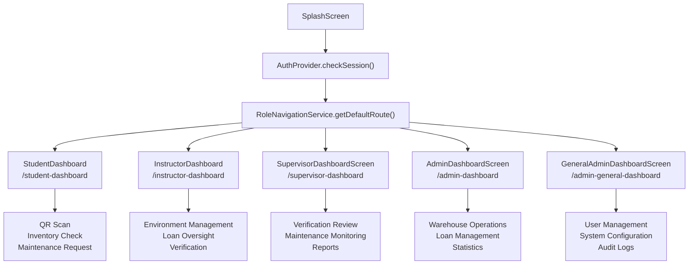

**Sources:** [client/lib/core/services/navigation_service.dart L40-L58](https://github.com/axchisan/GestionInventarioSENA/blob/a6b12d01/client/lib/core/services/navigation_service.dart#L40-L58)

 [client/lib/presentation/screens/splash/splash_screen.dart](https://github.com/axchisan/GestionInventarioSENA/blob/a6b12d01/client/lib/presentation/screens/splash/splash_screen.dart)

### Navigation Service Integration

The `NavigationService` class configures routing with automatic role-based redirection:

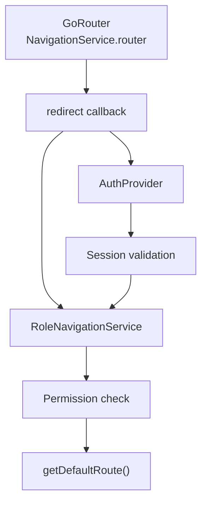

The redirect logic at [client/lib/core/services/navigation_service.dart L42-L56](https://github.com/axchisan/GestionInventarioSENA/blob/a6b12d01/client/lib/core/services/navigation_service.dart#L42-L56)

 enforces that:

1. Unauthenticated users are redirected to `/login`
2. Authenticated users without route access are redirected to their role-specific default dashboard
3. The `RoleNavigationService.hasAccessToRoute()` method validates permissions

**Sources:** [client/lib/core/services/navigation_service.dart L40-L224](https://github.com/axchisan/GestionInventarioSENA/blob/a6b12d01/client/lib/core/services/navigation_service.dart#L40-L224)

## Common Dashboard Patterns

All dashboard implementations share a consistent structure and set of reusable UI components.

### Dashboard Component Structure

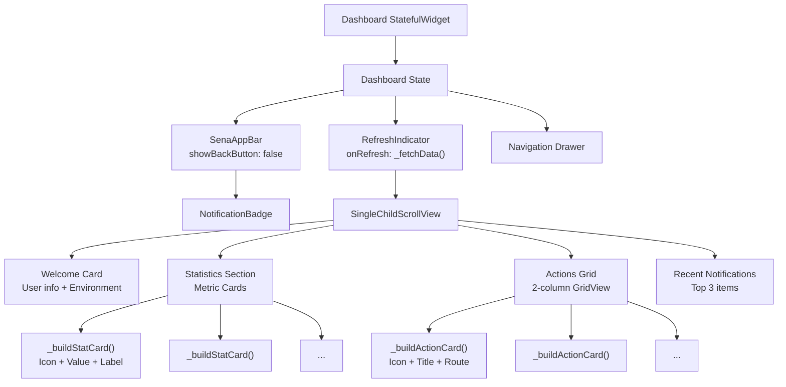

**Sources:** [client/lib/presentation/screens/dashboard/student_dashboard.dart L120-L409](https://github.com/axchisan/GestionInventarioSENA/blob/a6b12d01/client/lib/presentation/screens/dashboard/student_dashboard.dart#L120-L409)

 [client/lib/presentation/screens/dashboard/instructor_dashboard.dart L140-L470](https://github.com/axchisan/GestionInventarioSENA/blob/a6b12d01/client/lib/presentation/screens/dashboard/instructor_dashboard.dart#L140-L470)

### Stat Card Pattern

All dashboards use a consistent `_buildStatCard()` method to display metrics:

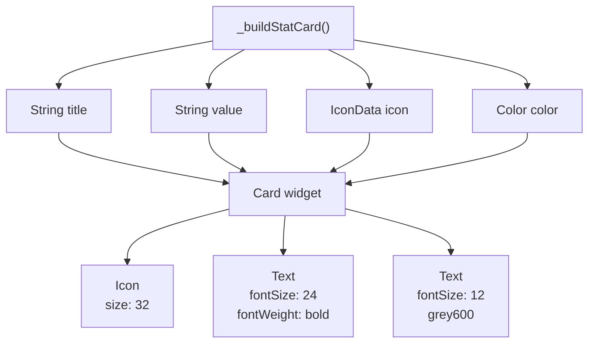

Example implementations:

* [client/lib/presentation/screens/dashboard/student_dashboard.dart L556-L586](https://github.com/axchisan/GestionInventarioSENA/blob/a6b12d01/client/lib/presentation/screens/dashboard/student_dashboard.dart#L556-L586)
* [client/lib/presentation/screens/dashboard/instructor_dashboard.dart L617-L647](https://github.com/axchisan/GestionInventarioSENA/blob/a6b12d01/client/lib/presentation/screens/dashboard/instructor_dashboard.dart#L617-L647)
* [client/lib/presentation/screens/dashboard/supervisor_dashboard_screen.dart L787-L817](https://github.com/axchisan/GestionInventarioSENA/blob/a6b12d01/client/lib/presentation/screens/dashboard/supervisor_dashboard_screen.dart#L787-L817)

**Sources:** [client/lib/presentation/screens/dashboard/student_dashboard.dart L556-L586](https://github.com/axchisan/GestionInventarioSENA/blob/a6b12d01/client/lib/presentation/screens/dashboard/student_dashboard.dart#L556-L586)

 [client/lib/presentation/screens/dashboard/instructor_dashboard.dart L617-L647](https://github.com/axchisan/GestionInventarioSENA/blob/a6b12d01/client/lib/presentation/screens/dashboard/instructor_dashboard.dart#L617-L647)

### Action Card Pattern

Action cards provide navigation to key features with a consistent interface:

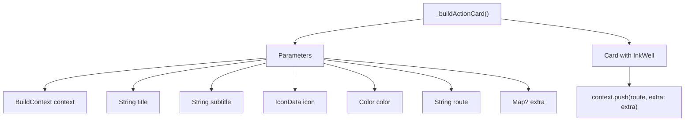

**Sources:** [client/lib/presentation/screens/dashboard/student_dashboard.dart L588-L627](https://github.com/axchisan/GestionInventarioSENA/blob/a6b12d01/client/lib/presentation/screens/dashboard/student_dashboard.dart#L588-L627)

 [client/lib/presentation/screens/dashboard/instructor_dashboard.dart L649-L688](https://github.com/axchisan/GestionInventarioSENA/blob/a6b12d01/client/lib/presentation/screens/dashboard/instructor_dashboard.dart#L649-L688)

### Data Fetching Pattern

All dashboards follow a consistent data loading pattern:

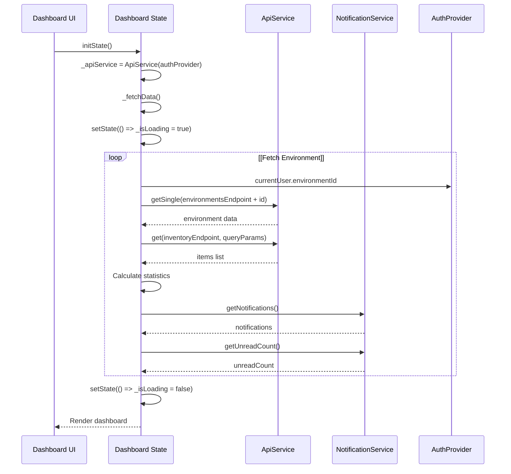

Key methods:

* `_fetchData()` - Main data loading orchestrator
* `_fetchEnvironment()` - Loads environment details
* `_fetchInventoryStats()` - Calculates inventory metrics
* `_fetchNotifications()` - Loads recent notifications

**Sources:** [client/lib/presentation/screens/dashboard/instructor_dashboard.dart L36-L131](https://github.com/axchisan/GestionInventarioSENA/blob/a6b12d01/client/lib/presentation/screens/dashboard/instructor_dashboard.dart#L36-L131)

 [client/lib/presentation/screens/dashboard/supervisor_dashboard_screen.dart L38-L207](https://github.com/axchisan/GestionInventarioSENA/blob/a6b12d01/client/lib/presentation/screens/dashboard/supervisor_dashboard_screen.dart#L38-L207)

## Dashboard Implementations

### Student Dashboard

The `StudentDashboard` at [client/lib/presentation/screens/dashboard/student_dashboard.dart L12-L774](https://github.com/axchisan/GestionInventarioSENA/blob/a6b12d01/client/lib/presentation/screens/dashboard/student_dashboard.dart#L12-L774)

 provides students with basic operational capabilities.

#### Displayed Metrics

| Metric | Source | Calculation |
| --- | --- | --- |
| Equipos Totales | `_items` | Sum of all item quantities |
| Disponibles | `_items` | `quantity - quantity_damaged - quantity_missing` |
| Dañados | `_items` | Sum of `quantity_damaged` |
| Faltantes | `_items` | Sum of `quantity_missing` |

Calculation methods at [client/lib/presentation/screens/dashboard/student_dashboard.dart L86-L112](https://github.com/axchisan/GestionInventarioSENA/blob/a6b12d01/client/lib/presentation/screens/dashboard/student_dashboard.dart#L86-L112)

#### Available Actions

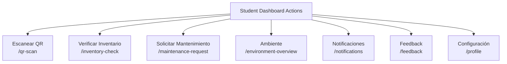

Action grid at [client/lib/presentation/screens/dashboard/student_dashboard.dart L268-L335](https://github.com/axchisan/GestionInventarioSENA/blob/a6b12d01/client/lib/presentation/screens/dashboard/student_dashboard.dart#L268-L335)

**Sources:** [client/lib/presentation/screens/dashboard/student_dashboard.dart L1-L774](https://github.com/axchisan/GestionInventarioSENA/blob/a6b12d01/client/lib/presentation/screens/dashboard/student_dashboard.dart#L1-L774)

### Instructor Dashboard

The `InstructorDashboard` at [client/lib/presentation/screens/dashboard/instructor_dashboard.dart L12-L851](https://github.com/axchisan/GestionInventarioSENA/blob/a6b12d01/client/lib/presentation/screens/dashboard/instructor_dashboard.dart#L12-L851)

 focuses on environment management and verification oversight.

#### Displayed Metrics

| Metric | Source | Description |
| --- | --- | --- |
| Items Totales | `_inventoryStats['total_quantity']` | Total quantity across all items |
| Disponibles | `_inventoryStats['available_quantity']` | Available units (total - damaged - missing) |
| En Préstamo | `_inventoryStats['in_use']` | Items with status 'in_use' |
| Dañados | `_inventoryStats['damaged_quantity']` | Damaged units |
| Faltantes | `_inventoryStats['missing_quantity']` | Missing units |

Statistics calculation at [client/lib/presentation/screens/dashboard/instructor_dashboard.dart L69-L117](https://github.com/axchisan/GestionInventarioSENA/blob/a6b12d01/client/lib/presentation/screens/dashboard/instructor_dashboard.dart#L69-L117)

#### Available Actions

The instructor dashboard provides 10 action cards arranged in a 2-column grid:

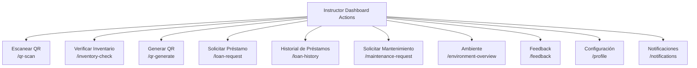

Grid implementation at [client/lib/presentation/screens/dashboard/instructor_dashboard.dart L303-L395](https://github.com/axchisan/GestionInventarioSENA/blob/a6b12d01/client/lib/presentation/screens/dashboard/instructor_dashboard.dart#L303-L395)

**Sources:** [client/lib/presentation/screens/dashboard/instructor_dashboard.dart L1-L851](https://github.com/axchisan/GestionInventarioSENA/blob/a6b12d01/client/lib/presentation/screens/dashboard/instructor_dashboard.dart#L1-L851)

### Supervisor Dashboard

The `SupervisorDashboardScreen` at [client/lib/presentation/screens/dashboard/supervisor_dashboard_screen.dart L12-L1082](https://github.com/axchisan/GestionInventarioSENA/blob/a6b12d01/client/lib/presentation/screens/dashboard/supervisor_dashboard_screen.dart#L12-L1082)

 provides oversight and monitoring capabilities.

#### Displayed Metrics

Supervisors see the most detailed statistics breakdown:

| Section | Metrics | Purpose |
| --- | --- | --- |
| Primary Stats | Total, Available, In Use, Damaged, Missing, Maintenance, Pending Requests | Quick overview |
| Detailed Breakdown | Total Units, Available Units, Damaged Units, Missing Units, Maintenance Items, In Use Items | Granular analysis |

The dashboard calculates both item counts and unit quantities:

* Item counts: Number of distinct items with each status
* Unit quantities: Total number of units (accounting for `quantity` field)

Calculation logic at [client/lib/presentation/screens/dashboard/supervisor_dashboard_screen.dart L49-L207](https://github.com/axchisan/GestionInventarioSENA/blob/a6b12d01/client/lib/presentation/screens/dashboard/supervisor_dashboard_screen.dart#L49-L207)

#### Available Actions

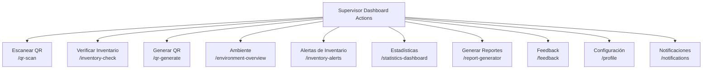

Grid at [client/lib/presentation/screens/dashboard/supervisor_dashboard_screen.dart L454-L544](https://github.com/axchisan/GestionInventarioSENA/blob/a6b12d01/client/lib/presentation/screens/dashboard/supervisor_dashboard_screen.dart#L454-L544)

**Sources:** [client/lib/presentation/screens/dashboard/supervisor_dashboard_screen.dart L1-L1082](https://github.com/axchisan/GestionInventarioSENA/blob/a6b12d01/client/lib/presentation/screens/dashboard/supervisor_dashboard_screen.dart#L1-L1082)

### Admin Dashboard

The `AdminDashboardScreen` at [client/lib/presentation/screens/dashboard/admin_dashboard_screen.dart L9-L584](https://github.com/axchisan/GestionInventarioSENA/blob/a6b12d01/client/lib/presentation/screens/dashboard/admin_dashboard_screen.dart#L9-L584)

 manages warehouse operations and loan management.

#### Data Source

Admin dashboard uses `UserManagementService.getDashboardStats()` to fetch aggregated metrics:

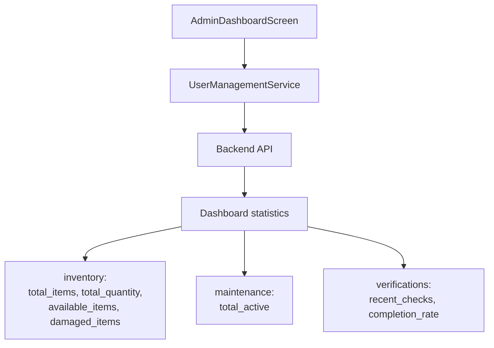

Method at [client/lib/presentation/screens/dashboard/admin_dashboard_screen.dart L27-L49](https://github.com/axchisan/GestionInventarioSENA/blob/a6b12d01/client/lib/presentation/screens/dashboard/admin_dashboard_screen.dart#L27-L49)

#### Displayed Metrics

| Metric | Field | Description |
| --- | --- | --- |
| Total Equipos | `inventory.total_quantity` | Total equipment units |
| Items Únicos | `inventory.total_items` | Distinct item types |
| Disponibles | `inventory.available_items` | Items with available status |
| En Uso | `inventory.in_use_items` | Items currently in use |
| Dañados | `inventory.damaged_quantity` | Damaged units |
| Mantenimiento | `maintenance.total_active` | Active maintenance requests |

#### System Status Panel

Additional metrics displayed in the "Estado del Sistema" card:

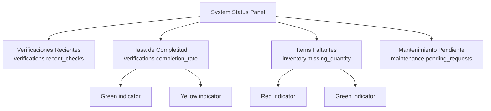

Panel at [client/lib/presentation/screens/dashboard/admin_dashboard_screen.dart L298-L350](https://github.com/axchisan/GestionInventarioSENA/blob/a6b12d01/client/lib/presentation/screens/dashboard/admin_dashboard_screen.dart#L298-L350)

#### Available Actions

Admin dashboard provides 10 management actions:

* Historial de Préstamos - `/loan-history`
* Gestión de Préstamos - `/loan-management`
* Gestión de Almacen - `/environment-overview`
* Escáner QR - `/qr-scan`
* Generador QR - `/qr-generator`
* Estadísticas Avanzadas - `/statistics-dashboard`
* Alertas del Sistema - `/inventory-alerts`
* Generador de Reportes - `/report-generator`
* Feedback del Sistema - `/feedback-form`
* Configuración - `/profile`

Grid at [client/lib/presentation/screens/dashboard/admin_dashboard_screen.dart L206-L295](https://github.com/axchisan/GestionInventarioSENA/blob/a6b12d01/client/lib/presentation/screens/dashboard/admin_dashboard_screen.dart#L206-L295)

**Sources:** [client/lib/presentation/screens/dashboard/admin_dashboard_screen.dart L1-L584](https://github.com/axchisan/GestionInventarioSENA/blob/a6b12d01/client/lib/presentation/screens/dashboard/admin_dashboard_screen.dart#L1-L584)

### Admin General Dashboard

The `GeneralAdminDashboardScreen` at [client/lib/presentation/screens/dashboard/general_admin_dashboard_screen.dart L9-L515](https://github.com/axchisan/GestionInventarioSENA/blob/a6b12d01/client/lib/presentation/screens/dashboard/general_admin_dashboard_screen.dart#L9-L515)

 provides system-wide oversight.

#### Global Metrics

Uses `UserManagementService.getAdminDashboardStats()` to fetch system-wide statistics:

| Metric | Field | Description |
| --- | --- | --- |
| Usuarios Totales | `global_metrics.total_users` | All registered users |
| Equipos Totales | `global_metrics.total_equipment` | Total equipment across all environments |
| Ambientes | `global_metrics.total_environments` | Total environments |
| Préstamos Activos | `global_metrics.active_loans` | Currently active loans |
| Usuarios Activos | `global_metrics.active_users` | Recently active users |
| Mantenimiento Pendiente | `global_metrics.pending_maintenance` | Pending maintenance requests |

Method at [client/lib/presentation/screens/dashboard/general_admin_dashboard_screen.dart L27-L48](https://github.com/axchisan/GestionInventarioSENA/blob/a6b12d01/client/lib/presentation/screens/dashboard/general_admin_dashboard_screen.dart#L27-L48)

#### Activity Feed

Displays recent system events in a card-based activity timeline:

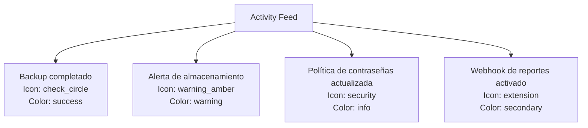

Activity list at [client/lib/presentation/screens/dashboard/general_admin_dashboard_screen.dart L262-L296](https://github.com/axchisan/GestionInventarioSENA/blob/a6b12d01/client/lib/presentation/screens/dashboard/general_admin_dashboard_screen.dart#L262-L296)

 component definition at [client/lib/presentation/screens/dashboard/general_admin_dashboard_screen.dart L487-L514](https://github.com/axchisan/GestionInventarioSENA/blob/a6b12d01/client/lib/presentation/screens/dashboard/general_admin_dashboard_screen.dart#L487-L514)

#### Available Actions

Admin general has access to 9 system-wide management features:

* Gestión de Usuarios - `/user-management`
* Solicitudes de Préstamo - `/loan-history`
* Ambientes - `/environment-overview`
* Estadísticas - `/statistics-dashboard`
* Alertas - `/inventory-alerts`
* Auditoría - `/audit-log`
* Reportes - `/report-generator`
* Feedback - `/feedback-form`
* Configuración - `/profile`

Grid at [client/lib/presentation/screens/dashboard/general_admin_dashboard_screen.dart L173-L254](https://github.com/axchisan/GestionInventarioSENA/blob/a6b12d01/client/lib/presentation/screens/dashboard/general_admin_dashboard_screen.dart#L173-L254)

**Sources:** [client/lib/presentation/screens/dashboard/general_admin_dashboard_screen.dart L1-L515](https://github.com/axchisan/GestionInventarioSENA/blob/a6b12d01/client/lib/presentation/screens/dashboard/general_admin_dashboard_screen.dart#L1-L515)

## Notification Integration

All dashboards integrate with the notification system to display recent alerts and unread counts.

### Notification Display Pattern

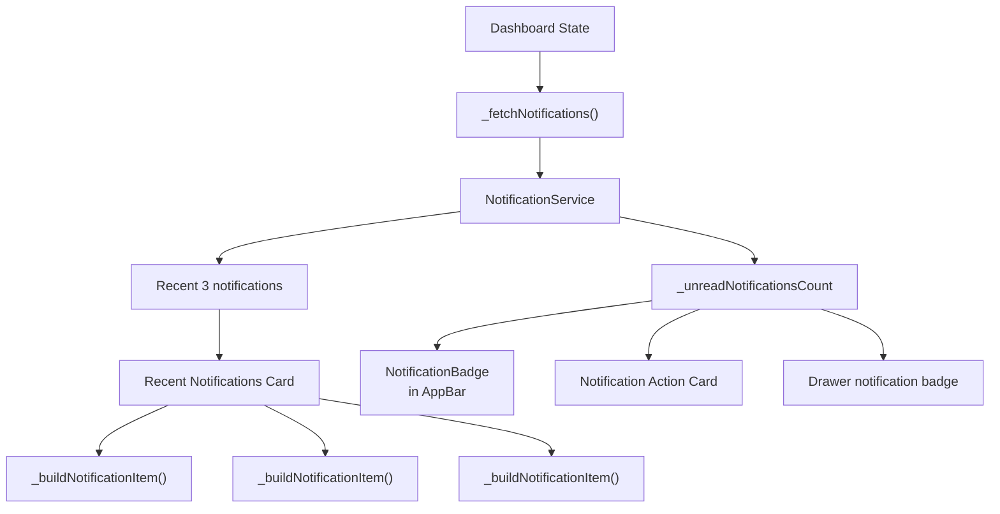

#### Notification Color Mapping

All dashboards use consistent color coding for notification types:

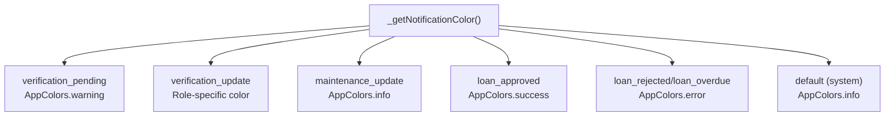

Implementation examples:

* [client/lib/presentation/screens/dashboard/student_dashboard.dart L475-L491](https://github.com/axchisan/GestionInventarioSENA/blob/a6b12d01/client/lib/presentation/screens/dashboard/student_dashboard.dart#L475-L491)
* [client/lib/presentation/screens/dashboard/instructor_dashboard.dart L536-L552](https://github.com/axchisan/GestionInventarioSENA/blob/a6b12d01/client/lib/presentation/screens/dashboard/instructor_dashboard.dart#L536-L552)
* [client/lib/presentation/screens/dashboard/supervisor_dashboard_screen.dart L704-L721](https://github.com/axchisan/GestionInventarioSENA/blob/a6b12d01/client/lib/presentation/screens/dashboard/supervisor_dashboard_screen.dart#L704-L721)

**Sources:** [client/lib/presentation/screens/dashboard/instructor_dashboard.dart L119-L131](https://github.com/axchisan/GestionInventarioSENA/blob/a6b12d01/client/lib/presentation/screens/dashboard/instructor_dashboard.dart#L119-L131)

 [client/lib/presentation/screens/dashboard/student_dashboard.dart L60-L84](https://github.com/axchisan/GestionInventarioSENA/blob/a6b12d01/client/lib/presentation/screens/dashboard/student_dashboard.dart#L60-L84)

## Drawer Navigation

All dashboards include a navigation drawer with role-specific menu items.

### Drawer Structure

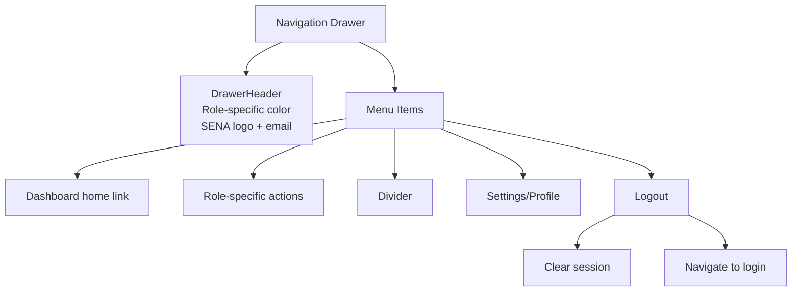

Common drawer implementation pattern across all dashboards:

* [client/lib/presentation/screens/dashboard/student_dashboard.dart L629-L773](https://github.com/axchisan/GestionInventarioSENA/blob/a6b12d01/client/lib/presentation/screens/dashboard/student_dashboard.dart#L629-L773)
* [client/lib/presentation/screens/dashboard/instructor_dashboard.dart L690-L849](https://github.com/axchisan/GestionInventarioSENA/blob/a6b12d01/client/lib/presentation/screens/dashboard/instructor_dashboard.dart#L690-L849)
* [client/lib/presentation/screens/dashboard/supervisor_dashboard_screen.dart L860-L1082](https://github.com/axchisan/GestionInventarioSENA/blob/a6b12d01/client/lib/presentation/screens/dashboard/supervisor_dashboard_screen.dart#L860-L1082)

**Sources:** [client/lib/presentation/screens/dashboard/student_dashboard.dart L629-L773](https://github.com/axchisan/GestionInventarioSENA/blob/a6b12d01/client/lib/presentation/screens/dashboard/student_dashboard.dart#L629-L773)

 [client/lib/presentation/screens/dashboard/instructor_dashboard.dart L690-L849](https://github.com/axchisan/GestionInventarioSENA/blob/a6b12d01/client/lib/presentation/screens/dashboard/instructor_dashboard.dart#L690-L849)

## Dashboard Lifecycle

### State Management Flow

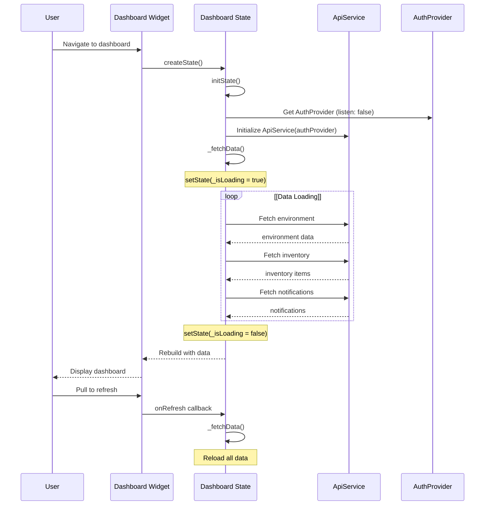

### Refresh Mechanism

All dashboards wrap their content in a `RefreshIndicator` at the top level:

```yaml
RefreshIndicator(
  onRefresh: _fetchData,
  child: SingleChildScrollView(
    // Dashboard content
  ),
)
```

This allows users to pull down to refresh all dashboard data.

**Sources:** [client/lib/presentation/screens/dashboard/instructor_dashboard.dart L28-L137](https://github.com/axchisan/GestionInventarioSENA/blob/a6b12d01/client/lib/presentation/screens/dashboard/instructor_dashboard.dart#L28-L137)

 [client/lib/presentation/screens/dashboard/supervisor_dashboard_screen.dart L29-L213](https://github.com/axchisan/GestionInventarioSENA/blob/a6b12d01/client/lib/presentation/screens/dashboard/supervisor_dashboard_screen.dart#L29-L213)

## Environment Context

Most dashboards display environment-specific information when users are linked to an environment.

### Environment Linking

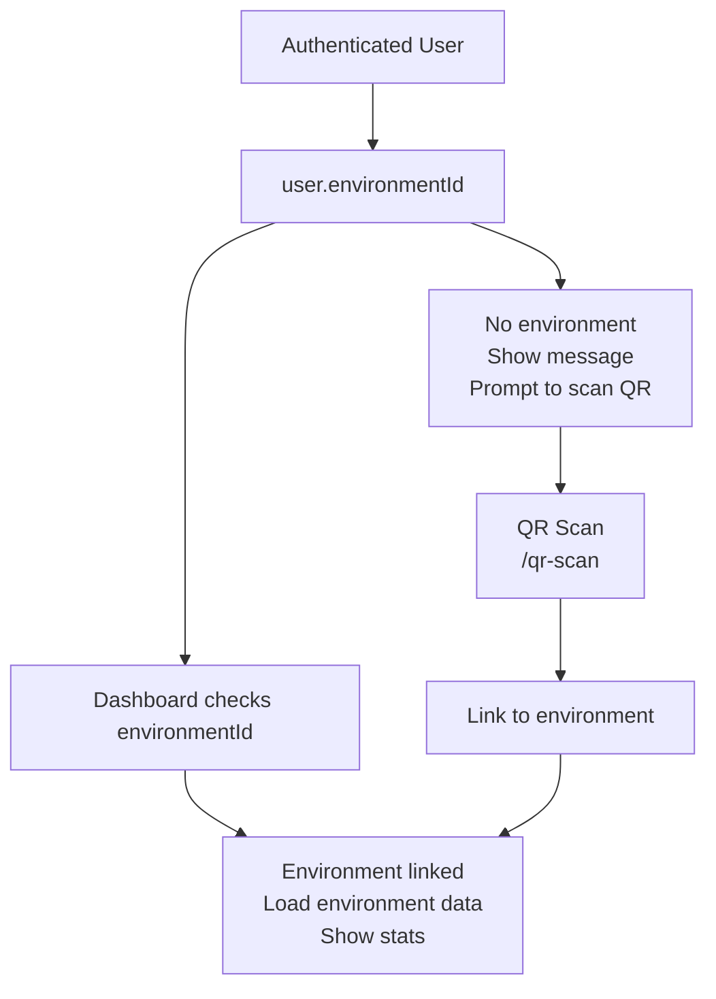

Environment check pattern at:

* [client/lib/presentation/screens/dashboard/instructor_dashboard.dart L46-L67](https://github.com/axchisan/GestionInventarioSENA/blob/a6b12d01/client/lib/presentation/screens/dashboard/instructor_dashboard.dart#L46-L67)
* [client/lib/presentation/screens/dashboard/student_dashboard.dart L40-L50](https://github.com/axchisan/GestionInventarioSENA/blob/a6b12d01/client/lib/presentation/screens/dashboard/student_dashboard.dart#L40-L50)
* [client/lib/presentation/screens/dashboard/supervisor_dashboard_screen.dart L43-L188](https://github.com/axchisan/GestionInventarioSENA/blob/a6b12d01/client/lib/presentation/screens/dashboard/supervisor_dashboard_screen.dart#L43-L188)

**Sources:** [client/lib/presentation/screens/dashboard/instructor_dashboard.dart L46-L67](https://github.com/axchisan/GestionInventarioSENA/blob/a6b12d01/client/lib/presentation/screens/dashboard/instructor_dashboard.dart#L46-L67)

 [client/lib/presentation/screens/dashboard/student_dashboard.dart L36-L84](https://github.com/axchisan/GestionInventarioSENA/blob/a6b12d01/client/lib/presentation/screens/dashboard/student_dashboard.dart#L36-L84)