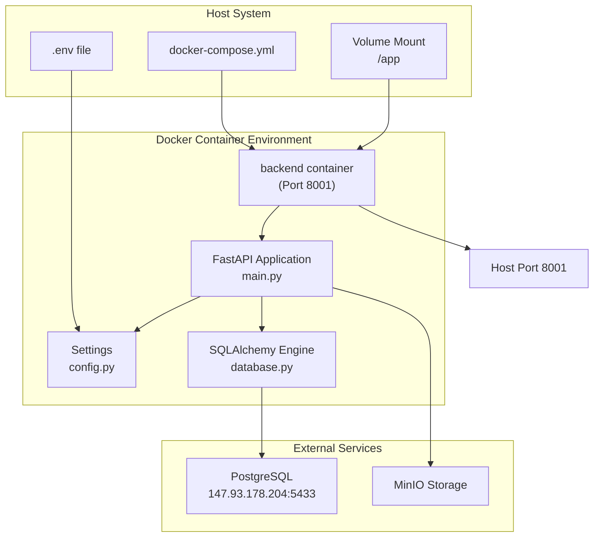
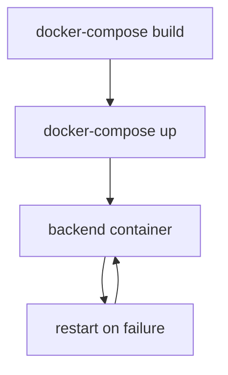
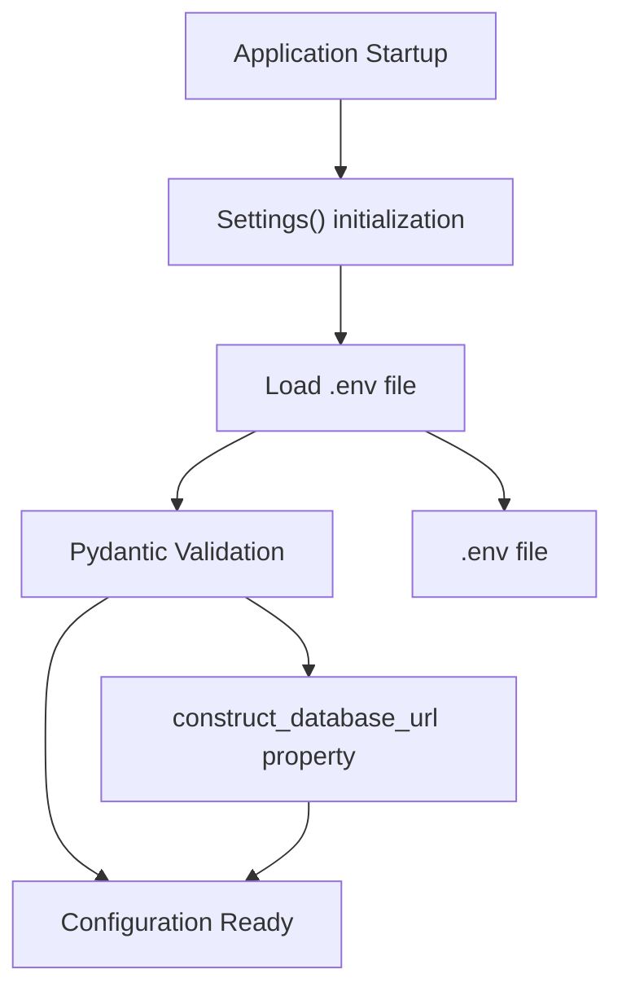
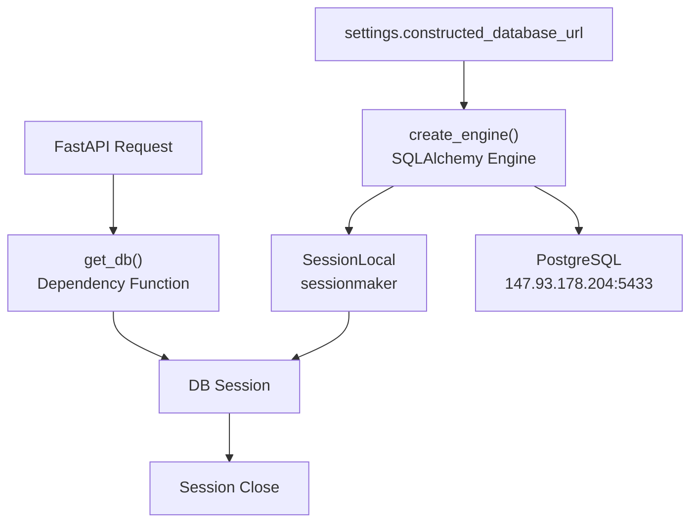
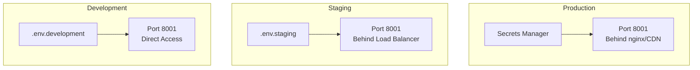
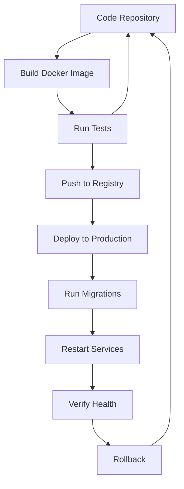

# Deployment & Configuration

> **Relevant source files**
> * [client/lib/core/services/session_service.dart](https://github.com/axchisan/GestionInventarioSENA/blob/a6b12d01/client/lib/core/services/session_service.dart)
> * [client/lib/presentation/screens/qr/qr_code_generator_screen.dart](https://github.com/axchisan/GestionInventarioSENA/blob/a6b12d01/client/lib/presentation/screens/qr/qr_code_generator_screen.dart)
> * [server/.env](https://github.com/axchisan/GestionInventarioSENA/blob/a6b12d01/server/.env)
> * [server/.gitignore](https://github.com/axchisan/GestionInventarioSENA/blob/a6b12d01/server/.gitignore)
> * [server/app/config.py](https://github.com/axchisan/GestionInventarioSENA/blob/a6b12d01/server/app/config.py)
> * [server/app/database.py](https://github.com/axchisan/GestionInventarioSENA/blob/a6b12d01/server/app/database.py)
> * [server/docker-compose.yml](https://github.com/axchisan/GestionInventarioSENA/blob/a6b12d01/server/docker-compose.yml)

## Purpose & Scope

This document describes the deployment architecture and configuration management for the SENA Inventory Management System. It covers the Docker-based containerization setup, environment variable configuration, database connection management, and production deployment considerations for the FastAPI backend server.

For client application setup and Flutter-specific configuration, see [Client Application (Flutter)](/axchisan/GestionInventarioSENA/2.1-client-application-(flutter)). For backend API architecture and routing, see [Backend API (FastAPI)](/axchisan/GestionInventarioSENA/2.2-backend-api-(fastapi)).

---

## Deployment Architecture Overview

The system uses Docker containerization for simplified deployment and environment consistency. The backend FastAPI application runs in a Docker container with network isolation and volume mounting for development.

**Deployment Architecture Diagram**



**Sources:** [server/docker-compose.yml L1-L20](https://github.com/axchisan/GestionInventarioSENA/blob/a6b12d01/server/docker-compose.yml#L1-L20)

 [server/app/config.py L1-L27](https://github.com/axchisan/GestionInventarioSENA/blob/a6b12d01/server/app/config.py#L1-L27)

 [server/app/database.py L1-L18](https://github.com/axchisan/GestionInventarioSENA/blob/a6b12d01/server/app/database.py#L1-L18)

---

## Docker Compose Configuration

The application uses Docker Compose to orchestrate the backend container. The configuration defines a single service with volume mounting for live code updates during development.

### Service Definition

| Configuration | Value | Description |
| --- | --- | --- |
| **Service Name** | `backend` | Main FastAPI application service |
| **Build Context** | `.` | Dockerfile located in server directory |
| **Port Mapping** | `8001:8001` | Host port 8001 maps to container port 8001 |
| **Volume Mount** | `.:/app` | Live code reload for development |
| **Network** | `app-network` | Bridge network for service isolation |
| **Restart Policy** | `on-failure` | Automatic restart on container failure |

The Docker Compose file is minimal and focused on development convenience with volume mounting at [server/docker-compose.yml L10-L11](https://github.com/axchisan/GestionInventarioSENA/blob/a6b12d01/server/docker-compose.yml#L10-L11)

**Docker Compose Service Flow**



**Sources:** [server/docker-compose.yml L1-L20](https://github.com/axchisan/GestionInventarioSENA/blob/a6b12d01/server/docker-compose.yml#L1-L20)

---

## Environment Variable Configuration

The system uses environment variables for sensitive configuration data and deployment-specific settings. Configuration is managed through Pydantic's `BaseSettings` class which automatically loads from `.env` files.

### Settings Class Structure

The `Settings` class in [server/app/config.py L3-L27](https://github.com/axchisan/GestionInventarioSENA/blob/a6b12d01/server/app/config.py#L3-L27)

 defines all configurable parameters:

**Configuration Parameters**

| Parameter | Type | Default | Description |
| --- | --- | --- | --- |
| `DATABASE_HOST` | `str` | Required | PostgreSQL server hostname |
| `DATABASE_PORT` | `str` | Required | PostgreSQL server port |
| `DATABASE_USER` | `str` | Required | Database username |
| `DATABASE_PASSWORD` | `str` | Required | Database password |
| `DATABASE_NAME` | `str` | Required | Target database name |
| `DATABASE_URL` | `str \| None` | `None` | Optional complete connection URL |
| `SECRET_KEY` | `str` | Required | JWT token signing key |
| `ALGORITHM` | `str` | `"HS256"` | JWT signing algorithm |
| `ACCESS_TOKEN_EXPIRE` | `int` | `30` | Token expiration in minutes |
| `APP_PORT` | `int` | `8001` | Application listening port |

### Configuration Loading Mechanism



The `Settings` class uses Pydantic's configuration at [server/app/config.py L16-L19](https://github.com/axchisan/GestionInventarioSENA/blob/a6b12d01/server/app/config.py#L16-L19)

:

* `env_file = ".env"` - Automatically loads from `.env` file
* `env_file_encoding = "utf-8"` - UTF-8 encoding for environment file
* `extra = "ignore"` - Ignores unknown environment variables

**Sources:** [server/app/config.py L1-L27](https://github.com/axchisan/GestionInventarioSENA/blob/a6b12d01/server/app/config.py#L1-L27)

 [server/.env L1-L7](https://github.com/axchisan/GestionInventarioSENA/blob/a6b12d01/server/.env#L1-L7)

### Database URL Construction

The system supports two methods for database connection configuration:

1. **Component-based configuration** - Individual parameters (host, port, user, password, database)
2. **Direct URL configuration** - Complete `DATABASE_URL` string

The `constructed_database_url` property at [server/app/config.py L21-L25](https://github.com/axchisan/GestionInventarioSENA/blob/a6b12d01/server/app/config.py#L21-L25)

 implements fallback logic:

```python
@property
def constructed_database_url(self) -> str:
    if self.DATABASE_URL:
        return self.DATABASE_URL
    return f"postgresql+psycopg2://{self.DATABASE_USER}:{self.DATABASE_PASSWORD}@{self.DATABASE_HOST}:{self.DATABASE_PORT}/{self.DATABASE_NAME}"
```

This allows flexibility in deployment environments while maintaining a consistent interface.

**Sources:** [server/app/config.py L21-L27](https://github.com/axchisan/GestionInventarioSENA/blob/a6b12d01/server/app/config.py#L21-L27)

---

## Database Connection Management

The database layer uses SQLAlchemy ORM with PostgreSQL via the `psycopg2` adapter. Connection management is centralized in [server/app/database.py L1-L18](https://github.com/axchisan/GestionInventarioSENA/blob/a6b12d01/server/app/database.py#L1-L18)

### Database Connection Architecture



### SQLAlchemy Components

**Engine Configuration**

The database engine is created at [server/app/database.py L8](https://github.com/axchisan/GestionInventarioSENA/blob/a6b12d01/server/app/database.py#L8-L8)

:

```
engine = create_engine(SQLALCHEMY_DATABASE_URL)
```

The engine manages connection pooling and database communication. It uses the connection string from the `Settings` singleton at [server/app/database.py L6](https://github.com/axchisan/GestionInventarioSENA/blob/a6b12d01/server/app/database.py#L6-L6)

**Session Factory**

The `SessionLocal` factory at [server/app/database.py L9](https://github.com/axchisan/GestionInventarioSENA/blob/a6b12d01/server/app/database.py#L9-L9)

 creates database sessions with:

* `autocommit=False` - Manual transaction control
* `autoflush=False` - Explicit flush control
* `bind=engine` - Bound to the database engine

**Dependency Injection**

The `get_db()` function at [server/app/database.py L13-L18](https://github.com/axchisan/GestionInventarioSENA/blob/a6b12d01/server/app/database.py#L13-L18)

 provides FastAPI dependency injection for database sessions:

```python
def get_db():
    db = SessionLocal()
    try:
        yield db
    finally:
        db.close()
```

This ensures proper session lifecycle management with automatic cleanup on request completion or error.

**Sources:** [server/app/database.py L1-L18](https://github.com/axchisan/GestionInventarioSENA/blob/a6b12d01/server/app/database.py#L1-L18)

 [server/app/config.py L21-L27](https://github.com/axchisan/GestionInventarioSENA/blob/a6b12d01/server/app/config.py#L21-L27)

---

## Production Deployment Considerations

### Security Configuration

The current configuration in [server/.env L1-L7](https://github.com/axchisan/GestionInventarioSENA/blob/a6b12d01/server/.env#L1-L7)

 is suitable for development but requires modifications for production:

**Security Checklist**

| Item | Current State | Production Requirement |
| --- | --- | --- |
| `SECRET_KEY` | Example key visible in `.env` | Generate cryptographically secure random key |
| `.env` file | Tracked (though in `.gitignore`) | Never commit to version control |
| Database credentials | Plaintext in `.env` | Use secrets management (AWS Secrets Manager, HashiCorp Vault) |
| `DATABASE_HOST` | Public IP exposed | Use internal network or VPN |
| `APP_PORT` | Direct exposure | Place behind reverse proxy (nginx, Traefik) |

The `.gitignore` at [server/.gitignore L9-L10](https://github.com/axchisan/GestionInventarioSENA/blob/a6b12d01/server/.gitignore#L9-L10)

 correctly excludes `.env` and `*.env` files, but production deployments should use dedicated secrets management.

### Environment-Specific Configuration

Different deployment environments should use separate configuration:



**Sources:** [server/.env L1-L7](https://github.com/axchisan/GestionInventarioSENA/blob/a6b12d01/server/.env#L1-L7)

 [server/.gitignore L1-L27](https://github.com/axchisan/GestionInventarioSENA/blob/a6b12d01/server/.gitignore#L1-L27)

### Scaling Considerations

The current Docker Compose configuration at [server/docker-compose.yml L1-L20](https://github.com/axchisan/GestionInventarioSENA/blob/a6b12d01/server/docker-compose.yml#L1-L20)

 defines a single backend instance. For production scaling:

1. **Horizontal Scaling** - Deploy multiple backend containers behind a load balancer
2. **Database Connection Pooling** - Configure SQLAlchemy pool size at [server/app/database.py L8](https://github.com/axchisan/GestionInventarioSENA/blob/a6b12d01/server/app/database.py#L8-L8)
3. **Stateless Design** - JWT tokens enable stateless authentication across instances
4. **Health Checks** - Add Docker health check commands to monitor container status

### Deployment Workflow

**Production Deployment Steps**



**Sources:** [server/docker-compose.yml L1-L20](https://github.com/axchisan/GestionInventarioSENA/blob/a6b12d01/server/docker-compose.yml#L1-L20)

 [server/.gitignore L1-L27](https://github.com/axchisan/GestionInventarioSENA/blob/a6b12d01/server/.gitignore#L1-L27)

---

## Configuration Best Practices

### Environment Variable Management

1. **Never commit secrets** - Use `.gitignore` at [server/.gitignore L9-L10](https://github.com/axchisan/GestionInventarioSENA/blob/a6b12d01/server/.gitignore#L9-L10)  to exclude `.env` files
2. **Use strong SECRET_KEY** - Generate with `openssl rand -hex 32` or similar
3. **Document required variables** - The `Settings` class at [server/app/config.py L3-L27](https://github.com/axchisan/GestionInventarioSENA/blob/a6b12d01/server/app/config.py#L3-L27)  serves as documentation
4. **Validate on startup** - Pydantic validation catches missing required variables immediately

### Database Configuration

1. **Connection pooling** - SQLAlchemy engine at [server/app/database.py L8](https://github.com/axchisan/GestionInventarioSENA/blob/a6b12d01/server/app/database.py#L8-L8)  handles connection reuse
2. **Session lifecycle** - Use `get_db()` dependency at [server/app/database.py L13-L18](https://github.com/axchisan/GestionInventarioSENA/blob/a6b12d01/server/app/database.py#L13-L18)  for automatic cleanup
3. **Transaction management** - Explicit control with `autocommit=False` at [server/app/database.py L9](https://github.com/axchisan/GestionInventarioSENA/blob/a6b12d01/server/app/database.py#L9-L9)

### Port Configuration

The `APP_PORT` setting at [server/app/config.py L14](https://github.com/axchisan/GestionInventarioSENA/blob/a6b12d01/server/app/config.py#L14-L14)

 defaults to `8001` and is exposed in Docker Compose at [server/docker-compose.yml L6-L9](https://github.com/axchisan/GestionInventarioSENA/blob/a6b12d01/server/docker-compose.yml#L6-L9)

 This port should:

* Be consistent across Docker and application configuration
* Use standard ports (80/443) in production behind a reverse proxy
* Be documented in deployment guides

**Sources:** [server/app/config.py L1-L27](https://github.com/axchisan/GestionInventarioSENA/blob/a6b12d01/server/app/config.py#L1-L27)

 [server/app/database.py L1-L18](https://github.com/axchisan/GestionInventarioSENA/blob/a6b12d01/server/app/database.py#L1-L18)

 [server/docker-compose.yml L1-L20](https://github.com/axchisan/GestionInventarioSENA/blob/a6b12d01/server/docker-compose.yml#L1-L20)

 [server/.env L1-L7](https://github.com/axchisan/GestionInventarioSENA/blob/a6b12d01/server/.env#L1-L7)

 [server/.gitignore L1-L27](https://github.com/axchisan/GestionInventarioSENA/blob/a6b12d01/server/.gitignore#L1-L27)