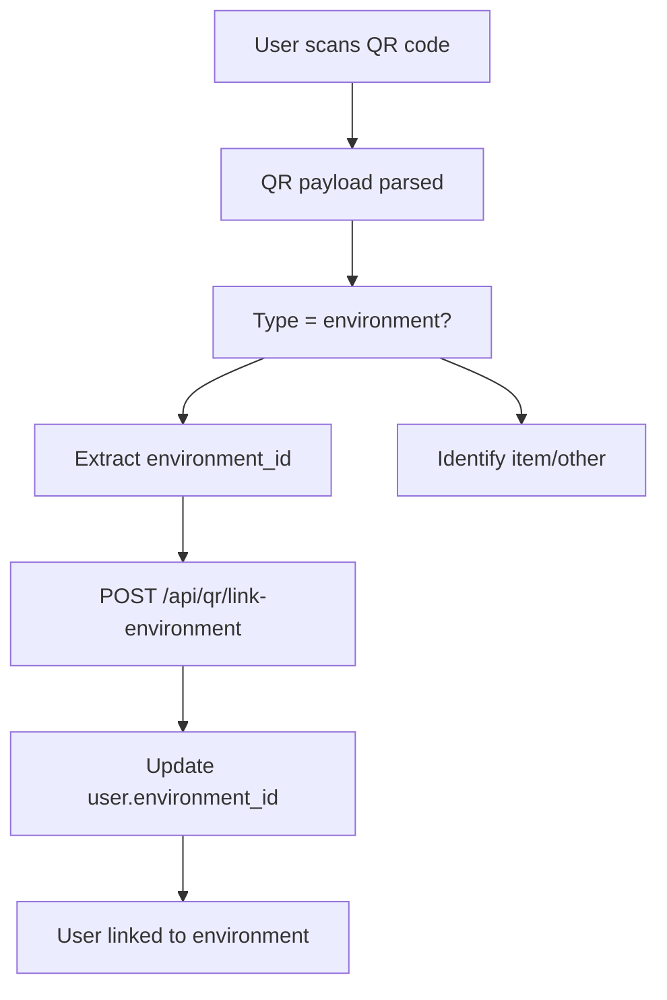
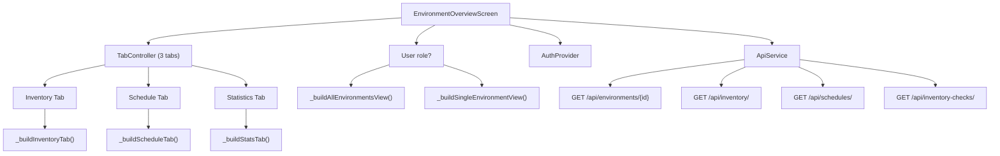
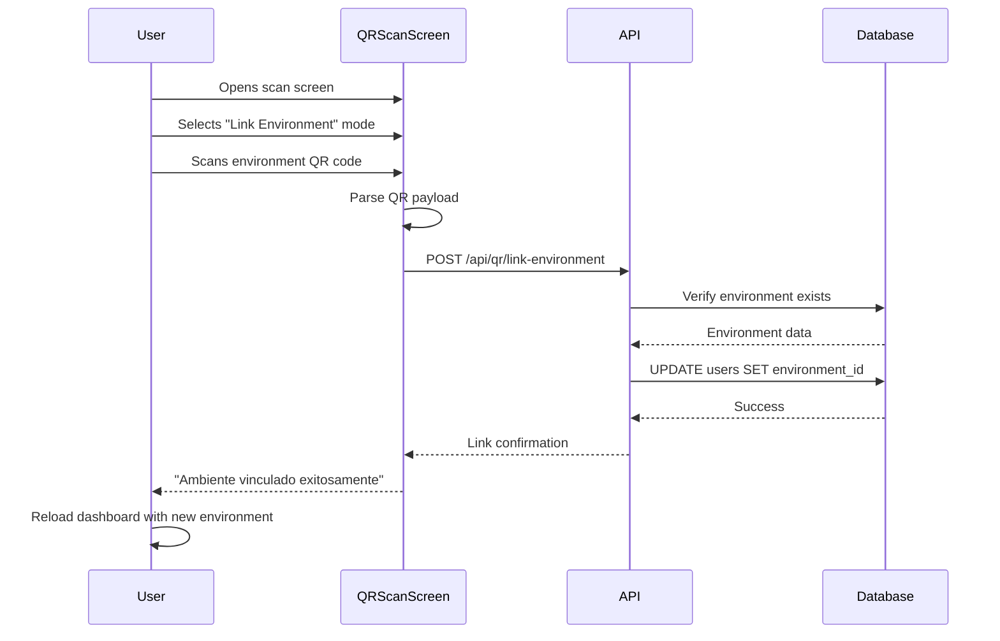

# Gestión del medio ambiente

> **Archivos fuente relevantes**
> * [cliente/lib/datos/modelos/modelo_de_entorno.dart](https://github.com/axchisan/GestionInventarioSENA/blob/a6b12d01/client/lib/data/models/environment_model.dart)
> * [cliente/lib/presentación/pantallas/entorno/pantalla_de_descripción_del_entorno.dart](https://github.com/axchisan/GestionInventarioSENA/blob/a6b12d01/client/lib/presentation/screens/environment/environment_overview_screen.dart)
> * [cliente/lib/presentación/pantallas/entorno/administrar_programaciones_pantalla.dart](https://github.com/axchisan/GestionInventarioSENA/blob/a6b12d01/client/lib/presentation/screens/environment/manage_schedules_screen.dart)
> * [cliente/lib/presentación/pantallas/inventario/editar_elemento_de_inventario_pantalla.dart](https://github.com/axchisan/GestionInventarioSENA/blob/a6b12d01/client/lib/presentation/screens/inventory/edit_inventory_item_screen.dart)
> * [cliente/lib/presentación/pantallas/inventario/pantalla_de_verificación_de_inventario.dart](https://github.com/axchisan/GestionInventarioSENA/blob/a6b12d01/client/lib/presentation/screens/inventory/inventory_check_screen.dart)
> * [cliente/lib/presentación/pantallas/informes/generador_de_informes_pantalla.dart](https://github.com/axchisan/GestionInventarioSENA/blob/a6b12d01/client/lib/presentation/screens/reports/report_generator_screen.dart)
> * [servidor/aplicación/enrutadores/inventory_checks.py](https://github.com/axchisan/GestionInventarioSENA/blob/a6b12d01/server/app/routers/inventory_checks.py)
> * [servidor/aplicación/esquemas/informes_generados.py](https://github.com/axchisan/GestionInventarioSENA/blob/a6b12d01/server/app/schemas/generated_reports.py)
> * [servidor/requisitos.txt](https://github.com/axchisan/GestionInventarioSENA/blob/a6b12d01/server/requirements.txt)

## Propósito y alcance

Este documento describe la entidad **"Entorno"** y su gestión dentro del Sistema de Gestión de Inventario del SENA. Los entornos representan ubicaciones físicas (aulas, laboratorios o almacenes) donde se almacenan y gestionan los artículos del inventario. Esta página abarca el modelo de datos del entorno, la asignación de usuarios a los entornos, la interfaz de resumen del entorno y cómo funcionan como un mecanismo de alcance multiusuario en todo el sistema.

Para obtener información sobre la verificación de inventario en entornos, consulte [Sistema de Verificación de Inventario](/axchisan/GestionInventarioSENA/5-inventory-verification-system) . Para la vinculación de entornos mediante códigos QR, consulte [Sistema de Códigos QR](/axchisan/GestionInventarioSENA/8-qr-code-system) . Para obtener informes específicos de cada entorno, consulte [Informes y Análisis](/axchisan/GestionInventarioSENA/9-reporting-and-analytics) .

---

## Descripción general de la entidad ambiental

Los entornos son la unidad organizativa principal del Sistema de Gestión de Inventarios del SENA. Cada entorno representa una ubicación física distinta y sirve como contenedor para:

* **Artículos de inventario** : equipos y materiales almacenados en la ubicación
* **Horarios** - Horarios de clases y bloques de tiempo para la ubicación
* **Controles de inventario** : registros de verificación diaria de la ubicación
* **Usuarios** : Personal asignado para administrar o utilizar la ubicación
* **Solicitudes de mantenimiento** : solicitudes de reparación limitadas a la ubicación

El sistema distingue dos tipos de entornos:

* **Aulas/Laboratorios** ( `is_warehouse=false`) - Entornos de enseñanza gestionados por instructores y utilizados por estudiantes
* **Almacenes** ( `is_warehouse=true`) - Instalaciones de almacenamiento gestionadas por administradores de almacén

**Entorno como ámbito multiinquilino**

Los entornos implementan una arquitectura multiinquilino donde los datos se particionan por entorno. Cuando los usuarios consultan inventario, comprobaciones o programaciones, los resultados se filtran automáticamente según su rol asignado, `environment_id`a menos que tengan permisos elevados (rol admin_general).

Fuentes: [Diagramas de arquitectura de sistemas de alto nivel],[environment_model.dart L1-L97](https://github.com/axchisan/GestionInventarioSENA/blob/a6b12d01/client/lib/data/models/environment_model.dart#L1-L97)

---

## Modelo de datos ambientales

### Esquema de base de datos

```css
#mermaid-gshsw60ycs9{font-family:ui-sans-serif,-apple-system,system-ui,Segoe UI,Helvetica;font-size:16px;fill:#333;}@keyframes edge-animation-frame{from{stroke-dashoffset:0;}}@keyframes dash{to{stroke-dashoffset:0;}}#mermaid-gshsw60ycs9 .edge-animation-slow{stroke-dasharray:9,5!important;stroke-dashoffset:900;animation:dash 50s linear infinite;stroke-linecap:round;}#mermaid-gshsw60ycs9 .edge-animation-fast{stroke-dasharray:9,5!important;stroke-dashoffset:900;animation:dash 20s linear infinite;stroke-linecap:round;}#mermaid-gshsw60ycs9 .error-icon{fill:#dddddd;}#mermaid-gshsw60ycs9 .error-text{fill:#222222;stroke:#222222;}#mermaid-gshsw60ycs9 .edge-thickness-normal{stroke-width:1px;}#mermaid-gshsw60ycs9 .edge-thickness-thick{stroke-width:3.5px;}#mermaid-gshsw60ycs9 .edge-pattern-solid{stroke-dasharray:0;}#mermaid-gshsw60ycs9 .edge-thickness-invisible{stroke-width:0;fill:none;}#mermaid-gshsw60ycs9 .edge-pattern-dashed{stroke-dasharray:3;}#mermaid-gshsw60ycs9 .edge-pattern-dotted{stroke-dasharray:2;}#mermaid-gshsw60ycs9 .marker{fill:#999;stroke:#999;}#mermaid-gshsw60ycs9 .marker.cross{stroke:#999;}#mermaid-gshsw60ycs9 svg{font-family:ui-sans-serif,-apple-system,system-ui,Segoe UI,Helvetica;font-size:16px;}#mermaid-gshsw60ycs9 p{margin:0;}#mermaid-gshsw60ycs9 .entityBox{fill:#ffffff;stroke:#dddddd;}#mermaid-gshsw60ycs9 .relationshipLabelBox{fill:#dddddd;opacity:0.7;background-color:#dddddd;}#mermaid-gshsw60ycs9 .relationshipLabelBox rect{opacity:0.5;}#mermaid-gshsw60ycs9 .labelBkg{background-color:rgba(221, 221, 221, 0.5);}#mermaid-gshsw60ycs9 .edgeLabel .label{fill:#dddddd;font-size:14px;}#mermaid-gshsw60ycs9 .label{font-family:ui-sans-serif,-apple-system,system-ui,Segoe UI,Helvetica;color:#333;}#mermaid-gshsw60ycs9 .edge-pattern-dashed{stroke-dasharray:8,8;}#mermaid-gshsw60ycs9 .node rect,#mermaid-gshsw60ycs9 .node circle,#mermaid-gshsw60ycs9 .node ellipse,#mermaid-gshsw60ycs9 .node polygon{fill:#ffffff;stroke:#dddddd;stroke-width:1px;}#mermaid-gshsw60ycs9 .relationshipLine{stroke:#999;stroke-width:1;fill:none;}#mermaid-gshsw60ycs9 .marker{fill:none!important;stroke:#999!important;stroke-width:1;}#mermaid-gshsw60ycs9 :root{--mermaid-font-family:"trebuchet ms",verdana,arial,sans-serif;}assigned_tocontainshasscopesrelates_toEnvironmentUUIDidPKUUIDcenter_idFKstringnamestringlocationintcapacitystringqr_codestringdescriptionboolis_warehouseboolis_activedatetimecreated_atdatetimeupdated_atUserInventoryItemScheduleInventoryCheckMaintenanceRequest
```

### Descripciones de campos

| Campo | Tipo | Descripción | Restricciones |
| --- | --- | --- | --- |
| `id` | UUID | Identificador de clave principal | Obligatorio, único |
| `center_id` | UUID | Referencia al centro SENA matriz | Requerido |
| `name` | cadena | Nombre para mostrar del entorno | Requerido |
| `location` | cadena | Descripción de la ubicación física | Requerido |
| `capacity` | entero | Ocupación máxima | Predeterminado: 30 |
| `qr_code` | cadena | Código QR único para escanear | Obligatorio, único |
| `description` | cadena | Descripción detallada opcional | Opcional |
| `is_warehouse` | booleano | Bandera del almacén | Predeterminado: falso |
| `is_active` | booleano | Bandera de estado activo | Predeterminado: verdadero |
| `created_at` | fecha y hora | Marca de tiempo de creación del registro | Generado automáticamente |
| `updated_at` | fecha y hora | Marca de tiempo de la última actualización | Actualización automática |

### Modelo del lado del cliente

El cliente Flutter define la `EnvironmentModel`clase con soporte de serialización JSON:

[environment_model.dart L6-L24](https://github.com/axchisan/GestionInventarioSENA/blob/a6b12d01/client/lib/data/models/environment_model.dart#L6-L24)

**Métodos del modelo clave:**

* `fromJson(Map<String, dynamic> json)`- Analiza JSON con amplio manejo de errores para campos booleanos[environment_model.dart L39-L76](https://github.com/axchisan/GestionInventarioSENA/blob/a6b12d01/client/lib/data/models/environment_model.dart#L39-L76)
* `toJson()`- Serializa a JSON mediante generación de código
* `displayName`- Devuelve el nombre formateado con el sufijo "(Almacén)" para los almacenes[environment_model.dart L94](https://github.com/axchisan/GestionInventarioSENA/blob/a6b12d01/client/lib/data/models/environment_model.dart#L94-L94)
* `fullLocation`- Combina nombre y ubicación para mostrar[environment_model.dart L95](https://github.com/axchisan/GestionInventarioSENA/blob/a6b12d01/client/lib/data/models/environment_model.dart#L95-L95)

Fuentes:[environment_model.dart L1-L97](https://github.com/axchisan/GestionInventarioSENA/blob/a6b12d01/client/lib/data/models/environment_model.dart#L1-L97)

[server/app/models/environments.py (implícito)]

---

## Asignación de usuarios basada en el entorno

### Relación usuario-entorno

Los usuarios se asignan a un único entorno mediante la `environment_id`clave externa del `User`modelo. Esta asignación determina:

1. **Visibilidad de datos** : los usuarios solo ven datos (inventario, controles, programaciones) de su entorno asignado
2. **Contexto de navegación** : las pantallas del panel cargan datos específicos del entorno
3. **Alcance del permiso** : las acciones basadas en roles están limitadas al entorno asignado
4. **Vinculación de códigos QR** : los usuarios pueden escanear códigos QR del entorno para vincular su cuenta

### Flujo de trabajo de vinculación del entorno



**Proceso de vinculación de códigos QR:**

1. El usuario navega a la pantalla de escaneo QR en el modo "entorno de enlace"
2. Escanea el código QR que contiene el identificador del entorno
3. El cliente envía una solicitud de enlace al backend
4. El backend valida que el entorno existe y está activo
5. Registro de usuario actualizado con`environment_id`
6. El usuario obtiene acceso a funciones específicas del entorno

Fuentes: [client/lib/presentation/screens/qr/qr_scan_screen.dart (implícito)], [server/app/routers/qr_codes.py (implícito)]

---

## Pantalla de descripción general del entorno

Proporciona `EnvironmentOverviewScreen`una vista completa del inventario, la programación y las estadísticas de un entorno. La pantalla se adapta según el rol del usuario y el tipo de entorno.

### Arquitectura de pantalla



### Vistas basadas en roles

#### Vista general del administrador

Admin general users see a list of all environments in the system rather than a single environment view. Each environment card displays:

[client/lib/presentation/screens/environment/environment_overview_screen.dart L190-L292](https://github.com/axchisan/GestionInventarioSENA/blob/a6b12d01/client/lib/presentation/screens/environment/environment_overview_screen.dart#L190-L292)

**Environment Card Contents:**

* Environment name and location
* Environment ID (first 8 characters)
* Active/inactive status indicator
* Type badge (Warehouse/Classroom)
* Capacity indicator
* Clickable to view detailed modal

#### Single Environment View

For all other roles (student, instructor, supervisor, admin), the screen displays a single environment with:

[client/lib/presentation/screens/environment/environment_overview_screen.dart L350-L477](https://github.com/axchisan/GestionInventarioSENA/blob/a6b12d01/client/lib/presentation/screens/environment/environment_overview_screen.dart#L350-L477)

**Header Section:**

* SENA logo
* Environment name and ID
* Location information
* Summary statistics chips (Total, Available, Damaged, Missing items)

**Tab Navigation:**

* **Inventory Tab** - List of all items in the environment with quantity indicators
* **Schedule Tab** - Class schedules associated with the environment
* **Statistics Tab** - Analytics and trends for the environment

### Inventory Tab Implementation

The inventory tab displays items with detailed quantity breakdowns for group items:

[client/lib/presentation/screens/environment/environment_overview_screen.dart L540-L733](https://github.com/axchisan/GestionInventarioSENA/blob/a6b12d01/client/lib/presentation/screens/environment/environment_overview_screen.dart#L540-L733)

**Item Card Features:**

* Item name and type (individual/group)
* Status badge (available, damaged, etc.)
* For group items: * Total quantity indicator * Available quantity (green) * Damaged quantity (orange) * Missing quantity (red)
* Category and maintenance information
* Edit/Delete buttons for supervisors and admins

**Quantity Indicator Component:**

[client/lib/presentation/screens/environment/environment_overview_screen.dart L735-L772](https://github.com/axchisan/GestionInventarioSENA/blob/a6b12d01/client/lib/presentation/screens/environment/environment_overview_screen.dart#L735-L772)

Each indicator shows an icon, numeric value, and label with color-coded backgrounds.

### Data Fetching Strategy

The screen implements a comprehensive data loading strategy:

[client/lib/presentation/screens/environment/environment_overview_screen.dart L44-L108](https://github.com/axchisan/GestionInventarioSENA/blob/a6b12d01/client/lib/presentation/screens/environment/environment_overview_screen.dart#L44-L108)

**Fetching Process:**

1. Check user role via `AuthProvider`
2. If `admin_general`: fetch all environments from `/api/environments/`
3. If other role: verify `environment_id` is set
4. Fetch environment details: `GET /api/environments/{id}`
5. Fetch related data with query parameter `environment_id`: * Inventory items * Schedules * Inventory checks
6. Update state and render UI

**Error Handling:**

If a user has no assigned environment, the screen displays a message prompting them to link an environment via QR code scanning.

[client/lib/presentation/screens/environment/environment_overview_screen.dart L63-L73](https://github.com/axchisan/GestionInventarioSENA/blob/a6b12d01/client/lib/presentation/screens/environment/environment_overview_screen.dart#L63-L73)

### Statistics Calculation

The screen calculates real-time statistics from inventory data:

[client/lib/presentation/screens/environment/environment_overview_screen.dart L479-L505](https://github.com/axchisan/GestionInventarioSENA/blob/a6b12d01/client/lib/presentation/screens/environment/environment_overview_screen.dart#L479-L505)

**Metrics Computed:**

* `_calculateTotalEnvironmentItems()` - Sum of all item quantities
* `_calculateAvailableEnvironmentItems()` - Total minus damaged and missing
* `_calculateDamagedEnvironmentItems()` - Sum of damaged quantities
* `_calculateMissingEnvironmentItems()` - Sum of missing quantities
* `_calculateCompletedChecks()` - Count of checks with status "complete"

Sources: [client/lib/presentation/screens/environment/environment_overview_screen.dart L1-L881](https://github.com/axchisan/GestionInventarioSENA/blob/a6b12d01/client/lib/presentation/screens/environment/environment_overview_screen.dart#L1-L881)

---

## Environment Filtering in API Requests

### Backend Filtering Pattern

Throughout the backend API, environments serve as the primary filter for multi-tenant data isolation. Most routers implement environment-based filtering:

**Inventory Checks Filtering:**

[server/app/routers/inventory_checks.py L589-L631](https://github.com/axchisan/GestionInventarioSENA/blob/a6b12d01/server/app/routers/inventory_checks.py#L589-L631)

The `GET /api/inventory-checks/` endpoint:

1. Accepts optional `environment_id` query parameter
2. Falls back to current user's `environment_id` if not provided
3. Applies additional filters for role-based access: * Students see only their own checks * Instructors see checks assigned to them or pending instructor review * Supervisors see checks assigned to them or pending supervisor review

**Query Parameter Pattern:**

Client-side services consistently pass `environment_id` as a query parameter:

[client/lib/presentation/screens/environment/environment_overview_screen.dart L80-L93](https://github.com/axchisan/GestionInventarioSENA/blob/a6b12d01/client/lib/presentation/screens/environment/environment_overview_screen.dart#L80-L93)

This pattern ensures users only access data within their scope while allowing admin_general to query across environments.

### Environment Validation

Backend endpoints validate environment existence before performing operations:

[server/app/routers/inventory_checks.py L163-L165](https://github.com/axchisan/GestionInventarioSENA/blob/a6b12d01/server/app/routers/inventory_checks.py#L163-L165)

If an environment is not found, the API returns a 404 error with message "Ambiente no encontrado".

Sources: [server/app/routers/inventory_checks.py L1-L656](https://github.com/axchisan/GestionInventarioSENA/blob/a6b12d01/server/app/routers/inventory_checks.py#L1-L656)

 [client/lib/presentation/screens/environment/environment_overview_screen.dart L80-L93](https://github.com/axchisan/GestionInventarioSENA/blob/a6b12d01/client/lib/presentation/screens/environment/environment_overview_screen.dart#L80-L93)

---

## Warehouse vs Classroom Environments

### Type Differentiation

The `is_warehouse` boolean field fundamentally changes how an environment is treated:

| Aspect | Classroom (`is_warehouse=false`) | Warehouse (`is_warehouse=true`) |
| --- | --- | --- |
| **Primary Users** | Students, instructors, supervisors | Warehouse admins |
| **Purpose** | Teaching and learning space | Equipment storage and distribution |
| **Inventory Type** | Fixed equipment for classes | Portable equipment for loans |
| **Key Operations** | Daily inventory checks, maintenance | Loan management, stock control |
| **Schedules** | Class schedules with time blocks | N/A (no scheduled classes) |
| **Dashboard Label** | "Ambiente" | "Almacén" |

### Admin Role Filtering

The admin role specifically manages warehouse environments. In the report generator, admins only see warehouse environments:

[client/lib/presentation/screens/reports/report_generator_screen.dart L181-L188](https://github.com/axchisan/GestionInventarioSENA/blob/a6b12d01/client/lib/presentation/screens/reports/report_generator_screen.dart#L181-L188)

This ensures admins focus on loan management and warehouse operations rather than classroom inventory.

### Display Name Formatting

The `displayName` getter automatically appends "(Almacén)" to warehouse environment names:

[client/lib/data/models/environment_model.dart L94](https://github.com/axchisan/GestionInventarioSENA/blob/a6b12d01/client/lib/data/models/environment_model.dart#L94-L94)

This visual distinction helps users quickly identify warehouse environments in lists and dropdowns.

Sources: [client/lib/data/models/environment_model.dart L94](https://github.com/axchisan/GestionInventarioSENA/blob/a6b12d01/client/lib/data/models/environment_model.dart#L94-L94)

 [client/lib/presentation/screens/reports/report_generator_screen.dart L181-L188](https://github.com/axchisan/GestionInventarioSENA/blob/a6b12d01/client/lib/presentation/screens/reports/report_generator_screen.dart#L181-L188)

---

## Environment Management Screens

### Environment Overview Screen

Path: `/environment-overview`

**Purpose:** Display comprehensive environment information with inventory, schedules, and statistics.

**Access Control:**

* Student: View own assigned environment (read-only)
* Instructor: View assigned environment with schedule management
* Supervisor: View assigned environment with full management
* Admin: View assigned warehouse with inventory management
* Admin General: View all environments in system

**Key Features:**

* Three-tab interface (Inventory, Schedules, Statistics)
* Real-time calculation of item quantities
* Role-based action buttons (edit/delete items)
* Floating action button for adding items (supervisor/admin only)
* Pull-to-refresh data loading

### Manage Schedules Screen

Path: `/manage-schedules`

**Purpose:** CRUD operations for environment schedules.

[client/lib/presentation/screens/environment/manage_schedules_screen.dart L1-L121](https://github.com/axchisan/GestionInventarioSENA/blob/a6b12d01/client/lib/presentation/screens/environment/manage_schedules_screen.dart#L1-L121)

**Access Control:** Instructor and supervisor roles only

**Features:**

* List all schedules for user's environment
* Add new schedule (instructor only)
* Edit existing schedule (instructor only)
* Delete schedule (instructor only)
* Display program name and time range

This screen is simplified compared to the main overview and focuses solely on schedule management.

Sources: [client/lib/presentation/screens/environment/environment_overview_screen.dart L1-L881](https://github.com/axchisan/GestionInventarioSENA/blob/a6b12d01/client/lib/presentation/screens/environment/environment_overview_screen.dart#L1-L881)

 [client/lib/presentation/screens/environment/manage_schedules_screen.dart L1-L121](https://github.com/axchisan/GestionInventarioSENA/blob/a6b12d01/client/lib/presentation/screens/environment/manage_schedules_screen.dart#L1-L121)

---

## Environment in Inventory Verification

Environments are central to the inventory verification workflow. Each inventory check is scoped to a single environment:

### Check-Environment Relationship

[server/app/routers/inventory_checks.py L114-L130](https://github.com/axchisan/GestionInventarioSENA/blob/a6b12d01/server/app/routers/inventory_checks.py#L114-L130)

When creating an inventory check:

1. Environment ID is required in the request
2. Environment existence is validated
3. Check is created with `environment_id` foreign key
4. Totals are calculated from items in that environment

### Environment-Scoped Statistics

The inventory check screen calculates statistics at the environment level:

[client/lib/presentation/screens/inventory/inventory_check_screen.dart L243-L266](https://github.com/axchisan/GestionInventarioSENA/blob/a6b12d01/client/lib/presentation/screens/inventory/inventory_check_screen.dart#L243-L266)

These methods aggregate data from all items in the user's assigned environment to display:

* Total items in environment
* Available items (excluding damaged and missing)
* Damaged items count
* Missing items count

### Environment Header Display

The inventory check screen prominently displays environment information:

[client/lib/presentation/screens/inventory/inventory_check_screen.dart L968-L450](https://github.com/axchisan/GestionInventarioSENA/blob/a6b12d01/client/lib/presentation/screens/inventory/inventory_check_screen.dart#L968-L450)

The header shows:

* Environment name (or "Almacén" for warehouses)
* Environment ID
* Location
* Summary statistic chips with counts

This contextualizes the verification process within the specific physical location.

Sources: [server/app/routers/inventory_checks.py L114-L130](https://github.com/axchisan/GestionInventarioSENA/blob/a6b12d01/server/app/routers/inventory_checks.py#L114-L130)

 [client/lib/presentation/screens/inventory/inventory_check_screen.dart L243-L450](https://github.com/axchisan/GestionInventarioSENA/blob/a6b12d01/client/lib/presentation/screens/inventory/inventory_check_screen.dart#L243-L450)

---

## API Endpoints for Environments

### Environment Router

The backend exposes environment management through the environments router:

**Base Path:** `/api/environments/`

| Method | Endpoint | Purpose | Access |
| --- | --- | --- | --- |
| GET | `/api/environments/` | List all environments | admin_general |
| GET | `/api/environments/{id}` | Get single environment | All authenticated users |
| POST | `/api/environments/` | Create environment | admin_general |
| PUT | `/api/environments/{id}` | Update environment | admin_general |
| DELETE | `/api/environments/{id}` | Delete environment | admin_general |

### Environment Query Parameters

Endpoints that support environment filtering typically accept:

```
?environment_id={uuid}
```

Example usage in client:

[client/lib/presentation/screens/inventory/inventory_check_screen.dart L104-L111](https://github.com/axchisan/GestionInventarioSENA/blob/a6b12d01/client/lib/presentation/screens/inventory/inventory_check_screen.dart#L104-L111)

This pattern is used by:

* `/api/inventory/` - Filter items by environment
* `/api/schedules/` - Filter schedules by environment
* `/api/inventory-checks/` - Filter checks by environment
* `/api/maintenance-requests/` - Filter requests by environment

Sources: [client/lib/presentation/screens/inventory/inventory_check_screen.dart L104-L111](https://github.com/axchisan/GestionInventarioSENA/blob/a6b12d01/client/lib/presentation/screens/inventory/inventory_check_screen.dart#L104-L111)

 [server/app/routers/inventory_checks.py L589-L631](https://github.com/axchisan/GestionInventarioSENA/blob/a6b12d01/server/app/routers/inventory_checks.py#L589-L631)

---

## Environment in Reports

### Report Filtering by Environment

The report generator allows filtering reports by environment:

[client/lib/presentation/screens/reports/report_generator_screen.dart L510-L538](https://github.com/axchisan/GestionInventarioSENA/blob/a6b12d01/client/lib/presentation/screens/reports/report_generator_screen.dart#L510-L538)

**Available Options:**

* "Todos los ambientes" (All environments) - For admin_general
* "Todos los almacenes" (All warehouses) - For admin
* Individual environment selection from dropdown

### Environment-Specific Reports

Report types that leverage environment filtering:

1. **Inventory Reports** - Items grouped by environment
2. **Verification Reports** - Checks per environment with compliance metrics
3. **Maintenance Reports** - Requests per environment
4. **Environment Status Reports** - Comprehensive environment health

### Role-Based Environment Access

[client/lib/presentation/screens/reports/report_generator_screen.dart L181-L188](https://github.com/axchisan/GestionInventarioSENA/blob/a6b12d01/client/lib/presentation/screens/reports/report_generator_screen.dart#L181-L188)

The `availableEnvironments` getter filters the environment list based on role:

* **Admin role:** Only warehouse environments (`is_warehouse=true`)
* **Otros roles:** Todos los entornos

Esto garantiza que los datos del informe se alineen con los permisos y responsabilidades del usuario.

Fuentes:[report_generator_screen.dart L181-L188](https://github.com/axchisan/GestionInventarioSENA/blob/a6b12d01/client/lib/presentation/screens/reports/report_generator_screen.dart#L181-L188)

 [report_generator_screen.dart L510-L538](https://github.com/axchisan/GestionInventarioSENA/blob/a6b12d01/client/lib/presentation/screens/reports/report_generator_screen.dart#L510-L538)

---

## Sistema de código QR ambiental

### Generación de códigos QR

Cada entorno tiene un `qr_code`campo único que contiene un identificador de código QR generado. Este código QR codifica:

* Identificación del entorno
* Tipo de entorno (almacén/aula)
* Firma para verificación

### Flujo de vinculación de códigos QR



### Modos de escaneo QR

La pantalla de escaneo QR admite dos modos:

1. **Modo de identificación** : identifica elementos o entornos para obtener información
2. **Modo de entorno de enlace** : vincula al usuario actual a un entorno escaneado

A los usuarios que no tienen un entorno asignado se les solicita que escaneen un código QR del entorno para obtener acceso a las funciones del sistema.

Fuentes:[environment_model.dart L14](https://github.com/axchisan/GestionInventarioSENA/blob/a6b12d01/client/lib/data/models/environment_model.dart#L14-L14)

[Diagramas del sistema de código QR]

---

## Notas técnicas de implementación

### Gestión del Estado

La pantalla de descripción general del entorno utiliza Flutter `StatefulWidget`con administración de estado local:

* `_environment`- Datos ambientales actuales
* `_inventory`- Lista de artículos del inventario
* `_schedules`- Listado de horarios
* `_checks`- Listado de comprobaciones de inventario
* `_isLoading`- Indicador de estado de carga

Las actualizaciones de estado activan reconstrucciones de la interfaz de usuario a través de `setState()`.

### Manejo de errores

La pantalla implementa el manejo de errores defensivos:

[environment_model.dart L39-L76](https://github.com/axchisan/GestionInventarioSENA/blob/a6b12d01/client/lib/data/models/environment_model.dart#L39-L76)

El `fromJson`constructor de fábrica:

* Envuelve el análisis en try-catch
* Proporciona valores predeterminados para los campos faltantes
* Maneja el análisis booleano desde múltiples formatos (bool, cadena, int)
* Vuelve a los valores predeterminados seguros en caso de error

### Consideraciones de rendimiento

La pantalla de descripción general del entorno carga varias fuentes de datos simultáneamente, pero podría optimizarse:

1. **Implementación actual:** llamadas API secuenciales
2. **Mejora potencial:** uso `Future.wait()`para búsqueda paralela
3. **Estrategia de almacenamiento en caché:** no se implementó almacenamiento en caché del lado del cliente (depende de la velocidad de respuesta de la API)

### Internacionalización

Las cadenas relacionadas con el entorno están codificadas en español:

* "Ambiente" (entorno)
* Almacén
* "Vincula un ambiente"

La internacionalización futura requeriría extraerlos a archivos de recursos.

Fuentes:[environment_model.dart L39-L76](https://github.com/axchisan/GestionInventarioSENA/blob/a6b12d01/client/lib/data/models/environment_model.dart#L39-L76)

 [environment_overview_screen.dart L44-L108](https://github.com/axchisan/GestionInventarioSENA/blob/a6b12d01/client/lib/presentation/screens/environment/environment_overview_screen.dart#L44-L108)