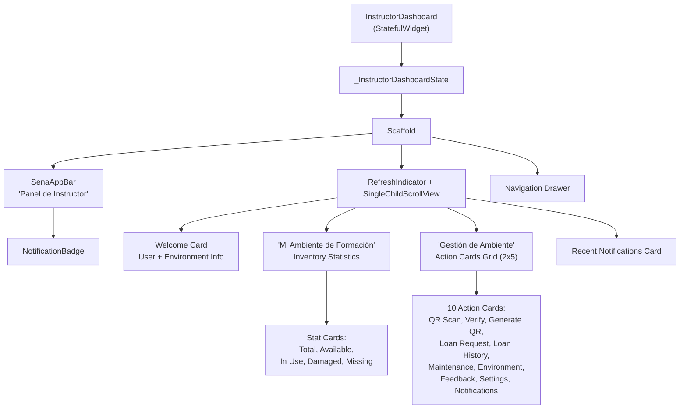
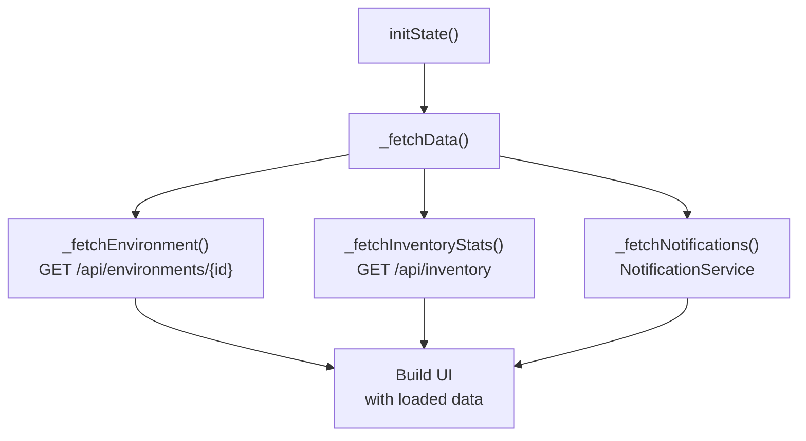
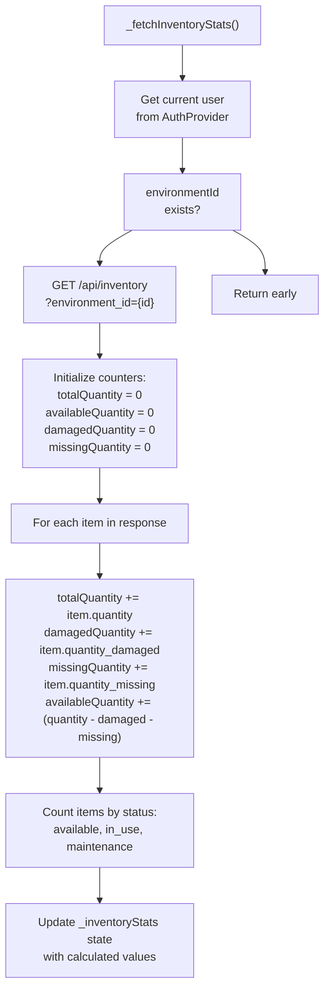
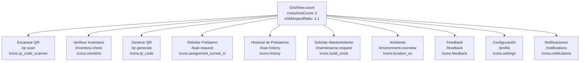
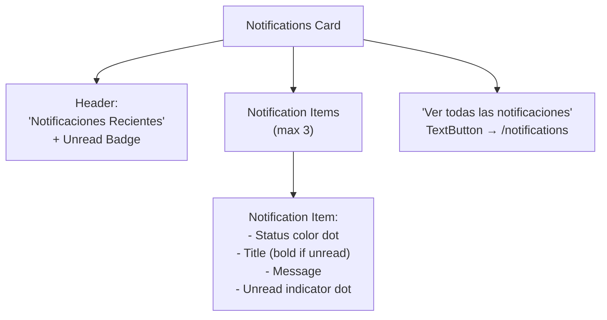
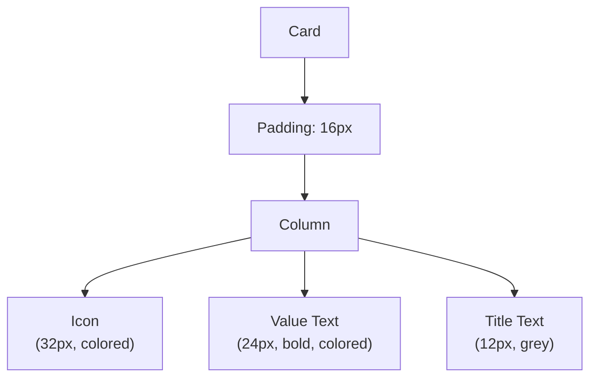

# Instructor Dashboard

> **Relevant source files**
> * [client/lib/presentation/screens/dashboard/instructor_dashboard.dart](https://github.com/axchisan/GestionInventarioSENA/blob/a6b12d01/client/lib/presentation/screens/dashboard/instructor_dashboard.dart)
> * [client/lib/presentation/screens/dashboard/supervisor_dashboard_screen.dart](https://github.com/axchisan/GestionInventarioSENA/blob/a6b12d01/client/lib/presentation/screens/dashboard/supervisor_dashboard_screen.dart)

The Instructor Dashboard serves as the primary interface for users with the `instructor` role, providing environment-scoped inventory management capabilities, loan management, verification tasks, and quick access to operational features. This dashboard is designed for instructors overseeing a specific training environment (ambiente) at a SENA institution.

For information about other role-specific dashboards, see [Student Dashboard](/axchisan/GestionInventarioSENA/4.1-student-dashboard), [Supervisor Dashboard](/axchisan/GestionInventarioSENA/4.3-supervisor-dashboard), and [Admin Dashboards](/axchisan/GestionInventarioSENA/4.4-admin-dashboards). For details on role-based access control, see [Role-Based Access Control](/axchisan/GestionInventarioSENA/3.3-role-based-access-control).

## Screen Architecture

The Instructor Dashboard is implemented as a stateful widget in [client/lib/presentation/screens/dashboard/instructor_dashboard.dart L12-L16](https://github.com/axchisan/GestionInventarioSENA/blob/a6b12d01/client/lib/presentation/screens/dashboard/instructor_dashboard.dart#L12-L16)

 with the class `InstructorDashboard`. The state is managed by `_InstructorDashboardState` [client/lib/presentation/screens/dashboard/instructor_dashboard.dart L19-L138](https://github.com/axchisan/GestionInventarioSENA/blob/a6b12d01/client/lib/presentation/screens/dashboard/instructor_dashboard.dart#L19-L138)

 which handles data fetching, state updates, and user interactions.

### Component Hierarchy

**Sources:** [client/lib/presentation/screens/dashboard/instructor_dashboard.dart L139-L470](https://github.com/axchisan/GestionInventarioSENA/blob/a6b12d01/client/lib/presentation/screens/dashboard/instructor_dashboard.dart#L139-L470)

## State Management

The dashboard maintains four primary state variables that drive the UI:

| State Variable | Type | Purpose |
| --- | --- | --- |
| `_environment` | `Map<String, dynamic>?` | Current environment details (name, location, id) |
| `_inventoryStats` | `Map<String, dynamic>?` | Aggregated inventory statistics for the environment |
| `_recentNotifications` | `List<Map<String, dynamic>>` | Last 3 notifications for preview |
| `_unreadNotificationsCount` | `int` | Count of unread notifications for badge display |
| `_isLoading` | `bool` | Loading state indicator |

**Sources:** [client/lib/presentation/screens/dashboard/instructor_dashboard.dart L20-L25](https://github.com/axchisan/GestionInventarioSENA/blob/a6b12d01/client/lib/presentation/screens/dashboard/instructor_dashboard.dart#L20-L25)

## Data Loading Flow

The dashboard loads data through three parallel asynchronous operations orchestrated by `_fetchData()`:

**Sources:** [client/lib/presentation/screens/dashboard/instructor_dashboard.dart L36-L44](https://github.com/axchisan/GestionInventarioSENA/blob/a6b12d01/client/lib/presentation/screens/dashboard/instructor_dashboard.dart#L36-L44)

### Environment Fetching

The `_fetchEnvironment()` method retrieves the instructor's assigned environment:

1. Extracts `environmentId` from the current user via `AuthProvider` [client/lib/presentation/screens/dashboard/instructor_dashboard.dart L47-L48](https://github.com/axchisan/GestionInventarioSENA/blob/a6b12d01/client/lib/presentation/screens/dashboard/instructor_dashboard.dart#L47-L48)
2. If no environment is linked, shows a snackbar prompting the user to scan a QR code [client/lib/presentation/screens/dashboard/instructor_dashboard.dart L49-L54](https://github.com/axchisan/GestionInventarioSENA/blob/a6b12d01/client/lib/presentation/screens/dashboard/instructor_dashboard.dart#L49-L54)
3. Makes a GET request to `${environmentsEndpoint}${user!.environmentId}` [client/lib/presentation/screens/dashboard/instructor_dashboard.dart L56-L58](https://github.com/axchisan/GestionInventarioSENA/blob/a6b12d01/client/lib/presentation/screens/dashboard/instructor_dashboard.dart#L56-L58)
4. Updates `_environment` state with the response [client/lib/presentation/screens/dashboard/instructor_dashboard.dart L59-L61](https://github.com/axchisan/GestionInventarioSENA/blob/a6b12d01/client/lib/presentation/screens/dashboard/instructor_dashboard.dart#L59-L61)

**Sources:** [client/lib/presentation/screens/dashboard/instructor_dashboard.dart L46-L67](https://github.com/axchisan/GestionInventarioSENA/blob/a6b12d01/client/lib/presentation/screens/dashboard/instructor_dashboard.dart#L46-L67)

### Inventory Statistics Calculation

The `_fetchInventoryStats()` method aggregates inventory data for the instructor's environment:

The calculation logic iterates through all inventory items and computes:

* **Total Quantity**: Sum of all `quantity` fields [client/lib/presentation/screens/dashboard/instructor_dashboard.dart L87](https://github.com/axchisan/GestionInventarioSENA/blob/a6b12d01/client/lib/presentation/screens/dashboard/instructor_dashboard.dart#L87-L87)
* **Available Quantity**: `quantity - quantity_damaged - quantity_missing` for each item [client/lib/presentation/screens/dashboard/instructor_dashboard.dart L88-L91](https://github.com/axchisan/GestionInventarioSENA/blob/a6b12d01/client/lib/presentation/screens/dashboard/instructor_dashboard.dart#L88-L91)
* **Damaged Quantity**: Sum of `quantity_damaged` fields [client/lib/presentation/screens/dashboard/instructor_dashboard.dart L92](https://github.com/axchisan/GestionInventarioSENA/blob/a6b12d01/client/lib/presentation/screens/dashboard/instructor_dashboard.dart#L92-L92)
* **Missing Quantity**: Sum of `quantity_missing` fields [client/lib/presentation/screens/dashboard/instructor_dashboard.dart L93](https://github.com/axchisan/GestionInventarioSENA/blob/a6b12d01/client/lib/presentation/screens/dashboard/instructor_dashboard.dart#L93-L93)
* **Status Counts**: Count of items with `status` = 'available', 'in_use', or 'maintenance' [client/lib/presentation/screens/dashboard/instructor_dashboard.dart L103-L109](https://github.com/axchisan/GestionInventarioSENA/blob/a6b12d01/client/lib/presentation/screens/dashboard/instructor_dashboard.dart#L103-L109)

**Sources:** [client/lib/presentation/screens/dashboard/instructor_dashboard.dart L69-L117](https://github.com/axchisan/GestionInventarioSENA/blob/a6b12d01/client/lib/presentation/screens/dashboard/instructor_dashboard.dart#L69-L117)

### Notification Fetching

Notifications are retrieved using the `NotificationService`:

1. Calls `NotificationService.getNotifications()` to fetch all notifications [client/lib/presentation/screens/dashboard/instructor_dashboard.dart L121](https://github.com/axchisan/GestionInventarioSENA/blob/a6b12d01/client/lib/presentation/screens/dashboard/instructor_dashboard.dart#L121-L121)
2. Calls `NotificationService.getUnreadCount()` for badge display [client/lib/presentation/screens/dashboard/instructor_dashboard.dart L122](https://github.com/axchisan/GestionInventarioSENA/blob/a6b12d01/client/lib/presentation/screens/dashboard/instructor_dashboard.dart#L122-L122)
3. Takes the first 3 notifications for the preview section [client/lib/presentation/screens/dashboard/instructor_dashboard.dart L125](https://github.com/axchisan/GestionInventarioSENA/blob/a6b12d01/client/lib/presentation/screens/dashboard/instructor_dashboard.dart#L125-L125)

**Sources:** [client/lib/presentation/screens/dashboard/instructor_dashboard.dart L119-L131](https://github.com/axchisan/GestionInventarioSENA/blob/a6b12d01/client/lib/presentation/screens/dashboard/instructor_dashboard.dart#L119-L131)

## Inventory Statistics Display

The dashboard displays inventory statistics in a card-based layout with five key metrics:

| Metric | Field in `_inventoryStats` | Icon | Color |
| --- | --- | --- | --- |
| Items Totales | `total_quantity` | `Icons.inventory` | `AppColors.secondary` |
| Disponibles | `available_quantity` | `Icons.check_circle` | `AppColors.success` |
| En Préstamo | `in_use` | `Icons.assignment` | `AppColors.warning` |
| Dañados | `damaged_quantity` | `Icons.broken_image` | `AppColors.error` |
| Faltantes | `missing_quantity` | `Icons.error_outline` | `AppColors.error` |

Each metric is rendered using the `_buildStatCard()` method [client/lib/presentation/screens/dashboard/instructor_dashboard.dart L617-L647](https://github.com/axchisan/GestionInventarioSENA/blob/a6b12d01/client/lib/presentation/screens/dashboard/instructor_dashboard.dart#L617-L647)

 which creates a card with an icon, numeric value, and label.

**Layout Structure:**

* Row 1: Total Items (full width) [client/lib/presentation/screens/dashboard/instructor_dashboard.dart L231-L243](https://github.com/axchisan/GestionInventarioSENA/blob/a6b12d01/client/lib/presentation/screens/dashboard/instructor_dashboard.dart#L231-L243)
* Row 2: Available + In Use (50/50 split) [client/lib/presentation/screens/dashboard/instructor_dashboard.dart L245-L265](https://github.com/axchisan/GestionInventarioSENA/blob/a6b12d01/client/lib/presentation/screens/dashboard/instructor_dashboard.dart#L245-L265)
* Row 3: Damaged + Missing (50/50 split) [client/lib/presentation/screens/dashboard/instructor_dashboard.dart L267-L287](https://github.com/axchisan/GestionInventarioSENA/blob/a6b12d01/client/lib/presentation/screens/dashboard/instructor_dashboard.dart#L267-L287)

If no environment is linked, a placeholder message is shown [client/lib/presentation/screens/dashboard/instructor_dashboard.dart L288-L293](https://github.com/axchisan/GestionInventarioSENA/blob/a6b12d01/client/lib/presentation/screens/dashboard/instructor_dashboard.dart#L288-L293)

**Sources:** [client/lib/presentation/screens/dashboard/instructor_dashboard.dart L230-L293](https://github.com/axchisan/GestionInventarioSENA/blob/a6b12d01/client/lib/presentation/screens/dashboard/instructor_dashboard.dart#L230-L293)

## Action Cards Grid

The dashboard provides a 2-column grid of 10 action cards for quick navigation:

### Action Cards Mapping

| Card Title | Route | Icon | Color | Extra Data | Implementation |
| --- | --- | --- | --- | --- | --- |
| Escanear QR | `/qr-scan` | `qr_code_scanner` | primary | - | [Lines 311-318](https://github.com/axchisan/GestionInventarioSENA/blob/a6b12d01/Lines 311-318) |
| Verificar Inventario | `/inventory-check` | `checklist` | secondary | - | [Lines 319-326](https://github.com/axchisan/GestionInventarioSENA/blob/a6b12d01/Lines 319-326) |
| Generar QR | `/qr-generate` | `qr_code` | accent | - | [Lines 327-334](https://github.com/axchisan/GestionInventarioSENA/blob/a6b12d01/Lines 327-334) |
| Solicitar Préstamo | `/loan-request` | `assignment_turned_in` | primary | - | [Lines 335-342](https://github.com/axchisan/GestionInventarioSENA/blob/a6b12d01/Lines 335-342) |
| Historial de Préstamos | `/loan-history` | `history` | secondary | - | [Lines 343-350](https://github.com/axchisan/GestionInventarioSENA/blob/a6b12d01/Lines 343-350) |
| Solicitar Mantenimiento | `/maintenance-request` | `build_circle` | warning | `environmentId` | [Lines 351-359](https://github.com/axchisan/GestionInventarioSENA/blob/a6b12d01/Lines 351-359) |
| Ambiente | `/environment-overview` | `location_on` | success | `environmentId`, `environmentName` | [Lines 360-375](https://github.com/axchisan/GestionInventarioSENA/blob/a6b12d01/Lines 360-375) |
| Feedback | `/feedback` | `feedback` | warning | - | [Lines 376-383](https://github.com/axchisan/GestionInventarioSENA/blob/a6b12d01/Lines 376-383) |
| Configuración | `/profile` | `settings` | primary | - | [Lines 384-391](https://github.com/axchisan/GestionInventarioSENA/blob/a6b12d01/Lines 384-391) |
| Notificaciones | `/notifications` | `notifications` | error | Unread count badge | [Lines 393](https://github.com/axchisan/GestionInventarioSENA/blob/a6b12d01/Lines 393) |

Each card is created using `_buildActionCard()` [client/lib/presentation/screens/dashboard/instructor_dashboard.dart L649-L688](https://github.com/axchisan/GestionInventarioSENA/blob/a6b12d01/client/lib/presentation/screens/dashboard/instructor_dashboard.dart#L649-L688)

 or `_buildNotificationActionCard()` for the notifications card [client/lib/presentation/screens/dashboard/instructor_dashboard.dart L472-L534](https://github.com/axchisan/GestionInventarioSENA/blob/a6b12d01/client/lib/presentation/screens/dashboard/instructor_dashboard.dart#L472-L534)

**Special Behavior:**

* The **Ambiente** card navigates to `/qr-scan` if no environment is linked, or to `/environment-overview` with environment details if linked [client/lib/presentation/screens/dashboard/instructor_dashboard.dart L366-L374](https://github.com/axchisan/GestionInventarioSENA/blob/a6b12d01/client/lib/presentation/screens/dashboard/instructor_dashboard.dart#L366-L374)
* The **Solicitar Mantenimiento** card passes the current `environmentId` as extra data [client/lib/presentation/screens/dashboard/instructor_dashboard.dart L358](https://github.com/axchisan/GestionInventarioSENA/blob/a6b12d01/client/lib/presentation/screens/dashboard/instructor_dashboard.dart#L358-L358)
* The **Notificaciones** card displays a badge with the unread count if greater than 0 [client/lib/presentation/screens/dashboard/instructor_dashboard.dart L485-L512](https://github.com/axchisan/GestionInventarioSENA/blob/a6b12d01/client/lib/presentation/screens/dashboard/instructor_dashboard.dart#L485-L512)

**Sources:** [client/lib/presentation/screens/dashboard/instructor_dashboard.dart L303-L395](https://github.com/axchisan/GestionInventarioSENA/blob/a6b12d01/client/lib/presentation/screens/dashboard/instructor_dashboard.dart#L303-L395)

## Recent Notifications Section

The dashboard displays the 3 most recent notifications in a card at the bottom:

### Notification Display Logic

Each notification is rendered using `_buildNotificationItem()` [client/lib/presentation/screens/dashboard/instructor_dashboard.dart L554-L615](https://github.com/axchisan/GestionInventarioSENA/blob/a6b12d01/client/lib/presentation/screens/dashboard/instructor_dashboard.dart#L554-L615)

:

1. **Status Color Dot**: Determined by notification type using `_getNotificationColor()` [client/lib/presentation/screens/dashboard/instructor_dashboard.dart L536-L552](https://github.com/axchisan/GestionInventarioSENA/blob/a6b12d01/client/lib/presentation/screens/dashboard/instructor_dashboard.dart#L536-L552)
2. **Title**: Bold if unread, normal weight if read [client/lib/presentation/screens/dashboard/instructor_dashboard.dart L582-L587](https://github.com/axchisan/GestionInventarioSENA/blob/a6b12d01/client/lib/presentation/screens/dashboard/instructor_dashboard.dart#L582-L587)
3. **Message**: Subtitle text with grey color [client/lib/presentation/screens/dashboard/instructor_dashboard.dart L601-L608](https://github.com/axchisan/GestionInventarioSENA/blob/a6b12d01/client/lib/presentation/screens/dashboard/instructor_dashboard.dart#L601-L608)
4. **Unread Indicator**: Small dot next to title if unread [client/lib/presentation/screens/dashboard/instructor_dashboard.dart L590-L598](https://github.com/axchisan/GestionInventarioSENA/blob/a6b12d01/client/lib/presentation/screens/dashboard/instructor_dashboard.dart#L590-L598)

**Notification Type Color Mapping:**

| Notification Type | Color |
| --- | --- |
| `verification_pending` | warning |
| `verification_update` | secondary |
| `maintenance_update` | info |
| `loan_approved` | success |
| `loan_rejected` | error |
| `loan_overdue` | error |
| default | info |

**Sources:** [client/lib/presentation/screens/dashboard/instructor_dashboard.dart L397-L463](https://github.com/axchisan/GestionInventarioSENA/blob/a6b12d01/client/lib/presentation/screens/dashboard/instructor_dashboard.dart#L397-L463)

 [client/lib/presentation/screens/dashboard/instructor_dashboard.dart L536-L615](https://github.com/axchisan/GestionInventarioSENA/blob/a6b12d01/client/lib/presentation/screens/dashboard/instructor_dashboard.dart#L536-L615)

## Navigation Drawer

The drawer provides comprehensive navigation with the same actions as the grid, plus logout functionality:

```mermaid
flowchart TD

Drawer["Navigation Drawer"]
Header["DrawerHeader<br>SENA Logo + Email"]
Dashboard["Dashboard<br>→ /instructor-dashboard"]
QRScan["Escanear QR<br>→ /qr-scan"]
Verify["Verificar Inventario<br>→ /inventory-check"]
GenQR["Generar QR<br>→ /qr-generate"]
Loan["Solicitar Préstamo<br>→ /loan-request"]
History["Historial de Préstamos<br>→ /loan-history"]
Maint["Solicitar Mantenimiento<br>→ /maintenance-request"]
Env["Mi Ambiente<br>→ /environment-overview"]
Feed["Feedback<br>→ /feedback"]
Notif["Notificaciones<br>→ /notifications<br>(with badge)"]
Divider["Divider"]
Settings["Configuración<br>→ /profile"]
Logout["Cerrar Sesión<br>authProvider.logout()"]

Drawer --> Header
Drawer --> Dashboard
Drawer --> QRScan
Drawer --> Verify
Drawer --> GenQR
Drawer --> Loan
Drawer --> History
Drawer --> Maint
Drawer --> Env
Drawer --> Feed
Drawer --> Notif
Drawer --> Divider
Drawer --> Settings
Drawer --> Logout
```

**Key Features:**

* **Header**: Displays SENA logo, "Panel de Instructor" title, and user email [client/lib/presentation/screens/dashboard/instructor_dashboard.dart L698-L735](https://github.com/axchisan/GestionInventarioSENA/blob/a6b12d01/client/lib/presentation/screens/dashboard/instructor_dashboard.dart#L698-L735)
* **Notification Badge**: Shows unread count in drawer menu item [client/lib/presentation/screens/dashboard/instructor_dashboard.dart L793-L823](https://github.com/axchisan/GestionInventarioSENA/blob/a6b12d01/client/lib/presentation/screens/dashboard/instructor_dashboard.dart#L793-L823)
* **Logout**: Calls `authProvider.logout()` and navigates to `/login` [client/lib/presentation/screens/dashboard/instructor_dashboard.dart L837-L844](https://github.com/axchisan/GestionInventarioSENA/blob/a6b12d01/client/lib/presentation/screens/dashboard/instructor_dashboard.dart#L837-L844)

**Sources:** [client/lib/presentation/screens/dashboard/instructor_dashboard.dart L690-L849](https://github.com/axchisan/GestionInventarioSENA/blob/a6b12d01/client/lib/presentation/screens/dashboard/instructor_dashboard.dart#L690-L849)

## UI Component Utilities

The dashboard uses several utility methods to build consistent UI components:

### _buildStatCard()

Creates a statistics card with an icon, value, and title:

**Parameters:**

* `title`: Label text
* `value`: Numeric value to display
* `icon`: IconData for the stat
* `color`: Color for icon and value

**Sources:** [client/lib/presentation/screens/dashboard/instructor_dashboard.dart L617-L647](https://github.com/axchisan/GestionInventarioSENA/blob/a6b12d01/client/lib/presentation/screens/dashboard/instructor_dashboard.dart#L617-L647)

### _buildActionCard()

Creates an action card with navigation:

**Parameters:**

* `context`: BuildContext
* `title`: Card title
* `subtitle`: Descriptive text
* `icon`: IconData
* `color`: Icon color
* `route`: Navigation route
* `extra`: Optional extra data for route

The card uses `InkWell` for tap detection with ripple effect and navigates using `context.push(route, extra: extra)` [client/lib/presentation/screens/dashboard/instructor_dashboard.dart L660](https://github.com/axchisan/GestionInventarioSENA/blob/a6b12d01/client/lib/presentation/screens/dashboard/instructor_dashboard.dart#L660-L660)

**Sources:** [client/lib/presentation/screens/dashboard/instructor_dashboard.dart L649-L688](https://github.com/axchisan/GestionInventarioSENA/blob/a6b12d01/client/lib/presentation/screens/dashboard/instructor_dashboard.dart#L649-L688)

### _buildNotificationActionCard()

Specialized version of action card for notifications with badge overlay:

* Displays notification icon with badge if `_unreadNotificationsCount > 0` [client/lib/presentation/screens/dashboard/instructor_dashboard.dart L485-L512](https://github.com/axchisan/GestionInventarioSENA/blob/a6b12d01/client/lib/presentation/screens/dashboard/instructor_dashboard.dart#L485-L512)
* Badge shows count up to 99, then "99+" [client/lib/presentation/screens/dashboard/instructor_dashboard.dart L501-L503](https://github.com/axchisan/GestionInventarioSENA/blob/a6b12d01/client/lib/presentation/screens/dashboard/instructor_dashboard.dart#L501-L503)
* Subtitle changes based on unread count [client/lib/presentation/screens/dashboard/instructor_dashboard.dart L522-L525](https://github.com/axchisan/GestionInventarioSENA/blob/a6b12d01/client/lib/presentation/screens/dashboard/instructor_dashboard.dart#L522-L525)

**Sources:** [client/lib/presentation/screens/dashboard/instructor_dashboard.dart L472-L534](https://github.com/axchisan/GestionInventarioSENA/blob/a6b12d01/client/lib/presentation/screens/dashboard/instructor_dashboard.dart#L472-L534)

## Refresh Mechanism

The dashboard implements pull-to-refresh using `RefreshIndicator` [client/lib/presentation/screens/dashboard/instructor_dashboard.dart L162-L163](https://github.com/axchisan/GestionInventarioSENA/blob/a6b12d01/client/lib/presentation/screens/dashboard/instructor_dashboard.dart#L162-L163)

:

* Wraps the scrollable content
* On pull-down gesture, calls `_fetchData()` to reload all data
* Shows a loading indicator during refresh
* Updates UI automatically when data fetch completes

**Sources:** [client/lib/presentation/screens/dashboard/instructor_dashboard.dart L158-L467](https://github.com/axchisan/GestionInventarioSENA/blob/a6b12d01/client/lib/presentation/screens/dashboard/instructor_dashboard.dart#L158-L467)

## API Integration

The dashboard communicates with the backend through `ApiService`:

| Operation | Endpoint | Method | Query Params | Purpose |
| --- | --- | --- | --- | --- |
| Fetch Environment | `/api/environments/{id}` | GET | - | Get environment details |
| Fetch Inventory | `/api/inventory` | GET | `environment_id` | Get inventory items for stats |
| Fetch Notifications | via `NotificationService` | - | - | Get recent notifications |

The `ApiService` is initialized with the current `AuthProvider` for authentication [client/lib/presentation/screens/dashboard/instructor_dashboard.dart L30-L32](https://github.com/axchisan/GestionInventarioSENA/blob/a6b12d01/client/lib/presentation/screens/dashboard/instructor_dashboard.dart#L30-L32)

 and disposed when the widget is destroyed [client/lib/presentation/screens/dashboard/instructor_dashboard.dart L134-L137](https://github.com/axchisan/GestionInventarioSENA/blob/a6b12d01/client/lib/presentation/screens/dashboard/instructor_dashboard.dart#L134-L137)

**Sources:** [client/lib/presentation/screens/dashboard/instructor_dashboard.dart L20](https://github.com/axchisan/GestionInventarioSENA/blob/a6b12d01/client/lib/presentation/screens/dashboard/instructor_dashboard.dart#L20-L20)

 [client/lib/presentation/screens/dashboard/instructor_dashboard.dart L30-L32](https://github.com/axchisan/GestionInventarioSENA/blob/a6b12d01/client/lib/presentation/screens/dashboard/instructor_dashboard.dart#L30-L32)

## Error Handling

The dashboard implements error handling at multiple levels:

1. **Missing Environment**: Shows snackbar "Vincula un ambiente primero" if user has no `environmentId` [client/lib/presentation/screens/dashboard/instructor_dashboard.dart L50-L53](https://github.com/axchisan/GestionInventarioSENA/blob/a6b12d01/client/lib/presentation/screens/dashboard/instructor_dashboard.dart#L50-L53)
2. **API Errors**: Catches exceptions and displays error messages via `ScaffoldMessenger` [client/lib/presentation/screens/dashboard/instructor_dashboard.dart L62-L66](https://github.com/axchisan/GestionInventarioSENA/blob/a6b12d01/client/lib/presentation/screens/dashboard/instructor_dashboard.dart#L62-L66)  [client/lib/presentation/screens/dashboard/instructor_dashboard.dart L113-L116](https://github.com/axchisan/GestionInventarioSENA/blob/a6b12d01/client/lib/presentation/screens/dashboard/instructor_dashboard.dart#L113-L116)
3. **Notification Errors**: Prints error to console without blocking UI [client/lib/presentation/screens/dashboard/instructor_dashboard.dart L129](https://github.com/axchisan/GestionInventarioSENA/blob/a6b12d01/client/lib/presentation/screens/dashboard/instructor_dashboard.dart#L129-L129)

**Sources:** [client/lib/presentation/screens/dashboard/instructor_dashboard.dart L46-L131](https://github.com/axchisan/GestionInventarioSENA/blob/a6b12d01/client/lib/presentation/screens/dashboard/instructor_dashboard.dart#L46-L131)

## Comparison with Other Dashboards

The Instructor Dashboard shares structural similarities with the Supervisor Dashboard but differs in scope and available actions:

| Feature | Instructor Dashboard | Supervisor Dashboard |
| --- | --- | --- |
| Environment Scope | Single environment (required) | Single environment (optional) or general |
| Statistics Depth | Basic counts | Detailed breakdown with item-level stats |
| Loan Management | Can request loans | No loan functionality |
| Verification | Can create checks | Can review and approve checks |
| Reporting | No reporting access | Full reporting capabilities |
| User Management | No access | No access |
| Audit Logs | No access | Access to audit logs |

The main architectural difference is that instructors operate within a strict environment boundary, while supervisors have broader oversight capabilities with additional action cards for alertas, estadísticas, and reportes.

**Sources:** [client/lib/presentation/screens/dashboard/instructor_dashboard.dart L1-L850](https://github.com/axchisan/GestionInventarioSENA/blob/a6b12d01/client/lib/presentation/screens/dashboard/instructor_dashboard.dart#L1-L850)

 [client/lib/presentation/screens/dashboard/supervisor_dashboard_screen.dart L1-L1017](https://github.com/axchisan/GestionInventarioSENA/blob/a6b12d01/client/lib/presentation/screens/dashboard/supervisor_dashboard_screen.dart#L1-L1017)