# Inventory Check Screen

> **Relevant source files**
> * [client/lib/presentation/screens/environment/environment_overview_screen.dart](https://github.com/axchisan/GestionInventarioSENA/blob/a6b12d01/client/lib/presentation/screens/environment/environment_overview_screen.dart)
> * [client/lib/presentation/screens/environment/manage_schedules_screen.dart](https://github.com/axchisan/GestionInventarioSENA/blob/a6b12d01/client/lib/presentation/screens/environment/manage_schedules_screen.dart)
> * [client/lib/presentation/screens/inventory/edit_inventory_item_screen.dart](https://github.com/axchisan/GestionInventarioSENA/blob/a6b12d01/client/lib/presentation/screens/inventory/edit_inventory_item_screen.dart)
> * [client/lib/presentation/screens/inventory/inventory_check_screen.dart](https://github.com/axchisan/GestionInventarioSENA/blob/a6b12d01/client/lib/presentation/screens/inventory/inventory_check_screen.dart)
> * [server/app/routers/inventory_checks.py](https://github.com/axchisan/GestionInventarioSENA/blob/a6b12d01/server/app/routers/inventory_checks.py)

## Purpose and Scope

The Inventory Check Screen is the primary user interface for conducting inventory verifications in assigned environments. This screen enables students, instructors, and supervisors to perform item-by-item verification, record cleanliness and organization status, and submit checks for approval through the multi-stage workflow.

For information about the complete verification workflow logic and status transitions, see [Verification Workflow](/axchisan/GestionInventarioSENA/5.2-verification-workflow). For backend API implementation details, see [Inventory Check API](/axchisan/GestionInventarioSENA/5.3-inventory-check-api).

**Sources:** [client/lib/presentation/screens/inventory/inventory_check_screen.dart L17-L21](https://github.com/axchisan/GestionInventarioSENA/blob/a6b12d01/client/lib/presentation/screens/inventory/inventory_check_screen.dart#L17-L21)

---

## Screen Architecture

The `InventoryCheckScreen` is implemented as a stateful widget that manages complex local state including items, schedules, checks, and user interactions. The screen integrates multiple subsystems: item filtering, schedule selection, verification creation, and notification display.

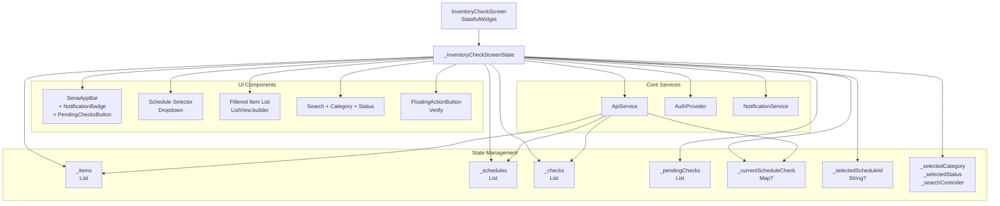

**Sources:** [client/lib/presentation/screens/inventory/inventory_check_screen.dart L23-L77](https://github.com/axchisan/GestionInventarioSENA/blob/a6b12d01/client/lib/presentation/screens/inventory/inventory_check_screen.dart#L23-L77)

 [client/lib/presentation/screens/inventory/inventory_check_screen.dart L79-L159](https://github.com/axchisan/GestionInventarioSENA/blob/a6b12d01/client/lib/presentation/screens/inventory/inventory_check_screen.dart#L79-L159)

---

## Data Initialization and Fetching

The screen performs comprehensive data loading on initialization, fetching all necessary entities from multiple API endpoints. The `_fetchData` method orchestrates this process with proper error handling and user feedback.

### Initial Data Load Flow

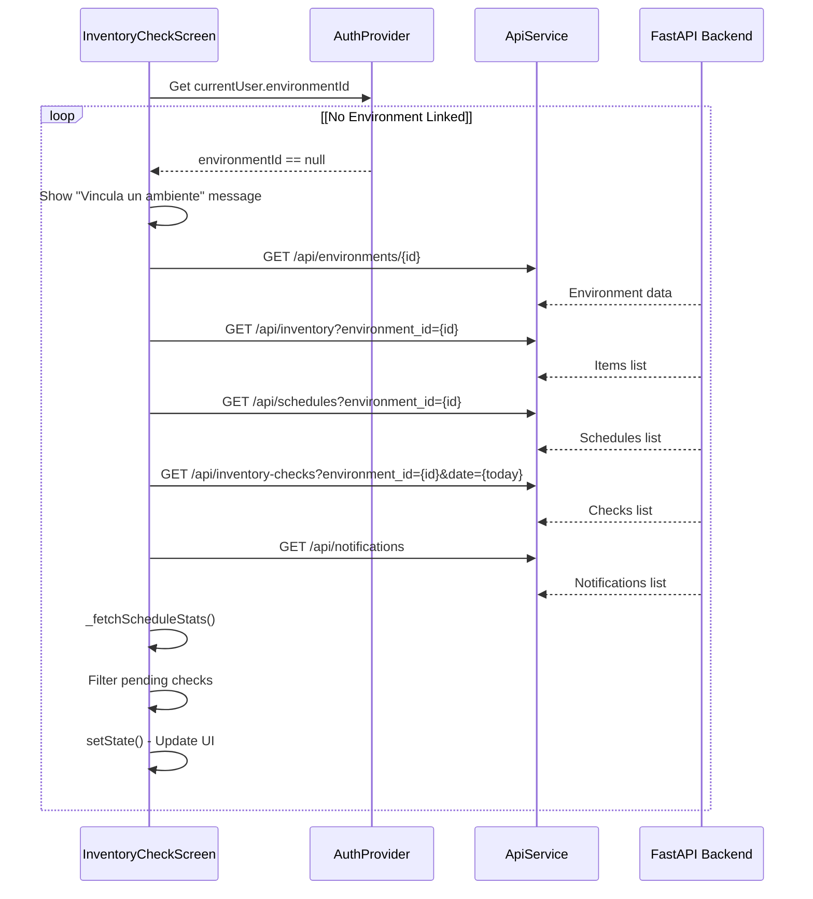

**Key Implementation Details:**

| Method | Purpose | API Endpoints |
| --- | --- | --- |
| `_fetchData()` | Primary data loading | `/api/environments/{id}`, `/api/inventory`, `/api/schedules`, `/api/inventory-checks`, `/api/notifications` |
| `_fetchScheduleStats()` | Get schedule-specific statistics | `/api/inventory-checks/schedule-stats` |
| `_fetchScheduleCheck()` | Get existing check for selected schedule | `/api/inventory-checks/by-schedule` |

**Sources:** [client/lib/presentation/screens/inventory/inventory_check_screen.dart L86-L159](https://github.com/axchisan/GestionInventarioSENA/blob/a6b12d01/client/lib/presentation/screens/inventory/inventory_check_screen.dart#L86-L159)

 [client/lib/presentation/screens/inventory/inventory_check_screen.dart L160-L182](https://github.com/axchisan/GestionInventarioSENA/blob/a6b12d01/client/lib/presentation/screens/inventory/inventory_check_screen.dart#L160-L182)

 [client/lib/presentation/screens/inventory/inventory_check_screen.dart L183-L206](https://github.com/axchisan/GestionInventarioSENA/blob/a6b12d01/client/lib/presentation/screens/inventory/inventory_check_screen.dart#L183-L206)

---

## Schedule Selection System

The schedule selection mechanism is critical for inventory verification, as each check must be associated with a specific schedule (shift/class period). The screen dynamically displays available schedules and manages the current selection state.

### Schedule Selection UI Component

The schedule selector appears in the screen body and shows schedules with formatted times, program information, and student counts. When a schedule is selected, the screen checks if a verification already exists for that schedule on the current date.

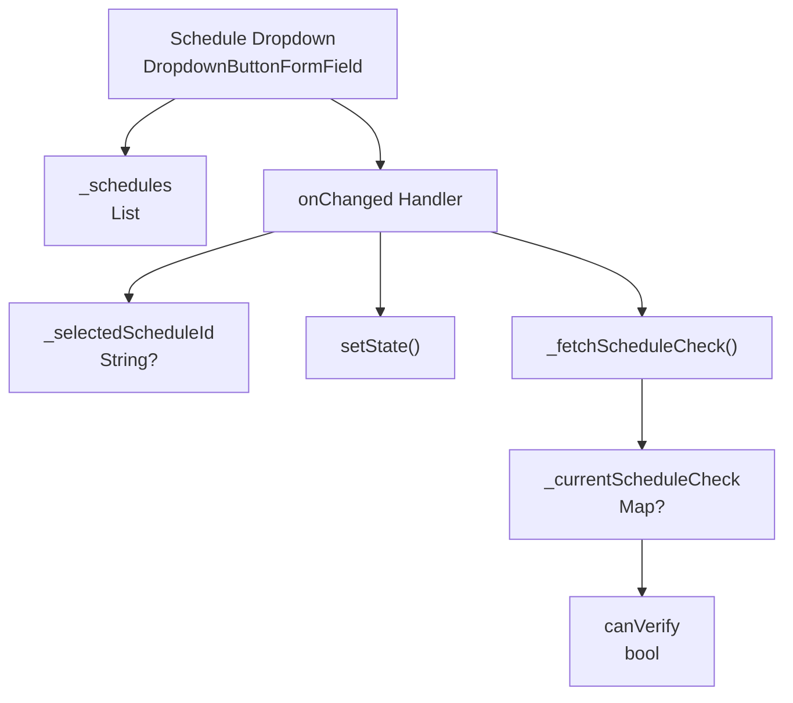

**Schedule Display Format:**

* **Time Range:** Formatted in 12-hour Colombian time (e.g., "02:00 PM - 04:00 PM")
* **Program:** Display as primary text
* **Student Count:** Badge showing number of students
* **Topic:** Subtitle text

**Sources:** [client/lib/presentation/screens/inventory/inventory_check_screen.dart L216-L223](https://github.com/axchisan/GestionInventarioSENA/blob/a6b12d01/client/lib/presentation/screens/inventory/inventory_check_screen.dart#L216-L223)

 [client/lib/presentation/screens/inventory/inventory_check_screen.dart L1011-L1119](https://github.com/axchisan/GestionInventarioSENA/blob/a6b12d01/client/lib/presentation/screens/inventory/inventory_check_screen.dart#L1011-L1119)

---

## Item Filtering and Display

The screen provides comprehensive filtering capabilities to help users navigate potentially large inventories. Items are displayed in a list with detailed status information and quantity tracking.

### Filtering System

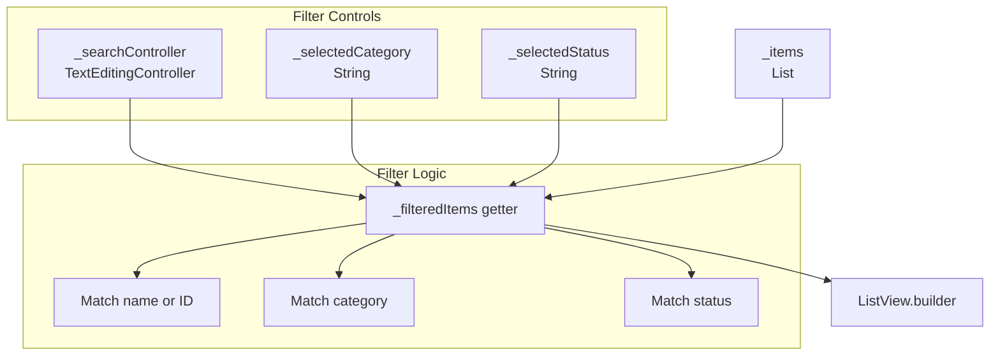

### Translation Maps

The screen maintains translation maps for user-friendly display of categories and statuses:

| Translation Type | Purpose | Example Mappings |
| --- | --- | --- |
| `_categoryTranslations` | Display Spanish category names | `computer` → "Computador", `projector` → "Proyector" |
| `_statusTranslations` | Display Spanish status labels | `available` → "Disponible", `damaged` → "Dañado", `instructor_review` → "Revisión Instructor" |

**Sources:** [client/lib/presentation/screens/inventory/inventory_check_screen.dart L51-L76](https://github.com/axchisan/GestionInventarioSENA/blob/a6b12d01/client/lib/presentation/screens/inventory/inventory_check_screen.dart#L51-L76)

 [client/lib/presentation/screens/inventory/inventory_check_screen.dart L207-L215](https://github.com/axchisan/GestionInventarioSENA/blob/a6b12d01/client/lib/presentation/screens/inventory/inventory_check_screen.dart#L207-L215)

---

## Item Display Card

Each inventory item is displayed as a card with comprehensive information including quantities, status indicators, and contextual actions.

### Item Card Structure

```mermaid
flowchart TD

Card["SenaCard Container"]
ItemName["Item Name<br>Bold Text"]
InternalCode["Internal Code / Serial"]
StatusBadge["Status Badge<br>Color-coded"]
QtyTotal["Total Quantity"]
QtyAvailable["Available Quantity"]
QtyDamaged["Damaged Quantity"]
QtyMissing["Missing Quantity"]
Category["Category"]
LastMaint["Last Maintenance"]
ViewDetails["View Details<br>onTap"]
EditButton["Edit Item<br>supervisor/admin only"]

Card --> ItemName
Card --> InternalCode
Card --> StatusBadge
Card --> QtyTotal
Card --> QtyAvailable
Card --> QtyDamaged
Card --> QtyMissing
Card --> Category
Card --> LastMaint
Card --> ViewDetails
Card --> EditButton

subgraph Actions ["Actions"]
    ViewDetails
    EditButton
end

subgraph subGraph2 ["Additional Info"]
    Category
    LastMaint
end

subgraph subGraph1 ["Quantity Display - Groups"]
    QtyTotal
    QtyAvailable
    QtyDamaged
    QtyMissing
end

subgraph subGraph0 ["Header Section"]
    ItemName
    InternalCode
    StatusBadge
end
```

**Quantity Calculation Logic:**

The screen calculates available quantities using the formula implemented in helper methods:

```
availableQuantity = totalQuantity - quantityDamaged - quantityMissing
```

**Sources:** [client/lib/presentation/screens/inventory/inventory_check_screen.dart L243-L266](https://github.com/axchisan/GestionInventarioSENA/blob/a6b12d01/client/lib/presentation/screens/inventory/inventory_check_screen.dart#L243-L266)

 [client/lib/presentation/screens/inventory/inventory_check_screen.dart L539-L693](https://github.com/axchisan/GestionInventarioSENA/blob/a6b12d01/client/lib/presentation/screens/inventory/inventory_check_screen.dart#L539-L693)

---

## Verification Creation Dialog

The core functionality of the screen is the verification creation/update dialog, which allows users to record cleanliness, organization, and inventory completeness status. The dialog adapts based on user role and existing check state.

### Verification Dialog Flow

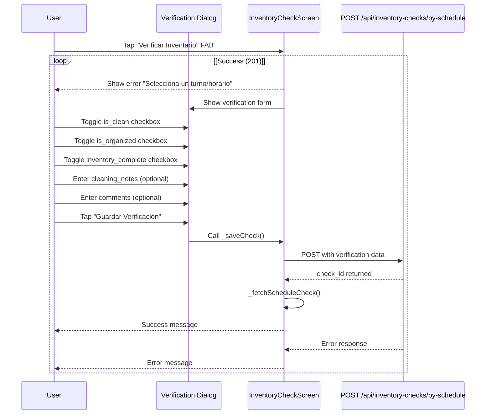

### Verification Request Payload

The `_saveCheck` method constructs and sends the following payload:

| Field | Type | Source | Required |
| --- | --- | --- | --- |
| `environment_id` | UUID | `authProvider.currentUser.environmentId` | Yes |
| `schedule_id` | UUID | `_selectedScheduleId` | Yes |
| `is_clean` | bool | Dialog checkbox | Yes |
| `is_organized` | bool | Dialog checkbox | Yes |
| `inventory_complete` | bool | Dialog checkbox | Yes |
| `cleaning_notes` | String | `_cleaningNotesController.text` | Optional |
| `comments` | String | Dialog text input | Optional |

**Sources:** [client/lib/presentation/screens/inventory/inventory_check_screen.dart L812-L880](https://github.com/axchisan/GestionInventarioSENA/blob/a6b12d01/client/lib/presentation/screens/inventory/inventory_check_screen.dart#L812-L880)

 [client/lib/presentation/screens/inventory/inventory_check_screen.dart L1131-L1308](https://github.com/axchisan/GestionInventarioSENA/blob/a6b12d01/client/lib/presentation/screens/inventory/inventory_check_screen.dart#L1131-L1308)

---

## Role-Based Verification Logic

The screen implements role-specific verification capabilities, determining whether a user can create or update a verification based on their role and the current check status.

### Verification Permission Matrix

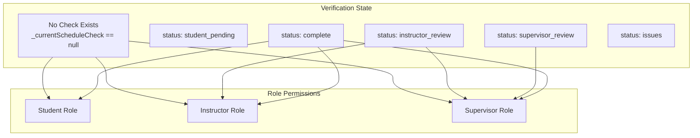

### Permission Calculation Code

The screen calculates `canVerify` boolean based on role and status:

```
bool canVerify = false;
if (_selectedScheduleId != null) {
  if (role == 'student') {
    canVerify = _currentScheduleCheck == null;
  } else if (role == 'instructor') {
    canVerify = _currentScheduleCheck == null || _currentStatus == 'instructor_review';
  } else if (role == 'supervisor') {
    canVerify = _currentScheduleCheck == null || _currentStatus != 'complete';
  }
}
```

**Sources:** [client/lib/presentation/screens/inventory/inventory_check_screen.dart L887-L898](https://github.com/axchisan/GestionInventarioSENA/blob/a6b12d01/client/lib/presentation/screens/inventory/inventory_check_screen.dart#L887-L898)

---

## Action Bar and Navigation

The app bar includes several action buttons providing quick access to related functionality and system status indicators.

### App Bar Actions

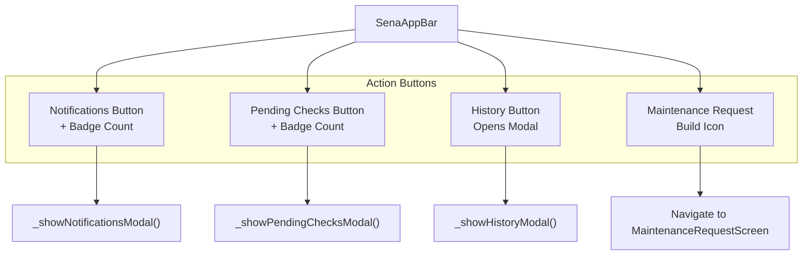

### Notification Badge

The notification button displays a badge using `NotificationBadge` widget, showing the count of unread notifications:

* Fetches notifications from `/api/notifications`
* Filters for `is_read: false`
* Displays count as badge overlay
* Opens modal showing notification list

### Pending Checks Badge

The pending checks button shows a count of checks awaiting user action:

* Filters checks with status in `["pending", "instructor_review", "supervisor_review"]`
* Conditionally displayed only if `_pendingChecks.isNotEmpty`
* Badge color: `AppColors.warning`

**Sources:** [client/lib/presentation/screens/inventory/inventory_check_screen.dart L900-L960](https://github.com/axchisan/GestionInventarioSENA/blob/a6b12d01/client/lib/presentation/screens/inventory/inventory_check_screen.dart#L900-L960)

 [client/lib/presentation/screens/inventory/inventory_check_screen.dart L1310-L1495](https://github.com/axchisan/GestionInventarioSENA/blob/a6b12d01/client/lib/presentation/screens/inventory/inventory_check_screen.dart#L1310-L1495)

---

## Check Details Dialog

When users tap on a check in the history or pending lists, a detailed dialog displays comprehensive check information organized into themed sections.

### Check Details Structure

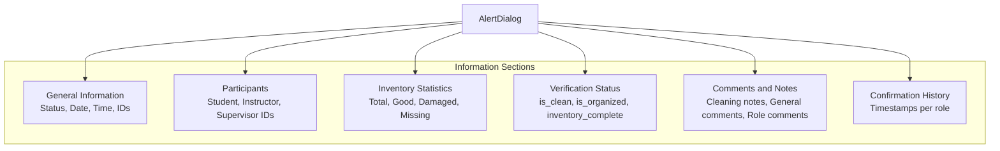

### Data Display Formatting

The dialog uses helper methods to format data for display:

| Method | Purpose | Format |
| --- | --- | --- |
| `_formatDateTime()` | Format ISO timestamps | `dd/MM/yyyy hh:mm a` |
| `_formatColombianTime()` | Format time strings | `hh:mm a` (12-hour) |
| `_buildDetailRow()` | Create label-value row | Bold label + value text |

**Sources:** [client/lib/presentation/screens/inventory/inventory_check_screen.dart L294-L498](https://github.com/axchisan/GestionInventarioSENA/blob/a6b12d01/client/lib/presentation/screens/inventory/inventory_check_screen.dart#L294-L498)

 [client/lib/presentation/screens/inventory/inventory_check_screen.dart L499-L534](https://github.com/axchisan/GestionInventarioSENA/blob/a6b12d01/client/lib/presentation/screens/inventory/inventory_check_screen.dart#L499-L534)

---

## Item Details Dialog

Similar to check details, tapping an item card opens a comprehensive details dialog showing all item information grouped by category.

### Item Details Sections

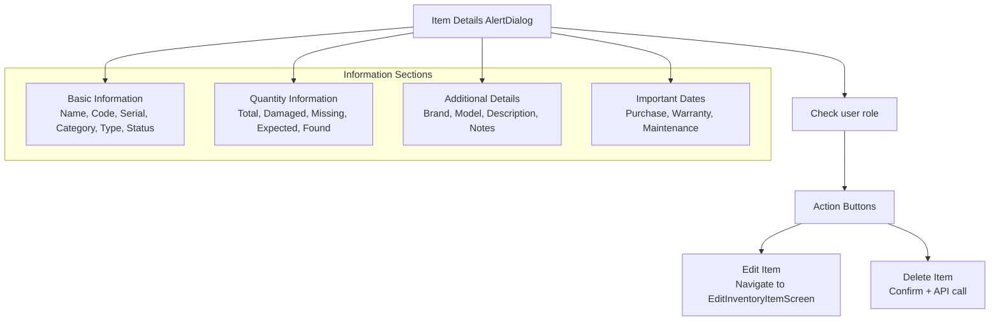

**Sources:** [client/lib/presentation/screens/inventory/inventory_check_screen.dart L539-L693](https://github.com/axchisan/GestionInventarioSENA/blob/a6b12d01/client/lib/presentation/screens/inventory/inventory_check_screen.dart#L539-L693)

 [client/lib/presentation/screens/inventory/inventory_check_screen.dart L786-L811](https://github.com/axchisan/GestionInventarioSENA/blob/a6b12d01/client/lib/presentation/screens/inventory/inventory_check_screen.dart#L786-L811)

---

## Status Color Coding

The screen implements consistent color coding across all status displays to provide quick visual feedback on item and check conditions.

### Color Mapping System

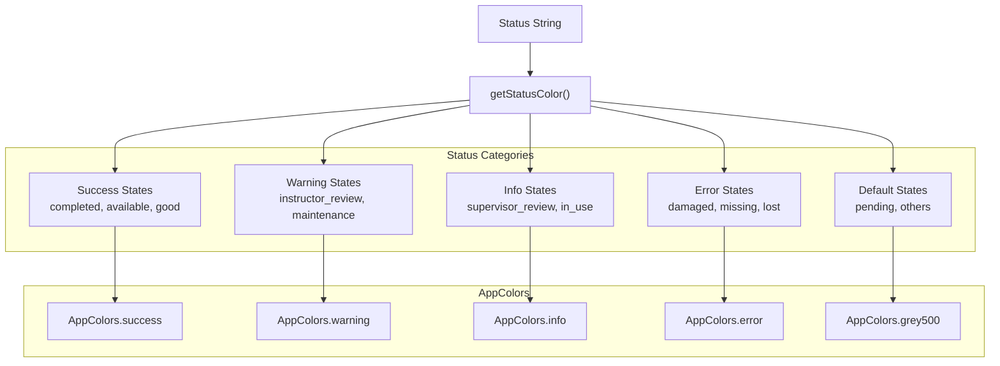

**Sources:** [client/lib/presentation/screens/inventory/inventory_check_screen.dart L268-L293](https://github.com/axchisan/GestionInventarioSENA/blob/a6b12d01/client/lib/presentation/screens/inventory/inventory_check_screen.dart#L268-L293)

---

## Environment Statistics Display

The screen header displays real-time environment-level statistics calculated from the current inventory items, providing supervisors and instructors with an overview of the environment's inventory health.

### Statistics Calculation

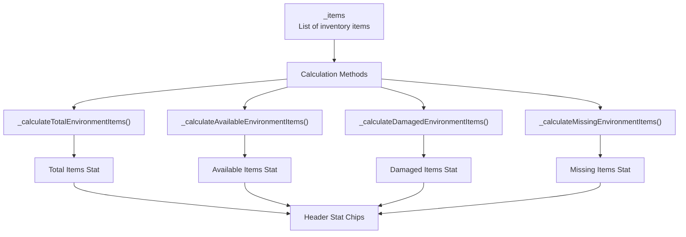

**Calculation Formulas:**

* **Total Items:** `sum(item.quantity for all items)`
* **Damaged Items:** `sum(item.quantity_damaged for all items)`
* **Missing Items:** `sum(item.quantity_missing for all items)`
* **Available Items:** `sum((item.quantity - item.quantity_damaged - item.quantity_missing) for all items)`

**Sources:** [client/lib/presentation/screens/inventory/inventory_check_screen.dart L243-L266](https://github.com/axchisan/GestionInventarioSENA/blob/a6b12d01/client/lib/presentation/screens/inventory/inventory_check_screen.dart#L243-L266)

 [client/lib/presentation/screens/inventory/inventory_check_screen.dart L978-L1009](https://github.com/axchisan/GestionInventarioSENA/blob/a6b12d01/client/lib/presentation/screens/inventory/inventory_check_screen.dart#L978-L1009)

---

## Navigation to Maintenance Request

The screen provides direct navigation to the maintenance request system, allowing users to quickly report equipment issues discovered during verification.

### Maintenance Navigation Flow

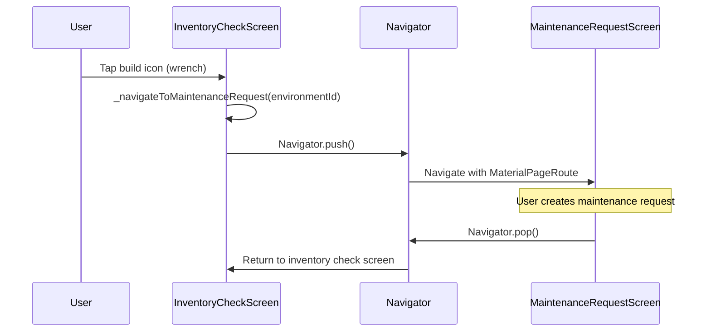

**Navigation Implementation:**

The screen uses Flutter's `Navigator.push` with `MaterialPageRoute` to navigate to `MaintenanceRequestScreen`, passing the current environment ID as a parameter.

**Sources:** [client/lib/presentation/screens/inventory/inventory_check_screen.dart L1497-L1507](https://github.com/axchisan/GestionInventarioSENA/blob/a6b12d01/client/lib/presentation/screens/inventory/inventory_check_screen.dart#L1497-L1507)

---

## API Integration Points

The screen interacts with multiple backend API endpoints to fetch data, create verifications, and synchronize state.

### API Endpoint Usage Matrix

| Endpoint | Method | Purpose | Response |
| --- | --- | --- | --- |
| `/api/environments/{id}` | GET | Fetch environment details | Environment object |
| `/api/inventory` | GET | List items by environment | Array of InventoryItem |
| `/api/schedules/` | GET | List schedules by environment | Array of Schedule |
| `/api/inventory-checks` | GET | List checks with filters | Array of InventoryCheck |
| `/api/inventory-checks/by-schedule` | GET | Get check for specific schedule/date | Array (single check) |
| `/api/inventory-checks/by-schedule` | POST | Create/update verification | `{status: success, check_id}` |
| `/api/inventory-checks/schedule-stats` | GET | Get schedule statistics | Stats object |
| `/api/notifications/` | GET | Fetch user notifications | Array of Notification |

### Backend Router Integration

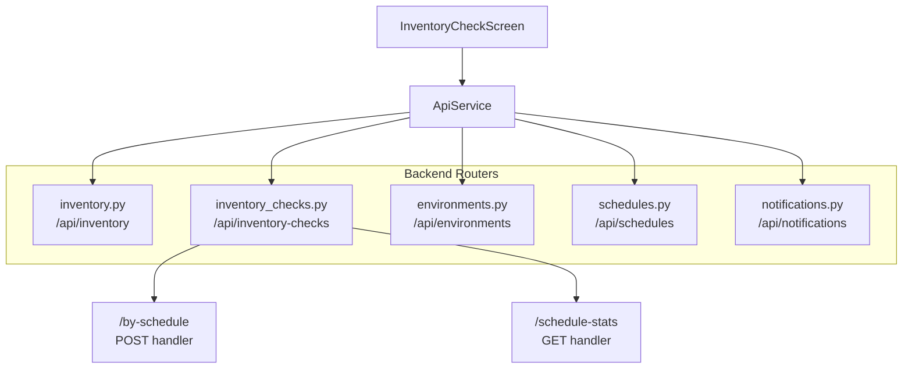

**Sources:** [client/lib/presentation/screens/inventory/inventory_check_screen.dart L86-L159](https://github.com/axchisan/GestionInventarioSENA/blob/a6b12d01/client/lib/presentation/screens/inventory/inventory_check_screen.dart#L86-L159)

 [server/app/routers/inventory_checks.py L153-L328](https://github.com/axchisan/GestionInventarioSENA/blob/a6b12d01/server/app/routers/inventory_checks.py#L153-L328)

 [server/app/routers/inventory_checks.py L433-L476](https://github.com/axchisan/GestionInventarioSENA/blob/a6b12d01/server/app/routers/inventory_checks.py#L433-L476)

---

## Error Handling and User Feedback

The screen implements comprehensive error handling and provides user feedback through SnackBar notifications for various operations.

### Error Scenarios

| Scenario | Condition | User Message |
| --- | --- | --- |
| No Environment Linked | `user.environmentId == null` | "Vincula un ambiente para verificar el inventario" |
| Data Fetch Failed | API call exception | "Error al cargar datos: {error}" |
| No Schedule Selected | Verification attempt without schedule | "Selecciona un turno/horario primero" |
| User Not Authenticated | `user == null` during save | "Error: Usuario no autenticado" |
| Verification Save Success | HTTP 201 response | "Verificación guardada exitosamente" |
| Verification Save Failed | HTTP error response | "Error: {statusCode} - {errorData}" |

### SnackBar Color Coding

* **Success:** `AppColors.success` - Green background
* **Error:** `AppColors.error` - Red background
* **Info:** Default Material Design color

**Sources:** [client/lib/presentation/screens/inventory/inventory_check_screen.dart L89-L99](https://github.com/axchisan/GestionInventarioSENA/blob/a6b12d01/client/lib/presentation/screens/inventory/inventory_check_screen.dart#L89-L99)

 [client/lib/presentation/screens/inventory/inventory_check_screen.dart L820-L834](https://github.com/axchisan/GestionInventarioSENA/blob/a6b12d01/client/lib/presentation/screens/inventory/inventory_check_screen.dart#L820-L834)

 [client/lib/presentation/screens/inventory/inventory_check_screen.dart L852-L879](https://github.com/axchisan/GestionInventarioSENA/blob/a6b12d01/client/lib/presentation/screens/inventory/inventory_check_screen.dart#L852-L879)

---

## State Refresh and Pull-to-Refresh

The screen supports manual refresh through pull-to-refresh gesture, allowing users to reload all data without leaving the screen.

### Refresh Flow

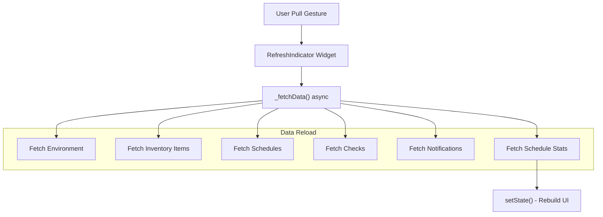

The `RefreshIndicator` widget wraps the main body content and calls `_fetchData()` asynchronously when triggered.

**Sources:** [client/lib/presentation/screens/inventory/inventory_check_screen.dart L964-L965](https://github.com/axchisan/GestionInventarioSENA/blob/a6b12d01/client/lib/presentation/screens/inventory/inventory_check_screen.dart#L964-L965)

---

## Floating Action Button Logic

The screen displays a floating action button (FAB) for initiating verification, which is conditionally shown based on role permissions and current verification state.

### FAB Visibility and Behavior

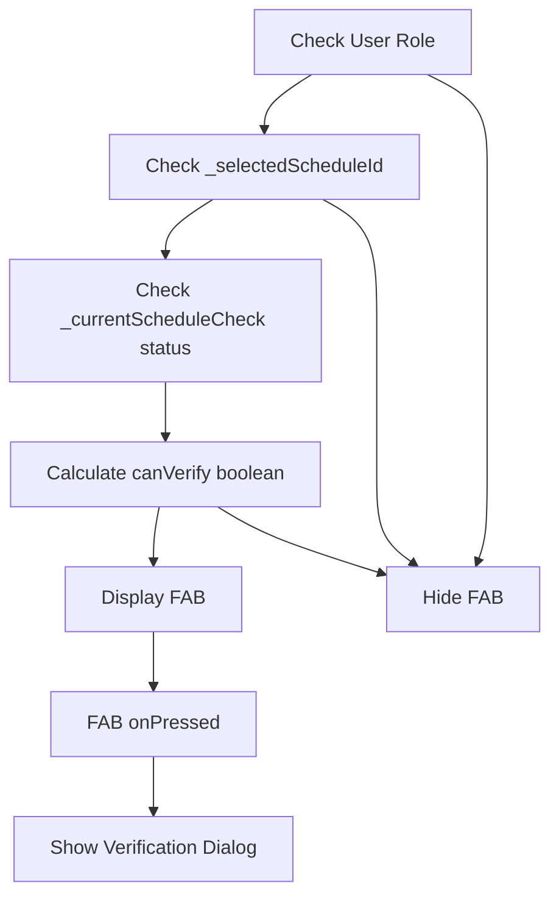

**FAB Appearance:**

* **Icon:** `Icons.check_circle`
* **Background:** `AppColors.primary`
* **Label:** "Verificar Inventario"
* **Disabled State:** Gray color when `!canVerify`

**Sources:** [client/lib/presentation/screens/inventory/inventory_check_screen.dart L887-L898](https://github.com/axchisan/GestionInventarioSENA/blob/a6b12d01/client/lib/presentation/screens/inventory/inventory_check_screen.dart#L887-L898)

 [client/lib/presentation/screens/inventory/inventory_check_screen.dart L1853-L1883](https://github.com/axchisan/GestionInventarioSENA/blob/a6b12d01/client/lib/presentation/screens/inventory/inventory_check_screen.dart#L1853-L1883)