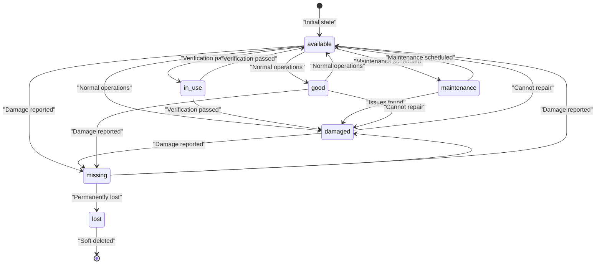
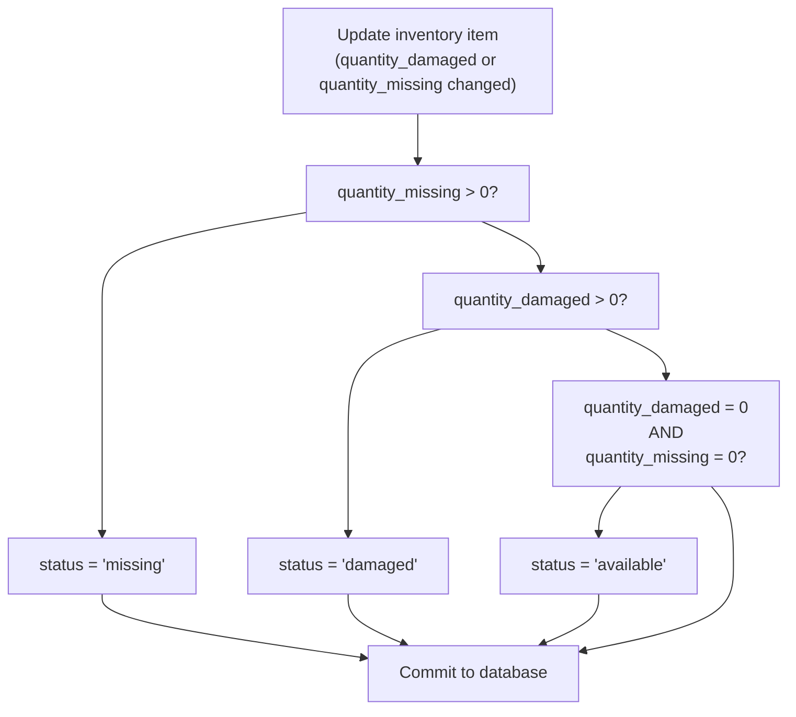
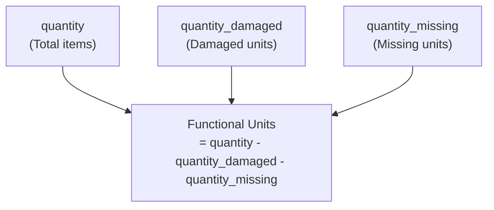
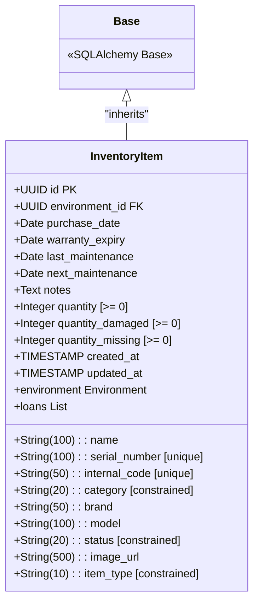

# Inventory Data Model

> **Relevant source files**
> * [client/lib/presentation/screens/feedback/feedback_form_screen.dart](https://github.com/axchisan/GestionInventarioSENA/blob/a6b12d01/client/lib/presentation/screens/feedback/feedback_form_screen.dart)
> * [server/app/models/inventory_items.py](https://github.com/axchisan/GestionInventarioSENA/blob/a6b12d01/server/app/models/inventory_items.py)
> * [server/app/models/maintenance_requests.py](https://github.com/axchisan/GestionInventarioSENA/blob/a6b12d01/server/app/models/maintenance_requests.py)
> * [server/app/routers/feedback.py](https://github.com/axchisan/GestionInventarioSENA/blob/a6b12d01/server/app/routers/feedback.py)
> * [server/app/routers/inventory.py](https://github.com/axchisan/GestionInventarioSENA/blob/a6b12d01/server/app/routers/inventory.py)
> * [server/app/routers/maintenance_requests.py](https://github.com/axchisan/GestionInventarioSENA/blob/a6b12d01/server/app/routers/maintenance_requests.py)
> * [server/app/routers/notifications.py](https://github.com/axchisan/GestionInventarioSENA/blob/a6b12d01/server/app/routers/notifications.py)

## Purpose and Scope

This document describes the `InventoryItem` database model, which represents physical equipment and assets tracked within the SENA Inventory Management System. The model defines the schema for inventory items including their attributes, relationships to other entities, validation constraints, and automatic status management logic.

For information about the API endpoints that operate on inventory items, see [Inventory Items API](/axchisan/GestionInventarioSENA/6.1-inventory-items-api). For details about the UI screens used to edit inventory items, see [Edit Inventory Screen](/axchisan/GestionInventarioSENA/6.3-edit-inventory-screen).

## Model Overview

The `InventoryItem` model is the central entity for tracking physical assets in the system. Each item belongs to an `Environment` (physical location) and can be associated with loans and maintenance requests.

```css
#mermaid-6k1o6fcri7c{font-family:ui-sans-serif,-apple-system,system-ui,Segoe UI,Helvetica;font-size:16px;fill:#333;}@keyframes edge-animation-frame{from{stroke-dashoffset:0;}}@keyframes dash{to{stroke-dashoffset:0;}}#mermaid-6k1o6fcri7c .edge-animation-slow{stroke-dasharray:9,5!important;stroke-dashoffset:900;animation:dash 50s linear infinite;stroke-linecap:round;}#mermaid-6k1o6fcri7c .edge-animation-fast{stroke-dasharray:9,5!important;stroke-dashoffset:900;animation:dash 20s linear infinite;stroke-linecap:round;}#mermaid-6k1o6fcri7c .error-icon{fill:#dddddd;}#mermaid-6k1o6fcri7c .error-text{fill:#222222;stroke:#222222;}#mermaid-6k1o6fcri7c .edge-thickness-normal{stroke-width:1px;}#mermaid-6k1o6fcri7c .edge-thickness-thick{stroke-width:3.5px;}#mermaid-6k1o6fcri7c .edge-pattern-solid{stroke-dasharray:0;}#mermaid-6k1o6fcri7c .edge-thickness-invisible{stroke-width:0;fill:none;}#mermaid-6k1o6fcri7c .edge-pattern-dashed{stroke-dasharray:3;}#mermaid-6k1o6fcri7c .edge-pattern-dotted{stroke-dasharray:2;}#mermaid-6k1o6fcri7c .marker{fill:#999;stroke:#999;}#mermaid-6k1o6fcri7c .marker.cross{stroke:#999;}#mermaid-6k1o6fcri7c svg{font-family:ui-sans-serif,-apple-system,system-ui,Segoe UI,Helvetica;font-size:16px;}#mermaid-6k1o6fcri7c p{margin:0;}#mermaid-6k1o6fcri7c .entityBox{fill:#ffffff;stroke:#dddddd;}#mermaid-6k1o6fcri7c .relationshipLabelBox{fill:#dddddd;opacity:0.7;background-color:#dddddd;}#mermaid-6k1o6fcri7c .relationshipLabelBox rect{opacity:0.5;}#mermaid-6k1o6fcri7c .labelBkg{background-color:rgba(221, 221, 221, 0.5);}#mermaid-6k1o6fcri7c .edgeLabel .label{fill:#dddddd;font-size:14px;}#mermaid-6k1o6fcri7c .label{font-family:ui-sans-serif,-apple-system,system-ui,Segoe UI,Helvetica;color:#333;}#mermaid-6k1o6fcri7c .edge-pattern-dashed{stroke-dasharray:8,8;}#mermaid-6k1o6fcri7c .node rect,#mermaid-6k1o6fcri7c .node circle,#mermaid-6k1o6fcri7c .node ellipse,#mermaid-6k1o6fcri7c .node polygon{fill:#ffffff;stroke:#dddddd;stroke-width:1px;}#mermaid-6k1o6fcri7c .relationshipLine{stroke:#999;stroke-width:1;fill:none;}#mermaid-6k1o6fcri7c .marker{fill:none!important;stroke:#999!important;stroke-width:1;}#mermaid-6k1o6fcri7c :root{--mermaid-font-family:"trebuchet ms",verdana,arial,sans-serif;}belongs tocan be borrowed inmay requireverified inInventoryItemUUIDidPKUUIDenvironment_idFKStringnameStringserial_numberStringinternal_codeStringcategoryStringbrandStringmodelStringstatusDatepurchase_dateDatewarranty_expiryDatelast_maintenanceDatenext_maintenanceStringimage_urlTextnotesIntegerquantityIntegerquantity_damagedIntegerquantity_missingStringitem_typeTIMESTAMPcreated_atTIMESTAMPupdated_atEnvironmentUUIDidPKStringnameStringlocationBooleanis_warehouseBooleanis_activeLoanUUIDidPKUUIDitem_idFKUUIDuser_idFKStringstatusDateTimestart_dateDateTimeend_dateMaintenanceRequestUUIDidPKUUIDitem_idFKUUIDenvironment_idFKUUIDuser_idFKStringpriorityStringstatusStringcategoryInventoryCheckItem
```

**Sources:** [server/app/models/inventory_items.py L9-L46](https://github.com/axchisan/GestionInventarioSENA/blob/a6b12d01/server/app/models/inventory_items.py#L9-L46)

 [server/app/models/maintenance_requests.py L8-L36](https://github.com/axchisan/GestionInventarioSENA/blob/a6b12d01/server/app/models/maintenance_requests.py#L8-L36)

## Field Definitions

The `InventoryItem` table (`inventory_items`) contains the following fields:

| Field | Type | Nullable | Default | Description |
| --- | --- | --- | --- | --- |
| `id` | UUID | No | `uuid.uuid4()` | Primary key identifier |
| `environment_id` | UUID | No | - | Foreign key to `environments.id` with CASCADE delete |
| `name` | String(100) | No | - | Display name of the item |
| `serial_number` | String(100) | Yes | - | Manufacturer serial number (unique if provided) |
| `internal_code` | String(50) | No | - | Internal tracking code (unique, required) |
| `category` | String(20) | No | - | Item category (see Categories section) |
| `brand` | String(50) | Yes | - | Manufacturer brand |
| `model` | String(100) | Yes | - | Model number or name |
| `status` | String(20) | No | `"available"` | Current status (see Status section) |
| `purchase_date` | Date | Yes | - | Date item was purchased |
| `warranty_expiry` | Date | Yes | - | Warranty expiration date |
| `last_maintenance` | Date | Yes | - | Date of most recent maintenance |
| `next_maintenance` | Date | Yes | - | Scheduled next maintenance date |
| `image_url` | String(500) | Yes | - | URL to item image in storage |
| `notes` | Text | Yes | - | Additional notes or comments |
| `quantity` | Integer | No | `1` | Total quantity of items |
| `quantity_damaged` | Integer | No | `0` | Number of damaged units |
| `quantity_missing` | Integer | No | `0` | Number of missing units |
| `item_type` | String(10) | No | `"individual"` | Classification: `"individual"` or `"group"` |
| `created_at` | TIMESTAMP | No | `current_timestamp()` | Record creation timestamp |
| `updated_at` | TIMESTAMP | No | `current_timestamp()` | Record last update timestamp |

**Sources:** [server/app/models/inventory_items.py L12-L33](https://github.com/axchisan/GestionInventarioSENA/blob/a6b12d01/server/app/models/inventory_items.py#L12-L33)

## Categories

The `category` field is constrained to the following values:

| Category Value | Description |
| --- | --- |
| `computer` | Desktop and laptop computers |
| `projector` | Video projectors |
| `keyboard` | Computer keyboards |
| `mouse` | Computer mice |
| `tv` | Televisions and displays |
| `camera` | Cameras and recording equipment |
| `microphone` | Audio recording equipment |
| `tablet` | Tablet devices |
| `other` | Miscellaneous equipment |

This constraint is enforced at the database level via check constraint `check_category`.

**Sources:** [server/app/models/inventory_items.py L39](https://github.com/axchisan/GestionInventarioSENA/blob/a6b12d01/server/app/models/inventory_items.py#L39-L39)

## Status Values and State Machine

The `status` field represents the current operational state of an item. Valid values are:

| Status Value | Description | Usage |
| --- | --- | --- |
| `available` | Item is available for use | Default state when no issues exist |
| `in_use` | Item is currently being used | Manually set or set during active loan |
| `maintenance` | Item is undergoing maintenance | Set when maintenance is scheduled |
| `damaged` | Item has damage | Automatically set when `quantity_damaged > 0` |
| `missing` | Item is missing | Automatically set when `quantity_missing > 0` |
| `good` | Item verified as good condition | Used during verification workflow |
| `lost` | Item is permanently lost | Soft-delete status - filtered from queries |



The constraint is enforced via check constraint `check_status`. Items with `status = 'lost'` are filtered from most queries.

**Sources:** [server/app/models/inventory_items.py L40](https://github.com/axchisan/GestionInventarioSENA/blob/a6b12d01/server/app/models/inventory_items.py#L40-L40)

 [server/app/routers/inventory.py L23-L54](https://github.com/axchisan/GestionInventarioSENA/blob/a6b12d01/server/app/routers/inventory.py#L23-L54)

## Automatic Status Calculation

The system automatically calculates and updates the `status` field based on quantity values. This logic is implemented in the inventory update endpoints:



This logic is implemented in two locations:

1. **Regular Update Endpoint** - Used by supervisors, admins, and admin_general for general item editing
2. **Verification Update Endpoint** - Used during inventory verification by all roles with minimal required fields

**Sources:** [server/app/routers/inventory.py L93-L134](https://github.com/axchisan/GestionInventarioSENA/blob/a6b12d01/server/app/routers/inventory.py#L93-L134)

## Item Type Classification

The `item_type` field distinguishes between two inventory tracking modes:

| Item Type | Description | Example Use Case |
| --- | --- | --- |
| `individual` | Each unit tracked separately | High-value items like laptops, each with unique serial number |
| `group` | Units tracked as a collective quantity | Consumables or low-value items like mice, keyboards |

The constraint is enforced via check constraint `check_item_type`. For `group` items, the `quantity` field represents the total count, while `individual` items typically have `quantity = 1`.

**Sources:** [server/app/models/inventory_items.py L30-L41](https://github.com/axchisan/GestionInventarioSENA/blob/a6b12d01/server/app/models/inventory_items.py#L30-L41)

## Quantity Tracking System

The model implements a three-field quantity tracking system:



### Validation Rules

All quantity fields must be non-negative integers (enforced via check constraints):

* `CheckConstraint("quantity >= 0", name="check_quantity")`
* `CheckConstraint("quantity_damaged >= 0", name="check_quantity_damaged")`
* `CheckConstraint("quantity_missing >= 0", name="check_quantity_missing")`

### Quantity Update Logic

When quantities are updated during verification:

1. The verification endpoint accepts partial updates with nullable fields
2. Each non-null quantity value replaces the existing value
3. After quantity updates, automatic status calculation runs
4. If `quantity_missing > 0`, status becomes `missing` (highest priority)
5. Else if `quantity_damaged > 0`, status becomes `damaged`
6. Else if both are zero, status becomes `available`

**Sources:** [server/app/models/inventory_items.py L27-L44](https://github.com/axchisan/GestionInventarioSENA/blob/a6b12d01/server/app/models/inventory_items.py#L27-L44)

 [server/app/routers/inventory.py L120-L134](https://github.com/axchisan/GestionInventarioSENA/blob/a6b12d01/server/app/routers/inventory.py#L120-L134)

## Database Relationships

### Environment Relationship

Each `InventoryItem` must belong to exactly one `Environment`:

```
environment_id = Column(UUID(as_uuid=True), ForeignKey("environments.id", ondelete="CASCADE"))
environment = relationship("Environment", back_populates="inventory_items")
```

The `CASCADE` delete ensures that when an environment is deleted, all its inventory items are also removed. This relationship enables:

* Environment-based filtering in queries
* Multi-tenant data isolation
* Location-based inventory organization
* Role-based access control (users assigned to environments)

**Sources:** [server/app/models/inventory_items.py L13-L35](https://github.com/axchisan/GestionInventarioSENA/blob/a6b12d01/server/app/models/inventory_items.py#L13-L35)

### Loan Relationship

Items can have multiple associated loans:

```
loans = relationship("Loan", back_populates="item")
```

This one-to-many relationship tracks borrowing history and active loans for each item. The relationship is used to:

* Track which items are currently borrowed
* Maintain loan history
* Update item status during active loans

**Sources:** [server/app/models/inventory_items.py L36](https://github.com/axchisan/GestionInventarioSENA/blob/a6b12d01/server/app/models/inventory_items.py#L36-L36)

### Maintenance Request Relationship

Items can have multiple maintenance requests:

```
item_id = Column(UUID(as_uuid=True), ForeignKey("inventory_items.id", ondelete="CASCADE"), nullable=True)
```

The foreign key in `MaintenanceRequest` references `InventoryItem.id`. Note that `item_id` is nullable because maintenance requests can also be environment-level (not item-specific). A check constraint enforces that either `item_id` or `environment_id` must be non-null:

```
CheckConstraint("(item_id IS NOT NULL) OR (environment_id IS NOT NULL)", name="check_item_or_environment")
```

**Sources:** [server/app/models/maintenance_requests.py L12-L34](https://github.com/axchisan/GestionInventarioSENA/blob/a6b12d01/server/app/models/maintenance_requests.py#L12-L34)

## Unique Constraints

Two fields have uniqueness constraints:

| Field | Constraint | Purpose |
| --- | --- | --- |
| `serial_number` | Unique (if not null) | Prevents duplicate manufacturer serial numbers |
| `internal_code` | Unique (required) | Ensures each item has unique internal tracking code |

The `serial_number` uniqueness only applies when the value is not null, allowing multiple items without serial numbers. The `internal_code` is always required and must be unique across all items.

**Sources:** [server/app/models/inventory_items.py L15-L16](https://github.com/axchisan/GestionInventarioSENA/blob/a6b12d01/server/app/models/inventory_items.py#L15-L16)

## Table Definition Summary

The complete table definition in SQLAlchemy ORM:



The model extends `Base` from SQLAlchemy and uses the table name `inventory_items`. All database operations are performed through SQLAlchemy ORM sessions obtained via `get_db()` dependency injection.

**Sources:** [server/app/models/inventory_items.py L9-L46](https://github.com/axchisan/GestionInventarioSENA/blob/a6b12d01/server/app/models/inventory_items.py#L9-L46)