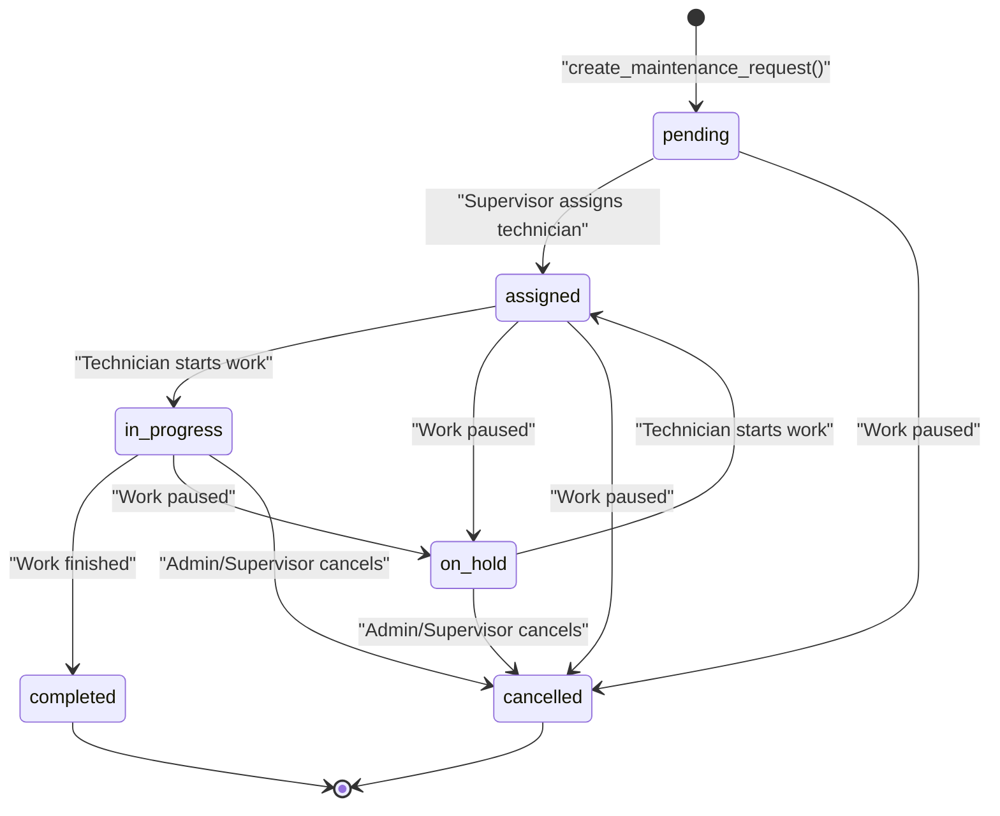
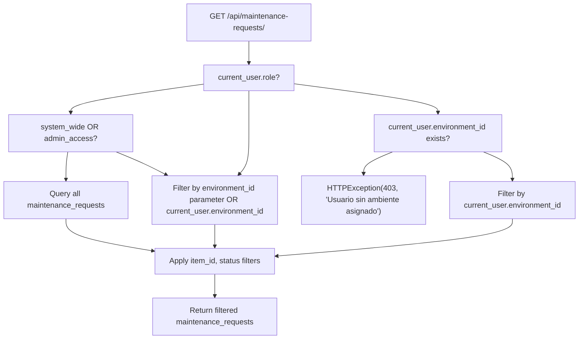

# Maintenance Data Model

> **Relevant source files**
> * [client/lib/presentation/screens/feedback/feedback_form_screen.dart](https://github.com/axchisan/GestionInventarioSENA/blob/a6b12d01/client/lib/presentation/screens/feedback/feedback_form_screen.dart)
> * [server/app/models/inventory_items.py](https://github.com/axchisan/GestionInventarioSENA/blob/a6b12d01/server/app/models/inventory_items.py)
> * [server/app/models/maintenance_requests.py](https://github.com/axchisan/GestionInventarioSENA/blob/a6b12d01/server/app/models/maintenance_requests.py)
> * [server/app/routers/feedback.py](https://github.com/axchisan/GestionInventarioSENA/blob/a6b12d01/server/app/routers/feedback.py)
> * [server/app/routers/inventory.py](https://github.com/axchisan/GestionInventarioSENA/blob/a6b12d01/server/app/routers/inventory.py)
> * [server/app/routers/maintenance_requests.py](https://github.com/axchisan/GestionInventarioSENA/blob/a6b12d01/server/app/routers/maintenance_requests.py)
> * [server/app/routers/notifications.py](https://github.com/axchisan/GestionInventarioSENA/blob/a6b12d01/server/app/routers/notifications.py)

## Purpose and Scope

This document describes the `MaintenanceRequest` database model, which stores information about equipment maintenance requests, repair tracking, and workflow state management. The model supports both item-specific maintenance (linked to individual equipment) and general environment maintenance (facility-level repairs).

For information about the API endpoints that operate on this model, see [Maintenance Request API](/axchisan/GestionInventarioSENA/7.1-maintenance-request-api). For the overall maintenance request workflow, see [Maintenance Request System](/axchisan/GestionInventarioSENA/7-maintenance-request-system).

Sources: [server/app/models/maintenance_requests.py L1-L36](https://github.com/axchisan/GestionInventarioSENA/blob/a6b12d01/server/app/models/maintenance_requests.py#L1-L36)

---

## Model Overview

The `MaintenanceRequest` model is defined in the `maintenance_requests` table and serves as the primary entity for tracking repair and maintenance activities throughout their lifecycle. Each request captures the problem description, priority, assignment, and completion tracking.

**Key Characteristics:**

* Supports dual-mode operation: item-specific or environment-general maintenance
* Implements a five-state workflow: `pending` → `assigned` → `in_progress` → `completed`/`cancelled`
* Tracks both requester and assigned technician
* Stores cost and completion date information for reporting

Sources: [server/app/models/maintenance_requests.py L8-L36](https://github.com/axchisan/GestionInventarioSENA/blob/a6b12d01/server/app/models/maintenance_requests.py#L8-L36)

---

## Database Schema

### Table: maintenance_requests

The following table describes all fields in the `MaintenanceRequest` model:

| Field | Type | Nullable | Default | Description |
| --- | --- | --- | --- | --- |
| `id` | UUID | No | `uuid.uuid4()` | Primary key identifier |
| `item_id` | UUID (FK) | Yes | NULL | Foreign key to `inventory_items.id` for item-specific maintenance |
| `environment_id` | UUID (FK) | Yes | NULL | Foreign key to `environments.id` for general facility maintenance |
| `user_id` | UUID (FK) | No | - | Foreign key to `users.id` - the requester who submitted the maintenance request |
| `assigned_technician_id` | UUID (FK) | Yes | NULL | Foreign key to `users.id` - the technician assigned to handle the request |
| `title` | String(200) | No | - | Brief summary of the maintenance issue |
| `description` | Text | No | - | Detailed description of the problem and maintenance needed |
| `priority` | String(20) | No | `"medium"` | Request urgency level (see Priority Levels section) |
| `status` | String(20) | No | `"pending"` | Current workflow state (see Status Workflow section) |
| `category` | String(50) | Yes | NULL | Classification of maintenance type (e.g., "electrical", "plumbing") |
| `location` | String(200) | Yes | NULL | Specific location within the environment where work is needed |
| `estimated_completion` | Date | Yes | NULL | Projected completion date set by technician/supervisor |
| `actual_completion` | Date | Yes | NULL | Actual date when maintenance was completed |
| `cost` | Numeric(10, 2) | Yes | NULL | Maintenance cost in currency units |
| `notes` | Text | Yes | NULL | Additional notes or updates during maintenance process |
| `images_urls` | ARRAY(String) | Yes | NULL | URLs to images documenting the maintenance issue or completed work |
| `quantity_affected` | Integer | No | `1` | Number of items affected by the issue |
| `created_at` | TIMESTAMP | No | `current_timestamp()` | Record creation timestamp |
| `updated_at` | TIMESTAMP | No | `current_timestamp()` | Record last modification timestamp |

Sources: [server/app/models/maintenance_requests.py L11-L29](https://github.com/axchisan/GestionInventarioSENA/blob/a6b12d01/server/app/models/maintenance_requests.py#L11-L29)

---

## Entity Relationships

### Relationship Diagram

```css
#mermaid-hhngrld1kq5{font-family:ui-sans-serif,-apple-system,system-ui,Segoe UI,Helvetica;font-size:16px;fill:#333;}@keyframes edge-animation-frame{from{stroke-dashoffset:0;}}@keyframes dash{to{stroke-dashoffset:0;}}#mermaid-hhngrld1kq5 .edge-animation-slow{stroke-dasharray:9,5!important;stroke-dashoffset:900;animation:dash 50s linear infinite;stroke-linecap:round;}#mermaid-hhngrld1kq5 .edge-animation-fast{stroke-dasharray:9,5!important;stroke-dashoffset:900;animation:dash 20s linear infinite;stroke-linecap:round;}#mermaid-hhngrld1kq5 .error-icon{fill:#dddddd;}#mermaid-hhngrld1kq5 .error-text{fill:#222222;stroke:#222222;}#mermaid-hhngrld1kq5 .edge-thickness-normal{stroke-width:1px;}#mermaid-hhngrld1kq5 .edge-thickness-thick{stroke-width:3.5px;}#mermaid-hhngrld1kq5 .edge-pattern-solid{stroke-dasharray:0;}#mermaid-hhngrld1kq5 .edge-thickness-invisible{stroke-width:0;fill:none;}#mermaid-hhngrld1kq5 .edge-pattern-dashed{stroke-dasharray:3;}#mermaid-hhngrld1kq5 .edge-pattern-dotted{stroke-dasharray:2;}#mermaid-hhngrld1kq5 .marker{fill:#999;stroke:#999;}#mermaid-hhngrld1kq5 .marker.cross{stroke:#999;}#mermaid-hhngrld1kq5 svg{font-family:ui-sans-serif,-apple-system,system-ui,Segoe UI,Helvetica;font-size:16px;}#mermaid-hhngrld1kq5 p{margin:0;}#mermaid-hhngrld1kq5 .entityBox{fill:#ffffff;stroke:#dddddd;}#mermaid-hhngrld1kq5 .relationshipLabelBox{fill:#dddddd;opacity:0.7;background-color:#dddddd;}#mermaid-hhngrld1kq5 .relationshipLabelBox rect{opacity:0.5;}#mermaid-hhngrld1kq5 .labelBkg{background-color:rgba(221, 221, 221, 0.5);}#mermaid-hhngrld1kq5 .edgeLabel .label{fill:#dddddd;font-size:14px;}#mermaid-hhngrld1kq5 .label{font-family:ui-sans-serif,-apple-system,system-ui,Segoe UI,Helvetica;color:#333;}#mermaid-hhngrld1kq5 .edge-pattern-dashed{stroke-dasharray:8,8;}#mermaid-hhngrld1kq5 .node rect,#mermaid-hhngrld1kq5 .node circle,#mermaid-hhngrld1kq5 .node ellipse,#mermaid-hhngrld1kq5 .node polygon{fill:#ffffff;stroke:#dddddd;stroke-width:1px;}#mermaid-hhngrld1kq5 .relationshipLine{stroke:#999;stroke-width:1;fill:none;}#mermaid-hhngrld1kq5 .marker{fill:none!important;stroke:#999!important;stroke-width:1;}#mermaid-hhngrld1kq5 :root{--mermaid-font-family:"trebuchet ms",verdana,arial,sans-serif;}item_id (optional)user_id (requester)assigned_technician_idenvironment_id (optional)MaintenanceRequestUUIDidPKUUIDitem_idFKUUIDuser_idFKUUIDassigned_technician_idFKUUIDenvironment_idFKstringtitletextdescriptionstringprioritystringstatusstringcategorystringlocationdateestimated_completiondateactual_completionnumericcosttextnotesarrayimages_urlsintegerquantity_affectedInventoryItemUUIDidPKUUIDenvironment_idFKstringnamestringstatusUserUUIDidPKstringemailstringroleUUIDenvironment_idFKEnvironmentUUIDidPKstringnamestringlocation
```

### Foreign Key Relationships

**`item_id` → `inventory_items.id`**

* Optional relationship (nullable)
* Links maintenance request to a specific inventory item
* Uses `CASCADE` delete behavior - deleting an item removes associated maintenance requests
* When NULL, the request is environment-general rather than item-specific

**`user_id` → `users.id`**

* Required relationship (not null)
* References the user who submitted the maintenance request
* Uses `CASCADE` delete behavior - deleting a user removes their maintenance requests
* Tracked for audit purposes and notification delivery

**`assigned_technician_id` → `users.id`**

* Optional relationship (nullable)
* References the user assigned to handle the maintenance
* Uses `SET NULL` delete behavior - deleting a technician preserves the request but clears assignment
* Typically assigned by supervisors or admins during workflow progression

**`environment_id` → `environments.id`**

* Optional relationship (nullable)
* Links maintenance request to a physical location/environment
* Uses `CASCADE` delete behavior
* Used for both item-specific (inherited from item) and environment-general maintenance

Sources: [server/app/models/maintenance_requests.py L12-L15](https://github.com/axchisan/GestionInventarioSENA/blob/a6b12d01/server/app/models/maintenance_requests.py#L12-L15)

 [server/app/routers/maintenance_requests.py L59-L63](https://github.com/axchisan/GestionInventarioSENA/blob/a6b12d01/server/app/routers/maintenance_requests.py#L59-L63)

---

## Constraints and Validation

### Check Constraints

The model enforces several database-level constraints defined in `__table_args__`:

**Priority Constraint**

```
CHECK (priority IN ('low', 'medium', 'high', 'urgent', 'baja', 'media', 'alta', 'urgente'))
```

* Allows both English and Spanish priority values
* Enforced at database level to ensure data integrity
* Default value is `"medium"`

**Status Constraint**

```
CHECK (status IN ('pending', 'assigned', 'in_progress', 'completed', 'cancelled'))
```

* Enforces valid workflow states
* Prevents invalid status values from being stored
* Default value is `"pending"`

**Item or Environment Constraint**

```
CHECK ((item_id IS NOT NULL) OR (environment_id IS NOT NULL))
```

* Ensures at least one of `item_id` or `environment_id` is provided
* Prevents orphaned maintenance requests with no context
* Allows for both item-specific and general environment maintenance

Sources: [server/app/models/maintenance_requests.py L31-L35](https://github.com/axchisan/GestionInventarioSENA/blob/a6b12d01/server/app/models/maintenance_requests.py#L31-L35)

---

## Status Workflow

### Status State Machine



### Status Descriptions

| Status | Description | Typical Actions | Next States |
| --- | --- | --- | --- |
| `pending` | Initial state when request is created | Supervisor reviews and assigns technician | `assigned`, `cancelled` |
| `assigned` | Technician assigned but work not started | Technician acknowledges and begins work | `in_progress`, `on_hold`, `cancelled` |
| `in_progress` | Active maintenance work in progress | Technician updates notes, adds images | `completed`, `on_hold`, `cancelled` |
| `on_hold` | Work temporarily paused | Waiting for parts, approval, or resources | `assigned`, `cancelled` |
| `completed` | Maintenance successfully completed | Set `actual_completion` date and cost | Terminal state |
| `cancelled` | Request cancelled before completion | No further action | Terminal state |

### Status Change Notifications

When a maintenance request status changes, the system automatically generates notifications to relevant users:

* **Status → `in_progress`**: Notifies requester that work has started
* **Status → `completed`**: Notifies requester that work is finished
* **Status → `cancelled`**: Notifies requester that request was cancelled
* **Status → `on_hold`**: Notifies requester that work is paused

Sources: [server/app/routers/maintenance_requests.py L124-L153](https://github.com/axchisan/GestionInventarioSENA/blob/a6b12d01/server/app/routers/maintenance_requests.py#L124-L153)

 [server/app/models/maintenance_requests.py L19](https://github.com/axchisan/GestionInventarioSENA/blob/a6b12d01/server/app/models/maintenance_requests.py#L19-L19)

---

## Priority Levels

### Priority Values and Semantics

The `priority` field supports bilingual values (English and Spanish) to accommodate different user preferences:

| Priority (English) | Priority (Spanish) | Severity | Typical Response Time | Notification Priority |
| --- | --- | --- | --- | --- |
| `low` / `baja` | Baja | Minor issue, no operational impact | 7-14 days | `low` |
| `medium` / `media` | Media | Moderate issue, some inconvenience | 3-5 days | `medium` |
| `high` / `alta` | Alta | Significant issue, operational impact | 1-2 days | `high` |
| `urgent` / `urgente` | Urgente | Critical issue, immediate attention needed | Same day | `high` |

### Priority-Based Notification Mapping

When a new maintenance request is created, the system maps priority to notification priority:

```
priority="high" if request_data.priority == "urgent" else "medium"
```

Urgent requests generate high-priority notifications to supervisors, while all other priorities generate medium-priority notifications.

Sources: [server/app/models/maintenance_requests.py L18](https://github.com/axchisan/GestionInventarioSENA/blob/a6b12d01/server/app/models/maintenance_requests.py#L18-L18)

 [server/app/models/maintenance_requests.py L32](https://github.com/axchisan/GestionInventarioSENA/blob/a6b12d01/server/app/models/maintenance_requests.py#L32-L32)

 [server/app/routers/maintenance_requests.py L99-L102](https://github.com/axchisan/GestionInventarioSENA/blob/a6b12d01/server/app/routers/maintenance_requests.py#L99-L102)

---

## Data Access Patterns

### Role-Based Query Filtering

The maintenance request API implements role-based access control with different query patterns:

**Admin General (`admin_general`)**

* Can view all maintenance requests system-wide when `system_wide=True` or `admin_access=True`
* No environment filtering applied

**Admin and Supervisor (`admin`, `supervisor`)**

* Can view all requests, optionally filtered by `environment_id`
* If user has `environment_id`, defaults to filtering by that environment
* Can override with explicit `environment_id` parameter

**Instructor and Student (`instructor`, `student`)**

* Can only view requests from their assigned environment
* Must have `environment_id` set on their user account
* Returns 403 error if no environment assigned

### Query Pattern Example



Sources: [server/app/routers/maintenance_requests.py L16-L51](https://github.com/axchisan/GestionInventarioSENA/blob/a6b12d01/server/app/routers/maintenance_requests.py#L16-L51)

---

## Notification Integration

### Automatic Notification Generation

The maintenance request model integrates with the notification system at two key lifecycle points:

**1. Request Creation**
When a new maintenance request is created, supervisors in the relevant environment receive notifications:

```markdown
# Find supervisors in environment or general supervisors
supervisors_query = db.query(User).filter(User.role == "supervisor")
if request_data.environment_id:
    supervisors_query = supervisors_query.filter(
        (User.environment_id == request_data.environment_id) | 
        (User.environment_id.is_(None))  # General supervisors
    )
```

Each supervisor receives a notification with:

* Type: `"maintenance_request"`
* Title: `"Nueva Solicitud de Mantenimiento"`
* Message: Includes request title and priority
* Priority: `"high"` if urgent, otherwise `"medium"`

**2. Status Updates**
When a maintenance request status changes, the original requester receives a status update notification with predefined messages:

| New Status | Notification Message |
| --- | --- |
| `in_progress` | "Su solicitud de mantenimiento está siendo procesada" |
| `completed` | "Su solicitud de mantenimiento ha sido completada" |
| `cancelled` | "Su solicitud de mantenimiento ha sido cancelada" |
| `on_hold` | "Su solicitud de mantenimiento está en espera" |

Sources: [server/app/routers/maintenance_requests.py L81-L105](https://github.com/axchisan/GestionInventarioSENA/blob/a6b12d01/server/app/routers/maintenance_requests.py#L81-L105)

 [server/app/routers/maintenance_requests.py L133-L153](https://github.com/axchisan/GestionInventarioSENA/blob/a6b12d01/server/app/routers/maintenance_requests.py#L133-L153)

---

## Image Attachment Support

The `images_urls` field stores an array of URL strings pointing to images that document the maintenance issue or completed work. This field uses PostgreSQL's native `ARRAY` type:

```
images_urls = Column(ARRAY(String))
```

**Use Cases:**

* Requester uploads photos of damaged equipment when creating request
* Technician adds before/after photos during maintenance
* Supervisors attach documentation for completed repairs

The URLs typically point to files stored in MinIO object storage, though the model itself only stores the URL references.

Sources: [server/app/models/maintenance_requests.py L26](https://github.com/axchisan/GestionInventarioSENA/blob/a6b12d01/server/app/models/maintenance_requests.py#L26-L26)

---

## Dual-Mode Operation

### Item-Specific vs. Environment-General Maintenance

The `MaintenanceRequest` model supports two distinct operational modes enforced by the constraint:

```
CHECK ((item_id IS NOT NULL) OR (environment_id IS NOT NULL))
```

**Item-Specific Maintenance (`item_id` is set)**

* Request is linked to a specific piece of equipment
* Example: "Projector in Room 301 won't turn on"
* The `item_id` references the `InventoryItem` model
* Typically created from inventory screens or QR code scans
* Item validation occurs before request creation:

```
if request_data.item_id:
    item = db.query(InventoryItem).filter(InventoryItem.id == request_data.item_id).first()
    if not item:
        raise HTTPException(status_code=404, detail="Ítem no encontrado")
```

**Environment-General Maintenance (`item_id` is NULL, `environment_id` is set)**

* Request is for general facility maintenance not tied to tracked inventory
* Example: "Air conditioning in Room 301 not working"
* The `environment_id` references the `Environment` model
* Used for building infrastructure, non-tracked equipment, or facility-wide issues

### Quantity Tracking

The `quantity_affected` field (default: 1) indicates how many items are impacted:

* For item-specific requests: number of units of that item needing repair
* For environment-general requests: number of similar issues or affected areas
* Used in reporting to calculate maintenance impact metrics

Sources: [server/app/models/maintenance_requests.py L12](https://github.com/axchisan/GestionInventarioSENA/blob/a6b12d01/server/app/models/maintenance_requests.py#L12-L12)

 [server/app/models/maintenance_requests.py L15](https://github.com/axchisan/GestionInventarioSENA/blob/a6b12d01/server/app/models/maintenance_requests.py#L15-L15)

 [server/app/models/maintenance_requests.py L27](https://github.com/axchisan/GestionInventarioSENA/blob/a6b12d01/server/app/models/maintenance_requests.py#L27-L27)

 [server/app/models/maintenance_requests.py L34](https://github.com/axchisan/GestionInventarioSENA/blob/a6b12d01/server/app/models/maintenance_requests.py#L34-L34)

 [server/app/routers/maintenance_requests.py L59-L63](https://github.com/axchisan/GestionInventarioSENA/blob/a6b12d01/server/app/routers/maintenance_requests.py#L59-L63)

---

## Cost and Completion Tracking

### Financial Data

The `cost` field stores maintenance expenses as a `Numeric(10, 2)` type, supporting currency values up to 99,999,999.99 with two decimal places.

**Usage:**

* Initially NULL when request is created
* Set by technician or supervisor during or after maintenance
* Used for budget tracking and reporting
* Appears in maintenance reports for cost analysis

### Completion Timestamps

The model tracks two date fields for completion:

**`estimated_completion`**

* Set by supervisor or technician when work is assigned
* Provides expected completion date for planning
* Optional field - not all requests have estimates

**`actual_completion`**

* Set when status changes to `"completed"`
* Records when maintenance was actually finished
* Used to calculate variance from estimates
* Used in performance metrics and SLA compliance reporting

Sources: [server/app/models/maintenance_requests.py L22-L24](https://github.com/axchisan/GestionInventarioSENA/blob/a6b12d01/server/app/models/maintenance_requests.py#L22-L24)

---

## Temporal Metadata

All maintenance requests include automatic timestamp tracking:

**`created_at`**

* Automatically set to current timestamp on record creation
* Server default: `func.current_timestamp()`
* Immutable after creation
* Used for sorting requests by age

**`updated_at`**

* Automatically set to current timestamp on record creation
* Updated manually when status or other fields change
* Used to track when requests were last modified

The timestamps enable:

* Audit trail of when requests were submitted
* Age-based sorting and filtering
* SLA compliance monitoring (time between creation and completion)
* Performance analytics on response times

Sources: [server/app/models/maintenance_requests.py L28-L29](https://github.com/axchisan/GestionInventarioSENA/blob/a6b12d01/server/app/models/maintenance_requests.py#L28-L29)