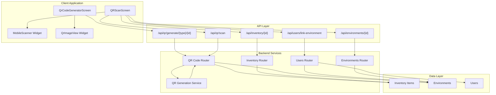
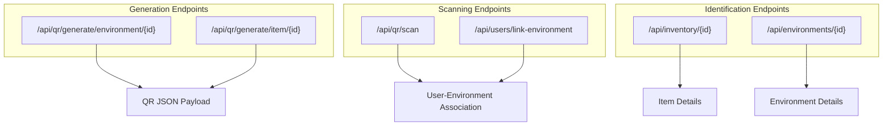
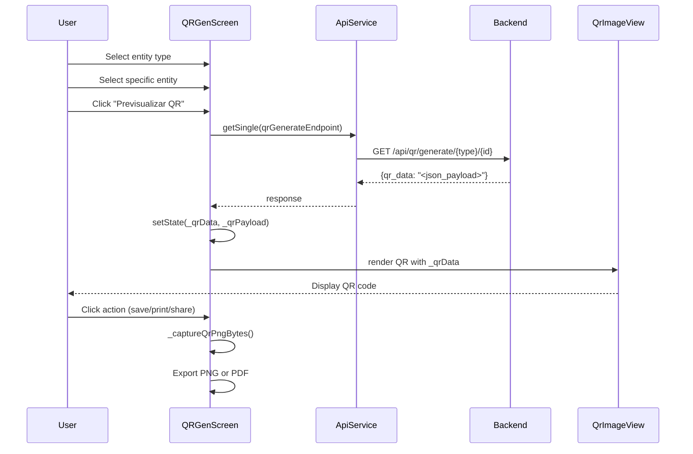
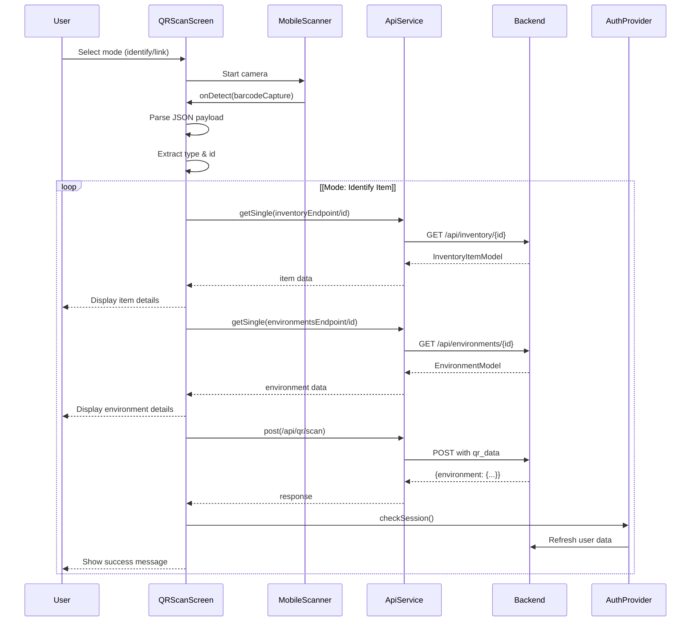

# QR Code System

> **Relevant source files**
> * [client/lib/core/services/session_service.dart](https://github.com/axchisan/GestionInventarioSENA/blob/a6b12d01/client/lib/core/services/session_service.dart)
> * [client/lib/presentation/screens/profile/profile_screen.dart](https://github.com/axchisan/GestionInventarioSENA/blob/a6b12d01/client/lib/presentation/screens/profile/profile_screen.dart)
> * [client/lib/presentation/screens/qr/qr_code_generator_screen.dart](https://github.com/axchisan/GestionInventarioSENA/blob/a6b12d01/client/lib/presentation/screens/qr/qr_code_generator_screen.dart)
> * [client/lib/presentation/screens/qr/qr_scan_screen.dart](https://github.com/axchisan/GestionInventarioSENA/blob/a6b12d01/client/lib/presentation/screens/qr/qr_scan_screen.dart)
> * [server/.env](https://github.com/axchisan/GestionInventarioSENA/blob/a6b12d01/server/.env)
> * [server/.gitignore](https://github.com/axchisan/GestionInventarioSENA/blob/a6b12d01/server/.gitignore)
> * [server/app/config.py](https://github.com/axchisan/GestionInventarioSENA/blob/a6b12d01/server/app/config.py)
> * [server/app/database.py](https://github.com/axchisan/GestionInventarioSENA/blob/a6b12d01/server/app/database.py)
> * [server/docker-compose.yml](https://github.com/axchisan/GestionInventarioSENA/blob/a6b12d01/server/docker-compose.yml)

## Purpose and Scope

The QR Code System provides functionality for generating and scanning QR codes to identify inventory items and physical environments (locations) within SENA facilities. This system enables rapid identification and data retrieval by encoding entity information into scannable codes, and facilitates user-to-environment associations through QR-based linking.

This document covers the overall QR code architecture, payload structure, and system integration. For details on the scanning functionality, see [QR Code Scanning](/axchisan/GestionInventarioSENA/8.1-qr-code-scanning). For details on the generation process, see [QR Code Generation](/axchisan/GestionInventarioSENA/8.2-qr-code-generation).

---

## System Overview

The QR Code System operates as a bidirectional bridge between physical assets and digital records. It consists of two primary operations:

1. **Generation**: Creating QR codes that encode entity metadata with cryptographic signatures
2. **Scanning**: Reading QR codes to identify entities or link users to environments

The system supports two entity types: **inventory items** and **environments** (physical locations). Each QR code contains a signed JSON payload that includes entity metadata and a timestamp to ensure authenticity.

**Sources:** [client/lib/presentation/screens/qr/qr_scan_screen.dart L1-L646](https://github.com/axchisan/GestionInventarioSENA/blob/a6b12d01/client/lib/presentation/screens/qr/qr_scan_screen.dart#L1-L646)

 [client/lib/presentation/screens/qr/qr_code_generator_screen.dart L1-L601](https://github.com/axchisan/GestionInventarioSENA/blob/a6b12d01/client/lib/presentation/screens/qr/qr_code_generator_screen.dart#L1-L601)

---

## QR Code Payload Structure

All QR codes generated by the system encode a JSON payload with the following structure:

| Field | Type | Description |
| --- | --- | --- |
| `v` | integer | Payload version number |
| `type` | string | Entity type: `"item"` or `"environment"` |
| `id` | UUID string | Entity identifier |
| `code` | string | Entity-specific code (internal_code for items, qr_code for environments) |
| `name` | string | Entity name |
| `location` | string | Environment location (environments only) |
| `category` | string | Item category (items only) |
| `ts` | integer | Unix timestamp (seconds) when QR was generated |
| `sig` | string | SHA-256 signature for payload integrity |

### Example Payload

```json
{
  "v": 1,
  "type": "environment",
  "id": "a1b2c3d4-e5f6-7890-abcd-ef1234567890",
  "code": "LAB-101",
  "name": "Laboratorio de Electrónica",
  "location": "Edificio A, Piso 2",
  "ts": 1703001234,
  "sig": "3a4b5c6d7e8f9g0h1i2j3k4l5m6n7o8p9q0r1s2t3u4v5w6x7y8z9a0b1c2d3e4f"
}
```

The payload is serialized to a compact JSON string and encoded directly into the QR code. The signature field ensures that QR codes cannot be forged or tampered with.

**Sources:** [client/lib/presentation/screens/qr/qr_scan_screen.dart L83-L104](https://github.com/axchisan/GestionInventarioSENA/blob/a6b12d01/client/lib/presentation/screens/qr/qr_scan_screen.dart#L83-L104)

 [client/lib/presentation/screens/qr/qr_code_generator_screen.dart L99-L105](https://github.com/axchisan/GestionInventarioSENA/blob/a6b12d01/client/lib/presentation/screens/qr/qr_code_generator_screen.dart#L99-L105)

---

## System Architecture



**Diagram: QR Code System Architecture and Data Flow**

The architecture separates generation and scanning into distinct client screens, both of which interact with backend services through REST APIs. The QR Service in the backend handles payload construction and signature generation, while entity data is retrieved from the appropriate database tables.

**Sources:** [client/lib/presentation/screens/qr/qr_scan_screen.dart L7-L14](https://github.com/axchisan/GestionInventarioSENA/blob/a6b12d01/client/lib/presentation/screens/qr/qr_scan_screen.dart#L7-L14)

 [client/lib/presentation/screens/qr/qr_code_generator_screen.dart L17-L21](https://github.com/axchisan/GestionInventarioSENA/blob/a6b12d01/client/lib/presentation/screens/qr/qr_code_generator_screen.dart#L17-L21)

---

## Dual Scan Modes

The QR scanning functionality operates in two distinct modes, controlled by a tab interface:

### 1. Identify Mode (ScanMode.identify)

Used to quickly retrieve information about an item or environment by scanning its QR code. When a code is scanned:

* The system parses the JSON payload to extract the `type` and `id` fields
* Based on the type, it fetches full entity details from the appropriate endpoint
* Item details are retrieved from `/api/inventory/{id}`
* Environment details are retrieved from `/api/environments/{id}`
* The UI displays comprehensive information including quantities, status, location, etc.

### 2. Link Environment Mode (ScanMode.linkEnvironment)

Used to associate the current user with a physical environment. This is critical for role-based access control, as many operations are scoped to a user's assigned environment. When an environment QR is scanned:

* The system POSTs the raw QR data to `/api/qr/scan`
* The backend validates the signature and associates the user with the environment
* The user's session is updated with the new environment assignment
* Access permissions are recalculated based on the new environment

The linking mode also provides a **manual selection fallback**: if QR scanning is unavailable, users can select an environment from a dropdown populated with `/api/environments`.

**Sources:** [client/lib/presentation/screens/qr/qr_scan_screen.dart L16](https://github.com/axchisan/GestionInventarioSENA/blob/a6b12d01/client/lib/presentation/screens/qr/qr_scan_screen.dart#L16-L16)

 [client/lib/presentation/screens/qr/qr_scan_screen.dart L71-L116](https://github.com/axchisan/GestionInventarioSENA/blob/a6b12d01/client/lib/presentation/screens/qr/qr_scan_screen.dart#L71-L116)

 [client/lib/presentation/screens/qr/qr_scan_screen.dart L146-L188](https://github.com/axchisan/GestionInventarioSENA/blob/a6b12d01/client/lib/presentation/screens/qr/qr_scan_screen.dart#L146-L188)

---

## API Endpoints



**Diagram: QR Code API Endpoints and Response Flow**

### Generation Endpoint

**Pattern:** `GET /api/qr/generate/{entity_type}/{entity_id}`

Returns a JSON object containing:

* `qr_data`: The complete JSON payload string to encode in the QR image

The `entity_type` parameter accepts either `"environment"` or `"item"`.

### Scanning Endpoint

**Pattern:** `POST /api/qr/scan`

Request body:

```json
{
  "qr_data": "<scanned_json_payload>"
}
```

Response:

```json
{
  "message": "Environment linked successfully",
  "environment": {
    "id": "...",
    "name": "...",
    "location": "...",
    "qr_code": "..."
  }
}
```

This endpoint validates the QR signature, verifies the environment exists, and updates the user's `environment_id` field.

### Manual Linking Endpoint

**Pattern:** `POST /api/users/link-environment`

Request body:

```json
{
  "environment_id": "<uuid>"
}
```

Provides the same functionality as QR scanning but accepts a direct environment ID instead of a QR payload.

**Sources:** [client/lib/presentation/screens/qr/qr_code_generator_screen.dart L94-L96](https://github.com/axchisan/GestionInventarioSENA/blob/a6b12d01/client/lib/presentation/screens/qr/qr_code_generator_screen.dart#L94-L96)

 [client/lib/presentation/screens/qr/qr_scan_screen.dart L146-L165](https://github.com/axchisan/GestionInventarioSENA/blob/a6b12d01/client/lib/presentation/screens/qr/qr_scan_screen.dart#L146-L165)

 [client/lib/presentation/screens/qr/qr_scan_screen.dart L167-L188](https://github.com/axchisan/GestionInventarioSENA/blob/a6b12d01/client/lib/presentation/screens/qr/qr_scan_screen.dart#L167-L188)

---

## Client Implementation

### QR Generation Flow



**Diagram: QR Code Generation Sequence**

The generation screen maintains state variables:

* `_selectedType`: Either `"ambiente"` or `"item"`
* `_selectedEnvironmentId` / `_selectedItemId`: The chosen entity UUID
* `_qrData`: The raw JSON string returned from the API
* `_qrPayload`: The parsed JSON object for displaying details

The `RepaintBoundary` widget with key `_qrBoundaryKey` enables capturing the rendered QR as a PNG image for export operations.

**Sources:** [client/lib/presentation/screens/qr/qr_code_generator_screen.dart L29-L49](https://github.com/axchisan/GestionInventarioSENA/blob/a6b12d01/client/lib/presentation/screens/qr/qr_code_generator_screen.dart#L29-L49)

 [client/lib/presentation/screens/qr/qr_code_generator_screen.dart L79-L109](https://github.com/axchisan/GestionInventarioSENA/blob/a6b12d01/client/lib/presentation/screens/qr/qr_code_generator_screen.dart#L79-L109)

 [client/lib/presentation/screens/qr/qr_code_generator_screen.dart L111-L127](https://github.com/axchisan/GestionInventarioSENA/blob/a6b12d01/client/lib/presentation/screens/qr/qr_code_generator_screen.dart#L111-L127)

### QR Scanning Flow



**Diagram: QR Code Scanning Sequence Flow**

The scanning screen uses the `mobile_scanner` package to access the device camera. The `_onDetect` callback is triggered when a barcode is captured. Key state variables include:

* `_isScanning`: Prevents multiple simultaneous scans
* `_scannedData`: The raw QR string
* `_scannedPayload`: The parsed environment data after successful linking
* `_identifiedItem` / `_identifiedEnvironment`: The retrieved entity data in identify mode

**Sources:** [client/lib/presentation/screens/qr/qr_scan_screen.dart L71-L116](https://github.com/axchisan/GestionInventarioSENA/blob/a6b12d01/client/lib/presentation/screens/qr/qr_scan_screen.dart#L71-L116)

 [client/lib/presentation/screens/qr/qr_scan_screen.dart L118-L144](https://github.com/axchisan/GestionInventarioSENA/blob/a6b12d01/client/lib/presentation/screens/qr/qr_scan_screen.dart#L118-L144)

 [client/lib/presentation/screens/qr/qr_scan_screen.dart L251-L254](https://github.com/axchisan/GestionInventarioSENA/blob/a6b12d01/client/lib/presentation/screens/qr/qr_scan_screen.dart#L251-L254)

---

## QR Code Rendering

The system uses the `qr_flutter` package for rendering QR codes. The `QrImageView` widget is configured with:

```javascript
QrImageView(
  data: _qrData!,
  size: 240,
  backgroundColor: Colors.white,
  version: QrVersions.auto,
  eyeStyle: const QrEyeStyle(
    eyeShape: QrEyeShape.square,
    color: Colors.black,
  ),
  dataModuleStyle: const QrDataModuleStyle(
    dataModuleShape: QrDataModuleShape.square,
    color: Colors.black,
  ),
)
```

The `version: QrVersions.auto` setting automatically selects the appropriate QR version based on the payload size. Given that the payloads include UUIDs, timestamps, and signatures, the system typically generates Version 5 or higher QR codes.

The rendered QR code is wrapped in a `RepaintBoundary` widget, which enables capturing the widget as an image for export operations (save, print, share).

**Sources:** [client/lib/presentation/screens/qr/qr_code_generator_screen.dart L474-L498](https://github.com/axchisan/GestionInventarioSENA/blob/a6b12d01/client/lib/presentation/screens/qr/qr_code_generator_screen.dart#L474-L498)

---

## Export Capabilities

The QR generation screen provides three export options:

### 1. Save as PNG

Captures the rendered QR code as a PNG image and saves it to the device's application documents directory using the `path_provider` package. The filename includes a timestamp: `qr_{milliseconds}.png`.

### 2. Print

Generates a PDF document using the `pdf` package with the QR image and entity name, then sends it to the system print dialog via the `printing` package. The PDF uses A4 page format.

### 3. Share

Captures the QR as PNG, saves it to a temporary directory, and invokes the system share sheet using the `share_plus` package.

All three operations use the `_captureQrPngBytes()` method, which:

1. Finds the `RenderRepaintBoundary` from `_qrBoundaryKey`
2. Calls `toImage(pixelRatio: 3.0)` for high resolution
3. Converts to PNG byte data

Note: Save and Share functionality is disabled on web platform (`kIsWeb`) due to file system limitations.

**Sources:** [client/lib/presentation/screens/qr/qr_code_generator_screen.dart L111-L127](https://github.com/axchisan/GestionInventarioSENA/blob/a6b12d01/client/lib/presentation/screens/qr/qr_code_generator_screen.dart#L111-L127)

 [client/lib/presentation/screens/qr/qr_code_generator_screen.dart L129-L147](https://github.com/axchisan/GestionInventarioSENA/blob/a6b12d01/client/lib/presentation/screens/qr/qr_code_generator_screen.dart#L129-L147)

 [client/lib/presentation/screens/qr/qr_code_generator_screen.dart L149-L166](https://github.com/axchisan/GestionInventarioSENA/blob/a6b12d01/client/lib/presentation/screens/qr/qr_code_generator_screen.dart#L149-L166)

 [client/lib/presentation/screens/qr/qr_code_generator_screen.dart L168-L202](https://github.com/axchisan/GestionInventarioSENA/blob/a6b12d01/client/lib/presentation/screens/qr/qr_code_generator_screen.dart#L168-L202)

---

## Security Considerations

### Payload Signatures

All QR codes include a `sig` field containing a SHA-256 hash of the payload. This signature is generated by the backend QR service and verified during scanning operations. The signature prevents:

* **Forgery**: Unauthorized creation of valid QR codes
* **Tampering**: Modification of QR payload data

The backend verifies the signature before processing any QR scan, particularly for environment linking operations which modify user permissions.

### Timestamp Validation

The `ts` field enables time-based validation. While not currently enforced in the client code, the backend can implement:

* Expiration logic (reject QR codes older than X days)
* Replay attack prevention
* Audit trail correlation

### Entity Existence Checks

Before linking a user to an environment or displaying entity details, the system verifies that the entity exists in the database. This prevents broken references if a QR code references a deleted entity.

**Sources:** [client/lib/presentation/screens/qr/qr_code_generator_screen.dart L566-L576](https://github.com/axchisan/GestionInventarioSENA/blob/a6b12d01/client/lib/presentation/screens/qr/qr_code_generator_screen.dart#L566-L576)

---

## Integration Points

The QR Code System integrates with multiple subsystems:

| Subsystem | Integration Point | Purpose |
| --- | --- | --- |
| Authentication (#3) | `AuthProvider.checkSession()` | Refresh user session after environment linking |
| Inventory Management (#6) | `/api/inventory/{id}` | Retrieve item details when identifying items |
| Environment Management (#13) | `/api/environments/{id}` | Retrieve environment details, list for manual selection |
| Role-Based Access Control (#3.3) | User-environment association | Environment linking determines accessible inventory |
| Navigation | `context.push()` | Navigate to detail screens after identification |

The environment linking functionality is particularly critical because it determines which inventory items and verification tasks a user can access. After linking to a new environment, the `AuthProvider.checkSession()` call refreshes the user's session data, triggering navigation guards to recalculate accessible routes.

**Sources:** [client/lib/presentation/screens/qr/qr_scan_screen.dart L155-L157](https://github.com/axchisan/GestionInventarioSENA/blob/a6b12d01/client/lib/presentation/screens/qr/qr_scan_screen.dart#L155-L157)

 [client/lib/presentation/screens/qr/qr_scan_screen.dart L177-L178](https://github.com/axchisan/GestionInventarioSENA/blob/a6b12d01/client/lib/presentation/screens/qr/qr_scan_screen.dart#L177-L178)

 [client/lib/presentation/screens/qr/qr_scan_screen.dart L367-L370](https://github.com/axchisan/GestionInventarioSENA/blob/a6b12d01/client/lib/presentation/screens/qr/qr_scan_screen.dart#L367-L370)

 [client/lib/presentation/screens/qr/qr_scan_screen.dart L456-L465](https://github.com/axchisan/GestionInventarioSENA/blob/a6b12d01/client/lib/presentation/screens/qr/qr_scan_screen.dart#L456-L465)

---

## Data Models

### InventoryItemModel

Used when identifying scanned items. Key fields displayed:

* `name`, `categoryDisplayName`, `statusDisplayName`
* `internalCode`, `serialNumber`, `brand`, `model`
* `quantity`, `totalAvailable`, `quantityDamaged`, `quantityMissing`

**Sources:** [client/lib/presentation/screens/qr/qr_scan_screen.dart L12](https://github.com/axchisan/GestionInventarioSENA/blob/a6b12d01/client/lib/presentation/screens/qr/qr_scan_screen.dart#L12-L12)

 [client/lib/presentation/screens/qr/qr_scan_screen.dart L309-L388](https://github.com/axchisan/GestionInventarioSENA/blob/a6b12d01/client/lib/presentation/screens/qr/qr_scan_screen.dart#L309-L388)

### EnvironmentModel

Used when identifying scanned environments. Key fields displayed:

* `name`, `location`, `qrCode`
* `capacity`, `isWarehouse`, `isActive`
* `description`

**Sources:** [client/lib/presentation/screens/qr/qr_scan_screen.dart L13](https://github.com/axchisan/GestionInventarioSENA/blob/a6b12d01/client/lib/presentation/screens/qr/qr_scan_screen.dart#L13-L13)

 [client/lib/presentation/screens/qr/qr_scan_screen.dart L390-L480](https://github.com/axchisan/GestionInventarioSENA/blob/a6b12d01/client/lib/presentation/screens/qr/qr_scan_screen.dart#L390-L480)

---

## Configuration

### API Constants

The QR system relies on the following endpoint constants defined in `api_constants.dart`:

* `qrGenerateEndpoint`: Base path for QR generation
* `inventoryEndpoint`: Base path for inventory operations
* `environmentsEndpoint`: Base path for environment operations

### Camera Permissions

The scanning functionality requires camera permissions on mobile devices. These must be declared in:

* Android: `AndroidManifest.xml` with `<uses-permission android:name="android.permission.CAMERA"/>`
* iOS: `Info.plist` with `NSCameraUsageDescription`

**Sources:** [client/lib/presentation/screens/qr/qr_scan_screen.dart L10](https://github.com/axchisan/GestionInventarioSENA/blob/a6b12d01/client/lib/presentation/screens/qr/qr_scan_screen.dart#L10-L10)

---

## Error Handling

Both generation and scanning screens implement comprehensive error handling:

### Generation Errors

* **Entity not selected**: Shows snackbar prompting user to select an entity
* **API failure**: Displays error message from API service
* **Payload parsing failure**: Catches JSON decode errors and shows notification

### Scanning Errors

* **Invalid QR format**: Shows error if JSON parsing fails
* **Unrecognized QR type**: Validates that type is either "item" or "environment"
* **Wrong type for mode**: In link mode, rejects non-environment QR codes
* **API failures**: Displays descriptive error messages and resets scan state
* **Identification failures**: Resets scan if entity retrieval fails

All errors trigger a `_resetScan()` call to clear state and allow re-scanning.

**Sources:** [client/lib/presentation/screens/qr/qr_scan_screen.dart L105-L116](https://github.com/axchisan/GestionInventarioSENA/blob/a6b12d01/client/lib/presentation/screens/qr/qr_scan_screen.dart#L105-L116)

 [client/lib/presentation/screens/qr/qr_code_generator_screen.dart L99-L108](https://github.com/axchisan/GestionInventarioSENA/blob/a6b12d01/client/lib/presentation/screens/qr/qr_code_generator_screen.dart#L99-L108)

 [client/lib/presentation/screens/qr/qr_scan_screen.dart L196-L204](https://github.com/axchisan/GestionInventarioSENA/blob/a6b12d01/client/lib/presentation/screens/qr/qr_scan_screen.dart#L196-L204)