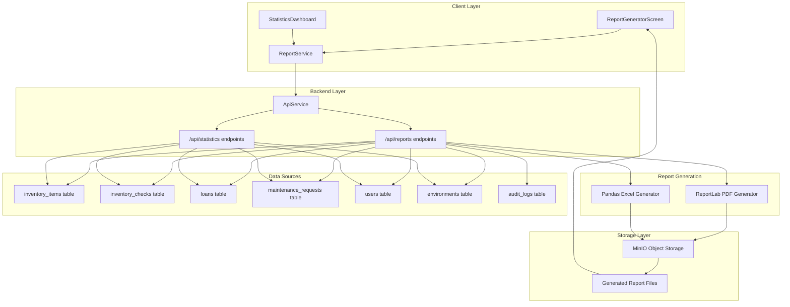
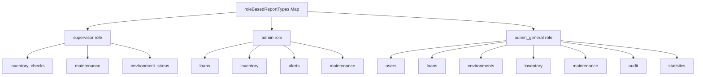
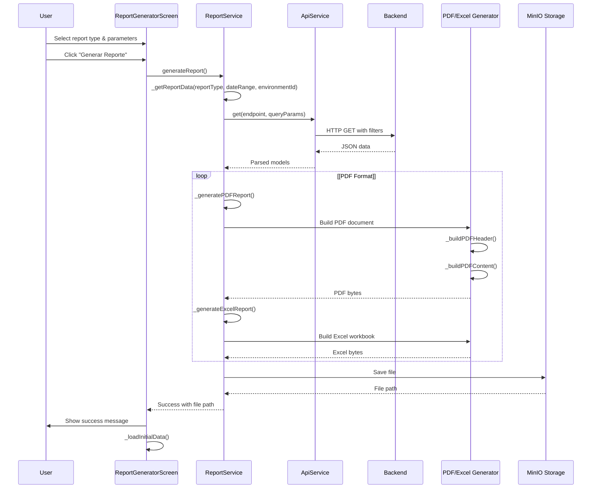
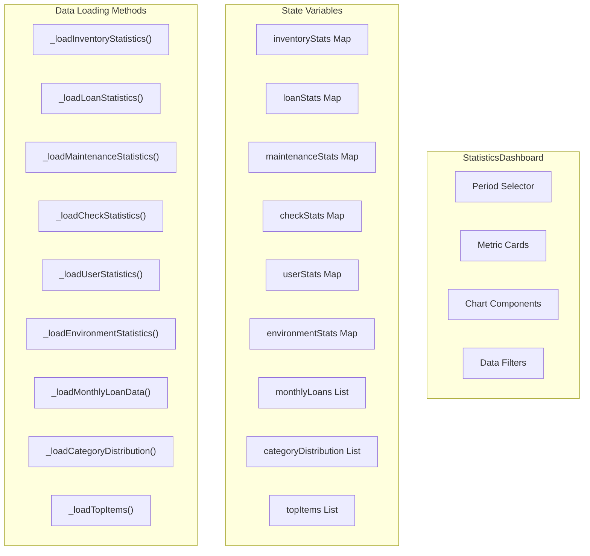
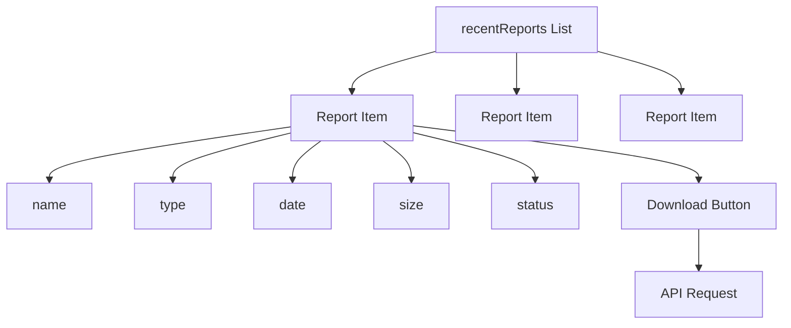
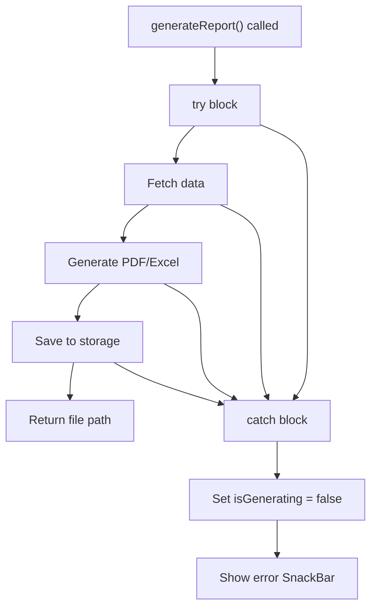

# Reporting & Analytics

> **Relevant source files**
> * [client/lib/core/services/api_service.dart](https://github.com/axchisan/GestionInventarioSENA/blob/a6b12d01/client/lib/core/services/api_service.dart)
> * [client/lib/core/services/report_service.dart](https://github.com/axchisan/GestionInventarioSENA/blob/a6b12d01/client/lib/core/services/report_service.dart)
> * [client/lib/data/models/environment_model.dart](https://github.com/axchisan/GestionInventarioSENA/blob/a6b12d01/client/lib/data/models/environment_model.dart)
> * [client/lib/data/models/environment_model.g.dart](https://github.com/axchisan/GestionInventarioSENA/blob/a6b12d01/client/lib/data/models/environment_model.g.dart)
> * [client/lib/presentation/screens/reports/report_generator_screen.dart](https://github.com/axchisan/GestionInventarioSENA/blob/a6b12d01/client/lib/presentation/screens/reports/report_generator_screen.dart)
> * [client/lib/presentation/screens/statistics/statistics_dashboard.dart](https://github.com/axchisan/GestionInventarioSENA/blob/a6b12d01/client/lib/presentation/screens/statistics/statistics_dashboard.dart)
> * [server/app/schemas/generated_reports.py](https://github.com/axchisan/GestionInventarioSENA/blob/a6b12d01/server/app/schemas/generated_reports.py)
> * [server/requirements.txt](https://github.com/axchisan/GestionInventarioSENA/blob/a6b12d01/server/requirements.txt)

## Purpose and Scope

The Reporting & Analytics system provides comprehensive data visualization and report generation capabilities for the SENA Inventory Management System. This system aggregates data from multiple sources across the application to produce formatted reports in PDF and Excel formats, as well as real-time statistical dashboards with role-specific views.

This page provides an architectural overview of the reporting system. For details on specific components:

* Report generation UI and workflow: see [Report Generation](/axchisan/GestionInventarioSENA/9.1-report-generation)
* Client and server-side report APIs: see [Report Service & APIs](/axchisan/GestionInventarioSENA/9.2-report-service-and-apis)
* Real-time statistics visualization: see [Statistics Dashboard](/axchisan/GestionInventarioSENA/9.3-statistics-dashboard)

For audit reporting specifically, see [Audit & Compliance](/axchisan/GestionInventarioSENA/10-audit-and-compliance).

## System Architecture

The reporting system consists of three main components: a client-side report generator, a backend data aggregation layer, and storage infrastructure for generated files.

### Component Overview



Sources: [client/lib/presentation/screens/reports/report_generator_screen.dart L1-L778](https://github.com/axchisan/GestionInventarioSENA/blob/a6b12d01/client/lib/presentation/screens/reports/report_generator_screen.dart#L1-L778)

 [client/lib/core/services/report_service.dart L1-L100](https://github.com/axchisan/GestionInventarioSENA/blob/a6b12d01/client/lib/core/services/report_service.dart#L1-L100)

 [client/lib/presentation/screens/statistics/statistics_dashboard.dart L1-L100](https://github.com/axchisan/GestionInventarioSENA/blob/a6b12d01/client/lib/presentation/screens/statistics/statistics_dashboard.dart#L1-L100)

## Data Sources

The reporting system aggregates data from seven primary database tables, each representing a different aspect of the system. All data is filtered by date range and environment based on user permissions.

| Data Source | Table/Endpoint | Primary Entities | Key Metrics |
| --- | --- | --- | --- |
| Inventory | `inventory_items` | `InventoryItemModel` | Total items, available, damaged, missing, in maintenance |
| Verification Checks | `inventory_checks` | `InventoryCheckModel` | Total checks, completed, pending, compliance rate |
| Loans | `loans` | `LoanModel` | Active loans, pending, overdue, returned, average duration |
| Maintenance | `maintenance_requests` | `MaintenanceRequestModel` | Total requests, pending, in progress, completed, cost |
| Users | `users` | `UserModel` | Total users, active, by role |
| Environments | `environments` | `EnvironmentModel` | Total environments, warehouses, classrooms, active |
| Audit Logs | `audit_logs` | Audit entries | Actions, success rate, most active user |

### Data Aggregation Methods

The system implements role-specific data aggregation methods in `ReportService`:

```mermaid
flowchart TD

GETDATA["_getReportData()"]
INV["_getInventoryReportData()"]
CHECKS["_getInventoryChecksReportData()"]
ENV["_getEnvironmentStatusReportData()"]
ALERTS["_getAlertsReportData()"]
USERS["_getUsersReportData()"]
ENVS["_getEnvironmentsReportData()"]
LOANS["_getLoansReportData()"]
MAINT["_getMaintenanceReportData()"]
AUDIT["_getAuditReportData()"]
STATS["_getStatisticsReportData()"]

GETDATA --> INV
GETDATA --> CHECKS
GETDATA --> ENV
GETDATA --> ALERTS
GETDATA --> USERS
GETDATA --> ENVS
GETDATA --> LOANS
GETDATA --> MAINT
GETDATA --> AUDIT
GETDATA --> STATS
```



Sources: [client/lib/core/services/report_service.dart L63-L103](https://github.com/axchisan/GestionInventarioSENA/blob/a6b12d01/client/lib/core/services/report_service.dart#L63-L103)

 [client/lib/core/services/report_service.dart L105-L489](https://github.com/axchisan/GestionInventarioSENA/blob/a6b12d01/client/lib/core/services/report_service.dart#L105-L489)

## Role-Based Report Types

Report availability is strictly controlled by user role. Each role has access to a specific set of report types relevant to their responsibilities.

### Report Type Matrix

| Report Type | Supervisor | Admin | Admin General | Description |
| --- | --- | --- | --- | --- |
| `inventory_checks` | ✓ | - | - | Verification status by environment |
| `maintenance` | ✓ | ✓ | ✓ | Maintenance requests and status |
| `environment_status` | ✓ | - | - | Environment list and status |
| `loans` | - | ✓ | ✓ | Loan requests and history |
| `inventory` | - | ✓ | ✓ | Warehouse inventory status |
| `alerts` | - | ✓ | - | Environment alert monitoring |
| `users` | - | - | ✓ | User management report |
| `environments` | - | - | ✓ | Environment configuration |
| `audit` | - | - | ✓ | Complete audit log |
| `statistics` | - | - | ✓ | Comprehensive system metrics |

### Role Configuration Structure

The client implements role-based report filtering using the `roleBasedReportTypes` map:



Sources: [client/lib/presentation/screens/reports/report_generator_screen.dart L33-L124](https://github.com/axchisan/GestionInventarioSENA/blob/a6b12d01/client/lib/presentation/screens/reports/report_generator_screen.dart#L33-L124)

 [client/lib/presentation/screens/reports/report_generator_screen.dart L174-L179](https://github.com/axchisan/GestionInventarioSENA/blob/a6b12d01/client/lib/presentation/screens/reports/report_generator_screen.dart#L174-L179)

## Report Generation Pipeline

Reports are generated through a multi-stage pipeline that handles data fetching, formatting, file generation, and storage.

### Generation Flow



### Report Format Handlers

The system supports two output formats with different generation strategies:

**PDF Reports** (`selectedFormat = 'pdf'`)

* Uses `reportlab` library ([server/requirements.txt L40](https://github.com/axchisan/GestionInventarioSENA/blob/a6b12d01/server/requirements.txt#L40-L40) )
* Implements Unicode font support via `PdfGoogleFonts.notoSansRegular()` and `PdfGoogleFonts.notoSansBold()`
* Multi-page layout with `pw.MultiPage` and `PdfPageFormat.a4`
* Role-specific content builders: `_buildInventoryPDFContent()`, `_buildLoansPDFContent()`, etc.

**Excel Reports** (`selectedFormat = 'excel'`)

* Uses `pandas` library ([server/requirements.txt L24](https://github.com/axchisan/GestionInventarioSENA/blob/a6b12d01/server/requirements.txt#L24-L24) )
* Generates `.xlsx` files via `excel` package
* Structured worksheets with headers and formatted cells
* Supports data export for further analysis

Sources: [client/lib/core/services/report_service.dart L26-L61](https://github.com/axchisan/GestionInventarioSENA/blob/a6b12d01/client/lib/core/services/report_service.dart#L26-L61)

 [client/lib/core/services/report_service.dart L491-L616](https://github.com/axchisan/GestionInventarioSENA/blob/a6b12d01/client/lib/core/services/report_service.dart#L491-L616)

 [server/requirements.txt L24](https://github.com/axchisan/GestionInventarioSENA/blob/a6b12d01/server/requirements.txt#L24-L24)

 [server/requirements.txt L40](https://github.com/axchisan/GestionInventarioSENA/blob/a6b12d01/server/requirements.txt#L40-L40)

## Statistics Dashboard

The statistics dashboard provides real-time analytics with role-specific views and interactive visualizations.

### Dashboard Architecture



### Role-Specific Dashboard Content

The dashboard displays different metrics and charts based on user role, configured in `roleBasedContent`:

**Supervisor Dashboard**

* Primary Metrics: `checkStats`, `maintenanceStats`
* Charts: Monthly checks trend, maintenance by priority
* Sections: Verification summary, maintenance overview, environment status

**Admin Dashboard**

* Primary Metrics: `loanStats`, `inventoryStats`
* Charts: Monthly loans trend, category distribution
* Sections: Loan management, inventory overview, alerts monitoring

**Admin General Dashboard**

* Primary Metrics: `userStats`, `loanStats`, `inventoryStats`, `maintenanceStats`
* Charts: Monthly loans, category distribution, user activity
* Sections: System overview, user management, complete statistics

Sources: [client/lib/presentation/screens/statistics/statistics_dashboard.dart L40-L62](https://github.com/axchisan/GestionInventarioSENA/blob/a6b12d01/client/lib/presentation/screens/statistics/statistics_dashboard.dart#L40-L62)

 [client/lib/presentation/screens/statistics/statistics_dashboard.dart L77-L176](https://github.com/axchisan/GestionInventarioSENA/blob/a6b12d01/client/lib/presentation/screens/statistics/statistics_dashboard.dart#L77-L176)

### Period Filtering

Statistics can be filtered by time period via `_selectedPeriod`:

| Period | Date Range |
| --- | --- |
| `'Última semana'` | Last 7 days |
| `'Último mes'` | Last 30 days |
| `'Últimos 3 meses'` | Last 90 days |
| `'Último año'` | Last 365 days |

The selected period triggers `_loadStatistics()` which calculates `startDate` and `endDate`, then passes them as query parameters to all data loading methods.

Sources: [client/lib/presentation/screens/statistics/statistics_dashboard.dart L82-L105](https://github.com/axchisan/GestionInventarioSENA/blob/a6b12d01/client/lib/presentation/screens/statistics/statistics_dashboard.dart#L82-L105)

## Report Configuration

Users can customize report generation through multiple configuration options in `ReportGeneratorScreen`.

### Configuration Parameters

| Parameter | Type | Options | Purpose |
| --- | --- | --- | --- |
| `selectedReportType` | String | Role-dependent types | Determines report content |
| `selectedFormat` | String | `'pdf'`, `'excel'` | Output file format |
| `selectedDateRange` | DateTimeRange? | Custom date picker | Filters data by date |
| `selectedEnvironment` | String | `'all'` or environment ID | Filters by location |
| `includeImages` | bool | true/false | Adds images to PDF |
| `includeStatistics` | bool | true/false | Includes summary tables |

### Environment Filtering

Environment filtering differs by role:

* **Admin**: Only sees warehouse environments (`env.isWarehouse == true`)
* **Other roles**: See all environments

This is implemented in the `availableEnvironments` getter:

Sources: [client/lib/presentation/screens/reports/report_generator_screen.dart L18-L25](https://github.com/axchisan/GestionInventarioSENA/blob/a6b12d01/client/lib/presentation/screens/reports/report_generator_screen.dart#L18-L25)

 [client/lib/presentation/screens/reports/report_generator_screen.dart L181-L188](https://github.com/axchisan/GestionInventarioSENA/blob/a6b12d01/client/lib/presentation/screens/reports/report_generator_screen.dart#L181-L188)

## File Storage and Access Control

Generated reports are stored in MinIO object storage and tracked for access control and lifecycle management.

### Storage Schema

The `GeneratedReportResponse` schema defines the metadata for stored reports:

| Field | Type | Description |
| --- | --- | --- |
| `id` | UUID | Unique report identifier |
| `user_id` | UUID | User who generated the report |
| `report_type` | String | Type identifier |
| `title` | String | Human-readable title |
| `file_format` | String | `'pdf'` or `'excel'` |
| `file_path` | String? | MinIO storage path |
| `file_size` | int? | Size in bytes |
| `status` | String | Generation status |
| `parameters` | Dict? | Generation parameters |
| `generated_at` | DateTime? | Timestamp |
| `expires_at` | DateTime? | Expiration timestamp |
| `download_count` | int | Access counter |
| `created_at` | DateTime | Creation timestamp |

Sources: [server/app/schemas/generated_reports.py L1-L28](https://github.com/axchisan/GestionInventarioSENA/blob/a6b12d01/server/app/schemas/generated_reports.py#L1-L28)

### Recent Reports Display

The UI displays recently generated reports with download capabilities:



The recent reports list is loaded via `_reportService.getRecentReports()` and displayed in `_buildRecentReports()` widget.

Sources: [client/lib/presentation/screens/reports/report_generator_screen.dart L147-L172](https://github.com/axchisan/GestionInventarioSENA/blob/a6b12d01/client/lib/presentation/screens/reports/report_generator_screen.dart#L147-L172)

 [client/lib/presentation/screens/reports/report_generator_screen.dart L586-L697](https://github.com/axchisan/GestionInventarioSENA/blob/a6b12d01/client/lib/presentation/screens/reports/report_generator_screen.dart#L586-L697)

## API Integration

The reporting system integrates with the backend through `ApiService`, which handles authentication, environment filtering, and error handling.

### Key API Methods

| Method | Purpose | Query Parameters |
| --- | --- | --- |
| `get(endpoint, queryParams)` | Fetch data for reports | `start_date`, `end_date`, `environment_id`, `system_wide` |
| `getSystemWide(endpoint, queryParams)` | Fetch cross-environment data (admin_general) | `system_wide=true`, `all_environments=true` |
| `safeGet(endpoint, queryParams)` | Fetch with error recovery | Same as `get()` |

### Admin General Permissions

For `admin_general` role, the API service automatically adds system-wide access parameters:

```
finalQueryParams['system_wide'] = 'true';
finalQueryParams['admin_access'] = 'true';
```

This allows admin_general users to generate reports across all environments, bypassing environment-scoping restrictions.

Sources: [client/lib/core/services/api_service.dart L36-L65](https://github.com/axchisan/GestionInventarioSENA/blob/a6b12d01/client/lib/core/services/api_service.dart#L36-L65)

 [client/lib/core/services/api_service.dart L487-L530](https://github.com/axchisan/GestionInventarioSENA/blob/a6b12d01/client/lib/core/services/api_service.dart#L487-L530)

## Error Handling

The reporting system implements comprehensive error handling for data loading failures, format issues, and network errors.

### Report Generation Error Flow



### Statistics Loading Error Handling

Each data loader method implements try-catch blocks with fallback values:

* Returns empty maps `{}` or lists `[]` on error
* Logs errors with `print('Error loading ...: $e')`
* Displays user-friendly error messages via `ScaffoldMessenger`
* Continues loading other statistics if one fails

For `admin_general` role, the `ApiService` has special handling that returns empty data instead of throwing errors for 403/404/400 responses, ensuring the dashboard remains functional even if some endpoints are unavailable.

Sources: [client/lib/presentation/screens/reports/report_generator_screen.dart L715-L767](https://github.com/axchisan/GestionInventarioSENA/blob/a6b12d01/client/lib/presentation/screens/reports/report_generator_screen.dart#L715-L767)

 [client/lib/presentation/screens/statistics/statistics_dashboard.dart L165-L175](https://github.com/axchisan/GestionInventarioSENA/blob/a6b12d01/client/lib/presentation/screens/statistics/statistics_dashboard.dart#L165-L175)

 [client/lib/core/services/api_service.dart L592-L616](https://github.com/axchisan/GestionInventarioSENA/blob/a6b12d01/client/lib/core/services/api_service.dart#L592-L616)