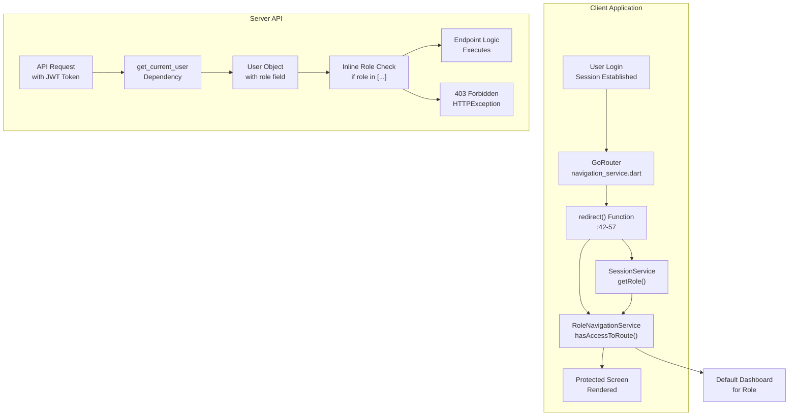
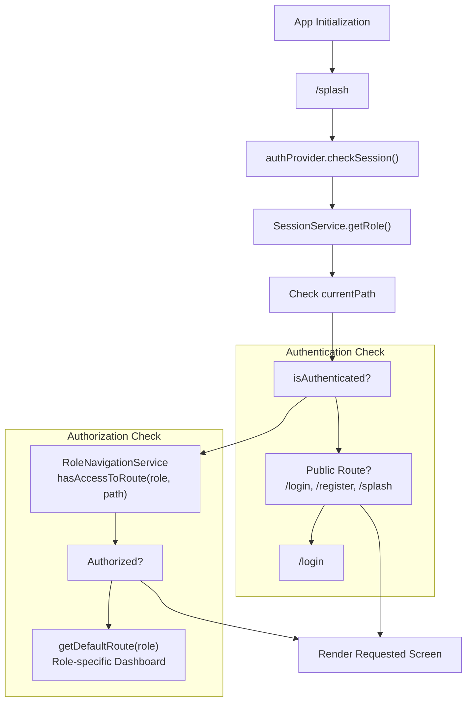
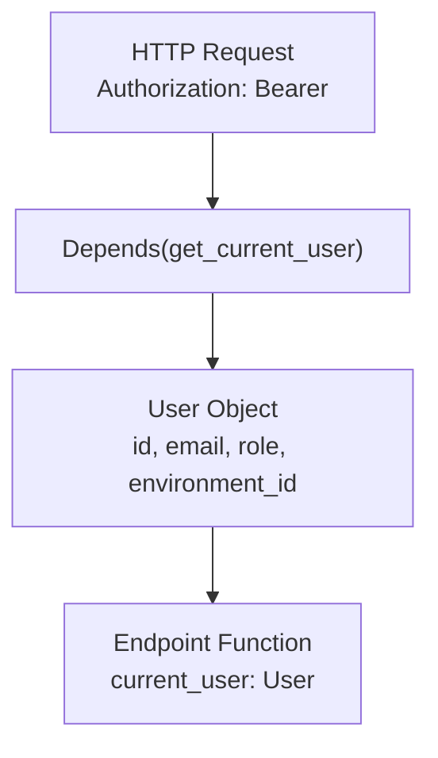
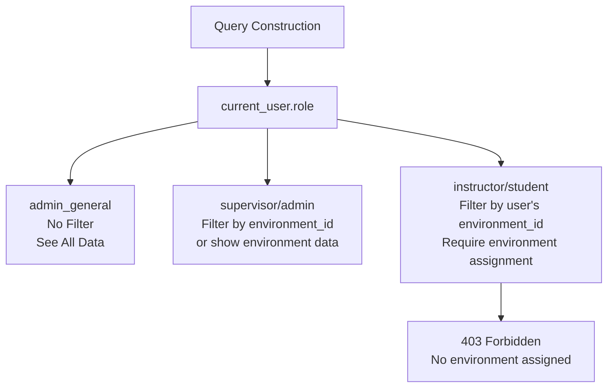
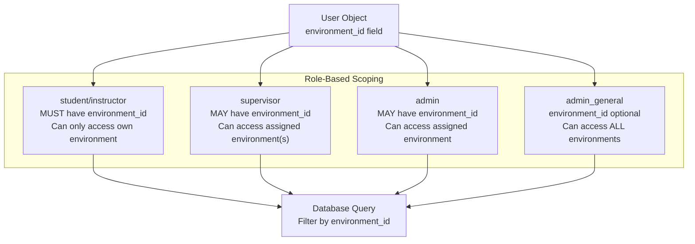

# Role-Based Access Control

> **Relevant source files**
> * [client/lib/core/services/navigation_service.dart](https://github.com/axchisan/GestionInventarioSENA/blob/a6b12d01/client/lib/core/services/navigation_service.dart)
> * [client/lib/presentation/screens/dashboard/student_dashboard.dart](https://github.com/axchisan/GestionInventarioSENA/blob/a6b12d01/client/lib/presentation/screens/dashboard/student_dashboard.dart)
> * [client/lib/presentation/screens/feedback/feedback_form_screen.dart](https://github.com/axchisan/GestionInventarioSENA/blob/a6b12d01/client/lib/presentation/screens/feedback/feedback_form_screen.dart)
> * [server/app/routers/feedback.py](https://github.com/axchisan/GestionInventarioSENA/blob/a6b12d01/server/app/routers/feedback.py)
> * [server/app/routers/inventory.py](https://github.com/axchisan/GestionInventarioSENA/blob/a6b12d01/server/app/routers/inventory.py)
> * [server/app/routers/maintenance_requests.py](https://github.com/axchisan/GestionInventarioSENA/blob/a6b12d01/server/app/routers/maintenance_requests.py)
> * [server/app/routers/notifications.py](https://github.com/axchisan/GestionInventarioSENA/blob/a6b12d01/server/app/routers/notifications.py)

## Purpose and Scope

This document describes the Role-Based Access Control (RBAC) system implemented throughout the SENA Inventory Management application. RBAC enforces hierarchical permission levels across five distinct user roles, controlling access to UI screens, navigation routes, API endpoints, and business operations.

For information about the authentication flow and session management that precedes authorization, see [Backend Authentication API](/axchisan/GestionInventarioSENA/3.2-backend-authentication-api). For client-side authentication state management, see [Client-Side Authentication](/axchisan/GestionInventarioSENA/3.1-client-side-authentication).

---

## Role Hierarchy

The system implements five user roles with progressively increasing permissions:

| Role | Spanish Name | Route Access Count | Primary Responsibilities | Environment Scope |
| --- | --- | --- | --- | --- |
| `student` | Aprendiz | 11 routes | Equipment verification, QR scanning, maintenance requests | Single environment (assigned) |
| `instructor` | Instructor | 15 routes | Verification review, loan management, schedule management | Single environment (assigned) |
| `supervisor` | Supervisor | 17 routes | Final verification approval, user management, maintenance oversight | Single or multiple environments |
| `admin` | Administrador | 22 routes | Environment-level administration, inventory management, reporting | Single environment (assigned) |
| `admin_general` | Administrador General | 24 routes | System-wide administration, all environments, complete access | All environments |

**Sources:** [client/lib/core/services/navigation_service.dart L40-L224](https://github.com/axchisan/GestionInventarioSENA/blob/a6b12d01/client/lib/core/services/navigation_service.dart#L40-L224)

 High-Level System Architecture Diagram 2

---

## Permission Enforcement Architecture



**Diagram: Two-Layer Permission Enforcement Model**

The system enforces role-based permissions at two layers: client-side navigation guards prevent unauthorized route access and provide appropriate redirects, while server-side permission checks validate every API request independently. This dual-layer approach ensures security even if client-side checks are bypassed.

**Sources:** [client/lib/core/services/navigation_service.dart L42-L57](https://github.com/axchisan/GestionInventarioSENA/blob/a6b12d01/client/lib/core/services/navigation_service.dart#L42-L57)

 [server/app/routers/inventory.py L60-L73](https://github.com/axchisan/GestionInventarioSENA/blob/a6b12d01/server/app/routers/inventory.py#L60-L73)

 [server/app/routers/maintenance_requests.py L16-L51](https://github.com/axchisan/GestionInventarioSENA/blob/a6b12d01/server/app/routers/maintenance_requests.py#L16-L51)

---

## Client-Side Route Access Control

### Navigation Service and Route Guards

The `NavigationService` class implements a centralized router with automatic redirect logic that enforces role-based access control:



**Diagram: Client-Side Route Authorization Flow**

The redirect function in `GoRouter` intercepts every navigation attempt, checking authentication status first, then validating that the user's role has access to the requested route. Unauthorized access attempts are redirected to the appropriate dashboard for that role.

**Sources:** [client/lib/core/services/navigation_service.dart L42-L57](https://github.com/axchisan/GestionInventarioSENA/blob/a6b12d01/client/lib/core/services/navigation_service.dart#L42-L57)

### Role-Specific Default Routes

Each role has a designated default dashboard that serves as the landing page after login and as the fallback for unauthorized route access:

| Role | Default Route | Screen Class |
| --- | --- | --- |
| `student` | `/student-dashboard` | `StudentDashboard` |
| `instructor` | `/instructor-dashboard` | `InstructorDashboard` |
| `supervisor` | `/supervisor-dashboard` | `SupervisorDashboardScreen` |
| `admin` | `/admin-dashboard` | `AdminDashboardScreen` |
| `admin_general` | `/admin-general-dashboard` | `GeneralAdminDashboardScreen` |

**Sources:** [client/lib/core/services/navigation_service.dart L111-L135](https://github.com/axchisan/GestionInventarioSENA/blob/a6b12d01/client/lib/core/services/navigation_service.dart#L111-L135)

---

## Server-Side Access Control

### Authentication Dependency Chain

All protected API endpoints use the `get_current_user` dependency to extract and validate the JWT token, providing access to the authenticated `User` object:



**Diagram: Server-Side Authentication Dependency**

The `current_user: User = Depends(get_current_user)` pattern appears in every protected endpoint, ensuring that only authenticated requests with valid tokens can proceed.

**Sources:** [server/app/routers/inventory.py L14-L22](https://github.com/axchisan/GestionInventarioSENA/blob/a6b12d01/server/app/routers/inventory.py#L14-L22)

 [server/app/routers/maintenance_requests.py L16-L24](https://github.com/axchisan/GestionInventarioSENA/blob/a6b12d01/server/app/routers/maintenance_requests.py#L16-L24)

 [server/app/routers/feedback.py L54-L59](https://github.com/axchisan/GestionInventarioSENA/blob/a6b12d01/server/app/routers/feedback.py#L54-L59)

### Role-Based Permission Patterns

The server implements several common permission check patterns:

#### Pattern 1: Minimum Role Requirement

Operations requiring elevated privileges check if the user's role is in an allowed list:

```
if current_user.role not in ["supervisor", "admin", "admin_general"]:
    raise HTTPException(status_code=403, detail="Rol no autorizado")
```

**Example Locations:**

* [server/app/routers/inventory.py L66-L67](https://github.com/axchisan/GestionInventarioSENA/blob/a6b12d01/server/app/routers/inventory.py#L66-L67)  - Adding inventory items
* [server/app/routers/inventory.py L82-L83](https://github.com/axchisan/GestionInventarioSENA/blob/a6b12d01/server/app/routers/inventory.py#L82-L83)  - Editing inventory items
* [server/app/routers/maintenance_requests.py L116-L117](https://github.com/axchisan/GestionInventarioSENA/blob/a6b12d01/server/app/routers/maintenance_requests.py#L116-L117)  - Updating maintenance requests

#### Pattern 2: Admin General Exclusive Access

Certain administrative operations are restricted to `admin_general` only:

```
if current_user.role != "admin_general":
    raise HTTPException(status_code=403, detail="Solo el administrador general puede...")
```

**Example Locations:**

* [server/app/routers/feedback.py L148-L152](https://github.com/axchisan/GestionInventarioSENA/blob/a6b12d01/server/app/routers/feedback.py#L148-L152)  - Viewing all feedback
* [server/app/routers/feedback.py L210-L214](https://github.com/axchisan/GestionInventarioSENA/blob/a6b12d01/server/app/routers/feedback.py#L210-L214)  - Updating feedback

#### Pattern 3: Role-Based Data Scoping

Query filtering adjusts based on the user's role to limit data visibility:



**Diagram: Role-Based Query Scoping Pattern**

This pattern ensures that lower-privilege roles can only access data within their assigned environment, while `admin_general` has system-wide visibility.

**Example Implementations:**

* [server/app/routers/inventory.py L25-L36](https://github.com/axchisan/GestionInventarioSENA/blob/a6b12d01/server/app/routers/inventory.py#L25-L36)  - Inventory item filtering by environment
* [server/app/routers/maintenance_requests.py L26-L43](https://github.com/axchisan/GestionInventarioSENA/blob/a6b12d01/server/app/routers/maintenance_requests.py#L26-L43)  - Maintenance request filtering

**Sources:** [server/app/routers/inventory.py L14-L48](https://github.com/axchisan/GestionInventarioSENA/blob/a6b12d01/server/app/routers/inventory.py#L14-L48)

 [server/app/routers/maintenance_requests.py L16-L51](https://github.com/axchisan/GestionInventarioSENA/blob/a6b12d01/server/app/routers/maintenance_requests.py#L16-L51)

 [server/app/routers/feedback.py L136-L174](https://github.com/axchisan/GestionInventarioSENA/blob/a6b12d01/server/app/routers/feedback.py#L136-L174)

---

## Role-Based Feature Matrix

The following table maps major system features to the roles that can access them:

| Feature | Student | Instructor | Supervisor | Admin | Admin General |
| --- | --- | --- | --- | --- | --- |
| **QR Code Scanning** | ✓ | ✓ | ✓ | ✓ | ✓ |
| **Inventory Verification** | Create | Review | Final Approval | View | View All |
| **Maintenance Requests** | Create | View | Update/Assign | Update/Assign | View/Update All |
| **Loan Requests** | Create | View/Approve | - | View/Approve | View/Approve All |
| **Inventory Management** | View | View | Add/Edit/Delete | Add/Edit/Delete | Add/Edit/Delete All |
| **User Management** | - | - | Create/Edit | Create/Edit | Full Control |
| **Environment Overview** | View Own | View Own | View Multiple | View Own | View All |
| **Statistics Dashboard** | - | - | ✓ | ✓ | ✓ |
| **Audit Logs** | - | - | ✓ | ✓ | ✓ |
| **Report Generation** | - | - | ✓ | ✓ | ✓ |
| **Schedule Management** | - | ✓ | ✓ | ✓ | ✓ |
| **Notifications** | ✓ | ✓ | ✓ | ✓ | ✓ |
| **Feedback Submission** | ✓ | ✓ | ✓ | ✓ | ✓ |
| **Feedback Management** | - | - | - | - | ✓ |

**Sources:** High-Level System Architecture Diagram 2, [client/lib/presentation/screens/dashboard/student_dashboard.dart L268-L335](https://github.com/axchisan/GestionInventarioSENA/blob/a6b12d01/client/lib/presentation/screens/dashboard/student_dashboard.dart#L268-L335)

---

## Implementation Details

### Client-Side: RoleNavigationService

The `RoleNavigationService` class maintains a mapping of routes to authorized roles and provides two key methods:

1. **`hasAccessToRoute(String role, String route)`** - Returns boolean indicating if the given role can access the specified route
2. **`getDefaultRoute(String role)`** - Returns the default dashboard path for the given role

This service is invoked by the `redirect()` function in the `GoRouter` configuration to enforce route-level permissions.

**Sources:** [client/lib/core/services/navigation_service.dart L52-L54](https://github.com/axchisan/GestionInventarioSENA/blob/a6b12d01/client/lib/core/services/navigation_service.dart#L52-L54)

### Server-Side: Inline Role Checks

Unlike some systems that use decorators or annotations, this codebase implements role checks as inline conditional statements within each endpoint function. This provides flexibility for complex permission logic that may vary by endpoint parameters.

Common patterns include:

1. **Simple role list check**: `if current_user.role not in ["admin", "supervisor"]:`
2. **Single role exclusive**: `if current_user.role != "admin_general":`
3. **Role-based query modification**: Different filtering logic based on `current_user.role`

**Sources:** [server/app/routers/inventory.py L66-L67](https://github.com/axchisan/GestionInventarioSENA/blob/a6b12d01/server/app/routers/inventory.py#L66-L67)

 [server/app/routers/inventory.py L82-L83](https://github.com/axchisan/GestionInventarioSENA/blob/a6b12d01/server/app/routers/inventory.py#L82-L83)

 [server/app/routers/maintenance_requests.py L26-L43](https://github.com/axchisan/GestionInventarioSENA/blob/a6b12d01/server/app/routers/maintenance_requests.py#L26-L43)

### Environment-Based Scoping

Many operations are scoped to a user's assigned environment via the `User.environment_id` field:



**Diagram: Environment Scoping by Role**

Students and instructors must have an assigned `environment_id` and can only access data within that environment. Supervisors and admins may optionally filter by environment. The `admin_general` role can query across all environments by setting `system_wide=true` or `admin_access=true` query parameters.

**Sources:** [server/app/routers/inventory.py L25-L36](https://github.com/axchisan/GestionInventarioSENA/blob/a6b12d01/server/app/routers/inventory.py#L25-L36)

 [server/app/routers/maintenance_requests.py L26-L36](https://github.com/axchisan/GestionInventarioSENA/blob/a6b12d01/server/app/routers/maintenance_requests.py#L26-L36)

---

## Role Assignment and Management

User roles are stored in the `User.role` field as a string column with the following valid values: `"student"`, `"instructor"`, `"supervisor"`, `"admin"`, `"admin_general"`.

Role assignment and modification is restricted to users with `supervisor`, `admin`, or `admin_general` roles, as evidenced by the user management endpoints that check these permission levels before allowing user creation or updates.

The `environment_id` field is nullable, allowing flexibility for administrative roles that may need to operate across multiple environments or system-wide.

**Sources:** [server/app/routers/inventory.py L25-L36](https://github.com/axchisan/GestionInventarioSENA/blob/a6b12d01/server/app/routers/inventory.py#L25-L36)

 High-Level System Architecture Diagram 2

---

## Security Considerations

### Defense in Depth

The dual-layer permission model (client and server) provides defense in depth:

1. **Client-side checks** improve UX by preventing navigation to unauthorized screens and hiding irrelevant UI elements
2. **Server-side checks** provide actual security by validating permissions on every API request, regardless of how the request originated

This architecture prevents unauthorized access even if an attacker bypasses client-side JavaScript or makes direct API calls.

### Token-Based Role Verification

User roles are embedded in the JWT token and verified server-side on every request through the `get_current_user` dependency. The role cannot be modified client-side without invalidating the token signature.

**Sources:** [client/lib/core/services/navigation_service.dart L42-L57](https://github.com/axchisan/GestionInventarioSENA/blob/a6b12d01/client/lib/core/services/navigation_service.dart#L42-L57)

 [server/app/routers/inventory.py L14-L22](https://github.com/axchisan/GestionInventarioSENA/blob/a6b12d01/server/app/routers/inventory.py#L14-L22)

### Principle of Least Privilege

The hierarchical role system implements the principle of least privilege by granting each role only the permissions necessary for their job function. Students have minimal permissions focused on daily operations, while administrative access is progressively granted at higher role levels.

**Sources:** High-Level System Architecture Diagram 2