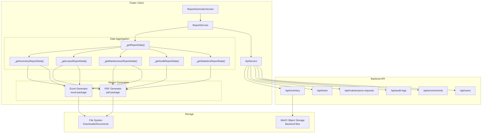
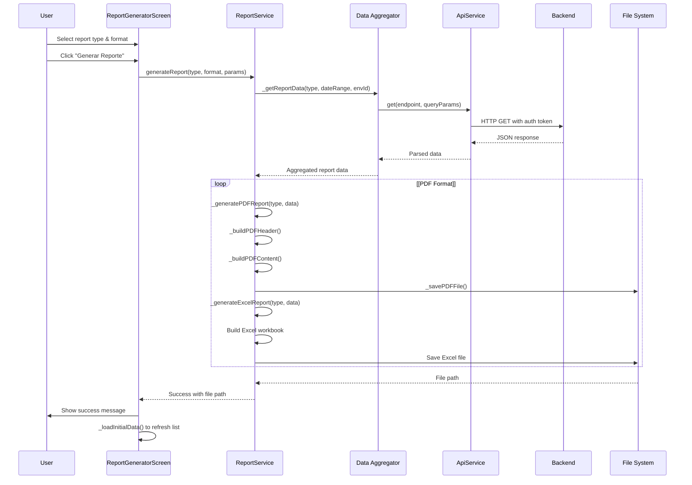
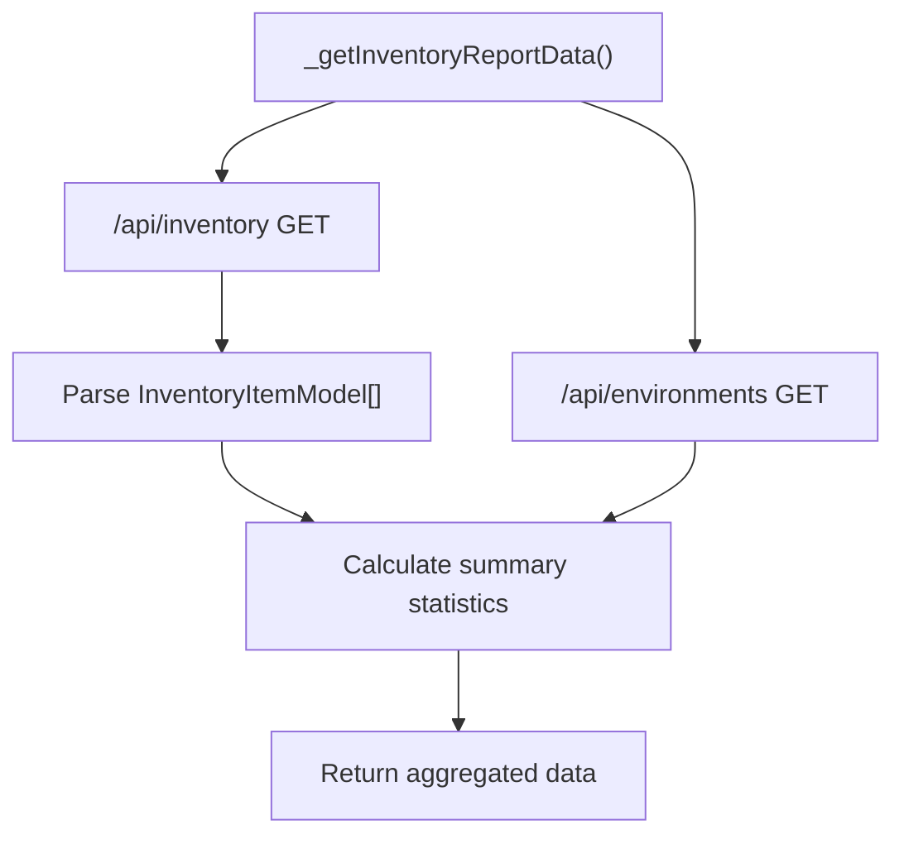
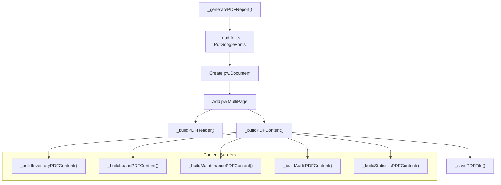
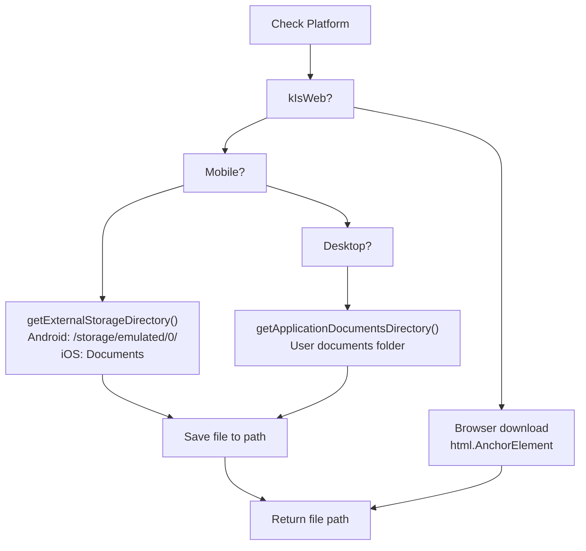
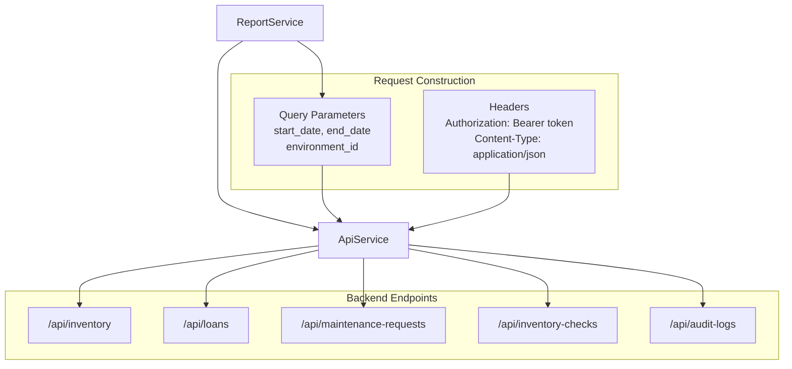
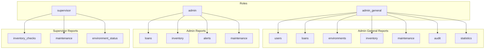
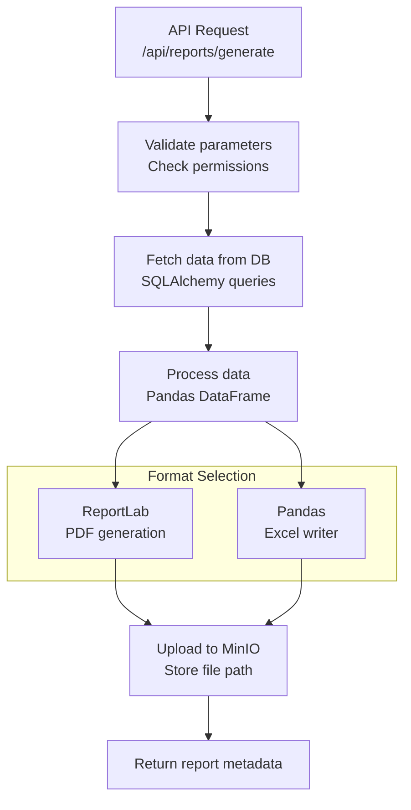

# Servicio de informes y API

> **Archivos fuente relevantes**
> * [cliente/lib/core/servicios/api_service.dart](https://github.com/axchisan/GestionInventarioSENA/blob/a6b12d01/client/lib/core/services/api_service.dart)
> * [cliente/lib/core/services/report_service.dart](https://github.com/axchisan/GestionInventarioSENA/blob/a6b12d01/client/lib/core/services/report_service.dart)
> * [cliente/lib/datos/modelos/modelo_de_entorno.dart](https://github.com/axchisan/GestionInventarioSENA/blob/a6b12d01/client/lib/data/models/environment_model.dart)
> * [cliente/lib/datos/modelos/modelo_de_entorno.g.dart](https://github.com/axchisan/GestionInventarioSENA/blob/a6b12d01/client/lib/data/models/environment_model.g.dart)
> * [cliente/lib/presentación/pantallas/informes/generador_de_informes_pantalla.dart](https://github.com/axchisan/GestionInventarioSENA/blob/a6b12d01/client/lib/presentation/screens/reports/report_generator_screen.dart)
> * [cliente/lib/presentación/pantallas/estadísticas/statistics_dashboard.dart](https://github.com/axchisan/GestionInventarioSENA/blob/a6b12d01/client/lib/presentation/screens/statistics/statistics_dashboard.dart)
> * [servidor/aplicación/esquemas/informes_generados.py](https://github.com/axchisan/GestionInventarioSENA/blob/a6b12d01/server/app/schemas/generated_reports.py)
> * [servidor/requisitos.txt](https://github.com/axchisan/GestionInventarioSENA/blob/a6b12d01/server/requirements.txt)

Esta página documenta la integración de la API del cliente `ReportService`y del backend para la generación de informes en el Sistema de Gestión de Inventario del SENA. El sistema de informes permite a los usuarios autorizados generar informes completos en PDF y Excel basados ​​en inventario, préstamos, mantenimiento, auditorías y otros datos del sistema.

**Alcance:** Esta página abarca la `ReportService`arquitectura de clases, los métodos de agregación de datos, la lógica de generación de PDF/Excel y la comunicación con la API de backend. Para la interfaz de usuario y la selección del tipo de informe, consulte [Generación de informes](/axchisan/GestionInventarioSENA/9.1-report-generation) . Para la visualización de estadísticas, consulte [Panel de estadísticas](/axchisan/GestionInventarioSENA/9.3-statistics-dashboard) .

---

## Descripción general del sistema

El sistema de informes sigue una arquitectura cliente-servidor donde el cliente Flutter agrega datos de múltiples puntos finales de la API, los procesa en estructuras de informes y genera documentos formateados localmente. Los informes se pueden generar en formato PDF o Excel según la selección del usuario y los permisos de rol.



**Fuentes:** [report_service.dart L1-L61](https://github.com/axchisan/GestionInventarioSENA/blob/a6b12d01/client/lib/core/services/report_service.dart#L1-L61)

 [report_generator_screen.dart L1-L50](https://github.com/axchisan/GestionInventarioSENA/blob/a6b12d01/client/lib/presentation/screens/reports/report_generator_screen.dart#L1-L50)

---

## Arquitectura de la clase ReportService

La `ReportService`clase es el componente central para la generación de informes, instanciado con una `ApiService`dependencia para la comunicación del backend.

### Estructura de clases

| Componente | Tipo | Objetivo |
| --- | --- | --- |
| `ReportService` | Clase | Clase de servicio principal para operaciones de informes |
| `_apiService` | Servicio de API | Cliente HTTP para comunicación API |
| `generateReport()` | Método | Punto de entrada principal para la generación de informes |
| `_getReportData()` | Método | Rutas al buscador de datos apropiado |
| `_generate{Type}ReportData()` | Métodos | Agregación de datos específicos del tipo |
| `_generatePDFReport()` | Método | Crea documentos PDF |
| `_generateExcelReport()` | Método | Crea hojas de cálculo de Excel |

### Inicialización

```
// Service instantiation in report generator screen
final authProvider = Provider.of<AuthProvider>(context, listen: false);
final apiService = ApiService(authProvider: authProvider);
_reportService = ReportService(apiService);
```

**Fuentes:** [report_service.dart L21-L24](https://github.com/axchisan/GestionInventarioSENA/blob/a6b12d01/client/lib/core/services/report_service.dart#L21-L24)

 [report_generator_screen.dart L133-L136](https://github.com/axchisan/GestionInventarioSENA/blob/a6b12d01/client/lib/presentation/screens/reports/report_generator_screen.dart#L133-L136)

---

## Flujo de generación de informes

The report generation process follows a multi-stage pipeline from user request to file download.



**Sources:** [client/lib/core/services/report_service.dart L26-L61](https://github.com/axchisan/GestionInventarioSENA/blob/a6b12d01/client/lib/core/services/report_service.dart#L26-L61)

 [client/lib/presentation/screens/reports/report_generator_screen.dart L715-L767](https://github.com/axchisan/GestionInventarioSENA/blob/a6b12d01/client/lib/presentation/screens/reports/report_generator_screen.dart#L715-L767)

---

## Report Types and Data Sources

The system supports multiple report types, each fetching data from specific API endpoints.

### Report Type Mapping

| Report Type | Data Sources | Roles with Access | Primary Endpoint |
| --- | --- | --- | --- |
| `inventory` | Items, Environments | admin, admin_general | `/api/inventory` |
| `inventory_checks` | Inventory checks | supervisor, admin_general | `/api/inventory-checks` |
| `loans` | Loan records | admin, admin_general | `/api/loans` |
| `maintenance` | Maintenance requests | supervisor, admin, admin_general | `/api/maintenance-requests` |
| `audit` | Audit logs | admin_general | `/api/audit-logs` |
| `statistics` | All data sources | admin_general | Multiple endpoints |
| `environment_status` | Environments | supervisor, admin_general | `/api/environments` |
| `alerts` | System alerts | admin, admin_general | `/api/alerts` |
| `users` | User records | admin_general | `/api/users` |
| `environments` | Environment list | admin_general | `/api/environments` |

### Data Fetching Router

The `_getReportData()` method routes to specific data fetchers based on report type:

```
switch (reportType) {
  case 'inventory':
    return await _getInventoryReportData(queryParams);
  case 'loans':
    return await _getLoansReportData(queryParams);
  case 'maintenance':
    return await _getMaintenanceReportData(queryParams);
  case 'audit':
    return await _getAuditReportData(queryParams);
  case 'statistics':
    return await _getStatisticsReportData(queryParams);
  // ... additional cases
}
```

**Sources:** [client/lib/core/services/report_service.dart L63-L103](https://github.com/axchisan/GestionInventarioSENA/blob/a6b12d01/client/lib/core/services/report_service.dart#L63-L103)

 [client/lib/presentation/screens/reports/report_generator_screen.dart L33-L124](https://github.com/axchisan/GestionInventarioSENA/blob/a6b12d01/client/lib/presentation/screens/reports/report_generator_screen.dart#L33-L124)

---

## Data Aggregation Methods

Each report type has a dedicated aggregation method that fetches raw data and computes summary statistics.

### Inventory Report Data



The method aggregates:

* Total items count
* Items by status (available, damaged, missing, maintenance)
* Environment associations
* Summary statistics

**Implementation:** [client/lib/core/services/report_service.dart L105-L152](https://github.com/axchisan/GestionInventarioSENA/blob/a6b12d01/client/lib/core/services/report_service.dart#L105-L152)

### Loans Report Data

Aggregates loan records and calculates:

* Total loans, active, pending, overdue counts
* Average loan duration
* Loan history by item/user

**Implementation:** [client/lib/core/services/report_service.dart L307-L345](https://github.com/axchisan/GestionInventarioSENA/blob/a6b12d01/client/lib/core/services/report_service.dart#L307-L345)

### Maintenance Report Data

Aggregates maintenance requests with:

* Request counts by status (pending, in_progress, completed)
* Total maintenance cost
* Priority distribution (urgent, normal, low)

**Implementation:** [client/lib/core/services/report_service.dart L347-L380](https://github.com/axchisan/GestionInventarioSENA/blob/a6b12d01/client/lib/core/services/report_service.dart#L347-L380)

### Audit Report Data

The audit report aggregates comprehensive log data:

```javascript
// Action breakdown
Map<String, int> actionCounts = {};
Map<String, int> userCounts = {};
Map<String, int> entityCounts = {};
int successfulActions = 0;
int failedActions = 0;

for (var log in auditLogs) {
  String action = log['action'] ?? 'unknown';
  actionCounts[action] = (actionCounts[action] ?? 0) + 1;
  
  String userEmail = log['user_email'] ?? 'unknown';
  userCounts[userEmail] = (userCounts[userEmail] ?? 0) + 1;
  
  // Status code analysis for success/failure
  int statusCode = response['status_code'] ?? 0;
  if (statusCode >= 200 && statusCode < 400) {
    successfulActions++;
  } else {
    failedActions++;
  }
}
```

**Implementation:** [client/lib/core/services/report_service.dart L382-L449](https://github.com/axchisan/GestionInventarioSENA/blob/a6b12d01/client/lib/core/services/report_service.dart#L382-L449)

### Statistics Report Data

The comprehensive statistics report combines data from all sources:

```
Future<Map<String, dynamic>> _getStatisticsReportData(Map<String, String> queryParams) async {
  Map<String, dynamic> result = {
    'generated_at': DateTime.now(),
  };
  
  result['inventory'] = await _getInventoryReportData(queryParams);
  result['loans'] = await _getLoansReportData(queryParams);
  result['maintenance'] = await _getMaintenanceReportData(queryParams);
  result['audit'] = await _getAuditReportData(queryParams);
  
  return result;
}
```

**Implementation:** [client/lib/core/services/report_service.dart L451-L489](https://github.com/axchisan/GestionInventarioSENA/blob/a6b12d01/client/lib/core/services/report_service.dart#L451-L489)

**Sources:** [client/lib/core/services/report_service.dart L105-L489](https://github.com/axchisan/GestionInventarioSENA/blob/a6b12d01/client/lib/core/services/report_service.dart#L105-L489)

---

## PDF Report Generation

PDF reports are generated using the `pdf` package with Unicode font support via Google Fonts.

### PDF Generation Pipeline



### Font Loading Strategy

The system attempts to load Unicode-compatible fonts with fallback:

```
pw.Font? regularFont;
pw.Font? boldFont;

try {
  if (Platform.isAndroid || Platform.isIOS) {
    regularFont = await PdfGoogleFonts.notoSansRegular();
    boldFont = await PdfGoogleFonts.notoSansBold();
  } else {
    regularFont = await PdfGoogleFonts.notoSansRegular();
    boldFont = await PdfGoogleFonts.notoSansBold();
  }
} catch (e) {
  // Fallback to basic fonts
  regularFont = pw.Font.helvetica();
  boldFont = pw.Font.helveticaBold();
}
```

**Implementation:** [client/lib/core/services/report_service.dart L499-L525](https://github.com/axchisan/GestionInventarioSENA/blob/a6b12d01/client/lib/core/services/report_service.dart#L499-L525)

### PDF Header Structure

Standard header applied to all reports:

```yaml
pw.Widget _buildPDFHeader(String reportType, pw.Font? boldFont, pw.Font? regularFont) {
  String title = _getReportTitle(reportType);
  
  return pw.Header(
    level: 0,
    child: pw.Row(
      mainAxisAlignment: pw.MainAxisAlignment.spaceBetween,
      children: [
        pw.Column(
          crossAxisAlignment: pw.CrossAxisAlignment.start,
          children: [
            pw.Text('SENA - Sistema de Gestión de Inventario', 
                    style: pw.TextStyle(fontSize: 16, fontWeight: pw.FontWeight.bold)),
            pw.Text(title, style: pw.TextStyle(fontSize: 14)),
          ],
        ),
        pw.Text('Generado: ${DateTime.now().toString().split('.')[0]}'),
      ],
    ),
  );
}
```

**Implementation:** [client/lib/core/services/report_service.dart L547-L585](https://github.com/axchisan/GestionInventarioSENA/blob/a6b12d01/client/lib/core/services/report_service.dart#L547-L585)

### PDF Content Builders

Each report type has a dedicated content builder that formats data into PDF tables and text:

#### Inventory PDF Content

Generates:

1. Summary statistics table (total items, available, damaged, missing)
2. Detailed items table with columns: Nombre, Categoría, Estado, Cantidad

```javascript
pw.Table(
  border: pw.TableBorder.all(),
  columnWidths: {
    0: const pw.FlexColumnWidth(2),
    1: const pw.FlexColumnWidth(1),
    2: const pw.FlexColumnWidth(1),
    3: const pw.FlexColumnWidth(1),
  },
  children: [
    // Header row
    pw.TableRow(
      decoration: const pw.BoxDecoration(color: PdfColors.grey300),
      children: [/* headers */],
    ),
    // Data rows
    ...items.map((item) => pw.TableRow(children: [/* item data */])),
  ],
)
```

**Implementation:** [client/lib/core/services/report_service.dart L618-L803](https://github.com/axchisan/GestionInventarioSENA/blob/a6b12d01/client/lib/core/services/report_service.dart#L618-L803)

#### Loans PDF Content

Generates:

* Summary table (total, active, pending, overdue loans)
* Detailed loans table with columns: Programa, Fecha Inicio, Fecha Fin, Estado

**Implementation:** [client/lib/core/services/report_service.dart L805-L947](https://github.com/axchisan/GestionInventarioSENA/blob/a6b12d01/client/lib/core/services/report_service.dart#L805-L947)

**Sources:** [client/lib/core/services/report_service.dart L491-L803](https://github.com/axchisan/GestionInventarioSENA/blob/a6b12d01/client/lib/core/services/report_service.dart#L491-L803)

---

## Excel Report Generation

Excel reports are generated using the `excel` package, creating structured workbooks with multiple sheets.

### Excel Generation Structure

```javascript
Future<String> _generateExcelReport(String reportType, Map<String, dynamic> data) async {
  var excel = Excel.createExcel();
  
  // Create sheets based on report type
  Sheet mainSheet = excel['Reporte'];
  
  // Add header row
  mainSheet.appendRow([
    'SENA - Sistema de Gestión de Inventario',
  ]);
  
  mainSheet.appendRow([
    _getReportTitle(reportType),
  ]);
  
  // Add data rows
  _addExcelData(mainSheet, reportType, data);
  
  // Save file
  return await _saveExcelFile(excel, reportType);
}
```

### Excel Data Formatting

Data rows are appended with appropriate column types:

| Report Type | Columns | Special Formatting |
| --- | --- | --- |
| Inventory | Name, Category, Status, Quantity | Status color coding |
| Loans | Program, User, Start Date, End Date, Status | Date formatting |
| Maintenance | Title, Priority, Status, Cost | Currency formatting for cost |
| Audit | Action, User, Timestamp, Status | Timestamp formatting |

**Sources:** [client/lib/core/services/report_service.dart L1-L61](https://github.com/axchisan/GestionInventarioSENA/blob/a6b12d01/client/lib/core/services/report_service.dart#L1-L61)

 (method referenced but implementation truncated in provided file)

---

## File Storage and Download

Generated reports are saved to the device file system with platform-specific paths.

### File Path Resolution



### Platform-Specific Storage

**Web Platform:**

* Files downloaded directly via browser
* Uses `universal_html` package
* Creates temporary blob URL for download

**Mobile Platforms:**

* Android: `/storage/emulated/0/Download/SENA_Reports/`
* iOS: Application Documents directory
* Requires storage permissions on Android

**Desktop Platforms:**

* Saves to user Documents folder
* Platform-specific path via `path_provider`

### Permission Handling

```javascript
// Android permission request
if (Platform.isAndroid) {
  var status = await Permission.storage.status;
  if (!status.isGranted) {
    await Permission.storage.request();
  }
}
```

**Sources:** [client/lib/core/services/report_service.dart L1-L20](https://github.com/axchisan/GestionInventarioSENA/blob/a6b12d01/client/lib/core/services/report_service.dart#L1-L20)

 (imports show path_provider and permission_handler usage)

---

## Backend API Integration

The `ReportService` communicates with backend APIs through the `ApiService` wrapper.

### API Request Structure



### Query Parameter Construction

Date ranges and filters are converted to query parameters:

```
Map<String, String>? queryParams = {};

if (dateRange != null) {
  queryParams['start_date'] = dateRange.start.toIso8601String().split('T')[0];
  queryParams['end_date'] = dateRange.end.toIso8601String().split('T')[0];
}

if (environmentId != null && environmentId != 'all') {
  queryParams['environment_id'] = environmentId;
}
```

**Implementation:** [client/lib/core/services/report_service.dart L68-L77](https://github.com/axchisan/GestionInventarioSENA/blob/a6b12d01/client/lib/core/services/report_service.dart#L68-L77)

### API Response Handling

Responses are parsed and validated before processing:

```javascript
final inventoryData = await _apiService.get(inventoryEndpoint, queryParams: queryParams);

if (inventoryData == null) {
  throw Exception('No se pudieron obtener los datos de inventario');
}

List<InventoryItemModel> items = [];
if (inventoryData is List) {
  for (var item in inventoryData) {
    try {
      items.add(InventoryItemModel.fromJson(item));
    } catch (e) {
      print('Error parsing inventory item: $e');
      // Continue with other items
    }
  }
}
```

**Implementation:** [client/lib/core/services/report_service.dart L106-L124](https://github.com/axchisan/GestionInventarioSENA/blob/a6b12d01/client/lib/core/services/report_service.dart#L106-L124)

### Error Handling

The `ApiService` provides comprehensive error handling with categorized exception types:

| Error Type | HTTP Status | Handling |
| --- | --- | --- |
| `ApiErrorType.network` | 0 | Retry prompt |
| `ApiErrorType.unauthorized` | 401 | Session expired, redirect to login |
| `ApiErrorType.notFound` | 404 | Empty data for admin_general, error for others |
| `ApiErrorType.serverError` | 500 | Retry later message |

**Sources:** [client/lib/core/services/api_service.dart L36-L95](https://github.com/axchisan/GestionInventarioSENA/blob/a6b12d01/client/lib/core/services/api_service.dart#L36-L95)

 [client/lib/core/services/api_service.dart L648-L704](https://github.com/axchisan/GestionInventarioSENA/blob/a6b12d01/client/lib/core/services/api_service.dart#L648-L704)

---

## Recent Reports List

The system maintains a list of recently generated reports for quick access.

### Recent Reports Data Structure

```
interface RecentReport {
  id: string;
  name: string;
  type: string;  // 'PDF' | 'Excel'
  date: string;  // formatted date
  size: string;  // '1.2 MB'
  status: string;  // 'Listo' | 'Generando'
}
```

### Loading Recent Reports

```python
Future<List<Map<String, dynamic>>> getRecentReports() async {
  try {
    final reportsData = await _apiService.get('/api/reports/recent');
    return List<Map<String, dynamic>>.from(reportsData);
  } catch (e) {
    print('Error loading recent reports: $e');
    return [];
  }
}
```

**Sources:** [client/lib/presentation/screens/reports/report_generator_screen.dart L147-L172](https://github.com/axchisan/GestionInventarioSENA/blob/a6b12d01/client/lib/presentation/screens/reports/report_generator_screen.dart#L147-L172)

---

## Role-Based Report Access

Different user roles have access to different report types based on their responsibilities.

### Report Access Matrix



### Role-Based Report Configuration

The report generator screen defines available reports per role:

```
final Map<String, List<Map<String, dynamic>>> roleBasedReportTypes = {
  'supervisor': [
    {'id': 'inventory_checks', 'title': 'Verificaciones de Inventario'},
    {'id': 'maintenance', 'title': 'Reporte de Mantenimiento'},
    {'id': 'environment_status', 'title': 'Estado de Ambientes'},
  ],
  'admin': [
    {'id': 'loans', 'title': 'Gestión de Préstamos'},
    {'id': 'inventory', 'title': 'Inventario de Almacén'},
    {'id': 'alerts', 'title': 'Alertas de Ambientes'},
    {'id': 'maintenance', 'title': 'Reporte de Mantenimiento'},
  ],
  'admin_general': [
    {'id': 'users', 'title': 'Gestión de Usuarios'},
    {'id': 'loans', 'title': 'Reporte de Préstamos'},
    {'id': 'environments', 'title': 'Gestión de Ambientes'},
    {'id': 'inventory', 'title': 'Reporte de Inventario'},
    {'id': 'maintenance', 'title': 'Reporte de Mantenimiento'},
    {'id': 'audit', 'title': 'Reporte de Auditoría'},
    {'id': 'statistics', 'title': 'Reporte Estadístico'},
  ],
};
```

**Implementation:** [client/lib/presentation/screens/reports/report_generator_screen.dart L33-L124](https://github.com/axchisan/GestionInventarioSENA/blob/a6b12d01/client/lib/presentation/screens/reports/report_generator_screen.dart#L33-L124)

### Environment Filtering by Role

Admin users (warehouse administrators) only see warehouse environments in filters:

```javascript
List<EnvironmentModel> get availableEnvironments {
  if (userRole == 'admin') {
    // Admin only sees warehouse environments
    return environments.where((env) => env.isWarehouse).toList();
  }
  // Other roles see all environments
  return environments;
}
```

**Implementation:** [client/lib/presentation/screens/reports/report_generator_screen.dart L181-L189](https://github.com/axchisan/GestionInventarioSENA/blob/a6b12d01/client/lib/presentation/screens/reports/report_generator_screen.dart#L181-L189)

**Sources:** [client/lib/presentation/screens/reports/report_generator_screen.dart L33-L189](https://github.com/axchisan/GestionInventarioSENA/blob/a6b12d01/client/lib/presentation/screens/reports/report_generator_screen.dart#L33-L189)

---

## Backend Report Schema

The backend defines a schema for tracking generated reports in the database.

### GeneratedReport Model

```python
class GeneratedReportBase(BaseModel):
    report_type: str
    title: str
    file_format: str
    parameters: Optional[Dict[str, Any]] = None

class GeneratedReportResponse(GeneratedReportBase):
    id: UUID
    user_id: UUID
    file_path: Optional[str] = None
    file_size: Optional[int] = None
    status: str  # 'generating' | 'completed' | 'failed'
    generated_at: Optional[datetime] = None
    expires_at: Optional[datetime] = None
    download_count: int = 0
    created_at: datetime
```

### Report Metadata Tracking

The system tracks:

* Report generation parameters (date range, filters)
* File path in MinIO storage
* Generation timestamp and expiration
* Download count for analytics

**Sources:** [server/app/schemas/generated_reports.py L1-L28](https://github.com/axchisan/GestionInventarioSENA/blob/a6b12d01/server/app/schemas/generated_reports.py#L1-L28)

---

## Backend Dependencies

The backend uses specialized libraries for report generation:

### Python Package Dependencies

| Package | Version | Purpose |
| --- | --- | --- |
| `reportlab` | 4.4.2 | PDF generation library |
| `pandas` | 2.3.2 | Excel file creation and data manipulation |
| `numpy` | 2.3.3 | Numerical operations for statistics |
| `minio` | 7.2.16 | Object storage for report files |
| `pillow` | 11.3.0 | Image processing for report graphics |

### Report Generation Flow on Backend



**Sources:** [server/requirements.txt L1-L52](https://github.com/axchisan/GestionInventarioSENA/blob/a6b12d01/server/requirements.txt#L1-L52)

---

## Summary

The Report Service & APIs provide a comprehensive reporting system with:

1. **Client-Side Service:** `ReportService` class aggregates data from multiple endpoints
2. **Data Aggregation:** Type-specific methods fetch and process data with error handling
3. **PDF Generation:** Uses `pdf` package with Unicode font support
4. **Excel Generation:** Creates structured workbooks with the `excel` package
5. **Acceso basado en roles:** diferentes tipos de informes disponibles por rol de usuario
6. **Integración de backend:** comunicación API RESTful con soporte de parámetros de consulta
7. **Almacenamiento de archivos:** guardado específico de la plataforma con la opción de almacenamiento backend de MinIO
8. **Manejo de errores:** gestión integral de errores con lógica de reintento

El sistema permite a los supervisores monitorear el cumplimiento de la verificación, a los administradores realizar un seguimiento de las operaciones del almacén y a los usuarios admin_general acceder a análisis de todo el sistema y registros de auditoría.