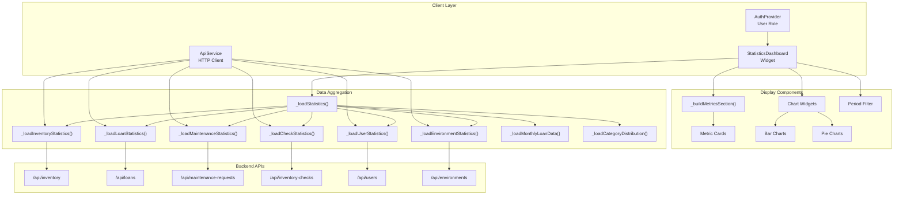
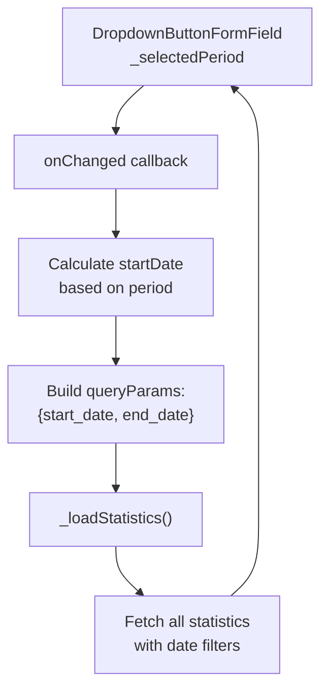
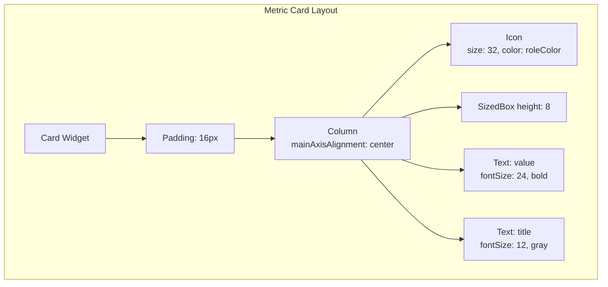
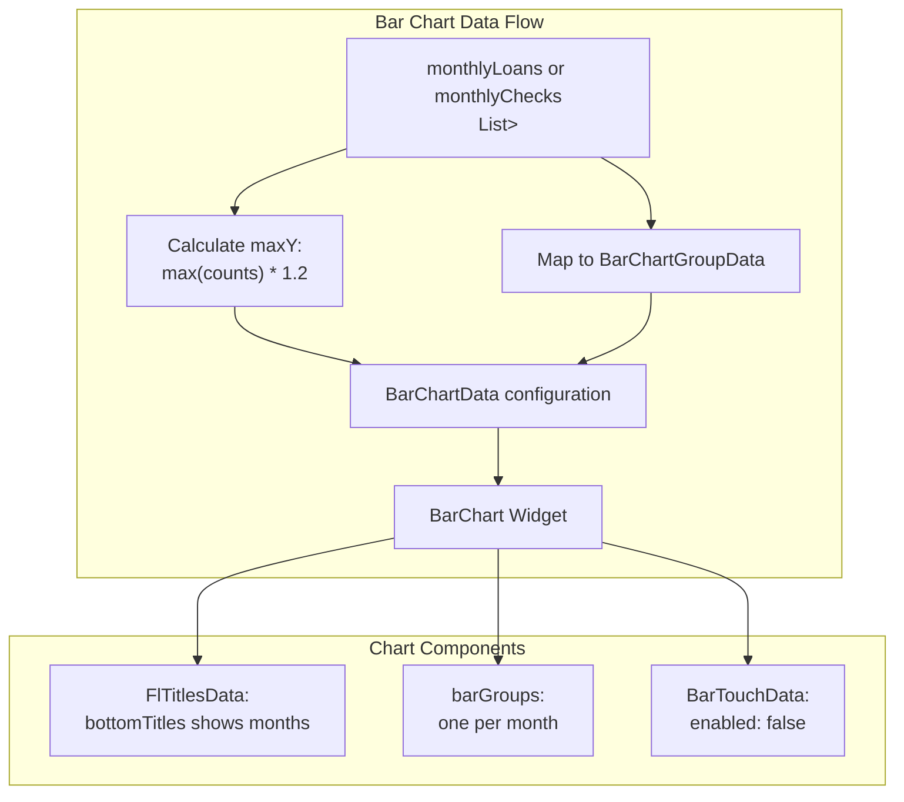
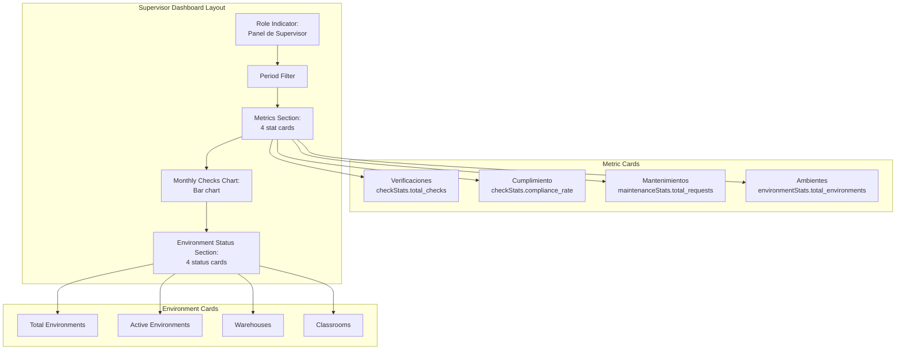
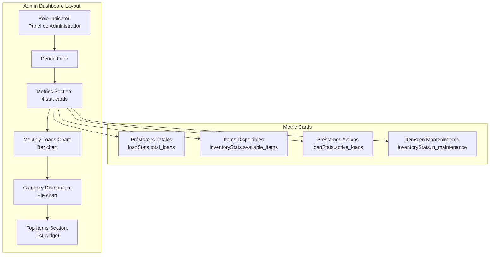
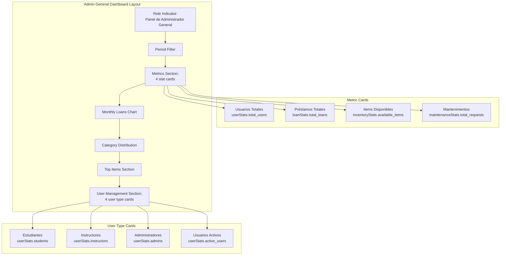

# Statistics Dashboard

> **Relevant source files**
> * [client/lib/core/services/api_service.dart](https://github.com/axchisan/GestionInventarioSENA/blob/a6b12d01/client/lib/core/services/api_service.dart)
> * [client/lib/core/services/report_service.dart](https://github.com/axchisan/GestionInventarioSENA/blob/a6b12d01/client/lib/core/services/report_service.dart)
> * [client/lib/data/models/environment_model.g.dart](https://github.com/axchisan/GestionInventarioSENA/blob/a6b12d01/client/lib/data/models/environment_model.g.dart)
> * [client/lib/presentation/screens/dashboard/instructor_dashboard.dart](https://github.com/axchisan/GestionInventarioSENA/blob/a6b12d01/client/lib/presentation/screens/dashboard/instructor_dashboard.dart)
> * [client/lib/presentation/screens/dashboard/supervisor_dashboard_screen.dart](https://github.com/axchisan/GestionInventarioSENA/blob/a6b12d01/client/lib/presentation/screens/dashboard/supervisor_dashboard_screen.dart)
> * [client/lib/presentation/screens/statistics/statistics_dashboard.dart](https://github.com/axchisan/GestionInventarioSENA/blob/a6b12d01/client/lib/presentation/screens/statistics/statistics_dashboard.dart)

## Purpose and Scope

The Statistics Dashboard provides a real-time analytics interface with role-specific metrics, visualizations, and insights for monitoring system performance. It displays comprehensive statistics about inventory, loans, maintenance requests, verification checks, users, and environments based on the authenticated user's role.

This page documents the client-side statistics dashboard screen and its data aggregation logic. For generating downloadable reports, see [Report Generation](/axchisan/GestionInventarioSENA/9.1-report-generation). For backend report generation APIs, see [Report Service & APIs](/axchisan/GestionInventarioSENA/9.2-report-service-and-apis).

---

## System Architecture

The Statistics Dashboard is a Flutter screen that aggregates data from multiple API endpoints and presents role-specific visualizations. It operates independently from the report generation system but shares similar data sources.



**Sources:**

* [client/lib/presentation/screens/statistics/statistics_dashboard.dart L1-L1800](https://github.com/axchisan/GestionInventarioSENA/blob/a6b12d01/client/lib/presentation/screens/statistics/statistics_dashboard.dart#L1-L1800)
* [client/lib/core/services/api_service.dart L1-L720](https://github.com/axchisan/GestionInventarioSENA/blob/a6b12d01/client/lib/core/services/api_service.dart#L1-L720)

---

## Role-Based Configuration

The dashboard uses a `roleBasedContent` map to define what metrics, charts, and sections each user role can access. This configuration drives the entire UI rendering logic.

### Configuration Structure

```mermaid
flowchart TD

RBC["roleBasedContent<br>Map<String, Map>"]
SUP["supervisor"]
ADM["admin"]
ADM_GEN["admin_general"]
SUPTITLE["title: Panel de Supervisor"]
SUPPRIM["primaryMetrics:<br>checkStats, maintenanceStats"]
SUPCHARTS["charts:<br>monthlyChecks, maintenanceByPriority"]
SUPSECT["sections:<br>verification_summary,<br>maintenance_overview"]
ADMTITLE["title: Panel de Administrador"]
ADMPRIM["primaryMetrics:<br>loanStats, inventoryStats"]
ADMCHARTS["charts:<br>monthlyLoans, categoryDistribution"]
ADMSECT["sections:<br>loan_management,<br>inventory_overview"]
AGTITLE["title: Panel de Administrador General"]
AGPRIM["primaryMetrics:<br>userStats, loanStats,<br>inventoryStats, maintenanceStats"]
AGCHARTS["charts:<br>monthlyLoans, categoryDistribution,<br>userActivity"]
AGSECT["sections:<br>system_overview,<br>user_management"]

SUP --> SUPTITLE
SUP --> SUPPRIM
SUP --> SUPCHARTS
SUP --> SUPSECT
ADM --> ADMTITLE
ADM --> ADMPRIM
ADM --> ADMCHARTS
ADM --> ADMSECT
ADM_GEN --> AGTITLE
ADM_GEN --> AGPRIM
ADM_GEN --> AGCHARTS
ADM_GEN --> AGSECT

subgraph subGraph3 ["Admin General Config"]
    AGTITLE
    AGPRIM
    AGCHARTS
    AGSECT
end

subgraph subGraph2 ["Admin Config"]
    ADMTITLE
    ADMPRIM
    ADMCHARTS
    ADMSECT
end

subgraph subGraph1 ["Supervisor Config"]
    SUPTITLE
    SUPPRIM
    SUPCHARTS
    SUPSECT
end

subgraph subGraph0 ["Role Configuration Map"]
    RBC
    SUP
    ADM
    ADM_GEN
    RBC --> SUP
    RBC --> ADM
    RBC --> ADM_GEN
end
```



The configuration is defined at [client/lib/presentation/screens/statistics/statistics_dashboard.dart L40-L62](https://github.com/axchisan/GestionInventarioSENA/blob/a6b12d01/client/lib/presentation/screens/statistics/statistics_dashboard.dart#L40-L62)

:

| Role | Primary Metrics | Charts | Sections |
| --- | --- | --- | --- |
| `supervisor` | checkStats, maintenanceStats | monthlyChecks, maintenanceByPriority | verification_summary, maintenance_overview, environment_status |
| `admin` | loanStats, inventoryStats | monthlyLoans, categoryDistribution | loan_management, inventory_overview, alerts_monitoring |
| `admin_general` | userStats, loanStats, inventoryStats, maintenanceStats | monthlyLoans, categoryDistribution, userActivity | system_overview, user_management, complete_statistics |

**Sources:**

* [client/lib/presentation/screens/statistics/statistics_dashboard.dart L40-L62](https://github.com/axchisan/GestionInventarioSENA/blob/a6b12d01/client/lib/presentation/screens/statistics/statistics_dashboard.dart#L40-L62)

---

## Data Loading Pipeline

The statistics dashboard loads data through a coordinated pipeline that fetches from multiple endpoints and aggregates results based on the selected time period.

```mermaid
sequenceDiagram
  participant StatisticsDashboard
  participant _loadStatistics()
  participant ApiService
  participant FastAPI Backend

  StatisticsDashboard->>_loadStatistics(): User changes period or refreshes
  _loadStatistics()->>_loadStatistics(): Calculate startDate and endDate
  _loadStatistics()->>_loadStatistics(): Build queryParams with dates
  loop [Parallel Data Fetching]
    _loadStatistics()->>ApiService: _loadInventoryStatistics()
    ApiService->>FastAPI Backend: GET /api/inventory?start_date=X&end_date=Y
    FastAPI Backend-->>ApiService: List[InventoryItem]
    ApiService-->>_loadStatistics(): inventoryStats
    _loadStatistics()->>ApiService: _loadLoanStatistics()
    ApiService->>FastAPI Backend: GET /api/loans?start_date=X&end_date=Y
    FastAPI Backend-->>ApiService: List[Loan] or Stats Map
    ApiService-->>_loadStatistics(): loanStats
    _loadStatistics()->>ApiService: _loadMaintenanceStatistics()
    ApiService->>FastAPI Backend: GET /api/maintenance-requests?start_date=X&end_date=Y
    FastAPI Backend-->>ApiService: List[MaintenanceRequest] or Stats Map
    ApiService-->>_loadStatistics(): maintenanceStats
    _loadStatistics()->>ApiService: _loadCheckStatistics()
    ApiService->>FastAPI Backend: GET /api/inventory-checks?start_date=X&end_date=Y
    FastAPI Backend-->>ApiService: List[InventoryCheck]
    ApiService-->>_loadStatistics(): checkStats
    _loadStatistics()->>ApiService: _loadUserStatistics()
    _loadStatistics()->>ApiService: _loadEnvironmentStatistics()
    _loadStatistics()->>ApiService: _loadMonthlyLoanData()
    _loadStatistics()->>ApiService: _loadCategoryDistribution()
    _loadStatistics()->>ApiService: _loadTopItems()
  end
  _loadStatistics()->>StatisticsDashboard: setState() with aggregated stats
  StatisticsDashboard->>StatisticsDashboard: _buildRoleBasedContent()
```

### Statistics Aggregation Methods

Each `_load*Statistics()` method follows a consistent pattern:

1. **Fetch data** from API endpoint with query parameters
2. **Handle response type** (List or Map) - APIs may return raw lists or pre-aggregated statistics
3. **Parse models** - Convert JSON to typed models (InventoryItemModel, LoanModel, etc.)
4. **Aggregate metrics** - Calculate totals, counts, percentages
5. **Return statistics map** - Consistent key-value structure for rendering

Example from [client/lib/presentation/screens/statistics/statistics_dashboard.dart L178-L206](https://github.com/axchisan/GestionInventarioSENA/blob/a6b12d01/client/lib/presentation/screens/statistics/statistics_dashboard.dart#L178-L206)

:

```javascript
Future<Map<String, dynamic>> _loadInventoryStatistics(Map<String, String> queryParams) async {
  final inventoryData = await _apiService.get(inventoryEndpoint, queryParams: queryParams);
  List<InventoryItemModel> items = [];
  for (var item in inventoryData) {
    items.add(InventoryItemModel.fromJson(item));
  }
  return {
    'total_items': items.length,
    'available_items': items.where((i) => i.status == 'available').length,
    'damaged_items': items.where((i) => i.status == 'damaged').length,
    'missing_items': items.where((i) => i.status == 'missing').length,
    'in_maintenance': items.where((i) => i.status == 'maintenance').length,
    'needs_maintenance': items.where((i) => i.needsMaintenance).length,
  };
}
```

**Sources:**

* [client/lib/presentation/screens/statistics/statistics_dashboard.dart L77-L176](https://github.com/axchisan/GestionInventarioSENA/blob/a6b12d01/client/lib/presentation/screens/statistics/statistics_dashboard.dart#L77-L176)
* [client/lib/presentation/screens/statistics/statistics_dashboard.dart L178-L699](https://github.com/axchisan/GestionInventarioSENA/blob/a6b12d01/client/lib/presentation/screens/statistics/statistics_dashboard.dart#L178-L699)

---

## Period Filtering

The dashboard supports temporal analysis through a period selector dropdown with four predefined ranges:

| Period | Duration | Start Date Calculation |
| --- | --- | --- |
| Última semana | 7 days | `endDate.subtract(Duration(days: 7))` |
| Último mes | 30 days | `endDate.subtract(Duration(days: 30))` |
| Últimos 3 meses | 90 days | `endDate.subtract(Duration(days: 90))` |
| Último año | 365 days | `endDate.subtract(Duration(days: 365))` |

The selected period is stored in `_selectedPeriod` state variable and triggers a full data reload when changed at [client/lib/presentation/screens/statistics/statistics_dashboard.dart L778-L782](https://github.com/axchisan/GestionInventarioSENA/blob/a6b12d01/client/lib/presentation/screens/statistics/statistics_dashboard.dart#L778-L782)



The query parameters are formatted as ISO 8601 date strings and passed to all API endpoints at [client/lib/presentation/screens/statistics/statistics_dashboard.dart L102-L105](https://github.com/axchisan/GestionInventarioSENA/blob/a6b12d01/client/lib/presentation/screens/statistics/statistics_dashboard.dart#L102-L105)

**Sources:**

* [client/lib/presentation/screens/statistics/statistics_dashboard.dart L23](https://github.com/axchisan/GestionInventarioSENA/blob/a6b12d01/client/lib/presentation/screens/statistics/statistics_dashboard.dart#L23-L23)
* [client/lib/presentation/screens/statistics/statistics_dashboard.dart L82-L105](https://github.com/axchisan/GestionInventarioSENA/blob/a6b12d01/client/lib/presentation/screens/statistics/statistics_dashboard.dart#L82-L105)
* [client/lib/presentation/screens/statistics/statistics_dashboard.dart L743-L794](https://github.com/axchisan/GestionInventarioSENA/blob/a6b12d01/client/lib/presentation/screens/statistics/statistics_dashboard.dart#L743-L794)

---

## Metric Display System

The dashboard displays key metrics as card-based widgets using the `_buildStatCard()` method. Each metric card shows:

* **Value** - The numeric statistic (large, bold)
* **Title** - Label describing the metric (small, gray)
* **Icon** - Visual indicator with color coding
* **Change indicator** - Percentage change vs baseline (calculated via `_calculateChange()`)

### Metric Card Structure



### Role-Specific Metric Grids

The `_buildMetricsSection()` method at [client/lib/presentation/screens/statistics/statistics_dashboard.dart L918-L1074](https://github.com/axchisan/GestionInventarioSENA/blob/a6b12d01/client/lib/presentation/screens/statistics/statistics_dashboard.dart#L918-L1074)

 renders different metric sets based on user role:

**Supervisor Metrics:**

* Verificaciones (total_checks) - Primary metric for verification workflow
* Cumplimiento (compliance_rate) - Percentage of completed checks
* Mantenimientos (total_requests) - Maintenance request count
* Ambientes (total_environments) - Environment count

**Admin Metrics:**

* Préstamos Totales (total_loans) - All loan records
* Items Disponibles (available_items) - Available inventory
* Préstamos Activos (active_loans) - Currently active loans
* Items en Mantenimiento (in_maintenance) - Items under repair

**Admin General Metrics:**

* Usuarios Totales (total_users) - System-wide user count
* Préstamos Totales (total_loans) - All loans
* Items Disponibles (available_items) - Available inventory
* Mantenimientos (total_requests) - Maintenance requests

**Sources:**

* [client/lib/presentation/screens/statistics/statistics_dashboard.dart L918-L1074](https://github.com/axchisan/GestionInventarioSENA/blob/a6b12d01/client/lib/presentation/screens/statistics/statistics_dashboard.dart#L918-L1074)

---

## Chart Visualizations

The dashboard uses the `fl_chart` package to render interactive bar and pie charts. Charts are generated dynamically based on aggregated data and user role.

### Bar Chart Implementation

Monthly loan/check trends are displayed using `BarChart` widgets from `fl_chart`:



The implementation at [client/lib/presentation/screens/statistics/statistics_dashboard.dart L1361-L1454](https://github.com/axchisan/GestionInventarioSENA/blob/a6b12d01/client/lib/presentation/screens/statistics/statistics_dashboard.dart#L1361-L1454)

 creates bar charts with:

* **X-axis**: Month abbreviations (Ene, Feb, Mar, etc.)
* **Y-axis**: Count values (auto-scaled to 120% of max)
* **Bar color**: Role-specific (blue for supervisor, AppColors.primary for admin)
* **Touch interaction**: Disabled for performance

### Category Distribution Pie Chart

The `_buildCategoryDistributionChart()` method at [client/lib/presentation/screens/statistics/statistics_dashboard.dart L1456-L1554](https://github.com/axchisan/GestionInventarioSENA/blob/a6b12d01/client/lib/presentation/screens/statistics/statistics_dashboard.dart#L1456-L1554)

 renders a pie chart showing inventory distribution by category:

```css
PieChart(
  PieChartData(
    sections: categoryDistribution.map((category) {
      return PieChartSectionData(
        value: category['percentage'].toDouble(),
        title: '${category['category']}\n${category['percentage']}%',
        color: _getCategoryColor(category['category']),
        radius: 80,
      );
    }).toList(),
  ),
)
```

**Sources:**

* [client/lib/presentation/screens/statistics/statistics_dashboard.dart L1076-L1169](https://github.com/axchisan/GestionInventarioSENA/blob/a6b12d01/client/lib/presentation/screens/statistics/statistics_dashboard.dart#L1076-L1169)
* [client/lib/presentation/screens/statistics/statistics_dashboard.dart L1361-L1554](https://github.com/axchisan/GestionInventarioSENA/blob/a6b12d01/client/lib/presentation/screens/statistics/statistics_dashboard.dart#L1361-L1554)

---

## Role-Specific Dashboard Sections

The `_buildRoleBasedContent()` method at [client/lib/presentation/screens/statistics/statistics_dashboard.dart L883-L916](https://github.com/axchisan/GestionInventarioSENA/blob/a6b12d01/client/lib/presentation/screens/statistics/statistics_dashboard.dart#L883-L916)

 constructs the dashboard layout based on the authenticated user's role.

### Supervisor Dashboard



The environment status section is rendered by `_buildEnvironmentStatusSection()` at [client/lib/presentation/screens/statistics/statistics_dashboard.dart L1171-L1233](https://github.com/axchisan/GestionInventarioSENA/blob/a6b12d01/client/lib/presentation/screens/statistics/statistics_dashboard.dart#L1171-L1233)

**Sources:**

* [client/lib/presentation/screens/statistics/statistics_dashboard.dart L895-L898](https://github.com/axchisan/GestionInventarioSENA/blob/a6b12d01/client/lib/presentation/screens/statistics/statistics_dashboard.dart#L895-L898)
* [client/lib/presentation/screens/statistics/statistics_dashboard.dart L1171-L1233](https://github.com/axchisan/GestionInventarioSENA/blob/a6b12d01/client/lib/presentation/screens/statistics/statistics_dashboard.dart#L1171-L1233)

### Admin Dashboard



The admin role focuses on warehouse operations, showing loan trends and inventory distribution.

**Sources:**

* [client/lib/presentation/screens/statistics/statistics_dashboard.dart L899-L910](https://github.com/axchisan/GestionInventarioSENA/blob/a6b12d01/client/lib/presentation/screens/statistics/statistics_dashboard.dart#L899-L910)
* [client/lib/presentation/screens/statistics/statistics_dashboard.dart L971-L1020](https://github.com/axchisan/GestionInventarioSENA/blob/a6b12d01/client/lib/presentation/screens/statistics/statistics_dashboard.dart#L971-L1020)

### Admin General Dashboard



The admin_general role has the most comprehensive view, including user management statistics rendered by `_buildUserManagementSection()` at [client/lib/presentation/screens/statistics/statistics_dashboard.dart L1266-L1328](https://github.com/axchisan/GestionInventarioSENA/blob/a6b12d01/client/lib/presentation/screens/statistics/statistics_dashboard.dart#L1266-L1328)

**Sources:**

* [client/lib/presentation/screens/statistics/statistics_dashboard.dart L905-L913](https://github.com/axchisan/GestionInventarioSENA/blob/a6b12d01/client/lib/presentation/screens/statistics/statistics_dashboard.dart#L905-L913)
* [client/lib/presentation/screens/statistics/statistics_dashboard.dart L1021-L1070](https://github.com/axchisan/GestionInventarioSENA/blob/a6b12d01/client/lib/presentation/screens/statistics/statistics_dashboard.dart#L1021-L1070)
* [client/lib/presentation/screens/statistics/statistics_dashboard.dart L1266-L1328](https://github.com/axchisan/GestionInventarioSENA/blob/a6b12d01/client/lib/presentation/screens/statistics/statistics_dashboard.dart#L1266-L1328)

---

## Dashboard Navigation Access

The statistics dashboard is accessible from the supervisor and admin dashboards via action cards:

**Supervisor Dashboard**: Linked at [client/lib/presentation/screens/dashboard/supervisor_dashboard_screen.dart L510-L517](https://github.com/axchisan/GestionInventarioSENA/blob/a6b12d01/client/lib/presentation/screens/dashboard/supervisor_dashboard_screen.dart#L510-L517)

 with the label "Estadísticas" and route `/statistics-dashboard`.

**Admin General Dashboard**: Similar navigation available through the dashboard grid.

The dashboard requires authentication and role-based authorization. The `StatisticsDashboard` widget initializes the `ApiService` with the `AuthProvider` at [client/lib/presentation/screens/statistics/statistics_dashboard.dart L71-L75](https://github.com/axchisan/GestionInventarioSENA/blob/a6b12d01/client/lib/presentation/screens/statistics/statistics_dashboard.dart#L71-L75)

 to ensure all API requests include the bearer token.

**Sources:**

* [client/lib/presentation/screens/dashboard/supervisor_dashboard_screen.dart L510-L517](https://github.com/axchisan/GestionInventarioSENA/blob/a6b12d01/client/lib/presentation/screens/dashboard/supervisor_dashboard_screen.dart#L510-L517)
* [client/lib/presentation/screens/statistics/statistics_dashboard.dart L64-L75](https://github.com/axchisan/GestionInventarioSENA/blob/a6b12d01/client/lib/presentation/screens/statistics/statistics_dashboard.dart#L64-L75)