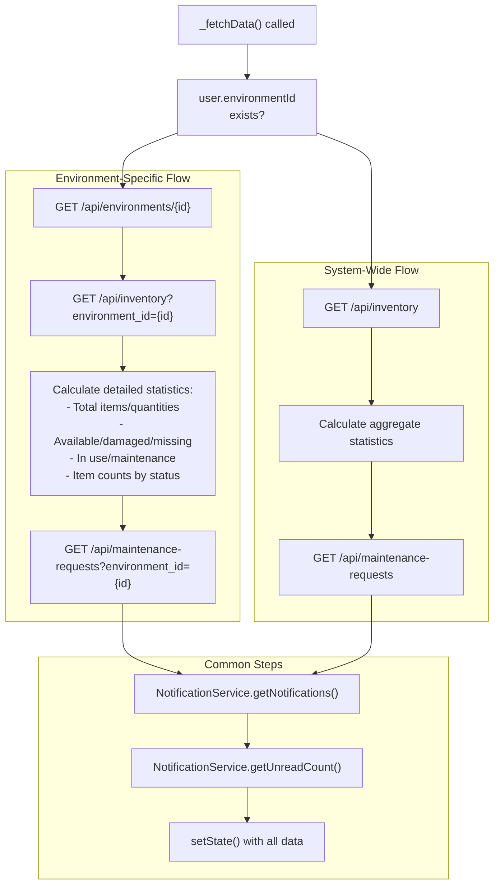
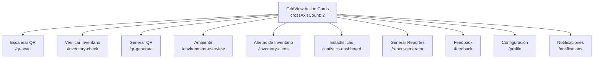
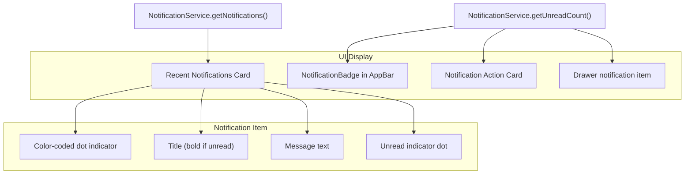

# Supervisor Dashboard

> **Relevant source files**
> * [client/lib/core/services/navigation_service.dart](https://github.com/axchisan/GestionInventarioSENA/blob/a6b12d01/client/lib/core/services/navigation_service.dart)
> * [client/lib/presentation/screens/dashboard/instructor_dashboard.dart](https://github.com/axchisan/GestionInventarioSENA/blob/a6b12d01/client/lib/presentation/screens/dashboard/instructor_dashboard.dart)
> * [client/lib/presentation/screens/dashboard/student_dashboard.dart](https://github.com/axchisan/GestionInventarioSENA/blob/a6b12d01/client/lib/presentation/screens/dashboard/student_dashboard.dart)
> * [client/lib/presentation/screens/dashboard/supervisor_dashboard_screen.dart](https://github.com/axchisan/GestionInventarioSENA/blob/a6b12d01/client/lib/presentation/screens/dashboard/supervisor_dashboard_screen.dart)

## Purpose and Scope

The Supervisor Dashboard serves as the primary interface for users with the `supervisor` role, providing broader oversight capabilities compared to instructor-level access. It displays comprehensive inventory statistics, maintenance request monitoring, and provides navigation to supervisory functions including verification review, inventory alerts, and report generation.

For information about other role-specific dashboards, see [Student Dashboard](/axchisan/GestionInventarioSENA/4.1-student-dashboard), [Instructor Dashboard](/axchisan/GestionInventarioSENA/4.2-instructor-dashboard), and [Admin Dashboards](/axchisan/GestionInventarioSENA/4.4-admin-dashboards). For details on role-based access control, see [Role-Based Access Control](/axchisan/GestionInventarioSENA/3.3-role-based-access-control).

---

## Screen Implementation

The supervisor dashboard is implemented in the `SupervisorDashboardScreen` class, which is a stateful widget that fetches and displays environment-specific or system-wide inventory data.

**Main Components:**

| Component | File Location | Description |
| --- | --- | --- |
| `SupervisorDashboardScreen` | [client/lib/presentation/screens/dashboard/supervisor_dashboard_screen.dart L12-L1017](https://github.com/axchisan/GestionInventarioSENA/blob/a6b12d01/client/lib/presentation/screens/dashboard/supervisor_dashboard_screen.dart#L12-L1017) | Main widget class |
| `_SupervisorDashboardScreenState` | [client/lib/presentation/screens/dashboard/supervisor_dashboard_screen.dart L20-L1017](https://github.com/axchisan/GestionInventarioSENA/blob/a6b12d01/client/lib/presentation/screens/dashboard/supervisor_dashboard_screen.dart#L20-L1017) | State management for data fetching and UI updates |
| Route configuration | [client/lib/core/services/navigation_service.dart L132-L135](https://github.com/axchisan/GestionInventarioSENA/blob/a6b12d01/client/lib/core/services/navigation_service.dart#L132-L135) | Navigation route `/supervisor-dashboard` |

Sources: [client/lib/presentation/screens/dashboard/supervisor_dashboard_screen.dart L1-L1017](https://github.com/axchisan/GestionInventarioSENA/blob/a6b12d01/client/lib/presentation/screens/dashboard/supervisor_dashboard_screen.dart#L1-L1017)

 [client/lib/core/services/navigation_service.dart L132-L135](https://github.com/axchisan/GestionInventarioSENA/blob/a6b12d01/client/lib/core/services/navigation_service.dart#L132-L135)

---

## Screen Architecture

```mermaid
flowchart TD

Screen["SupervisorDashboardScreen"]
State["_SupervisorDashboardScreenState"]
ApiSvc["_apiService: ApiService"]
Env["_environment: Map?"]
Stats["_inventoryStats: Map?"]
Notifs["_recentNotifications: List"]
Maint["_maintenanceRequests: List"]
Unread["_unreadNotificationsCount: int"]
Loading["_isLoading: bool"]
FetchData["_fetchData()"]
FetchEnv["Fetch environment via<br>_apiService.getSingle()"]
FetchItems["Fetch inventory items via<br>_apiService.get()"]
CalcStats["Calculate detailed statistics"]
FetchMaint["Fetch maintenance requests"]
FetchNotif["Fetch via NotificationService"]
AppBar["SenaAppBar with NotificationBadge"]
Welcome["Welcome Card"]
StatsGrid["Statistics Cards Grid"]
DetailCard["Detailed Breakdown Card"]
ActionsGrid["Action Cards GridView"]
NotifsCard["Recent Notifications Card"]
Drawer["Navigation Drawer"]

Screen --> State
State --> ApiSvc
State --> Env
State --> Stats
State --> Notifs
State --> Maint
State --> Unread
State --> Loading
State --> FetchData
State --> AppBar
State --> Welcome
State --> StatsGrid
State --> DetailCard
State --> ActionsGrid
State --> NotifsCard
State --> Drawer

subgraph subGraph2 ["UI Components"]
    AppBar
    Welcome
    StatsGrid
    DetailCard
    ActionsGrid
    NotifsCard
    Drawer
end

subgraph subGraph1 ["Data Fetching"]
    FetchData
    FetchEnv
    FetchItems
    CalcStats
    FetchMaint
    FetchNotif
    FetchData --> FetchEnv
    FetchData --> FetchItems
    FetchData --> CalcStats
    FetchData --> FetchMaint
    FetchData --> FetchNotif
end

subgraph subGraph0 ["State Variables"]
    ApiSvc
    Env
    Stats
    Notifs
    Maint
    Unread
    Loading
end
```



Sources: [client/lib/presentation/screens/dashboard/supervisor_dashboard_screen.dart L20-L213](https://github.com/axchisan/GestionInventarioSENA/blob/a6b12d01/client/lib/presentation/screens/dashboard/supervisor_dashboard_screen.dart#L20-L213)

---

## Data Fetching and Statistics Calculation

The dashboard implements comprehensive data fetching in the `_fetchData()` method, which runs on initialization and during pull-to-refresh actions.

### Environment-Specific vs System-Wide Data

The dashboard supports two modes based on whether the supervisor has a linked environment:

| Mode | Condition | Behavior |
| --- | --- | --- |
| Environment-Specific | `user.environmentId != null` | Fetches data filtered by environment ID |
| System-Wide | `user.environmentId == null` | Fetches all inventory data across environments |

**Data Fetching Flow:**



Sources: [client/lib/presentation/screens/dashboard/supervisor_dashboard_screen.dart L38-L207](https://github.com/axchisan/GestionInventarioSENA/blob/a6b12d01/client/lib/presentation/screens/dashboard/supervisor_dashboard_screen.dart#L38-L207)

### Statistics Calculation Logic

The dashboard calculates detailed inventory statistics including both quantity-based and item-based metrics:

**Calculated Statistics:**

```mermaid
flowchart TD

Items["items: List"]
TotalQty["total_quantity:<br>Sum of all quantities"]
AvailQty["available_quantity:<br>total - damaged - missing"]
DamagedQty["damaged_quantity:<br>Sum of quantity_damaged"]
MissingQty["missing_quantity:<br>Sum of quantity_missing"]
InUseQty["in_use_quantity:<br>Sum where status='in_use'"]
MaintQty["maintenance_quantity:<br>Sum where status='maintenance'"]
TotalItems["total_items:<br>items.length"]
AvailItems["available_items:<br>Count where status='available'"]
InUseItems["in_use_items:<br>Count where status='in_use'"]
MaintItems["maintenance_items:<br>Count where status='maintenance'"]
DamagedItems["damaged_items:<br>Count where status='damaged'"]
MissingItems["missing_items:<br>Count where status in ['missing','lost']"]

Items --> TotalQty
Items --> AvailQty
Items --> DamagedQty
Items --> MissingQty
Items --> InUseQty
Items --> MaintQty
Items --> TotalItems
Items --> AvailItems
Items --> InUseItems
Items --> MaintItems
Items --> DamagedItems
Items --> MissingItems

subgraph subGraph1 ["Item-Based Metrics"]
    TotalItems
    AvailItems
    InUseItems
    MaintItems
    DamagedItems
    MissingItems
end

subgraph subGraph0 ["Quantity-Based Metrics"]
    TotalQty
    AvailQty
    DamagedQty
    MissingQty
    InUseQty
    MaintQty
end
```



**Implementation Details:**

The statistics calculation iterates through inventory items and aggregates values:

* **Total Quantity**: Sum of `quantity` field from all items [client/lib/presentation/screens/dashboard/supervisor_dashboard_screen.dart L72-L77](https://github.com/axchisan/GestionInventarioSENA/blob/a6b12d01/client/lib/presentation/screens/dashboard/supervisor_dashboard_screen.dart#L72-L77)
* **Available Quantity**: `quantity - quantity_damaged - quantity_missing` [client/lib/presentation/screens/dashboard/supervisor_dashboard_screen.dart L82-L84](https://github.com/axchisan/GestionInventarioSENA/blob/a6b12d01/client/lib/presentation/screens/dashboard/supervisor_dashboard_screen.dart#L82-L84)
* **Status-Based Counts**: Switch statement categorizes items by `status` field [client/lib/presentation/screens/dashboard/supervisor_dashboard_screen.dart L87-L107](https://github.com/axchisan/GestionInventarioSENA/blob/a6b12d01/client/lib/presentation/screens/dashboard/supervisor_dashboard_screen.dart#L87-L107)

Sources: [client/lib/presentation/screens/dashboard/supervisor_dashboard_screen.dart L56-L187](https://github.com/axchisan/GestionInventarioSENA/blob/a6b12d01/client/lib/presentation/screens/dashboard/supervisor_dashboard_screen.dart#L56-L187)

---

## UI Layout and Components

The dashboard uses a scrollable single-column layout with several card-based sections:

### Welcome Card

Displays user greeting and linked environment information.

**Components:**

* SENA logo with accent color background
* Welcome message: "¡Bienvenido, {firstName}!"
* Environment name (if linked) or "Supervisión General" label

Sources: [client/lib/presentation/screens/dashboard/supervisor_dashboard_screen.dart L245-L296](https://github.com/axchisan/GestionInventarioSENA/blob/a6b12d01/client/lib/presentation/screens/dashboard/supervisor_dashboard_screen.dart#L245-L296)

### Statistics Cards Grid

Displays six key metrics in a 2-column grid using `_buildStatCard()`:

| Metric | Field | Icon | Color |
| --- | --- | --- | --- |
| Items Totales | `total_quantity` | `Icons.inventory` | `AppColors.accent` |
| Disponibles | `available_quantity` | `Icons.check_circle` | `AppColors.success` |
| En Uso | `in_use_quantity` or `in_use_items` | `Icons.work` | `AppColors.info` |
| Dañados | `damaged_quantity` | `Icons.broken_image` | `AppColors.warning` |
| Faltantes | `missing_quantity` | `Icons.error_outline` | `AppColors.error` |
| Mantenimiento | `maintenance_quantity` or `maintenance_items` | `Icons.build` | `AppColors.secondary` |
| Solicitudes | Count of pending maintenance requests | `Icons.notifications_active` | `AppColors.warning` |

The stat card displays an icon, large numeric value, and descriptive label [client/lib/presentation/screens/dashboard/supervisor_dashboard_screen.dart L787-L816](https://github.com/axchisan/GestionInventarioSENA/blob/a6b12d01/client/lib/presentation/screens/dashboard/supervisor_dashboard_screen.dart#L787-L816)

Sources: [client/lib/presentation/screens/dashboard/supervisor_dashboard_screen.dart L306-L388](https://github.com/axchisan/GestionInventarioSENA/blob/a6b12d01/client/lib/presentation/screens/dashboard/supervisor_dashboard_screen.dart#L306-L388)

 [client/lib/presentation/screens/dashboard/supervisor_dashboard_screen.dart L787-L816](https://github.com/axchisan/GestionInventarioSENA/blob/a6b12d01/client/lib/presentation/screens/dashboard/supervisor_dashboard_screen.dart#L787-L816)

### Detailed Breakdown Card

Provides a tabular breakdown of quantities using `_buildDetailRow()`:

```
Desglose Detallado
├─ Cantidad Total de Unidades
├─ (Divider)
├─ Unidades Disponibles (success color)
├─ Unidades Dañadas (warning color)
├─ Unidades Faltantes (error color)
├─ (Divider)
├─ Items en Mantenimiento
└─ Items en Uso
```

Each row shows a label and bold value, with optional color coding for status indicators.

Sources: [client/lib/presentation/screens/dashboard/supervisor_dashboard_screen.dart L390-L438](https://github.com/axchisan/GestionInventarioSENA/blob/a6b12d01/client/lib/presentation/screens/dashboard/supervisor_dashboard_screen.dart#L390-L438)

 [client/lib/presentation/screens/dashboard/supervisor_dashboard_screen.dart L620-L638](https://github.com/axchisan/GestionInventarioSENA/blob/a6b12d01/client/lib/presentation/screens/dashboard/supervisor_dashboard_screen.dart#L620-L638)

---

## Action Cards and Navigation

The dashboard provides a 2-column grid of action cards using `GridView.count` with `childAspectRatio: 1.1`:

**Action Cards Navigation Map:**



**Action Card Implementation:**

Each card is created using `_buildActionCard()` [client/lib/presentation/screens/dashboard/supervisor_dashboard_screen.dart L819-L858](https://github.com/axchisan/GestionInventarioSENA/blob/a6b12d01/client/lib/presentation/screens/dashboard/supervisor_dashboard_screen.dart#L819-L858)

 with parameters:

* `title`: Display name
* `subtitle`: Description text
* `icon`: Material icon
* `color`: Theme color
* `route`: Navigation path
* `extra`: Optional route parameters (e.g., `environmentId` for environment overview)

The notification card uses a special implementation `_buildNotificationActionCard()` that displays an unread count badge [client/lib/presentation/screens/dashboard/supervisor_dashboard_screen.dart L640-L702](https://github.com/axchisan/GestionInventarioSENA/blob/a6b12d01/client/lib/presentation/screens/dashboard/supervisor_dashboard_screen.dart#L640-L702)

Sources: [client/lib/presentation/screens/dashboard/supervisor_dashboard_screen.dart L454-L544](https://github.com/axchisan/GestionInventarioSENA/blob/a6b12d01/client/lib/presentation/screens/dashboard/supervisor_dashboard_screen.dart#L454-L544)

 [client/lib/presentation/screens/dashboard/supervisor_dashboard_screen.dart L819-L858](https://github.com/axchisan/GestionInventarioSENA/blob/a6b12d01/client/lib/presentation/screens/dashboard/supervisor_dashboard_screen.dart#L819-L858)

---

## Notification Integration

The dashboard integrates with `NotificationService` to display recent notifications and unread counts.

**Notification Display Flow:**



**Notification Type Colors:**

The `_getNotificationColor()` method maps notification types to colors [client/lib/presentation/screens/dashboard/supervisor_dashboard_screen.dart L704-L721](https://github.com/axchisan/GestionInventarioSENA/blob/a6b12d01/client/lib/presentation/screens/dashboard/supervisor_dashboard_screen.dart#L704-L721)

:

| Type | Color |
| --- | --- |
| `verification_pending` | `AppColors.warning` |
| `verification_update` | `AppColors.accent` |
| `maintenance_update` | `AppColors.info` |
| `maintenance_request` | `AppColors.info` |
| `loan_approved` | `AppColors.success` |
| `loan_rejected` | `AppColors.error` |
| `loan_overdue` | `AppColors.error` |
| Default | `AppColors.info` |

**Recent Notifications Card:**

Displays up to 3 most recent notifications [client/lib/presentation/screens/dashboard/supervisor_dashboard_screen.dart L195](https://github.com/axchisan/GestionInventarioSENA/blob/a6b12d01/client/lib/presentation/screens/dashboard/supervisor_dashboard_screen.dart#L195-L195)

 with:

* Unread count badge in header
* Each notification rendered by `_buildNotificationItem()` [client/lib/presentation/screens/dashboard/supervisor_dashboard_screen.dart L723-L785](https://github.com/axchisan/GestionInventarioSENA/blob/a6b12d01/client/lib/presentation/screens/dashboard/supervisor_dashboard_screen.dart#L723-L785)
* "Ver todas las notificaciones" link to `/notifications` route

Sources: [client/lib/presentation/screens/dashboard/supervisor_dashboard_screen.dart L191-L196](https://github.com/axchisan/GestionInventarioSENA/blob/a6b12d01/client/lib/presentation/screens/dashboard/supervisor_dashboard_screen.dart#L191-L196)

 [client/lib/presentation/screens/dashboard/supervisor_dashboard_screen.dart L546-L611](https://github.com/axchisan/GestionInventarioSENA/blob/a6b12d01/client/lib/presentation/screens/dashboard/supervisor_dashboard_screen.dart#L546-L611)

 [client/lib/presentation/screens/dashboard/supervisor_dashboard_screen.dart L704-L785](https://github.com/axchisan/GestionInventarioSENA/blob/a6b12d01/client/lib/presentation/screens/dashboard/supervisor_dashboard_screen.dart#L704-L785)

---

## Navigation Drawer

The drawer provides an alternative navigation interface with the same routes as action cards plus quick access to logout.

**Drawer Structure:**

```mermaid
flowchart TD

Drawer["Drawer"]
Logo["SENA Logo"]
Title["Panel de Supervisor"]
Email["User email"]
Dashboard["Dashboard"]
QR["Escanear QR"]
Verify["Verificar Inventario"]
GenQR["Generar QR"]
Env["Ambiente"]
Alerts["Alertas de Inventario"]
Stats["Estadísticas"]
Reports["Generar Reportes"]
Feedback["Feedback"]
Notifs["Notificaciones (with badge)"]
Divider["Divider"]
Settings["Configuración"]
Logout["Cerrar Sesión"]

Drawer --> Logo
Drawer --> Title
Drawer --> Email
Drawer --> Dashboard
Drawer --> QR
Drawer --> Verify
Drawer --> GenQR
Drawer --> Env
Drawer --> Alerts
Drawer --> Stats
Drawer --> Reports
Drawer --> Feedback
Drawer --> Notifs
Drawer --> Divider
Drawer --> Settings
Drawer --> Logout

subgraph subGraph1 ["Navigation Items"]
    Dashboard
    QR
    Verify
    GenQR
    Env
    Alerts
    Stats
    Reports
    Feedback
    Notifs
    Divider
    Settings
    Logout
end

subgraph DrawerHeader ["DrawerHeader"]
    Logo
    Title
    Email
end
```



**Key Implementation Details:**

* **Header**: Uses `AppColors.accent` background [client/lib/presentation/screens/dashboard/supervisor_dashboard_screen.dart L869](https://github.com/axchisan/GestionInventarioSENA/blob/a6b12d01/client/lib/presentation/screens/dashboard/supervisor_dashboard_screen.dart#L869-L869)
* **Dashboard Navigation**: Uses `context.go()` to replace route [client/lib/presentation/screens/dashboard/supervisor_dashboard_screen.dart L909](https://github.com/axchisan/GestionInventarioSENA/blob/a6b12d01/client/lib/presentation/screens/dashboard/supervisor_dashboard_screen.dart#L909-L909)
* **Other Items**: Use `context.push()` to stack routes [client/lib/presentation/screens/dashboard/supervisor_dashboard_screen.dart L914-L953](https://github.com/axchisan/GestionInventarioSENA/blob/a6b12d01/client/lib/presentation/screens/dashboard/supervisor_dashboard_screen.dart#L914-L953)
* **Environment Extra**: Passes `environmentId` and `environmentName` when environment is linked [client/lib/presentation/screens/dashboard/supervisor_dashboard_screen.dart L931-L936](https://github.com/axchisan/GestionInventarioSENA/blob/a6b12d01/client/lib/presentation/screens/dashboard/supervisor_dashboard_screen.dart#L931-L936)
* **Notification Badge**: Shows unread count with conditional rendering [client/lib/presentation/screens/dashboard/supervisor_dashboard_screen.dart L960-L990](https://github.com/axchisan/GestionInventarioSENA/blob/a6b12d01/client/lib/presentation/screens/dashboard/supervisor_dashboard_screen.dart#L960-L990)
* **Logout**: Calls `authProvider.logout()` and navigates to login [client/lib/presentation/screens/dashboard/supervisor_dashboard_screen.dart L1004-L1010](https://github.com/axchisan/GestionInventarioSENA/blob/a6b12d01/client/lib/presentation/screens/dashboard/supervisor_dashboard_screen.dart#L1004-L1010)

Sources: [client/lib/presentation/screens/dashboard/supervisor_dashboard_screen.dart L860-L1016](https://github.com/axchisan/GestionInventarioSENA/blob/a6b12d01/client/lib/presentation/screens/dashboard/supervisor_dashboard_screen.dart#L860-L1016)

---

## Supervisor-Specific Features

The supervisor dashboard differs from instructor and student dashboards in several key areas:

| Feature | Supervisor | Instructor | Student |
| --- | --- | --- | --- |
| Environment Scope | Optional (system-wide or specific) | Required (specific only) | Required (specific only) |
| Statistics Detail | Comprehensive with breakdown | Basic stats | Basic stats |
| Inventory Alerts | ✓ `/inventory-alerts` | ✗ | ✗ |
| Statistics Dashboard | ✓ `/statistics-dashboard` | ✗ | ✗ |
| Report Generation | ✓ `/report-generator` | ✗ | ✗ |
| Maintenance Monitoring | ✓ Shows pending requests count | ✗ | ✗ |
| Loan Management | ✗ | ✓ `/loan-request` and `/loan-history` | ✗ |
| Theme Color | `AppColors.accent` | `AppColors.secondary` | `AppColors.primary` |

**Access Control:**

The supervisor role has access to 17 routes as defined in the role-based access control system (see [Role-Based Access Control](/axchisan/GestionInventarioSENA/3.3-role-based-access-control)). The navigation guard in [client/lib/core/services/navigation_service.dart L42-L56](https://github.com/axchisan/GestionInventarioSENA/blob/a6b12d01/client/lib/core/services/navigation_service.dart#L42-L56)

 enforces route access based on role.

Sources: [client/lib/presentation/screens/dashboard/supervisor_dashboard_screen.dart L1-L1017](https://github.com/axchisan/GestionInventarioSENA/blob/a6b12d01/client/lib/presentation/screens/dashboard/supervisor_dashboard_screen.dart#L1-L1017)

 [client/lib/presentation/screens/dashboard/instructor_dashboard.dart L1-L851](https://github.com/axchisan/GestionInventarioSENA/blob/a6b12d01/client/lib/presentation/screens/dashboard/instructor_dashboard.dart#L1-L851)

 [client/lib/presentation/screens/dashboard/student_dashboard.dart L1-L774](https://github.com/axchisan/GestionInventarioSENA/blob/a6b12d01/client/lib/presentation/screens/dashboard/student_dashboard.dart#L1-L774)

---

## Pull-to-Refresh

The dashboard implements pull-to-refresh using `RefreshIndicator` [client/lib/presentation/screens/dashboard/supervisor_dashboard_screen.dart L238-L239](https://github.com/axchisan/GestionInventarioSENA/blob/a6b12d01/client/lib/presentation/screens/dashboard/supervisor_dashboard_screen.dart#L238-L239)

:

```yaml
RefreshIndicator(
  onRefresh: _fetchData,
  child: SingleChildScrollView(...)
)
```

When the user pulls down, `_fetchData()` is called again to reload all dashboard data including environment, inventory statistics, maintenance requests, and notifications.

Sources: [client/lib/presentation/screens/dashboard/supervisor_dashboard_screen.dart L238-L239](https://github.com/axchisan/GestionInventarioSENA/blob/a6b12d01/client/lib/presentation/screens/dashboard/supervisor_dashboard_screen.dart#L238-L239)

 [client/lib/presentation/screens/dashboard/supervisor_dashboard_screen.dart L38-L207](https://github.com/axchisan/GestionInventarioSENA/blob/a6b12d01/client/lib/presentation/screens/dashboard/supervisor_dashboard_screen.dart#L38-L207)

---

## Error Handling

The dashboard implements error handling in the data fetching process:

1. **Try-Catch Block**: Wraps all API calls [client/lib/presentation/screens/dashboard/supervisor_dashboard_screen.dart L42-L206](https://github.com/axchisan/GestionInventarioSENA/blob/a6b12d01/client/lib/presentation/screens/dashboard/supervisor_dashboard_screen.dart#L42-L206)
2. **Loading State**: Sets `_isLoading = false` in catch block [client/lib/presentation/screens/dashboard/supervisor_dashboard_screen.dart L200-L201](https://github.com/axchisan/GestionInventarioSENA/blob/a6b12d01/client/lib/presentation/screens/dashboard/supervisor_dashboard_screen.dart#L200-L201)
3. **User Feedback**: Shows `SnackBar` with error message [client/lib/presentation/screens/dashboard/supervisor_dashboard_screen.dart L203-L205](https://github.com/axchisan/GestionInventarioSENA/blob/a6b12d01/client/lib/presentation/screens/dashboard/supervisor_dashboard_screen.dart#L203-L205)
4. **Graceful Degradation**: If no environment is linked, displays "No hay datos disponibles; vincula un ambiente" [client/lib/presentation/screens/dashboard/supervisor_dashboard_screen.dart L439-L443](https://github.com/axchisan/GestionInventarioSENA/blob/a6b12d01/client/lib/presentation/screens/dashboard/supervisor_dashboard_screen.dart#L439-L443)

Sources: [client/lib/presentation/screens/dashboard/supervisor_dashboard_screen.dart L42-L206](https://github.com/axchisan/GestionInventarioSENA/blob/a6b12d01/client/lib/presentation/screens/dashboard/supervisor_dashboard_screen.dart#L42-L206)