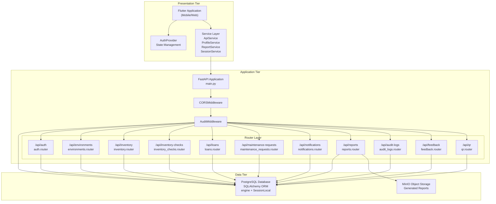
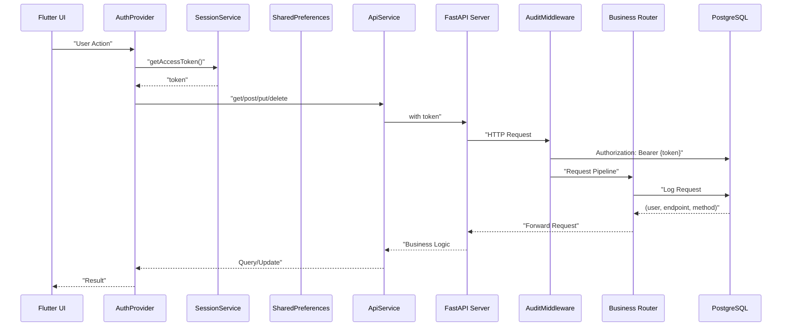
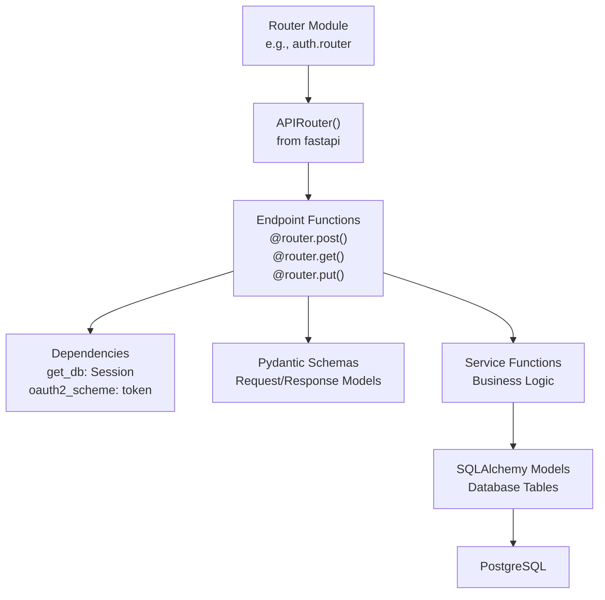
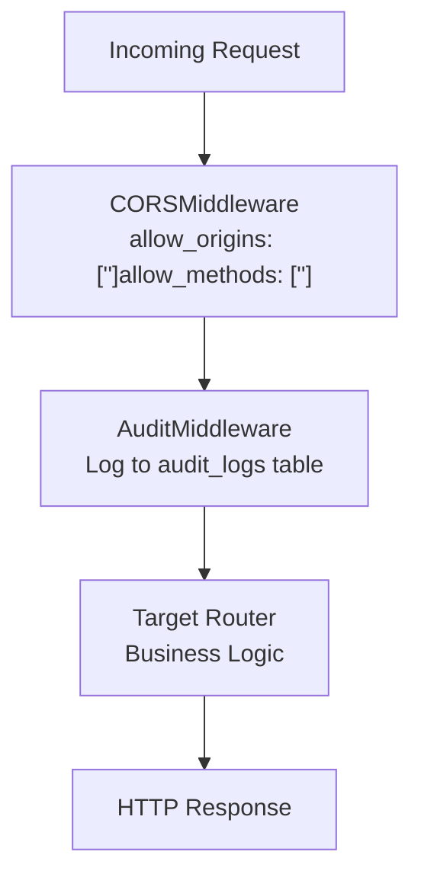
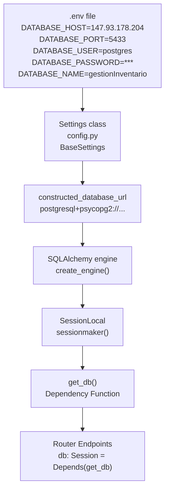

# System Architecture

> **Relevant source files**
> * [client/lib/core/constants/api_constants.dart](https://github.com/axchisan/GestionInventarioSENA/blob/a6b12d01/client/lib/core/constants/api_constants.dart)
> * [client/lib/core/services/profile_service.dart](https://github.com/axchisan/GestionInventarioSENA/blob/a6b12d01/client/lib/core/services/profile_service.dart)
> * [client/lib/core/services/session_service.dart](https://github.com/axchisan/GestionInventarioSENA/blob/a6b12d01/client/lib/core/services/session_service.dart)
> * [client/lib/presentation/screens/qr/qr_code_generator_screen.dart](https://github.com/axchisan/GestionInventarioSENA/blob/a6b12d01/client/lib/presentation/screens/qr/qr_code_generator_screen.dart)
> * [server/.env](https://github.com/axchisan/GestionInventarioSENA/blob/a6b12d01/server/.env)
> * [server/.gitignore](https://github.com/axchisan/GestionInventarioSENA/blob/a6b12d01/server/.gitignore)
> * [server/app/config.py](https://github.com/axchisan/GestionInventarioSENA/blob/a6b12d01/server/app/config.py)
> * [server/app/database.py](https://github.com/axchisan/GestionInventarioSENA/blob/a6b12d01/server/app/database.py)
> * [server/app/main.py](https://github.com/axchisan/GestionInventarioSENA/blob/a6b12d01/server/app/main.py)
> * [server/app/routers/auth.py](https://github.com/axchisan/GestionInventarioSENA/blob/a6b12d01/server/app/routers/auth.py)
> * [server/app/schemas/user.py](https://github.com/axchisan/GestionInventarioSENA/blob/a6b12d01/server/app/schemas/user.py)
> * [server/app/services/auth_service.py](https://github.com/axchisan/GestionInventarioSENA/blob/a6b12d01/server/app/services/auth_service.py)
> * [server/docker-compose.yml](https://github.com/axchisan/GestionInventarioSENA/blob/a6b12d01/server/docker-compose.yml)

## Purpose and Scope

This document describes the high-level architecture of the SENA Inventory Management System, covering the three-tier structure consisting of the Flutter client application, FastAPI backend server, and data persistence layer. It explains how these major components are organized, how they communicate, and how the system is deployed.

For details on specific subsystems, see:

* Client application structure and state management: [Client Application (Flutter)](/axchisan/GestionInventarioSENA/2.1-client-application-(flutter))
* Backend API implementation details: [Backend API (FastAPI)](/axchisan/GestionInventarioSENA/2.2-backend-api-(fastapi))
* Deployment and configuration specifics: [Deployment & Configuration](/axchisan/GestionInventarioSENA/2.3-deployment-and-configuration)
* Authentication and authorization mechanisms: [Authentication & Authorization](/axchisan/GestionInventarioSENA/3-authentication-and-authorization)

---

## System Overview

The SENA Inventory Management System follows a three-tier architecture pattern with clear separation between presentation, business logic, and data layers. The client is built with Flutter for cross-platform support (mobile and web), the backend uses FastAPI for high-performance REST API services, and PostgreSQL serves as the primary relational database.

### Three-Tier Architecture Diagram



**Sources:** [server/app/main.py L1-L44](https://github.com/axchisan/GestionInventarioSENA/blob/a6b12d01/server/app/main.py#L1-L44)

 [client/lib/core/constants/api_constants.dart L1-L19](https://github.com/axchisan/GestionInventarioSENA/blob/a6b12d01/client/lib/core/constants/api_constants.dart#L1-L19)

---

## Communication Architecture

The client and server communicate via HTTP REST APIs over HTTPS. All API endpoints are prefixed with `/api/` and organized by domain.

### API Endpoint Structure

| Endpoint Prefix | Router Module | Purpose |
| --- | --- | --- |
| `/api/auth` | `auth.router` | Authentication and user profile management |
| `/api/environments` | `environments.router` | Physical location management |
| `/api/inventory` | `inventory.router` | Inventory item CRUD operations |
| `/api/inventory-checks` | `inventory_checks.router` | Verification workflow operations |
| `/api/loans` | `loans.router` | Equipment loan management |
| `/api/maintenance-requests` | `maintenance_requests.router` | Maintenance request workflow |
| `/api/notifications` | `notifications.router` | User notification delivery |
| `/api/reports` | `reports.router` | Report generation and retrieval |
| `/api/audit-logs` | `audit_logs.router` | Audit trail access |
| `/api/feedback` | `feedback.router` | User feedback collection |
| `/api/qr` | `qr.router` | QR code generation |
| `/api/stats` | `stats.router` | Statistical data aggregation |

**Sources:** [server/app/main.py L21-L39](https://github.com/axchisan/GestionInventarioSENA/blob/a6b12d01/server/app/main.py#L21-L39)

 [client/lib/core/constants/api_constants.dart L1-L18](https://github.com/axchisan/GestionInventarioSENA/blob/a6b12d01/client/lib/core/constants/api_constants.dart#L1-L18)

### Client-Server Communication Flow



**Sources:** [client/lib/core/services/session_service.dart L1-L65](https://github.com/axchisan/GestionInventarioSENA/blob/a6b12d01/client/lib/core/services/session_service.dart#L1-L65)

 [server/app/main.py L18](https://github.com/axchisan/GestionInventarioSENA/blob/a6b12d01/server/app/main.py#L18-L18)

 [server/app/middleware/audit_middleware.py](https://github.com/axchisan/GestionInventarioSENA/blob/a6b12d01/server/app/middleware/audit_middleware.py)

---

## Backend Architecture

The FastAPI backend is organized as a modular application with clear separation of concerns through routers, middleware, and services.

### FastAPI Application Initialization

The main application entry point is `server/app/main.py`, which:

1. Creates the `FastAPI` application instance [server/app/main.py L7](https://github.com/axchisan/GestionInventarioSENA/blob/a6b12d01/server/app/main.py#L7-L7)
2. Configures CORS middleware for cross-origin requests [server/app/main.py L10-L16](https://github.com/axchisan/GestionInventarioSENA/blob/a6b12d01/server/app/main.py#L10-L16)
3. Adds `AuditMiddleware` for automatic request logging [server/app/main.py L18](https://github.com/axchisan/GestionInventarioSENA/blob/a6b12d01/server/app/main.py#L18-L18)
4. Registers all domain-specific routers with path prefixes [server/app/main.py L21-L39](https://github.com/axchisan/GestionInventarioSENA/blob/a6b12d01/server/app/main.py#L21-L39)

### Router Organization

Each router module follows a consistent pattern:



**Example: Authentication Router Structure**

The `auth.router` demonstrates this pattern [server/app/routers/auth.py L1-L156](https://github.com/axchisan/GestionInventarioSENA/blob/a6b12d01/server/app/routers/auth.py#L1-L156)

:

* Defines `APIRouter` with tag `["auth"]` [server/app/routers/auth.py L16](https://github.com/axchisan/GestionInventarioSENA/blob/a6b12d01/server/app/routers/auth.py#L16-L16)
* Configures `OAuth2PasswordBearer` for token extraction [server/app/routers/auth.py L18](https://github.com/axchisan/GestionInventarioSENA/blob/a6b12d01/server/app/routers/auth.py#L18-L18)
* Implements endpoints: * `POST /login` - authenticates user, returns JWT [server/app/routers/auth.py L20-L22](https://github.com/axchisan/GestionInventarioSENA/blob/a6b12d01/server/app/routers/auth.py#L20-L22) * `POST /register` - creates new user account [server/app/routers/auth.py L24-L51](https://github.com/axchisan/GestionInventarioSENA/blob/a6b12d01/server/app/routers/auth.py#L24-L51) * `GET /me` - retrieves current user from token [server/app/routers/auth.py L53-L76](https://github.com/axchisan/GestionInventarioSENA/blob/a6b12d01/server/app/routers/auth.py#L53-L76) * `PUT /me` - updates user profile [server/app/routers/auth.py L78-L114](https://github.com/axchisan/GestionInventarioSENA/blob/a6b12d01/server/app/routers/auth.py#L78-L114) * `POST /me/change-password` - changes password [server/app/routers/auth.py L116-L155](https://github.com/axchisan/GestionInventarioSENA/blob/a6b12d01/server/app/routers/auth.py#L116-L155)

**Sources:** [server/app/routers/auth.py L1-L156](https://github.com/axchisan/GestionInventarioSENA/blob/a6b12d01/server/app/routers/auth.py#L1-L156)

 [server/app/main.py L21-L39](https://github.com/axchisan/GestionInventarioSENA/blob/a6b12d01/server/app/main.py#L21-L39)

### Middleware Pipeline

Requests pass through middleware in the order they are added to the application:



* **CORSMiddleware**: Configured to allow all origins, credentials, methods, and headers [server/app/main.py L10-L16](https://github.com/axchisan/GestionInventarioSENA/blob/a6b12d01/server/app/main.py#L10-L16)
* **AuditMiddleware**: Custom middleware that logs all requests for compliance tracking [server/app/main.py L18](https://github.com/axchisan/GestionInventarioSENA/blob/a6b12d01/server/app/main.py#L18-L18)

**Sources:** [server/app/main.py L10-L18](https://github.com/axchisan/GestionInventarioSENA/blob/a6b12d01/server/app/main.py#L10-L18)

 [server/app/middleware/audit_middleware.py](https://github.com/axchisan/GestionInventarioSENA/blob/a6b12d01/server/app/middleware/audit_middleware.py)

---

## Data Layer

### Database Configuration

Database connection is managed through `server/app/config.py` and `server/app/database.py`.

**Configuration Class** [server/app/config.py L3-L26](https://github.com/axchisan/GestionInventarioSENA/blob/a6b12d01/server/app/config.py#L3-L26)

:

* `Settings` class extends `pydantic_settings.BaseSettings`
* Loads configuration from `.env` file
* Key settings: * `DATABASE_HOST`, `DATABASE_PORT`, `DATABASE_USER`, `DATABASE_PASSWORD`, `DATABASE_NAME` * `SECRET_KEY` for JWT signing * `ALGORITHM` (default: "HS256") * `ACCESS_TOKEN_EXPIRE` (default: 30 minutes) * `APP_PORT` (default: 8001)
* Property `constructed_database_url` builds PostgreSQL connection string [server/app/config.py L22-L25](https://github.com/axchisan/GestionInventarioSENA/blob/a6b12d01/server/app/config.py#L22-L25)

**Database Connection** [server/app/database.py L1-L18](https://github.com/axchisan/GestionInventarioSENA/blob/a6b12d01/server/app/database.py#L1-L18)

:

```
SQLALCHEMY_DATABASE_URL = settings.constructed_database_url
engine = create_engine(SQLALCHEMY_DATABASE_URL)
SessionLocal = sessionmaker(autocommit=False, autoflush=False, bind=engine)
Base = declarative_base()
```

The `get_db()` dependency function provides database sessions to endpoint handlers [server/app/database.py L13-L18](https://github.com/axchisan/GestionInventarioSENA/blob/a6b12d01/server/app/database.py#L13-L18)

### Database Connection Diagram



**Sources:** [server/app/config.py L1-L27](https://github.com/axchisan/GestionInventarioSENA/blob/a6b12d01/server/app/config.py#L1-L27)

 [server/app/database.py L1-L18](https://github.com/axchisan/GestionInventarioSENA/blob/a6b12d01/server/app/database.py#L1-L18)

 [server/.env L1-L7](https://github.com/axchisan/GestionInventarioSENA/blob/a6b12d01/server/.env#L1-L7)

### ORM and Data Models

All database tables are defined as SQLAlchemy models inheriting from `Base = declarative_base()`. Examples include:

* `User` - user accounts and authentication
* `Environment` - physical locations
* `InventoryItem` - equipment and materials
* `InventoryCheck` - verification records
* `MaintenanceRequest` - repair requests
* `Loan` - equipment borrowing
* `Notification` - user alerts
* `AuditLog` - compliance tracking

Each router imports relevant models and uses the `db: Session` dependency to query and persist data.

**Sources:** [server/app/database.py L11](https://github.com/axchisan/GestionInventarioSENA/blob/a6b12d01/server/app/database.py#L11-L11)

 [server/app/models/](https://github.com/axchisan/GestionInventarioSENA/blob/a6b12d01/server/app/models/)

---

## Deployment Architecture

### Docker-based Deployment

The backend is containerized using Docker for consistent deployment across environments.

**Docker Compose Configuration** [server/docker-compose.yml L1-L20](https://github.com/axchisan/GestionInventarioSENA/blob/a6b12d01/server/docker-compose.yml#L1-L20)

:

```yaml
services:
  backend:
    build:
      context: .
      dockerfile: Dockerfile
    ports:
      - "8001:8001"
    environment:
      - APP_PORT=8001
    volumes:
      - .:/app
    networks:
      - app-network
```

The application:

* Exposes port 8001 for HTTP traffic
* Mounts the current directory as `/app` for development
* Uses a bridge network for container communication
* Implements restart policy on failure

**Sources:** [server/docker-compose.yml L1-L20](https://github.com/axchisan/GestionInventarioSENA/blob/a6b12d01/server/docker-compose.yml#L1-L20)

### Environment Configuration

Configuration is managed through environment variables loaded from `.env` file [server/app/config.py L17](https://github.com/axchisan/GestionInventarioSENA/blob/a6b12d01/server/app/config.py#L17-L17)

:

| Variable | Purpose | Example Value |
| --- | --- | --- |
| `DATABASE_HOST` | PostgreSQL server address | `147.93.178.204` |
| `DATABASE_PORT` | PostgreSQL port | `5433` |
| `DATABASE_USER` | Database username | `postgres` |
| `DATABASE_PASSWORD` | Database password | `***` |
| `DATABASE_NAME` | Database name | `gestionInventario` |
| `SECRET_KEY` | JWT signing key | `7d3a9b2c...` |
| `ALGORITHM` | JWT algorithm | `HS256` |
| `ACCESS_TOKEN_EXPIRE` | Token expiration (minutes) | `30` |
| `APP_PORT` | Application port | `8001` |

The `.env` file is excluded from version control via `.gitignore` [server/.gitignore L9-L10](https://github.com/axchisan/GestionInventarioSENA/blob/a6b12d01/server/.gitignore#L9-L10)

 to protect sensitive credentials.

**Sources:** [server/app/config.py L3-L27](https://github.com/axchisan/GestionInventarioSENA/blob/a6b12d01/server/app/config.py#L3-L27)

 [server/.env L1-L7](https://github.com/axchisan/GestionInventarioSENA/blob/a6b12d01/server/.env#L1-L7)

 [server/.gitignore L9-L10](https://github.com/axchisan/GestionInventarioSENA/blob/a6b12d01/server/.gitignore#L9-L10)

### Client Deployment Configuration

The Flutter client is configured to communicate with the production backend URL:

```javascript
const String baseUrl = 'https://senainventario.axchisan.com';
```

All API endpoints are defined as constants relative to this base URL [client/lib/core/constants/api_constants.dart L1-L18](https://github.com/axchisan/GestionInventarioSENA/blob/a6b12d01/client/lib/core/constants/api_constants.dart#L1-L18)

**Sources:** [client/lib/core/constants/api_constants.dart L1](https://github.com/axchisan/GestionInventarioSENA/blob/a6b12d01/client/lib/core/constants/api_constants.dart#L1-L1)

---

## Session and State Management

### Client-Side Session Persistence

The `SessionService` class manages authentication state using `SharedPreferences` for persistent storage [client/lib/core/services/session_service.dart L1-L65](https://github.com/axchisan/GestionInventarioSENA/blob/a6b12d01/client/lib/core/services/session_service.dart#L1-L65)

:

**Stored Session Data:**

* `auth_token` - JWT access token [client/lib/core/services/session_service.dart L6](https://github.com/axchisan/GestionInventarioSENA/blob/a6b12d01/client/lib/core/services/session_service.dart#L6-L6)
* `user_role` - user's role for authorization [client/lib/core/services/session_service.dart L7](https://github.com/axchisan/GestionInventarioSENA/blob/a6b12d01/client/lib/core/services/session_service.dart#L7-L7)
* `user_data` - serialized user information [client/lib/core/services/session_service.dart L8](https://github.com/axchisan/GestionInventarioSENA/blob/a6b12d01/client/lib/core/services/session_service.dart#L8-L8)
* `token_expires_at` - expiration timestamp [client/lib/core/services/session_service.dart L9](https://github.com/axchisan/GestionInventarioSENA/blob/a6b12d01/client/lib/core/services/session_service.dart#L9-L9)

**Key Methods:**

* `saveSession()` - persists authentication data [client/lib/core/services/session_service.dart L11-L22](https://github.com/axchisan/GestionInventarioSENA/blob/a6b12d01/client/lib/core/services/session_service.dart#L11-L22)
* `clear()` - removes all session data [client/lib/core/services/session_service.dart L24-L30](https://github.com/axchisan/GestionInventarioSENA/blob/a6b12d01/client/lib/core/services/session_service.dart#L24-L30)
* `hasValidSession()` - validates token expiration using `JwtDecoder` [client/lib/core/services/session_service.dart L32-L43](https://github.com/axchisan/GestionInventarioSENA/blob/a6b12d01/client/lib/core/services/session_service.dart#L32-L43)
* `getAccessToken()` - retrieves token for API requests [client/lib/core/services/session_service.dart L50-L53](https://github.com/axchisan/GestionInventarioSENA/blob/a6b12d01/client/lib/core/services/session_service.dart#L50-L53)

### State Management Pattern

The application uses the Provider pattern for state management with `AuthProvider` as the central authentication state container. The `AuthProvider`:

1. Wraps `SessionService` for persistence
2. Notifies listeners on authentication state changes
3. Provides current user and role to the widget tree
4. Manages login/logout lifecycle

**Sources:** [client/lib/core/services/session_service.dart L1-L65](https://github.com/axchisan/GestionInventarioSENA/blob/a6b12d01/client/lib/core/services/session_service.dart#L1-L65)

 [client/lib/presentation/providers/auth_provider.dart](https://github.com/axchisan/GestionInventarioSENA/blob/a6b12d01/client/lib/presentation/providers/auth_provider.dart)

---

## Security Architecture

### JWT Authentication Flow

```mermaid
sequenceDiagram
  participant Flutter Client
  participant POST /api/auth/login
  participant auth.router
  participant authenticate_user()
  participant auth_service.py
  participant verify_password()
  participant create_access_token()
  participant security.py
  participant PostgreSQL
  participant users table

  Flutter Client->>POST /api/auth/login: "POST /login
  POST /api/auth/login->>authenticate_user(): {email, password}"
  authenticate_user()->>PostgreSQL: "authenticate_user(db, login_request)"
  PostgreSQL-->>authenticate_user(): "SELECT * FROM users WHERE email = ?"
  authenticate_user()->>verify_password(): "User record"
  verify_password()-->>authenticate_user(): "verify_password(password, user.password_hash)"
  loop ["Valid Credentials"]
    authenticate_user()->>verify_password(): "True/False"
    verify_password()-->>authenticate_user(): "create_access_token({sub: user_id, role: role})"
    authenticate_user()->>PostgreSQL: "JWT token"
    authenticate_user()-->>POST /api/auth/login: "UPDATE users SET last_login = NOW()"
    POST /api/auth/login-->>Flutter Client: "TokenResponse(access_token, user)"
    authenticate_user()-->>POST /api/auth/login: "200 OK
    POST /api/auth/login-->>Flutter Client: {access_token, token_type, user}"
  end
```

**Token Structure:**

* Algorithm: HS256 [server/app/config.py L12](https://github.com/axchisan/GestionInventarioSENA/blob/a6b12d01/server/app/config.py#L12-L12)
* Payload: `{"sub": user_id, "role": user_role}`
* Expiration: 30 minutes [server/app/config.py L13](https://github.com/axchisan/GestionInventarioSENA/blob/a6b12d01/server/app/config.py#L13-L13)
* Signed with `SECRET_KEY` from environment

**Sources:** [server/app/routers/auth.py L20-L22](https://github.com/axchisan/GestionInventarioSENA/blob/a6b12d01/server/app/routers/auth.py#L20-L22)

 [server/app/services/auth_service.py L9-L55](https://github.com/axchisan/GestionInventarioSENA/blob/a6b12d01/server/app/services/auth_service.py#L9-L55)

 [server/app/utils/security.py](https://github.com/axchisan/GestionInventarioSENA/blob/a6b12d01/server/app/utils/security.py)

### Authorization Pattern

All protected endpoints use the `oauth2_scheme` dependency to extract and validate JWT tokens [server/app/routers/auth.py L18](https://github.com/axchisan/GestionInventarioSENA/blob/a6b12d01/server/app/routers/auth.py#L18-L18)

:

```python
oauth2_scheme = OAuth2PasswordBearer(tokenUrl="/api/auth/login")

@router.get("/me")
async def get_current_user(token: str = Depends(oauth2_scheme), db: Session = Depends(get_db)):
    payload = jwt.decode(token, settings.SECRET_KEY, algorithms=[settings.ALGORITHM])
    user_id: str = payload.get("sub")
    role: str = payload.get("role")
    # ... validate and retrieve user
```

Role-based access control is implemented at the router level, with each endpoint checking the user's role against allowed roles for that operation.

**Sources:** [server/app/routers/auth.py L18](https://github.com/axchisan/GestionInventarioSENA/blob/a6b12d01/server/app/routers/auth.py#L18-L18)

 [server/app/routers/auth.py L53-L76](https://github.com/axchisan/GestionInventarioSENA/blob/a6b12d01/server/app/routers/auth.py#L53-L76)

---

## Summary

The SENA Inventory Management System implements a clean three-tier architecture:

1. **Presentation Tier**: Flutter application with Provider-based state management and persistent sessions
2. **Application Tier**: FastAPI backend with router-based modular organization and middleware pipeline
3. **Data Tier**: PostgreSQL database accessed through SQLAlchemy ORM with MinIO for file storage

Key architectural principles:

* **Separation of Concerns**: Clear boundaries between UI, business logic, and data access
* **RESTful API Design**: HTTP-based communication with standardized endpoint structure
* **Stateless Server**: JWT-based authentication with no server-side session storage
* **Audit Trail**: Automatic request logging through middleware for compliance
* **Environment-based Configuration**: Externalized configuration through `.env` files
* **Containerized Deployment**: Docker-based deployment for consistency

For detailed information on specific subsystems, refer to the child pages: [Client Application](/axchisan/GestionInventarioSENA/2.1-client-application-(flutter)), [Backend API](/axchisan/GestionInventarioSENA/2.2-backend-api-(fastapi)), and [Deployment & Configuration](/axchisan/GestionInventarioSENA/2.3-deployment-and-configuration).

**Sources:** [server/app/main.py L1-L44](https://github.com/axchisan/GestionInventarioSENA/blob/a6b12d01/server/app/main.py#L1-L44)

 [client/lib/core/constants/api_constants.dart L1-L19](https://github.com/axchisan/GestionInventarioSENA/blob/a6b12d01/client/lib/core/constants/api_constants.dart#L1-L19)

 [server/app/config.py L1-L27](https://github.com/axchisan/GestionInventarioSENA/blob/a6b12d01/server/app/config.py#L1-L27)

 [server/app/database.py L1-L18](https://github.com/axchisan/GestionInventarioSENA/blob/a6b12d01/server/app/database.py#L1-L18)