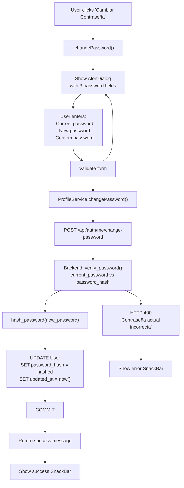
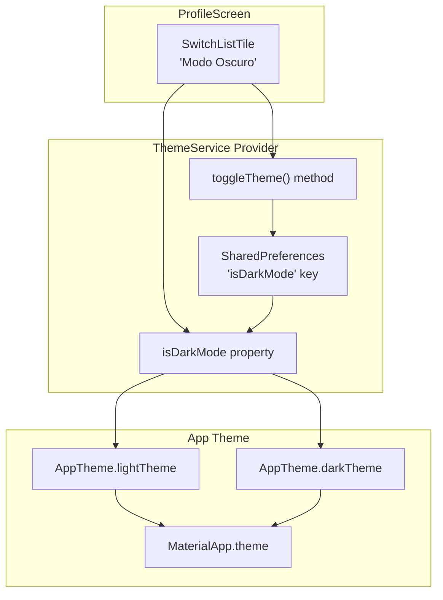
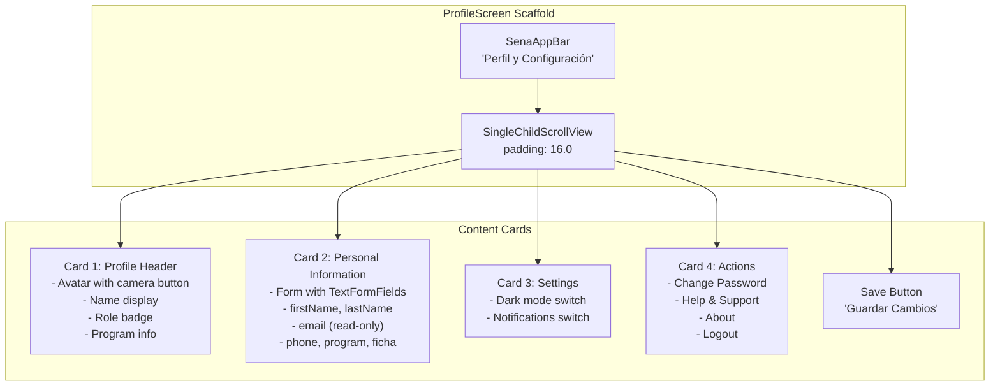
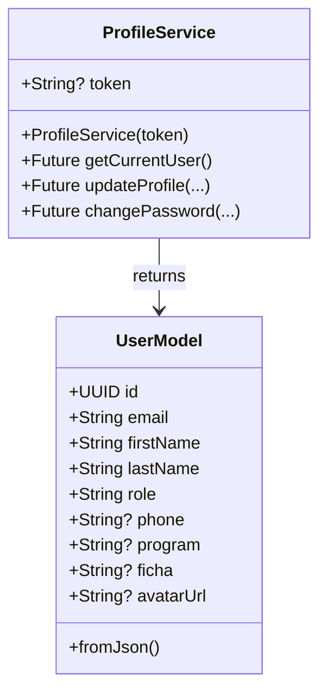

# User Profile & Settings

> **Relevant source files**
> * [client/lib/core/services/profile_service.dart](https://github.com/axchisan/GestionInventarioSENA/blob/a6b12d01/client/lib/core/services/profile_service.dart)
> * [client/lib/presentation/screens/profile/profile_screen.dart](https://github.com/axchisan/GestionInventarioSENA/blob/a6b12d01/client/lib/presentation/screens/profile/profile_screen.dart)
> * [client/lib/presentation/screens/qr/qr_scan_screen.dart](https://github.com/axchisan/GestionInventarioSENA/blob/a6b12d01/client/lib/presentation/screens/qr/qr_scan_screen.dart)
> * [server/app/routers/auth.py](https://github.com/axchisan/GestionInventarioSENA/blob/a6b12d01/server/app/routers/auth.py)
> * [server/app/schemas/user.py](https://github.com/axchisan/GestionInventarioSENA/blob/a6b12d01/server/app/schemas/user.py)
> * [server/app/services/auth_service.py](https://github.com/axchisan/GestionInventarioSENA/blob/a6b12d01/server/app/services/auth_service.py)

## Purpose and Scope

This document describes the user profile management and application settings functionality in the SENA Inventory Management System. It covers how users can view and update their personal information, change their password, and configure application preferences such as theme settings.

For information about user authentication and login, see [Authentication & Authorization](/axchisan/GestionInventarioSENA/3-authentication-and-authorization). For user management and role administration performed by administrators, see [Role-Based Access Control](/axchisan/GestionInventarioSENA/3.3-role-based-access-control).

## Overview

The profile and settings system allows authenticated users to:

* View their complete profile information including role and environment assignment
* Update personal details (name, phone, program, ficha)
* Change their password securely
* Configure application settings (dark mode theme)
* Access help and support information
* Logout from the application

All profile operations require an authenticated user with a valid JWT token. The system prevents modification of critical fields like email and role through the profile interface.

**Sources:** [client/lib/presentation/screens/profile/profile_screen.dart L1-L779](https://github.com/axchisan/GestionInventarioSENA/blob/a6b12d01/client/lib/presentation/screens/profile/profile_screen.dart#L1-L779)

## Profile Data Model

The user profile contains the following fields:

| Field | Type | Editable | Description |
| --- | --- | --- | --- |
| `id` | UUID | No | Unique user identifier |
| `email` | EmailStr | No | User email (login credential) |
| `first_name` | string | Yes | User's first name |
| `last_name` | string | Yes | User's last name |
| `role` | string | No | User role (student, instructor, supervisor, admin, admin_general) |
| `phone` | string | Yes | Contact phone number (optional) |
| `program` | string | Yes | SENA training program (optional) |
| `ficha` | string | Yes | Training group/cohort number (optional) |
| `avatar_url` | string | Yes | Profile picture URL (optional) |
| `environment_id` | UUID | No | Assigned environment (modified separately) |
| `is_active` | boolean | No | Account active status |
| `last_login` | datetime | No | Last login timestamp |
| `created_at` | datetime | No | Account creation timestamp |
| `updated_at` | datetime | No | Last update timestamp |

**Sources:** [server/app/schemas/user.py L6-L28](https://github.com/axchisan/GestionInventarioSENA/blob/a6b12d01/server/app/schemas/user.py#L6-L28)

 [server/app/schemas/user.py L42-L48](https://github.com/axchisan/GestionInventarioSENA/blob/a6b12d01/server/app/schemas/user.py#L42-L48)

## Profile Management Flow

### Retrieving Current User Profile

```mermaid
sequenceDiagram
  participant ProfileScreen
  participant ProfileService
  participant AuthProvider
  participant /api/auth/me
  participant PostgreSQL

  ProfileScreen->>AuthProvider: Get token
  AuthProvider-->>ProfileScreen: JWT token
  ProfileScreen->>ProfileService: getCurrentUser()
  ProfileService->>/api/auth/me: GET /api/auth/me
  /api/auth/me->>/api/auth/me: Authorization: Bearer {token}
  /api/auth/me->>PostgreSQL: jwt.decode(token)
  PostgreSQL-->>/api/auth/me: SELECT User WHERE id = user_id
  /api/auth/me-->>ProfileService: User record
  ProfileService-->>ProfileScreen: UserResponse JSON
  ProfileScreen->>ProfileScreen: UserModel object
```

The profile retrieval process:

1. **Client Initialization** - `ProfileScreen` loads in `initState()` and calls `_loadUserData()`
2. **Token Retrieval** - Gets JWT token from `AuthProvider`
3. **API Request** - `ProfileService.getCurrentUser()` sends GET request to `/api/auth/me`
4. **Token Validation** - Backend decodes JWT token and extracts `user_id` from the `sub` claim
5. **Database Query** - Retrieves user record from database
6. **Response** - Returns `UserResponse` with all profile fields
7. **UI Update** - Populates text field controllers with user data

**Sources:** [client/lib/presentation/screens/profile/profile_screen.dart L38-L66](https://github.com/axchisan/GestionInventarioSENA/blob/a6b12d01/client/lib/presentation/screens/profile/profile_screen.dart#L38-L66)

 [client/lib/core/services/profile_service.dart L11-L30](https://github.com/axchisan/GestionInventarioSENA/blob/a6b12d01/client/lib/core/services/profile_service.dart#L11-L30)

 [server/app/routers/auth.py L53-L76](https://github.com/axchisan/GestionInventarioSENA/blob/a6b12d01/server/app/routers/auth.py#L53-L76)

### Updating Profile Information

```mermaid
sequenceDiagram
  participant User
  participant ProfileScreen
  participant ProfileService
  participant /api/auth/me PUT
  participant PostgreSQL

  User->>ProfileScreen: Edit form fields
  User->>ProfileScreen: Click "Guardar Cambios"
  ProfileScreen->>ProfileScreen: Validate form
  ProfileScreen->>ProfileService: updateProfile(firstName, lastName, ...)
  ProfileService->>/api/auth/me PUT: PUT /api/auth/me
  /api/auth/me PUT->>/api/auth/me PUT: Body: ProfileUpdateRequest
  /api/auth/me PUT->>PostgreSQL: Decode JWT token
  /api/auth/me PUT->>PostgreSQL: SELECT User WHERE id = user_id
  /api/auth/me PUT->>PostgreSQL: UPDATE User SET fields
  PostgreSQL-->>/api/auth/me PUT: SET updated_at = now()
  /api/auth/me PUT-->>ProfileService: COMMIT
  ProfileService-->>ProfileScreen: Updated User record
  ProfileScreen->>ProfileScreen: UserResponse
  ProfileScreen->>User: Updated UserModel
```

The profile update process implements partial updates using `ProfileUpdateRequest`:

1. **Form Validation** - Validates required fields (first_name, last_name)
2. **Data Collection** - Collects only modified fields into update map
3. **API Call** - `ProfileService.updateProfile()` sends PUT request with `ProfileUpdateRequest`
4. **Backend Processing** - [server/app/routers/auth.py L78-L114](https://github.com/axchisan/GestionInventarioSENA/blob/a6b12d01/server/app/routers/auth.py#L78-L114) * Validates JWT token * Queries user by ID * Updates only provided fields using `dict(exclude_unset=True)` * Sets `updated_at` timestamp * Commits transaction
5. **Session Refresh** - Calls `authProvider.checkSession()` to update cached user data
6. **UI Feedback** - Shows success message via SnackBar

**Sources:** [client/lib/presentation/screens/profile/profile_screen.dart L718-L767](https://github.com/axchisan/GestionInventarioSENA/blob/a6b12d01/client/lib/presentation/screens/profile/profile_screen.dart#L718-L767)

 [client/lib/core/services/profile_service.dart L32-L68](https://github.com/axchisan/GestionInventarioSENA/blob/a6b12d01/client/lib/core/services/profile_service.dart#L32-L68)

 [server/app/routers/auth.py L78-L114](https://github.com/axchisan/GestionInventarioSENA/blob/a6b12d01/server/app/routers/auth.py#L78-L114)

## Password Management

### Password Change Flow



The password change implementation includes several security measures:

1. **Current Password Verification** - Backend verifies the user knows their current password before allowing change [server/app/routers/auth.py L144-L148](https://github.com/axchisan/GestionInventarioSENA/blob/a6b12d01/server/app/routers/auth.py#L144-L148)
2. **Client-Side Validation** - Ensures: * All fields are filled [client/lib/presentation/screens/profile/profile_screen.dart L531-L536](https://github.com/axchisan/GestionInventarioSENA/blob/a6b12d01/client/lib/presentation/screens/profile/profile_screen.dart#L531-L536) * New password is at least 6 characters [client/lib/presentation/screens/profile/profile_screen.dart L547-L555](https://github.com/axchisan/GestionInventarioSENA/blob/a6b12d01/client/lib/presentation/screens/profile/profile_screen.dart#L547-L555) * New password matches confirmation [client/lib/presentation/screens/profile/profile_screen.dart L566-L574](https://github.com/axchisan/GestionInventarioSENA/blob/a6b12d01/client/lib/presentation/screens/profile/profile_screen.dart#L566-L574)
3. **Secure Hashing** - New password is hashed using `hash_password()` utility before storage [server/app/routers/auth.py L151](https://github.com/axchisan/GestionInventarioSENA/blob/a6b12d01/server/app/routers/auth.py#L151-L151)
4. **Transaction Safety** - Database commit ensures atomic update
5. **Timestamp Update** - Updates `updated_at` field for audit purposes

**Sources:** [client/lib/presentation/screens/profile/profile_screen.dart L508-L623](https://github.com/axchisan/GestionInventarioSENA/blob/a6b12d01/client/lib/presentation/screens/profile/profile_screen.dart#L508-L623)

 [client/lib/core/services/profile_service.dart L70-L94](https://github.com/axchisan/GestionInventarioSENA/blob/a6b12d01/client/lib/core/services/profile_service.dart#L70-L94)

 [server/app/routers/auth.py L116-L156](https://github.com/axchisan/GestionInventarioSENA/blob/a6b12d01/server/app/routers/auth.py#L116-L156)

## Application Settings

### Theme Management

The application supports dark mode toggle through the `ThemeService`:



The theme setting persists across app sessions:

* **UI Component**: `Consumer<ThemeService>` wraps the dark mode switch [client/lib/presentation/screens/profile/profile_screen.dart L323-L336](https://github.com/axchisan/GestionInventarioSENA/blob/a6b12d01/client/lib/presentation/screens/profile/profile_screen.dart#L323-L336)
* **State Management**: `ThemeService` provider holds `isDarkMode` state
* **Persistence**: `SharedPreferences` stores the preference locally
* **Application**: `MaterialApp` applies `AppTheme.lightTheme` or `AppTheme.darkTheme` based on state

### Notification Preferences

The notification toggle is a local state variable that demonstrates the settings pattern:

```javascript
// Local state in ProfileScreen
bool _notificationsEnabled = true;

// UI component
SwitchListTile(
  title: const Text('Notificaciones'),
  subtitle: const Text('Recibir notificaciones de la app'),
  value: _notificationsEnabled,
  onChanged: (value) {
    setState(() {
      _notificationsEnabled = value;
    });
    // Show feedback
  },
)
```

**Note**: This is a UI-only toggle. For actual notification system integration, see [Notification System](/axchisan/GestionInventarioSENA/11-notification-system).

**Sources:** [client/lib/presentation/screens/profile/profile_screen.dart L323-L361](https://github.com/axchisan/GestionInventarioSENA/blob/a6b12d01/client/lib/presentation/screens/profile/profile_screen.dart#L323-L361)

## Profile Screen UI Components

### Screen Layout Structure



### Key UI Features

**Profile Avatar Section**:

* Displays circular avatar with SENA logo border [client/lib/presentation/screens/profile/profile_screen.dart L114-L156](https://github.com/axchisan/GestionInventarioSENA/blob/a6b12d01/client/lib/presentation/screens/profile/profile_screen.dart#L114-L156)
* Camera button overlay for changing picture (functionality pending)
* Falls back to SENA logo if `avatar_url` is null or fails to load

**Role Display**:

* Converts role code to display name using `_getRoleDisplayName()` [client/lib/presentation/screens/profile/profile_screen.dart L442-L457](https://github.com/axchisan/GestionInventarioSENA/blob/a6b12d01/client/lib/presentation/screens/profile/profile_screen.dart#L442-L457)
* Examples: `'student'` → `'Estudiante SENA'`, `'admin_general'` → `'Administrador General'`

**Form Controllers**:

```
final _firstNameController = TextEditingController();
final _lastNameController = TextEditingController();
final _emailController = TextEditingController();
final _phoneController = TextEditingController();
final _programController = TextEditingController();
final _fichaController = TextEditingController();
```

All controllers are initialized with current user data and disposed properly.

**Sources:** [client/lib/presentation/screens/profile/profile_screen.dart L100-L440](https://github.com/axchisan/GestionInventarioSENA/blob/a6b12d01/client/lib/presentation/screens/profile/profile_screen.dart#L100-L440)

## Backend API Endpoints

### Profile Endpoints Summary

| Endpoint | Method | Auth Required | Description |
| --- | --- | --- | --- |
| `/api/auth/me` | GET | Yes | Retrieve current user profile |
| `/api/auth/me` | PUT | Yes | Update profile information |
| `/api/auth/me/change-password` | POST | Yes | Change user password |

### GET /api/auth/me

**Request**:

```
GET /api/auth/me
Authorization: Bearer {jwt_token}
```

**Response** (200 OK):

```go
{
  "id": "uuid",
  "email": "user@example.com",
  "first_name": "Juan",
  "last_name": "Pérez",
  "role": "student",
  "phone": "+573001234567",
  "program": "Tecnólogo en Análisis y Desarrollo de Software",
  "ficha": "2556789",
  "avatar_url": null,
  "is_active": true,
  "last_login": "2024-01-15T10:30:00Z",
  "created_at": "2023-09-01T08:00:00Z",
  "updated_at": "2024-01-15T10:30:00Z",
  "environment_id": "uuid-or-null"
}
```

**Implementation**: [server/app/routers/auth.py L53-L76](https://github.com/axchisan/GestionInventarioSENA/blob/a6b12d01/server/app/routers/auth.py#L53-L76)

### PUT /api/auth/me

**Request**:

```go
PUT /api/auth/me
Authorization: Bearer {jwt_token}
Content-Type: application/json

{
  "first_name": "Juan",
  "last_name": "Pérez",
  "phone": "+573001234567",
  "program": "Tecnólogo ADSO",
  "ficha": "2556789"
}
```

**Schema**: `ProfileUpdateRequest` - all fields optional [server/app/schemas/user.py L42-L48](https://github.com/axchisan/GestionInventarioSENA/blob/a6b12d01/server/app/schemas/user.py#L42-L48)

**Response** (200 OK): Returns updated `UserResponse`

**Error Responses**:

* 401 Unauthorized: Invalid or expired token
* 404 Not Found: User not found

**Implementation**: [server/app/routers/auth.py L78-L114](https://github.com/axchisan/GestionInventarioSENA/blob/a6b12d01/server/app/routers/auth.py#L78-L114)

### POST /api/auth/me/change-password

**Request**:

```
POST /api/auth/me/change-password
Authorization: Bearer {jwt_token}
Content-Type: application/json

{
  "current_password": "oldPassword123",
  "new_password": "newPassword456"
}
```

**Schema**: `PasswordChangeRequest` [server/app/schemas/user.py L50-L52](https://github.com/axchisan/GestionInventarioSENA/blob/a6b12d01/server/app/schemas/user.py#L50-L52)

**Response** (200 OK):

```json
{
  "message": "Contraseña actualizada exitosamente"
}
```

**Error Responses**:

* 400 Bad Request: Current password incorrect
* 401 Unauthorized: Invalid or expired token
* 404 Not Found: User not found

**Implementation**: [server/app/routers/auth.py L116-L156](https://github.com/axchisan/GestionInventarioSENA/blob/a6b12d01/server/app/routers/auth.py#L116-L156)

## Security Considerations

### Token-Based Authentication

All profile endpoints require JWT authentication:

```yaml
# Token validation pattern in all endpoints
try:
    payload = jwt.decode(token, settings.SECRET_KEY, algorithms=[settings.ALGORITHM])
    user_id: str = payload.get("sub")
    if user_id is None:
        raise HTTPException(status_code=401, detail="Token inválido")
except JWTError:
    raise HTTPException(status_code=401, detail="Token inválido o expirado")
```

**Sources**: [server/app/routers/auth.py L86-L99](https://github.com/axchisan/GestionInventarioSENA/blob/a6b12d01/server/app/routers/auth.py#L86-L99)

### Password Security

1. **Verification**: Current password must be verified before change [server/app/routers/auth.py L144](https://github.com/axchisan/GestionInventarioSENA/blob/a6b12d01/server/app/routers/auth.py#L144-L144)
2. **Hashing**: Uses `hash_password()` utility (bcrypt/argon2) [server/app/routers/auth.py L151](https://github.com/axchisan/GestionInventarioSENA/blob/a6b12d01/server/app/routers/auth.py#L151-L151)
3. **Storage**: Never stores plaintext passwords - only hashes in `password_hash` field
4. **Validation**: Client enforces minimum 6 character length

### Field Protection

Certain fields cannot be modified through the profile endpoints:

* `email` - Login credential, requires separate verification process
* `role` - Must be changed by administrators
* `environment_id` - Modified through QR scan or admin assignment
* `is_active` - Admin-only field

## Integration with Other Systems

### AuthProvider Synchronization

After profile updates, the client refreshes the session to update cached user data:

```sql
// Update auth provider with new user data
await authProvider.checkSession();
```

This ensures:

* Navigation guards have current user data
* Dashboard displays updated name
* Role-based UI elements reflect current state

**Sources**: [client/lib/presentation/screens/profile/profile_screen.dart L742](https://github.com/axchisan/GestionInventarioSENA/blob/a6b12d01/client/lib/presentation/screens/profile/profile_screen.dart#L742-L742)

### Environment Linking

Users can link to environments through QR scanning (see [QR Code System](/axchisan/GestionInventarioSENA/8-qr-code-system)), which updates the `environment_id` field. This is not modifiable through the profile screen.

### Logout Flow

The logout action clears the session and navigates to login:

```
void _logout() {
  showDialog(
    // Confirmation dialog
    onPressed: () async {
      await authProvider.logout();
      Navigator.pushReplacementNamed(context, '/login');
    },
  );
}
```

**Sources**: [client/lib/presentation/screens/profile/profile_screen.dart L688-L716](https://github.com/axchisan/GestionInventarioSENA/blob/a6b12d01/client/lib/presentation/screens/profile/profile_screen.dart#L688-L716)

## Client-Side Service Implementation

### ProfileService Class



The `ProfileService` encapsulates all profile-related HTTP operations:

* **Constructor**: Requires JWT token for authentication
* **HTTP Client**: Uses `package:http` for REST API calls
* **Error Handling**: Parses error responses and throws exceptions with detail messages
* **Type Safety**: Returns strongly-typed `UserModel` objects

**Sources**: [client/lib/core/services/profile_service.dart L1-L96](https://github.com/axchisan/GestionInventarioSENA/blob/a6b12d01/client/lib/core/services/profile_service.dart#L1-L96)

## Additional Features

### Help and Support Dialog

Provides contact information for technical support:

* Email: [axchisan923@gmail.com](mailto:axchisan923@gmail.com)
* Phone: +573183038190
* Hours: Monday-Friday 8:00-17:00

**Sources**: [client/lib/presentation/screens/profile/profile_screen.dart L626-L650](https://github.com/axchisan/GestionInventarioSENA/blob/a6b12d01/client/lib/presentation/screens/profile/profile_screen.dart#L626-L650)

### About Application Dialog

Shows application metadata:

* Application name: "SENA Inventory"
* Version: "1.0.0"
* Developer: DUvan-Axchi
* Description of system purpose

Uses Flutter's built-in `showAboutDialog()` with custom icon.

**Sources**: [client/lib/presentation/screens/profile/profile_screen.dart L652-L686](https://github.com/axchisan/GestionInventarioSENA/blob/a6b12d01/client/lib/presentation/screens/profile/profile_screen.dart#L652-L686)

### Profile Picture Change (Future Feature)

The UI includes a camera button for changing profile pictures with a bottom sheet showing options:

* Take Photo
* Select from Gallery
* Delete Photo

Currently shows "Funcionalidad en desarrollo" message. Implementation would require:

* Image picker integration
* File upload to MinIO storage
* `avatar_url` update via profile API

**Sources**: [client/lib/presentation/screens/profile/profile_screen.dart L459-L506](https://github.com/axchisan/GestionInventarioSENA/blob/a6b12d01/client/lib/presentation/screens/profile/profile_screen.dart#L459-L506)